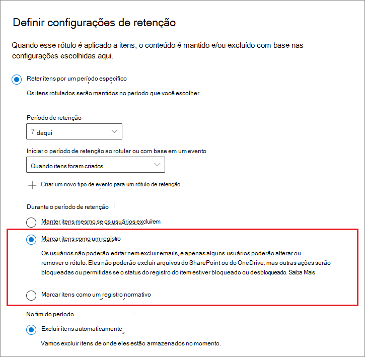

# <a name="declare-records-by-using-retention-labels"></a>Declarar registros usando rótulos de retenção

>*[Diretrizes de licenciamento do Microsoft 365 para segurança e conformidade](https://aka.ms/ComplianceSD).*

Para declarar documentos e emails como [registros](records-management.md#records), use [rótulos de retenção](retention.md#retention-labels) que marquem o conteúdo como um **registro** ou um **registro regulatório**.

> [!NOTE]
> Os registros regulatórios estão no modo de visualização.

Se você não tiver certeza se deseja usar um registro ou um registro normativo, confira [Comparar restrições para quais ações são permitidas ou bloqueadas](records-management.md#compare-restrictions-for-what-actions-are-allowed-or-blocked). Se precisar usar registros regulatórios, primeiro você deve executar um comando do Windows PowerShell, conforme descrito na próxima seção.

Em seguida, você pode publicar esses rótulos em uma política de rótulo de retenção para que os usuários e administradores possam aplicá-los ao conteúdo ou a rótulos que marcam itens como registros (mas não registros regulatórios), aplicam automaticamente esses rótulos ao conteúdo desejado para declarar um registro.

## <a name="how-to-display-the-option-to-mark-content-as-a-regulatory-record"></a>Como exibir a opção para marcar o conteúdo como um registro regulatório

>[!NOTE] 
> O procedimento a seguir é uma ação auditável, registrar em log ** Opção de registro regulatório habilitado para rótulos de retenção** na seção [Política de retenção e atividades de rótulo de retenção](search-the-audit-log-in-security-and-compliance.md#retention-policy-and-retention-label-activities) do log de auditoria.

Por padrão, a opção de rótulo de retenção para marcar o conteúdo como um registro regulatório não é exibida no assistente de etiqueta de retenção. Para exibir essa opção, você deve primeiro executar um comando do Windows PowerShell:

1. [Conecte-se ao Centro de Segurança e Conformidade do Office 365 PowerShell](https://docs.microsoft.com/powershell/exchange/office-365-scc/connect-to-scc-powershell/connect-to-scc-powershell).

2. Execute o seguinte cmdlet:
    
    ```powershell
    Set-RegulatoryComplianceUI -Enabled $true
    ````
    Não há uma solicitação para confirmar e a configuração tem efeito imediatamente.

Se você mudar de ideia sobre como ver essa opção no assistente de etiqueta de retenção, é possível ocultá-la novamente executando o mesmo cmdlet com o **falso** valor: `Set-RegulatoryComplianceUI -Enabled $false` 

## <a name="configuring-retention-labels-to-declare-records"></a>Configurar rótulos de retenção para declarar registros

Ao criar ou editar um rótulo de retenção na solução **Gerenciamento de Registros** no Centro de conformidade do Microsoft 365, você tem a opção de marcar os itens como um registro. Caso tenha executado o comando do Windows PowerShell da seção anterior, você pode marcar os itens como um registro regulatório.

Por exemplo:



Usando esse rótulo de retenção, você pode aplicá-lo a documentos do Microsoft Office SharePoint Online ou do Microsoft OneDrive e a emails do Exchange, conforme necessário. 

Para obter instruções completas:

- [Criar rótulos de retenção e aplicá-los em aplicativos](create-apply-retention-labels.md)

- [Aplicar um rótulo de retenção ao conteúdo automaticamente](apply-retention-labels-automatically.md) (sem suporte para registros regulatórios)


## <a name="applying-the-configured-retention-label-to-content"></a>Aplicando o rótulo de retenção configurado ao conteúdo

Quando os rótulos de retenção que marcam itens como registro ou registro regulatório estão disponíveis para os usuários aplicá-los em aplicativos:

- Para o Exchange, qualquer usuário com acesso de gravação à caixa de correio pode aplicar esses rótulos. 
- Para o SharePoint e OneDrive, qualquer usuário no grupo Membros padrão (o nível de permissão de Contribuição) pode aplicar esses rótulos.

Exemplo de um documento marcado como registro usando um rótulo de retenção:


## <a name="next-steps"></a>Próximas etapas

Para obter uma lista dos cenários com suporte para o gerenciamento de registros, confira [Cenários comuns para o gerenciamento de registros](get-started-with-records-management.md#common-scenarios-for-records-management).
