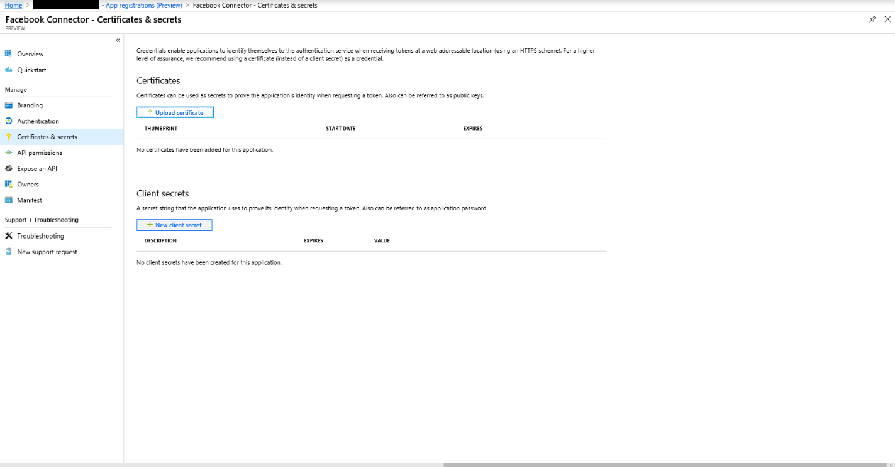
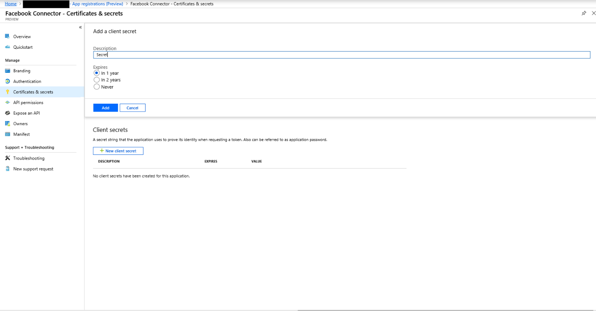
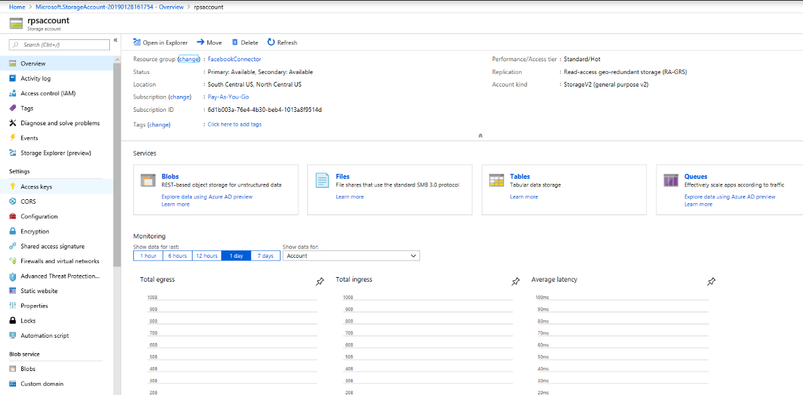
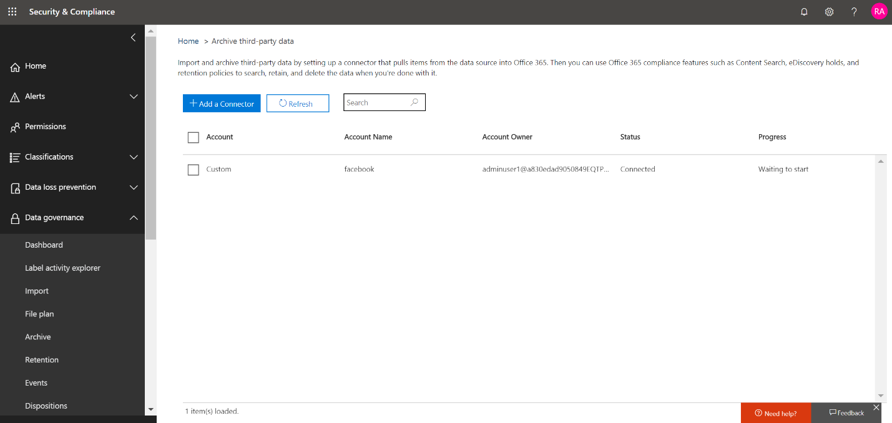

# Implantar um conector para arquivar dados do FacebookDeploy a connector to archive Facebook data

Este artigo contém o processo passo a passo para implantar um conector que usa o serviço de importação do Office 365 para importar dados de páginas de negócios do Facebook para o Office 365.This article contains the step-by-step process to deploy a connector that uses the Office 365 Import service to import data from Facebook Business pages to Office 365. Para obter uma visão geral de alto nível desse processo e uma lista de pré-requisitos necessários para implantar um conector do Facebook, consulte [usar um conector de exemplo para arquivar dados do Facebook no Office 365 (versão prévia)](archive-facebook-data-with-sample-connector.md).For a high-level overview of this process and a list of prerequisites required to deploy a Facebook connector, see [Use a sample connector to archive Facebook data in Office 365 (Preview)](archive-facebook-data-with-sample-connector.md). 

## Etapa 1: baixar o pacoteStep 1: Download the package

Baixe o pacote pré-criado da seção liberar no repositório do GitHub em <https://github.com/Microsoft/m365-sample-connector-csharp-aspnet/releases>.Download the prebuilt package from the Release section in the GitHub repository at <https://github.com/Microsoft/m365-sample-connector-csharp-aspnet/releases>. Na versão mais recente, baixe o arquivo zip chamado **SampleConnector. zip**.Under the latest release, download the zip file named **SampleConnector.zip**. Você carrega este arquivo zip no Azure na etapa 4.You upload this zip file to Azure in Step 4.

## Etapa 2: criar um aplicativo no Azure Active DirectoryStep 2: Create an app in Azure Active Directory

1. Vá para <https://portal.azure.com> e entre usando as credenciais de uma conta de administrador global do Office 365.Go to <https://portal.azure.com> and sign in using the credentials of an Office 365 global admin account.

    

2. No painel de navegação esquerdo, clique em **Azure Active Directory**.In the left navigation pane, click **Azure Active Directory**.

    

3. No painel de navegação esquerdo, clique em **registros de aplicativo (visualização)** e clique em **novo registro**.In the left navigation pane, click **App registrations (Preview)** and then click **New registration**.

    

4. Registre o aplicativo.Register the application. Em URI de redirecionamento, selecione Web na lista suspensa tipo de aplicativo <https://portal.azure.com> e digite na caixa para o URI.Under Redirect URI, select Web in the application type dropdown list and then type <https://portal.azure.com> in the box for the URI.

   

5. Copie a ID de **aplicativo (cliente)** e a ID de **diretório (locatário)** e salve-as em um arquivo de texto ou outro local seguro.Copy the **Application (client) ID** and **Directory (tenant) ID** and save them to a text file or other safe location. Você usa essas IDs em etapas posteriores.You use these IDs in later steps.

   

6. Vá até **certificados & segredos para o novo aplicativo.**Go to **Certificates & secrets for the new app.**

   

7. Clique em **novo segredo do cliente**Click **New client secret**

   

8. Criar um novo segredo.Create a new secret. Na caixa Descrição, digite o segredo e, em seguida, escolha um período de expiração.In the description box, type the secret and then choose an expiration period. 

    

9. Copie o valor do segredo e salve-o em um arquivo de texto ou outro local de armazenamento.Copy the value of the secret and save it to a text file or other storage location. Este é o segredo do aplicativo AAD que você usa nas etapas posteriores.This is the AAD application secret that you use in later steps.

   

10. Vá para **manifesto** e copie o identifieruris agora (que também é chamado de URI do aplicativo AAD) como realçado na captura de tela a seguir.Go to **Manifest** and copy the identifierUris (which is also called the AAD application Uri) as highlighted in the following screenshot. Copie o URI do aplicativo AAD para um arquivo de texto ou outro local de armazenamento.Copy the AAD application Uri to a text file or other storage location. Você pode usá-lo na etapa 6.You use it in Step 6.

   

## Etapa 3: criar uma conta de armazenamento do AzureStep 3: Create an Azure storage account

1. Vá para a home page do Azure para sua organização.Go to the Azure home page for your organization.

    

2. Clique em **criar um recurso** e, em seguida, digite **conta de armazenamento** na caixa de pesquisa.Click **Create a resource** and then type **storage account** in the search box.

    

3. Clique em **armazenamento**e, em seguida, clique em **conta de armazenamento**.Click **Storage**, and then click **Storage account**.

    

4. Na página **criar conta de armazenamento** , na caixa assinatura, selecione **pagar como você** ou **avaliação gratuita** , dependendo do tipo de assinatura do Azure que você tem.On the **Create storage account** page, in the Subscription box, select **Pay-As-You-Go** or **Free Trial** depending on which type of Azure subscription you have. Em seguida, selecione ou crie um grupo de recursos.Then select or create a resource group.

    

5. Digite um nome para a conta de armazenamento.Type a name for the storage account.

    

6. Revise e clique em **criar** para criar a conta de armazenamento.Review and then click **Create** to create the storage account.

    

7. Após alguns momentos, clique em **Atualizar** e clique em **ir para recurso** para navegar até a conta de armazenamento.After a few moments, click **Refresh** and then click **Go to resource** to navigate to the storage account.

    

8. Clique em **teclas de acesso** no painel de navegação esquerdo.Click **Access keys** in the left navigation pane.

    

9. Copie uma **cadeia de caracteres de conexão** e salve-a em um arquivo de texto ou outro local de armazenamento.Copy a **Connection string** and save it to a text file or other storage location. Você usa isso ao criar um recurso do aplicativo Web.You use this when creating a web app resource.

    

## Etapa 4: criar um novo recurso do aplicativo Web no AzureStep 4: Create a new web app resource in Azure

1. Na **Home** Page do portal do Azure, clique em **criar um recurso \> para \> todos os aplicativos Web**.On the **Home** page in the Azure portal, click **Create a resource \> Everything \> Web app**. Na página **Web App** , clique em **criar**.On the **Web app** page, click **Create**. 

   

2. Preencha os detalhes (conforme mostrado abaixo) e, em seguida, crie o aplicativo Web.Fill in the details (as shown below) and then create the Web app. Observe que o nome inserido na caixa nome do **aplicativo** é usado para criar a URL do serviço de aplicativo do Azure; por exemplo, fbconnector.azurewebsites.net.Note that the name that you enter in the **App name** box is used to create the Azure app service URL; for example, fbconnector.azurewebsites.net.

   

3. Vá para o recurso aplicativo Web recém-criado, clique em **configurações do aplicativo** no painel de navegação esquerdo.Go to the newly created web app resource, click **Application Settings** in the left navigation pane. Em configurações do aplicativo, clique em Adicionar nova configuração e adicione as três configurações a seguir: Use os valores (que você copiou para o arquivo de texto das etapas anteriores):Under Application settings, click Add new setting and add the following three settings: Use the values (that you copied to the text file from the previous steps): 

    - **APISecretKey** – você pode digitar qualquer valor como o segredo.**APISecretKey** – You can type any value as the secret. Isso é usado para acessar o aplicativo Web do conector na etapa 7.This is used to access the connector web app in Step 7.

    - **StorageAccountConnectionString** — o URI da cadeia de caracteres de conexão que você copiou após a criação da conta de armazenamento do Azure na etapa 3.**StorageAccountConnectionString** — The connection string Uri that you copied after creating the Azure storage account in Step 3.

    - **tenantid** – a ID do locatário de sua organização do Office 365 que você copiou depois de criar o aplicativo do Facebook Connector no Azure Active Directory na etapa 2.**tenantId** – The tenant ID of your Office 365 organization that you copied after creating the Facebook connector app in Azure Active Directory in Step 2.

    

4. Em **configurações gerais**, clique **em** ao lado de **sempre ligado**.Under **General settings**, click **On** next to the **Always On**. Clique em **salvar** na parte superior da página para salvar as configurações do aplicativo.Click **Save** at the top of the page to save the application settings.

   

5. A etapa final é carregar o código-fonte do aplicativo conector para o Azure que você baixou na etapa 1.The final step is to upload the connector app source code to Azure that you downloaded in Step 1. Em um navegador da Web, vá para<AzureAppResourceName>https://. SCM.azurewebsites.net/ZipDeployUi.In a web browser, go to https://<AzureAppResourceName>.scm.azurewebsites.net/ZipDeployUi. Por exemplo, se o nome do seu recurso de aplicativo do Azure (que você nomeou na etapa 2 nesta seção) for **fbconnector**, vá para https://fbconnector.scm.azurewebsites.net/ZipDeployUi.For example, if the name of your Azure app resource (which you named in step 2 in this section) is **fbconnector**, then you would go to https://fbconnector.scm.azurewebsites.net/ZipDeployUi. 

6. Arraste e solte o SampleConnector. zip (que você baixou na etapa 1) para esta página.Drag and drop the SampleConnector.zip (that you downloaded in Step 1) to this page. Após o carregamento dos arquivos e a implantação ter êxito, a página será semelhante à captura de tela a seguir:After the files are uploaded and the deployment is successful, the page will look similar to the following screenshot:

   

## Etapa 5: registrar o aplicativo do FacebookStep 5: Register the Facebook app

1. Vá para <https://developers.facebook.com>, faça logon usando as credenciais da conta das páginas de negócios de Facebook da sua organização e clique em **Adicionar novo aplicativo**.Go to <https://developers.facebook.com>, log in using the credentials for the account for your organization’s Facebook Business pages, and then click **Add New App**.

   

2. Crie uma nova ID de aplicativo.Create a new app ID.

   

3. No painel de navegação esquerdo, clique em **Adicionar produtos** e, em seguida, clique em **Configurar** no bloco de **logon do Facebook** .In the left navigation pane, click **Add Products** and then click **Set Up** in the **Facebook Login** tile.

   

4. Na página integrar login do Facebook, clique em **Web**.On the Integrate Facebook Login page, click **Web**.

   

5. Adicione a URL do serviço de aplicativo do Azure; por exemplo `https://fbconnector.azurewebsites.net`.Add the Azure app service URL; for example `https://fbconnector.azurewebsites.net`.

   

6. Preencha a seção QuickStart da configuração de login do Facebook.Complete the QuickStart section of the Facebook Login setup.

   

7. No painel de navegação esquerdo em **logon do Facebook**, clique em **configurações**e adicione o URI de redirecionamento OAuth na caixa **URIs de redirecionamento OAuth válidos** .In the left navigation pane under **Facebook Login**, click **Settings**, and add the OAuth redirect URI in the **Valid OAuth Redirect URIs** box. Use o formato \*\* \<connectorserviceuri>/views/facebookoauth\*\*, onde o valor de connectorserviceuri é a URL do serviço de aplicativo do Azure para sua organização; por exemplo, `https://fbconnector.azurewebsites.net`.Use the format **\<connectorserviceuri>/Views/FacebookOAuth**, where the value for connectorserviceuri is the Azure app service URL for your organization; for example, `https://fbconnector.azurewebsites.net`.

   

8. No painel de navegação esquerdo, clique em **Adicionar produtos** e, em seguida, clique em **WebHooks.**In the left navigation pane, click **Add Products** and then click **Webhooks.** No menu suspenso da **página** , clique em **página**.In the **Page** pull-down menu, click **Page**. 

   

9. Adicione URL de retorno de chamada de WebHooks e adicione um token de verificação.Add Webhooks Callback URL and add a verify token. O formato da URL de retorno de chamada, use o formato \*\* <connectorserviceuri>/API/FbPageWebhook\*\*, em que o valor de connectorserviceuri é a URL do serviço de aplicativo do Azure para sua organização; por exemplo `https://fbconnector.azurewebsites.net`.The format of the callback URL, use the format **<connectorserviceuri>/api/FbPageWebhook**, where the value for connectorserviceuri is the Azure app service URL for your organization; for example `https://fbconnector.azurewebsites.net`. 

    O token de verificação deve ser semelhante a uma senha forte.The verify token should similar to a strong password. Copie o token de verificação para um arquivo de texto ou outro local de armazenamento.Copy the verify token to a text file or other storage location.

        

10. Teste e assine o ponto de extremidade do feed.Test and subscribe to the endpoint for feed.

    

11. Adicione uma URL de privacidade, ícone de aplicativo e uso comercial.Add a privacy URL, app icon, and business use. Além disso, copie a ID do aplicativo e o segredo do aplicativo para um arquivo de texto ou outro local de armazenamento.Also, copy the app ID and app secret to a text file or other storage location.

    

12. Tornar o aplicativo público.Make the app public.

    

13. Adicionar usuário à função de administrador ou de testador.Add user to the admin or tester role.

    

14. Adicione a permissão de **acesso ao conteúdo público da página** .Add the **Page Public Content Access** permission.

    

15. Permissão Adicionar gerenciar páginas.Add Manage Pages permission.

    

16. Obtenha o aplicativo revisado pelo Facebook.Get the application reviewed by Facebook.

    

## Etapa 6: configurar o aplicativo Web do conectorStep 6: Configure the connector web app

1. Vá para https://\<AzureAppResourceName>. azurewebsites.net (onde AzureAppResourceName é o nome do seu recurso do aplicativo do Azure que você nomeou na etapa 4) por exemplo, se o nome for **fbconnector**, vá para `https://fbconnector.azurewebsites.net`.Go to https://\<AzureAppResourceName>.azurewebsites.net (where AzureAppResourceName is the name of your Azure app resource that you named in Step 4) For example, if the name is **fbconnector**, go to `https://fbconnector.azurewebsites.net`. A home page do aplicativo se parecerá com a captura de tela a seguir:The home page of the app will look like the following screenshot:

   

2. Clique em **Configurar** para exibir uma página de entrada.Click **Configure** to display a sign in page.
 
   

3. Na caixa ID do locatário, digite ou cole sua ID de locatário (que você obteve na etapa 2).In the Tenant Id box, type or paste your tenant Id (that you obtained in Step 2). Na caixa senha, digite ou cole o APISecretKey (que você obteve na etapa 2) e clique em **definir definições de configuração** para exibir a página **detalhes da configuração** .In the password box, type or paste the APISecretKey (that you obtained in Step 2), and then click **Set Configuration Settings** to display the **Configuration Details** page.

    

4. Em **detalhes da configuração**, insira as seguintes definições de configuraçãoUnder **Configuration Details**, enter the following configuration settings 

   - **ID do aplicativo do Facebook** – a ID do aplicativo para o aplicativo do Facebook obtido na etapa 5.**Facebook application ID** – The app ID for the Facebook application that you obtained in Step 5.
   - **Segredo do aplicativo do Facebook** – o segredo do aplicativo para o aplicativo do Facebook obtido na etapa 5.**Facebook application secret** – The app secret for the Facebook application that you obtained in Step 5.
   - **Token de verificação de WebHooks do Facebook** – o token de verificação que você criou na etapa 5.**Facebook webhooks verify token** – The verify token that you created in Step 5.
   - **ID do aplicativo AAD** – a ID do aplicativo para o aplicativo do Azure Active Directory que você criou na etapa 2.**AAD application ID** – The application ID for the Azure Active Directory app that you created in Step 2.
   - **Segredo do aplicativo AAD** – o valor para o segredo APISecretKey que você criou na etapa 4.**AAD application secret** – The value for the APISecretKey secret that you created in Step 4.
   - **URI do aplicativo AAD** – o URI do aplicativo AAD obtido na etapa 2; por exemplo, `https://microsoft.onmicrosoft.com/2688yu6n-12q3-23we-e3ee-121111123213`.**AAD application Uri** – The AAD application Uri obtained in Step 2; for example, `https://microsoft.onmicrosoft.com/2688yu6n-12q3-23we-e3ee-121111123213`.
   - **Chave de instrumentação do App insights** – deixe esta caixa em branco.**App insights instrumentation key** – Leave this box blank.

5. Clique em **salvar** para salvar as configurações do conector.Click **Save** to save the connector settings.

## Etapa 7: configurar um conector personalizado no centro de conformidade & segurançaStep 7: Set up a custom connector in the Security & Compliance Center

1. Vá para <https://protection.office.com> e, em seguida, clique em **importação \> \> de governança de informações arquivar dados de terceiros**.Go to <https://protection.office.com> and then click **Information governance \> Import \> Archive third-party data**.

   

2.  Clique em **Adicionar um conector** e, em seguida, clique em **páginas do Facebook**.Click **Add a connector** and then click **Facebook pages**.

    

3.  Na página **Adicionar aplicativo do conector** , digite as informações a seguir e clique em **validar conector**.On the **Add Connector App** page, enter the following information and then click **Validate connector**.

    - Na primeira caixa, digite um nome para o conector, como o **Facebook**.In the first box, type a name for the connector, such as **Facebook**.
    - Na segunda caixa, digite ou cole o valor do APISecretKey que você adicionou na etapa 4.In the second box, type or paste the value of the APISecretKey that you added in Step 4.
    - Na terceira caixa, digite ou cole a URL do serviço de aplicativo do Azure; por exemplo `https://fbconnector.azurewebsites.net`.In the third box, type or paste the Azure app service URL; for example `https://fbconnector.azurewebsites.net`.
 
    Depois que o conector for validado com êxito, clique em **Avançar**.After the connector is successfully validated, click **Next**.
    
    

4.  Clique em **login com o aplicativo do conector**.Click **Login with Connector App**.

    

5. Digite ou cole o APISecretKey novamente e, em seguida, clique em **login to Connector Service**.Type or paste the APISecretKey again and then click  **Login to Connector Service**.

   

6. Clique em **login com o Facebook**.Click **Login with Facebook**.

   

7. Na página **fazer logon no Facebook** , faça o login usando as credenciais da conta das páginas de negócios de Facebook da sua organização.On the **Log in to Facebook** page, log in using the credentials for the account for your organization’s Facebook Business pages. Certifique-se de que a conta do Facebook na qual você está conectado tenha a função de administrador para as páginas de negócios de Facebook da sua organizaçãoMake sure the Facebook account that you logged in to is assigned the admin role for your organization’s Facebook Business pages

   

8. Clique em **selecionar páginas** para escolher as páginas comerciais da sua organização que você deseja arquivar no Office 365.Click **Select Pages** to choose your organization’s business pages that you want to archive in Office 365.

   

9. É exibida uma lista das páginas de negócios gerenciadas pela conta do Facebook que você fez logon.A list of the Business pages managed by the Facebook account that you logged in to is displayed. Selecione a página para arquivar e clique em **salvar**.Select the page to archive and then click **Save**.

    

10. Clique em **concluir** para sair da configuração do aplicativo de serviço do conector.Click **Finish** to exit the setup of the connector service app.

    

11. Na página **definir filtros** , você pode aplicar um filtro para importar (e arquivar) itens que são uma determinada idade.On the **Set Filters** page, you can apply a filter to import (and archive) items that are a certain age. Clique em **Avançar**.Click **Next**.

    

12. Na página **definir conta de armazenamento** , selecione a caixa de correio do Office 365 que os itens das páginas de negócios do Facebook que você selecionou anteriormente serão importados.On the **Set Storage Account** page, select the Office 365 mailbox that the items from the Facebook Business pages that you previously selected will be imported to.

    

13. Revise suas configurações e clique em **concluir** para concluir a configuração do conector no centro de conformidade do & de segurança.Review your settings and then click **Finish** to complete the connector setup in the Security & Compliance Center.

    

14. Vá para a página **arquivar dados** de terceiros para ver o andamento do processo de importação.Go to the **Archive third-party data** page to see the progress of the import process.

    
