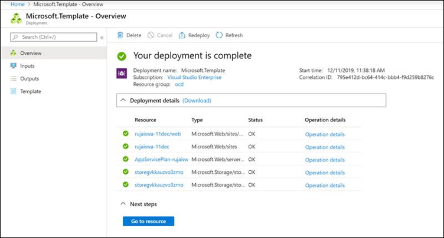

# Implantar um conector para arquivar dados de páginas de negócios do FacebookDeploy a connector to archive Facebook Business pages data

Este artigo contém o processo passo a passo para implantar um conector que usa o serviço de importação 365 da Microsoft para importar dados de páginas de negócios do Facebook para o Microsoft 365.This article contains the step-by-step process to deploy a connector that uses the Microsoft 365 Import service to import data from Facebook Business pages to Microsoft 365. Para obter uma visão geral de alto nível desse processo e uma lista de pré-requisitos necessários para implantar um conector do Facebook, consulte [configurar um conector para arquivar dados do Facebook](archive-facebook-data-with-sample-connector.md).For a high-level overview of this process and a list of prerequisites required to deploy a Facebook connector, see [Set up a connector to archive Facebook data](archive-facebook-data-with-sample-connector.md). 

## Etapa 1: criar um aplicativo no Azure Active DirectoryStep 1: Create an app in Azure Active Directory

1. Vá para <https://portal.azure.com> e entre usando as credenciais de uma conta de administrador global do Office 365.Go to <https://portal.azure.com> and sign in using the credentials of an Office 365 global admin account.

    

2. No painel de navegação esquerdo, clique em **Azure Active Directory**.In the left navigation pane, click **Azure Active Directory**.

    

3. No painel de navegação esquerdo, clique em **registros de aplicativo (visualização)** e clique em **novo registro**.In the left navigation pane, click **App registrations (Preview)** and then click **New registration**.

    

4. Registre o aplicativo.Register the application. Em URI de redirecionamento, selecione Web na lista suspensa tipo de aplicativo <https://portal.azure.com> e digite na caixa para o URI.Under Redirect URI, select Web in the application type dropdown list and then type <https://portal.azure.com> in the box for the URI.

   

5. Copie a ID de **aplicativo (cliente)** e a ID de **diretório (locatário)** e salve-as em um arquivo de texto ou outro local seguro.Copy the **Application (client) ID** and **Directory (tenant) ID** and save them to a text file or other safe location. Você usa essas IDs em etapas posteriores.You use these IDs in later steps.

   

6. Vá até **certificados & segredos para o novo aplicativo.**Go to **Certificates & secrets for the new app.**

   

7. Clique em **novo segredo do cliente**Click **New client secret**

   

8. Criar um novo segredo.Create a new secret. Na caixa Descrição, digite o segredo e, em seguida, escolha um período de expiração.In the description box, type the secret and then choose an expiration period. 

    

9. Copie o valor do segredo e salve-o em um arquivo de texto ou outro local de armazenamento.Copy the value of the secret and save it to a text file or other storage location. Este é o segredo do aplicativo AAD que você usa nas etapas posteriores.This is the AAD application secret that you use in later steps.

   

## Etapa 2: implantar o serviço Web do conector do GitHub em sua conta do AzureStep 2: Deploy the connector web service from GitHub to your Azure account

1. Vá para [este site do GitHub](https://github.com/microsoft/m365-sample-connector-csharp-aspnet) e clique em **implantar no Azure**.Go to [this GitHub site](https://github.com/microsoft/m365-sample-connector-csharp-aspnet) and click **Deploy to Azure**.

    

2. Depois de clicar em **implantar no Azure**, você será redirecionado para um portal do Azure com uma página de modelo Personalizada.After you click **Deploy to Azure**, you will be redirected to an Azure portal with a custom template page. Preencha os detalhes **básico** e **configurações** e clique em **compra**.Fill in the **Basics** and **Settings** details and then click **Purchase**.

    - **Assinatura:** Selecione sua assinatura do Azure para a qual você deseja implantar o serviço Web do conector de páginas de negócios do Facebook.**Subscription:** Select your Azure subscription that you want to deploy the Facebook Business pages connector web service to.
    
    - **Grupo de recursos:** Escolha ou crie um novo grupo de recursos.**Resource group:** Choose or create a new resource group. Um grupo de recursos é um contêiner que armazena recursos relacionados a uma solução do Azure.A resource group is a container that holds related resources for an Azure solution.

    - **Local:** Escolha um local.**Location:** Choose a location.

    - **Nome do aplicativo Web:** Forneça um nome exclusivo para o aplicativo Web do conector.**Web App Name:** Provide a unique name for the connector web app. O nome do ésimo deve ter entre 3 e 18 caracteres de comprimento.Th name must be between 3 and 18 characters in length. Esse nome é usado para criar a URL do serviço de aplicativo do Azure; por exemplo, se você fornecer o nome do aplicativo Web do **fbconnector** , a URL do serviço de aplicativo do Azure será **fbconnector.azurewebsites.net**.This name is used to create the Azure app service URL; for example, if you provide the Web app name of **fbconnector** then the Azure app service URL  will be **fbconnector.azurewebsites.net**.
    
    - **tenantid:** A ID de locatário da sua organização do Microsoft 365 que você copiou após criar o aplicativo do Facebook Connector no Azure Active Directory na etapa 1.**tenantId:** The tenant ID of your Microsoft 365 organization that you copied after creating the Facebook connector app in Azure Active Directory in Step 1.
    
   - **APISecretKey:** Você pode digitar qualquer valor como o segredo.**APISecretKey:** You can type any value as the secret. Isso é usado para acessar o aplicativo Web do conector na etapa 5.This is used to access the connector web app in Step 5.
   
     

3. Após a implantação ter êxito, a página será semelhante à captura de tela a seguir:After the deployment is successful, the page will look similar to the following screenshot:

     

## Etapa 3: registrar o aplicativo do FacebookStep 3: Register the Facebook app

1. Vá para <https://developers.facebook.com>, faça logon usando as credenciais da conta das páginas de negócios de Facebook da sua organização e clique em **Adicionar novo aplicativo**.Go to <https://developers.facebook.com>, log in using the credentials for the account for your organization’s Facebook Business pages, and then click **Add New App**.

   

2. Crie uma nova ID de aplicativo.Create a new app ID.

   

3. No painel de navegação esquerdo, clique em **Adicionar produtos** e, em seguida, clique em **Configurar** no bloco de **logon do Facebook** .In the left navigation pane, click **Add Products** and then click **Set Up** in the **Facebook Login** tile.

   

4. Na página integrar login do Facebook, clique em **Web**.On the Integrate Facebook Login page, click **Web**.

   

5. Adicione a URL do serviço de aplicativo do Azure; por exemplo `https://fbconnector.azurewebsites.net`.Add the Azure app service URL; for example `https://fbconnector.azurewebsites.net`.

   

6. Preencha a seção QuickStart da configuração de login do Facebook.Complete the QuickStart section of the Facebook Login setup.

   

7. No painel de navegação esquerdo em **logon do Facebook**, clique em **configurações**e adicione o URI de redirecionamento OAuth na caixa **URIs de redirecionamento OAuth válidos** .In the left navigation pane under **Facebook Login**, click **Settings**, and add the OAuth redirect URI in the **Valid OAuth Redirect URIs** box. Use o formato \*\* \<connectorserviceuri>/views/facebookoauth\*\*, onde o valor de connectorserviceuri é a URL do serviço de aplicativo do Azure para sua organização; por exemplo, `https://fbconnector.azurewebsites.net`.Use the format **\<connectorserviceuri>/Views/FacebookOAuth**, where the value for connectorserviceuri is the Azure app service URL for your organization; for example, `https://fbconnector.azurewebsites.net`.

   

8. No painel de navegação esquerdo, clique em **Adicionar produtos** e, em seguida, clique em **WebHooks.**In the left navigation pane, click **Add Products** and then click **Webhooks.** No menu suspenso da **página** , clique em **página**.In the **Page** pull-down menu, click **Page**. 

   

9. Adicione URL de retorno de chamada de WebHooks e adicione um token de verificação.Add Webhooks Callback URL and add a verify token. O formato da URL de retorno de chamada, use o formato \*\* <connectorserviceuri>/API/FbPageWebhook\*\*, em que o valor de connectorserviceuri é a URL do serviço de aplicativo do Azure para sua organização; por exemplo `https://fbconnector.azurewebsites.net`.The format of the callback URL, use the format **<connectorserviceuri>/api/FbPageWebhook**, where the value for connectorserviceuri is the Azure app service URL for your organization; for example `https://fbconnector.azurewebsites.net`. 

    O token de verificação deve ser semelhante a uma senha forte.The verify token should similar to a strong password. Copie o token de verificação para um arquivo de texto ou outro local de armazenamento.Copy the verify token to a text file or other storage location.

        

10. Teste e assine o ponto de extremidade do feed.Test and subscribe to the endpoint for feed.

    

11. Adicione uma URL de privacidade, ícone de aplicativo e uso comercial.Add a privacy URL, app icon, and business use. Além disso, copie a ID do aplicativo e o segredo do aplicativo para um arquivo de texto ou outro local de armazenamento.Also, copy the app ID and app secret to a text file or other storage location.

    

12. Tornar o aplicativo público.Make the app public.

    

13. Adicionar usuário à função de administrador ou de testador.Add user to the admin or tester role.

    

14. Adicione a permissão de **acesso ao conteúdo público da página** .Add the **Page Public Content Access** permission.

    

15. Permissão Adicionar gerenciar páginas.Add Manage Pages permission.

    

16. Obtenha o aplicativo revisado pelo Facebook.Get the application reviewed by Facebook.

    

## Etapa 4: configurar o aplicativo Web do conectorStep 4: Configure the connector web app

1. Vá para https://\<AzureAppResourceName>. azurewebsites.net (onde AzureAppResourceName é o nome do seu recurso do aplicativo do Azure que você nomeou na etapa 4) por exemplo, se o nome for **fbconnector**, vá para `https://fbconnector.azurewebsites.net`.Go to https://\<AzureAppResourceName>.azurewebsites.net (where AzureAppResourceName is the name of your Azure app resource that you named in Step 4) For example, if the name is **fbconnector**, go to `https://fbconnector.azurewebsites.net`. A home page do aplicativo se parecerá com a captura de tela a seguir:The home page of the app will look like the following screenshot:

   

2. Clique em **Configurar** para exibir uma página de entrada.Click **Configure** to display a sign in page.
 
   

3. Na caixa ID do locatário, digite ou cole sua ID de locatário (que você obteve na etapa 2).In the Tenant Id box, type or paste your tenant Id (that you obtained in Step 2). Na caixa senha, digite ou cole o APISecretKey (que você obteve na etapa 2) e clique em **definir definições de configuração** para exibir a página detalhes da configuração.In the password box, type or paste the APISecretKey (that you obtained in Step 2), and then click **Set Configuration Settings** to display the configuration details page.

    

4. Insira as seguintes definições de configuraçãoEnter the following configuration settings 

   - **ID do aplicativo do Facebook:** A ID de aplicativo para o aplicativo do Facebook obtido na etapa 3.**Facebook application ID:** The app ID for the Facebook application that you obtained in Step 3.
   
   - **Segredo do aplicativo do Facebook:** O segredo do aplicativo para o aplicativo do Facebook obtido na etapa 3.**Facebook application secret:** The app secret for the Facebook application that you obtained in Step 3.
   
   - **Token de verificação de WebHooks do Facebook:** O token de verificação que você criou na etapa 3.**Facebook webhooks verify token:** The verify token that you created in Step 3.
   
   - **ID do aplicativo AAD:** A ID de aplicativo do aplicativo do Azure Active Directory que você criou na etapa 1.**AAD application ID:** The application ID for the Azure Active Directory app that you created in Step 1.
   
   - **Segredo do aplicativo AAD:** O valor para o segredo APISecretKey que você criou na etapa 1.**AAD application secret:** The value for the APISecretKey secret that you created in Step 1.

5. Clique em **salvar** para salvar as configurações do conector.Click **Save** to save the connector settings.

## Etapa 5: configurar um conector do Facebook no centro de conformidade do Microsoft 365Step 5: Set up a Facebook connector in the Microsoft 365 compliance center

1. Vá para [https://compliance.microsoft.com](https://compliance.microsoft.com) e clique em **conectores de dados** no painel de navegação esquerdo.Go to [https://compliance.microsoft.com](https://compliance.microsoft.com) and then click **Data connectors** in the left nav.

2. Na página **conectores de dados (visualização)** , em **páginas de negócios do Facebook**, clique em **Exibir**.On the **Data connectors (preview)** page under **Facebook Business pages**, click **View**.

3. Na página **páginas de negócios do Facebook** , clique em **Adicionar conector**.On the **Facebook business pages** page, click **Add connector**.

4. Na página **termos de serviço** , clique em **aceitar**.On the **Terms of service** page, click **Accept**.

5.  Na página **Adicionar credenciais para seu aplicativo do conector** , digite as informações a seguir e clique em **validar conexão**.On the **Add credentials for your connector app** page, enter the following information and then click **Validate connection**.

    

    - Na caixa **nome** , digite um nome para o conector, como página de **notícias do Facebook**.In the **Name** box, type a name for the connector, such as **Facebook news page**.
    
    - Na caixa **URL da conexão** , digite ou cole a URL do serviço de aplicativo do Azure; por exemplo `https://fbconnector.azurewebsites.net`.In the **Connection URL** box, type or paste the Azure app service URL; for example `https://fbconnector.azurewebsites.net`.
    
    - Na caixa **senha** , digite ou cole o valor do APISecretKey que você adicionou na etapa 2.In the **Password** box, type or paste the value of the APISecretKey that you added in Step 2.
    
    - Na caixa **ID do aplicativo do Azure** , digite ou cole o valor da ID do aplicativo (cliente) também chamado de ID do aplicativo AAD que você criou na etapa 1.In the **Azure App ID** box, type or paste the value of the Application (client) ID also called as AAD Application ID that you created in Step 1.
 
6. Depois que a conexão for validada com êxito, clique em **Avançar**.After the connection is successfully validated, click **Next**.

7. Na página **autorizar o Microsoft 365 a importar dados** , digite ou cole o APISecretKey novamente e clique em **fazer logon no aplicativo Web**.On the **Authorize Microsoft 365 to import data** page, type or paste the APISecretKey again and then click **Login web app**.

8. Na página **Configurar aplicativo do Facebook Connector** , clique em **logon com Facebook** e faça logon usando as credenciais da conta para as páginas de negócios de Facebook da sua organização.On the **Configure Facebook connector app** page, click **Login with Facebook** and log in using the credentials for the account for your organization's Facebook Business pages. Certifique-se de que a conta do Facebook na qual você está conectado tenha a função de administrador para as páginas de negócios de Facebook da sua organização.Make sure the Facebook account that you logged in to is assigned the admin role for your organization's Facebook Business pages.

   

9. É exibida uma lista das páginas de negócios gerenciadas pela conta do Facebook que você fez logon.A list of the business pages managed by the Facebook account that you logged in to is displayed. Selecione a página para arquivar e clique em **Avançar**.Select the page to archive and then click **Next**.

    

10. Clique em **continuar** para sair da configuração do aplicativo de serviço do conector.Click **Continue** to exit the setup of the connector service app.

11. Na página **definir filtros** , você pode aplicar um filtro para importar inicialmente os itens que tenham uma determinada idade.On the **Set filters** page, you can apply a filter to initially import items that are a certain age. Selecione uma idade e clique em **Avançar**.Select an age, and then click **Next**.

12. Na página **escolher local de armazenamento** , digite o endereço de email da caixa de correio do Microsoft 365 para o qual os itens do Facebook serão importados e clique em **Avançar**.On the **Choose storage location** page, type the email address of Microsoft 365 mailbox that the Facebook items will be imported to, and then click **Next**.

13. Em **fornecer consentimento do administrador**, clique em **fornecer consentimento** e siga as etapas.On the **Provide admin consent**, click **Provide consent** and then follow the steps. Você deve ser um administrador global para fornecer consentimento para o serviço de importação do Office 365 para acessar dados em sua organização.You must be a global admin to provide consent for the Office 365 Import service to access data in your organization.

14. Clique em **Avançar** para revisar as configurações do conector e clique em **concluir** para concluir a configuração do conector.Click **Next** to review the connector settings and then click **Finish** to complete the connector setup.

15. No centro de conformidade, vá para a página **conectores de dados** e clique na guia **conectores** para ver o andamento do processo de importação.In the compliance center, go to the **Data connectors** page, and click the **Connectors** tab to see the progress of the import process.
