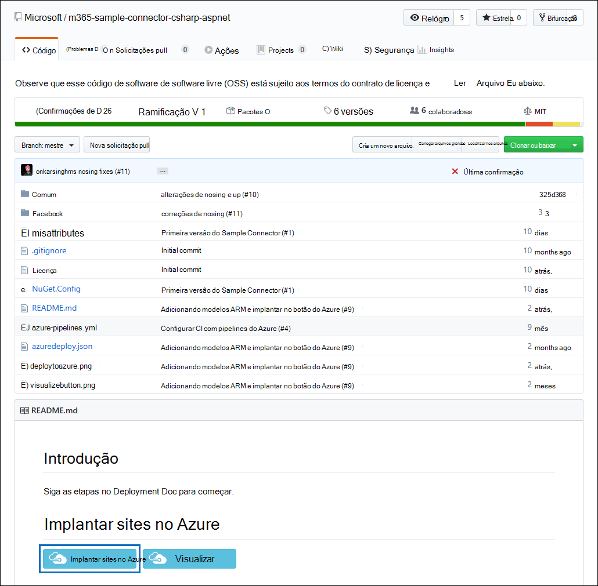
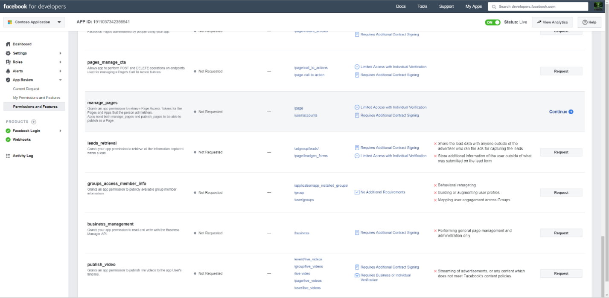

# Implantar um conector para arquivar dados de páginas comerciais do Facebook

Este artigo contém o processo passo a passo para implantar um conector que usa o serviço importar do Office 365 para importar dados de páginas do Facebook Business para o Microsoft 365. Para uma visão geral de alto nível desse processo e uma lista de pré-requisitos necessários para implantar um conector do Facebook, confira Configurar um conector para arquivar dados do [Facebook.](archive-facebook-data-with-sample-connector.md)

## Etapa 1: Criar um aplicativo no Azure Active Directory

1. Acesse e <https://portal.azure.com> entre usando as credenciais de uma conta de administrador global.

    

2. No painel de navegação esquerdo, clique no **Azure Active Directory.**

    

3. No painel de navegação esquerdo, clique em **Registros de aplicativo (Visualização)** e clique em **Novo registro.**

    

4. Registre o aplicativo. Em URI de redirecionamento, selecione Web na lista de tipos de aplicativos e digite a caixa <https://portal.azure.com> para o URI.

   

5. Copie a **ID do Aplicativo (cliente)** e a ID do Diretório **(locatário)** e salve-as em um arquivo de texto ou em outro local seguro. Use essas IDs em etapas posteriores.

   

6. Vá para **Certificados & segredos do novo aplicativo.**

   

7. Clique **em Novo segredo do cliente**

   

8. Crie um novo segredo. Na caixa de descrição, digite o segredo e escolha um período de expiração.

    

9. Copie o valor do segredo e salve-o em um arquivo de texto ou em outro local de armazenamento. Esse é o segredo do aplicativo AAD que você usa nas etapas posteriores.

   

## Etapa 2: Implantar o serviço Web do conector do GitHub em sua conta do Azure

1. Acesse este [site do GitHub e](https://github.com/microsoft/m365-sample-connector-csharp-aspnet) clique em Implantar no **Azure.**

    

2. Depois de clicar **em Implantar no Azure,** você será redirecionado para um portal do Azure com uma página de modelo personalizada. Preencha os detalhes **de Noções básicas** **e configurações** e clique em **Comprar.**

   - **Assinatura:** Selecione sua assinatura do Azure na que você deseja implantar o serviço Web do conector de páginas do Facebook Business.

   - **Grupo de recursos:** Escolha ou crie um novo grupo de recursos. Um grupo de recursos é um contêiner que contém recursos relacionados para uma solução do Azure.

   - **Local:** Escolha um local.

   - **Nome do aplicativo Web:** Forneça um nome exclusivo para o aplicativo Web do conector. O nome deve ter entre 3 e 18 caracteres. Esse nome é usado para criar a URL do serviço de aplicativo do Azure; por exemplo, se você fornecer o nome do aplicativo Web **do fbconnector,** a URL do serviço de aplicativo do Azure será **fbconnector.azurewebsites.net**.

   - **tenantId:** A ID de locatário da sua organização do Microsoft 365 que você copiou depois de criar o aplicativo de conector do Facebook no Azure Active Directory na Etapa 1.

   - **APISecretKey:** Você pode digitar qualquer valor como o segredo. Isso é usado para acessar o aplicativo Web do conector na Etapa 5.

     

3. Depois que a implantação for bem-sucedida, a página será semelhante à seguinte captura de tela:

   

## Etapa 3: registrar o aplicativo do Facebook

1. Vá para , faça logoff usando as credenciais da conta para as páginas de negócios do Facebook da sua organização e clique em <https://developers.facebook.com> **Adicionar Novo Aplicativo.**

   

2. Crie uma nova ID de aplicativo.

   

3. No painel de navegação esquerdo, clique em **Adicionar Produtos** e, em seguida, clique em Configurar **no** lado do Logon do **Facebook.**

   

4. Na página Integrar Logon do Facebook, clique **na Web.**

   

5. Adicione a URL do serviço de aplicativo do Azure; por `https://fbconnector.azurewebsites.net` exemplo.

   

6. Conclua a seção Guia de Início Rápido da configuração de Logon do Facebook.

   

7. No painel de navegação esquerdo em Logon do **Facebook,** clique em Configurações e adicione o URI de redirecionamento OAuth na caixa URIs de redirecionamento **OAuth** válidos. Use o formato **\<connectorserviceuri> /Views/FacebookOAuth**, onde o valor de connectorserviceuri é a URL do serviço de aplicativo do Azure para sua organização; por exemplo, `https://fbconnector.azurewebsites.net` .

   

8. No painel de navegação esquerdo, clique em **Adicionar Produtos** e em **Webhooks.** In the **Page** pull-down menu, click **Page**.

   

9. Adicione a URL de retorno de chamada de Webhooks e adicione um token de verificação. O formato da URL de retorno de chamada, use o formato **<connectorserviceuri> /api/FbPageWebhook**, onde o valor para connectorserviceuri é a URL do serviço de aplicativo do Azure para sua organização; por `https://fbconnector.azurewebsites.net` exemplo.

   O token de verificação deve ser semelhante a uma senha forte. Copie o token de verificação para um arquivo de texto ou outro local de armazenamento.

   

10. Teste e inscreva-se no ponto de extremidade para feed.

    

11. Adicione uma URL de privacidade, um ícone de aplicativo e um uso comercial. Além disso, copie a ID do aplicativo e o segredo do aplicativo para um arquivo de texto ou outro local de armazenamento.

    

12. Tornar o aplicativo público.

    

13. Adicionar usuário à função de administrador ou testador.

    

14. Adicione a **permissão Acesso a Conteúdo Público de** Página.

    

15. Adicione a permissão Gerenciar Páginas.

    

16. Obter o aplicativo revisado pelo Facebook.

    

## Etapa 4: Configurar o aplicativo Web do conector

1. Vá para (onde AzureAppResourceName é o nome do recurso de aplicativo do `https://<AzureAppResourceName>.azurewebsites.net` Azure nomeado na Etapa 4). Por exemplo, se o nome for **fbconnector,** vá para `https://fbconnector.azurewebsites.net` . A home page do aplicativo terá a seguinte aparência:

   

2. Clique **em Configurar** para exibir uma página de login.

   

3. Na caixa ID do locatário, digite ou colar a ID do locatário (obtida na Etapa 2). Na caixa de senha, digite ou colar a APISecretKey (obtida na  Etapa 2) e clique em Definir Definições de Configuração para exibir a página de detalhes da configuração.

    

4. Insira as seguintes definições de configuração

   - **ID do aplicativo do Facebook:** A ID do aplicativo do Facebook que você obteve na Etapa 3.

   - **Segredo do aplicativo do Facebook:** O segredo do aplicativo do Facebook que você obteve na Etapa 3.

   - **Os webhooks do Facebook verificam o token:** O token de verificação criado na Etapa 3.

   - **ID do aplicativo AAD:** A ID do aplicativo do Azure Active Directory que você criou na Etapa 1.

   - **Segredo do aplicativo AAD:** O valor do segredo APISecretKey que você criou na Etapa 1.

5. Clique **em Salvar** para salvar as configurações do conector.

## Etapa 5: Configurar um conector do Facebook no centro de conformidade do Microsoft 365

1. Vá para [https://compliance.microsoft.com](https://compliance.microsoft.com) e clique em **Conectores de dados** na barra de entrada esquerda.

2. Na página **Conectores de dados em** **páginas do Facebook Business,** clique em **Exibir**.

3. Na página páginas **comerciais do Facebook,** clique **em Adicionar conector.**

4. Na página **Termos de serviço,** clique em **Aceitar**.

5. Na página **Adicionar credenciais para o aplicativo do** conector, insira as informações a seguir e clique em **Validar conexão.**

   

   - Na caixa **Nome,** digite um nome para o conector, como a página **de notícias do Facebook.**

   - Na caixa **URL da Conexão,** digite ou colar a URL do serviço de aplicativo do Azure; por `https://fbconnector.azurewebsites.net` exemplo.

   - Na caixa **Senha,** digite ou colar o valor da APISecretKey que você adicionou na Etapa 2.

   - Na caixa ID do Aplicativo **do Azure,** digite ou colar o valor da ID do Aplicativo (cliente) também chamada de ID do Aplicativo AAD que você criou na Etapa 1.

6. Depois que a conexão for validada com êxito, clique em **Próximo.**

7. On the **Authorize Microsoft 365 to import data** page, type or paste the APISecretKey again and then click Login web **app**.

8. Na página Configurar aplicativo do conector do **Facebook,** clique em Logon com **o Facebook** e faça logon usando as credenciais da conta das páginas de negócios do Facebook da sua organização. Certifique-se de que a conta do Facebook à que você entrou tenha a função de administrador para as páginas de negócios do Facebook da sua organização.

   

9. É exibida uma lista das páginas de negócios gerenciadas pela conta do Facebook em que você entrou. Selecione a página a ser arquivada e clique em **Próximo.**

   

10. Clique **em Continuar** para sair da configuração do aplicativo de serviço do conector.

11. Na página **Definir filtros,** você pode aplicar um filtro para importar inicialmente itens com uma determinada idade. Selecione uma idade e clique em **Próximo.**

12. Na página **Escolher local** de armazenamento, digite o endereço de email da caixa de correio do Microsoft 365 para a qual os itens do Facebook serão importados e clique em **Próximo.**

13. Clique **em Próximo** para revisar as configurações do conector e clique em **Concluir** para concluir a configuração do conector.

14. No centro de conformidade,  vá para a página Conectores de dados e clique na guia **Conectores** para ver o progresso do processo de importação.
