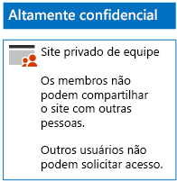

# Implantar sites do SharePoint Online para três camadas de proteçãoDeploy SharePoint Online sites for three tiers of protection

Use as etapas neste artigo para projetar e implantar sites de equipe do SharePoint Online de linha de base, confidenciais e altamente confidenciais. Para obter mais informações sobre essas três camadas de proteção, consulte [Arquivos e sites do SharePoint Online seguros](../security/office-365-security/secure-sharepoint-online-sites-and-files.md).Use the steps in this article to design and deploy baseline, sensitive, and highly confidential SharePoint Online team sites. For more information about these three tiers of protection, see [Secure SharePoint Online sites and files](../security/office-365-security/secure-sharepoint-online-sites-and-files.md).
  
## Sites de equipe do SharePoint Online de linha de baseBaseline SharePoint Online team sites

A proteção de linha de base inclui os sites de equipe públicos e privados. Os sites de equipe públicos podem ser descobertos e acessados por qualquer pessoa na organização. Os sites privados podem ser descobertos e acessados somente por membros do grupo do Office 365 associado ao site de equipe. Esses dois tipos de sites de equipe permitem que os membros compartilhem o site com outras pessoas.Baseline protection includes both public and private team sites. Public team sites can be discovered and accessed by anybody in the organization. Private sites can only be discovered and accessed by members of the Office 365 group associated with the team site. Both of these types of team sites allow members to share the site with others.
  
### PúblicoPublic

Para criar um site de equipe do SharePoint Online de linha de base com permissões e acesso público, siga [essas instruções](https://support.office.com/article/create-a-team-site-in-sharepoint-ef10c1e7-15f3-42a3-98aa-b5972711777d).To create a baseline SharePoint Online team site with public access and permissions, follow [these instructions](https://support.office.com/article/create-a-team-site-in-sharepoint-ef10c1e7-15f3-42a3-98aa-b5972711777d).

Esta é a configuração resultante.Here is your resulting configuration.
  

  
### PrivadoPrivate

Para criar um site de equipe do SharePoint Online de linha de base com permissões e acesso privado, siga [essas instruções](https://support.office.com/article/create-a-team-site-in-sharepoint-ef10c1e7-15f3-42a3-98aa-b5972711777d).To create a baseline SharePoint Online team site with private access and permissions, follow [these instructions](https://support.office.com/article/create-a-team-site-in-sharepoint-ef10c1e7-15f3-42a3-98aa-b5972711777d).
  
Esta é a configuração resultante.Here is your resulting configuration.
  

  
## Sites confidenciais de equipe do SharePoint OnlineSensitive SharePoint Online team sites

Sites de equipe Confidenciais do SharePoint Online são iniciados como um site de equipe privado.A sensitive SharePoint Online team site starts as a private team site.
  
Primeiro, crie o site de equipe do SharePoint Online privado com [estas instruções](https://support.office.com/article/create-a-team-site-in-sharepoint-ef10c1e7-15f3-42a3-98aa-b5972711777d).First, create the private SharePoint Online team site with [these instructions](https://support.office.com/article/create-a-team-site-in-sharepoint-ef10c1e7-15f3-42a3-98aa-b5972711777d).

Em seguida, no novo site de equipe do SharePoint Online, configure as permissões adicionais com estas etapas.Next, from the new SharePoint Online team site, configure additional permission settings with these steps.

1.  Na barra de ferramentas do site de equipe do SharePoint, clique no ícone de configurações e, em seguida, clique em **Permissões do site**.In the tool bar of the SharePoint team site, click the settings icon, and then click **Site permissions**.
2.  No painel **Permissões do site**, em **Configurações de Compartilhamento**, clique em **Alterar configurações de compartilhamento**.In the **Site permissions** pane, under **Sharing Settings**, click **Change sharing settings**.
3.  Em **Permissões de compartilhamento**, selecione **Somente proprietários do site podem compartilhar arquivos, pastas e o site** e clique em **Salvar**.Under **Sharing permissions**, choose **Only site owners can share files, folders, and the site**, and then click **Save**.

Os resultados dessas configurações de permissão são:The results of these permission settings are:

- A capacidade dos membros de compartilhar com outros membros está desabilitada.The ability for members to share with other members is disabled.
- A capacidade de não membros solicitarem o acesso está habilitada.The ability for non-members to request access is enabled.

Esta é a configuração resultante.Here is your resulting configuration.
  

  
Os membros do site, por meio da associação de grupo em um dos grupos de acesso, agora podem colaborar com segurança nos recursos do site.The members of the site, through group membership in one of the access groups, can now securely collaborate on the resources of the site.
  
## Sites de equipe do SharePoint Online altamente confidenciaisHighly confidential SharePoint Online team sites

Um site de equipe do SharePoint Online altamente confidencial é um site de equipe privado com configurações de permissões adicionais.A highly confidential SharePoint Online team site is a private team site with additional permissions settings.

Primeiro, crie o site de equipe do SharePoint Online privado com [estas instruções](https://support.office.com/article/create-a-team-site-in-sharepoint-ef10c1e7-15f3-42a3-98aa-b5972711777d).First, create the private SharePoint Online team site with [these instructions](https://support.office.com/article/create-a-team-site-in-sharepoint-ef10c1e7-15f3-42a3-98aa-b5972711777d).

Em seguida, no novo site de equipe do SharePoint Online, configure as permissões adicionais com estas etapas.Next, from the new SharePoint Online team site, configure additional permission settings with these steps.

1.  Na barra de ferramentas do site de equipe do SharePoint, clique no ícone de configurações e, em seguida, clique em **Permissões do site**.In the tool bar of the SharePoint team site, click the settings icon, and then click **Site permissions**.
2.  No painel **Permissões do site**, em **Configurações de Compartilhamento**, clique em **Alterar configurações de compartilhamento**.In the **Site permissions** pane, under **Sharing Settings**, click **Change sharing settings**.
3.  Em **Permissões de compartilhamento**, **Somente proprietários do site podem compartilhar arquivos, pastas e o site**.Under **Sharing permissions**, choose **Only site owners can share files, folders, and the site**.
4. Desative **Permitir solicitações de acesso** e clique em **Salvar**.Turn off **Allow access requests**, and then click **Save**.

Os resultados dessas configurações de permissão são:The results of these permission settings are:

- A capacidade dos membros de compartilhar com outros membros está desabilitada.The ability for members to share with other members is disabled.
- A capacidade de não membros solicitarem o acesso está desabilitada.The ability for non-members to request access is disabled.

Esta é a configuração resultante.Here is your resulting configuration.
  

  
Os membros do site, por meio da associação de grupo em um dos grupos de acesso, agora podem colaborar com segurança nos recursos do site.The members of the site, through group membership in one of the access groups, can now securely collaborate on the resources of the site.
  
## Próxima etapaNext step

[Proteger arquivos do SharePoint Online com DLP e rótulos do Office 365Protect SharePoint Online files with Office 365 labels and DLP](protect-sharepoint-online-files-with-office-365-labels-and-dlp.md)

## Confira tambémSee also

[Diretrizes de segurança da Microsoft para campanhas políticas, instituições sem fins lucrativos e outras organizações do AgileMicrosoft Security Guidance for Political Campaigns, Nonprofits, and Other Agile Organizations](../security/office-365-security/microsoft-security-guidance-for-political-campaigns-nonprofits-and-other-agile-o.md)
  
[Adoção da nuvem e de soluções híbridasCloud adoption and hybrid solutions](https://docs.microsoft.com/office365/enterprise/cloud-adoption-and-hybrid-solutions)
