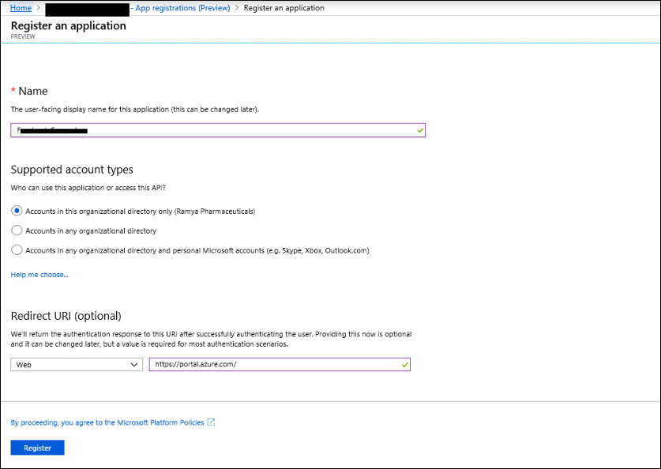
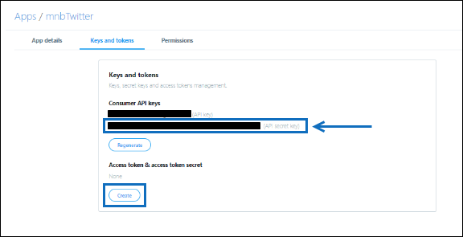
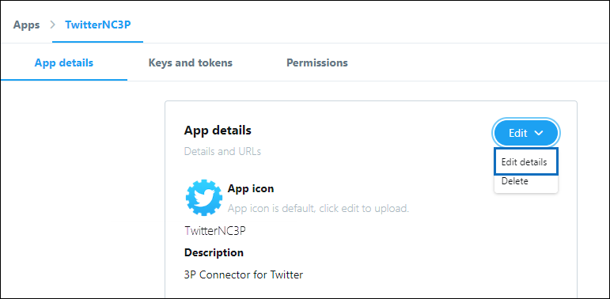

# Implantar um conector para arquivar dados do Twitter

Este artigo contém o processo passo a passo para implantar um conector que usa o serviço de importação do Office 365 para importar dados da conta do Twitter da sua organização para a Microsoft 365. Para obter uma visão geral de alto nível desse processo e uma lista de pré-requisitos necessários para implantar um conector do Twitter, consulte [configurar um conector para arquivar dados do Twitter ](archive-twitter-data-with-sample-connector.md). 

## Etapa 1: criar um aplicativo no Azure Active Directory

1. Vá para <https://portal.azure.com> e entre usando as credenciais de uma conta de administrador global do Office 365.

   

2. No painel de navegação esquerdo, clique em **Azure Active Directory**.

   

3. No painel de navegação esquerdo, clique em **registros de aplicativo (visualização)** e clique em **novo registro**.

   

4. Registre o aplicativo. Em **URI de redirecionamento (opcional)**, selecione **Web** na lista suspensa tipo de aplicativo `https://portal.azure.com` e digite a caixa para o URI.

   

5. Copie a ID de **aplicativo (cliente)** e a ID de **diretório (locatário)** e salve-as em um arquivo de texto ou outro local seguro. Você usa essas IDs em etapas posteriores.

    

6. Vá até **certificados & segredos para o novo aplicativo** e, em **segredos do cliente** , clique em **novo segredo do cliente**.

   

7. Criar um novo segredo. Na caixa Descrição, digite o segredo e, em seguida, escolha um período de expiração. 

   

8. Copie o valor do segredo e salve-o em um arquivo de texto ou outro local de armazenamento. Este é o segredo do aplicativo AAD que você usa nas etapas posteriores.

   

## Etapa 2: implantar o serviço Web do conector do GitHub em sua conta do Azure

1. Vá para [este site do GitHub](https://github.com/microsoft/m365-sample-twitter-connector-csharp-aspnet) e clique em **implantar no Azure**.

    

2. Depois de clicar em **implantar no Azure**, você será redirecionado para um portal do Azure com uma página de modelo Personalizada. Preencha os detalhes **básico** e **configurações** e clique em **compra**.

   

    - **Assinatura:** Selecione sua assinatura do Azure para a qual você deseja implantar o serviço Web do conector do Twitter.
    
    - **Grupo de recursos:** Escolha ou crie um novo grupo de recursos. Um grupo de recursos é um contêiner que armazena recursos relacionados a uma solução do Azure.

    - **Local:** Escolha um local.

    - **Nome do aplicativo Web:** Forneça um nome exclusivo para o aplicativo Web do conector. O nome do ésimo deve ter entre 3 e 18 caracteres de comprimento. Esse nome é usado para criar a URL do serviço de aplicativo do Azure; por exemplo, se você fornecer o nome do aplicativo Web do **twitterconnector** , a URL do serviço de aplicativo do Azure será **twitterconnector.azurewebsites.net**.
    
    - **tenantid:** A ID de locatário da sua organização do Microsoft 365 que você copiou após criar o aplicativo do Facebook Connector no Azure Active Directory na etapa 1.
    
   - **APISecretKey:** Você pode digitar qualquer valor como o segredo. Isso é usado para acessar o aplicativo Web do conector na etapa 5.

3. Após a implantação ter êxito, a página será semelhante à captura de tela a seguir:

    

## Etapa 3: criar o aplicativo Twitter

1. Vá para https://developer.twitter.com, faça logon usando as credenciais da conta de desenvolvedor da sua organização e clique em **aplicativos**.

   
2. Clique em **criar um aplicativo**.
   
   

3. Em **detalhes do aplicativo**, adicione informações sobre o aplicativo.

   

4. No painel de desenvolvedor do Twitter, selecione o aplicativo que você acabou de criar e copie a ID do aplicativo que é exibida e salve-a em um arquivo de texto ou outro local de armazenamento. Em seguida, clique em **detalhes**.
   
   

5. Na guia **chaves e tokens** , em **chaves da API do consumidor** , copie a chave secreta da API e salve-a em um arquivo de texto ou outro local de armazenamento. Em seguida, clique em **criar** para gerar um token de acesso e um segredo de token de acesso e copie-os para um arquivo de texto ou outro local de armazenamento.
   
   

   Em seguida, clique em **criar** para gerar um token de acesso e um segredo de token de acesso e copie-os para um arquivo de texto ou outro local de armazenamento.

6. Clique na guia **permissões** e configure as permissões conforme mostrado na captura de tela a seguir:

   

7. Após salvar as configurações de permissão, clique na guia **detalhes do aplicativo** e, em seguida, clique em **Editar > editar detalhes**.

   

8. Execute as seguintes tarefas:

   - Marque a caixa de seleção para permitir que o aplicativo conector entre no Twitter.
   
   - Adicione o URI de redirecionamento OAuth usando o seguinte formato: ** \<connectorserviceuri>/views/twitteroauth**, onde o valor de *connectorserviceuri* é a URL do serviço de aplicativo do Azure para sua organização; por exemplo, https://twitterconnector.azurewebsites.net/Views/TwitterOAuth.

    

O aplicativo de desenvolvedor do Twitter agora está pronto para uso.

## Etapa 4: configurar o aplicativo Web do conector 

1. Vá para https://\<AzureAppResourceName>. azurewebsites.net (onde **AzureAppResourceName** é o nome do seu recurso do aplicativo do Azure que você nomeou na etapa 4). Por exemplo, se o nome for **twitterconnector**, vá para https://twitterconnector.azurewebsites.net. A home page do aplicativo é semelhante à captura de tela a seguir:

   

2. Clique em **Configurar** para exibir uma página de entrada.

   

3. Na caixa ID do locatário, digite ou cole sua ID de locatário (que você obteve na etapa 2). Na caixa senha, digite ou cole o APISecretKey (que você obteve na etapa 2) e clique em **definir definições de configuração** para exibir a página detalhes da configuração.

   

4. Insira as seguintes definições de configuração 

   - **Chave de API do Twitter:** A ID do aplicativo do Twitter que você criou na etapa 3.
   
   - **Chave secreta da API do Twitter:** A chave secreta da API do aplicativo Twitter que você criou na etapa 3.
   
   - **Token de acesso do Twitter:** O token de acesso que você criou na etapa 3.
   
   - **Segredo do token de acesso do Twitter:** O segredo do token de acesso que você criou na etapa 3.
   
   - **ID do aplicativo AAD:** A ID de aplicativo do aplicativo do Azure Active Directory que você criou na etapa 1
   
   - **Segredo do aplicativo AAD:** O valor para o segredo APISecretKey que você criou na etapa 1.

5. Clique em **salvar** para salvar as configurações do conector.

## Etapa 5: configurar um conector do Twitter no centro de conformidade da Microsoft 365

1. Vá para [https://compliance.microsoft.com](https://compliance.microsoft.com) e clique em **conectores de dados** no painel de navegação esquerdo.

2. Na página **conectores de dados (visualização)** , em **Twitter**, clique em **Exibir**.

3. Na página do **Twitter** , clique em **Adicionar conector**.

4. Na página **termos de serviço** , clique em **aceitar**.

5. Na página **Adicionar credenciais para seu aplicativo do conector** , digite as informações a seguir e clique em **validar conexão**.

   

    - Na caixa **nome** , digite um nome para o conector, como identificador de **ajuda do Twitter**.
    
    - Na caixa **URL do conector** , digite ou cole a URL do serviço de aplicativo do Azure; por exemplo `https://twitterconnector.azurewebsites.net`.
    
    - Na caixa **senha** , digite ou cole o valor do APISecretKey que você criou na etapa 2.
    
    - Na caixa **ID do aplicativo do Azure** , digite ou cole o valor da ID de aplicativo do aplicativo do Azure (também chamada de *ID do cliente*) obtida na etapa 1.

6. Depois que a conexão for validada com êxito, clique em **Avançar**.

7. Na página **autorizar o Microsoft 365 a importar dados** , digite ou cole o APISecretKey novamente e clique em **fazer logon no aplicativo Web**.

8. Clique em **login com Twitter**.

9. Na página de entrada do Twitter, entre usando as credenciais da conta do Twitter da sua organização.

   

   Depois que você entrar, a página do Twitter exibirá a seguinte mensagem, "trabalho do conector do Twitter configurado com êxito".

10. Clique em **continuar** para concluir a configuração do conector do Twitter.

11. Na página **definir filtros** , você pode aplicar um filtro para importar inicialmente os itens que tenham uma determinada idade. Selecione uma idade e clique em **Avançar**.

12. Na página **escolher local de armazenamento** , digite o endereço de email da caixa de correio do Microsoft 365 para o qual os itens do Twitter serão importados e clique em **Avançar**.

13. Em **fornecer consentimento do administrador**, clique em **fornecer consentimento** e siga as etapas. Você deve ser um administrador global para fornecer consentimento para o serviço de importação do Office 365 para acessar dados em sua organização.

14. Clique em **Avançar** para revisar as configurações do conector e clique em **concluir** para concluir a configuração do conector.

15. No centro de conformidade, vá para a página **conectores de dados** e clique na guia **conectores** para ver o andamento do processo de importação.
