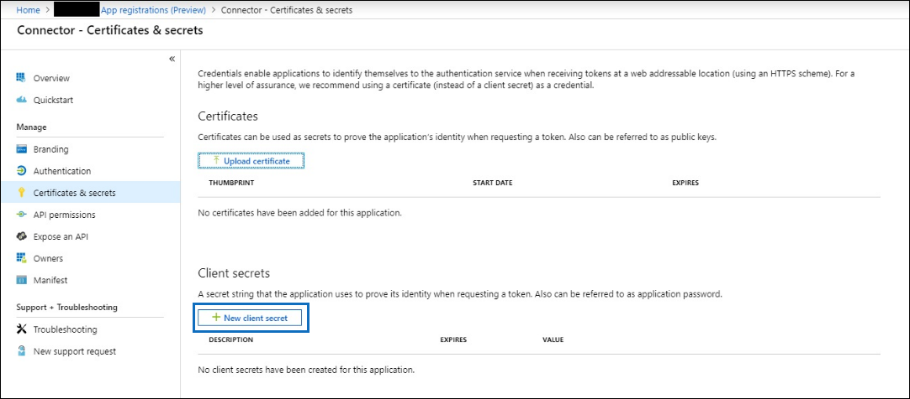
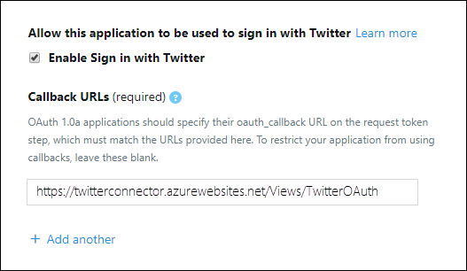

# Implantar um conector para arquivar dados do TwitterDeploy a connector to archive Twitter data

Este artigo contém o processo passo a passo para implantar um conector que usa o serviço de importação do Office 365 para importar dados da conta do Twitter da sua organização para a Microsoft 365.This article contains the step-by-step process to deploy a connector that uses the Office 365 Import service to import data from your organization's Twitter account to Microsoft 365. Para obter uma visão geral de alto nível desse processo e uma lista de pré-requisitos necessários para implantar um conector do Twitter, consulte [configurar um conector para arquivar dados do Twitter ](archive-twitter-data-with-sample-connector.md).For a high-level overview of this process and a list of prerequisites required to deploy a Twitter connector, see [Set up a connector to archive Twitter data ](archive-twitter-data-with-sample-connector.md). 

## Etapa 1: criar um aplicativo no Azure Active DirectoryStep 1: Create an app in Azure Active Directory

1. Vá para <https://portal.azure.com> e entre usando as credenciais de uma conta de administrador global.Go to <https://portal.azure.com> and sign in using the credentials of a global admin account.

   

2. No painel de navegação esquerdo, clique em **Azure Active Directory**.In the left navigation pane, click **Azure Active Directory**.

   

3. No painel de navegação esquerdo, clique em **registros de aplicativo (visualização)** e clique em **novo registro**.In the left navigation pane, click **App registrations (Preview)** and then click **New registration**.

   

4. Registre o aplicativo.Register the application. Em **URI de redirecionamento (opcional)**, selecione **Web** na lista suspensa tipo de aplicativo `https://portal.azure.com` e digite a caixa para o URI.Under **Redirect URI (optional)**, select **Web** in the application type dropdown list and then type `https://portal.azure.com` in the box for the URI.

   

5. Copie a ID de **aplicativo (cliente)** e a ID de **diretório (locatário)** e salve-as em um arquivo de texto ou outro local seguro.Copy the **Application (client) ID** and **Directory (tenant) ID** and save them to a text file or other safe location. Você usa essas IDs em etapas posteriores.You use these IDs in later steps.

    

6. Vá até **certificados & segredos para o novo aplicativo** e, em **segredos do cliente** , clique em **novo segredo do cliente**.Go to **Certificates & secrets for the new app** and under **Client secrets** click **New client secret**.

   

7. Criar um novo segredo.Create a new secret. Na caixa Descrição, digite o segredo e, em seguida, escolha um período de expiração.In the description box, type the secret and then choose an expiration period. 

   

8. Copie o valor do segredo e salve-o em um arquivo de texto ou outro local de armazenamento.Copy the value of the secret and save it to a text file or other storage location. Este é o segredo do aplicativo AAD que você usa nas etapas posteriores.This is the AAD application secret that you use in later steps.

   

## Etapa 2: implantar o serviço Web do conector do GitHub em sua conta do AzureStep 2: Deploy the connector web service from GitHub to your Azure account

1. Vá para [este site do GitHub](https://github.com/microsoft/m365-sample-twitter-connector-csharp-aspnet) e clique em **implantar no Azure**.Go to [this GitHub site](https://github.com/microsoft/m365-sample-twitter-connector-csharp-aspnet) and click **Deploy to Azure**.

    

2. Depois de clicar em **implantar no Azure**, você será redirecionado para um portal do Azure com uma página de modelo Personalizada.After you click **Deploy to Azure**, you will be redirected to an Azure portal with a custom template page. Preencha os detalhes **básico** e **configurações** e clique em **compra**.Fill in the **Basics** and **Settings** details and then click **Purchase**.

   

    - **Assinatura:** Selecione sua assinatura do Azure para a qual você deseja implantar o serviço Web do conector do Twitter.**Subscription:** Select your Azure subscription that you want to deploy the Twitter connector web service to.
    
    - **Grupo de recursos:** Escolha ou crie um novo grupo de recursos.**Resource group:** Choose or create a new resource group. Um grupo de recursos é um contêiner que armazena recursos relacionados a uma solução do Azure.A resource group is a container that holds related resources for an Azure solution.

    - **Local:** Escolha um local.**Location:** Choose a location.

    - **Nome do aplicativo Web:** Forneça um nome exclusivo para o aplicativo Web do conector.**Web App Name:** Provide a unique name for the connector web app. O nome do ésimo deve ter entre 3 e 18 caracteres de comprimento.Th name must be between 3 and 18 characters in length. Esse nome é usado para criar a URL do serviço de aplicativo do Azure; por exemplo, se você fornecer o nome do aplicativo Web do **twitterconnector** , a URL do serviço de aplicativo do Azure será **twitterconnector.azurewebsites.net**.This name is used to create the Azure app service URL; for example, if you provide the Web app name of **twitterconnector** then the Azure app service URL  will be **twitterconnector.azurewebsites.net**.
    
    - **tenantid:** A ID de locatário da sua organização do Microsoft 365 que você copiou após criar o aplicativo do Facebook Connector no Azure Active Directory na etapa 1.**tenantId:** The tenant ID of your Microsoft 365 organization that you copied after creating the Facebook connector app in Azure       Active Directory in Step 1.
    
   - **APISecretKey:** Você pode digitar qualquer valor como o segredo.**APISecretKey:** You can type any value as the secret. Isso é usado para acessar o aplicativo Web do conector na etapa 5.This is used to access the connector web app in Step 5.

3. Após a implantação ter êxito, a página será semelhante à captura de tela a seguir:After the deployment is successful, the page will look similar to the following screenshot:

    

## Etapa 3: criar o aplicativo TwitterStep 3: Create the Twitter app

1. Vá para https://developer.twitter.com, faça logon usando as credenciais da conta de desenvolvedor da sua organização e clique em **aplicativos**.Go to https://developer.twitter.com, log in using the credentials for the developer account for your organization, and then click **Apps**.

   
2. Clique em **criar um aplicativo**.Click **Create an app**.
   
   

3. Em **detalhes do aplicativo**, adicione informações sobre o aplicativo.Under **App details**, add information about the application.

   

4. No painel de desenvolvedor do Twitter, selecione o aplicativo que você acabou de criar e copie a ID do aplicativo que é exibida e salve-a em um arquivo de texto ou outro local de armazenamento.On the Twitter developer dashboard, select the app that you just created and copy the App ID that's displayed  and save it to a text file or other storage location. Em seguida, clique em **detalhes**.Then click **Details**.
   
   

5. Na guia **chaves e tokens** , em **chaves da API do consumidor** , copie a chave secreta da API e salve-a em um arquivo de texto ou outro local de armazenamento.On the **Keys and tokens** tab, under **Consumer API keys** copy the API secret key and save it to a text file or other storage location. Em seguida, clique em **criar** para gerar um token de acesso e um segredo de token de acesso e copie-os para um arquivo de texto ou outro local de armazenamento.Then click **Create** to generate an access token and an access token secret, and copy these to a text file or other storage location.
   
   

   Em seguida, clique em **criar** para gerar um token de acesso e um segredo de token de acesso e copie-os para um arquivo de texto ou outro local de armazenamento.Then click **Create** to generate an access token and an access token secret, and copy these to a text file or other storage location.

6. Clique na guia **permissões** e configure as permissões conforme mostrado na captura de tela a seguir:Click the **Permissions** tab and configure the permissions as shown in the following screenshot:

   

7. Após salvar as configurações de permissão, clique na guia **detalhes do aplicativo** e, em seguida, clique em **Editar > editar detalhes**.After you save the permission settings, click the **App details** tab, and then click **Edit > Edit details**.

   

8. Execute as seguintes tarefas:Do the following tasks:

   - Marque a caixa de seleção para permitir que o aplicativo conector entre no Twitter.Select the checkbox to allow the connector app to sign in to Twitter.
   
   - Adicione o URI de redirecionamento OAuth usando o seguinte formato: \*\* \<connectorserviceuri>/views/twitteroauth\*\*, onde o valor de *connectorserviceuri* é a URL do serviço de aplicativo do Azure para sua organização; por exemplo, https://twitterconnector.azurewebsites.net/Views/TwitterOAuth.Add the OAuth redirect Uri using the following format: **\<connectorserviceuri>/Views/TwitterOAuth**, where the value of *connectorserviceuri* is the Azure app service URL for your organization; for example, https://twitterconnector.azurewebsites.net/Views/TwitterOAuth.

    

O aplicativo de desenvolvedor do Twitter agora está pronto para uso.The Twitter developer app is now ready to use.

## Etapa 4: configurar o aplicativo Web do conectorStep 4: Configure the connector web app 

1. Vá para https://\<AzureAppResourceName>. azurewebsites.net (onde **AzureAppResourceName** é o nome do seu recurso do aplicativo do Azure que você nomeou na etapa 4).Go to https://\<AzureAppResourceName>.azurewebsites.net (where **AzureAppResourceName** is the name of your Azure app resource that you named in Step 4). Por exemplo, se o nome for **twitterconnector**, vá para https://twitterconnector.azurewebsites.net.For example, if the name is **twitterconnector**, go to https://twitterconnector.azurewebsites.net. A home page do aplicativo é semelhante à captura de tela a seguir:The home page of the app looks like the following screenshot:

   

2. Clique em **Configurar** para exibir uma página de entrada.Click **Configure** to display a sign in page.

   

3. Na caixa ID do locatário, digite ou cole sua ID de locatário (que você obteve na etapa 2).In the Tenant Id box, type or paste your tenant Id (that you obtained in Step 2). Na caixa senha, digite ou cole o APISecretKey (que você obteve na etapa 2) e clique em **definir definições de configuração** para exibir a página detalhes da configuração.In the password box, type or paste the APISecretKey (that you obtained in Step 2), and then click **Set Configuration Settings** to display the configuration details page.

   

4. Insira as seguintes definições de configuraçãoEnter the following configuration settings 

   - **Chave de API do Twitter:** A ID do aplicativo do Twitter que você criou na etapa 3.**Twitter Api Key:** The app ID for the Twitter application that you created in Step 3.
   
   - **Chave secreta da API do Twitter:** A chave secreta da API do aplicativo Twitter que você criou na etapa 3.**Twitter Api Secret Key:** The API secret key for the Twitter application that you created in Step 3.
   
   - **Token de acesso do Twitter:** O token de acesso que você criou na etapa 3.**Twitter Access Token:** The access token that you created in Step 3.
   
   - **Segredo do token de acesso do Twitter:** O segredo do token de acesso que você criou na etapa 3.**Twitter Access Token Secret:** The access token secret that you created in Step 3.
   
   - **ID do aplicativo AAD:** A ID de aplicativo do aplicativo do Azure Active Directory que você criou na etapa 1**AAD Application ID:** The application ID for the Azure Active Directory app that you created in Step 1
   
   - **Segredo do aplicativo AAD:** O valor para o segredo APISecretKey que você criou na etapa 1.**AAD Application Secret:** The value for the APISecretKey secret that you created in Step 1.

5. Clique em **salvar** para salvar as configurações do conector.Click **Save** to save the connector settings.

## Etapa 5: configurar um conector do Twitter no centro de conformidade da Microsoft 365Step 5: Set up a Twitter connector in the Microsoft 365 compliance center

1. Vá para [https://compliance.microsoft.com](https://compliance.microsoft.com) e clique em **conectores de dados** no painel de navegação esquerdo.Go to [https://compliance.microsoft.com](https://compliance.microsoft.com) and then click **Data connectors** in the left nav.

2. Na página **conectores de dados (visualização)** , em **Twitter**, clique em **Exibir**.On the **Data connectors (preview)** page under **Twitter**, click **View**.

3. Na página do **Twitter** , clique em **Adicionar conector**.On the **Twitter** page, click **Add connector**.

4. Na página **termos de serviço** , clique em **aceitar**.On the **Terms of service** page, click **Accept**.

5. Na página **Adicionar credenciais para seu aplicativo do conector** , digite as informações a seguir e clique em **validar conexão**.On the **Add credentials for your connector app** page, enter the following information and then click **Validate connection**.

   

    - Na caixa **nome** , digite um nome para o conector, como identificador de **ajuda do Twitter**.In the **Name** box, type a name for the connector, such as **Twitter help handle**.
    
    - Na caixa **URL do conector** , digite ou cole a URL do serviço de aplicativo do Azure; por exemplo `https://twitterconnector.azurewebsites.net`.In the **Connector URL** box, type or paste the Azure app service URL; for example `https://twitterconnector.azurewebsites.net`.
    
    - Na caixa **senha** , digite ou cole o valor do APISecretKey que você criou na etapa 2.In the **Password** box, type or paste the value of the APISecretKey that you created in Step 2.
    
    - Na caixa **ID do aplicativo do Azure** , digite ou cole o valor da ID de aplicativo do aplicativo do Azure (também chamada de *ID do cliente*) obtida na etapa 1.In the **Azure App ID** box, type or paste the value of the Azure Application App Id (also called the *client ID*) that you obtained in Step 1.

6. Depois que a conexão for validada com êxito, clique em **Avançar**.After the connection is successfully validated, click **Next**.

7. Na página **autorizar o Microsoft 365 a importar dados** , digite ou cole o APISecretKey novamente e clique em **fazer logon no aplicativo Web**.On the **Authorize Microsoft 365 to import data** page, type or paste the APISecretKey again and then click  **Login web app**.

8. Clique em **login com Twitter**.Click **Login with Twitter**.

9. Na página de entrada do Twitter, entre usando as credenciais da conta do Twitter da sua organização.On the Twitter sign in page, sign in using the credentials for your organization's Twitter account.

   

   Depois que você entrar, a página do Twitter exibirá a seguinte mensagem, "trabalho do conector do Twitter configurado com êxito".After you sign in, the Twitter page will display the following message, "Twitter Connector Job Successfully set up."

10. Clique em **continuar** para concluir a configuração do conector do Twitter.Click **Continue** to complete setting up the Twitter connector.

11. Na página **definir filtros** , você pode aplicar um filtro para importar inicialmente os itens que tenham uma determinada idade.On the **Set filters** page, you can apply a filter to initially import items that are a certain age. Selecione uma idade e clique em **Avançar**.Select an age, and then click **Next**.

12. Na página **escolher local de armazenamento** , digite o endereço de email da caixa de correio do Microsoft 365 para o qual os itens do Twitter serão importados e clique em **Avançar**.On the **Choose storage location** page, type the email address of Microsoft 365 mailbox that the Twitter items will be imported to, and then click **Next**.

13. Em **fornecer consentimento do administrador**, clique em **fornecer consentimento** e siga as etapas.On the **Provide admin consent**, click **Provide consent** and then follow the steps. Você deve ser um administrador global para fornecer consentimento para o serviço de importação do Office 365 para acessar dados em sua organização.You must be a global admin to provide consent for the Office 365 Import service to access data in your organization.

14. Clique em **Avançar** para revisar as configurações do conector e clique em **concluir** para concluir a configuração do conector.Click **Next** to review the connector settings and then click **Finish** to complete the connector setup.

15. No centro de conformidade, vá para a página **conectores de dados** e clique na guia **conectores** para ver o andamento do processo de importação.In the compliance center, go to the **Data connectors** page, and click the **Connectors** tab to see the progress of the import process.
