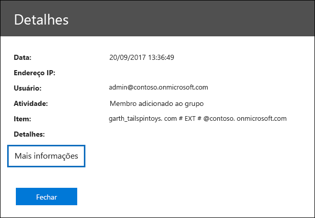

# Propriedades detalhadas no log de auditoria

Ao exportar os resultados de uma pesquisa de & log de auditoria do Centro de Conformidade e Segurança, você tem a opção de baixar todos os resultados que atendem aos critérios de pesquisa. Você pode fazer isso selecionando **Exportar resultados** Baixar todos \> **os resultados** na página de pesquisa do log **de** auditoria. Para obter mais informações, consulte [Pesquisar o log de auditoria.](search-the-audit-log-in-security-and-compliance.md)
  
 Quando você exporta todos os resultados de uma pesquisa de log de auditoria, os dados brutos do log de auditoria unificado são copiados para um arquivo de valores separados por vírgula (CSV) que é baixado para o computador local. Esse arquivo contém informações adicionais de cada registro de auditoria em uma coluna chamada **AuditData**. Essa coluna contém uma propriedade de vários valores para várias propriedades do registro de log de auditoria. Cada uma das **propriedades: pares** de valores nesta propriedade de vários valores são separados por vírgula. 
  
A tabela a seguir descreve as propriedades incluídas (dependendo do serviço no qual ocorre um evento) na coluna **AuditData** de várias propriedades. O **serviço do Office 365** que tem essa coluna de propriedades indica o serviço e o tipo de atividade (usuário ou administrador) que inclui a propriedade. Para obter informações mais detalhadas sobre essas propriedades ou sobre propriedades que podem não estar listadas neste tópico, consulte o Esquema de API da [Atividade de Gerenciamento.](https://go.microsoft.com/fwlink/p/?LinkId=717993)
  
> [!TIP]
> Você pode usar o recurso de transformação JSON no Power Query no Excel para dividir a coluna **AuditData** em várias colunas para que cada propriedade tenha sua própria coluna. Isso permitirá que você classifique e filtre uma ou mais dessas propriedades. Para saber como fazer isso, consulte Exportar, configurar e [exibir registros de log de auditoria.](export-view-audit-log-records.md) 
  
|**Propriedade**|**Descrição**|**Serviço do Microsoft 365 que tem essa propriedade**|
|:-----|:-----|:-----|
|Actor|O usuário ou a conta de serviço que realizou a ação.|Azure Active Directory|
|AddOnName|O nome de um complemento que foi adicionado, removido ou atualizado em uma equipe. O tipo de complementos no Microsoft Teams é um bot, um conector ou uma guia.|Microsoft Teams|
|AddOnType|O tipo de um complemento que foi adicionado, removido ou atualizado em uma equipe. Os valores a seguir indicam o tipo de complemento.    **1** - Indica um bot.  **2** - Indica um conector.  **3** - Indica uma guia.|Microsoft Teams|
|AzureActiveDirectoryEventType|O tipo de evento do Azure Active Directory. Os valores a seguir indicam o tipo de evento.    **0** - Indica um evento de logon da conta.  **1** - Indica um evento de segurança de aplicativo do Azure.|Azure Active Directory|
|ChannelGuid|A ID de um canal do Microsoft Teams. A equipe em que o canal está localizado é identificada pelas **propriedades TeamName** e **TeamGuid.**|Microsoft Teams|
|ChannelName|O nome de um canal do Microsoft Teams. A equipe em que o canal está localizado é identificada pelas **propriedades TeamName** e **TeamGuid.**|Microsoft Teams|
|Client|O dispositivo cliente, o sistema operacional do dispositivo e o navegador do dispositivo usados para o evento de logon (por exemplo, Nokia Lumia 920; Windows Phone 8; IE Mobile 11).|Azure Active Directory|
|ClientInfoString|Informações sobre o cliente de email que foi usado para executar a operação, como uma versão do navegador, a versão do Outlook e informações do dispositivo móvel|Exchange (atividade da caixa de correio)|
|ClientIP|O endereço IP do dispositivo que foi usado quando a atividade foi registrada. O endereço IP é exibido em um formato de endereço IPv4 ou IPv6.   Para alguns serviços, o valor exibido nessa propriedade pode ser o endereço IP de um aplicativo confiável (por exemplo, Office em aplicativos Web) chamando o serviço em nome de um usuário e não o endereço IP do dispositivo usado por quem realizou a atividade.   Além disso, para atividade de administrador (ou atividade executada por uma conta do sistema) para eventos relacionados ao Azure Active Directory, o endereço IP não é registrado e o valor da propriedade ClientIP é `null` . |Azure Active Directory, Exchange, SharePoint|
|CreationTime|A data e hora no Tempo Universal Coordenado (UTC) de quando o usuário realizou a atividade.|Todos|
|DestinationFileExtension|A extensão de um arquivo que foi copiado ou movido. Essa propriedade é exibida apenas para as atividades de usuário FileCopied e FileMoved.|SharePoint|
|DestinationFileName|O nome do arquivo é copiado ou movido. Essa propriedade é exibida apenas para as ações FileCopied e FileMoved.|SharePoint|
|DestinationRelativeUrl|A URL da pasta de destino em que um arquivo é copiado ou movido. A combinação dos valores para **SiteURL**, **DestinationRelativeURL** e a propriedade **DestinationFileName** é igual ao valor da propriedade **ObjectID,** que é o nome do caminho completo para o arquivo que foi copiado. Essa propriedade é exibida apenas para as atividades de usuário FileCopied e FileMoved.|SharePoint|
|EventSource|Identifica que um evento ocorreu no SharePoint. Os valores possíveis **são SharePoint** e **ObjectModel**.|SharePoint|
|ExternalAccess|Para atividades de administrador do Exchange, especifica se o cmdlet foi executado por um usuário em sua organização, pela equipe de datacenter da Microsoft ou por uma conta de serviço de datacenter ou por um administrador delegado. O valor **Falso** indica que o cmdlet foi executado por alguém em sua organização. O valor **Verdadeiro** indica que o cmdlet foi executado pela equipe do datacenter, por uma conta de serviço do datacenter ou por um administrador delegado.    Para atividades de caixa de correio do Exchange, especifica se uma caixa de correio foi acessada por um usuário fora da sua organização.|Exchange|
|ExtendedProperties|As propriedades estendidas de um evento do Azure Active Directory.|Azure Active Directory|
|ID|A ID da entrada do relatório. A ID identifica exclusivamente a entrada do relatório.|Todos|
|InternalLogonType|Reservado para uso interno.|Exchange (atividade da caixa de correio)|
|ItemType|O tipo de objeto que foi acessado ou modificado. Os valores **possíveis incluem File**, **Folder**, **Web**, **Site**, **Tenant** e **DocumentLibrary**.|SharePoint|
|LoginStatus|Identifica falhas de logon que podem ter ocorrido.|Azure Active Directory|
|LogonType|O tipo de acesso à caixa de correio. Os seguintes valores indicam o tipo de usuário que acessou a caixa de correio.     **0** - Indica um proprietário de caixa de correio.  **1** - Indica um administrador.  **2** - Indica um representante.  **3** - Indica o serviço de transporte no datacenter da Microsoft.  **4** - Indica uma conta de serviço no datacenter da Microsoft.  **6** - Indica um administrador delegado.|Exchange (atividade da caixa de correio)|
|MailboxGuid|O GUID do Exchange da caixa de correio que foi acessada.|Exchange (atividade da caixa de correio)|
|MailboxOwnerUPN|O endereço de email da pessoa que possui a caixa de correio que foi acessada.|Exchange (atividade da caixa de correio)|
|Members|Lista os usuários que foram adicionados ou removidos de uma equipe. Os valores a seguir indicam o tipo de função atribuída ao usuário.     **1** - Indica a função de Proprietário.  **2** – Indica a função de Membro.  **3** – Indica a função de Convidado.   A propriedade Membros inclui também o nome da sua organização e o endereço de email do membro.|Microsoft Teams|
|ModifiedProperties (Name, NewValue, OldValue)|A propriedade está incluída para eventos de administrador, como adicionar um usuário como membro de um site ou grupo de administradores de um conjunto de sites. A propriedade inclui o nome da propriedade que foi modificada (por exemplo, o grupo Administrador do Site) o novo valor da propriedade modificada (como o usuário que foi adicionado como administrador do site e o valor anterior do objeto modificado.|Todos (atividade do administrador)|
|ObjectId|Para o log de auditoria do administrador do Exchange, o nome do objeto que foi modificado pelo cmdlet.    Para atividades do SharePoint, o nome do caminho da URL completo do arquivo ou pasta acessado por um usuário.    Para a atividade do Azure AD, o nome da conta de usuário que foi modificada.|Todos|
|Operation|O nome do usuário ou atividade administrativa. O valor dessa propriedade corresponde ao valor que foi selecionado na lista de **Atividades.** Se **Mostrar resultados de todas as atividades** tiver sido selecionado, o relatório incluirá entradas para todas as atividades de usuários e administradores para todos os serviços. Para uma descrição das operações/atividades registradas no log  de auditoria, consulte a guia Atividades auditadas em Pesquisar o log de auditoria no [Office 365.](search-the-audit-log-in-security-and-compliance.md)    Para a atividade de administração do Exchange, essa propriedade identifica o nome do cmdlet que foi executado.|Todos|
|OrganizationId|O GUID da sua organização.|Todos|
|Path|O nome da pasta da caixa de correio em que a mensagem que foi acessada está localizada. Essa propriedade também identifica a pasta onde uma mensagem é criada ou copiada/movida para.|Exchange (atividade da caixa de correio)|
|Parâmetros|Para a atividade de administração do Exchange, o nome e o valor de todos os parâmetros que foram usados com o cmdlet identificado na propriedade Operation.|Exchange (atividade do administrador)|
|RecordType|O tipo de operação indicado pelo registro. Essa propriedade indica o serviço ou recurso em que a operação foi disparada. Para uma lista de tipos de registro e seu valor ENUM correspondente (que é o valor exibido na propriedade **RecordType** em um registro de auditoria), consulte [Audit log record type](https://docs.microsoft.com/office/office-365-management-api/office-365-management-activity-api-schema#auditlogrecordtype).| 
|ResultStatus|Indica se a ação (especificada na propriedade **Operation)** foi bem-sucedida ou não.    Para a atividade de administração do Exchange, o valor é **True** (bem-sucedido) ou **False** (falhou).|Todos   |
|SecurityComplianceCenterEventType|Indica que a atividade foi um evento do Centro de Conformidade & segurança. Todas as & do Centro de Conformidade e Segurança terão o valor **0** para essa propriedade.|Centro de conformidade e segurança|
|SharingType|O tipo de permissões de compartilhamento que foi atribuída ao usuário com o qual o recurso foi compartilhado. Esse usuário é identificado na **propriedade UserSharedWith.**|SharePoint|
|Site|O GUID do site onde o arquivo ou pasta acessado pelo usuário está localizado.|SharePoint|
|SiteUrl|A URL do site onde o arquivo ou pasta acessado pelo usuário está localizado.|SharePoint|
|SourceFileExtension|A extensão do arquivo que foi acessado pelo usuário. Esta propriedade fica em branco se o objeto que foi acessado for uma pasta.|SharePoint|
|SourceFileName|O nome do arquivo ou pasta acessado pelo usuário.|SharePoint|
|SourceRelativeUrl|O URL da pasta que contém o arquivo acessado pelo usuário. A combinação dos valores para **SiteURL**, **SourceRelativeURL** e a propriedade **SourceFileName** é igual ao valor da propriedade **ObjectID,** que é o nome do caminho completo para o arquivo acessado pelo usuário.|SharePoint|
|Assunto|A linha de assunto da mensagem que foi acessada.|Exchange (atividade da caixa de correio)|
|TabType| O tipo de guia adicionado, removido ou atualizado em uma equipe. Os valores possíveis para esta propriedade são:     **Pino do Excel** - uma guia do Excel.    **Extensão** - Todos os aplicativos de terceiros e de terceiros; como o Agendamento de Classe, VSTS e Formulários.    **Observações** - guia do OneNote.    **Pdfpin** - Uma guia PDF.    **Powerbi** - Uma guia do Power BI.    **Powerpointpin** - Uma guia do PowerPoint.    **Sharepointfiles** - Uma guia do SharePoint.    **Página da Web** - Uma guia de site fixado.    **Guia Wiki** - Uma guia wiki.    **Wordpin** - Uma guia do Word.|Microsoft Teams|
|Target|O usuário em que a ação (identificada na **propriedade Operation)** foi executada. Por exemplo, se um usuário convidado for adicionado ao SharePoint ou ao Microsoft Team, esse usuário será listado nessa propriedade.|Azure Active Directory|
|TeamGuid|A ID de uma equipe no Microsoft Teams.|Microsoft Teams|
|TeamName|O nome de uma equipe no Microsoft Teams.|Microsoft Teams|
|UserAgent|Informações sobre o navegador do usuário. Essas informações são fornecidas pelo navegador.|SharePoint|
|UserDomain|Informações de identidade sobre a organização locatária do usuário (ator) que realizou a ação.|Azure Active Directory|
|UserId|O usuário que realizou a ação (especificada na propriedade **Operation)** que resultou no registro sendo registrado. Registros de auditoria para atividades executadas por contas do sistema (como SHAREPOINT\system ou NT AUTHORITY\SYSTEM) também são incluídos no log de auditoria. Outro valor comum para a propriedade UserId é app@sharepoint. Isso indica que o "usuário" recebeu permissões no SharePoint para executar ações em toda a organização (como pesquisar em um site do SharePoint ou em uma conta do OneDrive) em nome de um usuário, administrador ou serviço. Para saber mais, confira o usuário [app\@sharepoint em registros de auditoria](search-the-audit-log-in-security-and-compliance.md#the-appsharepoint-user-in-audit-records). |Todos|
|UserKey|Uma ID alternativa para o usuário identificado na **propriedade UserID.** Por exemplo, essa propriedade é preenchida com a ID exclusiva do passaporte (PUID) para eventos executados pelos usuários no SharePoint. Essa propriedade também pode especificar o mesmo valor que a **propriedade UserID** para eventos que ocorrem em outros serviços e eventos executados por contas do sistema.|Todos|
|UserSharedWith|O usuário com o qual um recurso foi compartilhado. Essa propriedade será incluída se o valor da propriedade **Operation** for **SharingSet**. Esse usuário também está listado na **coluna Compartilhado com** no relatório.|SharePoint|
|UserType|O tipo de usuário que executou a operação. Os seguintes valores indicam o tipo de usuário.     **0** - Um usuário normal.  **2** - Um administrador em sua organização do Microsoft 365. 1  **3** - Um administrador de datacenter da Microsoft ou uma conta do sistema de datacenter.  **4** - Uma conta do sistema.  **5** - Um aplicativo.  **6** - Uma entidade de serviço. **7** - Uma política personalizada. **8** - Uma política do sistema.|Todos|
|Versão|Indica o número da versão da atividade (identificada pela **propriedade Operation)** que está registrada.|Todos|
|Workload|O serviço do Microsoft 365 em que a atividade ocorreu.|Todos|
||||

> [!NOTE]
>1 Para eventos relacionados ao Azure Active Directory, o valor de um administrador não é usado em um registro de auditoria. Os registros de auditoria para atividades executadas pelos administradores indicarão que um usuário normal (por exemplo, **UserType: 0**) realizou a atividade. A **propriedade UserID** identificará a pessoa (usuário regular ou administrador) que realizou a atividade. 

As propriedades descritas acima também são exibidas quando você clica em **Mais informações** ao exibir os detalhes de um evento específico.
  

