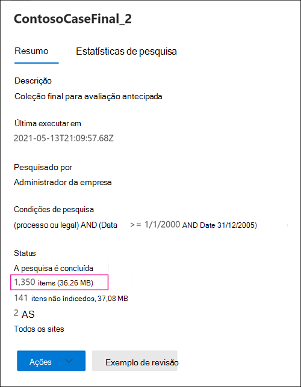

# Diferenças entre os resultados estimados e reais da pesquisa de Descoberta EDiscoveryDifferences between estimated and actual eDiscovery search results

Este tópico aplica-se às pesquisas que você pode executar usando uma das seguintes ferramentas Microsoft 365 descoberta de eDiscovery:This topic applies to searches that you can run using one of the following Microsoft 365 eDiscovery tools: 

- Pesquisa de conteúdoContent search
- Descoberta Eletrônica CentralCore eDiscovery

Quando você executar uma pesquisa de Descoberta Digital, a ferramenta que você está usando retornará uma estimativa do número de itens (e seu tamanho total) que corresponderão aos critérios de pesquisa.When you run an eDiscovery search, the tool you're using will return an estimate of the number of items (and their total size) that match the search criteria. Por exemplo, quando você executar uma pesquisa no centro de conformidade Microsoft 365, os resultados estimados da pesquisa serão exibidos na página de sobrevoo da pesquisa selecionada.For example, when you run a search in the Microsoft 365 compliance center, the estimated search results are displayed on the flyout page for the selected search.
  

  
Esta é a mesma estimativa do tamanho total e do número de itens exibidos na Ferramenta de Exportação de Descoberta e quando você exporta resultados para um computador local e no relatório Resumo de Exportação baixado com os resultados da pesquisa.This is the same estimate of total size and number of items that is displayed in the eDiscovery Export Tool when you export results to a local computer and in the Export Summary report that's downloaded with the search results.
  
**Resultados estimados na ferramenta Exportação de Descobertas Online****Estimated results in the eDiscovery Export tool**

  
**Resultados estimados no relatório Resumo da Exportação****Estimated results in Export Summary report**

  
No entanto, como você observará na captura de tela anterior do relatório Resumo de Exportação, o tamanho e o número de resultados reais da pesquisa baixados são diferentes do tamanho e do número de resultados de pesquisa estimados.However, as you'll notice in the previous screenshot of the Export Summary report, the size and number of actual search results that are downloaded are different than the size and number of estimated search results.
  

  
Aqui estão alguns motivos para essas diferenças:Here are some reasons for these differences:
  
- **A maneira como os resultados são estimados**.**The way results are estimated**. Uma estimativa dos resultados da pesquisa é exatamente essa, uma estimativa (e não uma contagem real) dos itens que atendem aos critérios de consulta de pesquisa.An estimate of the search results is just that, an estimate (and not an actual count) of the items that meet the search query criteria. Para compilar a estimativa de itens Exchange, uma lista das IDs de mensagem que atendem aos critérios de pesquisa é solicitada do banco de dados Exchange pela ferramenta de Descoberta Digital que você está usando.To compile the estimate of Exchange items, a list of the message IDs that meet the search criteria is requested from the Exchange database by the eDiscovery tool you're using. Mas quando você exporta os resultados da pesquisa, a pesquisa é reprisada e as mensagens reais são recuperadas do banco de dados de Exchange.But when you export the search results, the search is rerun and the actual messages are retrieved from the Exchange database. Portanto, essas diferenças podem resultar devido à forma como o número estimado de itens e o número real de itens são determinados.So these differences might result because of how the estimated number of items and the actual number of items are determined.

- **Alterações que ocorrem entre o tempo ao estimar e exportar resultados da pesquisa.****Changes that happen between the time when estimating and exporting search results**. Quando você exporta os resultados da pesquisa, a pesquisa é reiniciada para coletar os itens mais recentes no índice de pesquisa que atendem aos critérios de pesquisa.When you export search results, the search is restarted to collect that most recent items in the search index that meet the search criteria. É possível que haja itens adicionais criados, enviados ou recebidos que atendem aos critérios de pesquisa no tempo entre quando os resultados estimados da pesquisa foram coletados e quando os resultados da pesquisa foram exportados.It's possible there are additional items were created, sent, or received that meet the search criteria in the time between when the estimated search results were collected and when the search results were exported. Também é possível que os itens que estavam no índice de pesquisa quando os resultados da pesquisa foram estimados não estão mais lá porque eles foram limpos do local do conteúdo antes que os resultados da pesquisa sejam exportados.It's also possible that items that were in the search index when the search results were estimated are no longer there because they were purged from the content location before the search results are exported. Uma maneira de atenuar esse problema é especificar um intervalo de datas para uma pesquisa de Descoberta e.One way to mitigate this issue is to specify a date range for an eDiscovery search. Outra maneira é colocar uma espera em locais de conteúdo para que os itens sejam preservados e não possam ser limpos.Another way is to place a hold on content locations so that items are preserved and can't be purged. 

   Embora rara, mesmo quando uma responsabilidade é aplicada, a manutenção de itens de calendário integrados (que não são editáveis pelo usuário, mas estão incluídos em muitos resultados de pesquisa) pode ser removida de tempos em tempos.Although rare, even in the case when a hold is applied, maintenance of built-in calendar items (which aren't editable by the user, but are included in many search results) may be removed from time to time. Essa remoção periódica de itens de calendário resultará em menos itens exportados.This periodic removal of calendar items will result in fewer items that are exported.

- **Itens nãoindexados.****Unindexed items**. Itens não índicedos para pesquisa podem causar diferenças entre resultados de pesquisa estimados e reais.Items that are unindexed for search can cause differences between estimated and actual search results. Você pode incluir itens nãoindexados ao exportar os resultados da pesquisa.You can include unindexed items when you export the search results. Se você incluir itens nãoindexados ao exportar resultados da pesquisa, pode haver mais itens exportados.If you include unindexed items when exporting search results, there might be more items that are exported. Isso causará uma diferença entre os resultados de pesquisa estimados e exportados.This will cause a difference between the estimated and exported search results.

    Ao usar a ferramenta de pesquisa conteúdo, você tem a opção de incluir itens não índicedos ao exportar resultados da pesquisa.When using the Content search tool, you have the option to include unindexed items when you export search results. O número de itens não índicedos retornados pela pesquisa está listado na página de sobrevoo juntamente com os outros resultados estimados da pesquisa.The number of unindexed items returned by the search is listed on the flyout page together with the other estimated search results. Todos os itens nãoindexados também seriam incluídos no tamanho total dos resultados estimados da pesquisa.Any unindexed items would also be included in the total size of the estimated search results. Ao exportar resultados da pesquisa, você tem a opção de incluir ou não itens não índicedos.When you export search results, you have the option to include or not include unindexed items. A forma como você configura essas opções pode resultar em diferenças entre os resultados de pesquisa estimados e reais baixados.How you configure these options might result in differences between estimated and the actual search results that are downloaded.

- **Exportando os resultados de uma pesquisa de conteúdo que inclui todos os locais de conteúdo.****Exporting the results of a Content search that includes all content locations**. Se a pesquisa de que você está exportando resultados foi uma pesquisa de todos os locais de conteúdo em sua organização, somente os itens não índicedos de locais de conteúdo que contêm itens que corresponderem aos critérios de pesquisa serão exportados.If the search that you're exporting results from was a search of all content locations in your organization, then only the unindexed items from content locations that contain items that match the search criteria will be exported. In other words, if no search results are found in a mailbox or site, then any unindexed items in that mailbox or site won't be exported.In other words, if no search results are found in a mailbox or site, then any unindexed items in that mailbox or site won't be exported. No entanto, itens desindexados de todos os locais de conteúdo (mesmo aqueles que não contêm itens que corresponderem à consulta de pesquisa) serão incluídos nos resultados estimados da pesquisa.However, unindexed items from all content locations (even those that don't contain items that match the search query) will be included in the estimated search results.

    Como alternativa, se a pesquisa que você está exportando resultados de locais de conteúdo específicos incluídos, os itens não especificados (que não são excluídos pelos critérios de pesquisa) de todos os locais de conteúdo especificados na pesquisa serão exportados.Alternatively, if the search that you're exporting results from included specific content locations, then unindexed items (that aren't excluded by the search criteria) from all the content locations specified in the search will be exported. Nesse caso, o número estimado de itens não índicedos e o número de itens não índicedos que são exportados devem ser os mesmos.In this case, the estimated number of unindexed items and the number of unindexed items that are exported should be the same.

    O motivo para não exportar itens não índicedos de todos os locais da organização é porque pode aumentar a probabilidade de erros de exportação e aumentar o tempo necessário para exportar e baixar os resultados da pesquisa.The reason for not exporting unindexed items from every location in the organization is because it might increase the likelihood of export errors and increase the time it takes to export and download the search results.

- **Itens não SharePoint e OneDrive incluídos nas estimativas de pesquisa.****Unindexed items in SharePoint and OneDrive not included in the search estimates**. Os itens não SharePoint sites e OneDrive for Business contas não estão incluídos nos resultados estimados da pesquisa.Unindexed items from SharePoint sites and OneDrive for Business accounts aren't included in the estimated search results. Isso porque o índice SharePoint não contém dados para itens não indexados.This is because the SharePoint index doesn't contain data for unindexed items. Somente itens nãoindexados de caixas de correio são incluídos nas estimativas de pesquisa.Only unindexed items from mailboxes are included in the search estimates. No entanto, se você incluir itens nãoindexados ao exportar resultados da pesquisa, itens não SharePoint e OneDrive serão incluídos, o que aumentará o número de itens que são realmente exportados.However, if you include unindexed items when exporting search results, unindexed items in SharePoint and OneDrive are included, which will increase the number of items that are actually exported. Isso resultará em diferenças entre os resultados estimados (que não incluem itens não SharePoint e OneDrive sites) e os itens reais baixados.This will result in differences between the estimated results (which don't include unindexed items in SharePoint and OneDrive sites) and the actual items that are downloaded. A regra sobre a exportação de itens não índicedos somente de locais de conteúdo que contenham itens que corresponderem aos critérios de pesquisa ainda se aplica nessa situação.The rule about exporting unindexed items only from content locations that contain items that match the search criteria still applies in this situation.

- **Versões de documento em SharePoint e OneDrive**.**Document versions in SharePoint and OneDrive**. Ao pesquisar SharePoint sites e OneDrive contas, várias versões de um documento não são incluídas na contagem de resultados de pesquisa estimados.When searching SharePoint sites and OneDrive accounts, multiple versions of a document aren't included in the count of estimated search results. Mas você tem a opção de incluir todas as versões do documento ao exportar os resultados da pesquisa.But you have the option to include all document versions when you export the search results. Se você incluir versões de documento ao exportar resultados da pesquisa, o número real (e o tamanho total) dos itens exportados serão aumentados.If you include document versions when exporting search results, the actual number (and total size) of the exported items will be increased.

- **SharePoint pastas**.**SharePoint folders**. Se o nome das pastas no SharePoint corresponde a uma consulta de pesquisa, a estimativa de pesquisa incluirá uma contagem dessas pastas (mas não os itens nessas pastas).If the name of folders in SharePoint matches a search query, the search estimate will include a count of those folders (but not the items in those folders). Quando você exporta os resultados da pesquisa, os itens na pasta são exportados, mas a pasta real não é exportada.When you export the search results, the items in folder are exported but the actual folder in not exported. O resultado é que o número de itens exportados exportados será maior do que o número de resultados de pesquisa estimados.The result is that the number of exported items export will more than the number of estimated search results. Se uma pasta estiver vazia, o número de resultados reais de pesquisa exportados será reduzido por um item, pois a pasta real não será exportada.If a folder is empty, then the number of actual search results exported will be reduced by one item, because the actual folder isn't exported.

- **SharePoint listas**.**SharePoint lists**. Se o nome de uma lista SharePoint corresponde a uma consulta de pesquisa, a estimativa de pesquisa incluirá uma contagem de todos os itens na lista.If the name of a SharePoint list matches a search query, the search estimate will include a count of all the items in the list. Quando você exporta os resultados da pesquisa, a lista (e os itens de lista) é exportada como um único arquivo CSV.When you export the search results, the list (and the list items) is exported as a single CSV file. Isso reduzirá o número real de itens realmente exportados.This will reduce the actual number of items actually exported. Se a lista contiver anexos, os anexos serão exportados como documentos separados, o que também aumentará o número de itens exportados.If the list contains attachments, the attachments will be exported as separate documents, which will also increase the number of items exported.

- **Formatos de arquivo brutos versus formatos de arquivo exportados.****Raw file formats versus exported file formats**. Para Exchange itens, o tamanho estimado dos resultados da pesquisa é calculado usando os tamanhos brutos Exchange mensagens.For Exchange items, the estimated size of the search results is calculated by using the raw Exchange message sizes. No entanto, as mensagens de email são exportadas em um arquivo PST ou como mensagens individuais (que são formatadas como arquivos EML).However, email messages are exported in a PST file or as individual messages (which are formatted as EML files). Ambas as opções de exportação usam um formato de arquivo diferente do Exchange mensagens brutas, o que resulta no tamanho total do arquivo exportado ser diferente do tamanho do arquivo estimado.Both of these export options use a different file format than raw Exchange messages, which results in the total exported file size being different than the estimated file size.

- **Des duplicação de Exchange itens durante a exportação**.**De-duplication of Exchange items during export**. Para Exchange itens, a de duplicação reduz o número de itens exportados.For Exchange items, de-duplication reduces the number of items that are exported. Você tem a opção de des duplicar os resultados da pesquisa ao exportá-los.You have the option to de-duplicate the search results when you export them. Para Exchange mensagens, isso significa que apenas uma única instância de uma mensagem é exportada, mesmo que essa mensagem possa ser encontrada em várias caixas de correio.For Exchange messages, this means that only a single instance of a message is exported, even though that message might be found in multiple mailboxes. Os resultados estimados da pesquisa incluem todas as instâncias de uma mensagem.The estimated search results include every instance of a message. Portanto, se você escolher a opção de des duplicação ao exportar resultados da pesquisa, o número real de itens exportados pode ser consideravelmente menor do que o número estimado de itens.So if you choose the de-duplication option when exporting search results, the actual number of items that are exported might be considerably less than the estimated number of items.

O relatório de resultados da pesquisa (arquivo Results.csv) contém uma entrada para cada mensagem duplicada e identifica a caixa de correio de origem onde uma mensagem duplicada está localizada.The search results report (Results.csv file) contains an entry for each duplicate message and identifies the source mailbox where a duplicate message is located. Isso ajuda a identificar todas as caixas de correio que contêm uma mensagem duplicada.This helps you identify all mailboxes that contain a duplicate message.

> [!NOTE]
> Se você não selecionar  a opção Incluir itens que são criptografados ou têm uma opção de formato não reconhecedo quando você exporta os resultados da pesquisa ou baixa os relatórios, os relatórios de erro de índice são baixados, mas eles não têm nenhuma entrada.If you don't select the **Include items that are encrypted or have an unrecognized format** option when you export search results or just download the reports, the index error reports are downloaded but they don't have any entries. Isso não significa que não haja erros de indexação.This doesn't mean there aren't any indexing errors. Isso significa apenas que itens não indexados não foram incluídos na exportação.It just means that unindexed items weren't included in the export.
