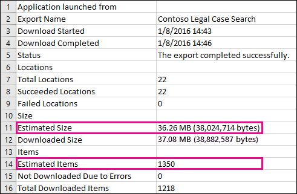

# Diferenças entre os resultados de pesquisa de descoberta eletrônica estimado e real

Este tópico se aplica a pesquisas que você pode executar usando uma das seguintes ferramentas de eDiscovery da Microsoft 365: 

- Pesquisa de conteúdo
- Descoberta Eletrônica Central 
   
Quando você executa uma pesquisa de descoberta eletrônica, a ferramenta que você está usando retorna uma estimativa do número de itens (e seu tamanho total) que atendem aos critérios de pesquisa. Por exemplo, quando você executa uma pesquisa no centro de conformidade da Microsoft 365, os resultados estimados da pesquisa são exibidos na página de menu para a pesquisa selecionada.
  

  
Esta é a mesma estimativa do tamanho total e do número de itens que é exibido na ferramenta de exportação de descoberta eletrônica quando você exporta os resultados para um computador local e no relatório de Resumo de exportação que é baixado com os resultados da pesquisa.
  
**Resultados estimados na ferramenta de exportação de descoberta eletrônica**

  
**Resultados estimados no relatório de Resumo de exportação**

  
No entanto, como você observará na captura de tela anterior do relatório de Resumo de exportação, o tamanho e o número dos resultados de pesquisa reais baixados são diferentes dos de tamanho e número de resultados de pesquisa estimados.
  

  
Aqui estão alguns motivos para estas diferenças:
  
- **A maneira como os resultados são estimados**. Uma estimativa dos resultados da pesquisa é apenas isso, uma previsão (e não uma contagem real) dos itens que atendem aos critérios de consulta de pesquisa. Para compilar a estimativa de itens do Exchange, uma lista das IDs de mensagem que atendem aos critérios de pesquisa é solicitada do banco de dados do Exchange pela ferramenta de descoberta eletrônica que você está usando. Mas quando você exporta os resultados da pesquisa, a pesquisa é executada novamente e as mensagens reais são recuperadas do banco de dados do Exchange. Portanto, essas diferenças podem ocorrer devido a como o número estimado de itens e o número real de itens são determinados.

- **Alterações que ocorrem entre o momento ao estimar e exportar resultados de pesquisa**. Quando você exporta os resultados da pesquisa, a pesquisa é reiniciada para coletar os itens mais recentes no índice de pesquisa que atendem aos critérios de pesquisa. É possível que haja itens adicionais criados, enviados ou recebidos que atendam aos critérios de pesquisa na hora entre o momento em que os resultados da pesquisa estimados foram coletados e quando os resultados da pesquisa foram exportados. Também é possível que os itens que estavam no índice de pesquisa quando os resultados da pesquisa fossem estimados não estão mais lá porque foram excluídos do local de conteúdo antes de os resultados da pesquisa serem exportados. Uma maneira de reduzir esse problema é especificar um intervalo de datas para uma pesquisa de descoberta eletrônica. Outra maneira é colocar uma retenção em locais de conteúdo para que os itens sejam preservados e não possam ser removidos. 

   Embora seja raro, mesmo no caso de uma retenção ser aplicada, a manutenção de itens de calendário internos (que não são editáveis pelo usuário, mas que estão incluídos em muitos resultados de pesquisa) podem ser removidas de tempos para a hora. Essa remoção periódica dos itens de calendário resultará em menos itens exportados.

- **Itens não indexados**. Itens não indexados para pesquisa podem causar diferenças entre resultados de pesquisa estimados e reais. Você pode incluir itens não indexados ao exportar os resultados da pesquisa. Se você incluir itens não indexados ao exportar resultados de pesquisa, pode haver mais itens exportados. Isso causará uma diferença entre os resultados de pesquisa estimados e exportados.

    Ao usar a ferramenta de pesquisa de conteúdo, você tem a opção de incluir itens não indexados na estimativa de pesquisa. O número de itens não indexados retornados pela pesquisa é listado na página de submenu junto com os outros resultados de pesquisa estimados. Todos os itens não indexados também serão incluídos no tamanho total dos resultados estimados da pesquisa. Ao exportar os resultados da pesquisa, você tem a opção de incluir ou não itens não indexados. A maneira como você configura essas opções pode resultar em diferenças entre os resultados de pesquisa estimados e os atuais que são baixados.

- **Exportar os resultados de uma pesquisa de conteúdo que inclui todos os locais de conteúdo**. Se a pesquisa de que você está exportando os resultados for uma pesquisa de todos os locais de conteúdo em sua organização, somente os itens não indexados de locais de conteúdo que contêm itens que correspondam aos critérios de pesquisa serão exportados. In other words, if no search results are found in a mailbox or site, then any unindexed items in that mailbox or site won't be exported. No entanto, os itens não indexados de todos os locais de conteúdo (mesmo aqueles que não contêm itens que correspondam à consulta de pesquisa) serão incluídos nos resultados de pesquisa estimados.

    Como alternativa, se a pesquisa que você está exportando resultados de locais de conteúdo específicos incluídos, os itens não indexados (que não foram excluídos pelos critérios de pesquisa) de todos os locais de conteúdo especificados na pesquisa serão exportados. Nesse caso, o número estimado de itens não indexados e o número de itens não indexados que são exportados devem ser os mesmos.

    O motivo para não exportar itens não indexados de todos os locais da organização é porque pode aumentar a probabilidade de erros de exportação e aumentar o tempo necessário para exportar e baixar os resultados da pesquisa.

- **Formatos de arquivo brutos versus formatos de arquivo exportados**. Para itens do Exchange, o tamanho estimado dos resultados da pesquisa é calculado usando os tamanhos brutos de mensagens do Exchange. No entanto, as mensagens de email são exportadas em um arquivo PST ou como mensagens individuais (que são formatadas como arquivos EML). Ambas as opções de exportação usam um formato de arquivo diferente das mensagens brutas do Exchange, o que resulta no tamanho total do arquivo exportado ser diferente do tamanho estimado do arquivo.

- **Versões de documento**. Para documentos do SharePoint, várias versões de um documento não estão incluídas nos resultados de pesquisa estimados. Mas você tem a opção de incluir todas as versões do documento ao exportar os resultados da pesquisa, o que aumentará o número real (e o tamanho total) dos documentos exportados. 

- **Eliminação de duplicação**. Para itens do Exchange, a eliminação de duplicação reduz o número de itens exportados. Você tem a opção de eliminar a duplicação dos resultados da pesquisa ao exportá-los. Para mensagens do Exchange, isso significa que apenas uma única instância de uma mensagem é exportada, mesmo que essa mensagem possa ser encontrada em várias caixas de correio. Os resultados de pesquisa estimados incluem todas as instâncias de uma mensagem. Portanto, se você escolher a opção de eliminação de duplicação ao exportar resultados de pesquisa, o número real de itens exportados poderá ser consideravelmente menor do que o número estimado de itens.

    Outra coisa a ter em mente se você escolher a opção de eliminação de duplicação é que todos os itens do Exchange são exportados em um único arquivo PST e a estrutura de pastas das caixas de correio de origem não é preservada. O arquivo PST exportado contém apenas os itens de email. No entanto, um relatório de resultados de pesquisa contém uma entrada para cada mensagem exportada que identifica a caixa de correio de origem onde a mensagem está localizada. Isso ajuda a identificar todas as caixas de correio que contêm uma mensagem duplicada. Se você não habilitou a deduplicação, um arquivo PST separado é exportado para cada caixa de correio incluída na pesquisa. 
 
> [!NOTE]
> Se você não marcar a opção **incluir itens que estão criptografados ou com um formato não reconhecido** ao exportar os resultados da pesquisa ou apenas baixar os relatórios, os relatórios de erros de índice serão baixados, mas não terão entradas. Isso não significa que não há nenhum erro de indexação. Apenas significa que itens não indexados não foram incluídos na exportação. 
