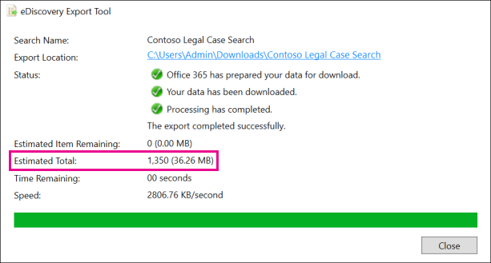

# Diferenças entre os resultados estimados e reais da pesquisa de DescobertaScobertaDifferences between estimated and actual eDiscovery search results

Este tópico se aplica às pesquisas que você pode executar usando uma das seguintes ferramentas de Descoberta e Do Microsoft 365:This topic applies to searches that you can run using one of the following Microsoft 365 eDiscovery tools: 

- Pesquisa de conteúdoContent search
- Descoberta Eletrônica CentralCore eDiscovery 
   
Quando você executar uma pesquisa de Descoberta eDiscovery, a ferramenta que você está usando retornará uma estimativa do número de itens (e seu tamanho total) que atendem aos critérios de pesquisa.When you run an eDiscovery search, the tool you're using will return an estimate of the number of items (and their total size) that meet the search criteria. Por exemplo, quando você executar uma pesquisa no centro de conformidade do Microsoft 365, os resultados estimados da pesquisa serão exibidos na página do flyout da pesquisa selecionada.For example, when you run a search in the Microsoft 365 compliance center, the estimated search results are displayed on the flyout page for the selected search.
  

  
Essa é a mesma estimativa do tamanho total e do número de itens exibidos na Ferramenta de Exportação de Descobertas e Quando você exporta resultados para um computador local e no relatório de Resumo de Exportação baixado com os resultados da pesquisa.This is the same estimate of total size and number of items that is displayed in the eDiscovery Export Tool when you export results to a local computer and in the Export Summary report that's downloaded with the search results.
  
**Resultados estimados na ferramenta de Exportação de Descobertas e Descobertas****Estimated results in the eDiscovery Export tool**

  
**Resultados estimados no relatório de Resumo de Exportação****Estimated results in Export Summary report**

  
No entanto, como você observará na captura de tela anterior do relatório Resumo de Exportação, o tamanho e o número de resultados reais da pesquisa baixados são diferentes do tamanho e do número de resultados estimados da pesquisa.However, as you'll notice in the previous screenshot of the Export Summary report, the size and number of actual search results that are downloaded are different than the size and number of estimated search results.
  

  
Aqui estão alguns motivos para essas diferenças:Here are some reasons for these differences:
  
- **A maneira como os resultados são estimados.****The way results are estimated**. Uma estimativa dos resultados da pesquisa é apenas essa, uma estimativa (e não uma contagem real) dos itens que atendem aos critérios de consulta de pesquisa.An estimate of the search results is just that, an estimate (and not an actual count) of the items that meet the search query criteria. Para compilar a estimativa de itens do Exchange, uma lista das IDs de mensagem que atendem aos critérios de pesquisa é solicitada do banco de dados do Exchange pela ferramenta de Descoberta eDiscovery que você está usando.To compile the estimate of Exchange items, a list of the message IDs that meet the search criteria is requested from the Exchange database by the eDiscovery tool you're using. Mas quando você exporta os resultados da pesquisa, a pesquisa é reruncar e as mensagens reais são recuperadas do banco de dados do Exchange.But when you export the search results, the search is rerun and the actual messages are retrieved from the Exchange database. Portanto, essas diferenças podem resultar em como o número estimado de itens e o número real de itens são determinados.So these differences might result because of how the estimated number of items and the actual number of items are determined.

- **Alterações que ocorrem entre o tempo ao estimar e exportar resultados de pesquisa.****Changes that happen between the time when estimating and exporting search results**. Quando você exporta os resultados da pesquisa, a pesquisa é reiniciada para coletar os itens mais recentes no índice de pesquisa que atendem aos critérios de pesquisa.When you export search results, the search is restarted to collect that most recent items in the search index that meet the search criteria. É possível que haja itens adicionais criados, enviados ou recebidos que atendem aos critérios de pesquisa no tempo entre quando os resultados estimados da pesquisa foram coletados e quando os resultados da pesquisa foram exportados.It's possible there are additional items were created, sent, or received that meet the search criteria in the time between when the estimated search results were collected and when the search results were exported. Também é possível que os itens que estavam no índice de pesquisa quando os resultados da pesquisa foram estimados não estão mais lá porque foram limpos do local de conteúdo antes que os resultados da pesquisa sejam exportados.It's also possible that items that were in the search index when the search results were estimated are no longer there because they were purged from the content location before the search results are exported. Uma maneira de atenuar esse problema é especificar um intervalo de datas para uma pesquisa de Descoberta eDiscovery.One way to mitigate this issue is to specify a date range for an eDiscovery search. Outra maneira é colocar em espera locais de conteúdo para que os itens sejam preservados e não possam ser limpos.Another way is to place a hold on content locations so that items are preserved and can't be purged. 

   Embora raro, mesmo no caso em que uma espera é aplicada, a manutenção de itens de calendário integrados (que não são editáveis pelo usuário, mas estão incluídos em muitos resultados de pesquisa) pode ser removida de tempos em tempos.Although rare, even in the case when a hold is applied, maintenance of built-in calendar items (which aren't editable by the user, but are included in many search results) may be removed from time to time. Essa remoção periódica de itens de calendário resultará em menos itens exportados.This periodic removal of calendar items will result in fewer items that are exported.

- **Itens não índicedos.****Unindexed items**. Itens não índicedos para pesquisa podem causar diferenças entre os resultados estimados e reais da pesquisa.Items that are unindexed for search can cause differences between estimated and actual search results. Você pode incluir itens não índicedos ao exportar os resultados da pesquisa.You can include unindexed items when you export the search results. Se você incluir itens não índicedos ao exportar resultados de pesquisa, talvez haja mais itens exportados.If you include unindexed items when exporting search results, there might be more items that are exported. Isso causará uma diferença entre os resultados de pesquisa estimados e exportados.This will cause a difference between the estimated and exported search results.

    Ao usar a ferramenta de pesquisa de conteúdo, você tem a opção de incluir itens não índicedos na estimativa de pesquisa.When using the Content search tool, you have the option to include unindexed items in the search estimate. O número de itens não índicedos retornados pela pesquisa é listado na página do flyout junto com os outros resultados estimados da pesquisa.The number of unindexed items returned by the search is listed on the flyout page together with the other estimated search results. Todos os itens não índicedos também seriam incluídos no tamanho total dos resultados estimados da pesquisa.Any unindexed items would also be included in the total size of the estimated search results. Ao exportar os resultados da pesquisa, você tem a opção de incluir ou não itens não índicedos.When you export search results, you have the option to include or not include unindexed items. A maneira como você configura essas opções pode resultar em diferenças entre os resultados estimados e reais da pesquisa baixados.How you configure these options might result in differences between estimated and the actual search results that are downloaded.

- **Exportar os resultados de uma Pesquisa de Conteúdo que inclui todos os locais de conteúdo.****Exporting the results of a Content Search that includes all content locations**. Se a pesquisa de onde você está exportando resultados for uma pesquisa de todos os locais de conteúdo em sua organização, somente os itens não índicedos de locais de conteúdo que contêm itens que corresponderem aos critérios de pesquisa serão exportados.If the search that you're exporting results from was a search of all content locations in your organization, then only the unindexed items from content locations that contain items that match the search criteria will be exported. In other words, if no search results are found in a mailbox or site, then any unindexed items in that mailbox or site won't be exported.In other words, if no search results are found in a mailbox or site, then any unindexed items in that mailbox or site won't be exported. No entanto, itens não índicedos de todos os locais de conteúdo (mesmo aqueles que não contêm itens que corresponderem à consulta de pesquisa) serão incluídos nos resultados estimados da pesquisa.However, unindexed items from all content locations (even those that don't contain items that match the search query) will be included in the estimated search results.

    Como alternativa, se a pesquisa que você está exportando resultados de locais de conteúdo específicos incluídos, os itens não índicedos (que não são excluídos pelos critérios de pesquisa) de todos os locais de conteúdo especificados na pesquisa serão exportados.Alternatively, if the search that you're exporting results from included specific content locations, then unindexed items (that aren't excluded by the search criteria) from all the content locations specified in the search will be exported. Nesse caso, o número estimado de itens não índicedos e o número de itens não índicedos exportados devem ser os mesmos.In this case, the estimated number of unindexed items and the number of unindexed items that are exported should be the same.

    O motivo para não exportar itens não índicedos de cada local na organização é porque pode aumentar a probabilidade de erros de exportação e aumentar o tempo necessário para exportar e baixar os resultados da pesquisa.The reason for not exporting unindexed items from every location in the organization is because it might increase the likelihood of export errors and increase the time it takes to export and download the search results.

- **Formatos de arquivo brutos versus formatos de arquivo exportados.****Raw file formats versus exported file formats**. Para itens do Exchange, o tamanho estimado dos resultados da pesquisa é calculado usando os tamanhos brutos de mensagens do Exchange.For Exchange items, the estimated size of the search results is calculated by using the raw Exchange message sizes. No entanto, as mensagens de email são exportadas em um arquivo PST ou como mensagens individuais (que são formatadas como arquivos EML).However, email messages are exported in a PST file or as individual messages (which are formatted as EML files). Ambas as opções de exportação usam um formato de arquivo diferente das mensagens brutas do Exchange, o que resulta no tamanho total do arquivo exportado diferente do tamanho estimado do arquivo.Both of these export options use a different file format than raw Exchange messages, which results in the total exported file size being different than the estimated file size.

- **Versões do documento.****Document versions**. Para documentos do SharePoint, várias versões de um documento não são incluídas nos resultados estimados da pesquisa.For SharePoint documents, multiple versions of a document aren't included in the estimated search results. Mas você tem a opção de incluir todas as versões do documento ao exportar os resultados da pesquisa, o que aumentará o número real (e o tamanho total) dos documentos exportados.But you have the option to include all document versions when you export the search results, which will increase the actual number (and total size) of the exported documents. 

- **Des duplicação.****De-duplication**. Para itens do Exchange, a des duplicação reduz o número de itens exportados.For Exchange items, de-duplication reduces the number of items that are exported. Você tem a opção de des duplicar os resultados da pesquisa ao exportá-los.You have the option to de-duplicate the search results when you export them. Para mensagens do Exchange, isso significa que apenas uma única instância de uma mensagem é exportada, mesmo que essa mensagem possa ser encontrada em várias caixas de correio.For Exchange messages, this means that only a single instance of a message is exported, even though that message might be found in multiple mailboxes. Os resultados estimados da pesquisa incluem todas as instâncias de uma mensagem.The estimated search results include every instance of a message. Portanto, se você escolher a opção de des duplicação ao exportar os resultados da pesquisa, o número real de itens exportados pode ser consideravelmente menor do que o número estimado de itens.So if you choose the de-duplication option when exporting search results, the actual number of items that are exported might be considerably less than the estimated number of items.

    Outra coisa a ter em mente se você escolher a opção de des duplicação é que todos os itens do Exchange são exportados em um único arquivo PST e a estrutura de pastas das caixas de correio de origem não é preservada.Another thing to keep in mind if you choose the de-duplication option is that all Exchange items are exported in a single PST file and the folder structure from the source mailboxes isn't preserved. O arquivo PST exportado contém apenas os itens de email.The exported PST file just contains the email items. No entanto, um relatório de resultados de pesquisa contém uma entrada para cada mensagem exportada que identifica a caixa de correio de origem onde a mensagem está localizada.However, a search results report contains an entry for each exported message that identifies the source mailbox where the message is located. Isso ajuda a identificar todas as caixas de correio que contêm uma mensagem duplicada.This helps you identify all mailboxes that contain a duplicate message. Se você não habilitou a deduplicação, um arquivo PST separado é exportado para cada caixa de correio incluída na pesquisa.If you don't enable de-duplication, a separate PST file is exported for each mailbox included in the search. 
 
> [!NOTE]
> Se você não selecionar  a opção Incluir itens que são criptografados ou têm uma opção de formato não reconhecedo quando você exporta resultados de pesquisa ou apenas baixa os relatórios, os relatórios de erro de índice são baixados, mas eles não têm nenhuma entrada.If you don't select the **Include items that are encrypted or have an unrecognized format** option when you export search results or just download the reports, the index error reports are downloaded but they don't have any entries. Isso não significa que não haja erros de indexação.This doesn't mean there aren't any indexing errors. Isso significa apenas que os itens não índicedos não foram incluídos na exportação.It just means that unindexed items weren't included in the export. 
