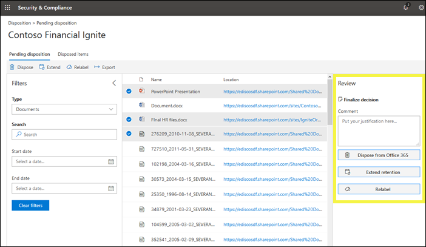

# Visão geral das revisões de disposiçãoOverview of disposition reviews

>*[Diretrizes de licenciamento da Microsoft 365 para segurança & conformidade](https://aka.ms/ComplianceSD).**[Microsoft 365 licensing guidance for security & compliance](https://aka.ms/ComplianceSD).*

Quando o conteúdo atinge o final do período de retenção, há vários motivos para que você possa querer revisar o conteúdo para decidir se ele pode ser excluído com segurança ("descartado").When content reaches the end of its retention period, there are several reasons why you might want to review that content to decide whether it can be safely deleted ("disposed"). Por exemplo, você pode precisar:For example, you might need to:
  
- Suspender a exclusão ("disposição") de conteúdo relevante no caso de litígio ou auditoria.Suspend the deletion ("disposition") of relevant content in the event of litigation or an audit.
    
- Remova o conteúdo da lista de descarte para armazenar em um arquivo morto, se esse conteúdo tiver um valor de pesquisa ou histórico.Remove content from the disposition list to store in an archive, if that content has research or historical value.
    
- Atribua um período de retenção diferente ao conteúdo, se a política original era uma solução temporária ou provisionada.Assign a different retention period to the content, if the original policy was a temporary or provisional solution.
    
- Retornar o conteúdo aos clientes ou transferi-lo para outra organização.Return the content to clients or transfer it to another organization.
    
Ao criar um rótulo de retenção no centro de conformidade da Microsoft 365, no centro de segurança da Microsoft 365 ou no centro de conformidade & segurança do Office 365, você pode optar por acionar uma análise de disposição no final do período de retenção.When you create a retention label in the Microsoft 365 compliance center, Microsoft 365 security center, or Office 365 Security & Compliance Center, you can choose to trigger a disposition review at the end of the retention period. Em uma revisão de disposição:In a disposition review:
  
- As pessoas escolhidas recebem uma notificação por email de que o conteúdo deve ser revisado.The people you choose receive an email notification that they have content to review. Observe que as notificações são enviadas semanalmente.Note that notifications are sent on a weekly basis.
    
- Os revisores vão para a página de **disposição** no centro &amp; de conformidade de segurança para analisar o conteúdo.The reviewers go to the **Disposition** page in the Security &amp; Compliance Center to review the content. Os revisores podem ver quantos itens de cada rótulo de retenção estão aguardando disposição e, em seguida, selecione um rótulo de retenção para ver todo o conteúdo com esse rótulo.The reviewers can see how many items for each retention label are awaiting disposition, and then select a retention label to see all content with that label.
    
- Para cada documento ou email, o revisor pode:For each document or email, the reviewer can:
    
  - Aplicar um rótulo de retenção diferente.Apply a different retention label.
    
  - Estenda seu período de retenção.Extend its retention period.
    
  - Excluí-la permanentemente.Permanently delete it.
    
- Os revisores podem exibir as desposições pendentes ou concluídas e exportar essa lista como um arquivo. csv.Reviewers can view either pending or completed dispositions, and export that list as a .csv file.

Uma análise de disposição pode incluir conteúdo em caixas de correio do Exchange, sites do SharePoint, contas do OneDrive e grupos do Office 365.A disposition review can include content in Exchange mailboxes, SharePoint sites, OneDrive accounts, and Office 365 groups. O conteúdo que está aguardando uma revisão de disposição nesses locais é excluído somente depois que um revisor escolhe excluir permanentemente o conteúdo.Content awaiting a disposition review in those locations is deleted only after a reviewer chooses to permanently delete the content.
  

## Configurando a análise de disposição criando um rótulo de retençãoSetting up the disposition review by creating a retention label

Este é o fluxo de trabalho básico para configurar uma revisão de disposição.This is the basic workflow for setting up a disposition review. Observe que esse fluxo mostra um rótulo de retenção sendo publicado e, em seguida, aplicado manualmente por um usuário; Como alternativa, um rótulo de retenção que dispara uma análise de disposição pode ser aplicado automaticamente ao conteúdo.Note that this flow shows a retention label being published and then manually applied by a user; alternatively, a retention label that triggers a disposition review can be auto-applied to content.
  

  
Uma revisão de disposição é uma opção quando você cria um rótulo de retenção no Office 365.A disposition review is an option when you create a retention label in Office 365. Essa opção não está disponível em uma política de retenção, mas somente em um rótulo de retenção que é configurado para reter conteúdo.This option is not available in a retention policy but only in a retention label that's configured to retain content.
  
Para obter mais informações sobre rótulos de retenção, consulte [Overview of Retention Labels](labels.md).For more information about retention labels, see [Overview of retention labels](labels.md).
  

 
> [!NOTE]
> Quando você especificar a opção **notifique essas pessoas quando houver itens prontos para revisão**, especifique um usuário.When you specify the option **Notify these people when there are items ready to review**, specify a user. Os grupos do Office 365 não têm suporte para essa opção.Office 365 groups are not supported for this option.

## Descartando conteúdoDisposing content

Quando um revisor é notificado por email que o conteúdo está pronto para revisão, eles podem ir até a página de **disposição** no &amp; centro de conformidade de segurança.When a reviewer is notified by email that content is ready to review, they can go to the **Disposition** page in the Security &amp; Compliance Center. Os revisores podem ver quantos itens de cada rótulo de retenção estão aguardando disposição e, em seguida, selecione um rótulo de retenção para ver todo o conteúdo com esse rótulo.The reviewers can see how many items for each retention label are awaiting disposition, and then select a retention label to see all content with that label.

Depois que você selecionar um rótulo de retenção, a próxima página mostrará todas as desposições pendentes para esse rótulo.After you select a retention label, the next page shows all pending dispositions for that label.

O revisor pode então:The reviewer can then: 
  
- Aplicar um rótulo de retenção diferente.Apply a different retention label.
    
- Estenda o período de retenção.Extend the retention period.
    
- Excluir permanentemente o item.Permanently delete the item.

Observe que um revisor pode selecionar vários itens e descartá-los ao mesmo tempo.Note that a reviewer can select multiple items and dispose them at the same time.
    
Um revisor também pode usar o link para exibir o documento em seu local original, se o revisor tiver permissões para esse local.A reviewer can also use the link to view the document in its original location, if the reviewer has permissions for that location. Durante uma revisão de disposição, o conteúdo nunca se move do local original e nunca é excluído até que o revisor opte por fazê-lo.During a disposition review, the content never moves from its original location, and it's never deleted until the reviewer chooses to do so.
  
Observe que as notificações por email são enviadas automaticamente aos revisores de forma semanal.Note that the email notifications are sent automatically to reviewers on a weekly basis. Portanto, quando o conteúdo atinge o final do período de retenção, pode levar até sete dias para que os revisores recebam a notificação por email de que o conteúdo está aguardando disposição.Therefore, when content reaches the end of its retention period, it may take up to seven days for reviewers to receive the email notification that content is awaiting disposition.
  
Observe também que todas as ações de disposição são auditadas.Also note that all disposition actions are audited. Para garantir isso, você deve ativar a auditoria pelo menos um dia antes da primeira ação de disposição: para saber mais, confira [Pesquisar o log de auditoria no centro de conformidade &amp; de segurança do Office 365](search-the-audit-log-in-security-and-compliance.md).To ensure this, you must turn on auditing at least one day prior to the first disposition action - for more information, see [Search the audit log in the Office 365 Security &amp; Compliance Center](search-the-audit-log-in-security-and-compliance.md). 
  
## Permissões para descartePermissions for disposition

Para acessar a página de **disposição** , os revisores devem receber a função de **Gerenciamento de descarte** e a função de **logs de auditoria somente para exibição** .To access the **Disposition** page, reviewers must be assigned the **Disposition Management** role and the **View-Only Audit Logs** role. [Exibir instruções](../security/office-365-security/grant-access-to-the-security-and-compliance-center.md) para atribuição de funções.[View instructions](../security/office-365-security/grant-access-to-the-security-and-compliance-center.md) for assigning roles.

Específico para a função de **logs de auditoria somente para exibição** :Specific to the **View-Only Audit Logs** role:

- Como o cmdlet subjacente usado para pesquisar o log de auditoria é um cmdlet do Exchange Online, você deve atribuir essa função aos usuários usando o [centro de administração do Exchange no Exchange Online](https://docs.microsoft.com/Exchange/exchange-admin-center), em vez de usar a página de **permissões** no centro de conformidade de segurança &.Because the underlying cmdlet used to search the audit log is an Exchange Online cmdlet, you must assign users this role by using the [Exchange admin center in Exchange Online](https://docs.microsoft.com/Exchange/exchange-admin-center), rather than by using the **Permissions** page in the Security & Compliance Center. Para obter instruções, consulte [Manage role groups in Exchange Online](https://docs.microsoft.com/Exchange/permissions-exo/role-groups).For instructions, see [Manage role groups in Exchange Online](https://docs.microsoft.com/Exchange/permissions-exo/role-groups).

- Os grupos do Office 365 não têm suporte para essa função.Office 365 Groups aren't supported for this role. Em vez disso, atribua caixas de correio do usuário ou usuários de email.Instead, assign user mailboxes or mail users.
  
## Quanto tempo até o conteúdo Descartado é excluído permanentementeHow long until disposed content is permanently deleted

O conteúdo que está aguardando uma análise de disposição é excluído somente depois que um revisor escolhe excluir permanentemente o conteúdo.Content awaiting a disposition review is deleted only after a reviewer chooses to permanently delete the content. Quando o revisor escolhe essa opção, o conteúdo do site do SharePoint ou da conta do OneDrive fica qualificado para o processo de limpeza padrão descrito nesta seção: [como funciona uma política de retenção com conteúdo in-loco](retention-policies.md#how-a-retention-policy-works-with-content-in-place).When the reviewer chooses this option, the content in the SharePoint site or OneDrive account becomes eligible for the standard cleanup process described in this section: [How a retention policy works with content in place](retention-policies.md#how-a-retention-policy-works-with-content-in-place).
  
Isso significa que:This means that:
  
- O conteúdo de uma biblioteca de documentos será movido para a lixeira de primeiro estágio **dentro de sete dias** de disposição e, em seguida, excluído permanentemente **93 dias** após isso.Content in a document library will be moved to the first-stage Recycle Bin **within 7 days** of disposition, and then permanently deleted **93 days** after that. A lixeira não é indexada pela pesquisa e, portanto, seu conteúdo não está disponível para um bloqueio de descoberta eletrônica.The Recycle Bin is not indexed by search and therefore its contents are not available to an eDiscovery hold.

- O conteúdo da biblioteca de retenção de preservação será excluído permanentemente **dentro de 7 dias** após o descarte.Content in the Preservation Hold library will be permanently deleted **within 7 days** of disposition.

- Os itens em uma caixa de correio do Exchange serão excluídos permanentemente **dentro de 14 dias** de disposição.Items in an Exchange mailbox will be permanently deleted **within 14 days** of disposition. (Observe que 14 dias é a configuração padrão, mas ela pode ser configurada até 30 dias).(Note that 14 days is the default setting but it can be configured up to 30 days.)
    
## Exibir desposições pendentes e itens descartadosView pending dispositions and disposed items

Na página de **disposição pendente** , você pode exibir as desposições pendentes e concluídas para um rótulo de retenção específico:On the **Pending disposition** page, you can view both pending and completed dispositions for a specific retention label: 
  
- A **disposição pendente** mostra itens que atingiram o final do período de retenção e exigem uma revisão de disposição.The **Pending disposition** shows items that have reached the end of their retention period and require a disposition review. Após a revisão de cada item, decida se deseja aplicar um rótulo de retenção diferente a ele, estenda o período de retenção ou exclua-o permanentemente.After reviewing each item, decide if you want to apply a different retention label to it, extend its retention period, or permanently delete it. Você pode selecionar vários itens.You can select multiple items.
    
- A guia **itens descartados** mostra itens excluídos permanentemente que já foram transferidos por uma análise de disposição.The **Disposed items** tab shows permanently-deleted items that have already been through a disposition review. Eles são exibidos aqui porque o processo de exclusão permanente pode levar vários dias, conforme indicado na seção acima.They show here because the permanent deletion process can take several days, as noted in the section above. Itens que tiveram um rótulo de retenção diferente aplicado ou tiveram seu período de retenção estendido como parte de uma revisão, não aparecerão aqui.Items that had a different retention label applied, or had their retention period extended as part of a review, won't appear here.

    
### Filtrar as exibições de disposiçãoFilter the disposition views

Você pode filtrar esses modos de exibição por rótulo de retenção ou intervalo de tempo.You can filter these views by retention label or time range. Para desposições pendentes, o intervalo de tempo é baseado na data de expiração.For pending dispositions, the time range is based on the expiration date. Para itens descartados, o intervalo de tempo é baseado na data de exclusão.For disposed items, the time range is based on the deletion date.
  

### Exportar os itens de disposiçãoExport the disposition items

Além disso, você pode exportar os itens em um modo de exibição como um arquivo. csv que pode ser aberto no Excel.In addition, you can export the items in either view as a .csv file that you can open in Excel.
  

  

