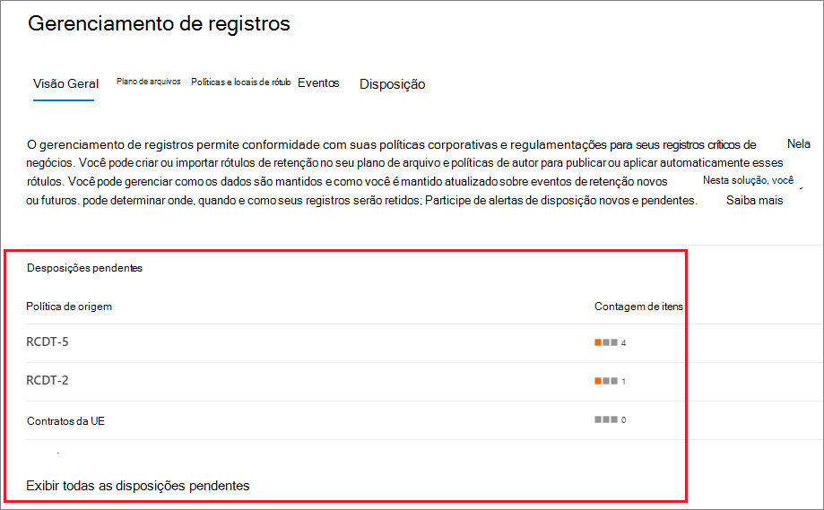
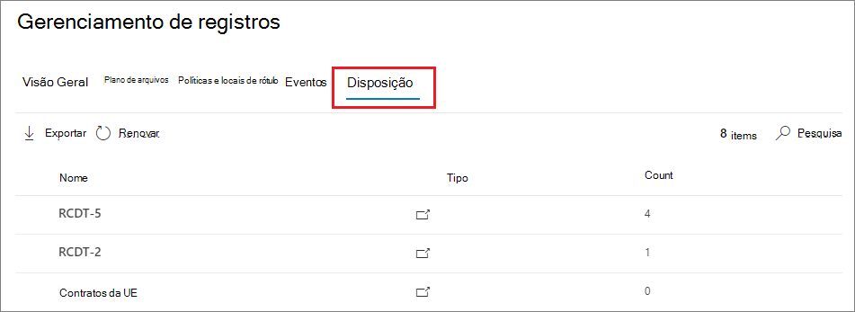
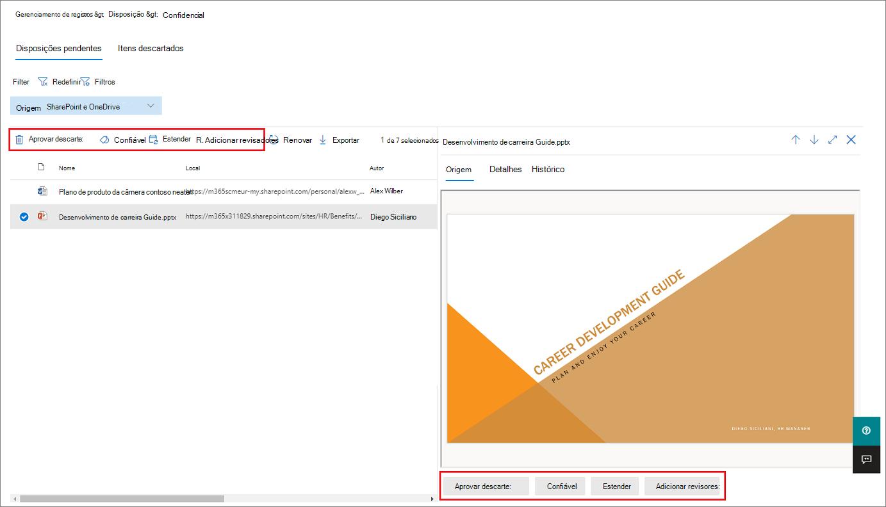
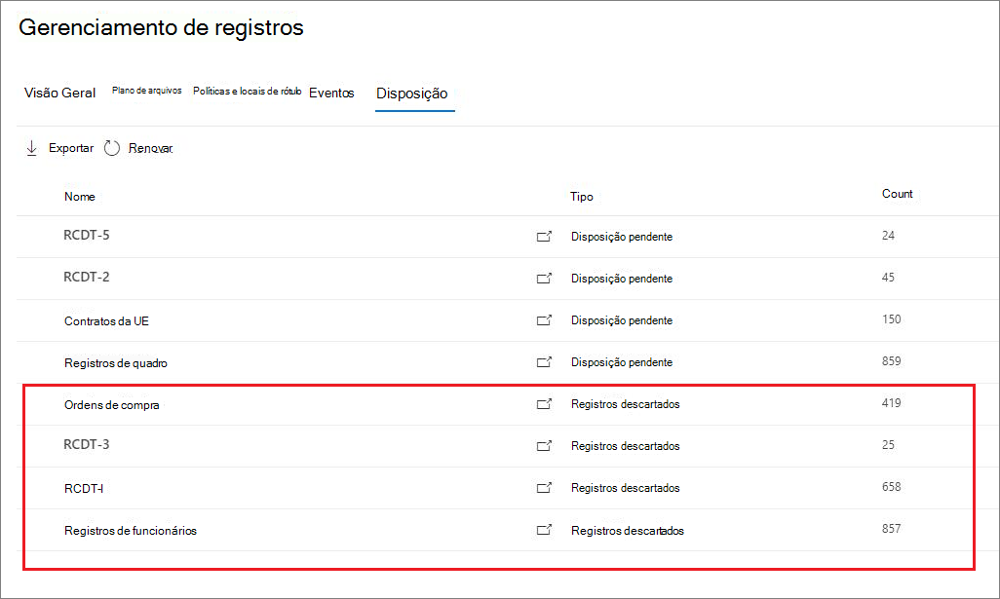
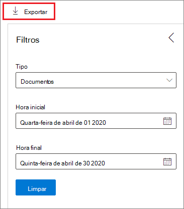

# Disposição do conteúdo

>*[Diretrizes de licenciamento do Microsoft 365 para segurança e conformidade](https://aka.ms/ComplianceSD).*

Use a guia **disposição** do **Gerenciamento de registros** no centro de conformidade da Microsoft 365 para gerenciar revisões de disposição e exibir [registros](records.md) que foram excluídos automaticamente no final do período de retenção. 

## Pré-requisitos para exibir desposições de conteúdo

Para gerenciar revisões de disposição e confirmar que os registros foram excluídos, você deve ter permissões suficientes e a auditoria deve estar habilitada.

### Permissões para descarte

Para acessar com êxito a guia **disposição** no centro de conformidade da Microsoft 365, você deve ser membro da função de **Gerenciamento de descarte** e da função de logs de **auditoria somente para exibição** . Recomendamos criar um novo grupo de função chamado **revisores de disposição**e adicionar essas duas funções a esse grupo de função. 

Específico para a função de **logs de auditoria somente para exibição** :

- Como o cmdlet subjacente usado para pesquisar o log de auditoria é um cmdlet do Exchange Online, você deve atribuir essa função aos usuários usando o [centro de administração do Exchange no Exchange Online](https://docs.microsoft.com/Exchange/exchange-admin-center), em vez de usar a página de **permissões** no centro de conformidade de segurança &. Para obter instruções, consulte [Manage role groups in Exchange Online](https://docs.microsoft.com/Exchange/permissions-exo/role-groups).

- Os grupos do Microsoft 365 ([anteriormente Office 365 grupos](https://techcommunity.microsoft.com/t5/microsoft-365-blog/office-365-groups-will-become-microsoft-365-groups/ba-p/1303601)) não têm suporte para essa função. Em vez disso, atribua caixas de correio de usuário, usuários de email ou grupos de segurança habilitados para email.

Para obter instruções para conceder aos usuários a função de **Gerenciamento de descarte** e criar sua nova função de **revisores de disposição** , consulte [dar aos &amp; usuários acesso ao centro de conformidade de segurança do Office 365](../security/office-365-security/grant-access-to-the-security-and-compliance-center.md).

### Habilitar a auditoria

Certifique-se de que a auditoria esteja habilitada pelo menos um dia antes da primeira ação de disposição. Para obter mais informações, consulte [Pesquisar o log de auditoria no centro de &amp; conformidade de segurança do Office 365](search-the-audit-log-in-security-and-compliance.md). 

## Revisões de disposição

Quando o conteúdo atinge o final do período de retenção, há vários motivos para que você possa querer revisar o conteúdo para decidir se ele pode ser excluído com segurança ("descartado"). Por exemplo, você pode precisar:
  
- Suspender a exclusão de conteúdo relevante no caso de litígio ou auditoria.
    
- Remova o conteúdo da lista de descarte para armazenar em um arquivo morto, se esse conteúdo tiver um valor de pesquisa ou histórico.
    
- Atribua um período de retenção diferente ao conteúdo, talvez porque as configurações de retenção originais foram uma solução temporária ou provisionada.
    
- Retornar o conteúdo aos clientes ou transferi-lo para outra organização.

Quando uma revisão de disposição é disparada no final do período de retenção:
  
- As pessoas escolhidas recebem uma notificação por email de que o conteúdo deve ser revisado. Esses revisores podem ser usuários individuais, grupos de distribuição ou segurança ou grupos do Office 365. Observe que as notificações são enviadas semanalmente.
    
- Os revisores vão para a guia **disposição** no centro de conformidade da Microsoft 365 para analisar o conteúdo e decidir se ele será excluído permanentemente, estender o período de retenção ou aplicar um rótulo de retenção diferente.

Uma análise de disposição pode incluir conteúdo em caixas de correio do Exchange, sites do SharePoint, contas do OneDrive e Microsoft 365 grupos. O conteúdo que está aguardando uma revisão de disposição nesses locais é excluído somente depois que um revisor escolhe excluir permanentemente o conteúdo.

Você pode ver uma visão geral de todas as desposições pendentes na guia **visão geral** . Por exemplo:

Ao selecionar a página **Exibir todas as reposições pendentes**, você será levado para a página de **disposição** . Por exemplo:

### Fluxo de trabalho para uma análise de disposição

Este é o fluxo de trabalho básico para uma revisão de disposição quando um rótulo de retenção é publicado e, em seguida, aplicado manualmente por um usuário. Como alternativa, um rótulo de retenção configurado para uma revisão de disposição pode ser aplicado automaticamente ao conteúdo.
  

  
O disparo de uma revisão de disposição no final do período de retenção é uma opção de configuração que está disponível apenas com um [rótulo de retenção](labels.md). Essa opção não está disponível em uma política de retenção.
  

 
> [!NOTE]
> Quando você seleciona a opção **notificar essas pessoas quando há itens prontos para revisão**, especifique um usuário ou um grupo de segurança habilitado para email. Os grupos do Microsoft 365 ([anteriormente Office 365 grupos](https://techcommunity.microsoft.com/t5/microsoft-365-blog/office-365-groups-will-become-microsoft-365-groups/ba-p/1303601)) não têm suporte para essa opção.

### Exibindo e descartando conteúdo

Quando um revisor é notificado por email que o conteúdo está pronto para revisão, ele vai para a guia **disposição** do **Gerenciamento de registros** no centro de conformidade da Microsoft 365. Os revisores podem ver quantos itens de cada rótulo de retenção estão aguardando disposição e, em seguida, selecione um rótulo de retenção para ver todo o conteúdo com esse rótulo.

Depois de selecionar um rótulo de retenção, você verá todas as desposições pendentes para esse rótulo da guia **eliminação pendente** . Selecione um ou mais itens onde você pode escolher uma ação e inserir um comentário de justificativa:

Como você pode ver na imagem, as ações suportadas são: 
  
- Excluir permanentemente o item
- Estender o período de retenção
- Aplicar um rótulo de retenção diferente

Fornecendo permissões para o local e o conteúdo, você pode usar o link na coluna **local** para exibir documentos em seu local original. Durante uma revisão de disposição, o conteúdo nunca se move do local original e nunca é excluído até que o revisor opte por fazê-lo.
  
As notificações por email são enviadas automaticamente para os revisores de forma semanal. Esse processo agendado significa que, quando o conteúdo atinge o final do período de retenção, pode levar até sete dias para que os revisores recebam a notificação de email de que o conteúdo está aguardando a eliminação.
  
Todas as ações de disposição podem ser auditadas.
  
### Quanto tempo até o conteúdo Descartado é excluído permanentemente

O conteúdo que está aguardando uma análise de disposição é excluído somente depois que um revisor escolhe excluir permanentemente o conteúdo. Quando o revisor escolhe essa opção, o conteúdo do site do SharePoint ou da conta do OneDrive fica qualificado para o processo de limpeza padrão descrito em [como uma política de retenção funciona com o conteúdo](retention-policies.md#how-a-retention-policy-works-with-content-in-place)in-loco.

## Disposição de registros

> [!NOTE]
> A capacidade de ver os registros que foram excluídos automaticamente sem uma análise de descarte é descontínua para os locatários durante abril e maio de 2020, portanto, talvez você não veja essa experiência imediatamente.

Use a guia **disposição** da página **Gerenciamento de registros** para identificar os registros excluídos automaticamente. Estes itens exibem os **registros descartados** na coluna **tipo** . Por exemplo:

Os itens que são mostrados na guia **itens descartados** para rótulos de registro são mantidos por até 7 anos após o item ter sido descartado, com um limite de 1 milhão itens por registro para esse período. Se você vir o número de **contagem** perto desse limite de 1 milhão e precisar de uma prova de disposição para os seus registros, entre em contato com o [suporte da Microsoft](https://docs.microsoft.com/office365/admin/contact-support-for-business-products).

> [!NOTE]
> Essa funcionalidade é baseada nas informações do [log de auditoria unificada](search-the-audit-log-in-security-and-compliance.md) e, portanto, requer que a auditoria seja [habilitada e pesquisável](turn-audit-log-search-on-or-off.md) para que os eventos correspondentes sejam capturados.
    
## Filtrar e exportar os modos de exibição

Quando você seleciona um rótulo de retenção na página **disposição** , a guia de **disposição pendente** (se aplicável) e a guia **itens descartados** permitem filtrar os modos de exibição para ajudá-lo a localizar itens com mais facilidade. 

Para desposições pendentes, o intervalo de tempo é baseado na data de expiração. Para itens descartados, o intervalo de tempo é baseado na data de exclusão.
  
Você pode exportar informações sobre os itens em um modo de exibição como um arquivo. csv que você pode classificar e gerenciar usando o Excel:

  

