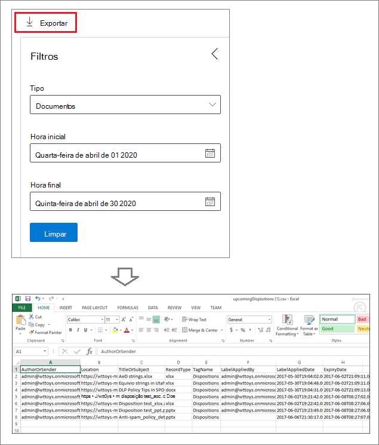

# Disposição de conteúdoDisposition of content

>*[Diretrizes de licenciamento do Microsoft 365 para segurança e conformidade](/office365/servicedescriptions/microsoft-365-service-descriptions/microsoft-365-tenantlevel-services-licensing-guidance/microsoft-365-security-compliance-licensing-guidance).**[Microsoft 365 licensing guidance for security & compliance](/office365/servicedescriptions/microsoft-365-service-descriptions/microsoft-365-tenantlevel-services-licensing-guidance/microsoft-365-security-compliance-licensing-guidance).*

Use a guia **Disposição** do **Gerenciamento de Registros** no Centro de conformidade do Microsoft 365 para gerenciar análises de disposição e exibir [registros](records-management.md#records) que foram excluídos automaticamente no final do período de retenção.Use the **Disposition** tab from **Records Management** in the Microsoft 365 compliance center to manage disposition reviews and view [records](records-management.md#records) that have been automatically deleted at the end of their retention period. 

## Pré-requisitos para exibir disposições de conteúdoPrerequisites for viewing content dispositions

Para gerenciar as revisões de disposição e confirmar que os registros foram excluídos, você deve ter permissões suficientes e a auditoria deve ser habilitada.To manage disposition reviews and confirm that records have been deleted, you must have sufficient permissions and auditing must be enabled.

### Permissões para disposiçãoPermissions for disposition

Para acessar a guia **Disposição** no Centro de conformidade do Microsoft 365, os usuários devem ter função de administrador **Gerenciamento de disposição**.To successfully access the **Disposition** tab in the Microsoft 365 compliance center, users must have the **Disposition Management** admin role. A partir de dezembro de 2020, esta função está incluída no grupo de função de administrador padrão **Gerenciamento de Registros**.From December 2020, this role is now included in the **Records Management** default admin role group.

> [!NOTE]
> Por padrão, até mesmo um administrador global precisa ter a função de **Gerenciamento de Disposição**.By default, a global admin isn't granted the **Disposition Management** role. 

Para conceder aos usuários apenas as permissões necessárias para revisões de disposição sem conceder permissões para exibir e configurar outros recursos para gerenciamento de retenção e de registros, crie um grupo de função personalizada (por exemplo, chamado "Revisores de Disposição") e conceda a esse grupo a função de Gerenciamento de Disposição.To grant users just the permissions they need for disposition reviews without granting them permissions to view and configure other features for retention and records management, create a custom role group (for example, named "Disposition Reviewers") and grant this group the Disposition Management role.

Além disso, para exibir o conteúdo dos itens durante o processo de disposição, adicione usuários aos dois grupos de funções a seguir: **Visualizador de conteúdo do Explorador de Conteúdos** e **Visualizador de Lista de Explorador de Conteúdos**.Additionally, to view the contents of items during the disposition process, add users to the following two role groups: **Content Explorer Content Viewer** and **Content Explorer List Viewer**. Se os usuários não tiverem as permissões desses grupos de função, ainda poderão selecionar uma ação de revisão de disposição para concluir a revisão de disposição, mas deve fazê-lo sem a capacidade de exibir o conteúdo do item do centro de conformidade.If users don't have the permissions from these role groups, they can still select a disposition review action to complete the disposition review, but must do so without being able to view the item's contents from the compliance center.

Para obter instruções, consulte [Fornecer aos usuários acesso ao Centro de Segurança e Conformidade do Office 365](../security/office-365-security/grant-access-to-the-security-and-compliance-center.md).For instructions to configure these permissions, see [Give users access to the Office 365 Security & Compliance Center](../security/office-365-security/grant-access-to-the-security-and-compliance-center.md).

### Habilitar auditoriaEnable auditing

Verifique se a auditoria está habilitada pelo menos um dia antes da primeira ação de disposição.Make sure that auditing is enabled at least one day before the first disposition action. Para saber mais, confira [Pesquisar o log de auditoria no Centro de Conformidade &amp; e Segurança do Office 365](search-the-audit-log-in-security-and-compliance.md).For more information, see [Search the audit log in the Office 365 Security &amp; Compliance Center](search-the-audit-log-in-security-and-compliance.md). 

## Revisões de disposiçãoDisposition reviews

Quando o conteúdo atinge o fim do período de retenção, existem vários motivos pelos quais você pode querer revisar o conteúdo e confirmar se ele pode ser excluído com segurança ("descartado").When content reaches the end of its retention period, there are several reasons why you might want to review that content and confirm whether it can be permanently deleted ("disposed"). Por exemplo, em vez de excluir o conteúdo, você pode precisar:For example, instead of deleting the content, you might need to:
  
- Suspender a exclusão de conteúdo relevante no caso de litígio ou auditoria.Suspend the deletion of relevant content in the event of litigation or an audit.

- Atribuir um período de retenção diferente ao conteúdo, talvez porque as configurações originais de retenção fossem uma solução temporária ou provisória.Assign a different retention period to the content, perhaps because the original retention settings were a temporary or provisional solution.

- Mova o conteúdo de seu local existente para um local de arquivamento, por exemplo, se esse conteúdo tiver valor de pesquisa ou histórico.Move the content from its existing location to an archive location, for example, if that content has research or historical value.

Quando uma revisão de disposição é disparada no final do período de retenção:When a disposition review is triggered at the end of the retention period:
  
- As pessoas que você escolher receberão uma notificação por email com o conteúdo a ser revisado.The people you choose receive an email notification that they have content to review. Esses revisores podem ser usuários individuais ou grupos de segurança habilitados para email.These reviewers can be individual users or mail-enabled security groups. As notificações são enviadas semanalmente.Note that notifications are sent on a weekly basis.
    
- Os revisores vão para a guia **Disposição**, no Centro de conformidade do Microsoft 365, para revisar o conteúdo e decidir se desejam ou não excluí-lo permanentemente, estender o período de retenção ou aplicar um rótulo de retenção diferente.The reviewers go to the **Disposition** tab in the Microsoft 365 compliance center to review the content and decide whether to permanently delete it, extend its retention period, or apply a different retention label.

Uma revisão de disposição pode incluir conteúdo nas caixas de correio do Exchange, sites do SharePoint, contas do OneDrive e grupos do Microsoft 365.A disposition review can include content in Exchange mailboxes, SharePoint sites, OneDrive accounts, and Microsoft 365 groups. O conteúdo que aguarda uma revisão de disposição nesses locais é excluído apenas após um revisor optar por excluir permanentemente o conteúdo.Content awaiting a disposition review in those locations is deleted only after a reviewer chooses to permanently delete the content.

> [!NOTE]
> Uma caixa de correio deve ter pelo menos 10 MB de dados para suportar revisões de disposição.A mailbox must have at least 10 MB data to support disposition reviews.

Você pode ver uma visão geral de todas as disposições pendentes na guia **Visão Geral**. Por exemplo:You can see an overview of all pending dispositions in the **Overview** tab. For example:

Ao selecionar **Exibir todas as disposições pendentes**, você será levado à página **Disposição**.When you select the **View all pending dispositions**, you're taken to the **Disposition** page. Por exemplo:For example:

### Fluxo de trabalho de revisão de disposiçãoWorkflow for a disposition review

O diagrama a seguir mostra o fluxo de trabalho básico para uma revisão de disposição quando um rótulo de retenção é publicado e aplicado manualmente por um usuário.The following diagram shows the basic workflow for a disposition review when a retention label is published and then manually applied by a user. Como alternativa, um rótulo de retenção configurado para uma revisão de disposição poderá ser aplicado automaticamente ao conteúdo.Alternatively, a retention label configured for a disposition review can be auto-applied to content.
  

  
Disparar uma revisão de disposição ao fim do período de retenção é uma opção de configuração disponível somente com um rótulo de retenção.Triggering a disposition review at the end of the retention period is a configuration option that's available only with a retention label. Esta opção não está disponível para política de retenção.This option is not available for a retention policy. Para obter mais informações sobre essas duas soluções de retenção, consulte [Saber mais sobre as políticas de retenção e os rótulos de retenção](retention.md).For more information about these two retention solutions, see [Learn about retention policies and retention labels](retention.md).

Da página **Definir configurações de retenção** para um rótulo de retenção:From the **Define retention settings** page for a retention label:

 
Depois de selecionar esta opção **Disparar uma revisão de disposição**, especifique os revisores de disposição na próxima página do assistente:After you select this **Trigger a disposition review** option, you specify the disposition reviewers on the next page of the wizard:

Para os revisores, especifique um usuário ou um grupo de segurança habilitado para email.For the reviewers, specify a user or mail-enabled security group. Grupos do Microsoft 365 ([antigo Grupos do Office 365](https://techcommunity.microsoft.com/t5/microsoft-365-blog/office-365-groups-will-become-microsoft-365-groups/ba-p/1303601)) não têm suporte para essa opção.Microsoft 365 groups ([formerly Office 365 groups](https://techcommunity.microsoft.com/t5/microsoft-365-blog/office-365-groups-will-become-microsoft-365-groups/ba-p/1303601)) are not supported for this option.

### Exibir e descartar o conteúdoViewing and disposing of content

Quando um revisor é notificado por email informando que o conteúdo está pronto para ser revisado, ele vai para a guia **Disposição** em **Gerenciamento de Registros** no Centro de conformidade do Microsoft 365.When a reviewer is notified by email that content is ready to review, they go to the **Disposition** tab from **Records Management** in the Microsoft 365 compliance center. Os revisores podem ver quantos itens de cada rótulo de retenção estão aguardando disposição e, em seguida, selecionar um rótulo de retenção para ver todo o conteúdo com esse rótulo.The reviewers can see how many items for each retention label are awaiting disposition, and then select a retention label to see all content with that label.

Depois de selecionar um rótulo de retenção, você verá todas as suas disposições pendentes na guia **Disposição pendente**. Selecione um ou mais itens em que você pode escolher uma ação e inserir um comentário de justificação:After you select a retention label, you then see all pending dispositions for that label from the **Pending disposition** tab. Select one or more items where you can then choose an action and enter a justification comment:

Como você pode ver na imagem, as ações com suporte são:As you can see from the picture, the actions supported are: 
  
- Excluir permanentemente o itemPermanently delete the item
- Estender o período de retençãoExtend the retention period
- Aplicar um rótulo de retenção diferenteApply a different retention label

Fornecendo permissões para o local e o conteúdo, você pode usar o link na coluna **Local** para exibir os documentos no local original.Providing you have permissions to the location and the content, you can use the link in the **Location** column to view documents in their original location. Durante uma revisão de disposição, o conteúdo nunca se moverá do local original e nunca será excluído até que o revisor opte por fazê-lo.During a disposition review, the content never moves from its original location, and it's never deleted until the reviewer chooses to do so.

As notificações de email são enviadas automaticamente para os revisores semanalmente.The email notifications are sent automatically to reviewers on a weekly basis. Esse processo agendado significa que, quando o conteúdo atinge o fim do período de retenção, pode levar até sete dias para que os revisores recebam a notificação de email informando que o conteúdo está aguardando a disposição.This scheduled process means that when content reaches the end of its retention period, it might take up to seven days for reviewers to receive the email notification that content is awaiting disposition.
  
Todas as ações podem ser auditadas, e o texto de justificativa digitado pelo revisor é salvo e exibido na coluna **Comentário** na página **Itens Descartados**.All disposition actions can be audited and the justification text entered by the reviewer is saved and displayed in the **Comment** column on the **Disposed items** page.
  
### Quanto tempo leva até que o conteúdo seja permanentemente excluídoHow long until disposed content is permanently deleted

O conteúdo que aguarda uma revisão de disposição é excluído apenas após um revisor optar por excluir permanentemente o conteúdo.Content awaiting a disposition review is deleted only after a reviewer chooses to permanently delete the content. Quando o revisor escolhe essa opção, o conteúdo no site do SharePoint ou na conta do OneDrive fica qualificado para o processo de limpeza padrão descrito em [Como as configurações de retenção funcionam com o conteúdo no local](retention.md#how-retention-settings-work-with-content-in-place).When the reviewer chooses this option, the content in the SharePoint site or OneDrive account becomes eligible for the standard cleanup process described in [How retention settings work with content in place](retention.md#how-retention-settings-work-with-content-in-place).

## Disposição de registrosDisposition of records

Use a guia **Disposição** da página **Gerenciamento de Registros** para identificar:Use the **Disposition** tab from the **Records Management** page to identify:

- Itens excluídos como resultado de uma revisão de disposição.Items deleted as a result of a disposition review.
- Itens marcados como registro A ou registro regulamentar que foram excluídos automaticamente no final do período de retenção.Items marked as a record or regulatory record that were automatically deleted at the end of their retention period.

Esses itens exibem **Registros Descartados** na coluna **Tipo**.These items display **Records Disposed** in the **Type** column. Por exemplo:For example:

Itens mostrados na guia **Itens Dispostos** são mantidos por até sete anos após o item ser descartado, com um limite de um milhão de itens por registro para aquele período.Items that are shown in the **Disposed Items** tab are kept for up to seven years after the item was disposed, with a limit of one million items per record for that period. Se você vir que o número de **Contagem** se aproxima desse limite de 1 milhão e precisar de prova de disposição para seus registros, contate o [Suporte da Microsoft](/office365/admin/contact-support-for-business-products).If you see the **Count** number nearing this limit of one million, and you need proof of disposition for your records, contact [Microsoft Support](/office365/admin/contact-support-for-business-products).

> [!NOTE]
> Esta funcionalidade usa informações do [log de auditoria unificado](search-the-audit-log-in-security-and-compliance.md) e, portanto, requer que a auditoria seja [habilitada e pesquisável](turn-audit-log-search-on-or-off.md) para que os eventos correspondentes sejam capturados.This functionality uses information from the [unified audit log](search-the-audit-log-in-security-and-compliance.md) and therefore requires auditing to be [enabled and searchable](turn-audit-log-search-on-or-off.md) so the corresponding events are captured.

Para auditoria de itens excluídos que foram marcados como registros ou registros regulamentares, pesquise **Arquivo excluído marcado como registro** na categoria **Arquivo e atividades de página**.For auditing of deleted items that were marked as records or regulatory records, search for **Deleted file marked as a record** in the **File and page activities** category. Esse evento de auditoria é aplicável a documentos e emails.This audit event is applicable to documents and emails.

## Filtrar e exportar os modos de exibiçãoFilter and export the views

Quando você seleciona um rótulo de retenção na página **Disposição**, a guia **Disposição pendente** (se aplicável) e a guia **Itens descartados** permitem filtrar os modos de exibição para facilitar a localização de itens.When you select a retention label from the **Disposition** page, the **Pending disposition** tab (if applicable) and the **Disposed items** tab let you filter the views to help you more easily find items. 

Para as disposições pendentes, o intervalo de tempo se baseia na data de vencimento.For pending dispositions, the time range is based on the expiration date. Para itens descartados, o intervalo de tempo se baseia na data de exclusão.For disposed items, the time range is based on the deletion date.
  
Você pode exportar informações sobre os itens no modo de exibição como um arquivo .csv, que pode ser classificado e gerenciado usando o Excel:You can export information about the items in either view as a .csv file that you can then sort and manage using Excel:

