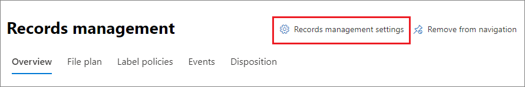

# <a name="disposition-of-content"></a><span data-ttu-id="792a9-103">Disposição de conteúdo</span><span class="sxs-lookup"><span data-stu-id="792a9-103">Disposition of content</span></span>

><span data-ttu-id="792a9-104">*[Diretrizes de licenciamento do Microsoft 365 para segurança e conformidade](/office365/servicedescriptions/microsoft-365-service-descriptions/microsoft-365-tenantlevel-services-licensing-guidance/microsoft-365-security-compliance-licensing-guidance).*</span><span class="sxs-lookup"><span data-stu-id="792a9-104">*[Microsoft 365 licensing guidance for security & compliance](/office365/servicedescriptions/microsoft-365-service-descriptions/microsoft-365-tenantlevel-services-licensing-guidance/microsoft-365-security-compliance-licensing-guidance).*</span></span>

<span data-ttu-id="792a9-105">Use a página **Disposição** do **Gerenciamento de Registros** no Centro de conformidade do Microsoft 365 para gerenciar revisões de disposição e visualizar os metadados dos [registros](records-management.md#records) que foram excluídos automaticamente no final do período de retenção.</span><span class="sxs-lookup"><span data-stu-id="792a9-105">Use the **Disposition** page from **Records Management** in the Microsoft 365 compliance center to manage disposition reviews and view the metadata of [records](records-management.md#records) that have been automatically deleted at the end of their retention period.</span></span>

> [!NOTE]
> <span data-ttu-id="792a9-106">Em visualização: **Revisão da disposição em vários estágios**</span><span class="sxs-lookup"><span data-stu-id="792a9-106">In preview: **multi-stage disposition review**</span></span>
> 
> <span data-ttu-id="792a9-107">Um administrador agora pode adicionar até cinco estágios consecutivos de revisão de disposição em um rótulo de retenção, e os revisores podem adicionar outros usuários ao seu estágio de revisão de disposição.</span><span class="sxs-lookup"><span data-stu-id="792a9-107">An administrator can now add up to five consecutive stages of disposition review in a retention label, and reviewers can add others users to their disposition review stage.</span></span> <span data-ttu-id="792a9-108">Você também pode personalizar as notificações e lembretes por email.</span><span class="sxs-lookup"><span data-stu-id="792a9-108">You can also customize the email notifications and reminders.</span></span> <span data-ttu-id="792a9-109">As seções a seguir contêm mais informações sobre as mudanças nesta visualização.</span><span class="sxs-lookup"><span data-stu-id="792a9-109">The following sections have more information about the changes in this preview.</span></span>
>
> <span data-ttu-id="792a9-110">Para ler o comunicado do lançamento, confira a postagem no blog [Anunciando a Disposição em vários estágios no Gerenciamento de Registros da Microsoft](https://techcommunity.microsoft.com/t5/security-compliance-and-identity/announcing-multi-stage-disposition-in-microsoft-records/ba-p/2361849).</span><span class="sxs-lookup"><span data-stu-id="792a9-110">To read the release announcement, see the blog post [Announcing Multi-Stage Disposition in Microsoft Records Management](https://techcommunity.microsoft.com/t5/security-compliance-and-identity/announcing-multi-stage-disposition-in-microsoft-records/ba-p/2361849).</span></span>

## <a name="prerequisites-for-viewing-content-dispositions"></a><span data-ttu-id="792a9-111">Pré-requisitos para exibir disposições de conteúdo</span><span class="sxs-lookup"><span data-stu-id="792a9-111">Prerequisites for viewing content dispositions</span></span>

<span data-ttu-id="792a9-112">Para gerenciar as revisões de disposição e confirmar que os registros foram excluídos, você deve ter permissões suficientes e a auditoria deve ser habilitada.</span><span class="sxs-lookup"><span data-stu-id="792a9-112">To manage disposition reviews and confirm that records have been deleted, you must have sufficient permissions and auditing must be enabled.</span></span> <span data-ttu-id="792a9-113">Esteja ciente também de quaisquer [limitações](retention-limits.md#maximum-number-of-items-for-disposition) para disposição.</span><span class="sxs-lookup"><span data-stu-id="792a9-113">Also be aware of any [limitations](retention-limits.md#maximum-number-of-items-for-disposition) for disposition.</span></span>

### <a name="permissions-for-disposition"></a><span data-ttu-id="792a9-114">Permissões para disposição</span><span class="sxs-lookup"><span data-stu-id="792a9-114">Permissions for disposition</span></span>

<span data-ttu-id="792a9-115">Para acessar com êxito a guia **Disposição** no Centro de conformidade do Microsoft 365, os usuários devem ter a função **Gerenciamento de Disposição**.</span><span class="sxs-lookup"><span data-stu-id="792a9-115">To successfully access the **Disposition** tab in the Microsoft 365 compliance center, users must have the **Disposition Management** role.</span></span> <span data-ttu-id="792a9-116">A partir de dezembro de 2020, essa função agora está incluída no grupo de funções padrão de **Gerenciamento de Registros**.</span><span class="sxs-lookup"><span data-stu-id="792a9-116">From December 2020, this role is now included in the **Records Management** default role group.</span></span>

> [!NOTE]
> <span data-ttu-id="792a9-117">Por padrão, até mesmo um administrador global precisa ter a função de **Gerenciamento de Disposição**.</span><span class="sxs-lookup"><span data-stu-id="792a9-117">By default, a global admin isn't granted the **Disposition Management** role.</span></span> 

<span data-ttu-id="792a9-118">Para conceder aos usuários apenas as permissões necessárias para revisões de disposição sem conceder permissões para exibir e configurar outros recursos para gerenciamento de retenção e de registros, crie um grupo de função personalizada (por exemplo, chamado "Revisores de Disposição") e conceda a esse grupo a função de **Gerenciamento de Disposição**.</span><span class="sxs-lookup"><span data-stu-id="792a9-118">To grant users just the permissions they need for disposition reviews without granting them permissions to view and configure other features for retention and records management, create a custom role group (for example, named "Disposition Reviewers") and grant this group the **Disposition Management** role.</span></span>

<span data-ttu-id="792a9-119">Para obter instruções, confira [Fornecer aos usuários acesso ao Centro de Segurança e Conformidade do Office 365](../security/office-365-security/grant-access-to-the-security-and-compliance-center.md).</span><span class="sxs-lookup"><span data-stu-id="792a9-119">For instructions to configure these permissions, see [Give users access to the Office 365 Security & Compliance Center](../security/office-365-security/grant-access-to-the-security-and-compliance-center.md).</span></span>

<span data-ttu-id="792a9-120">Além disso:</span><span class="sxs-lookup"><span data-stu-id="792a9-120">Additionally:</span></span>

- <span data-ttu-id="792a9-121">Para visualizar o conteúdo dos itens durante o processo de disposição, adicione usuários ao grupo de funções do **Visualizador de Lista de Explorador de Conteúdos**.</span><span class="sxs-lookup"><span data-stu-id="792a9-121">To view the contents of items during the disposition process, add users to the **Content Explorer Content Viewer** role group.</span></span> <span data-ttu-id="792a9-122">Se os usuários não tiverem as permissões desses grupos de função, ainda poderão selecionar uma ação de revisão de disposição para concluir a revisão de disposição, mas deverão fazê-lo sem a capacidade de exibir o conteúdo do item pelo mini painel de visualização no centro de conformidade.</span><span class="sxs-lookup"><span data-stu-id="792a9-122">If users don't have the permissions from this role group, they can still select a disposition review action to complete the disposition review, but must do so without being able to view the item's contents from the mini-preview pane in the compliance center.</span></span>

- <span data-ttu-id="792a9-123">Na visualização: por padrão, cada pessoa que acessa a página **Disposição** vê apenas os itens que estão designados para revisão.</span><span class="sxs-lookup"><span data-stu-id="792a9-123">In preview: By default, each person that accesses the **Disposition** page sees only items that they are assigned to review.</span></span> <span data-ttu-id="792a9-124">Para que um administrador de gerenciamento de registros veja todos os itens atribuídos a todos os usuários e todos os rótulos de retenção configurados para revisão de disposição: Navegue até **Configurações de gerenciamento de registros** > **Geral** > **Grupo de segurança para gerente de registros** para selecionar e habilitar um grupo de segurança habilitado para email que contém as contas de administrador.</span><span class="sxs-lookup"><span data-stu-id="792a9-124">For a records management administrator to see all items assigned to all users, and all retention labels that are configured for disposition review: Navigate to **Records management settings** > **General** > **Security group for records manager** to select and then enable a mail-enabled security group that contains the administrator accounts.</span></span>
    
    <span data-ttu-id="792a9-125">Os grupos do Microsoft 365 e os grupos de segurança que não são habilitados para email não oferecem suporte a esse recurso e não seriam exibidos na lista para seleção.</span><span class="sxs-lookup"><span data-stu-id="792a9-125">Microsoft 365 groups and security groups that aren't mail-enabled doesn't support this feature and wouldn't be displayed in the list to select.</span></span> <span data-ttu-id="792a9-126">Se você precisar criar um novo grupo de segurança habilitado para email, use o link para o Centro de administração do Microsoft 365 para criar o novo grupo.</span><span class="sxs-lookup"><span data-stu-id="792a9-126">If you need to create a new mail-enabled security group, use the link to the Microsoft 365 admin center to create the new group.</span></span> 
    
    > [!IMPORTANT]
    > <span data-ttu-id="792a9-127">Depois de habilitar o grupo, você não poderá alterá-lo no centro de conformidade.</span><span class="sxs-lookup"><span data-stu-id="792a9-127">After you have enabled the group, you can't change it in the compliance center.</span></span> <span data-ttu-id="792a9-128">Confira a próxima seção para saber como habilitar um grupo diferente usando o Windows PowerShell.</span><span class="sxs-lookup"><span data-stu-id="792a9-128">See the next section for how to enable a different group by using PowerShell.</span></span>

- <span data-ttu-id="792a9-129">Na visualização: a opção **Configurações de gerenciamento de registros** está visível apenas para administradores de gerenciamento de registros.</span><span class="sxs-lookup"><span data-stu-id="792a9-129">In preview: The **Records management settings** option is visible only to record management administrators.</span></span> 

#### <a name="enabling-another-security-group-for-disposition"></a><span data-ttu-id="792a9-130">Habilitar outro grupo de segurança para disposição</span><span class="sxs-lookup"><span data-stu-id="792a9-130">Enabling another security group for disposition</span></span>

<span data-ttu-id="792a9-131">Depois de habilitar um grupo de segurança para disposição das **Configurações de gerenciamento de registros** no Centro de conformidade do Microsoft 365, você não poderá desabilitar essa permissão para o grupo ou substituir o grupo selecionado no centro de conformidade.</span><span class="sxs-lookup"><span data-stu-id="792a9-131">After you have enabled a security group for disposition from the **Records management settings** in the Microsoft 365 compliance center, you can't disable this permission for the group or replace the selected group in the compliance center.</span></span> <span data-ttu-id="792a9-132">No entanto, você pode habilitar outro grupo de segurança habilitado para email usando o cmdlet [Enable-ComplianceTagStorage](/powershell/module/exchange/enable-compliancetagstorage).</span><span class="sxs-lookup"><span data-stu-id="792a9-132">However, you can enable another mail-enabled security group by using the [Enable-ComplianceTagStorage](/powershell/module/exchange/enable-compliancetagstorage) cmdlet.</span></span>

<span data-ttu-id="792a9-133">Por exemplo:</span><span class="sxs-lookup"><span data-stu-id="792a9-133">For example:</span></span> 

```PowerShell
Enable-ComplianceTagStorage -RecordsManagementSecurityGroupEmail dispositionreviewers@contosoi.com
````

### <a name="enable-auditing"></a><span data-ttu-id="792a9-134">Habilitar auditoria</span><span class="sxs-lookup"><span data-stu-id="792a9-134">Enable auditing</span></span>

<span data-ttu-id="792a9-135">Verifique se a auditoria está habilitada pelo menos um dia antes da primeira ação de disposição.</span><span class="sxs-lookup"><span data-stu-id="792a9-135">Make sure that auditing is enabled at least one day before the first disposition action.</span></span> <span data-ttu-id="792a9-136">Para saber mais, confira [Pesquisar o log de auditoria no Centro de Conformidade &amp; e Segurança do Office 365](search-the-audit-log-in-security-and-compliance.md).</span><span class="sxs-lookup"><span data-stu-id="792a9-136">For more information, see [Search the audit log in the Office 365 Security &amp; Compliance Center](search-the-audit-log-in-security-and-compliance.md).</span></span> 

## <a name="disposition-reviews"></a><span data-ttu-id="792a9-137">Revisões de disposição</span><span class="sxs-lookup"><span data-stu-id="792a9-137">Disposition reviews</span></span>

<span data-ttu-id="792a9-p110">Quando o conteúdo atinge o fim do período de retenção, existem vários motivos pelos quais você pode querer revisar o conteúdo e confirmar se ele pode ser excluído com segurança ("descartado"). Por exemplo, em vez de excluir o conteúdo, talvez você precise:</span><span class="sxs-lookup"><span data-stu-id="792a9-p110">When content reaches the end of its retention period, there are several reasons why you might want to review that content and confirm whether it can be permanently deleted ("disposed"). For example, instead of deleting the content, you might need to:</span></span>
  
- <span data-ttu-id="792a9-140">Suspender a exclusão de conteúdo relevante no caso de litígio ou auditoria.</span><span class="sxs-lookup"><span data-stu-id="792a9-140">Suspend the deletion of relevant content for litigation or an audit.</span></span>

- <span data-ttu-id="792a9-141">Atribuir um período de retenção diferente ao conteúdo, talvez porque as configurações originais de retenção fossem uma solução temporária ou provisória.</span><span class="sxs-lookup"><span data-stu-id="792a9-141">Assign a different retention period to the content, perhaps because the original retention settings were a temporary or provisional solution.</span></span>

- <span data-ttu-id="792a9-142">Mova o conteúdo de seu local existente para um local de arquivamento, por exemplo, se esse conteúdo tiver valor de pesquisa ou histórico.</span><span class="sxs-lookup"><span data-stu-id="792a9-142">Move the content from its existing location to an archive location, for example, if that content has research or historical value.</span></span>

<span data-ttu-id="792a9-143">Quando uma revisão de disposição é disparada no final do período de retenção:</span><span class="sxs-lookup"><span data-stu-id="792a9-143">When a disposition review is triggered at the end of the retention period:</span></span>
  
- <span data-ttu-id="792a9-144">As pessoas que você escolher receberão uma notificação por email com o conteúdo a ser revisado.</span><span class="sxs-lookup"><span data-stu-id="792a9-144">The reviewers you choose receive an email notification that they have content to review.</span></span> <span data-ttu-id="792a9-145">Esses revisores podem ser usuários individuais ou grupos de segurança habilitados para email.</span><span class="sxs-lookup"><span data-stu-id="792a9-145">These reviewers can be individual users or mail-enabled security groups.</span></span> <span data-ttu-id="792a9-146">Novo em visualização:</span><span class="sxs-lookup"><span data-stu-id="792a9-146">New in preview:</span></span>
   - <span data-ttu-id="792a9-147">Você pode personalizar o email que eles recebem, incluindo instruções em diferentes idiomas.</span><span class="sxs-lookup"><span data-stu-id="792a9-147">You can customize the email that they receive, including instructions in different languages.</span></span> <span data-ttu-id="792a9-148">Para ter suporte em vários idiomas, você mesmo deve especificar as traduções e esse texto personalizado será exibido a todos os revisores, independentemente de sua localidade.</span><span class="sxs-lookup"><span data-stu-id="792a9-148">For multi-language support, you must specify the translations yourself and this custom text is displayed to all reviewers irrespective of their locale.</span></span>
   - <span data-ttu-id="792a9-149">Os usuários recebem uma notificação inicial por email por etiqueta no final do período de retenção do item, com um lembrete por etiqueta uma vez por semana de todas as revisões de disposição que lhes são atribuídas.</span><span class="sxs-lookup"><span data-stu-id="792a9-149">Users receive an initial email notification per label at the end of the item's retention period, with a reminder per label once a week of all disposition reviews that they are assigned.</span></span> <span data-ttu-id="792a9-150">Eles podem clicar no link nos emails de notificação e lembrete para ir para a página **Disposição** no Centro de conformidade do Microsoft 365 para revisar o conteúdo e executar uma ação.</span><span class="sxs-lookup"><span data-stu-id="792a9-150">They can click the link in the notification and reminder emails to go to the **Disposition** page in the Microsoft 365 compliance center to review the content and take an action.</span></span> <span data-ttu-id="792a9-151">Como alternativa, os revisores podem ir diretamente para a página **Disposição** no centro de conformidade.</span><span class="sxs-lookup"><span data-stu-id="792a9-151">Alternately, the reviewers can go directly to the **Disposition** page in the compliance center.</span></span>
   - <span data-ttu-id="792a9-152">Os revisadores veem apenas as revisões de disposição atribuídas a eles, enquanto os administradores que são adicionados ao grupo de segurança selecionado para o gerente de registros veem todas as revisões de disposição.</span><span class="sxs-lookup"><span data-stu-id="792a9-152">Reviewers see only the disposition reviews that are assigned to them, whereas administrators who are added to the selected security group for records manager see all disposition reviews.</span></span>
   - <span data-ttu-id="792a9-153">Os revisores podem adicionar novos usuários à mesma revisão de disposição.</span><span class="sxs-lookup"><span data-stu-id="792a9-153">Reviewers can add new users to the same disposition review.</span></span> <span data-ttu-id="792a9-154">Atualmente, esta ação não concede as [permissões necessárias](#permissions-for-disposition) automaticamente a esses usuários adicionados.</span><span class="sxs-lookup"><span data-stu-id="792a9-154">Currently, this action doesn't automatically grant these added users the [required permissions](#permissions-for-disposition).</span></span>
   - <span data-ttu-id="792a9-155">Para o processo de revisão da disposição, um mini painel de revisão para cada item mostra uma visualização do conteúdo, se eles tiverem permissão para vê-lo.</span><span class="sxs-lookup"><span data-stu-id="792a9-155">For the disposition review process, a mini-review pane for each item shows a preview of the content if they have permissions to see it.</span></span> <span data-ttu-id="792a9-156">Se não tiverem permissões, eles podem selecionar o link de conteúdo e solicitar permissões.</span><span class="sxs-lookup"><span data-stu-id="792a9-156">If they don't have permissions, they can select the content link and request permissions.</span></span> <span data-ttu-id="792a9-157">Este mini painel de revisão também possui guias para obter informações adicionais sobre o conteúdo:</span><span class="sxs-lookup"><span data-stu-id="792a9-157">This mini-review pane also has tabs for additional information about the content:</span></span>
       - <span data-ttu-id="792a9-158">**Detalhes** para exibir as propriedades indexadas, onde está localizado, quem o criou e quando, e quem o modificou pela última vez e quando.</span><span class="sxs-lookup"><span data-stu-id="792a9-158">**Details** to display indexed properties, where it's located, who created it and when, and who last modified it and when.</span></span>
       - <span data-ttu-id="792a9-159">**Histórico** que mostra o histórico de quaisquer ações de revisão de disposição até o momento, com comentários do revisor, se disponíveis.</span><span class="sxs-lookup"><span data-stu-id="792a9-159">**History** that shows the history of any disposition review actions to date, with reviewer comments if available.</span></span>

<span data-ttu-id="792a9-160">Uma revisão de disposição pode incluir conteúdo nas caixas de correio do Exchange, sites do SharePoint e contas do OneDrive.</span><span class="sxs-lookup"><span data-stu-id="792a9-160">A disposition review can include content in Exchange mailboxes, SharePoint sites, and OneDrive accounts.</span></span> <span data-ttu-id="792a9-161">O conteúdo que aguarda uma revisão de disposição nesses locais é excluído permanentemente apenas após um revisor optar por excluir permanentemente o conteúdo.</span><span class="sxs-lookup"><span data-stu-id="792a9-161">Content pending a disposition review in those locations is permanently deleted only after a reviewer for the final stage of disposition chooses to permanently delete the content.</span></span>

> [!NOTE]
> <span data-ttu-id="792a9-162">Uma caixa de correio deve ter pelo menos 10 MB de dados para suportar revisões de disposição.</span><span class="sxs-lookup"><span data-stu-id="792a9-162">A mailbox must have at least 10 MB data to support disposition reviews.</span></span>

<span data-ttu-id="792a9-163">Os administradores podem obter uma visão geral de todas as disposiçãos pendentes na guia **Visão**. Os revisores veem apenas itens com disposição pendente.</span><span class="sxs-lookup"><span data-stu-id="792a9-163">Administrators can see an overview of all pending dispositions in the **Overview** tab. Reviewers see only their items pending disposition.</span></span> <span data-ttu-id="792a9-164">Por exemplo:</span><span class="sxs-lookup"><span data-stu-id="792a9-164">For example:</span></span>


<span data-ttu-id="792a9-166">Ao selecionar **Exibir todas as disposições pendentes**, você será levado à página **Disposição**.</span><span class="sxs-lookup"><span data-stu-id="792a9-166">When you select the **View all pending dispositions**, you're taken to the **Disposition** page.</span></span> <span data-ttu-id="792a9-167">Por exemplo:</span><span class="sxs-lookup"><span data-stu-id="792a9-167">For example:</span></span>


### <a name="workflow-for-a-disposition-review"></a><span data-ttu-id="792a9-169">Fluxo de trabalho de revisão de disposição</span><span class="sxs-lookup"><span data-stu-id="792a9-169">Workflow for a disposition review</span></span>

<span data-ttu-id="792a9-170">O diagrama a seguir mostra o fluxo de trabalho básico para uma revisão de disposição quando um rótulo de retenção é publicado e aplicado manualmente por um usuário.</span><span class="sxs-lookup"><span data-stu-id="792a9-170">The following diagram shows the basic workflow for a disposition review when a retention label is published and then manually applied by a user.</span></span> <span data-ttu-id="792a9-171">Como alternativa, um rótulo de retenção configurado para uma revisão de disposição poderá ser aplicado automaticamente ao conteúdo.</span><span class="sxs-lookup"><span data-stu-id="792a9-171">Alternatively, a retention label configured for a disposition review can be automatically applied to content.</span></span>
  


### <a name="how-to-configure-a-retention-label-for-disposition-review"></a><span data-ttu-id="792a9-173">Como configurar um rótulo de retenção para revisão de disposição</span><span class="sxs-lookup"><span data-stu-id="792a9-173">How to configure a retention label for disposition review</span></span>

<span data-ttu-id="792a9-174">Disparar uma revisão de disposição ao fim do período de retenção é uma opção de configuração disponível somente com um rótulo de retenção.</span><span class="sxs-lookup"><span data-stu-id="792a9-174">Triggering a disposition review at the end of the retention period is a configuration option that's available only with a retention label.</span></span> <span data-ttu-id="792a9-175">A revisão de disposição não está disponível para uma política de retenção.</span><span class="sxs-lookup"><span data-stu-id="792a9-175">Disposition review is not available for a retention policy.</span></span> <span data-ttu-id="792a9-176">Para obter mais informações sobre essas duas soluções de retenção, consulte [Saber mais sobre as políticas de retenção e os rótulos de retenção](retention.md).</span><span class="sxs-lookup"><span data-stu-id="792a9-176">For more information about these two retention solutions, see [Learn about retention policies and retention labels](retention.md).</span></span>

<span data-ttu-id="792a9-177">Da página **Definir configurações de retenção** para um rótulo de retenção:</span><span class="sxs-lookup"><span data-stu-id="792a9-177">From the **Define retention settings** page for a retention label:</span></span>


 
<span data-ttu-id="792a9-179">Depois de selecionar esta opção para **Acionar uma revisão de disposição**, na próxima página do assistente, você especifica quantos estágios consecutivos de disposição deseja e os revisores de disposição para cada estágio:</span><span class="sxs-lookup"><span data-stu-id="792a9-179">After you select this **Trigger a disposition review** option, on the next page of the wizard, you specify how many consecutive stages of disposition you want and the disposition reviewers for each stage:</span></span>

 

<span data-ttu-id="792a9-181">Selecione **Adicionar um estágio** e nomeie seu estágio para fins de identificação.</span><span class="sxs-lookup"><span data-stu-id="792a9-181">Select **Add a stage**, and name your stage for identification purposes.</span></span> <span data-ttu-id="792a9-182">Em seguida, especifique os revisores para esse estágio.</span><span class="sxs-lookup"><span data-stu-id="792a9-182">Then specify the reviewers for that stage.</span></span>

<span data-ttu-id="792a9-183">Para os revisores, especifique um usuário ou um grupo de segurança habilitado para email.</span><span class="sxs-lookup"><span data-stu-id="792a9-183">For the reviewers, specify a user or a mail-enabled security group.</span></span> <span data-ttu-id="792a9-184">Os grupos do Microsoft 365 ([anteriormente grupos do Office 365](https://techcommunity.microsoft.com/t5/microsoft-365-blog/office-365-groups-will-become-microsoft-365-groups/ba-p/1303601)) atualmente não têm suporte para esta opção.</span><span class="sxs-lookup"><span data-stu-id="792a9-184">Microsoft 365 groups ([formerly Office 365 groups](https://techcommunity.microsoft.com/t5/microsoft-365-blog/office-365-groups-will-become-microsoft-365-groups/ba-p/1303601)) are currently not supported for this option.</span></span>

<span data-ttu-id="792a9-185">Se você precisar de mais de uma pessoa para revisar um item no final de seu período de retenção, selecione **Adicionar um estágio** novamente e repita o processo de configuração para o número de estágios necessários, com no máximo cinco estágios.</span><span class="sxs-lookup"><span data-stu-id="792a9-185">If you need more than one person to review an item at the end of its retention period, select **Add a stage** again and repeat the configuration process for the number of stages that you need, with a maximum of five stages.</span></span> 

<span data-ttu-id="792a9-p123">Em cada estágio individual de disposição, qualquer um dos usuários especificados para esse estágio está autorizado a adotar a próxima ação para o item no final do período de retenção. Esses usuários também podem adicionar outros usuários ao estágio de revisão de disposição.</span><span class="sxs-lookup"><span data-stu-id="792a9-p123">Within each individual stage of disposition, any of the users you specify for that stage are authorized to take the next action for the item at the end of its retention period. These users can also add other users to their disposition review stage.</span></span>

> [!NOTE]
> <span data-ttu-id="792a9-188">Rótulos de retenção existentes que são configurados para revisão de disposição podem ser atualizados para usar revisão de disposição em vários estágios, configurando o rótulo.</span><span class="sxs-lookup"><span data-stu-id="792a9-188">Existing retention labels that are configured for disposition review can be upgraded to use multi-staged disposition review by configuring the label.</span></span> <span data-ttu-id="792a9-189">No assistente de etiqueta, selecione **Adicionar um estágio**, ou edite os revisores existentes ou adicione novos revisores.</span><span class="sxs-lookup"><span data-stu-id="792a9-189">In the label wizard, select **Add a stage**, or edit the existing reviewers or add new reviewers.</span></span>

<span data-ttu-id="792a9-190">Durante a fase de configuração você pode renomear, reordenar ou remover cada estágio especificado selecionando a opção Ações do estágio (**...**):</span><span class="sxs-lookup"><span data-stu-id="792a9-190">During the configuration phase, for each stage specified, you can rename it, reorder it, or remove it by selecting the Stage actions option (**...**):</span></span> 


<span data-ttu-id="792a9-192">No entanto, você não pode reordenar ou remover um estágio depois de criar o rótulo de retenção.</span><span class="sxs-lookup"><span data-stu-id="792a9-192">However, you can't reorder or remove a stage after you have created the retention label.</span></span>

<span data-ttu-id="792a9-193">Depois de especificar os revisores, lembre-se de conceder a eles a permissão de função **Gerenciamento de Disposição**.</span><span class="sxs-lookup"><span data-stu-id="792a9-193">After you have specified your reviewers, remember to grant them the **Disposition Management** role permission.</span></span> <span data-ttu-id="792a9-194">Para obter mais informações, confira a seção [Permissões para disposição](#permissions-for-disposition) nesta página.</span><span class="sxs-lookup"><span data-stu-id="792a9-194">For more information, see the [Permissions for disposition](#permissions-for-disposition) section on this page.</span></span>

### <a name="how-to-customize-email-messages-for-disposition-review"></a><span data-ttu-id="792a9-195">Como personalizar mensagens de email para revisão de disposição</span><span class="sxs-lookup"><span data-stu-id="792a9-195">How to customize email messages for disposition review</span></span>

<span data-ttu-id="792a9-196">Exemplo de notificação padrão por e-mail enviada a um revisor:</span><span class="sxs-lookup"><span data-stu-id="792a9-196">Example default email notification sent to a reviewer:</span></span>


<span data-ttu-id="792a9-198">Também na visualização, é possível personalizar as mensagens de email enviadas aos revisores de disposição para a notificação inicial e os lembretes.</span><span class="sxs-lookup"><span data-stu-id="792a9-198">Also in preview, you can customize the email messages that are sent to disposition reviewers for the initial notification and then reminders.</span></span>

<span data-ttu-id="792a9-199">Em qualquer uma das páginas de Disposição no centro de conformidade, selecione **Configurações de gerenciamento de registros**:</span><span class="sxs-lookup"><span data-stu-id="792a9-199">From any of the Disposition pages in the compliance center, select **Records management settings**:</span></span>  



<span data-ttu-id="792a9-201">Em seguida, selecione a guia **Notificações de disposição** e especifique se deseja usar apenas as mensagens de email padrão ou adicionar seu próprio texto à mensagem padrão.</span><span class="sxs-lookup"><span data-stu-id="792a9-201">Then select the **Disposition notifications** tab, and specify whether you want to use just the default email message, or add your own text to the default message.</span></span> <span data-ttu-id="792a9-202">Seu texto personalizado é adicionado às instruções do email após as informações sobre o rótulo de retenção e antes das instruções das próximas etapas.</span><span class="sxs-lookup"><span data-stu-id="792a9-202">Your custom text is added to the email instructions after the information about the retention label and before the next steps instructions.</span></span>

<span data-ttu-id="792a9-203">É possível adicionar texto em todos os idiomas, mas não há suporte para formatação e imagens no momento.</span><span class="sxs-lookup"><span data-stu-id="792a9-203">Text for all languages can be added, but formatting and images are currently unsupported.</span></span> <span data-ttu-id="792a9-204">URLs e endereços de email podem ser inseridos como texto e, dependendo do cliente de email, exibidos como hiperlinks ou texto não formatado no email personalizado.</span><span class="sxs-lookup"><span data-stu-id="792a9-204">URLs and email addresses can be entered as text and depending on the email client, display as hyperlinks or unformatted text in the customized email.</span></span>

<span data-ttu-id="792a9-205">Texto de exemplo a ser adicionado:</span><span class="sxs-lookup"><span data-stu-id="792a9-205">Example text to add:</span></span>

```console
If you need additional information, visit the helpdesk website (https://support.contoso.com) or send them an email (helpdesk@contoso.com).
```

<span data-ttu-id="792a9-206">Selecione **Salvar** para salvar as alterações.</span><span class="sxs-lookup"><span data-stu-id="792a9-206">Select **Save** to save any changes.</span></span>

### <a name="viewing-and-disposing-of-content"></a><span data-ttu-id="792a9-207">Exibir e descartar o conteúdo</span><span class="sxs-lookup"><span data-stu-id="792a9-207">Viewing and disposing of content</span></span>

<span data-ttu-id="792a9-208">Quando um revisador é notificado por email de que o conteúdo está pronto para revisão, ele pode clicar em um link no email que o leva diretamente para a página **Disposição** do **Gerenciamento de Registros** no Centro de Conformidade do Microsoft 365.</span><span class="sxs-lookup"><span data-stu-id="792a9-208">When a reviewer is notified by email that content is ready to review, they can click a link in the email that takes them directly to the **Disposition** page from **Records management** in the Microsoft 365 compliance center.</span></span> <span data-ttu-id="792a9-209">Lá, os revisadores podem ver quantos itens para cada rótulo de retenção estão aguardando disposição com o **Tipo** exibindo **Disposição pendente**.</span><span class="sxs-lookup"><span data-stu-id="792a9-209">There, the reviewers can see how many items for each retention label are waiting disposition with the **Type** displaying **Pending disposition**.</span></span> <span data-ttu-id="792a9-210">Em seguida, eles devem selecionar um rótulo de retenção e **Abrir em uma nova janela** para ver todo o conteúdo com esse rótulo:</span><span class="sxs-lookup"><span data-stu-id="792a9-210">They then select a retention label, and **Open in new window** to see all content with that label:</span></span>


<span data-ttu-id="792a9-212">Na página **Disposições pendentes**, é possível ver todas as disposições pendentes para esse rótulo.</span><span class="sxs-lookup"><span data-stu-id="792a9-212">From the **Pending dispositions** page, they see all pending dispositions for that label.</span></span> <span data-ttu-id="792a9-213">Quando um ou mais itens são selecionados, os usuários podem usar o mini painel de visualização e as guias **Fonte**, **Detalhes** e **Histórico** para inspecionar o conteúdo antes de executar uma ação:</span><span class="sxs-lookup"><span data-stu-id="792a9-213">When one or more items are selected, they can use the mini-preview pane and the **Source**, **Details**, and **History** tab to inspect the content before taking action on it:</span></span>


<span data-ttu-id="792a9-215">Se você usar a barra de rolagem horizontal ou fechar o mini painel de revisão, verá mais colunas que incluem a data de expiração e o nome do estágio de revisão de disposição.</span><span class="sxs-lookup"><span data-stu-id="792a9-215">If you use the horizontal scroll bar, or close the min-review pane, you see more columns that include the expiry date and the name of the disposition review stage.</span></span>

<span data-ttu-id="792a9-216">Como você pode ver na imagem, as ações com suporte são:</span><span class="sxs-lookup"><span data-stu-id="792a9-216">As you can see from the example shown, the actions supported are:</span></span> 
  
- <span data-ttu-id="792a9-217">**Aprovar descarte**:</span><span class="sxs-lookup"><span data-stu-id="792a9-217">**Approve disposal**:</span></span>
    - <span data-ttu-id="792a9-218">Quando esta ação é selecionada para um estágio provisório de revisão de disposição (você configurou vários estágios): O item passa para o próximo estágio de disposição.</span><span class="sxs-lookup"><span data-stu-id="792a9-218">When this action is selected for an interim stage of disposition review (you have configured multiple stages): The item moves to the next disposition stage.</span></span>
    - <span data-ttu-id="792a9-219">Quando esta ação é selecionada para o estágio final de revisão de disposição, ou há apenas um estágio de disposição: O item é marcado como elegível para exclusão permanente.</span><span class="sxs-lookup"><span data-stu-id="792a9-219">When this action is selected for the final stage of disposition review, or there is only one stage of disposition: The item is marked as eligible for permanent deletion.</span></span> <span data-ttu-id="792a9-220">O tempo exato para essa exclusão depende da carga de trabalho.</span><span class="sxs-lookup"><span data-stu-id="792a9-220">The exact timing for that deletion depends on the workload.</span></span> <span data-ttu-id="792a9-221">Para obter mais informações, confira [Como as configurações de retenção funcionam com o conteúdo no local](retention.md#how-retention-settings-work-with-content-in-place).</span><span class="sxs-lookup"><span data-stu-id="792a9-221">For more information, see [How retention settings work with content in place](retention.md#how-retention-settings-work-with-content-in-place).</span></span>
- <span data-ttu-id="792a9-222">**Rotular novamente**:</span><span class="sxs-lookup"><span data-stu-id="792a9-222">**Relabel**:</span></span>
    - <span data-ttu-id="792a9-223">Quando esta ação é selecionada, o item sai do processo de revisão de disposição do rótulo original.</span><span class="sxs-lookup"><span data-stu-id="792a9-223">When this action is selected, the item exits the disposition review process for the original label.</span></span> <span data-ttu-id="792a9-224">O item está então sujeito às configurações de retenção do rótulo de retenção recém-selecionado.</span><span class="sxs-lookup"><span data-stu-id="792a9-224">The item is then subject to the retention settings of the newly selected retention label.</span></span>
- <span data-ttu-id="792a9-225">**Estender**:</span><span class="sxs-lookup"><span data-stu-id="792a9-225">**Extend**:</span></span>
    - <span data-ttu-id="792a9-226">Quando esta ação é selecionada, a revisão da disposição é efetivamente suspensa até o final do período estendido e, em seguida, a revisão da disposição é acionada novamente a partir do primeiro estágio.</span><span class="sxs-lookup"><span data-stu-id="792a9-226">When this action is selected, disposition review is effectively suspended until the end of the extended period and then disposition review is triggered again from the first stage.</span></span>
- <span data-ttu-id="792a9-227">**Adicionar revisores**:</span><span class="sxs-lookup"><span data-stu-id="792a9-227">**Add reviewers**:</span></span>
    - <span data-ttu-id="792a9-228">Quando esta ação é selecionada, o usuário é solicitado a especificar e adicionar outros usuários para revisão.</span><span class="sxs-lookup"><span data-stu-id="792a9-228">When this action is selected, the user is prompted to specify and add other users for review.</span></span>
    
    > [!NOTE]
    > <span data-ttu-id="792a9-229">Esta ação não concede as [permissões necessárias](#permissions-for-disposition) automaticamente aos usuários adicionados.</span><span class="sxs-lookup"><span data-stu-id="792a9-229">This action doesn't automatically grant the [required permissions](#permissions-for-disposition) to the users who are added.</span></span> <span data-ttu-id="792a9-230">Se eles não tiverem essas permissões, não poderão participar da revisão da disposição.</span><span class="sxs-lookup"><span data-stu-id="792a9-230">If they don't have these permissions, they won't be able to participate in the disposition review.</span></span>

<span data-ttu-id="792a9-231">Cada ação realizada é salva e armazenada, embora você ainda não possa pesquisá-las no registro de auditoria.</span><span class="sxs-lookup"><span data-stu-id="792a9-231">Each action taken is saved and stored although you can't yet search for them in the audit log.</span></span>

<span data-ttu-id="792a9-232">Durante uma revisão de disposição, o conteúdo nunca se move do seu local original e não está marcado para exclusão permanente até que esta ação seja selecionada por um revisor para o estágio final ou apenas de disposição.</span><span class="sxs-lookup"><span data-stu-id="792a9-232">During a disposition review, the content never moves from its original location, and it's not marked for permanent deletion until this action is selected by a reviewer for the final or only disposition stage.</span></span>

## <a name="disposition-of-records"></a><span data-ttu-id="792a9-233">Disposição de registros</span><span class="sxs-lookup"><span data-stu-id="792a9-233">Disposition of records</span></span>

<span data-ttu-id="792a9-234">Use a guia **Disposição** da página **Gerenciamento de Registros** para identificar:</span><span class="sxs-lookup"><span data-stu-id="792a9-234">Use the **Disposition** tab from the **Records management** page to identify:</span></span>

- <span data-ttu-id="792a9-235">Itens excluídos como resultado de uma revisão de disposição.</span><span class="sxs-lookup"><span data-stu-id="792a9-235">Items deleted as a result of a disposition review.</span></span>
- <span data-ttu-id="792a9-236">Itens marcados como registro A ou registro regulamentar que foram excluídos automaticamente no final do período de retenção.</span><span class="sxs-lookup"><span data-stu-id="792a9-236">Items marked as a record or regulatory record that were automatically deleted at the end of their retention period.</span></span>

<span data-ttu-id="792a9-237">Esses itens exibem **Registros Descartados** na coluna **Tipo**.</span><span class="sxs-lookup"><span data-stu-id="792a9-237">These items display **Records Disposed** in the **Type** column.</span></span> <span data-ttu-id="792a9-238">Por exemplo:</span><span class="sxs-lookup"><span data-stu-id="792a9-238">For example:</span></span>


> [!NOTE]
> <span data-ttu-id="792a9-240">Esta funcionalidade usa informações do [log de auditoria unificado](search-the-audit-log-in-security-and-compliance.md) e, portanto, requer que a auditoria seja [habilitada e pesquisável](turn-audit-log-search-on-or-off.md) para que os eventos correspondentes sejam capturados.</span><span class="sxs-lookup"><span data-stu-id="792a9-240">This functionality uses information from the [unified audit log](search-the-audit-log-in-security-and-compliance.md) and therefore requires auditing to be [enabled and searchable](turn-audit-log-search-on-or-off.md) so the corresponding events are captured.</span></span>

<span data-ttu-id="792a9-241">Para auditoria de itens excluídos que foram marcados como registros ou registros regulamentares, pesquise **Arquivo excluído marcado como registro** na categoria **Arquivo e atividades de página**.</span><span class="sxs-lookup"><span data-stu-id="792a9-241">For auditing of deleted items that were marked as records or regulatory records, search for **Deleted file marked as a record** in the **File and page activities** category.</span></span> <span data-ttu-id="792a9-242">Esse evento de auditoria é aplicável a documentos e emails.</span><span class="sxs-lookup"><span data-stu-id="792a9-242">This audit event is applicable to documents and emails.</span></span>

## <a name="filter-and-export-the-views"></a><span data-ttu-id="792a9-243">Filtrar e exportar os modos de exibição</span><span class="sxs-lookup"><span data-stu-id="792a9-243">Filter and export the views</span></span>

<span data-ttu-id="792a9-244">Quando você seleciona um rótulo de retenção na página **Disposição**, a guia **Disposição pendente** (se aplicável) e a guia **Itens descartados** permitem filtrar os modos de exibição para facilitar a localização de itens.</span><span class="sxs-lookup"><span data-stu-id="792a9-244">When you select a retention label from the **Disposition** page, the **Pending disposition** tab (if applicable) and the **Disposed items** tab let you filter the views to help you more easily find items.</span></span>

<span data-ttu-id="792a9-245">Para as disposições pendentes, o intervalo de tempo se baseia na data de vencimento.</span><span class="sxs-lookup"><span data-stu-id="792a9-245">For pending dispositions, the time range is based on the expiration date.</span></span> <span data-ttu-id="792a9-246">Para itens descartados, o intervalo de tempo se baseia na data de exclusão.</span><span class="sxs-lookup"><span data-stu-id="792a9-246">For disposed items, the time range is based on the deletion date.</span></span>
  
<span data-ttu-id="792a9-247">Você pode exportar informações sobre os itens no modo de exibição como um arquivo .csv, que pode ser classificado e gerenciado usando o Excel.</span><span class="sxs-lookup"><span data-stu-id="792a9-247">You can export information about the items in either view as a .csv file that you can then sort and manage using Excel.</span></span>
