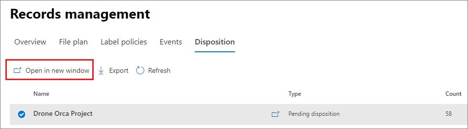

# <a name="disposition-of-content"></a>Disposição de conteúdo

>*[Diretrizes de licenciamento do Microsoft 365 para segurança e conformidade](/office365/servicedescriptions/microsoft-365-service-descriptions/microsoft-365-tenantlevel-services-licensing-guidance/microsoft-365-security-compliance-licensing-guidance).*

Use a página **Disposição** do **Gerenciamento de Registros** no Centro de conformidade do Microsoft 365 para gerenciar revisões de disposição e visualizar os metadados dos [registros](records-management.md#records) que foram excluídos automaticamente no final do período de retenção.

> [!NOTE]
> Implementação na visualização: **revisão de disposição em vários estágios**
> 
> Um administrador agora pode adicionar até cinco estágios consecutivos de revisão de disposição em um rótulo de retenção, e os revisores podem adicionar outros usuários ao seu estágio de revisão de disposição. Você também pode personalizar as notificações e lembretes por email. As seções a seguir contêm mais informações sobre as mudanças nesta visualização.

## <a name="prerequisites-for-viewing-content-dispositions"></a>Pré-requisitos para exibir disposições de conteúdo

Para gerenciar as revisões de disposição e confirmar que os registros foram excluídos, você deve ter permissões suficientes e a auditoria deve ser habilitada.

### <a name="permissions-for-disposition"></a>Permissões para disposição

Para acessar com êxito a guia **Disposição** no Centro de conformidade do Microsoft 365, os usuários devem ter a função **Gerenciamento de Disposição**. A partir de dezembro de 2020, essa função agora está incluída no grupo de funções padrão de **Gerenciamento de Registros**.

> [!NOTE]
> Por padrão, até mesmo um administrador global precisa ter a função de **Gerenciamento de Disposição**. 

Para conceder aos usuários apenas as permissões necessárias para revisões de disposição sem conceder permissões para exibir e configurar outros recursos para gerenciamento de retenção e de registros, crie um grupo de função personalizada (por exemplo, chamado "Revisores de Disposição") e conceda a esse grupo a função de **Gerenciamento de Disposição**.

Para obter instruções, confira [Fornecer aos usuários acesso ao Centro de Segurança e Conformidade do Office 365](../security/office-365-security/grant-access-to-the-security-and-compliance-center.md).

Além disso:

- Para visualizar o conteúdo dos itens durante o processo de disposição, adicione usuários ao grupo de funções do **Visualizador de Lista de Explorador de Conteúdos**. Se os usuários não tiverem as permissões desses grupos de função, ainda poderão selecionar uma ação de revisão de disposição para concluir a revisão de disposição, mas deverão fazê-lo sem a capacidade de exibir o conteúdo do item pelo mini painel de visualização no centro de conformidade.

- Na visualização: por padrão, cada pessoa que acessa a página **Disposição** vê apenas os itens que estão designados para revisão. Para que um administrador de gerenciamento de registros veja todos os itens atribuídos a todos os usuários e todos os rótulos de retenção configurados para revisão de disposição: Navegue até as **configurações de gerenciamento de registros** > **Geral** > **Grupo de segurança do Gerenciador de Registros** para selecionar e habilitar um grupo de segurança habilitado para email que contém as contas de administrador.
    
    Os grupos do Microsoft 365 e os grupos de segurança que não são habilitados para email não oferecem suporte a esse recurso e não seriam exibidos na lista para seleção. Se você precisar criar um novo grupo de segurança habilitado para email, use o link para o Centro de administração do Microsoft 365 para criar o novo grupo. 
    
    > [!IMPORTANT]
    > Você não pode desativar essa permissão ou substituir o grupo habilitado pelo centro de conformidade. No entanto, você pode habilitar outro grupo de segurança habilitado para email usando o cmdlet [Enable-ComplianceTagStorage](/powershell/module/exchange/enable-compliancetagstorage).
    > 
    > Por exemplo: `Enable-ComplianceTagStorage -RecordsManagementSecurityGroupEmail dispositionreviewers@contosoi.com`

- Na visualização: a opção **Configurações de gerenciamento de registros** está visível apenas para administradores de gerenciamento de registros. 

### <a name="enable-auditing"></a>Habilitar auditoria

Verifique se a auditoria está habilitada pelo menos um dia antes da primeira ação de disposição. Para saber mais, confira [Pesquisar o log de auditoria no Centro de Conformidade &amp; e Segurança do Office 365](search-the-audit-log-in-security-and-compliance.md). 

## <a name="disposition-reviews"></a>Revisões de disposição

Quando o conteúdo atinge o fim do período de retenção, existem vários motivos pelos quais você pode querer revisar o conteúdo e confirmar se ele pode ser excluído com segurança ("descartado"). Por exemplo, em vez de excluir o conteúdo, talvez você precise:
  
- Suspender a exclusão de conteúdo relevante no caso de litígio ou auditoria.

- Atribuir um período de retenção diferente ao conteúdo, talvez porque as configurações originais de retenção fossem uma solução temporária ou provisória.

- Mova o conteúdo de seu local existente para um local de arquivamento, por exemplo, se esse conteúdo tiver valor de pesquisa ou histórico.

Quando uma revisão de disposição é disparada no final do período de retenção:
  
- As pessoas que você escolher receberão uma notificação por email com o conteúdo a ser revisado. Esses revisores podem ser usuários individuais ou grupos de segurança habilitados para email. Novo em visualização:
   - Você pode personalizar o email que eles recebem, incluindo instruções em diferentes idiomas. Para ter suporte em vários idiomas, você mesmo deve especificar as traduções e esse texto personalizado será exibido a todos os revisores, independentemente de sua localidade.
   - Os usuários recebem uma notificação inicial por email por etiqueta no final do período de retenção do item, com um lembrete por etiqueta uma vez por semana de todas as revisões de disposição que lhes são atribuídas. Eles podem clicar no link nos emails de notificação e lembrete para ir para a página **Disposição** no Centro de conformidade do Microsoft 365 para revisar o conteúdo e executar uma ação. Como alternativa, os revisores podem ir diretamente para a página **Disposição** no centro de conformidade.
   - Os revisores veem apenas as revisões de disposição atribuídas a eles, enquanto os administradores adicionados ao Grupo de Segurança do Gerenciador de Registros selecionado veem todas as revisões de disposição.
   - Os revisores podem adicionar novos usuários à mesma revisão de disposição. Atualmente, esta ação não concede as [permissões necessárias](#permissions-for-disposition) automaticamente a esses usuários adicionados.
   - Para o processo de revisão da disposição, um mini painel de revisão para cada item mostra uma visualização do conteúdo, se eles tiverem permissão para vê-lo. Se não tiverem permissões, eles podem selecionar o link de conteúdo e solicitar permissões. Este mini painel de revisão também possui guias para obter informações adicionais sobre o conteúdo:
       - **Detalhes** para exibir as propriedades indexadas, onde está localizado, quem o criou e quando, e quem o modificou pela última vez e quando.
       - **Histórico** que mostra o histórico de quaisquer ações de revisão de disposição até o momento, com comentários do revisor, se disponíveis.

Uma revisão de disposição pode incluir conteúdo nas caixas de correio do Exchange, sites do SharePoint e contas do OneDrive. O conteúdo que aguarda uma revisão de disposição nesses locais é excluído permanentemente apenas após um revisor optar por excluir permanentemente o conteúdo.

> [!NOTE]
> Uma caixa de correio deve ter pelo menos 10 MB de dados para suportar revisões de disposição.

Os administradores podem obter uma visão geral de todas as disposiçãos pendentes na guia **Visão**. Os revisores veem apenas itens com disposição pendente. Por exemplo:


Ao selecionar **Exibir todas as disposições pendentes**, você será levado à página **Disposição**. Por exemplo:


### <a name="workflow-for-a-disposition-review"></a>Fluxo de trabalho de revisão de disposição

O diagrama a seguir mostra o fluxo de trabalho básico para uma revisão de disposição quando um rótulo de retenção é publicado e aplicado manualmente por um usuário. Como alternativa, um rótulo de retenção configurado para uma revisão de disposição poderá ser aplicado automaticamente ao conteúdo.
  


### <a name="how-to-configure-a-retention-label-for-disposition-review"></a>Como configurar um rótulo de retenção para revisão de disposição

Disparar uma revisão de disposição ao fim do período de retenção é uma opção de configuração disponível somente com um rótulo de retenção. A revisão de disposição não está disponível para uma política de retenção. Para obter mais informações sobre essas duas soluções de retenção, consulte [Saber mais sobre as políticas de retenção e os rótulos de retenção](retention.md).

Da página **Definir configurações de retenção** para um rótulo de retenção:


 
Depois de selecionar esta opção para **Acionar uma revisão de disposição**, na próxima página do assistente, você especifica quantos estágios consecutivos de disposição deseja e os revisores de disposição para cada estágio:

 

Selecione **Adicionar um estágio** e nomeie seu estágio para fins de identificação. Em seguida, especifique os revisores para esse estágio.

Para os revisores, especifique um usuário ou um grupo de segurança habilitado para email. Os grupos do Microsoft 365 ([anteriormente grupos do Office 365](https://techcommunity.microsoft.com/t5/microsoft-365-blog/office-365-groups-will-become-microsoft-365-groups/ba-p/1303601)) atualmente não têm suporte para esta opção.

Se você precisar de mais de uma pessoa para revisar um item no final de seu período de retenção, selecione **Adicionar um estágio** novamente e repita o processo de configuração para o número de estágios necessários, com no máximo cinco estágios. 

Em cada estágio individual de disposição, qualquer um dos usuários que você especificar para esse estágio está autorizado a executar a próxima ação para o item no final de seu período de retenção. Esses usuários também podem adicionar outros usuários aos estágio de revisão de disposição deles.

> [!NOTE]
> Rótulos de retenção existentes que são configurados para revisão de disposição podem ser atualizados para usar revisão de disposição em vários estágios, configurando o rótulo. No assistente de etiqueta, selecione **Adicionar um estágio**, ou edite os revisores existentes ou adicione novos revisores.

Durante a fase de configuração você pode renomear, reordenar ou remover cada estágio especificado selecionando a opção Ações do estágio (**...**): 


No entanto, você não pode reordenar ou remover um estágio depois de criar o rótulo de retenção.

Depois de especificar os revisores, lembre-se de conceder a eles a permissão de função **Gerenciamento de Disposição**. Para obter mais informações, confira a seção [Permissões para disposição](#permissions-for-disposition) nesta página.

### <a name="how-to-customize-email-messages-for-disposition-review"></a>Como personalizar mensagens de email para revisão de disposição

Também na visualização, é possível personalizar as mensagens de email enviadas aos revisores de disposição para a notificação inicial e os lembretes.

Em qualquer uma das páginas de Disposição no centro de conformidade, selecione **Configurações de gerenciamento de registros**:  


Em seguida, selecione a guia **Modelos de email** e especifique se deseja usar apenas os modelos de email padrão ou adicionar seu próprio texto ao modelo padrão. Seu texto personalizado é adicionado às instruções do email após as informações sobre o rótulo de retenção e antes das instruções das próximas etapas.

É possível adicionar texto em todos os idiomas, mas não há suporte para formatação e imagens no momento. URLs e endereços de email podem ser inseridos como texto e, dependendo do cliente de email, exibidos como hiperlinks ou texto não formatado no email personalizado.

Texto de exemplo a ser anexado:

```console
If you need additional information, visit the helpdesk website (https://support.contoso.com) or send them an email (helpdesk@contoso.com).
```

Selecione **Salvar** para salvar as alterações.

### <a name="viewing-and-disposing-of-content"></a>Exibir e descartar o conteúdo

Quando um revisor é notificado por email informando que o conteúdo está pronto para ser revisado, ele vai para a guia **Disposição** em **Gerenciamento de Registros** no Centro de conformidade do Microsoft 365. Os revisores podem ver quantos itens estão aguardando disposição para cada etiqueta de retenção com o **Tipo** exibindo **Disposição pendente**. Em seguida, eles devem selecionar um rótulo de retenção e **Abrir em uma nova janela** para ver todo o conteúdo com esse rótulo:



Na página **Disposições pendentes**, é possível ver todas as disposições pendentes para esse rótulo. Quando um ou mais itens são selecionados, os usuários podem usar o mini painel de visualização e as guias **Fonte**, **Detalhes** e **Histórico** para inspecionar o conteúdo antes de executar uma ação:


Se você usar a barra de rolagem horizontal ou fechar o mini painel de revisão, verá mais colunas que incluem a data de expiração e o nome do estágio de revisão de disposição.

Como você pode ver na imagem, as ações com suporte são: 
  
- **Aprovar descarte**:
    - Quando esta ação é selecionada para um estágio provisório de revisão de disposição (você configurou vários estágios): O item passa para o próximo estágio de disposição.
    - Quando esta ação é selecionada para o estágio final de revisão de disposição, ou há apenas um estágio de disposição: O item é marcado como elegível para exclusão permanente. O tempo exato para essa exclusão depende da carga de trabalho. Para obter mais informações, confira [Como as configurações de retenção funcionam com o conteúdo no local](retention.md#how-retention-settings-work-with-content-in-place).
- **Rotular novamente**:
    - Quando esta ação é selecionada, o item sai do processo de revisão de disposição do rótulo original. O item está então sujeito às configurações de retenção do rótulo de retenção recém-selecionado.
- **Estender**:
    - Quando esta ação é selecionada, a revisão da disposição é efetivamente suspensa até o final do período estendido e, em seguida, a revisão da disposição é acionada novamente a partir do primeiro estágio.
- **Adicionar revisores**:
    - Quando esta ação é selecionada, o usuário é solicitado a especificar e adicionar outros usuários para revisão.
    
    > [!NOTE]
    > Esta ação não concede as [permissões necessárias](#permissions-for-disposition) automaticamente aos usuários adicionados. Se eles não tiverem essas permissões, não poderão participar da revisão da disposição.

Cada ação realizada é salva e armazenada, embora você ainda não possa pesquisá-las no registro de auditoria.

Durante uma revisão de disposição, o conteúdo nunca se move do seu local original e não está marcado para exclusão permanente até que esta ação seja selecionada por um revisor para o estágio final ou apenas de disposição.

## <a name="disposition-of-records"></a>Disposição de registros

Use a guia **Disposição** da página **Gerenciamento de Registros** para identificar:

- Itens excluídos como resultado de uma revisão de disposição.
- Itens marcados como registro A ou registro regulamentar que foram excluídos automaticamente no final do período de retenção.

Esses itens exibem **Registros Descartados** na coluna **Tipo**. Por exemplo:


Itens mostrados na guia **Itens Dispostos** são mantidos por até sete anos após o item ser descartado, com um limite de um milhão de itens por registro para aquele período. Se você vir que o número de **Contagem** se aproxima desse limite de 1 milhão e precisar de prova de disposição para seus registros, contate o [Suporte da Microsoft](../business-video/get-help-support.md).

> [!NOTE]
> Esta funcionalidade usa informações do [log de auditoria unificado](search-the-audit-log-in-security-and-compliance.md) e, portanto, requer que a auditoria seja [habilitada e pesquisável](turn-audit-log-search-on-or-off.md) para que os eventos correspondentes sejam capturados.

Para auditoria de itens excluídos que foram marcados como registros ou registros regulamentares, pesquise **Arquivo excluído marcado como registro** na categoria **Arquivo e atividades de página**. Esse evento de auditoria é aplicável a documentos e emails.

## <a name="filter-and-export-the-views"></a>Filtrar e exportar os modos de exibição

Quando você seleciona um rótulo de retenção na página **Disposição**, a guia **Disposição pendente** (se aplicável) e a guia **Itens descartados** permitem filtrar os modos de exibição para facilitar a localização de itens.

Para as disposições pendentes, o intervalo de tempo se baseia na data de vencimento. Para itens descartados, o intervalo de tempo se baseia na data de exclusão.
  
Você pode exportar informações sobre os itens no modo de exibição como um arquivo .csv, que pode ser classificado e gerenciado usando o Excel.
