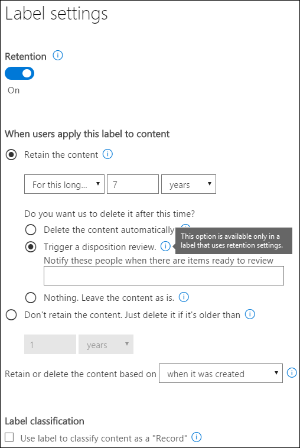

# Disposição do conteúdoDisposition of content

>*[Diretrizes de licenciamento do Microsoft 365 para segurança e conformidade](https://aka.ms/ComplianceSD).**[Microsoft 365 licensing guidance for security & compliance](https://aka.ms/ComplianceSD).*

Use a guia **disposição** do **Gerenciamento de registros** no centro de conformidade da Microsoft 365 para gerenciar revisões de disposição e exibir [registros](records.md) que foram excluídos automaticamente no final do período de retenção.Use the **Disposition** tab from **Records Management** in the Microsoft 365 compliance center to manage disposition reviews and view [records](records.md) that have been automatically deleted at the end of their retention period. 

## Pré-requisitos para exibir desposições de conteúdoPrerequisites for viewing content dispositions

Para gerenciar revisões de disposição e confirmar que os registros foram excluídos, você deve ter permissões suficientes e a auditoria deve estar habilitada.To manage disposition reviews and confirm that records have been deleted, you must have sufficient permissions and auditing must be enabled.

### Permissões para descartePermissions for disposition

Para acessar com êxito a guia de **descarte** no centro de conformidade do Microsoft 365, os usuários devem ter a função de **Gerenciamento de descarte** e a função de **logs de auditoria somente para exibição** .To successfully access the **Disposition** tab in the Microsoft 365 compliance center, users must have the **Disposition Management** role and the **View-Only Audit Logs** role. Embora o Conselho padrão seja adicionar usuários aos grupos de função padrão, neste caso, recomendamos que você crie um novo grupo de função chamado **revisores de disposição** que tenha essas duas funções e adicione usuários a esse grupo, conforme necessário.Although the standard advice is to add users to the default role groups, in this case, we recommend you create a new role group called **Disposition Reviewers** that has these two roles and add users to this group as needed. Um único grupo de função para descarte reduz a sobrecarga da administração e torna mais fácil para os usuários ter as permissões combinadas de que precisam.A single role group for disposition reduces administration overheads and makes it easier for users have the combined permissions that they need.

> [!NOTE]
> Até mesmo um administrador global precisa receber a função de **Gerenciamento de descarte** .Even a global admin needs to be granted the **Disposition Management** role. Portanto, se os administradores globais precisarem acessar a guia disposição, eles como membros do grupo de funções **revisores de descarte** .So if global admins need to access the disposition tab, them as members of the **Disposition Reviewers** role group. 

Específico para a função de **logs de auditoria somente para exibição** :Specific to the **View-Only Audit Logs** role:

- Como o cmdlet subjacente usado para pesquisar o log de auditoria é um cmdlet do Exchange Online, você deve atribuir essa função aos usuários usando o [centro de administração do Exchange no Exchange Online](https://docs.microsoft.com/Exchange/exchange-admin-center), em vez de usar a página de **permissões** no centro de conformidade de segurança &.Because the underlying cmdlet used to search the audit log is an Exchange Online cmdlet, you must assign users this role by using the [Exchange admin center in Exchange Online](https://docs.microsoft.com/Exchange/exchange-admin-center), rather than by using the **Permissions** page in the Security & Compliance Center. Para obter instruções, consulte [Manage role groups in Exchange Online](https://docs.microsoft.com/Exchange/permissions-exo/role-groups).For instructions, see [Manage role groups in Exchange Online](https://docs.microsoft.com/Exchange/permissions-exo/role-groups).

- Os grupos do Microsoft 365 ([anteriormente Office 365 grupos](https://techcommunity.microsoft.com/t5/microsoft-365-blog/office-365-groups-will-become-microsoft-365-groups/ba-p/1303601)) não têm suporte para essa função.Microsoft 365 groups ([formerly Office 365 groups](https://techcommunity.microsoft.com/t5/microsoft-365-blog/office-365-groups-will-become-microsoft-365-groups/ba-p/1303601)) aren't supported for this role. Em vez disso, atribua caixas de correio de usuário, usuários de email ou grupos de segurança habilitados para email.Instead, assign user mailboxes, mail users, or mail-enabled security groups.

Para obter instruções para conceder aos usuários a função de **Gerenciamento de descarte** e criar sua nova função de **revisores de disposição** , consulte [dar aos usuários acesso ao &amp; centro de conformidade de segurança do Office 365](../security/office-365-security/grant-access-to-the-security-and-compliance-center.md).For instructions to grant users the **Disposition Management** role and create your new **Disposition Reviewers** role, see [Give users access to the Office 365 Security &amp; Compliance Center](../security/office-365-security/grant-access-to-the-security-and-compliance-center.md).

### Habilitar a auditoriaEnable auditing

Certifique-se de que a auditoria esteja habilitada pelo menos um dia antes da primeira ação de disposição.Make sure that auditing is enabled at least one day before the first disposition action. Para obter mais informações, consulte [Pesquisar o log de auditoria no centro de &amp; conformidade de segurança do Office 365](search-the-audit-log-in-security-and-compliance.md).For more information, see [Search the audit log in the Office 365 Security &amp; Compliance Center](search-the-audit-log-in-security-and-compliance.md). 

## Revisões de disposiçãoDisposition reviews

Quando o conteúdo atinge o final do período de retenção, há vários motivos para que você possa querer revisar o conteúdo para decidir se ele pode ser excluído com segurança ("descartado").When content reaches the end of its retention period, there are several reasons why you might want to review that content to decide whether it can be safely deleted ("disposed"). Por exemplo, você pode precisar:For example, you might need to:
  
- Suspender a exclusão de conteúdo relevante no caso de litígio ou auditoria.Suspend the deletion of relevant content in the event of litigation or an audit.
    
- Remova o conteúdo da lista de descarte para armazenar em um arquivo morto, se esse conteúdo tiver um valor de pesquisa ou histórico.Remove content from the disposition list to store in an archive, if that content has research or historical value.
    
- Atribua um período de retenção diferente ao conteúdo, talvez porque as configurações de retenção originais foram uma solução temporária ou provisionada.Assign a different retention period to the content, perhaps because the original retention settings were a temporary or provisional solution.
    
- Retornar o conteúdo aos clientes ou transferi-lo para outra organização.Return the content to clients or transfer it to another organization.

Quando uma revisão de disposição é disparada no final do período de retenção:When a disposition review is triggered at the end of the retention period:
  
- As pessoas escolhidas recebem uma notificação por email de que o conteúdo deve ser revisado.The people you choose receive an email notification that they have content to review. Esses revisores podem ser usuários individuais, grupos de distribuição ou segurança ou grupos do Microsoft 365 ([anteriormente grupos do Office 365](https://techcommunity.microsoft.com/t5/microsoft-365-blog/office-365-groups-will-become-microsoft-365-groups/ba-p/1303601)).These reviewers can be individual users, distribution or security groups, or Microsoft 365 groups ([formerly Office 365 groups](https://techcommunity.microsoft.com/t5/microsoft-365-blog/office-365-groups-will-become-microsoft-365-groups/ba-p/1303601)). Observe que as notificações são enviadas semanalmente.Note that notifications are sent on a weekly basis.
    
- Os revisores vão para a guia **disposição** no centro de conformidade da Microsoft 365 para analisar o conteúdo e decidir se ele será excluído permanentemente, estender o período de retenção ou aplicar um rótulo de retenção diferente.The reviewers go to the **Disposition** tab in the Microsoft 365 compliance center to review the content and decide whether to permanently delete it, extend its retention period, or apply a different retention label.

Uma análise de disposição pode incluir conteúdo em caixas de correio do Exchange, sites do SharePoint, contas do OneDrive e Microsoft 365 grupos.A disposition review can include content in Exchange mailboxes, SharePoint sites, OneDrive accounts, and Microsoft 365 groups. O conteúdo que está aguardando uma revisão de disposição nesses locais é excluído somente depois que um revisor escolhe excluir permanentemente o conteúdo.Content awaiting a disposition review in those locations is deleted only after a reviewer chooses to permanently delete the content.

> [!NOTE]
> Uma caixa de correio deve ter pelo menos 10 MB de dados para suportar revisões de disposição.A mailbox must have at least 10 MB data to support disposition reviews.

Você pode ver uma visão geral de todas as desposições pendentes na guia **visão geral** . Por exemplo:You can see an overview of all pending dispositions in the **Overview** tab. For example:

Ao selecionar a página **Exibir todas as reposições pendentes**, você será levado para a página de **disposição** .When you select the **View all pending dispositions**, you're taken to the **Disposition** page. Por exemplo:For example:

### Fluxo de trabalho para uma análise de disposiçãoWorkflow for a disposition review

O diagrama a seguir mostra o fluxo de trabalho básico para uma revisão de disposição quando um rótulo de retenção é publicado e, em seguida, aplicado manualmente por um usuário.The following diagram shows the basic workflow for a disposition review when a retention label is published and then manually applied by a user. Como alternativa, um rótulo de retenção configurado para uma revisão de disposição pode ser aplicado automaticamente ao conteúdo.Alternatively, a retention label configured for a disposition review can be auto-applied to content.
  

  
O disparo de uma revisão de disposição no final do período de retenção é uma opção de configuração que está disponível apenas com um rótulo de retenção.Triggering a disposition review at the end of the retention period is a configuration option that's available only with a retention label. Essa opção não está disponível para uma política de retenção.This option is not available for a retention policy. Para obter mais informações sobre essas duas soluções de retenção, consulte [saiba mais sobre políticas de retenção e rótulos de retenção](retention.md).For more information about these two retention solutions, see [Learn about retention policies and retention labels](retention.md).
  

 
> [!NOTE]
> Quando você seleciona a opção **notificar essas pessoas quando há itens prontos para revisão**, especifique um usuário ou um grupo de segurança habilitado para email.When you select the option **Notify these people when there are items ready to review**, specify a user or mail-enabled security group. Os grupos do Microsoft 365 ([anteriormente Office 365 grupos](https://techcommunity.microsoft.com/t5/microsoft-365-blog/office-365-groups-will-become-microsoft-365-groups/ba-p/1303601)) não têm suporte para essa opção.Microsoft 365 groups ([formerly Office 365 groups](https://techcommunity.microsoft.com/t5/microsoft-365-blog/office-365-groups-will-become-microsoft-365-groups/ba-p/1303601)) are not supported for this option.

### Exibindo e descartando conteúdoViewing and disposing of content

Quando um revisor é notificado por email que o conteúdo está pronto para revisão, ele vai para a guia **disposição** do **Gerenciamento de registros** no centro de conformidade da Microsoft 365.When a reviewer is notified by email that content is ready to review, they go to the **Disposition** tab from **Records Management** in the Microsoft 365 compliance center. Os revisores podem ver quantos itens de cada rótulo de retenção estão aguardando disposição e, em seguida, selecione um rótulo de retenção para ver todo o conteúdo com esse rótulo.The reviewers can see how many items for each retention label are awaiting disposition, and then select a retention label to see all content with that label.

Depois de selecionar um rótulo de retenção, você verá todas as desposições pendentes para esse rótulo da guia **eliminação pendente** . Selecione um ou mais itens onde você pode escolher uma ação e inserir um comentário de justificativa:After you select a retention label, you then see all pending dispositions for that label from the **Pending disposition** tab. Select one or more items where you can then choose an action and enter a justification comment:

Como você pode ver na imagem, as ações suportadas são:As you can see from the picture, the actions supported are: 
  
- Excluir permanentemente o itemPermanently delete the item
- Estender o período de retençãoExtend the retention period
- Aplicar um rótulo de retenção diferenteApply a different retention label

Fornecendo permissões para o local e o conteúdo, você pode usar o link na coluna **local** para exibir documentos em seu local original.Providing you have permissions to the location and the content, you can use the link in the **Location** column to view documents in their original location. Durante uma revisão de disposição, o conteúdo nunca se move do local original e nunca é excluído até que o revisor opte por fazê-lo.During a disposition review, the content never moves from its original location, and it's never deleted until the reviewer chooses to do so.

As notificações por email são enviadas automaticamente para os revisores de forma semanal.The email notifications are sent automatically to reviewers on a weekly basis. Esse processo agendado significa que, quando o conteúdo atinge o final do período de retenção, pode levar até sete dias para que os revisores recebam a notificação de email de que o conteúdo está aguardando a eliminação.This scheduled process means that when content reaches the end of its retention period, it might take up to seven days for reviewers to receive the email notification that content is awaiting disposition.
  
Todas as ações de disposição podem ser auditadas e o texto de justificativa inserido pelo revisor é salvo e exibido na coluna **Comentário** da página **itens descartados** .All disposition actions can be audited and the justification text entered by the reviewer is saved and displayed in the **Comment** column on the **Disposed items** page.
  
### Quanto tempo até o conteúdo Descartado é excluído permanentementeHow long until disposed content is permanently deleted

O conteúdo que está aguardando uma análise de disposição é excluído somente depois que um revisor escolhe excluir permanentemente o conteúdo.Content awaiting a disposition review is deleted only after a reviewer chooses to permanently delete the content. Quando o revisor escolhe essa opção, o conteúdo do site do SharePoint ou da conta do OneDrive fica qualificado para o processo de limpeza padrão descrito em [como as configurações de retenção funcionam com o conteúdo](retention.md#how-retention-settings-work-with-content-in-place)in-loco.When the reviewer chooses this option, the content in the SharePoint site or OneDrive account becomes eligible for the standard cleanup process described in [How retention settings work with content in place](retention.md#how-retention-settings-work-with-content-in-place).

## Disposição de conteúdoDisposition of records

> [!NOTE]
>A distribuição de provas de eliminação para registros no SharePoint e no OneDrive foi concluída.The rollout for proof of disposal for records in SharePoint and OneDrive is complete. Você verá a lista de rótulos de retenção que marcou o conteúdo como registros do SharePoint e do OneDrive na seção disposição da página Gerenciamento de registros no centro de conformidade do Microsoft 365.You will see the list of retention labels that marked content as records for SharePoint and OneDrive in the Disposition section of the Records Management page in the Microsoft 365 compliance center. Sob esses rótulos, você pode ver a lista de itens no SharePoint e no OneDrive que foram descartados automaticamente ou após uma revisão de disposição.Under these labels, you can see the list of items in SharePoint and OneDrive that were disposed automatically or after a disposition review.

A prova de alienação de registros no Exchange ainda não está ativa.Proof of disposal for records in Exchange is not yet active. Quando esta distribuição for iniciada e quando estiver concluída, atualizaremos esta nota.When this rollout begins and when it is complete, we will update this note.

Use a guia **disposição** da página **Gerenciamento de registros** para identificar os registros excluídos automaticamente.Use the **Disposition** tab from the **Records Management** page to identify records that are automatically deleted. Estes itens exibem os **registros descartados** na coluna **tipo** .These items display **Records Disposed** in the **Type** column. Por exemplo:For example:

Os itens que são mostrados na guia **itens descartados** para rótulos de registro são mantidos por até sete anos após o item ter sido descartado, com um limite de 1 milhão itens por registro para esse período.Items that are shown in the **Disposed Items** tab for record labels are kept for up to seven years after the item was disposed, with a limit of one million items per record for that period. Se você vir o número de **contagem** perto desse limite de 1 milhão e precisar de uma prova de disposição para os seus registros, entre em contato com o [suporte da Microsoft](https://docs.microsoft.com/office365/admin/contact-support-for-business-products).If you see the **Count** number nearing this limit of one million, and you need proof of disposition for your records, contact [Microsoft Support](https://docs.microsoft.com/office365/admin/contact-support-for-business-products).

> [!NOTE]
> Essa funcionalidade é baseada nas informações do [log de auditoria unificada](search-the-audit-log-in-security-and-compliance.md) e, portanto, requer que a auditoria seja [habilitada e pesquisável](turn-audit-log-search-on-or-off.md) para que os eventos correspondentes sejam capturados.This functionality is based on information from the [unified audit log](search-the-audit-log-in-security-and-compliance.md) and therefore requires auditing to be [enabled and searchable](turn-audit-log-search-on-or-off.md) so the corresponding events are captured.
    
## Filtrar e exportar os modos de exibiçãoFilter and export the views

Quando você seleciona um rótulo de retenção na página **disposição** , a guia de **disposição pendente** (se aplicável) e a guia **itens descartados** permitem filtrar os modos de exibição para ajudá-lo a localizar itens com mais facilidade.When you select a retention label from the **Disposition** page, the **Pending disposition** tab (if applicable) and the **Disposed items** tab let you filter the views to help you more easily find items. 

Para desposições pendentes, o intervalo de tempo é baseado na data de expiração.For pending dispositions, the time range is based on the expiration date. Para itens descartados, o intervalo de tempo é baseado na data de exclusão.For disposed items, the time range is based on the deletion date.
  
Você pode exportar informações sobre os itens em um modo de exibição como um arquivo. csv que você pode classificar e gerenciar usando o Excel:You can export information about the items in either view as a .csv file that you can then sort and manage using Excel:

  

