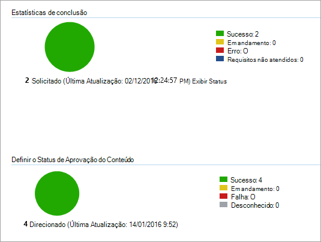

# <a name="onboard-windows-10-devices-using-configuration-manager"></a>Integrar dispositivo Windows 10 usando o Configuration Manager

**Aplica-se a:**

- [Prevenção contra perda de dados do Microsoft 365 Endpoint (DLP)](./endpoint-dlp-learn-about.md)
- Gerenciador de Configurações do System Center 2012 R2

### <a name="onboard-devices-using-system-center-configuration-manager"></a>Dispositivos integrados usando o System Center Configuration Manager

1. Abra o arquivo .zip do pacote de configuração do Configuration Manager *(DeviceComplianceOnboardingPackage.zip*) que você baixou do assistente de integração do serviço. Você também pode obter o pacote do [Centro de Conformidade da Microsoft.](https://compliance.microsoft.com/)

2. No painel de navegação, selecione **Configurações**  >  **integração do dispositivo**  >  .

3. No campo **Método de** implantação, selecione **Microsoft Endpoint Configuration Manager 2012/2012 R2/1511/1602**.
 
4. Selecione **Baixar pacote** e salve o arquivo .zip.

5. Extraia o conteúdo do arquivo .zip para um local compartilhado somente leitura que pode ser acessado pelos administradores de rede que implantarão o pacote. Você deve ter um arquivo chamado *DeviceComplianceOnboardingScript.cmd*.

6. Implante o pacote seguindo as etapas no artigo [Pacotes e Programas no System Center 2012 R2 Configuration Manager.](/previous-versions/system-center/system-center-2012-R2/gg699369(v=technet.10))

7. Escolha uma coleção de dispositivos predefinida para a qual implantar o pacote.

> [!NOTE]
> A prevenção contra perda de dados do Ponto de Extremidade do Microsoft 365 não dá suporte à integração durante a fase [OOBE (Experiência](https://answers.microsoft.com/en-us/windows/wiki/windows_10/how-to-complete-the-windows-10-out-of-box/47e3f943-f000-45e3-8c5c-9d85a1a0cf87) De Saída). Certifique-se de que os usuários concluam o OOBE após executar a instalação ou a atualização do Windows.

>[!TIP]
> Após a integração do dispositivo, você pode optar por executar um teste de detecção para verificar se um dispositivo está corretamente conectado ao serviço. Para obter mais informações, [consulte Execute a detection test on a newly onboarded Microsoft Defender ATP device](/windows/security/threat-protection/microsoft-defender-atp/run-detection-test).
>
> Observe que é possível criar uma regra de detecção em um aplicativo do Configuration Manager para verificar continuamente se um dispositivo foi internado. Um aplicativo é um tipo diferente de objeto do que um pacote e um programa.
> Se um dispositivo ainda não estiver conectado (devido à conclusão pendente do OOBE ou qualquer outro motivo), o Configuration Manager repetirá a integração do dispositivo até que a regra detecte a alteração de status.
> 
> Esse comportamento pode ser realizado criando uma verificação de regra de detecção se o valor do Registro "OnboardingState" (do tipo REG_DWORD) = 1.
> Esse valor do Registro está localizado em "HKLM\SOFTWARE\Microsoft\Proteção Avançada contra Ameaças do Windows\Status".
Para obter mais informações, [consulte Configure Detection Methods in System Center 2012 R2 Configuration Manager](/previous-versions/system-center/system-center-2012-R2/gg682159(v=technet.10)#step-4-configure-detection-methods-to-indicate-the-presence-of-the-deployment-type).

### <a name="configure-sample-collection-settings"></a>Configurar configurações de coleção de exemplos

Para cada dispositivo, você pode definir um valor de configuração para determinar se amostras podem ser coletadas do dispositivo quando uma solicitação é feita por meio do Centro de Segurança do Microsoft Defender para enviar um arquivo para análise profunda.

>[!NOTE]
>Essas configurações geralmente são feitas por meio do Configuration Manager. 

Você pode definir uma regra de conformidade para o item de configuração no Configuration Manager para alterar a configuração de compartilhamento de exemplo em um dispositivo.

Essa regra deve ser um *item de* configuração de regra de conformidade de correção que define o valor de uma chave do Registro em dispositivos direcionados para garantir que eles sejam reclamações.

A configuração é definida por meio da seguinte entrada de chave do Registro:

```
Path: “HKLM\SOFTWARE\Policies\Microsoft\Windows Advanced Threat Protection”
Name: "AllowSampleCollection"
Value: 0 or 1
```
Onde:<br>
Tipo de chave é um D-WORD. <br>
Os valores possíveis são:
- 0 - não permite o compartilhamento de exemplo deste dispositivo
- 1 - permite o compartilhamento de todos os tipos de arquivo deste dispositivo

O valor padrão caso a chave do Registro não exista é 1.

Para obter mais informações sobre a Conformidade do System Center Configuration Manager, consulte Introdução às configurações de conformidade no [System Center 2012 R2 Configuration Manager](/previous-versions/system-center/system-center-2012-R2/gg682139(v=technet.10)).


## <a name="other-recommended-configuration-settings"></a>Outras configurações recomendadas
Após a integração de dispositivos ao serviço, é importante aproveitar os recursos de proteção contra ameaças incluídos, habilitando-os com as seguintes configurações recomendadas.

### <a name="device-collection-configuration"></a>Configuração do conjunto de dispositivos
Se você estiver usando o Endpoint Configuration Manager, versão 2002 ou posterior, poderá optar por ampliar a implantação para incluir servidores ou clientes de nível inferior.


### <a name="next-generation-protection-configuration"></a>Configuração de proteção de próxima geração

As seguintes configurações são recomendadas:

**Examinar**

- Examinar dispositivos de armazenamento removíveis, como unidades USB: Sim

**Proteção em tempo real**

- Habilitar o Monitoramento Comportamental: Sim
- Habilitar a proteção contra aplicativos potencialmente indesejados no download e antes da instalação: Sim

**Serviço de Proteção na Nuvem**

- Tipo de associação do Serviço de Proteção na Nuvem: Associação avançada

**Redução de superfície de ataque** Configure todas as regras disponíveis para Auditoria.

>[!NOTE]
> O bloqueio dessas atividades pode interromper processos comerciais legítimos. A melhor abordagem é definir tudo para auditoria, identificar quais são seguros para ativar e, em seguida, ativar essas configurações em pontos de extremidade que não têm detecções de falsos positivos.

**Proteção de rede**

Antes de ativar a proteção de rede no modo de auditoria ou bloqueio, verifique se você instalou a atualização da plataforma antimalware, que pode ser obtida na página [de suporte](https://support.microsoft.com/en-us/help/4560203/windows-defender-anti-malware-platform-binaries-are-missing).


**Acesso controlado a pastas**

Habilita o recurso no modo de auditoria por pelo menos 30 dias. Após esse período, revise as detecções e crie uma lista de aplicativos que têm permissão para gravar em diretórios protegidos.

Para obter mais informações, consulte [Evaluate controlled folder access](/windows/security/threat-protection/microsoft-defender-atp/evaluate-controlled-folder-access).


## <a name="offboard-devices-using-configuration-manager"></a>Dispositivos offboard usando o Configuration Manager

Por motivos de segurança, o pacote usado para dispositivos offboard expirará 30 dias após a data em que foi baixado. Os pacotes de offboard expirados enviados para um dispositivo serão rejeitados. Ao baixar um pacote de offboard, você será notificado sobre a data de expiração dos pacotes e ele também será incluído no nome do pacote.

> [!NOTE]
> As políticas de integração e de offboard não devem ser implantadas no mesmo dispositivo ao mesmo tempo, caso contrário, isso causará colisões imprevisíveis.

### <a name="offboard-devices-using-microsoft-endpoint-configuration-manager-current-branch"></a>Dispositivos de offboard usando a filial atual do Microsoft Endpoint Configuration Manager

Se você usar a filial atual do Microsoft Endpoint Configuration Manager, consulte [Create an offboarding configuration file](/configmgr/protect/deploy-use/windows-defender-advanced-threat-protection#create-an-offboarding-configuration-file).

### <a name="offboard-devices-using-system-center-2012-r2-configuration-manager"></a>Dispositivos de offboard usando o System Center 2012 R2 Configuration Manager

1. Obter o pacote de offboard do [Centro de Conformidade da Microsoft](https://compliance.microsoft.com/):

2. No painel de navegação, selecione **Configurações**  >   **Integrando o** Dispositivo >  **offboarding**.

3. Selecione Windows 10 como o sistema operacional.

4. No campo **Método de** implantação, selecione **Microsoft Endpoint Configuration Manager 2012/2012 R2/1511/1602**.
    
5. Selecione **Baixar pacote** e salve o arquivo .zip.

6. Extraia o conteúdo do arquivo .zip para um local compartilhado somente leitura que pode ser acessado pelos administradores de rede que implantarão o pacote. Você deve ter um arquivo chamado *DeviceComplianceOffboardingScript_valid_until_YYYY-MM-DD.cmd*.

7. Implante o pacote seguindo as etapas no artigo [Pacotes e Programas no System Center 2012 R2 Configuration Manager.](/previous-versions/system-center/system-center-2012-R2/gg699369(v=technet.10))

8. Escolha uma coleção de dispositivos predefinida para a qual implantar o pacote.

> [!IMPORTANT]
> O offboard faz com que o dispositivo pare de enviar dados do sensor para o portal, mas os dados do dispositivo, incluindo a referência a todos os alertas que ele teve, serão mantidos por até 6 meses.


## <a name="monitor-device-configuration"></a>Monitorar a configuração do dispositivo

Se você estiver usando a filial atual do Microsoft Endpoint Configuration Manager, use o painel integrado do Microsoft Defender ATP no console do Configuration Manager. Para obter mais informações, consulte [Proteção Avançada contra Ameaças do Microsoft Defender - Monitor](/configmgr/protect/deploy-use/windows-defender-advanced-threat-protection#monitor).

Se você estiver usando o System Center 2012 R2 Configuration Manager, o monitoramento consiste em duas partes:

1. Confirmar se o pacote de configuração foi implantado corretamente e está sendo executado (ou executado com êxito) nos dispositivos em sua rede.

2. Verificar se os dispositivos estão em conformidade com o serviço de prevenção contra perda de dados do Microsoft 365 Endpoint (isso garante que o dispositivo possa concluir o processo de integração e pode continuar a relatar dados ao serviço).

### <a name="confirm-the-configuration-package-has-been-correctly-deployed"></a>Confirme se o pacote de configuração foi implantado corretamente

1. No console do Configuration Manager, clique **em Monitoramento** na parte inferior do painel de navegação.

2. Selecione **Visão geral** e **implantações.**

3. Selecione na implantação com o nome do pacote.

4. Revise os indicadores de status **em Estatísticas de Conclusão** e Status de **Conteúdo.**

    Se houver implantações com falha (dispositivos com **status Error**, **Requirements Not Met**, ou **Failed**), talvez seja necessário solucionar problemas dos dispositivos. Para obter mais informações, consulte Solução de problemas de integração da [Proteção Avançada contra Ameaças do Microsoft Defender.](/windows/security/threat-protection/microsoft-defender-atp/troubleshoot-onboarding)

    

### <a name="check-that-the-devices-are-compliant-with-the-microsoft-365-endpoint-data-loss-prevention-service"></a>Verifique se os dispositivos estão em conformidade com o serviço de prevenção contra perda de dados do Microsoft 365 Endpoint

Você pode definir uma regra de conformidade para o item de configuração no System Center 2012 R2 Configuration Manager para monitorar sua implantação.

> [!NOTE]
> Este procedimento e a entrada do Registro se aplica à DLP do ponto de extremidade, bem como à Proteção Avançada contra Ameaças.

Essa regra deve ser um *item* de configuração de regra de conformidade não corretivo que monitora o valor de uma chave do Registro em dispositivos direcionados.

Monitore a seguinte entrada da chave do Registro:
```
Path: “HKLM\SOFTWARE\Microsoft\Windows Advanced Threat Protection\Status”
Name: “OnboardingState”
Value: “1”
```
Para obter mais informações, consulte Introdução às configurações de conformidade [no System Center 2012 R2 Configuration Manager](/previous-versions/system-center/system-center-2012-R2/gg682139(v=technet.10)).

## <a name="related-topics"></a>Tópicos relacionados
- [Integração de dispositivos Windows 10 usando a Política de Grupo](dlp-configure-endpoints-gp.md)
- [Integrar dispositivo Windows 10 usando as ferramentas de Gerenciamento de Dispositivo Móvel](dlp-configure-endpoints-mdm.md)
- [Integrar dispositivos Windows 10 usando um script local](dlp-configure-endpoints-script.md)
- [Integrar dispositivos não persistentes de VDI (virtual desktop infrastructure)](dlp-configure-endpoints-vdi.md)
- [Executar um teste de detecção em um dispositivo Microsoft Defender ATP recém-conectado](/windows/security/threat-protection/microsoft-defender-atp/run-detection-test)
- [Solucionar problemas de integração da Proteção Avançada contra Ameaças do Microsoft Defender](/windows/security/threat-protection/microsoft-defender-atp/troubleshoot-onboarding)