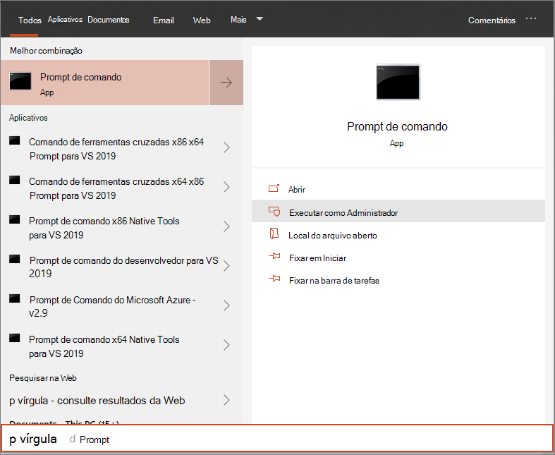

# Integrar dispositivos Windows 10 usando um script localOnboard Windows 10 devices using a local script

**Aplica-se a:****Applies to:**

- [Prevenção contra perda de dados do Microsoft 365 Endpoint (DLP)Microsoft 365 Endpoint data loss prevention (DLP)](./endpoint-dlp-learn-about.md)

Você também pode fazer a integração manual de dispositivos individuais à prevenção contra perda de dados do Microsoft 365 Endpoint.You can also manually onboard individual devices to Microsoft 365 Endpoint data loss prevention. Você pode querer fazer isso primeiro ao testar o serviço antes de se comprometer a integração de todos os dispositivos em sua rede.You might want to do this first when testing the service before you commit to onboarding all devices in your network.

> [!IMPORTANT]
> Esse script foi otimizado para uso em até 10 dispositivos.This script has been optimized for use on up to 10 devices.
>
> Para implantar em escala, use [outras opções de implantação.](dlp-configure-endpoints.md)To deploy at scale, use [other deployment options](dlp-configure-endpoints.md). Por exemplo, você pode implantar um script de integração em mais de 10 dispositivos em produção com o script disponível em dispositivos [Do Windows 10](dlp-configure-endpoints-gp.md)de integração usando a Política de Grupo .For example, you can deploy an onboarding script to more than 10 devices in production with the script available in [Onboard Windows 10 devices using Group Policy](dlp-configure-endpoints-gp.md).

## Dispositivos de integraçãoOnboard devices
 
1.  Abra o arquivo .zip do pacote de configuração da GP (*DeviceComplianceOnboardingPackage.zip*) que você baixou do assistente de integração do serviço.Open the GP configuration package .zip file (*DeviceComplianceOnboardingPackage.zip*) that you downloaded from the service onboarding wizard. Você também pode obter o pacote do [Centro de Conformidade da Microsoft](https://compliance.microsoft.com)You can also get the package from [Microsoft Compliance center](https://compliance.microsoft.com)

2. No painel de navegação, selecione **Configurações**  >  **Integração do dispositivo**.In the navigation pane, select **Settings** > **Device onboarding**.

3. No campo **Método de Implantação,** selecione **Script Local**.In the **Deployment method** field, select **Local Script**.

4. Clique **em Baixar pacote** e salve o arquivo .zip.Click **Download package** and save the .zip file.
  
5. Extraia o conteúdo do pacote de configuração para um local no dispositivo que você deseja integrar (por exemplo, a Área de Trabalho).Extract the contents of the configuration package to a location on the device you want to onboard (for example, the Desktop). Você deve ter um arquivo chamado *DeviceOnboardingScript.cmd*.You should have a file named *DeviceOnboardingScript.cmd*.

6.  Abra um prompt de linha de comando elevada no dispositivo e execute o script:Open an elevated command-line prompt on the device and run the script:

7.  Vá para **Iniciar** e digite **cmd**.Go to **Start** and type **cmd**.

8.  Clique com o botão direito do mouse em **Prompt de Comando** e selecione **Executar como administrador**.Right-click **Command prompt** and select **Run as administrator**.

9.  Digite o local do arquivo de script.Type the location of the script file. Se você copiou o arquivo para a área de trabalho, *digite: %userprofile%\Desktop\WindowsDefenderATPOnboardingScript.cmd*If you copied the file to the desktop, type: *%userprofile%\Desktop\WindowsDefenderATPOnboardingScript.cmd*

10.  Pressione a **tecla Enter** ou clique em **OK**.Press the **Enter** key or click **OK**.

Para obter informações sobre como você pode validar manualmente se o dispositivo é compatível e relata corretamente os dados do sensor, consulte Solução de problemas de integração da Proteção Avançada contra Ameaças do [Microsoft Defender.](/windows/security/threat-protection/microsoft-defender-atp/troubleshoot-onboarding)For information on how you can manually validate that the device is compliant and correctly reports sensor data see, [Troubleshoot Microsoft Defender Advanced Threat Protection onboarding issues](/windows/security/threat-protection/microsoft-defender-atp/troubleshoot-onboarding).

## Dispositivos offboard usando um script localOffboard devices using a local script
Por motivos de segurança, o pacote usado para dispositivos offboard expirará 30 dias após a data em que foi baixado.For security reasons, the package used to Offboard devices will expire 30 days after the date it was downloaded. Os pacotes de offboard expirados enviados para um dispositivo serão rejeitados.Expired offboarding packages sent to an device will be rejected. Ao baixar um pacote de offboard, você será notificado sobre a data de expiração dos pacotes e ele também será incluído no nome do pacote.When downloading an offboarding package you will be notified of the packages expiry date and it will also be included in the package name.

> [!NOTE]
> As políticas de integração e de offboard não devem ser implantadas no mesmo dispositivo ao mesmo tempo, caso contrário, isso causará colisões imprevisíveis.Onboarding and offboarding policies must not be deployed on the same device at the same time, otherwise this will cause unpredictable collisions.

1. Obter o pacote de offboard do [Centro de Conformidade da Microsoft](https://compliance.microsoft.com)Get the offboarding package from [Microsoft Compliance center](https://compliance.microsoft.com)

2. No painel de navegação, selecione **Configurações**  >  **Offboarding do dispositivo**.In the navigation pane, select **Settings** > **Device offboarding**.

3. No campo **Método de Implantação,** selecione **Script Local**.In the **Deployment method** field, select **Local Script**.

4. Clique **em Baixar pacote** e salve o arquivo .zip.Click **Download package** and save the .zip file.

5. Extraia o conteúdo do arquivo .zip para um local compartilhado somente leitura que pode ser acessado pelos dispositivos.Extract the contents of the .zip file to a shared, read-only location that can be accessed by the devices. Você deve ter um arquivo chamado *DeviceComplianceOffboardingScript_valid_until_YYYY-MM-DD.cmd*.You should have a file named *DeviceComplianceOffboardingScript_valid_until_YYYY-MM-DD.cmd*.

6.  Abra um prompt de linha de comando elevada no dispositivo e execute o script:Open an elevated command-line prompt on the device and run the script:

7.  Vá para **Iniciar** e digite **cmd**.Go to **Start** and type **cmd**.

8.  Clique com o botão direito do mouse em **Prompt de Comando** e selecione **Executar como administrador**.Right-click **Command prompt** and select **Run as administrator**.

9.  Digite o local do arquivo de script.Type the location of the script file. Se você copiou o arquivo para a área de trabalho, *digite: %userprofile%\Desktop\WindowsDefenderATPOffboardingScript_valid_until_YYYY-MM-DD.cmd*If you copied the file to the desktop, type: *%userprofile%\Desktop\WindowsDefenderATPOffboardingScript_valid_until_YYYY-MM-DD.cmd*

10.  Pressione a **tecla Enter** ou clique em **OK**.Press the **Enter** key or click **OK**.

> [!IMPORTANT]
> O offboard faz com que o dispositivo pare de enviar dados do sensor para o portal.Offboarding causes the device to stop sending sensor data to the portal.

## Monitorar a configuração do dispositivoMonitor device configuration
Você pode seguir as diferentes etapas de verificação no [Solucionar problemas de integração](( para verificar se o script foi concluído com êxito e https://docs.microsoft.com/windows/security/threat-protection/microsoft-defender-atp/troubleshoot-onboarding) se o agente está em execução.You can follow the different verification steps in the [Troubleshoot onboarding issues]((https://docs.microsoft.com/windows/security/threat-protection/microsoft-defender-atp/troubleshoot-onboarding) to verify that the script completed successfully and the agent is running.

O monitoramento também pode ser feito diretamente no portal ou usando as diferentes ferramentas de implantação.Monitoring can also be done directly on the portal, or by using the different deployment tools.

### Monitorar dispositivos usando o portalMonitor devices using the portal
1. Vá para o Centro de [Conformidade do Microsoft 365.](https://compliance.microsoft.com)Go to [Microsoft 365 Compliance center](https://compliance.microsoft.com).

2. Escolha **Configurações**  >  **Dispositivos de**  >  **integração de dispositivos**.Choose **Settings** > **Device onboarding** > **Devices**.

3. Verifique se os dispositivos estão aparecendo.Verify that devices are appearing.

## Tópicos relacionadosRelated topics
- [Integração de dispositivos Windows 10 usando a Política de GrupoOnboard Windows 10 devices using Group Policy](dlp-configure-endpoints-gp.md)
- [Integração de dispositivos Windows 10 usando o Microsoft Endpoint Configuration ManagerOnboard Windows 10 devices using Microsoft Endpoint Configuration Manager](dlp-configure-endpoints-sccm.md)
- [Integrar dispositivo Windows 10 usando as ferramentas de Gerenciamento de Dispositivo MóvelOnboard Windows 10 devices using Mobile Device Management tools](dlp-configure-endpoints-mdm.md)
- [Integrar dispositivos não persistentes de VDI (virtual desktop infrastructure)Onboard non-persistent virtual desktop infrastructure (VDI) devices](dlp-configure-endpoints-vdi.md)
- [Executar um teste de detecção em um dispositivo Microsoft Defender ATP recém-conectadoRun a detection test on a newly onboarded Microsoft Defender ATP device](/windows/security/threat-protection/microsoft-defender-atp/run-detection-test)
- [Solucionar problemas de integração da Proteção Avançada contra Ameaças do Microsoft DefenderTroubleshoot Microsoft Defender Advanced Threat Protection onboarding issues](/windows/security/threat-protection/microsoft-defender-atp/troubleshoot-onboarding)