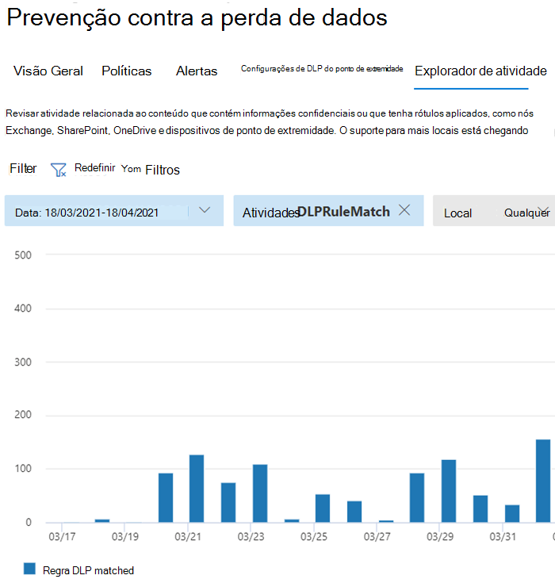

# Saiba mais sobre a prevenção contra perda de dados do ponto de extremidadeLearn about data loss prevention

As organizações têm informações confidenciais sob seu controle, como dados financeiros, dados proprietários, números de cartão de crédito, registros de saúde ou números de segurança social.Organizations have sensitive information under their control such as financial data, proprietary data, credit card numbers, health records, or social security numbers. Para ajudar a proteger esses dados confidenciais e reduzir o risco, eles precisam de uma maneira de impedir que seus usuários os compartilhem inadequadamente com pessoas que não devem ter.To help protect this sensitive data and reduce risk, they need a way to prevent their users from inappropriately sharing it with people who shouldn't have it. Essa prática é chamada de prevenção contra perda de dados (DLP).This practice is called data loss prevention (DLP).

Em Microsoft 365, você implementa a prevenção contra perda de dados definindo e aplicando políticas de DLP.In Microsoft 365, you implement data loss prevention by defining and applying DLP policies. Com uma política de DLP, você pode identificar, monitorar e proteger automaticamente itens confidenciais em:With a DLP policy, you can identify, monitor, and automatically protect sensitive items across:

- Microsoft 365 serviços como Teams, Exchange, SharePoint e OneDriveMicrosoft 365 services such as Teams, Exchange, SharePoint, and OneDrive
- Office aplicativos como Word, Excel e PowerPointOffice applications such as Word, Excel, and PowerPoint
- Windows 10 pontos de extremidadeWindows 10 endpoints
- aplicativos de nuvem que não são da Microsoftnon-Microsoft cloud apps
- Compartilhamentos de arquivos locais e SharePoint.on-premises file shares and on-premises SharePoint.

Microsoft 365 detecta itens confidenciais usando análise de conteúdo profundo, não apenas por uma verificação de texto simples.Microsoft 365 detects sensitive items by using deep content analysis, not by just a simple text scan. O conteúdo é analisado para dados primários corresponde a palavras-chave, pela avaliação de expressões regulares, pela validação de função interna e por matchs de dados secundários que estão próximos da combinação de dados primários.Content is analyzed for primary data matches to keywords, by the evaluation of regular expressions, by internal function validation, and by secondary data matches that are in proximity to the primary data match. Além disso, a DLP também usa algoritmos de aprendizado de máquina e outros métodos para detectar conteúdo que corresponde às suas políticas de DLP.Beyond that DLP also uses machine learning algorithms and other methods to detect content that matches your DLP policies.
  
## A DLP faz parte da oferta de conformidade Microsoft 365 maiorDLP is part of the larger Microsoft 365 Compliance offering

Microsoft 365 A DLP é apenas uma das Microsoft 365 de Conformidade que você usará para ajudar a proteger seus itens confidenciais onde quer que eles vivam ou viajem.Microsoft 365 DLP is just one of the Microsoft 365 Compliance tools that you will use to help protect your sensitive items wherever they live or travel. Você deve entender as outras ferramentas no Microsoft 365 de Conformidade definidas, como elas se relacionam e funcionam melhor juntas.You should understand the other tools in the Microsoft 365 Compliance tools set, how they interrelate, and work better together.  Consulte, [Microsoft 365 ferramentas de conformidade](protect-information.md) para saber mais sobre o processo de proteção de informações.See, [Microsoft 365 compliance tools](protect-information.md) to learn more about the information protection process.

## Ações de proteção de políticas DLPProtective actions of DLP policies

Microsoft 365 As políticas de DLP são como você monitora as atividades que os usuários fazem em itens confidenciais em repouso, itens confidenciais em trânsito ou itens confidenciais em uso e fazem ações de proteção.Microsoft 365 DLP policies are how you monitor the activities that users take on sensitive items at rest, sensitive items in transit, or sensitive items in use and take protective actions. Por exemplo, quando um usuário tenta tomar uma ação proibida, como copiar um item sensível para um local não aprovado ou compartilhar informações médicas em um email ou outras condições estabelecidas em uma política, a DLP pode:For example, when a user attempts to take a prohibited action, like copying a sensitive item to an unapproved location or sharing medical information in an email or other conditions laid out in a policy, DLP can:

- mostrar uma dica de política pop-up para o usuário que o avisa que ele pode estar tentando compartilhar um item sensível de forma inadequadashow a pop-up policy tip to the user that warns them that they may be trying to share a sensitive item inappropriately
- bloquear o compartilhamento e, por meio de uma dica de política, permitir que o usuário substitua o bloco e capture a justificativa dos usuáriosblock the sharing and, via a policy tip, allow the user to override the block and capture the users' justification
- bloquear o compartilhamento sem a opção de substituiçãoblock the sharing without the override option
- para dados em repouso, itens confidenciais podem ser bloqueados e movidos para um local de quarentena segurofor data at rest, sensitive items can be locked and moved to a secure quarantine location
- para Teams chat, as informações confidenciais não serão exibidasfor Teams chat, the sensitive information will not be displayed

Todas as atividades monitoradas de DLP são gravadas no [log Microsoft 365 Auditoria](search-the-audit-log-in-security-and-compliance.md) por padrão e roteadas para o Explorador de [Atividades.](data-classification-activity-explorer.md)All DLP monitored activities are recorded to the [Microsoft 365 Audit log](search-the-audit-log-in-security-and-compliance.md) by default and routed to [Activity explorer](data-classification-activity-explorer.md). Quando um usuário executa uma ação que atende aos critérios de uma política DLP e você tem alertas configurados, a DLP fornece alertas no painel de gerenciamento de alertas [DLP.](dlp-configure-view-alerts-policies.md)When a user performs an action that meets the criteria of a DLP policy, and you have alerts configured, DLP provides alerts in the [DLP alert management dashboard](dlp-configure-view-alerts-policies.md).

## Ciclo de vida de DLPDLP lifecycle

Uma implementação DLP normalmente segue essas fases principais.A DLP implementation typically follows these major phases.

- [Plano de Prevenção Contra Perda de DadosPlan for DLP](#plan-for-dlp)
- [Preparar para DLPPrepare for DLP](#prepare-for-dlp)
- [Implantar suas políticas na produçãoDeploy your policies in production](#deploy-your-policies-in-production)

<!--ADD DIAGRAM OF THE DLP LIFECYCLE WORK ON WITH MAS-->

### Plano de Prevenção Contra Perda de DadosPlan for DLP

Microsoft 365 O monitoramento e a proteção DLP são nativos dos aplicativos que os usuários usam todos os dias.Microsoft 365 DLP monitoring and protection are native to the applications that users use every day. Isso ajuda a proteger os itens confidenciais de suas organizações contra atividades arriscadas, mesmo que seus usuários não sejam acostumados a pensar e práticas de prevenção contra perda de dados.This helps to protect your organizations' sensitive items from risky activities even if your users are unaccustomed to data loss prevention thinking and practices. Se sua organização e seus usuários são novos em práticas de prevenção contra perda de dados, a adoção de DLP pode exigir uma alteração nos processos de negócios e haverá uma mudança de cultura para seus usuários.If your organization and your users are new to data loss prevention practices, the adoption of DLP may require a change to your business processes and there will be a culture shift for your users. Porém, com planejamento, teste e ajuste adequados, suas políticas de DLP protegerão seus itens confidenciais enquanto minimizam possíveis interrupções do processo de negócios.But, with proper planning, testing and tuning, your DLP policies will protect your sensitive items while minimizing any potential business process disruptions.

**Planejamento de tecnologia para DLP****Technology planning for DLP**

Lembre-se de que a DLP como tecnologia pode monitorar e proteger seus dados em repouso, dados em uso e dados em movimento nos serviços Microsoft 365, dispositivos Windows 10, compartilhamentos de arquivos locais e SharePoint.Keep in mind that DLP as a technology can monitor and protect your data at rest, data in use and data in motion across Microsoft 365 services, Windows 10 devices, on-premises file shares, and on-premises SharePoint. Há implicações de planejamento para os diferentes locais, o tipo de dados que você deseja monitorar e proteger e as ações a serem tomadas quando ocorrer uma combinação de política.There are planning implications for the different locations, the type of data you want to monitor and protect, and the actions to be taken when a policy match occurs.  

**Planejamento de processos de negócios para DLP****Business processes planning for DLP**

As políticas de DLP podem bloquear atividades proibidas, como o compartilhamento inadequado de informações confidenciais por email.DLP policies can block prohibited activities, like inappropriate sharing of sensitive information via email. Ao planejar suas políticas de DLP, você deve identificar os processos de negócios que tocam seus itens confidenciais.As you plan your DLP policies, you must identify the business processes that touch your sensitive items. Os proprietários do processo de negócios podem ajudá-lo a identificar comportamentos de usuário apropriados que devem ser permitidos e comportamentos de usuário inadequados que devem ser protegidos.The business process owners can help you identify appropriate user behaviors that should be allowed and inappropriate user behaviors that should be protected against. Você deve planejar suas políticas e implantá-las  no modo de teste e avaliar seu impacto por meio do explorador de atividades primeiro, antes de aplicá-las em modos mais restritivos.You should plan your policies and deploy them in test mode, and evaluate their impact via [activity explorer](data-classification-activity-explorer.md) first, before applying them in more restrictive modes.

**Planejamento de cultura organizacional para DLP****Organizational culture planning for DLP**

Uma implementação de DLP bem-sucedida depende tanto da capacitação dos usuários quanto das práticas de prevenção contra perda de dados, como em políticas bem planejadas e ajustadas.A successful DLP implementation is as much dependent on getting your users trained and acclimated to data loss prevention practices as it is on well planned and tuned policies. Como seus usuários estão fortemente envolvidos, não se esqueça de planejar o treinamento para eles também.Since your users are heavily involved, be sure to plan for training for them too. Você pode usar dicas de política estrategicamente para conscientizar os usuários antes de alterar a imposição de política do modo de teste para modos mais restritivos.You can strategically use policy tips to raise awareness with your users before changing the policy enforcement from test mode to more restrictive modes.

<!--For more information on planning for DLP, including suggestions for deployment based on your needs and resources, see [Planning for Microsoft 365 data loss prevention](dlp-plan-for-dlp.md).-->

### Preparar para DLPPrepare for DLP

Você pode aplicar políticas de DLP a dados em repouso, dados em uso e dados em movimento em locais, como:You can apply DLP policies to data at rest, data in use, and data in motion in locations, such as:

- Exchange Online emailExchange Online email
- Sites do SharePoint OnlineSharePoint Online sites
- Contas do OneDriveOneDrive accounts
- Bater papo e canal de mensagens do TeamsTeams chat and channel messages
- Segurança no aplicativo na nuvem da MicrosoftMicrosoft Cloud App Security
- Dispositivos Windows 10Windows 10 devices
- Repositórios locaisOn-premises repositories

Cada um deles tem pré-requisitos diferentes.Each one has different pre-requisites. Itens confidenciais em alguns locais, como Exchange online, podem ser trazidos para o guarda-chuva DLP apenas configurando uma política que se aplica a eles.Sensitive items in some locations, like Exchange online, can be brought under the DLP umbrella by just configuring a policy that applies to them. Outros, como repositórios de arquivos locais, exigem uma implantação do scanner AIP (Proteção de Informações do Azure).Others, such as on-premises file repositories require a deployment of Azure Information Protection (AIP) scanner. Você precisará preparar seu ambiente, codificar políticas de rascunho e testá-las completamente antes de ativar qualquer ação de bloqueio.You'll need to prepare your environment, code draft policies, and test them thoroughly before activating any blocking actions.

### Implantar suas políticas na produçãoDeploy your policies in production

#### Projetar suas políticasDesign your policies

Comece definindo seus objetivos de controle e como eles se aplicam em cada carga de trabalho respectiva.Start by defining your control objectives, and how they apply across each respective workload. Esboça uma política que incorpora seus objetivos.Draft a policy that embodies your objectives. Sinta-se à vontade para começar com uma carga de trabalho por vez ou em todas as cargas de trabalho - ainda não há impacto.Feel free to start with one workload at a time, or across all workloads - there's no impact yet.

#### Implementar política no modo de testeImplement policy in test mode

Avalie o impacto dos controles implementando-os com uma política DLP no modo de teste.Evaluate the impact of the controls by implementing them with a DLP policy in test mode. Não há problema em aplicar a política a todas as cargas de trabalho no modo de teste, para que você possa obter a amplitude completa dos resultados, mas você pode começar com uma carga de trabalho se precisar.It's ok to apply the policy to all workloads in test mode, so that you can get the full breadth of results, but you can start with one workload if you need to.

#### Monitorar resultados e ajustar a políticaMonitor outcomes and fine-tune the policy

Enquanto estiver no modo de teste, monitore os resultados da política e ajuste-a de forma que ela atenda aos seus objetivos de controle, garantindo que você não está afetando adversamente ou inadvertidamente fluxos de trabalho e produtividade válidos do usuário.While in test mode, monitor the outcomes of the policy and fine-tune it so that it meets your control objectives while ensuring you aren't adversely or inadvertently impacting valid user workflows and productivity. Aqui estão alguns exemplos de coisas para ajustar:Here are some examples of things to fine-tune:

- ajustando os locais e as pessoas/locais que estão dentro ou fora do escopoadjusting the locations and people/places that are in or out of scope
- ajustar as condições e exceções que são usadas para determinar se um item e o que está sendo feito com ele corresponde à políticatune the conditions and exceptions that are used to determine if an item and what is being done with it matches the policy
- as definições/s de informações confidenciaisthe sensitive information definition/s
- as açõesthe actions
- o nível de restriçõesthe level of restrictions
- adicionar novos controlesadd new controls
- adicionar novas pessoasadd new people
- adicionar novos aplicativos restritosadd new restricted apps
- adicionar novos sites restritosadd new restricted sites

#### Habilitar o controle e ajustar suas políticasEnable the control and tune your policies

Depois que a política atender a todos os seus objetivos, a a ligue.Once the policy meets all your objectives, turn it on. Continue a monitorar os resultados do aplicativo de política e ajuste conforme necessário.Continue to monitor the outcomes of the policy application and tune as needed. Em geral, as políticas entrarão em vigor cerca de uma hora depois de serem ativas.In general, policies take effect about an hour after being turned on. 

<!--See, LINK TO topic for SLAs for location specific  details-->

## Visão geral da configuração da política de DLPDLP policy configuration overview

Você tem flexibilidade na forma como cria e configura suas políticas de DLP.You have flexibility in how you create and configure your DLP policies. Você pode começar a partir de um modelo predefinido e criar uma política em apenas alguns cliques ou pode projetar sua própria do zero.You can start from a predefined template and create a policy in just a few clicks or you can design your own from the ground up. Não importa qual você escolher, todas as políticas de DLP exigem as mesmas informações de você.No matter which you choose, all DLP policies require the same information from you.

1. **Escolha o que você deseja monitorar** - Microsoft 365 vem com muitos modelos de política predefinidos para ajudá-lo a começar ou você pode criar uma política personalizada.**Choose what you want to monitor** - Microsoft 365 comes with many predefined policy templates to help you get started or you can create a custom policy.
    - Um modelo de política predefinido: dados financeiros, dados médicos e de saúde, dados de privacidade para vários países e regiões.A predefined policy template: Financial data, Medical and health data, Privacy data all for various countries and regions.
    - Uma política personalizada que usa os tipos de informações confidenciais disponíveis, rótulos de retenção e rótulos de sensibilidade.A custom policy that uses the available sensitive information types, retention labels, and sensitivity labels.
2. **Escolha onde você deseja monitorar** - Escolha um ou mais locais que deseja que a DLP monitore para obter informações confidenciais.**Choose where you want to monitor** - You pick one or more locations that you want DLP to monitor for sensitive information. Você pode monitorar:You can monitor:
    
localizaçãolocation | incluir/excluir porinclude/exclude by|
|---------|---------|
|Email do ExchangeExchange email| grupos de distribuiçãodistribution groups|
|Sites do Microsoft Office SharePoint OnlineSharePoint sites |sitessites |
|Contas do OneDriveOneDrive accounts |contas ou grupos de distribuiçãoaccounts or distribution groups |
|Bater papo e canal de mensagens do TeamsTeams chat and channel messages |contasaccounts |
|Dispositivos Windows 10Windows 10 devices |usuário ou grupouser or group |
|Microsoft Cloud App SecurityMicrosoft Cloud App Security |instânciainstance |
|Repositórios locaisOn-premises repositories| caminho do arquivo de repositóriorepository file path|

3. **Escolha as condições que devem ser** corresponder a uma política a ser aplicada a um item - você pode aceitar condições pré-configuradas ou definir condições personalizadas.**Choose the conditions that must be matched for a policy to be applied to an item** - you can accept pre-configured conditions or define custom conditions. Alguns exemplos:Some examples are:

- contém um tipo especificado de informações confidenciais que estão sendo usadas em um determinado contexto.item contains a specified kind of sensitive information that is being used in a certain context. Por exemplo, 95 números de segurança social sendo enviado por email para destinatários fora da sua organização.For example, 95 social security numbers being emailed to recipient outside your org.
- item tem um rótulo de sensibilidade especificadoitem has a specified sensitivity label
- item com informações confidenciais é compartilhado internamente ou externamenteitem with sensitive information is shared either internally or externally

4. **Escolha a ação a ser tomada quando as** condições de política são atendidas - As ações dependem do local onde a atividade está acontecendo.**Choose the action to take when the policy conditions are met** - The actions depend on the location where the activity is happening.  Alguns exemplos:Some examples are:

- SharePoint/Exchange/OneDrive: Bloquear pessoas que estão fora do formulário da organização acessando o conteúdo.SharePoint/Exchange/OneDrive: Block people who are outside your organization form accessing the content. Mostre uma dica ao usuário e envie uma notificação por email de que ele está tomando uma ação que é proibida pela política DLP.Show the user a tip and send them an email notification that they are taking an action that is prohibited by the DLP policy.
- Teams Chat e Canal: Impedir que informações confidenciais são compartilhadas no chat ou no canalTeams Chat and Channel: Block sensitive information from being shared in the chat or channel
- Windows 10 Dispositivos: auditar ou restringir a cópia de um item sensível a um dispositivo USB removêvelWindows 10 Devices: Audit or restrict copying a sensitive item to a removeable USB device 
- Office Aplicativos: mostrar um pop-up notificando o usuário de que ele está envolvido em um comportamento arriscado e bloquear ou bloquear, mas permitir substituição.Office Apps: Show a popup notifying the user that they are engaging in a risky behavior and block or block but allow override.
- Compartilhamentos de arquivos locais: mova o arquivo de onde ele está armazenado para uma pasta de quarentenaOn-premises file shares: move the file from where it is stored to a quarantine folder

> [!NOTE]
> As condições e as ações a tomar são definidas em um objeto chamado Rule.The conditions and the actions to take are defined in an object called a Rule.

<!--## Create a DLP policy

All DLP policies are created and maintained in the Microsoft 365 Compliance center. See, INSERT LINK TO ARTICLE THAT WILL START WALKING THEM THROUGH THE POLICY CREATION PROCEDURES for more information.-->

Depois de criar uma política de DLP no Centro de Conformidade, ela será armazenada em um armazenamento de política central e sincronizada com as várias fontes de conteúdo, incluindo:After you create a DLP policy in the Compliance Center, it's stored in a central policy store, and then synced to the various content sources, including:
  
- Exchange Online, e de lá para o Outlook na Web e o Outlook.Exchange Online, and from there to Outlook on the web and Outlook.
- Sites do OneDrive for Business.OneDrive for Business sites.
- Sites do SharePoint Online.SharePoint Online sites.
- Programas da área de trabalho do Office (Excel, PowerPoint e Word)Office desktop programs (Excel, PowerPoint, and Word).
- Mensagens de canais e de chats do Microsoft Teams.Microsoft Teams channels and chat messages.
    
Após a sincronização da política com os locais corretos, ela começa avaliar o conteúdo e aplicar as ações.After the policy's synced to the right locations, it starts to evaluate content and enforce actions.

## Exibindo os resultados do aplicativo de políticaViewing policy application results

A DLP relata uma grande quantidade de informações em Microsoft 365 de monitoramento, de diretivas e ações e atividades do usuário.DLP reports a vast amount of information into Microsoft 365 from monitoring, policy matches and actions, and user activities. Você precisará consumir e agir sobre essas informações para ajustar suas políticas e ações de triagem realizadas em itens confidenciais.You'll need to consume and act on that information to tune your policies and triage actions taken on sensitive items. A telemetria entra primeiro [nos](search-the-audit-log-in-security-and-compliance.md#search-the-audit-log-in-the-compliance-center) Logs de Auditoria Microsoft 365 Centro de Conformidade, é processada e segue para diferentes ferramentas de relatório.The telemetry goes into the [Microsoft 365 Compliance center Audit Logs](search-the-audit-log-in-security-and-compliance.md#search-the-audit-log-in-the-compliance-center) first, is processed, and makes its way to different reporting tools. Cada ferramenta de relatório tem uma finalidade diferente.Each reporting tool has a different purpose.  

### Painel de Alertas DLPDLP Alerts Dashboard

Quando a DLP faz uma ação em um item sensível, você pode ser notificado dessa ação por meio de um alerta configurável.When DLP takes an action on a sensitive item, you can be notified of that action via a configurable alert. Em vez de ter esses alertas empilhados em uma caixa de correio para você passar, o Centro de Conformidade os disponibiliza no Painel de Gerenciamento de [Alertas de DLP.](dlp-configure-view-alerts-policies.md)Rather than having these alerts pile up in a mailbox for you to sift through, the Compliance center makes them available in the [DLP Alerts Management Dashboard](dlp-configure-view-alerts-policies.md). Use o painel Alertas de DLP para configurar alertas, revisá-los, triá-los e controlar a resolução de Alertas DLP.Use the DLP Alerts dashboard to configure alerts, review them, triage them and track resolution of DLP Alerts. Veja um exemplo de alertas gerados por diretivas e atividades de Windows 10 dispositivos.Here's an example of alerts generated by policy matches and activities from Windows 10 devices.

> [!div class="mx-imgBorder"]
> 

Você também pode exibir os detalhes do evento associado com metadados ricos no mesmo painelYou can also view details of the associated event with rich metadata in the same dashboard

> [!div class="mx-imgBorder"]
> 

### RelatóriosReports

Os [relatórios de DLP](view-the-dlp-reports.md#view-the-reports-for-data-loss-prevention) mostram tendências amplas ao longo do tempo e dão informações específicas sobre:The [DLP reports](view-the-dlp-reports.md#view-the-reports-for-data-loss-prevention) show broad trends over time and give specific insights into:

- **Política de DLP Corresponde** ao longo do tempo e filtrar por intervalo de datas, local, política ou ação**DLP Policy Matches** over time and filter by date range, location, policy, or action
- **As combinações de incidente de DLP** também mostram as corresponde ao longo do tempo, mas gira nos itens em vez das regras de política.**DLP incident matches** also shows matches over time, but pivots on the items rather than the policy rules.
- **As substituições** e falsos positivos de DLP mostram a contagem de falsos positivos e, se configuradas, substitui o usuário juntamente com a justificativa do usuário.**DLP false positives and overrides** shows the count of false positives and, if configured, user-overrides along with the user justification.

### Explorador de Atividades DLPDLP Activity Explorer

A guia Explorador de atividades na página DLP tem o filtro *Atividade* predefinido como *DLPRuleMatch*.The Activity explorer tab on the DLP page has the *Activity* filter preset to *DLPRuleMatch*. Use esta ferramenta para revisar as atividades relacionadas ao conteúdo que contém informações confidenciais ou que tenha rótulos aplicados, como quais rótulos foram alterados, arquivos foram modificados e corresponderam a uma regra.Use this tool to review activity related to content that contains sensitive info or has labels applied, such as what labels were changed, files were modified, and matched a rule.

Para obter mais informações, consulte [Get started with activity explorer](data-classification-activity-explorer.md)For more information, see [Get started with activity explorer](data-classification-activity-explorer.md)

Para saber mais sobre Microsoft 365 DLP, consulte:To learn more about Microsoft 365 DLP, see:

- [Saiba mais sobre a prevenção contra Perda de Dados de Ponto de Extremidade do Microsoft 365Learn about Microsoft 365 Endpoint data loss prevention](endpoint-dlp-learn-about.md)
- [Saiba mais sobre a política de prevenção de perda de dados padrão no Microsoft Teams (visualização)Learn about the default data loss prevention policy in Microsoft Teams (preview)](dlp-teams-default-policy.md)
- [Saiba mais sobre a verificação local de prevenção contra perda de dados do Microsoft 365 (visualização)Learn about the Microsoft 365 data loss prevention on-premises scanner (preview)](dlp-on-premises-scanner-learn.md)
- [Saiba mais sobre a extensão de conformidade da Microsoft (visualização)Learn about the Microsoft Compliance Extension (preview)](dlp-chrome-learn-about.md)
- [Saiba mais sobre o painel de alertas de prevenção contra perda de dadosLearn about the data loss prevention Alerts dashboard](dlp-alerts-dashboard-learn.md)

Para saber como usar a prevenção contra perda de dados para estar em conformidade com os regulamentos de privacidade de dados, consulte [Deploy information protection for data privacy regulations with Microsoft 365](../solutions/information-protection-deploy.md) (aka.ms/m365dataprivacy).To learn how to use data loss prevention to comply with data privacy regulations, see [Deploy information protection for data privacy regulations with Microsoft 365](../solutions/information-protection-deploy.md)  (aka.ms/m365dataprivacy).