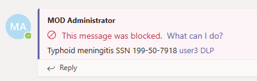
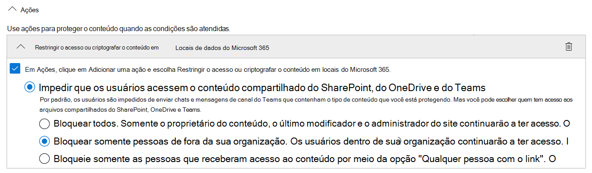
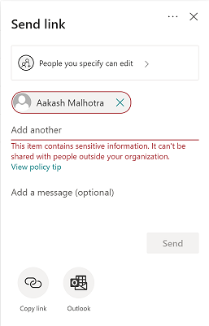

# Prevenção contra perda de dados e Microsoft TeamsData loss prevention and Microsoft Teams

> [!NOTE]
> Os recursos de prevenção contra perda de dados foram adicionados recentemente às mensagens de chat e canal do Microsoft Teams para usuários licenciados para Office 365 E5/A5, Microsoft 365 E5/A5, Proteção de Informações e Governança do Microsoft 365 ou Conformidade Avançada do Office 365.Data loss prevention capabilities were recently added to Microsoft Teams chat and channel messages for users licensed for Office 365 E5/A5, Microsoft 365 E5/A5, Microsoft 365 Information Protection and Governance or Office 365 Advanced Compliance. O Office 365 e o Microsoft 365 E3 incluem proteção DLP para SharePoint Online, OneDrive e Exchange Online.Office 365 and Microsoft 365 E3 include DLP protection for SharePoint Online, OneDrive, and Exchange Online. Isso também inclui arquivos compartilhados pelo Teams porque o Teams usa o SharePoint Online e o OneDrive para compartilhar arquivos.This also includes files that are shared through Teams because Teams uses SharePoint Online and OneDrive to share files.
O suporte para proteção DLP no Teams Chat requer E5.Support for DLP protection in Teams Chat requires E5.
Para saber mais sobre os requisitos de licenciamento, confira [Diretrizes do Licenciamento de Serviços no Nível de Locatário do Microsoft 365](https://docs.microsoft.com/office365/servicedescriptions/microsoft-365-service-descriptions/microsoft-365-tenantlevel-services-licensing-guidance).To learn more about licensing requirements, see [Microsoft 365 Tenant-Level Services Licensing Guidance](https://docs.microsoft.com/office365/servicedescriptions/microsoft-365-service-descriptions/microsoft-365-tenantlevel-services-licensing-guidance).

## Visão geral da DLP para o Microsoft TeamsOverview of DLP for Microsoft Teams

Recentemente, [os recursos de](data-loss-prevention-policies.md) prevenção contra perda de dados (DLP) foram estendidos para incluir mensagens de chat e canal do Microsoft Teams, incluindo mensagens de canal **privado**.Recently, [data loss prevention](data-loss-prevention-policies.md) (DLP) capabilities were extended to include Microsoft Teams chat and channel messages, **including private channel messages**.

Se sua organização tiver DLP, agora você pode definir políticas que impedem que as pessoas compartilhem informações confidenciais em um canal do Microsoft Teams ou sessão de chat.If your organization has DLP, you can now define policies that prevent people from sharing sensitive information in a Microsoft Teams channel or chat session. Aqui estão alguns exemplos de como essa proteção funciona:Here are some examples of how this protection works:

- **Exemplo 1: Protegendo informações confidenciais em mensagens**.**Example 1: Protecting sensitive information in messages**. Suponha que alguém tenta compartilhar informações confidenciais em um chat ou canal do Teams com convidados (usuários externos).Suppose that someone attempts to share sensitive information in a Teams chat or channel with guests (external users). Se você tiver uma política de DLP definida para evitar isso, as mensagens com informações confidenciais enviadas a usuários externos serão excluídas.If you have a DLP policy defined to prevent this, messages with sensitive information that are sent to external users are deleted. Isso acontece automaticamente e em segundos, de acordo com a configuração da política de DLP.This happens automatically, and within seconds, according to how your DLP policy is configured.

    > [!NOTE]
    > A DLP do Microsoft Teams bloqueia conteúdos confidenciais quando compartilhados com usuários do Microsoft Teams que têm:DLP for Microsoft Teams blocks sensitive content when shared with Microsoft Teams users who have: - [acesso de convidados](https://docs.microsoft.com/MicrosoftTeams/guest-access) em equipes e canais; ou- [guest access](https://docs.microsoft.com/MicrosoftTeams/guest-access) in teams and channels; or - [acesso externo](https://docs.microsoft.com/MicrosoftTeams/manage-external-access) em reuniões e sessões de chat.- [external access](https://docs.microsoft.com/MicrosoftTeams/manage-external-access) in meetings and chat sessions. 
A DLP para sessões de chat externo só funcionará se o remetente e o receptor estão no modo Teams Only e usando a federação nativa [do Microsoft Teams.](https://docs.microsoft.com/microsoftteams/manage-external-access)DLP for external chat sessions will only work if both the sender and the receiver are in Teams Only mode and using [Microsoft Teams native federation](https://docs.microsoft.com/microsoftteams/manage-external-access). A DLP para o Teams não bloqueia mensagens [em interop](https://docs.microsoft.com/microsoftteams/teams-and-skypeforbusiness-coexistence-and-interoperability#interoperability-of-teams-and-skype-for-business) com o Skype for Business ou sessões de chat federadas não nativas.DLP for Teams does not block messages in [interop](https://docs.microsoft.com/microsoftteams/teams-and-skypeforbusiness-coexistence-and-interoperability#interoperability-of-teams-and-skype-for-business) with Skype for Business or non-native federated chat sessions.

- **Exemplo 2: Protegendo informações confidenciais em documentos**.**Example 2: Protecting sensitive information in documents**. Suponha que alguém tenta compartilhar um documento com convidados em um canal ou chat do Microsoft Teams e o documento contém informações confidenciais.Suppose that someone attempts to share a document with guests in a Microsoft Teams channel or chat, and the document contains sensitive information. Se você tiver uma política de DLP definida para evitar isso, o documento não abrirá para esses usuários.If you have a DLP policy defined to prevent this, the document won't open for those users. Observe que, nesse caso, sua política de DLP deve incluir o SharePoint e o OneDrive para que a proteção seja realizada.Note that in this case, your DLP policy must include SharePoint and OneDrive in order for protection to be in place. (Este é um exemplo de DLP para SharePoint que aparece no Microsoft Teams e, portanto, exige que os usuários sejam licenciados para a DLP do Office 365 (incluído no Office 365 E3), mas não exige que os usuários sejam licenciados para a Conformidade Avançada do Office 365.)(This is an example of DLP for SharePoint that shows up in Microsoft Teams, and therefore requires that users are licensed for Office 365 DLP (included in Office 365 E3), but does not require users to be licensed for Office 365 Advanced Compliance.)

## Dicas de política ajudam a instruir os usuáriosPolicy tips help educate users

Semelhante a como a DLP funciona no [Exchange, Outlook, Outlook na Web,](data-loss-prevention-policies.md#policy-evaluation-in-exchange-online-outlook-and-outlook-on-the-web)Sites do [SharePoint Online, OneDrive for Business](data-loss-prevention-policies.md#policy-evaluation-in-onedrive-for-business-and-sharepoint-online-sites)e clientes da área de trabalho do [Office,](data-loss-prevention-policies.md#policy-evaluation-in-the-office-desktop-programs)as dicas de política aparecem quando uma ação entra em conflito com uma política de DLP.Similar to how DLP works in [Exchange, Outlook, Outlook on the web](data-loss-prevention-policies.md#policy-evaluation-in-exchange-online-outlook-and-outlook-on-the-web), [SharePoint Online, OneDrive for Business sites](data-loss-prevention-policies.md#policy-evaluation-in-onedrive-for-business-and-sharepoint-online-sites), and [Office desktop clients](data-loss-prevention-policies.md#policy-evaluation-in-the-office-desktop-programs), policy tips appear when an action conflicts with a DLP policy. Veja um exemplo de uma dica de política:Here's an example of a policy tip:

Nesse caso, o remetente tentou compartilhar um número de segurança social em um canal do Microsoft Teams.In this case, the sender attempted to share a social security number in a Microsoft Teams channel. O **link O que posso fazer?** abre uma caixa de diálogo que fornece opções para o remetente resolver o problema.The **What can I do?** link opens a dialog box that provides options for the sender to resolve the issue. Observe que, nesse caso, o remetente pode optar por substituir a política ou notificar um administrador para revisá-la e resolvê-la.Notice that in this case, the sender can opt to override the policy, or notify an admin to review and resolve it.

Em sua organização, você pode optar por permitir que os usuários substituam uma política de DLP.In your organization, you can choose to allow users to override a DLP policy. E, ao configurar suas políticas de DLP, você pode usar as dicas de política padrão ou [personalizar dicas](#to-customize-policy-tips) de política para sua organização.And, when you configure your DLP policies, you can use the default policy tips, or [customize policy tips](#to-customize-policy-tips) for your organization.

Retornando ao nosso exemplo, onde um remetente compartilhou um número de segurança social em um canal do Teams, veja o que o destinatário viu:Returning to our example, where a sender shared a social security number in a Teams channel, here's what the recipient saw:

O **link O que é isso?** abre um [artigo](data-loss-prevention-policies.md) sobre políticas DLP, que ajuda a explicar por que a mensagem foi bloqueada.The **What's this?** link opens an [article](data-loss-prevention-policies.md) about DLP policies, which helps explain why the message was blocked.

### Para personalizar dicas de políticaTo customize policy tips

Para executar essa tarefa, você deve ter uma função que tenha permissões para editar políticas de DLP.To perform this task, you must be assigned a role that has permissions to edit DLP policies. Para saber mais, confira [permissões](data-loss-prevention-policies.md#permissions).To learn more, see [Permissions](data-loss-prevention-policies.md#permissions).

1. Vá para o Centro de Conformidade & segurança ( [https://protection.office.com](https://protection.office.com) ) e entre.Go to the Security & Compliance Center ([https://protection.office.com](https://protection.office.com)) and sign in.

2. Escolha **Política de prevenção contra perda de**  >  **dados**.Choose **Data loss prevention** > **Policy**.

3. Selecione uma política e, ao lado de **Configurações de Política,** escolha **Editar**.Select a policy, and next to **Policy settings**, choose **Edit**.

4. Crie uma nova regra ou edite uma regra existente para a política.Either create a new rule, or edit an existing rule for the policy.  

5. Na guia **Notificações do usuário,** selecione **Personalizar o texto de email** e/ou Personalizar as opções de texto da dica **de** política.On the **User notifications** tab, select **Customize the email text** and/or **Customize the policy tip text** options.    

6. Especifique o texto que você deseja usar para notificações por email e/ou dicas de política e escolha **Salvar**.Specify the text you want to use for email notifications and/or policy tips, and then choose **Save**.

7. Na guia **Configurações de Política,** escolha **Salvar**.On the **Policy settings** tab, choose **Save**.

Permita aproximadamente uma hora para que suas alterações funcionem por meio do data center e sincronizem com contas de usuário.Allow approximately one hour for your changes to work their way through your data center and sync to user accounts.
 <!-- why are these syncing to user accounts? -->

## Adicionar o Microsoft Teams como local às políticas de DLP existentesAdd Microsoft Teams as a location to existing DLP policies

Para executar essa tarefa, você deve ter uma função que tenha permissões para editar políticas de DLP.To perform this task, you must be assigned a role that has permissions to edit DLP policies. Para saber mais, confira [permissões](data-loss-prevention-policies.md#permissions).To learn more, see [Permissions](data-loss-prevention-policies.md#permissions).

1. Vá para o Centro de Conformidade & segurança ( [https://protection.office.com](https://protection.office.com) ) e entre.Go to the Security & Compliance Center ([https://protection.office.com](https://protection.office.com)) and sign in.

2. Escolha **Política de prevenção contra perda de**  >  **dados**.Choose **Data loss prevention** > **Policy**.

3. Selecione uma política e veja os valores em **Locais.**Select a policy, and look at the values under **Locations**. Se você vir mensagens **de chat e canal do Teams,** você está definido.If you see **Teams chat and channel messages**, you're all set. Se não, clique em **Editar**.If you don't, click **Edit**.  

4. Na coluna **Status,** a política é a ativas para mensagens de chat e **canal do Teams.**In the **Status** column, turn the policy on for **Teams chat and channel messages**.  

5. Na guia **Escolher locais,** mantenha a configuração padrão de todas as contas ou selecione **Deixe-me escolher locais específicos**.On the **Choose locations** tab, keep the default setting of all accounts, or select **Let me choose specific locations**. É possível especificar:You can specify:
    1. até 1000 contas individuais para incluir ou excluirup to 1000 individual accounts to include or exclude
    1. listas de distribuição e grupos de segurança para incluir ou excluir.distribution lists and security groups to include or exclude. **Esse é um recurso de visualização pública.****This is a public preview feature.**
    <!-- 1. the shared mailbox of a shared channel. **This is a public preview feature.**--> 
    
6. Depois clique em **Próximo**.Then choose **Next**.

6. Clique em **Salvar**.Click **Save**.

Permita aproximadamente uma hora para que suas alterações funcionem por meio do data center e sincronizem com contas de usuário.Allow approximately one hour for your changes to work their way through your data center and sync to user accounts.
<!-- again, why user accounts? -->

## Definir uma nova política de DLP para o Microsoft TeamsDefine a new DLP policy for Microsoft Teams

Para executar essa tarefa, você deve ter uma função que tenha permissões para editar políticas de DLP.To perform this task, you must be assigned a role that has permissions to edit DLP policies. Para saber mais, confira [permissões](data-loss-prevention-policies.md#permissions).To learn more, see [Permissions](data-loss-prevention-policies.md#permissions).

1. Vá para o Centro de Conformidade & segurança ( [https://protection.office.com](https://protection.office.com) ) e entre.Go to the Security & Compliance Center ([https://protection.office.com](https://protection.office.com)) and sign in.

2. Escolha **Política de prevenção contra perda**  >  **de** dados + Criar uma  >  **política**.Choose **Data loss prevention** > **Policy** > **+ Create a policy**.

3. Escolha um [modelo](data-loss-prevention-policies.md#dlp-policy-templates)e escolha **Next**.Choose a [template](data-loss-prevention-policies.md#dlp-policy-templates), and then choose **Next**. No nosso exemplo, escolhemos o modelo de Dados de Informações de Identificação Pessoal dos EUA.In our example, we chose the U.S. Personally Identifiable Information Data template.  

4. Na guia **Nomear sua política,** especifique um nome e uma descrição para a política e escolha **Next**.On the **Name your policy** tab, specify a name and description for the policy, and then choose **Next**.

5. Na guia **Escolher locais,** mantenha a configuração padrão de todas as contas ou selecione **Deixe-me escolher locais específicos**.On the **Choose locations** tab, keep the default setting of all accounts, or select **Let me choose specific locations**. É possível especificar:You can specify:
    1. até 1000 contas individuais para incluir ou excluirup to 1000 individual accounts to include or exclude
    1. listas de distribuição e grupos de segurança para incluir ou excluir.distribution lists and security groups to include or exclude. **Esse é um recurso de visualização pública.****This is a public preview feature.**
    <!-- 1. the shared mailbox of a shared channel. **This is a public preview feature.**-->  

> [!NOTE]
> Se você quiser garantir que documentos que contenham informações confidenciais não sejam compartilhados de forma inadequada no Teams, certifique-se de que sites do **SharePoint** e contas do **OneDrive** estão ativas, juntamente com mensagens de chat e canal do **Teams.**If you want to make sure documents that contain sensitive information are not shared inappropriately in Teams, make sure **SharePoint sites** and **OneDrive accounts** are turned on, along with **Teams chat and channel messages**.

6. Na guia **Configurações de** Política, em Personalizar o tipo de conteúdo que você deseja **proteger,** mantenha as configurações simples padrão ou escolha Usar configurações **avançadas** e escolha **Avançar**.On the **Policy settings** tab, under **Customize the type of content you want to protect**, keep the default simple settings, or choose **Use advanced settings**, and then choose **Next**. Se você escolher configurações avançadas, poderá criar ou editar regras para sua política.If you choose advanced settings, you can create or edit rules for your policy. (Para obter ajuda com isso, consulte [Configurações simples versus configurações avançadas](data-loss-prevention-policies.md#simple-settings-vs-advanced-settings).)(To get help with this, see [Simple settings vs. advanced settings](data-loss-prevention-policies.md#simple-settings-vs-advanced-settings).)

7.  Na guia **Configurações de** Política, em O que você deseja fazer se detectarmos informações **confidenciais?**, revise as configurações.On the **Policy settings** tab, under **What do you want to do if we detect sensitive info?**, review the settings. (Aqui é onde você pode optar por manter dicas de política padrão e [notificações de email](use-notifications-and-policy-tips.md)ou personalizá-las.)(Here's where you can choose to keep default [policy tips and email notifications](use-notifications-and-policy-tips.md), or customize them.)  Quando terminar de revisar ou editar configurações, escolha **Next**.When you're finished reviewing or editing settings, choose **Next**.

8. Na  guia Configurações de Política, em Deseja ativar a política ou testar as coisas **primeiro?**, escolha se deseja ativar a [política,](data-loss-prevention-policies.md#roll-out-dlp-policies-gradually-with-test-mode)testá-la primeiro ou mantê-la desligada por enquanto e, em seguida, escolher **Next**.On the **Policy settings** tab, under **Do you want to turn on the policy or test things out first?**, choose whether to turn the policy on, [test it first](data-loss-prevention-policies.md#roll-out-dlp-policies-gradually-with-test-mode), or keep it turned off for now, and then choose **Next**.  

9. Na guia **Revisar suas configurações,** revise as configurações da nova política.On the **Review your settings** tab, review the settings for your new policy. Escolha **Editar** para fazer alterações.Choose **Edit** to make changes. Quando terminar, escolha **Criar**.When you're finished, choose **Create**.

Permita aproximadamente uma hora para que sua nova política funcione por meio do data center e sincronize com contas de usuário.Allow approximately one hour for your new policy to work its way through your data center and sync to user accounts.

## Impedir o acesso externo a documentos confidenciaisPrevent external access to sensitive documents

Para garantir que documentos do SharePoint que contenham informações confidenciais não podem ser acessados por convidados externos do SharePoint ou do Teams por padrão, selecione o seguinte:To ensure that SharePoint documents that contain sensitive information cannot be accessed by external guests either from SharePoint or Teams by default, select the following:

- Você pode garantir que os documentos sejam protegidos até que a DLP os verifique e os marque como seguros para compartilhar marcando novos arquivos como confidenciais [por padrão](https://docs.microsoft.com/sharepoint/sensitive-by-default)You can ensure that documents are protected until DLP scans and marks them as safe to share by [marking new files as sensitive by default](https://docs.microsoft.com/sharepoint/sensitive-by-default)
- Estrutura de política de DLP recomendadaRecommended DLP policy structure
    - **Condições****Conditions**
        - O conteúdo contém qualquer um desses tipos de informações confidenciais: [Selecione tudo o que se aplica]Content contains any of these sensitive information types: [Select all that applies]
        - O conteúdo é compartilhado do Microsoft 365 com pessoas de fora da minha organizaçãoContent is shared from Microsoft 365 with people outside my organization
          

    - **Ações****Actions**
        - Restringir o acesso ao conteúdo para usuários externosRestrict access to the content for external users
        - Notificar os usuários com dicas de política e emailNotify users with email and policy tips
        - Enviar relatórios de incidentes ao AdministradorSend incident reports to the Administrator    
          

Política de DLP em ação ao tentar compartilhar um documento no SharePoint que contém informações confidenciais com um convidado externo:DLP policy in action when attempting to share a document in SharePoint that contains sensitive information with an external guest:
  

Política de DLP em ação quando o convidado tenta abrir um documento no Teams com bloqueio externo:DLP policy in action when guest attempts to open a document in Teams with block external:
  

## Artigos relacionadosRelated articles

[Criar, testar e ajustar uma política DLPCreate, test, and tune a DLP policy](create-test-tune-dlp-policy.md)

[Enviar notificações por email e mostrar dicas para políticas de DLPSend email notifications and show policy tips for DLP policies](use-notifications-and-policy-tips.md)
