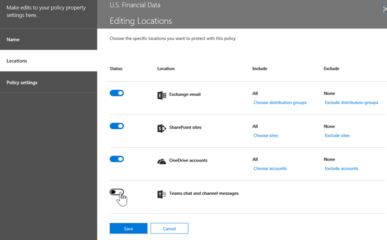

# Prevenção contra perda de dados e Microsoft Teams

Se sua organização tiver DLP (prevenção contra perda de dados), você poderá definir políticas que impedem que as pessoas compartilhem informações confidenciais em um canal Microsoft Teams ou sessão de chat. Aqui estão alguns exemplos de como essa proteção funciona:

- **Exemplo 1: Protegendo informações confidenciais em mensagens**. Suponha que alguém tenta compartilhar informações confidenciais em um Teams ou canal com convidados (usuários externos). Se você tiver uma política de DLP definida para evitar isso, as mensagens com informações confidenciais enviadas a usuários externos serão excluídas. Isso acontece automaticamente e em segundos, de acordo com a configuração da política de DLP.

    > [!NOTE]
    > A DLP para Microsoft Teams o conteúdo confidenciais quando compartilhado com Microsoft Teams usuários que têm: - [acesso de convidados](/MicrosoftTeams/guest-access) em equipes e canais; ou - [acesso externo](/MicrosoftTeams/manage-external-access) em reuniões e sessões de chat. 
A DLP para sessões de chat externo só funcionará se o remetente e o receptor estão no modo Somente Teams e usando Microsoft Teams [federação nativa](/microsoftteams/manage-external-access). A DLP para Teams não bloqueia mensagens em [interop](/microsoftteams/teams-and-skypeforbusiness-coexistence-and-interoperability#interoperability-of-teams-and-skype-for-business) com Skype for Business ou sessões de chat federadas não nativas.

- **Exemplo 2: Protegendo informações confidenciais em documentos**. Suponha que alguém tenta compartilhar um documento com convidados em um canal Microsoft Teams ou chat, e o documento contém informações confidenciais. Se você tiver uma política de DLP definida para evitar isso, o documento não abrirá para esses usuários. Sua política DLP deve incluir o SharePoint e o OneDrive para que a proteção seja colocada em ação. Este é um exemplo de DLP para SharePoint que aparece no Microsoft Teams e, portanto, exige que os usuários sejam licenciados para Office 365 DLP (incluído no Office 365 E3), mas não exige que os usuários sejam licenciados para Conformidade Avançada do Office 365.)

## Licenciamento de DLP para Microsoft Teams

[Os recursos de prevenção](dlp-learn-about-dlp.md) contra perda de dados foram estendidos para incluir Microsoft Teams mensagens de chat e canal, **incluindo mensagens de canal privado** para:

- Office 365 E5/A5
- Microsoft 365 E5/A5
- Governança e Proteção de Informações do Microsoft 365
- Conformidade Avançada do Office 365

Office 365 e Microsoft 365 E3 incluem proteção DLP para SharePoint Online, OneDrive e Exchange Online. Isso também inclui arquivos compartilhados por meio Teams porque Teams usa SharePoint Online e OneDrive para compartilhar arquivos.

O suporte para a proteção DLP no Teams Chat requer E5.

Para saber mais sobre os requisitos de licenciamento, confira [Diretrizes do Licenciamento de Serviços no Nível de Locatário do Microsoft 365](https://docs.microsoft.com/office365/servicedescriptions/microsoft-365-service-descriptions/microsoft-365-tenantlevel-services-licensing-guidance/microsoft-365-security-compliance-licensing-guidance).

> [!IMPORTANT]
> A DLP aplica-se apenas às mensagens reais no thread de chat ou canal. As notificações de atividade - que incluem uma visualização de mensagem  curta e aparecem com base nas configurações de notificação de um usuário - não são incluídas no Teams DLP. Quaisquer informações confidenciais presentes na parte da mensagem exibida na visualização permanecerão visíveis na notificação mesmo depois que a política DLP tiver sido aplicada e removida informações confidenciais da própria mensagem.

## Escopo da proteção DLP

A proteção DLP é aplicada de forma diferente Teams entidades.

|Contas de usuário/grupos/lista  |Teams Entity |Proteção DLP disponível|
|---------|---------|---------|
|contas de usuário individuais     |Chats 1:1/n         |sim         |
|     |chats gerais         |não         |
|     |canais compartilhados         |não         |
|     |canais privados         |sim         |
|grupos de segurança/listas de distribuição  | Chats 1:1/n         |sim         |
|     |chats gerais         |não         |
|     |canais compartilhados         |não      |
|     |canais privados         |sim        |
|Microsoft 365 grupo    |Chats 1:1/n          |não         |
|     |chats gerais          |sim        |
|     |canais compartilhados|sim |
|     |canais privados|não| 

## Dicas de política ajudam a instruir os usuários

Semelhante à forma como a DLP funciona no [Exchange, Outlook, Outlook](data-loss-prevention-policies.md#policy-evaluation-in-exchange-online-outlook-and-outlook-on-the-web)na Web , [SharePoint Online, sites OneDrive for Business e](data-loss-prevention-policies.md#policy-evaluation-in-onedrive-for-business-and-sharepoint-online-sites)clientes de área de trabalho do [Office](data-loss-prevention-policies.md#policy-evaluation-in-the-office-desktop-programs), as dicas de política aparecem quando uma ação dispara com uma política DLP. Veja um exemplo de uma dica de política:

Aqui, o remetente tentou compartilhar um número de segurança social em um Microsoft Teams canal. O **link O que posso fazer?** abre uma caixa de diálogo que fornece opções para o remetente resolver o problema. Observe que, o remetente pode optar por substituir a política ou notificar um administrador para revisá-la e resolvê-la.

Em sua organização, você pode optar por permitir que os usuários substituam uma política de DLP. Ao configurar suas políticas de DLP, você pode usar as dicas de política padrão ou [personalizar dicas de política](#to-customize-policy-tips) para sua organização.

Retornando ao nosso exemplo, onde um remetente compartilhou um número de seguro social em um canal de Teams, veja o que o destinatário viu:

> [!div class="mx-imgBorder"]
> 

### Dicas para personalizar a política

Para executar essa tarefa, você deverá receber uma função que tenha permissões para editar as políticas DLP. Para saber mais, confira [permissões](data-loss-prevention-policies.md#permissions).

1. Vá para o Centro de Conformidade ( [https://compliance.microsoft.com](https://compliance.microsoft.com) ) e entre.

2. Clique em **Prevenção contra perda de dados** > **Política**.

3. Selecione uma política e, ao lado de **Configurações de Política,** escolha **Editar**.

4. Crie uma nova regra ou edite uma regra existente para a política.

    > [!div class="mx-imgBorder"]
    > 

5. Na guia **Notificações do usuário,** selecione **Personalizar o texto de email** e/ou Personalizar as opções de texto da dica **de** política.

    > [!div class="mx-imgBorder"]
    >    

6. Especifique o texto que você deseja usar para notificações por email e/ou dicas de política e escolha **Salvar**.

7. Na guia **Configurações de Política,** escolha **Salvar**.

Permita aproximadamente uma hora para que suas alterações funcionem por meio do data center e sincronizem com contas de usuário.
 <!-- why are these syncing to user accounts? -->

## Adicionar o Microsoft Teams como um local para as políticas de DLP existentes

Para executar essa tarefa, você deverá receber uma função que tenha permissões para editar as políticas DLP. Para saber mais, confira [permissões](data-loss-prevention-policies.md#permissions).

1. Vá para o Centro de Conformidade ( [https://compliance.microsoft.com](https://compliance.microsoft.com) ) e entre.

2. Clique em **Prevenção contra perda de dados** > **Política**.

3. Selecione uma política e veja os valores em **Locais.** Se você vir **Teams mensagens de chat e canal**, você está definido. Se não, clique em **Editar**.

    > [!div class="mx-imgBorder"]
    > 

4. Na coluna **Status,** a política é Teams mensagens de canal e **chat.**

    > [!div class="mx-imgBorder"]
    > 

5. Na guia **Escolher locais,** mantenha a configuração padrão de todas as contas ou selecione **Deixe-me escolher locais específicos**. É possível especificar:

    1. até 1000 contas individuais para incluir ou excluir
    1. listas de distribuição e grupos de segurança para incluir ou excluir. 
    <!-- 1. the shared mailbox of a shared channel. **This is a public preview feature.**--> 
    
6. Depois clique em **Próximo**.

7. Clique em **Salvar**.

Permita aproximadamente uma hora para que suas alterações funcionem por meio do data center e sincronizem com contas de usuário.
<!-- again, why user accounts? -->

## Definir uma nova política DLP para o Microsoft Teams

Para executar essa tarefa, você deverá receber uma função que tenha permissões para editar as políticas DLP. Para saber mais, confira [permissões](data-loss-prevention-policies.md#permissions).

1. Vá para o Centro de Conformidade ( [https://compliance.microsoft.com](https://compliance.microsoft.com) ) e entre.

2. Escolha **Prevenção contra perda de dados** > **Política** > **+ Criar uma política**.

3. Escolha um [modelo](data-loss-prevention-policies.md#dlp-policy-templates)e escolha **Next**.

    No nosso exemplo, escolhemos o modelo de Dados de Informações de Identificação Pessoal dos EUA.

    > [!div class="mx-imgBorder"]
    >  

4. Na guia **Nomear sua política,** especifique um nome e uma descrição para a política e escolha **Next**.

5. Na guia **Escolher locais,** mantenha a configuração padrão de todas as contas ou selecione **Deixe-me escolher locais específicos**. É possível especificar:

    1. até 1000 contas individuais para incluir ou excluir
    1. listas de distribuição e grupos de segurança para incluir ou excluir. **Esse é um recurso de visualização pública.**
    <!-- 1. the shared mailbox of a shared channel. **This is a public preview feature.**-->  

    

    > [!NOTE]
    > Se você quiser garantir que os documentos que contêm informações confidenciais não sejam compartilhados de forma inadequada no Teams, certifique-se de que os **sites** SharePoint e contas OneDrive **estão** ativas, juntamente com mensagens de chat e canal do Teams **.**

6. Na guia **Configurações de** Política, em Personalizar o tipo de conteúdo que você deseja **proteger,** mantenha as configurações simples padrão ou escolha Usar configurações **avançadas** e escolha **Avançar**. Se você escolher configurações avançadas, poderá criar ou editar regras para sua política. Para obter ajuda com isso, consulte [Configurações simples versus configurações avançadas](data-loss-prevention-policies.md#simple-settings-vs-advanced-settings).

7.  Na guia **Configurações de** Política, em O que você deseja fazer se detectarmos informações **confidenciais?**, revise as configurações. Aqui é onde você pode optar por manter dicas de política padrão e notificações [de email](use-notifications-and-policy-tips.md)ou personalizá-las.

    > [!div class="mx-imgBorder"]
    > 

    Quando terminar de revisar ou editar configurações, escolha **Next**.

8. Na  guia Configurações de Política, em Deseja ativar a política ou testar as coisas **primeiro?**, escolha se deseja ativar a [política,](dlp-overview-plan-for-dlp.md#policy-deployment)testá-la primeiro ou mantê-la desligada por enquanto e, em seguida, escolher **Next**.

    > [!div class="mx-imgBorder"]
    > 

9. Na guia **Revisar suas configurações,** revise as configurações da nova política. Escolha **Editar** para fazer alterações. Quando terminar, escolha **Criar**.

Permita aproximadamente uma hora para que sua nova política funcione por meio do data center e sincronize com contas de usuário.

## Impedir o acesso externo a documentos confidenciais

Para garantir que SharePoint documentos que contenham informações confidenciais não podem ser acessados por convidados externos de SharePoint ou Teams por padrão, selecione o seguinte:

- Você pode garantir que os documentos sejam protegidos até que a DLP os verifique e os marque como seguros para compartilhar marcando novos arquivos como confidenciais [por padrão.](/sharepoint/sensitive-by-default)

- Estrutura de política DLP recomendada

    - **Condições**
        - O conteúdo contém qualquer um desses tipos de informações confidenciais: [Selecione tudo o que se aplica]
        
        - O conteúdo é compartilhado de Microsoft 365 com pessoas de fora da minha organização
        
          > [!div class="mx-imgBorder"]
          > 

    - **Actions**
        - Restringir acesso de usuários externos ao conteúdo
        
        - Notificar usuários com dicas de política e email
        
        - Enviar relatórios de incidentes para o administrador
        
        > [!div class="mx-imgBorder"]
        > 

Política de DLP em ação ao tentar compartilhar um documento em SharePoint que contém informações confidenciais com um convidado externo:

> [!div class="mx-imgBorder"]
> 

Política de DLP em ação quando o convidado tenta abrir um documento em Teams com bloqueio externo:

> [!div class="mx-imgBorder"]
> 

## Artigos relacionados

- [Criar, testar e ajustar uma política DLP](create-test-tune-dlp-policy.md)
- [Enviar notificações por email e mostrar dicas para políticas de DLP](use-notifications-and-policy-tips.md)
