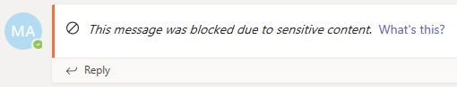

# Prevenção contra perda de dados e Microsoft TeamsData loss prevention and Microsoft Teams

> [!NOTE]
> Os recursos de prevenção de perda de dados foram recentemente adicionados a mensagens de chat e canal Microsoft Teams para usuários licenciados para Office 365 E5/A5, Microsoft 365 E5/A5, Microsoft 365 Proteção e Governança de Informações ou Conformidade Avançada do Office 365.Data loss prevention capabilities were recently added to Microsoft Teams chat and channel messages for users licensed for Office 365 E5/A5, Microsoft 365 E5/A5, Microsoft 365 Information Protection and Governance or Office 365 Advanced Compliance. Office 365 e Microsoft 365 E3 incluem proteção DLP para SharePoint Online, OneDrive e Exchange Online.Office 365 and Microsoft 365 E3 include DLP protection for SharePoint Online, OneDrive, and Exchange Online. Isso também inclui arquivos que são compartilhados através de Teams porque Teams usa SharePoint Online e OneDrive para compartilhar arquivos.This also includes files that are shared through Teams because Teams uses SharePoint Online and OneDrive to share files.
O suporte para proteção DLP no Chat Teams requer E5.Support for DLP protection in Teams Chat requires E5.
Para saber mais sobre os requisitos de licenciamento, confira [Diretrizes do Licenciamento de Serviços no Nível de Locatário do Microsoft 365](/office365/servicedescriptions/microsoft-365-service-descriptions/microsoft-365-tenantlevel-services-licensing-guidance).To learn more about licensing requirements, see [Microsoft 365 Tenant-Level Services Licensing Guidance](/office365/servicedescriptions/microsoft-365-service-descriptions/microsoft-365-tenantlevel-services-licensing-guidance).

## Visão geral da DLP para o Microsoft TeamsOverview of DLP for Microsoft Teams

Recentemente, os recursos de [prevenção de perda de dados](dlp-learn-about-dlp.md) foram estendidos para incluir Microsoft Teams mensagens de chat e canais, incluindo **mensagens de canais privados.**Recently, [data loss prevention](dlp-learn-about-dlp.md) capabilities were extended to include Microsoft Teams chat and channel messages, **including private channel messages**. 

> [!IMPORTANT]
> Atualmente, o DLP se aplica apenas às mensagens reais no segmento de chat ou canal.DLP currently applies only to the actual messages in the chat or channel thread. As notificações de atividade - que incluem uma visualização de mensagem curta e aparecem com base nas configurações de notificação de um usuário - **não** estão incluídas em Teams DLP neste momento.Activity notifications -- which include a short message preview and appear based on a user's notification settings -- are **not** included in Teams DLP at this time. Quaisquer informações confidenciais presentes na parte da mensagem que aparece na visualização permanecerão visíveis na notificação mesmo após a aplicação da política DLP e removida informações confidenciais da própria mensagem.Any sensitive information present in the part of the message that appears in the preview will remain visible in the notification even after the DLP policy has been applied and removed sensitive information the message itself.

Se sua organização tiver DLP, agora você pode definir políticas que impeçam as pessoas de compartilhar informações confidenciais em um canal de Microsoft Teams ou sessão de bate-papo.If your organization has DLP, you can now define policies that prevent people from sharing sensitive information in a Microsoft Teams channel or chat session. Aqui estão alguns exemplos de como essa proteção funciona:Here are some examples of how this protection works:

- **Exemplo 1: Proteção de informações confidenciais em mensagens**.**Example 1: Protecting sensitive information in messages**. Suponha que alguém tente compartilhar informações confidenciais em um chat ou canal Teams com convidados (usuários externos).Suppose that someone attempts to share sensitive information in a Teams chat or channel with guests (external users). Se você tiver uma política DLP definida para evitar isso, mensagens com informações confidenciais enviadas a usuários externos serão excluídas.If you have a DLP policy defined to prevent this, messages with sensitive information that are sent to external users are deleted. Isso acontece automaticamente e em segundos, de acordo com a forma como sua política de DLP é configurada.This happens automatically, and within seconds, according to how your DLP policy is configured.

    > [!NOTE]
    > O DLP for Microsoft Teams bloqueia conteúdo sensível quando compartilhado com Microsoft Teams usuários que têm:DLP for Microsoft Teams blocks sensitive content when shared with Microsoft Teams users who have: - [acesso de hóspedes](/MicrosoftTeams/guest-access) em equipes e canais; ou- [guest access](/MicrosoftTeams/guest-access) in teams and channels; or - [acesso externo](/MicrosoftTeams/manage-external-access) em reuniões e sessões de bate-papo.- [external access](/MicrosoftTeams/manage-external-access) in meetings and chat sessions. 
O DLP para sessões de bate-papo externo só funcionará se o remetente e o receptor estiverem no modo somente Teams e usando [Microsoft Teams federação nativa](/microsoftteams/manage-external-access).DLP for external chat sessions will only work if both the sender and the receiver are in Teams Only mode and using [Microsoft Teams native federation](/microsoftteams/manage-external-access). O DLP para Teams não bloqueia mensagens em [interop](/microsoftteams/teams-and-skypeforbusiness-coexistence-and-interoperability#interoperability-of-teams-and-skype-for-business) com sessões de bate-papo federadas Skype for Business ou não nativas.DLP for Teams does not block messages in [interop](/microsoftteams/teams-and-skypeforbusiness-coexistence-and-interoperability#interoperability-of-teams-and-skype-for-business) with Skype for Business or non-native federated chat sessions.

- **Exemplo 2: Proteção de informações confidenciais em documentos**.**Example 2: Protecting sensitive information in documents**. Suponha que alguém tente compartilhar um documento com convidados em um canal ou chat Microsoft Teams, e o documento contém informações confidenciais.Suppose that someone attempts to share a document with guests in a Microsoft Teams channel or chat, and the document contains sensitive information. Se você tiver uma política DLP definida para evitar isso, o documento não será aberto para esses usuários.If you have a DLP policy defined to prevent this, the document won't open for those users. Observe que, neste caso, sua política de DLP deve incluir SharePoint e OneDrive para que a proteção esteja em vigor.Note that in this case, your DLP policy must include SharePoint and OneDrive in order for protection to be in place. (Este é um exemplo de DLP para SharePoint que aparece em Microsoft Teams e, portanto, exige que os usuários sejam licenciados para Office 365 DLP (incluído em Office 365 E3), mas não exige que os usuários sejam licenciados por Conformidade Avançada do Office 365.)(This is an example of DLP for SharePoint that shows up in Microsoft Teams, and therefore requires that users are licensed for Office 365 DLP (included in Office 365 E3), but does not require users to be licensed for Office 365 Advanced Compliance.)

## Dicas de políticas ajudam a educar os usuáriosPolicy tips help educate users

Semelhante à forma como o DLP funciona em [Exchange, Outlook, Outlook na web](data-loss-prevention-policies.md#policy-evaluation-in-exchange-online-outlook-and-outlook-on-the-web), [SharePoint Online, sites de OneDrive for Business](data-loss-prevention-policies.md#policy-evaluation-in-onedrive-for-business-and-sharepoint-online-sites)e Office [clientes de desktop](data-loss-prevention-policies.md#policy-evaluation-in-the-office-desktop-programs), as dicas de políticas aparecem quando uma ação entra em conflito com uma política de DLP.Similar to how DLP works in [Exchange, Outlook, Outlook on the web](data-loss-prevention-policies.md#policy-evaluation-in-exchange-online-outlook-and-outlook-on-the-web), [SharePoint Online, OneDrive for Business sites](data-loss-prevention-policies.md#policy-evaluation-in-onedrive-for-business-and-sharepoint-online-sites), and [Office desktop clients](data-loss-prevention-policies.md#policy-evaluation-in-the-office-desktop-programs), policy tips appear when an action conflicts with a DLP policy. Aqui está um exemplo de uma dica de política:Here's an example of a policy tip:

Neste caso, o remetente tentou compartilhar um número de segurança social em um canal Microsoft Teams.In this case, the sender attempted to share a social security number in a Microsoft Teams channel. O **link O que posso fazer?** abre uma caixa de diálogo que fornece opções para o remetente resolver o problema.The **What can I do?** link opens a dialog box that provides options for the sender to resolve the issue. Observe que, neste caso, o remetente pode optar por substituir a apólice ou notificar um administrador para revisá-la e resolvê-la.Notice that in this case, the sender can opt to override the policy, or notify an admin to review and resolve it.

Em sua organização, você pode optar por permitir que os usuários substituam uma política DLP.In your organization, you can choose to allow users to override a DLP policy. E, ao configurar suas políticas DLP, você pode usar as dicas de política padrão ou [personalizar dicas de política](#to-customize-policy-tips) para sua organização.And, when you configure your DLP policies, you can use the default policy tips, or [customize policy tips](#to-customize-policy-tips) for your organization.

Voltando ao nosso exemplo, onde um remetente compartilhou um número de segurança social em um canal de Teams, aqui está o que o destinatário viu:Returning to our example, where a sender shared a social security number in a Teams channel, here's what the recipient saw:

> [!div class="mx-imgBorder"]
> 

### Dicas para personalizar a políticaTo customize policy tips

Para executar essa tarefa, você deverá receber uma função que tenha permissões para editar as políticas DLP.To perform this task, you must be assigned a role that has permissions to edit DLP policies. Para saber mais, confira [permissões](data-loss-prevention-policies.md#permissions).To learn more, see [Permissions](data-loss-prevention-policies.md#permissions).

1. Vá ao Centro de Conformidade & de Segurança [https://protection.office.com](https://protection.office.com) e faça login.Go to the Security & Compliance Center ([https://protection.office.com](https://protection.office.com)) and sign in.

2. Clique em **Prevenção contra perda de dados** > **Política**.Choose **Data loss prevention** > **Policy**.

3. Selecione uma política e, ao lado **das configurações de política,** escolha **Editar**.Select a policy, and next to **Policy settings**, choose **Edit**.

4. Crie uma nova regra ou edite uma regra existente para a política.Either create a new rule, or edit an existing rule for the policy.

    > [!div class="mx-imgBorder"]
    > 

5. Na guia **Notificações do Usuário,** selecione **Personalizar o texto de e-mail** e/ou Personalizar as opções **de texto de ponta de política.**On the **User notifications** tab, select **Customize the email text** and/or **Customize the policy tip text** options.

    > [!div class="mx-imgBorder"]
    >    

6. Especifique o texto que deseja usar para notificações de e-mail e/ou dicas de política e, em seguida, escolha **Salvar**.Specify the text you want to use for email notifications and/or policy tips, and then choose **Save**.

7. Na guia **Configurações de políticas,** escolha **Salvar**.On the **Policy settings** tab, choose **Save**.

Permita aproximadamente uma hora para que suas alterações funcionem através do data center e sincronizem com as contas de usuários.Allow approximately one hour for your changes to work their way through your data center and sync to user accounts.
 <!-- why are these syncing to user accounts? -->

## Adicionar o Microsoft Teams como um local para as políticas de DLP existentesAdd Microsoft Teams as a location to existing DLP policies

Para executar essa tarefa, você deverá receber uma função que tenha permissões para editar as políticas DLP.To perform this task, you must be assigned a role that has permissions to edit DLP policies. Para saber mais, confira [permissões](data-loss-prevention-policies.md#permissions).To learn more, see [Permissions](data-loss-prevention-policies.md#permissions).

1. Vá ao Centro de Conformidade & de Segurança [https://protection.office.com](https://protection.office.com) e faça login.Go to the Security & Compliance Center ([https://protection.office.com](https://protection.office.com)) and sign in.

2. Clique em **Prevenção contra perda de dados** > **Política**.Choose **Data loss prevention** > **Policy**.

3. Selecione uma política e veja os valores em **Locais**.Select a policy, and look at the values under **Locations**. Se você vir **Teams chat e mensagens de canal,** está tudo pronto.If you see **Teams chat and channel messages**, you're all set. Se não o fizer, clique em **Editar**.If you don't, click **Edit**.

    > [!div class="mx-imgBorder"]
    > 

4. Na coluna **Status,** ligue a política para **Teams mensagens de chat e canal**.In the **Status** column, turn the policy on for **Teams chat and channel messages**.

    > [!div class="mx-imgBorder"]
    > 

5. Na guia **Escolher locais,** manter a configuração padrão de todas as contas ou selecionar **Deixe-me escolher locais específicos**.On the **Choose locations** tab, keep the default setting of all accounts, or select **Let me choose specific locations**. É possível especificar:You can specify:

    1. até 1000 contas individuais para incluir ou excluirup to 1000 individual accounts to include or exclude
    1. listas de distribuição e grupos de segurança para incluir ou excluir.distribution lists and security groups to include or exclude. 
    <!-- 1. the shared mailbox of a shared channel. **This is a public preview feature.**--> 
    
6. Depois clique em **Próximo**.Then choose **Next**.

7. Clique em **Salvar**.Click **Save**.

Permita aproximadamente uma hora para que suas alterações funcionem através do data center e sincronizem com as contas de usuários.Allow approximately one hour for your changes to work their way through your data center and sync to user accounts.
<!-- again, why user accounts? -->

## Definir uma nova política DLP para o Microsoft TeamsDefine a new DLP policy for Microsoft Teams

Para executar essa tarefa, você deverá receber uma função que tenha permissões para editar as políticas DLP.To perform this task, you must be assigned a role that has permissions to edit DLP policies. Para saber mais, confira [permissões](data-loss-prevention-policies.md#permissions).To learn more, see [Permissions](data-loss-prevention-policies.md#permissions).

1. Vá ao Centro de Conformidade & de Segurança [https://protection.office.com](https://protection.office.com) e faça login.Go to the Security & Compliance Center ([https://protection.office.com](https://protection.office.com)) and sign in.

2. Escolha **Prevenção contra perda de dados** > **Política** > **+ Criar uma política**.Choose **Data loss prevention** > **Policy** > **+ Create a policy**.

3. Escolha um [modelo](data-loss-prevention-policies.md#dlp-policy-templates)e escolha **o Next**.Choose a [template](data-loss-prevention-policies.md#dlp-policy-templates), and then choose **Next**.

    Em nosso exemplo, escolhemos o modelo de dados de informações pessoalmente identificáveis dos EUA.In our example, we chose the U.S. Personally Identifiable Information Data template.

    > [!div class="mx-imgBorder"]
    >  

4. Na guia **Nomear sua política,** especifique um nome e descrição para a política e, em seguida, escolha **o Próximo**.On the **Name your policy** tab, specify a name and description for the policy, and then choose **Next**.

5. Na guia **Escolher locais,** manter a configuração padrão de todas as contas ou selecionar **Deixe-me escolher locais específicos**.On the **Choose locations** tab, keep the default setting of all accounts, or select **Let me choose specific locations**. É possível especificar:You can specify:

    1. até 1000 contas individuais para incluir ou excluirup to 1000 individual accounts to include or exclude
    1. listas de distribuição e grupos de segurança para incluir ou excluir.distribution lists and security groups to include or exclude. **Este é um recurso de pré-visualização pública.****This is a public preview feature.**
    <!-- 1. the shared mailbox of a shared channel. **This is a public preview feature.**-->  

    

    > [!NOTE]
    > Se você quiser garantir que documentos que contenham informações confidenciais não sejam compartilhados inapropriadamente em Teams, certifique-se **de que SharePoint sites** e contas **OneDrive** sejam ligados, juntamente com **Teams mensagens de chat e canal**.If you want to make sure documents that contain sensitive information are not shared inappropriately in Teams, make sure **SharePoint sites** and **OneDrive accounts** are turned on, along with **Teams chat and channel messages**.

6. Na guia **Configurações De políticas,** em **Personalizar o tipo de conteúdo que deseja proteger,** mantenha as configurações simples padrão ou escolha **Usar configurações avançadas** e, em seguida, escolha **o Próximo**.On the **Policy settings** tab, under **Customize the type of content you want to protect**, keep the default simple settings, or choose **Use advanced settings**, and then choose **Next**. Se você escolher configurações avançadas, você pode criar ou editar regras para sua política.If you choose advanced settings, you can create or edit rules for your policy. (Para obter ajuda com isso, consulte [Configurações simples versus configurações avançadas](data-loss-prevention-policies.md#simple-settings-vs-advanced-settings).)(To get help with this, see [Simple settings vs. advanced settings](data-loss-prevention-policies.md#simple-settings-vs-advanced-settings).)

7.  Na guia **Configurações De políticas,** em **que você deseja fazer se detectarmos informações confidenciais?**On the **Policy settings** tab, under **What do you want to do if we detect sensitive info?**, review the settings. (Aqui é onde você pode optar por manter dicas de política padrão [e notificações de e-mail](use-notifications-and-policy-tips.md), ou personalizá-las.)(Here's where you can choose to keep default [policy tips and email notifications](use-notifications-and-policy-tips.md), or customize them.)

    > [!div class="mx-imgBorder"]
    > 

    Quando terminar de revisar ou editar configurações, escolha **o Next**.When you're finished reviewing or editing settings, choose **Next**.

8. Na guia **Configurações de políticas,** em **Você deseja ativar a política ou testar as coisas primeiro?**, escolha se ativar a política, [testá-la primeiro](dlp-overview-plan-for-dlp.md#policy-deployment)ou mantê-la desligada por enquanto e, em seguida, escolher o **Next**.On the **Policy settings** tab, under **Do you want to turn on the policy or test things out first?**, choose whether to turn the policy on, [test it first](dlp-overview-plan-for-dlp.md#policy-deployment), or keep it turned off for now, and then choose **Next**.

    > [!div class="mx-imgBorder"]
    > 

9. Na guia **Analisar suas configurações,** revise as configurações da sua nova política.On the **Review your settings** tab, review the settings for your new policy. Escolha **Editar** para fazer alterações.Choose **Edit** to make changes. Quando terminar, escolha **Criar**.When you're finished, choose **Create**.

Permita que aproximadamente uma hora para sua nova política funcione através do seu data center e sincronize com as contas de usuários.Allow approximately one hour for your new policy to work its way through your data center and sync to user accounts.

## Impedir o acesso externo a documentos confidenciaisPrevent external access to sensitive documents

Para garantir que SharePoint documentos que contenham informações confidenciais não possam ser acessados por hóspedes externos SharePoint ou Teams por padrão, selecione o seguinte:To ensure that SharePoint documents that contain sensitive information cannot be accessed by external guests either from SharePoint or Teams by default, select the following:

- Você pode garantir que os documentos estejam protegidos até que o DLP os digitaliza e os marque como seguros de compartilhar [marcando novos arquivos como sensíveis por padrão](/sharepoint/sensitive-by-default).You can ensure that documents are protected until DLP scans and marks them as safe to share by [marking new files as sensitive by default](/sharepoint/sensitive-by-default).

- Estrutura de política DLP recomendadaRecommended DLP policy structure

    - **Condições****Conditions**
        - O conteúdo contém qualquer um desses tipos de informações confidenciais: [Selecione tudo o que se aplica]Content contains any of these sensitive information types: [Select all that applies]
        
        - O conteúdo é compartilhado de Microsoft 365 com pessoas de fora da minha organizaçãoContent is shared from Microsoft 365 with people outside my organization
        
          > [!div class="mx-imgBorder"]
          > 

    - **Actions****Actions**
        - Restringir acesso de usuários externos ao conteúdoRestrict access to the content for external users
        
        - Notificar usuários com dicas de política e emailNotify users with email and policy tips
        
        - Enviar relatórios de incidentes para o administradorSend incident reports to the Administrator
        
        > [!div class="mx-imgBorder"]
        > 

Política DLP em ação ao tentar compartilhar um documento em SharePoint que contenha informações confidenciais com um convidado externo:DLP policy in action when attempting to share a document in SharePoint that contains sensitive information with an external guest:

> [!div class="mx-imgBorder"]
> 

Política DLP em ação quando o hóspede tenta abrir um documento em Teams com bloco externo:DLP policy in action when guest attempts to open a document in Teams with block external:

> [!div class="mx-imgBorder"]
> 

## Artigos relacionadosRelated articles

[Criar, testar e ajustar uma política DLPCreate, test, and tune a DLP policy](create-test-tune-dlp-policy.md)

[Enviar notificações por email e mostrar dicas para políticas de DLPSend email notifications and show policy tips for DLP policies](use-notifications-and-policy-tips.md)
