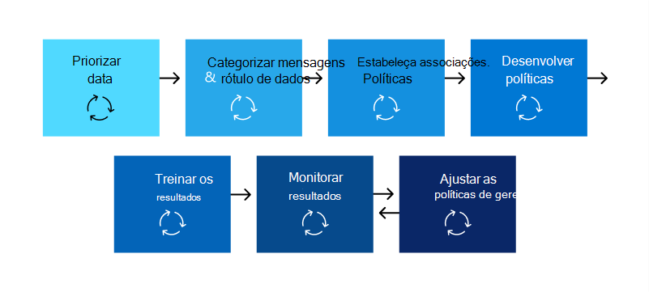

# Plano de prevenção contra perda de dados (DLP)Plan for data loss prevention (DLP)

Todas as organizações planejarão e implementarão a prevenção contra perda de dados (DLP) de forma diferente, porque as necessidades, as metas, os recursos e a situação de cada organização são exclusivas para eles.Every organization will plan for and implement data loss prevention (DLP) differently, because every organization's business needs, goals, resources, and situation are unique to them. No entanto, há elementos que são comuns a todas as implementações de DLP bem-sucedidas.However, there are elements that are common to all successful DLP implementations. Este artigo apresenta as práticas recomendadas usadas pelas organizações em seu planejamento de DLP.This article presents the best practices that are used by organizations in their DLP planning.

## Vários pontos de partidaMultiple starting points

Muitas organizações optam por implementar a DLP para cumprir vários regulamentos governamentais ou do setor.Many organizations choose to implement DLP to comply with various governmental or industry regulations. Por exemplo, o RGPD (Regulamento Geral de Proteção de Dados) da União Europeia ou a Lei de Responsabilidade e Responsabilidade do Seguro de Saúde (HIPAA) ou a Lei de Privacidade do Consumidor da Califórnia (CCPA).For example, the European Union's General Data Protection Regulation (GDPR), or the Health Insurance Portability and Accountability Act (HIPAA), or the California Consumer Privacy Act (CCPA). Eles também implementam a prevenção contra perda de dados para proteger sua propriedade intelectual.They also implement data loss prevention to protect their intellectual property. Mas o local inicial e o destino final na jornada DLP variam.But the starting place and ultimate destination in the DLP journey vary. 

As organizações podem iniciar sua jornada de DLP:Organizations can start their DLP journey:

- de um foco de plataforma, como querer Teams proteger informações em mensagens de chat e canal ou em Windows 10 dispositivosfrom a platform focus, like wanting to protect information in Teams Chat and Channel messages or on Windows 10 devices
- saber quais informações confidenciais eles querem priorizar a proteção, como registros de saúde, e ir direto para a definição de políticas para protegê-lasknowing what sensitive information they want to prioritize protecting, like health care records, and going straight to defining policies to protect it
- sem saber quais são suas informações confidenciais, onde estão e quem está fazendo o que com ela para que eles comecem com a descoberta e categorização e a tomar uma abordagem mais metodistawithout knowing what their sensitive information is, where it is, and who is doing what with it so they start with discovery and categorization and take a more methodical approach
- sem saber quais são suas informações confidenciais, ou onde estão, ou quem está fazendo o que com ela, mas eles se moverão diretamente para definir políticas e usar esses resultados como um ponto de partida e refinar suas políticas a partir daíwithout knowing what their sensitive information is, or where it is, or who is doing what with it, but they will move straight to defining policies and use those outcomes as a starting place and then refine their policies from there
- sabendo que eles precisam implementar a pilha completa Microsoft 365 Proteção de Informações e, portanto, pretendem ter uma abordagem metodista e de longo prazoknowing that they need to implement the full Microsoft 365 Information Protection stack and so intend to take a longer term, methodical approach

Estes são apenas alguns exemplos de como os clientes podem se aproximar da DLP e não importa de onde você começa, Microsoft 365 DLP é flexível o suficiente para acomodar vários tipos de jornadas de proteção de informações do início a uma estratégia de prevenção contra perda de dados totalmente realizada.These are just some examples of how customers can approach DLP and it doesn't matter where you start from, Microsoft 365 DLP is flexible enough to accommodate various types of information protection journeys from start to a fully realized data loss prevention strategy. 

## Visão geral do processo de planejamentoOverview of planning process

O [Learn about data loss prevention](dlp-learn-about-dlp.md#learn-about-data-loss-prevention) apresenta os três aspectos diferentes do processo de planejamento de [DLP](dlp-learn-about-dlp.md#plan-for-dlp).The [Learn about data loss prevention](dlp-learn-about-dlp.md#learn-about-data-loss-prevention) introduces the three different aspects of the [DLP planning process](dlp-learn-about-dlp.md#plan-for-dlp). Vamos entrar em mais detalhes aqui sobre os elementos que são comuns a todos os planos de DLP.We'll go into more detail here on the elements that are common to all DLP plans.

### Identificar participantesIdentify stakeholders

Quando implementadas, as políticas de DLP podem ser aplicadas em grandes partes da sua organização.When implemented, DLP policies can be applied across large portions of your organization. A TI não pode desenvolver um plano abrangente por conta própria sem consequências negativas.IT can't develop a broad ranging plan on their own without negative consequences. Você precisa identificar os participantes que podem:You need to identify the stakeholders who can:

- descrever os regulamentos, leis e padrões do setor aos que sua organização está sujeitadescribe the regulations, laws, and industry standards your organization is subject to
- as categorias de itens confidenciais a serem protegidosthe categories of sensitive items to be protected
- os processos de negócios em que eles são usadosthe business processes they are used in
- o comportamento de risco que deve ser limitadothe risky behavior that should be limited
- priorizar quais dados devem ser protegidos primeiro com base na sensibilidade dos itens e no risco envolvidoprioritize which data should be protected first based on the sensitivity of the items and risk involved
- delinear o processo de revisão e correção de eventos de match de política de DLPoutline the DLP policy match event review and remediation process 
 
Em geral, essas necessidades tendem a ser 85% de proteção regulamentar e de conformidade e proteção de propriedade intelectual de 15%.In general these needs tend to be 85% regulatory and compliance protection, and 15% intellectual property protection. Aqui estão algumas sugestões sobre funções a incluir em seu processo de planejamento:Here are some suggestions on roles to include in your planning process:

- Agentes de conformidade e regulamentaçãoRegulatory and compliance officers
- Diretor de risco principalChief risk officer
- Oficiais jurídicosLegal officers
- Agentes de segurança e conformidadeSecurity and compliance officers
- Proprietários de negócios para os itens de dadosBusiness owners for the data items
- Usuários de negóciosBusiness users
- TIIT

### Descrever as categorias de informações confidenciais para protegerDescribe the categories of sensitive information to protect

Em seguida, os participantes descrevem as categorias de informações confidenciais a serem protegidas e o processo de negócios em que são usados.The stakeholders then describe the categories of sensitive information to be protected and the business process that they're used in. Por exemplo, Microsoft 365 DLP define essas categorias:For example, Microsoft 365 DLP defines these categories:

- FinanceiroFinancial 
- Informações médicas e de saúdeMedical and health information
- PrivacidadePrivacy
- PersonalizadoCustom

As partes interessadas podem identificar as informações confidenciais como "Somos um processador de dados, portanto, precisamos implementar proteções de privacidade em informações de titulares de dados e informações financeiras".The stakeholders might identify the sensitive information as "We are a data processor, so we have to implement privacy protections on data subject information and financial information".

 
  <!-- The business process is important as it informs the ‘data at rest’, ‘data in transit’, ‘data in use’ aspect of DLP planning and who should be sharing the items and who should not.-->

### Definir metas e estratégiaSet goals and strategy

Depois de identificar seus participantes e saber quais informações confidenciais precisam de proteção e onde são usadas, as partes interessadas podem definir suas metas de proteção e a TI pode desenvolver um plano de implementação.Once you have identified your stakeholders and you know which sensitive information needs protection and where it's used, the stakeholders can set their protection goals and IT can develop an implementation plan. 

 <!--
### Discovery
 for the locations (DLP workloads) of these types of items.  (mapping DLP locations and data at rest, data in transit, data in use)

### IT can start coding test policies
start small and always in test mode. Note that DLP policies can feed into insider risk.

### Business process owners help with tuning
 false positive/false negative results and fitting DLP into their business processes.

-->

### Definir plano de implementaçãoSet implementation plan

Seu plano de implementação deve incluir:Your implementation plan should include:

- Mapeando seu estado inicial e o estado final desejado e as etapas para ir de um para o outroMapping out your starting state and desired end state and the steps to get from one to the other
- como você abordará a descoberta de itens confidenciaishow you will address discovery of sensitive items
- planejamento de política e a ordem que eles serão implementadospolicy planning and the order that they will be implemented
- como você abordará quaisquer pré-requisitoshow you will address any prerequisites
- planejando como as políticas serão testadas primeiro antes de passar para a imposiçãoplanning on how policies will first be tested before moving to enforcement
- como você treinará seus usuários finaishow you will train your end users
- como você testará e ajustará suas políticashow you will test and tune your policies
- como você revisará e atualizará sua estratégia de prevenção contra perda de dados com base na alteração das necessidades regulatórias, legais, padrão do setor ou de propriedade intelectual e necessidades comerciaishow you will review and update your data loss prevention strategy based on changing regulatory, legal, industry standard or intellectual property protection and business needs

#### Mapear o caminho do início ao estado final desejadoMap out path from start to desired end state

Documentar como sua organização vai passar do estado inicial para o estado final desejado é essencial para se comunicar com seus participantes e definir o escopo do projeto.Documenting how your organization is going to get from its starting state to the desired end state is essential to communicating with your stakeholders and setting the project scope. Aqui está um conjunto de etapas que são comumente usadas para implantar a DLP.Here is a set of steps that are commonly used to deploy DLP. Você vai querer mais detalhes do que isso, mas pode usá-lo para enquadrar seu caminho de adoção de DLP.You'll want more detail than this, but you can use this to frame your DLP adoption path.

#### Descoberta de itens confidenciaisSensitive item discovery

Há várias maneiras de descobrir quais itens confidenciais individuais são e onde eles estão localizados.There are multiple ways to discover what individual sensitive items are and where they are located. Você pode ter rótulos de sensibilidade já implantados ou pode ter decidido implantar uma política DLP ampla em todos os locais que só descobre e audita itens.You may have sensitivity labels already deployed or you may have decided to deploy a broad DLP policy to all locations that only discovers and audits items. Para saber mais, confira [Conhecer seus dados.](information-protection.md#know-your-data)To learn more, see [Know your data](information-protection.md#know-your-data).

#### Planejamento de políticasPolicy planning

Ao iniciar sua adoção de DLP, você pode usar essas perguntas para concentrar seus esforços de criação e implementação de política.As you begin your DLP adoption, you can use these questions to focus your policy design and implementation efforts.

##### Quais leis, regulamentos e padrões do setor devem estar em conformidade com sua organização?What laws, regulations and industry standards must your organization comply with?

Como muitas organizações vêm para a DLP com o objetivo de conformidade regulamentar, responder a essa pergunta é um ponto de partida natural para planejar sua implementação de DLP.Because many organizations come to DLP with the goal of regulatory compliance, answering this question is a natural starting place for planning your DLP implementation. Mas, como implementador de TI, você provavelmente não está posicionado para respondê-lo.But, as the IT implementer, you're probably not positioned to answer it. Ele precisa ser atendido por sua equipe jurídica e executivos de negócios.It needs to be answered by your legal team and business executives. 
 
**Exemplo** Sua organização está sujeita ao Reino Unido.**Example** Your organization is subject to U.K. regulamentos financeiros.financial regulations.

##### Quais itens confidenciais sua organização tem que devem ser protegidos contra vazamento?What sensitive items does your organization have that must be protected from leakage?

Depois que sua organização souber onde ela está em termos de necessidades de conformidade regulamentar, você terá alguma ideia de quais itens confidenciais precisam ser protegidos contra vazamentos e como você deseja priorizar a implementação de política para protegê-los.Once your organization knows where it stands in terms of regulatory compliance needs, you'll have some idea of what sensitive items need to be protected from leakage and how you want to prioritize policy implementation to protect them. Isso ajudará você a escolher os modelos de política DLP mais apropriados.This will help you choose the most appropriate DLP policy templates. Microsoft 365 vem com modelos de DLP pré-configurados para Financeiro, Médico e saúde, Privacidade e você pode criar seu próprio usando o modelo Personalizado.Microsoft 365 comes with pre-configured DLP templates for Financial, Medical and health, Privacy, and you can build your own using the Custom template. Ao projetar e criar suas políticas de DLP reais, conhecer a resposta a essa pergunta também ajudará você a escolher o tipo de informação [confidenciais correto.](sensitive-information-type-learn-about.md#learn-about-sensitive-information-types)As you design and create your actual DLP policies, knowing the answer to this question will also help you choose the right [sensitive information type](sensitive-information-type-learn-about.md#learn-about-sensitive-information-types).

**Exemplo** Para começar rapidamente, escolha o modelo de política, que `U.K. Financial Data` inclui os tipos de informações , e `Credit Card Number` `EU Debit Card Number` `SWIFT Code` confidenciais.**Example** To get started quickly, you pick the `U.K. Financial Data` policy template, which includes the `Credit Card Number`, `EU Debit Card Number`, and `SWIFT Code` sensitive information types. 

##### Onde estão os itens confidenciais e em quais processos de negócios eles estão envolvidos?Where are the sensitive items and what business processes are they involved in?

Os itens que contêm informações confidenciais de suas organizações são usados todos os dias durante a negociação.The items that contain your organizations sensitive information are used every day in the course of doing business. Você precisa saber onde instâncias dessas informações confidenciais podem ocorrer e em quais processos de negócios eles são usados.You need to know where instances of that sensitive information may occur and what business processes they are used in. Isso ajudará você a escolher os locais certos para aplicar suas políticas de DLP.This will help you choose the right locations to apply your DLP policies to. Microsoft 365 As políticas DLP são aplicadas a locais:Microsoft 365 DLP policies are applied to locations:

- Trocar emailExchange email
- Sites do SharePointSharePoint sites
- Contas OneDriveOneDrive accounts
- Bater papo e canal de mensagens do TeamsTeams chat and channel messages
- Windows 10 DispositivosWindows 10 Devices
- Microsoft Cloud App SecurityMicrosoft Cloud App Security
- Repositórios locaisOn-premises repositories

**Exemplo** Os auditores internos de suas organizações estão rastreando um conjunto de números de cartão de crédito.**Example** Your organizations' internal auditors are tracking a set of credit card numbers. Eles mantêm uma planilha deles em um site SharePoint seguro.They keep a spreadsheet of them in a secure SharePoint site. Vários funcionários fazem cópias e as salvam em seu site de OneDrive for Business de trabalho, que é sincronizado com o dispositivo Windows 10.Several of the employees make copies and save them to their work OneDrive for Business site, which is synced to their Windows 10 device. Um deles colará uma lista de 14 deles em um email e tentará enviá-la para os auditores externos para revisão.One of them pastes a list of 14 of them in an email and tries to send it to the outside auditors for review. Você gostaria de aplicar a política ao site de segurança SharePoint, todos os auditores internos OneDrive for Business contas, seus dispositivos Windows 10 e Exchange email.You'd want to apply the policy to the secure SharePoint site, all the internal auditors OneDrive for Business accounts, their Windows 10 devices, and Exchange email.

##### Qual é a tolerância de suas organizações para vazamento?What is your organizations tolerance for leakage?

Grupos diferentes em sua organização podem ter diferentes exibições sobre o que é um nível aceitável de vazamento de itens confidenciais e o que não é.Different groups in your organization may have different views on what's an acceptable level of sensitive item leakage and what's not. Alcançar a perfeição de vazamento zero pode ter um custo muito alto para a empresa.Achieving the perfection of zero leakage may come at too high a cost to the business.

**Exemplo** O grupo de segurança de suas organizações, juntamente com a equipe jurídica, acha que não deve haver compartilhamento de números de cartão de crédito com qualquer pessoa fora da organização e insistem em não haver vazamento.**Example** Your organizations' security group, along with the legal team both feel that there should be no sharing of credit card numbers with anyone outside the org and insist on zero leakage. Porém, como parte da revisão regular da atividade de número de cartão de crédito, os auditores internos devem compartilhar alguns números de cartão de crédito com auditores de terceiros.But, as part of regular review of credit card number activity, the internal auditors must share some credit card numbers with third-party auditors. Se sua política de DLP proibir todo o compartilhamento de números de cartão de crédito fora da organização, haverá uma interrupção significativa do processo de negócios e um custo adicionado para reduzir a interrupção para que os auditores internos concluam o rastreamento.If your DLP policy prohibits all sharing of credit card numbers outside the org, there will be a significant business process disruption and added cost to mitigate the disruption in order for the internal auditors to complete their tracking. Esse custo extra é inaceitável para a liderança executiva.This extra cost is unacceptable to the executive leadership. Para resolver isso, é necessário haver uma conversa interna para decidir um nível aceitável de vazamento.To resolve this, there needs to be an internal conversation to decide an acceptable level of leakage. Depois que isso for decidido, a política poderá fornecer exceções para determinados indivíduos compartilharem as informações ou ela pode ser aplicada apenas no modo de auditoria.Once that is decided the policy can provide exceptions for certain individuals to share the information or it can be applied in audit only mode.

#### Planejamento de pré-requisitosPlanning for prerequisites

Antes de monitorar alguns locais de DLP, há pré-requisitos que devem ser atendidos.Before you can monitor some DLP locations, there are prerequisites that must be met. Consulte as **seções Antes de começar** de:See the **Before you begin** sections of:

- [Obter o scanner local de prevenção contra perda de dados (visualização)Get started with the data loss prevention on-premises scanner (preview)](dlp-on-premises-scanner-get-started.md#before-you-begin)
- [Introdução à Prevenção contra perda de dados do ponto de extremidadeGet started with Endpoint data loss prevention](endpoint-dlp-getting-started.md#before-you-begin)
- [Começar com a extensão de conformidade da Microsoft (visualização)Get started with the Microsoft compliance extension (preview)](dlp-chrome-get-started.md#before-you-begin)
- [Usar políticas de prevenção contra perda de dados para aplicativos de nuvem que não são da Microsoft (visualização)Use data loss prevention policies for non-Microsoft cloud apps (preview)](dlp-use-policies-non-microsoft-cloud-apps.md#before-you-begin)

#### Implantação de políticaPolicy deployment

Depois de criar as políticas de DLP, você deve considerar a implementação gradual delas para avaliar o impacto e testar a eficácia delas antes de aplicá-las completamente.When you create your DLP policies, you should consider rolling them out gradually to assess their impact and test their effectiveness before fully enforcing them. Por exemplo, você não deseja que uma nova política de DLP bloqueie sem querer o acesso a milhares de documentos ou quebre um processo comercial existente.For example, you don't want a new DLP policy to unintentionally block access to thousands of documents or to break an existing business process.
  
Se estiver criando políticas DLP com um grande impacto em potencial, é recomendável seguir esta sequência:If you're creating DLP policies with a large potential impact, we recommend following this sequence:
  
1. **Iniciar no modo de teste sem Dicas de Política** e, em seguida, usar os relatórios de DLP e de qualquer incidente para avaliar o impacto.**Start in test mode without Policy Tips** and then use the DLP reports and any incident reports to assess the impact. Você pode usar relatórios de DLP para exibir o número, o local, o tipo e a gravidade das correspondências de política.You can use DLP reports to view the number, location, type, and severity of policy matches. Com base nos resultados, você pode ajustar as políticas conforme necessário.Based on the results, you can fine-tune the policies as needed. No modo de teste, as políticas de DLP não afetarão a produtividade das pessoas que trabalham na sua organização.In test mode, DLP policies will not impact the productivity of people working in your organization. Além disso, use este estágio para testar seu fluxo de trabalho para revisão de eventos DLP e correção de problemas.Also, use this stage to test out your workflow for DLP event review and issue remediation.
    
2. **Vá para o modo teste** com notificações e políticas Dicas para que você possa começar a ensinar os usuários sobre suas políticas de conformidade e prepará-los para as políticas que serão aplicadas.**Move to Test mode with notifications and Policy Tips** so that you can begin to teach users about your compliance policies and prepare them for the policies that are going to be applied. É útil ter um link para uma página de política de organização que fornece mais detalhes sobre a política na dica de política.It's useful to have a link to an organization policy page that provides more details about the policy in the policy tip. Neste estágio, você também pode solicitar que os usuários reportem falsos positivos para que você possa refinar ainda mais as políticas.At this stage, you can also ask users to report false positives so that you can further refine the policies. Vá para esse estágio depois que você tiver confiança de que os resultados do aplicativo de política corresponderão ao que os participantes tinham em mente.Move to this stage once you have confidence that the results of policy application match what they stakeholders had in mind. 
    
3. **Inicie a imposição total das políticas** para que as ações sejam aplicadas nas regras e o conteúdo seja protegido.**Start full enforcement on the policies** so that the actions in the rules are applied and the content's protected. Continue a monitorar os relatórios de DLP e qualquer relatório de incidente ou notificações para se certificar de que os resultados sejam os desejados.Continue to monitor the DLP reports and any incident reports or notifications to make sure that the results are what you intend. 

    

    Você pode desativar uma política de DLP a qualquer momento, o que afeta todas as regras da política.You can turn off a DLP policy at any time, which affects all rules in the policy. No entanto, as regras também podem ser desativadas individualmente, alternando o status no editor de regras.However, each rule can also be turned off individually by toggling its status in the rule editor.

    

    Você também pode alterar a prioridade de várias regras em uma política.You can also change the priority of multiple rules in a policy. Para fazer isso, abra uma política para edição.To do that, open a policy for editing. Em uma linha para uma regra, escolha as reticências (**...**) e, em seguida, escolha uma opção, como **Mover para baixo** ou **Colocar como mais baixa**.In a row for a rule, choose the ellipses (**...**), and then choose an option, such as **Move down** or **Bring to last**.

    

#### Treinamento do usuário finalEnd-user training

Quando uma política de DLP é disparada, você pode configurar suas políticas para Enviar notificações por email e mostrar dicas de política para políticas [DLP](use-notifications-and-policy-tips.md#send-email-notifications-and-show-policy-tips-for-dlp-policies) para administradores e usuários finais.When a DLP policy is triggered, you can configure your policies to [Send email notifications and show policy tips for DLP policies](use-notifications-and-policy-tips.md#send-email-notifications-and-show-policy-tips-for-dlp-policies) to admins and end users. Enquanto suas políticas ainda estão no modo de teste e antes que elas sejam definidas para impor uma ação de bloqueio, as dicas de política são maneiras úteis de aumentar a conscientização sobre comportamentos arriscados em itens confidenciais e treinar os usuários para evitar esses comportamentos no futuro.While your policies are still in test mode and before they are set to enforce a blocking action, policy tips are useful ways to raise awareness of risky behaviors on sensitive items and train users to avoid those behaviors in the future.  

#### Analisar os requisitos de DLP e a estratégia de atualizaçãoReview DLP requirements and update strategy

Os regulamentos, leis e padrões do setor aos que sua organização está sujeita mudarão com o tempo e suas metas de negócios para DLP também.The regulations, laws, and industry standards that your organization is subject to will change over time and your business goals for DLP will too. Certifique-se de incluir análises regulares de todas essas áreas para que sua organização permaneça em conformidade e sua implementação DLP continue a atender às suas necessidades comerciais.Be sure to include regular reviews of all these areas so that your organization stays in compliance and your DLP implementation continues to meet your business needs.

## Abordagens para implantaçãoApproaches to deployment

|A descrição das necessidades de negócios do clienteCustomer business needs description  | approachapproach  |
|---------|---------|
|**O Banco Contoso** está em um setor altamente regulamentado e tem muitos tipos diferentes de itens confidenciais em muitos locais diferentes.**Contoso Bank** is in a highly regulated industry and has  many different types of sensitive items in many different locations.   - sabe quais tipos de informações confidenciais são prioridade máxima.- knows which types of sensitive information are top priority.   - deve minimizar a interrupção dos negócios à medida que as políticas são roladas.- must minimize business disruption as policies are rolled out.   - tem recursos de IT e pode contratar especialistas para ajudar a planejar, projetar a implantação-  has IT resources and can hire experts to help plan, design deploy   - tem um contrato de suporte premier com a Microsoft- has a premier support contract with Microsoft| - Aproveite o tempo para entender quais regulamentos devem estar em conformidade e como eles vão estar em conformidade.- Take the time to understand what regulations they must comply with and how they are going to comply.   -Aproveite o tempo para entender o melhor valor da pilha Microsoft 365 Proteção de Informações-Take the time to understand the better together value of the Microsoft 365 Information Protection stack   - Desenvolver esquema de rotulagem de sensibilidade para itens priorizados e aplicar- Develop sensitivity labeling scheme for prioritized items and apply   - Envolver proprietários de processos de negócios- Involve business process owners  - Políticas de design/código, implantar no modo de teste, treinar usuários- Design/code policies, deploy in test mode, train users  - repetir- repeat|
|**Os Brinquedos TailSpin** não sabem o que têm ou onde estão e têm pouco ou nenhum recurso de profundidade.**TailSpin Toys** doesn’t know what they have or where it is, and have little to no resource depth. Eles usam Teams, OneDrive for Business e Exchange extensivamente.They use Teams, OneDrive for Business and Exchange extensively.     |- Comece com políticas simples nos locais priorizados.- Start with simple policies on the prioritized locations.  - Monitorar o que é identificado- Monitor what gets identified  - Aplicar rótulos de sensibilidade de acordo- Apply sensitivity labels accordingly  - Refinar políticas, treinar usuários- Refine policies, train users       |
|**A Fabrikam** é uma pequena startup e deseja proteger sua propriedade intelectual e deve se mover rapidamente.**Fabrikam** is a small startup and wants to protect its intellectual property, and must move quickly. Eles estão dispostos a dedicar alguns recursos, mas não podem contratar especialistas externos.They are willing to dedicate some resources, but can't afford to hire outside experts.  - Os itens confidenciais estão todos Microsoft 365 OneDrive for Business/SharePoint- Sensitive items are all in Microsoft 365 OneDrive for Business/SharePoint  - A adoção de OneDrive for Business e SharePoint é lenta, funcionários/sombra usam o DropBox e a unidade do Google para compartilhar/armazenar itens- Adoption of OneDrive for Business and SharePoint is slow, employees/shadow IT use DropBox and Google drive to share/store items  - Os funcionários valorizam a velocidade do trabalho sobre a disciplina de proteção de dados- Employees value speed of work over data protection discipline  - O cliente splurged and bought all 18 employees new Windows 10 devices- Customer splurged and bought all 18 employees new Windows 10 devices     |- Tire proveito da política de DLP padrão no Teams- Take advantage of the default DLP policy in Teams  - Use restrito por configuração padrão para SharePoint itens- Use restricted by default setting for SharePoint items  - Implantar políticas que impeçam o compartilhamento externo- Deploy policies that prevent external sharing  - Implantar políticas em locais priorizados- Deploy policies to prioritized locations  - Implantar políticas para Windows 10 dispositivos- Deploy policies to Windows 10 devices  - Bloquear carregamentos para armazenamento em nuvem OneDrive for Business não armazenado- Block uploads to non-OneDrive for Business cloud storage      |

<!--

## Planning for workloads

### Exchange

### SharePoint

### OneDrive for Business

### Teams

### Windows 10 Devices

### Microsoft Cloud App Security (MCAS)

### On-premises Scanner
-->

## Confira tambémSee also
- [Saiba mais sobre prevenção contra perda de dadosLearn about data loss prevention](dlp-learn-about-dlp.md#learn-about-data-loss-prevention)
