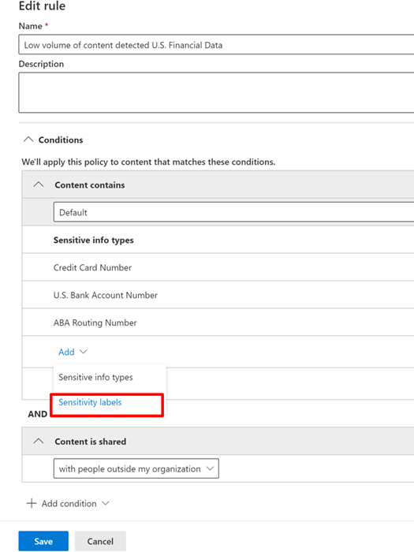

# Usar rótulos de confidencialidade como condições em políticas DLP (visualização)Use sensitivity labels as conditions in DLP policies (preview)

Você pode usar os [rótulos de confidencialidade](sensitivity-labels.md) como uma condição nas políticas DLP para esse local:You can use [sensitivity labels](sensitivity-labels.md) as a condition in DLP policies for these location:

- Mensagens de email do Exchange OnlineExchange Online email messages
- SharePoint OnlineSharePoint Online
- Sites do OneDrive for BusinessOneDrive for Business sites
- Dispositivos do Windows 10Windows 10 devices

Os rótulos de confidencialidade aparecem como uma opção na lista **Conteúdo contém**.Sensitivity labels appear as an option in the **Content contains** list.

> [!div class="mx-imgBorder"]
> 

> [!IMPORTANT]
> Como condição, os **Rótulos de Confidencialidade** não estarão disponíveis se você tiver selecionado o **chat do Teams e as mensagens do canal** como um local para aplicar a política DLP.**Sensitivity Labels** as a condition will not be available if you have selected **Teams chat and channel messages** as a location to apply the DLP policy.

## Itens com suporte, cenários e dicas de políticaSupported items, scenarios, and policy tips

Você pode usar rótulos de confidencialidade como condições nestes itens e nestes cenários.You can use sensitivity labels as conditions on these items and in these scenarios.

### Itens com suporteSupported items

|ServiçoService  |Tipo de itemItem type  |Disponível para a dica de políticaAvailable to policy tip  |AplicávelEnforceable  |
|---------|---------|---------|---------|
|ExchangeExchange    |mensagem de emailemail message         |simyes         |simyes         |
|ExchangeExchange    |anexos de emailemail attachment         |não \*no \*         |não \*no \*         |
|SharePoint OnlineSharePoint Online     |itens no SharePoint Onlineitems in SharePoint Online         |simyes         |simyes         |
|OneDrive for BusinessOneDrive for Business     |itensitems         |simyes         |simyes         |
|TeamsTeams     |Teams e mensagens de canalTeams and channel messages         |não se aplicanot applicable         |não se aplicanot applicable         |
|TeamsTeams     |anexosattachments         |sim \*\*yes \*\*         |sim \*\*yes \*\*         |
|Dispositivos do Windows 10 (visualização)Windows 10 devices (preview)     |itensitems         |simyes         |simyes         |
|MCAS (visualização)MCAS (preview) |itensitems         |simyes         |simyes         |

\* A detecção de DLP de rótulos de confidencialidade em emails possui suporte.\* DLP detection of sensitivity labels on emails are supported. A detecção de DLP de anexos de email rotulados como confidenciais não.DLP detection of sensitivity labeled email attachments are not.

\*\* Anexos enviados no Teams em chats individuais ou canais são carregados automaticamente para o OneDrive for Business e para o SharePoint.\*\* Attachments sent in Teams over 1:1 chat or channels are automatically uploaded to OneDrive for Business and SharePoint. Portanto, se o SharePoint Online ou OneDrive for Business estiverem incluídos como locais na sua política de DLP, os anexos enviados pelo Teams serão incluídos automaticamente no escopo dessa condição.So if SharePoint Online or OneDrive for Business are included as locations in your DLP policy, then labeled attachments sent in Teams will be automatically included in the scope of this condition. O Teams como local não precisa ser selecionado na política de DLP.Teams as a location does not need to be selected in the DLP policy.

### Cenários com suporteSupported scenarios

- O administrador de DLP poderá ver uma lista de todos os rótulos de confidencialidade no locatário quando eles optarem por incluir um ou mais rótulos de confidencialidade como uma condição.DLP Admin will be able to see a list of all sensitivity labels in the tenant when they choose to include one or more sensitivity labels as a condition.

- Como condição, o uso de rótulos de confidencialidade tem suporte em todas as cargas de trabalho, como indicado na matriz de suporte acima.Using sensitivity labels as a condition is supported across all workloads as indicated in the support matrix above.

- As dicas de política DLP continuarão a ser mostradas entre cargas de trabalho (exceto o Outlook Win32) para políticas DLP que contêm rótulos de confidencialidade como uma condição.DLP policy tips will continue to be shown across workloads (except Outlook Win32) for DLP policies which contain sensitivity label as a condition.

- Os rótulos de confidencialidade também serão exibidos como parte do email do relatório de incidentes se uma política DLP com rótulos de confidencialidade for correspondida.Sensitivity labels will also appear as a part of the incident report email if a DLP policy with sensitivity label as a condition is matched.

- Os detalhes dos rótulos de confidencialidade também serão mostrados na regra de correspondência do log de auditoria da DLP para obter uma correspondência à política DLP que contenha o rótulos de confidencialidade como uma condição.Sensitivity label details will also be shown in the DLP rule match audit log for a DLP policy match which contains sensitivity label as a condition.

### Dicas de política com suporteSupport policy tips

|Carga de trabalhoWorkload  |Dicas de política com suporte/sem suportePolicy tips supported/not supported  |
|---------|---------|
|OWAOWA |    com suportesupported     |
|Outlook Win 32Outlook Win 32    |  sem suporte.not supported       |
|SharePointSharePoint   |   com suportesupported      |
|OneDrive for BusinessOneDrive for Business    |    com suportesupported     |
|dispositivos de ponto de extremidadeendpoint devices   |  sem suporte.not supported       |
