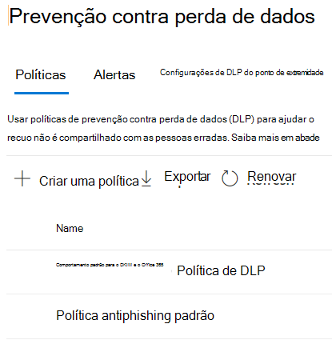

# Saiba mais sobre a política de prevenção de perda de dados padrão no Microsoft Teams (visualização)

[Os recursos de prevenção](data-loss-prevention-policies.md) contra perda de dados (DLP) foram estendidos para incluir mensagens de chat e canal do Microsoft Teams, incluindo mensagens de canal privado. Como parte dessa versão, criamos uma política DLP padrão para clientes de primeira para o Centro de Conformidade.

## Aplicável a

Qualquer locatário licenciado com uma ou mais das licenças abaixo e que tenha usuários ativos do Teams
 
- ME5, 
- MA5, 
- Conformidade com e5/A5, 
- IP+G, 
- OE5, 
- Conformidade avançada do O365 
- EMS E5

## O que a política padrão faz?

A política DLP padrão rastreia todos os números de cartão de crédito compartilhados interna e externamente para a organização. Essa política está em uso por padrão para todos os usuários do locatário. Ele não gera dicas de política para usuários finais, mas gera um evento Alert e também dispara um email de baixa gravidade para o administrador (adicionado na política). O administrador pode exibir as atividades e editar os detalhes das políticas fazendo logo em log no Centro de Conformidade.

Os administradores podem exibir essa política na página Centro de [Conformidade >](https://compliance.microsoft.com/compliancesettings) políticas de prevenção contra perda de dados.

> [!div class="mx-imgBorder"]
> 

## Editar ou excluir a política padrão

Para editar a política padrão para melhorar o desempenho ou [excluí-la,](create-test-tune-dlp-policy.md#tune-a-dlp-policy)basta usar uma conta com permissões de Gerenciamento de Conformidade de **DLP.** Para obter mais informações, consulte [Permissões](create-test-tune-dlp-policy.md#permissions).

