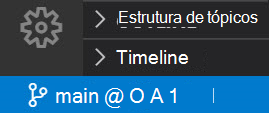
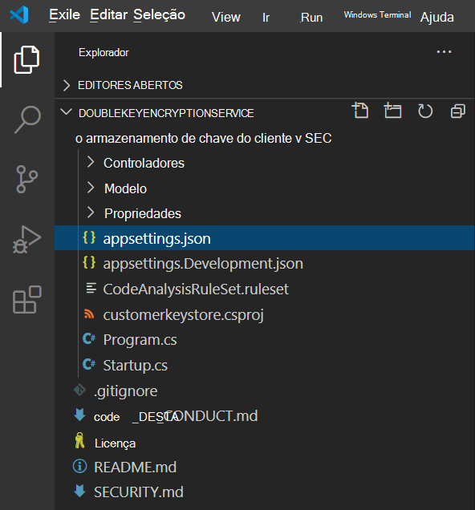
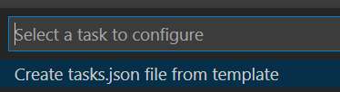
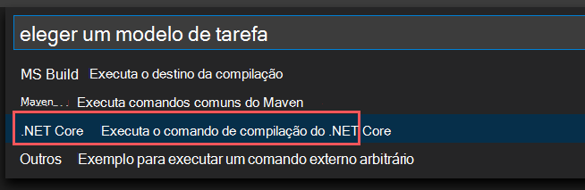

# <a name="double-key-encryption-for-microsoft-365"></a>Criptografia de Chave Dupla para Microsoft 365

> *Aplica-se a: Criptografia de Chave Dupla para Microsoft 365, [Microsoft 365 Conformidade,](https://www.microsoft.com/microsoft-365/business/compliance-management) [Proteção de Informações do Azure](https://azure.microsoft.com/pricing/details/information-protection)*
>
> *Instruções para: cliente de rotulagem unificada da Proteção de Informações do [Azure para Windows](/azure/information-protection/faqs#whats-the-difference-between-the-azure-information-protection-classic-and-unified-labeling-clients)*
>
> *Descrição do serviço para: [Microsoft 365 Conformidade](/office365/servicedescriptions/microsoft-365-service-descriptions/microsoft-365-tenantlevel-services-licensing-guidance/microsoft-365-security-compliance-licensing-guidance)*

A DKE (Double Key Encryption) usa duas chaves juntas para acessar conteúdo protegido. A Microsoft armazena uma chave no Microsoft Azure e você mantém a outra chave. Você mantém o controle total de uma de suas chaves usando o serviço de Criptografia de Chave Dupla. Você aplica proteção usando o cliente de rotulagem unificada da Proteção de Informações do Azure ao seu conteúdo altamente sensível.

A Criptografia de Chave Dupla dá suporte a implantações na nuvem e no local. Essas implantações ajudam a garantir que os dados criptografados permaneçam opacos onde quer que você armazene os dados protegidos.

Para obter mais informações sobre as chaves raiz de locatário baseadas em nuvem padrão, consulte [Planning and implementing your Azure Information Protection tenant key](/azure/information-protection/plan-implement-tenant-key).

## <a name="when-your-organization-should-adopt-dke"></a>Quando sua organização deve adotar o DKE

A Criptografia de Chave Dupla destina-se aos seus dados mais confidenciais que estão sujeitos aos requisitos de proteção mais estritos. O DKE não se destina a todos os dados. Em geral, você estará usando a Criptografia de Chave Dupla para proteger apenas uma pequena parte dos dados gerais. Você deve fazer a devida diligência na identificação dos dados corretos para cobrir com essa solução antes de implantar. Em alguns casos, talvez seja necessário restringir seu escopo e usar outras soluções para a maioria dos seus dados, como Proteção de Informações da Microsoft com chaves gerenciadas pela Microsoft ou BYOK. Essas soluções são suficientes para documentos que não estão sujeitos a proteções e requisitos regulatórios aprimorados. Além disso, essas soluções permitem que você use os serviços de Office 365 mais poderosos; serviços que você não pode usar com conteúdo criptografado DKE. Por exemplo:

- Regras de transporte, incluindo anti-malware e spam que exigem visibilidade no anexo
- Microsoft Delve
- Descoberta eletrônica
- Pesquisa e indexação de conteúdo
- Office Aplicativos Web, incluindo a funcionalidade de coautor

Quaisquer aplicativos ou serviços externos que não sejam integrados ao DKE por meio do SDK MIP não poderão executar ações nos dados criptografados.

O Proteção de Informações da Microsoft SDK 1.7+ oferece suporte à Criptografia de Chave Dupla; os aplicativos que se integram ao nosso SDK poderão fazer o raciocínio sobre esses dados com permissões e integrações suficientes.

Recomendamos que as organizações usem recursos de proteção de informações da Microsoft (classificação e rotulagem) para proteger a maioria de seus dados confidenciais e usar apenas o DKE para seus dados críticos de missão. A Criptografia de Chave Dupla é relevante para dados confidenciais em setores altamente regulamentados, como serviços financeiros e assistência médica.

Se suas organizações têm qualquer um dos seguintes requisitos, você pode usar o DKE para ajudar a proteger seu conteúdo:

- Você deseja garantir que *somente você* possa descriptografar conteúdo protegido, em todas as circunstâncias.
- Você não quer que a Microsoft tenha acesso a dados protegidos por conta própria.
- Você tem requisitos regulatórios para manter chaves dentro de um limite geográfico. Todas as chaves que você mantém para criptografia de dados e descriptografia são mantidas em seu data center.

## <a name="system-and-licensing-requirements-for-dke"></a>Requisitos de sistema e licenciamento para DKE

**A Criptografia de Chave Dupla Microsoft 365** vem com Microsoft 365 E5. Se você não tiver uma licença Microsoft 365 E5, poderá inscrever-se em uma [avaliação.](https://aka.ms/M365E5ComplianceTrial) Para obter mais informações sobre essas licenças, consulte Microsoft 365 de licenciamento [para conformidade & segurança.](/office365/servicedescriptions/microsoft-365-service-descriptions/microsoft-365-tenantlevel-services-licensing-guidance/microsoft-365-security-compliance-licensing-guidance)

**Proteção de Informações do Azure**. O DKE funciona com rótulos de sensibilidade e requer a Proteção de Informações do Azure.

Os rótulos de sensibilidade de DKE são disponibilizados aos usuários finais por meio da faixa de opções de sensibilidade em Office Desktop Apps. Instale esses pré-requisitos em cada computador cliente onde você deseja proteger e consumir documentos protegidos.

**Microsoft Office aplicativos para a versão** corporativa 2009 ou posterior (versões da área de trabalho do Word, PowerPoint e Excel) no Windows.

**Azure Information Protection Unified Labeling Client versions** 2.7.93.0 or later. Baixe e instale o cliente de Rotulagem Unificada no centro [de download da Microsoft.](https://www.microsoft.com/download/details.aspx?id=53018)

## <a name="supported-environments-for-storing-and-viewing-dke-protected-content"></a>Ambientes com suporte para armazenar e exibir conteúdo protegido por DKE

**Aplicativos com suporte**. [Microsoft 365 Apps para Grandes Empresas](https://www.microsoft.com/microsoft-365/business/microsoft-365-apps-for-enterprise-product) clientes no Windows, incluindo Word, Excel e PowerPoint.

**Suporte a conteúdo online**. Você pode armazenar documentos e arquivos protegidos com Criptografia de Chave Dupla online no Microsoft SharePoint e OneDrive for Business. Você deve rotular e proteger documentos e arquivos com DKE por aplicativos com suporte antes de carregar nesses locais. Você pode compartilhar conteúdo criptografado por email, mas não pode exibir documentos e arquivos criptografados online. Em vez disso, você deve exibir conteúdo protegido usando os aplicativos de área de trabalho e clientes com suporte em seu computador local.

## <a name="overview-of-deploying-dke"></a>Visão geral da implantação do DKE

Você seguirá estas etapas gerais para configurar o DKE. Depois de concluir essas etapas, os usuários finais poderão proteger seus dados altamente confidenciais com Criptografia de Chave Dupla.

1. Implante o serviço DKE conforme descrito neste artigo.

2. Crie um rótulo com Criptografia de Chave Dupla. Navegue até Proteção de informações sob [o Centro de conformidade do Microsoft 365](https://compliance.microsoft.com) e crie um novo rótulo com Criptografia de Chave Dupla. Consulte [Restringir o acesso ao conteúdo usando rótulos de sensibilidade para aplicar criptografia](./encryption-sensitivity-labels.md).

3. Use rótulos de Criptografia de Chave Dupla. Proteja os dados selecionando o rótulo de Chave Dupla Criptografada na faixa de opções de sensibilidade Microsoft Office.

Há várias maneiras de concluir algumas das etapas para implantar a Criptografia de Chave Dupla. Este artigo fornece instruções detalhadas para que administradores menos experientes implantem o serviço com êxito. Se você estiver confortável fazendo isso, você pode optar por usar seus próprios métodos.

## <a name="deploy-dke"></a>Implantar o DKE

Este artigo e o vídeo de implantação usam o Azure como o destino de implantação para o serviço DKE. Se você estiver implantando em outro local, precisará fornecer seus próprios valores.

Assista ao [vídeo de implantação](https://youtu.be/vDWfHN_kygg) de Criptografia de Chave Dupla para ver uma visão geral passo a passo dos conceitos neste artigo. O vídeo leva cerca de 18 minutos para ser concluído.

Você seguirá estas etapas gerais para configurar a Criptografia de Chave Dupla para sua organização.

1. [Instalar pré-requisitos de software para o serviço DKE](#install-software-prerequisites-for-the-dke-service)
1. [Clone o repositório de criptografia de chave GitHub chave dupla](#clone-the-dke-github-repository)
1. [Modificar configurações de aplicativo](#modify-application-settings)
1. [Gerar chaves de teste](#generate-test-keys)
1. [Criar o projeto](#build-the-project)
1. [Implantar o serviço DKE e publicar o armazenamento de chaves](#deploy-the-dke-service-and-publish-the-key-store)
1. [Valide a sua implantação](#validate-your-deployment)
1. [Registrar seu armazenamento de chaves](#register-your-key-store)
1. [Criar rótulos de sensibilidade usando DKE](#create-sensitivity-labels-using-dke)
1. [Habilitar o DKE em seu cliente](#enable-dke-in-your-client)
1. [Migrar arquivos protegidos de rótulos HYOK para rótulos DKE](#migrate-protected-files-from-hyok-labels-to-dke-labels)

Quando terminar, você poderá criptografar documentos e arquivos usando DKE. Para obter informações, [consulte Apply sensitivity labels to your files and email in Office](https://support.microsoft.com/office/2f96e7cd-d5a4-403b-8bd7-4cc636bae0f9).

### <a name="install-software-prerequisites-for-the-dke-service"></a>Instalar pré-requisitos de software para o serviço DKE

Instale esses pré-requisitos no computador onde você deseja instalar o serviço DKE.

**SDK .NET Core 3.1**. Baixe e instale o SDK do [Download .NET Core 3.1](https://dotnet.microsoft.com/download/dotnet-core/3.1).

**Visual Studio Code**. Baixe Visual Studio Code de [https://code.visualstudio.com/](https://code.visualstudio.com) . Depois de instalado, execute o Visual Studio Code e selecione **Exibir** \> **Extensões**. Instale essas extensões.

- C# para Visual Studio Code

- NuGet Gerenciador de Pacotes

**Recursos do Git**. Baixe e instale um dos seguintes.

- [Git](https://git-scm.com/downloads)

- [GitHub Área de trabalho](https://desktop.github.com/)

- [GitHub Enterprise](https://github.com/enterprise)

**OpenSSL** Você deve ter [o OpenSSL](https://slproweb.com/products/Win32OpenSSL.html) instalado para [gerar chaves de teste](#generate-test-keys) depois de implantar o DKE. Certifique-se de que você o está invocando corretamente do caminho das variáveis de ambiente. Por exemplo, consulte "Adicionar o diretório de instalação ao PATH" para [https://www.osradar.com/install-openssl-windows/](https://www.osradar.com/install-openssl-windows/) obter detalhes.

### <a name="clone-the-dke-github-repository"></a>Clonar o repositório de GitHub DKE

A Microsoft fornece os arquivos de origem DKE em um GitHub repositório. Você clona o repositório para criar o projeto localmente para uso da sua organização. O repositório GitHub DKE está localizado em [https://github.com/Azure-Samples/DoubleKeyEncryptionService](https://github.com/Azure-Samples/DoubleKeyEncryptionService) .

As instruções a seguir destinam-se a usuários não qualificados do git ou Visual Studio Code:

1. No navegador, vá para: [https://github.com/Azure-Samples/DoubleKeyEncryptionService](https://github.com/Azure-Samples/DoubleKeyEncryptionService) .

2. No lado direito da tela, selecione **Código**. Sua versão da interface do usuário pode mostrar um **botão Clone ou download.** Em seguida, na lista suspenso exibida, selecione o ícone de cópia para copiar a URL para sua área de transferência.

    Por exemplo:

   > [!div class="mx-imgBorder"]
   > 

3. Em Visual Studio Code, selecione **Exibir** \> **Paleta de Comando** e selecione **Git: Clone**. Para ir para a opção na lista, comece a digitar para filtrar as entradas e `git: clone` selecione-a no drop-down. Por exemplo:

   > [!div class="mx-imgBorder"]
   > 

4. Na caixa de texto, colar a URL que você copiou do Git e selecione **Clonar de GitHub**.

5. Na caixa **de diálogo Selecionar Pasta** exibida, navegue até e selecione um local para armazenar o repositório. No prompt, selecione **Abrir**.

    O repositório é aberto Visual Studio Code e exibe a ramificação atual do Git na parte inferior esquerda. Por exemplo, o branch deve ser **principal**. Por exemplo:

   

6. Se você não estiver no branch principal, será necessário selecioná-lo. Em Visual Studio Code, selecione a ramificação e escolha **principal** na lista de ramificações que exibe.

   > [!IMPORTANT]
   > Selecionar a ramificação principal garante que você tenha os arquivos corretos para criar o projeto. Se você não escolher a ramificação correta, sua implantação falhará.

Agora você tem seu repositório de origem DKE definido localmente. Em seguida, [modifique as configurações do aplicativo](#modify-application-settings) para sua organização.

### <a name="modify-application-settings"></a>Modificar configurações de aplicativo

Para implantar o serviço DKE, você deve modificar os seguintes tipos de configurações de aplicativo:

- [Configurações de acesso de chave](#key-access-settings)
- [Configurações de locatário e chave](#tenant-and-key-settings)

Você modifica as configurações do aplicativo no arquivo appsettings.json. Esse arquivo está localizado no repo doubleKeyEncryptionService clonado localmente em DoubleKeyEncryptionService\src\customer-key-store. Por exemplo, Visual Studio Code, você pode navegar até o arquivo conforme mostrado na imagem a seguir.



#### <a name="key-access-settings"></a>Configurações de acesso de chave

Escolha se deve usar autorização de email ou função. O DKE dá suporte a apenas um desses métodos de autenticação por vez.

- **Autorização de email**. Permite que sua organização autorize o acesso a chaves com base apenas em endereços de email.

- **Autorização de função**. Permite que sua organização autorize o acesso a chaves com base em grupos do Active Directory e exige que o serviço Web possa consultar o LDAP.

##### <a name="to-set-key-access-settings-for-dke-using-email-authorization"></a>Para definir as configurações de acesso de chave para DKE usando autorização de email

1. Abra o **appsettings.jsno arquivo** e localize a `AuthorizedEmailAddress` configuração.

2. Adicione o endereço de email ou endereços que você deseja autorizar. Separe vários endereços de email com aspas duplas e vírgulas. Por exemplo:

   ```json
   "AuthorizedEmailAddress": ["email1@company.com", "email2@company.com ", "email3@company.com"]
   ```

3. Localize `LDAPPath` a configuração e remova o texto `If you use role authorization (AuthorizedRoles) then this is the LDAP path.` entre aspas duplas. Deixe as aspas duplas no lugar. Quando terminar, a configuração deverá ter esta aparência.

   ```json
   "LDAPPath": ""
   ```

4. Localize `AuthorizedRoles` a configuração e exclua a linha inteira.

Esta imagem mostra o **arquivoappsettings.json** formatado corretamente para autorização de email.

   

##### <a name="to-set-key-access-settings-for-dke-using-role-authorization"></a>Para definir as configurações de acesso de chave para DKE usando a autorização de função

1. Abra o **appsettings.jsno arquivo** e localize a `AuthorizedRoles` configuração.

2. Adicione os nomes de grupo do Active Directory que você deseja autorizar. Separe vários nomes de grupo com aspas duplas e vírgulas. Por exemplo:

   ```json
   "AuthorizedRoles": ["group1", "group2", "group3"]
   ```

3. Localize `LDAPPath` a configuração e adicione o domínio do Active Directory. Por exemplo:

   ```json
   "LDAPPath": "contoso.com"
   ```

4. Localize `AuthorizedEmailAddress` a configuração e exclua a linha inteira.

Esta imagem mostra o **appsettings.jsno** arquivo formatado corretamente para autorização de função.

   

#### <a name="tenant-and-key-settings"></a>Configurações de locatário e chave

As configurações de locatário e chave do DKE estão localizadas no arquivo **appsettings.json.**

##### <a name="to-configure-tenant-and-key-settings-for-dke"></a>Para configurar configurações de locatário e chave para DKE

1. Abra o **appsettings.jsno** arquivo.

2. Localize `ValidIssuers` a configuração e `<tenantid>` substitua pela ID do locatário. Você pode localizar sua ID de locatário indo para o portal do Azure e exibindo as [propriedades do locatário.](https://aad.portal.azure.com/#blade/Microsoft_AAD_IAM/ActiveDirectoryMenuBlade/Properties) Por exemplo:

   ```json
   "ValidIssuers": [
     "https://sts.windows.net/9c99431e-b513-44be-a7d9-e7b500002d4b/"
   ]
   ```

> [!NOTE]
> Se você quiser habilitar o acesso B2B externo ao seu armazenamento de chaves, também precisará incluir esses locatários externos como parte da lista de emissores válidos.

Localize `JwtAudience` o . Substitua `<yourhostname>` pelo nome do host do computador onde o serviço DKE será executado. Por exemplo:

  > [!IMPORTANT]
  > O valor para `JwtAudience` deve corresponder ao nome do seu host *exatamente*. Você pode usar **localhost:5001** durante a depuração. No entanto, quando terminar a depuração, certifique-se de atualizar esse valor para o nome do host do servidor.

- `TestKeys:Name`. Insira um nome para sua chave. Por exemplo: `TestKey1`
- `TestKeys:Id`. Crie um GUID e insira-o como o `TestKeys:ID` valor. Por exemplo, `DCE1CC21-FF9B-4424-8FF4-9914BD19A1BE`. Você pode usar um site como [o Gerador de GUID Online](https://guidgenerator.com/) para gerar aleatoriamente um GUID.

Esta imagem mostra o formato correto para as configurações de locatário e teclas **appsettings.jsem**. `LDAPPath` é configurado para autorização de função.


### <a name="generate-test-keys"></a>Gerar chaves de teste

Depois de definir as configurações do aplicativo, você estará pronto para gerar chaves de teste públicas e privadas.

Para gerar chaves:

1. Na Windows menu Iniciar, execute o Prompt de Comando OpenSSL.

2. Altere para a pasta onde você deseja salvar as chaves de teste. Os arquivos que você cria concluindo as etapas desta tarefa são armazenados na mesma pasta.

3. Gere a nova chave de teste.

   ```console
   openssl req -x509 -newkey rsa:2048 -keyout key.pem -out cert.pem -days 365
   ```

4. Gere a chave privada.

   ```console
   openssl rsa -in key.pem -out privkeynopass.pem
   ```

5. Gere a chave pública.

   ```console
   openssl rsa -in key.pem -pubout > pubkeyonly.pem
   ```

6. Em um editor de texto, abra **pubkeyonly.pem**. Copie todo o conteúdo no **arquivo pubkeyonly.pem,** exceto as primeiras e últimas linhas, para a seção do arquivo `PublicPem`appsettings.js **on.**

7. Em um editor de texto, abra **privkeynopass.pem**. Copie todo o conteúdo no arquivo **privkeynopass.pem,** exceto as primeiras e últimas linhas, para a seção do arquivo `PrivatePem` **appsettings.json.**

8. Remova todos os espaços em branco e linhas novas nas `PublicPem` `PrivatePem` seções e.

    > [!IMPORTANT]
    > Ao copiar esse conteúdo, não exclua nenhum dos dados PEM.

9. Em Visual Studio Code, navegue até o **arquivo Startup.cs.** Esse arquivo está localizado no repo doubleKeyEncryptionService clonado localmente em DoubleKeyEncryptionService\src\customer-key-store\.

10. Localize as seguintes linhas:

    ```csharp
        #if USE_TEST_KEYS
        #error !!!!!!!!!!!!!!!!!!!!!! Use of test keys is only supported for testing,
        DO NOT USE FOR PRODUCTION !!!!!!!!!!!!!!!!!!!!!!!!!!!!!
        services.AddSingleton<ippw.IKeyStore, ippw.TestKeyStore>();
        #endif
    ```

11. Substitua essas linhas pelo seguinte texto:

    ```csharp
    services.AddSingleton<ippw.IKeyStore, ippw.TestKeyStore>();
    ```

    Os resultados finais devem ser semelhantes aos seguintes.

    

Agora você está pronto para [criar seu projeto DKE.](#build-the-project)

### <a name="build-the-project"></a>Compilar o projeto

Use as instruções a seguir para criar o projeto DKE localmente:

1. Em Visual Studio Code, no repositório de serviço DKE, selecione **Exibir** Paleta de Comando e digite \>  **build** no prompt.

2. Na lista, escolha **Tarefas: Executar tarefa de com build**.

   Se não houver tarefas de com build encontradas, selecione **Configurar Tarefa de Com** build e crie uma para o núcleo .NET da seguinte maneira.

   

   1. Escolha **Criar tasks.jsno modelo**.

      

   2. Na lista de tipos de modelo, selecione **.NET Core**.

      

   3. Na seção build, localize o caminho para o **arquivo customerkeystore.csproj.** Se não estiver lá, adicione a seguinte linha:

      ```json
      "${workspaceFolder}/src/customer-key-store/customerkeystore.csproj",
      ```

   4. Execute a com build novamente.

3. Verifique se não há erros vermelhos na janela de saída.

   Se houver erros vermelhos, verifique a saída do console. Verifique se você concluiu todas as etapas anteriores corretamente e as versões de com build corretas estão presentes.

4. Selecione **Executar** \> **Depuração inicial** para depurar o processo. Se você for solicitado a selecionar um ambiente, selecione **.NET core**.

   O depurador de núcleo do .NET normalmente é lançado para `https://localhost:5001` . Para exibir sua chave de teste, vá para e anexar uma barra `https://localhost:5001` de avanço (/) e o nome da sua chave. Por exemplo:

   ```https
   https://localhost:5001/TestKey1
   ```

   A chave deve ser exibida no formato JSON.

Sua configuração agora está concluída. Antes de publicar o repositório de chaves, em appsettings.json, para a configuração JwtAudience, verifique se o valor do nome do host corresponde exatamente ao nome do host do Serviço de Aplicativo. Você pode ter alterado para localhost para solucionar problemas da com build.

### <a name="deploy-the-dke-service-and-publish-the-key-store"></a>Implantar o serviço DKE e publicar o armazenamento de chaves

Para implantações de produção, implante o serviço em uma nuvem de terceiros ou [publique em](/aspnet/core/tutorials/publish-to-iis?preserve-view=true&tabs=netcore-cli&view=aspnetcore-3.1)um sistema local .

Você pode preferir outros métodos para implantar suas chaves. Selecione o método que funciona melhor para sua organização.

Para implantações piloto, você pode implantar no Azure e começar imediatamente.

#### <a name="to-create-an-azure-web-app-instance-to-host-your-dke-deployment"></a>Para criar uma instância do Azure Web App para hospedar sua implantação DKE

Para publicar o armazenamento de chaves, você criará uma instância do Serviço de Aplicativo do Azure para hospedar sua implantação DKE. Em seguida, você publicará suas chaves geradas no Azure.

1. No navegador, entre no portal de Microsoft Azure [e](https://ms.portal.azure.com)acesse **App Services**  >  **Add**.

2. Selecione sua assinatura e grupo de recursos e defina seus detalhes de instância.

   - Insira o nome do host do computador onde você deseja instalar o serviço DKE. Certifique-se de que seja o mesmo nome definido para a configuração JwtAudience no arquivo [**appsettings.json.**](#tenant-and-key-settings) O valor que você fornece para o nome também é WebAppInstanceName.

   - Para **Publicar,** selecione **código** e para pilha **de Tempo de** Execução, selecione **.NET Core 3.1**.

   Por exemplo:

   > [!div class="mx-imgBorder"]
   > 

3. Na parte inferior da página, selecione **Revisar + criar** e selecione **Adicionar**.

4. Faça um dos seguintes para publicar suas chaves geradas:

   - [Publicar via ZipDeployUI](#publish-via-zipdeployui)
   - [Publicar via FTP](#publish-via-ftp)
   - [Publicar via Visual Studio 2019 ou posterior](/aspnet/core/tutorials/)

#### <a name="publish-via-zipdeployui"></a>Publicar via ZipDeployUI

1. Vá para `https://<WebAppInstanceName>.scm.azurewebsites.net/ZipDeployUI`.

   Por exemplo: https://dkeservice.scm.azurewebsites.net/ZipDeployUI

2. Na base de código do repositório de chaves, vá para a pasta **customer-key-store\src\customer-key-store** e verifique se essa pasta contém o **arquivo customerkeystore.csproj.**

3. Executar: **publicação de dotnet**

   A janela de saída exibe o diretório onde a publicação foi implantada.

   Por exemplo: `customer-key-store\src\customer-key-store\bin\Debug\netcoreapp3.1\publish\`

4. Envie todos os arquivos no diretório de publicação para um .zip arquivo. Ao criar o arquivo .zip, certifique-se de que todos os arquivos no diretório estão no nível raiz do arquivo .zip.

5. Arraste e solte o arquivo .zip que você criar no site ZipDeployUI que você abriu acima. Por exemplo: https://dkeservice.scm.azurewebsites.net/ZipDeployUI

O DKE é implantado e você pode navegar até as chaves de teste criadas. Continue [validando sua implantação](#validate-your-deployment) abaixo.

#### <a name="publish-via-ftp"></a>Publicar via FTP

1. Conexão para o Serviço de Aplicativo que você criou [acima](#deploy-the-dke-service-and-publish-the-key-store).

   Em seu navegador, vá para: Centro de Implantação manual do Centro de Implantação de Serviço de Aplicativo do **portal do Azure**  >    >    >    >    >  .

2. Copie as cadeias de caracteres de conexão exibidas para um arquivo local. Você usará essas cadeias de caracteres para se conectar ao Serviço de Aplicativo Web e carregar arquivos via FTP.

   Por exemplo:

   

3. Na base de código para o armazenamento de chaves, vá para **o diretório customer-key-store\src\customer-key-store.**

4. Verifique se esse diretório contém o **arquivo customerkeystore.csproj.**

5. Executar: **publicação de dotnet**

   A saída contém o diretório onde a publicação foi implantada.

   Por exemplo: `customer-key-store\src\customer-key-store\bin\Debug\netcoreapp3.1\publish\`

6. Envie todos os arquivos no diretório de publicação para um arquivo zip. Ao criar o arquivo .zip, certifique-se de que todos os arquivos no diretório estão no nível raiz do arquivo .zip.

7. No cliente FTP, use as informações de conexão copiadas para se conectar ao Serviço de Aplicativo. Upload o arquivo .zip que você criou na etapa anterior para o diretório raiz do seu Aplicativo Web.

O DKE é implantado e você pode navegar até as chaves de teste que você criou. Em seguida, [Valide sua implantação](#validate-your-deployment).

### <a name="validate-your-deployment"></a>Valide a sua implantação

Depois de implantar o DKE usando um dos métodos descritos acima, valide a implantação e as configurações do armazenamento de chaves.

Executar:

```powershell
src\customer-key-store\scripts\key_store_tester.ps1 dkeserviceurl/mykey
```

Por exemplo:

```powershell
key_store_tester.ps1 https://mydkeservice.com/mykey
```

Certifique-se de que nenhum erro apareça na saída. Quando estiver pronto, [registre seu armazenamento de chaves.](#register-your-key-store)

O nome da chave é sensível a minúsculas. Insira o nome da chave como ele aparece no arquivo appsettings.json.

## <a name="register-your-key-store"></a>Registrar seu armazenamento de chaves

As etapas a seguir permitem que você registre seu serviço DKE. Registrar seu serviço DKE é a última etapa na implantação do DKE antes de começar a criar rótulos.

Para registrar o serviço DKE:

1. No navegador, abra o [portal Microsoft Azure e](https://ms.portal.azure.com/)acesse **Todos** os Registros de Aplicativos de Identidade \>  \> **de Serviços.**

2. Selecione **Novo registro** e insira um nome significativo.

3. Selecione um tipo de conta nas opções exibidas.

   Se você estiver usando Microsoft Azure com um domínio não personalizado, como **onmicrosoft.com**, selecione Contas neste diretório organizacional **somente (Microsoft - Locatário único).**

   Por exemplo:

   > [!div class="mx-imgBorder"]
   > 

4. Na parte inferior da página, selecione **Registrar** para criar o novo Registro de Aplicativo.

5. No novo Registro de Aplicativo, no painel esquerdo, em **Gerenciar**, selecione **Autenticação**.

6. Selecione **Adicionar uma plataforma**.

7. No **pop-up Configurar plataformas,** selecione **Web**.

8. Em **URIs de redirecionamento,** insira o URI do seu serviço de criptografia de chave dupla. Insira a URL do Serviço de Aplicativo, incluindo o nome do host e o domínio.

   Por exemplo: https://mydkeservicetest.com

   - A URL que você inserir deve corresponder ao nome do host no qual o serviço DKE foi implantado.
   - Se você estiver testando localmente com Visual Studio, use **https://localhost:5001** .
   - Em todos os casos, o esquema deve ser **https**.

   Verifique se o nome do host corresponde exatamente ao nome de host do Serviço de Aplicativo. Você pode ter alterado para `localhost` solucionar problemas da com build. Em **appsettings.json**, esse valor é o nome do host que você definiu para `JwtAudience` .

9. Em **Concessão implícita,** marque a **caixa de seleção tokens** de ID.

10. Selecione **Salvar** para salvar suas alterações.

11. No painel esquerdo, selecione **Expor uma API** e, ao lado de URI de ID do Aplicativo, selecione **Definir**.

12. Ainda na página **Expor uma API,** nos **Escopos definidos por essa área de API,** selecione **Adicionar um escopo**. No novo escopo:

    1. Defina o nome do escopo **como user_impersonation**.

    2. Selecione os administradores e usuários que podem consentir.

    3. Defina os valores restantes necessários.

    4. Selecione **Adicionar escopo**.

    5. Selecione **Salvar** na parte superior para salvar suas alterações.

13. Ainda na página **Expor uma API,** na área **Aplicativos cliente** autorizados, selecione Adicionar um aplicativo **cliente**.

    No novo aplicativo cliente:

    1. Defina a ID do Cliente como `d3590ed6-52b3-4102-aeff-aad2292ab01c` . Esse valor é a Microsoft Office ID do cliente e permite Office obter um token de acesso para o seu armazenamento de chaves.

    2. Em **Escopos autorizados,** selecione o **user_impersonation** escopo.

    3. Selecione **Adicionar aplicativo**.

    4. Selecione **Salvar** na parte superior para salvar suas alterações.

    5. Repita estas etapas, mas, desta vez, defina a ID do cliente como `c00e9d32-3c8d-4a7d-832b-029040e7db99` . Esse valor é a ID do cliente de rotulagem unificada da Proteção de Informações do Azure.

Seu serviço DKE agora está registrado. Continue criando [rótulos usando DKE](#create-sensitivity-labels-using-dke).

## <a name="create-sensitivity-labels-using-dke"></a>Criar rótulos de sensibilidade usando DKE

Na Centro de conformidade do Microsoft 365, crie um novo rótulo de sensibilidade e aplique a criptografia como faria de outra forma. Selecione **Usar Criptografia de Chave** Dupla e insira a URL do ponto de extremidade para sua chave.

Por exemplo:

> [!div class="mx-imgBorder"]
> 

Quaisquer rótulos DKE que você adicionar começarão a aparecer para os usuários nas versões mais recentes do Microsoft 365 Apps para Grandes Empresas.

> [!NOTE]
> Pode levar até 24 horas para os clientes atualizarem com os novos rótulos.

### <a name="enable-dke-in-your-client"></a>Habilitar o DKE em seu cliente

Se você for um Office Insider, o DKE será habilitado para você. Caso contrário, habilita o DKE para seu cliente adicionando as seguintes chaves do Registro:

```console
   [HKEY_LOCAL_MACHINE\SOFTWARE\WOW6432Node\Microsoft\MSIPC\flighting]
   "DoubleKeyProtection"=dword:00000001

   [HKEY_LOCAL_MACHINE\SOFTWARE\Microsoft\MSIPC\flighting]
   "DoubleKeyProtection"=dword:00000001
```

## <a name="migrate-protected-files-from-hyok-labels-to-dke-labels"></a>Migrar arquivos protegidos de rótulos HYOK para rótulos DKE

Se quiser, depois de terminar de configurar o DKE, você poderá migrar o conteúdo que protegeu usando rótulos HYOK para rótulos DKE. Para migrar, você usará o scanner AIP. Para começar a usar o scanner, consulte O que é o scanner unificado de rotulagem da Proteção de Informações do [Azure?](/azure/information-protection/deploy-aip-scanner).

Se você não migrar conteúdo, seu conteúdo protegido HYOK permanecerá não afetado.
