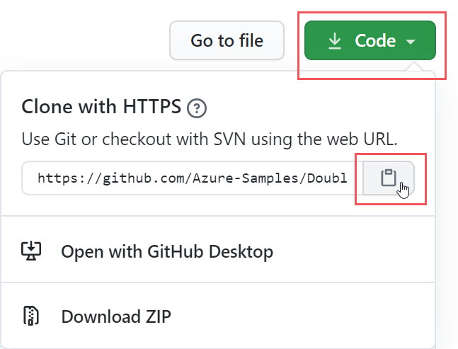

# <a name="double-key-encryption-for-microsoft-365"></a><span data-ttu-id="f9270-103">Criptografia de Chave Dupla para o Microsoft 365</span><span class="sxs-lookup"><span data-stu-id="f9270-103">Double Key Encryption for Microsoft 365</span></span>

> <span data-ttu-id="f9270-104">*Aplica-se a: Criptografia de Chave Dupla para o Microsoft 365, Conformidade do [Microsoft 365](https://www.microsoft.com/microsoft-365/business/compliance-management), [Proteção de Informações do Azure](https://azure.microsoft.com/pricing/details/information-protection)*</span><span class="sxs-lookup"><span data-stu-id="f9270-104">*Applies to: Double Key Encryption for Microsoft 365, [Microsoft 365 Compliance](https://www.microsoft.com/microsoft-365/business/compliance-management), [Azure Information Protection](https://azure.microsoft.com/pricing/details/information-protection)*</span></span>
>
> <span data-ttu-id="f9270-105">*Instruções para: cliente de rotulagem unificada da Proteção de Informações do [Azure para Windows](/azure/information-protection/faqs#whats-the-difference-between-the-azure-information-protection-classic-and-unified-labeling-clients)*</span><span class="sxs-lookup"><span data-stu-id="f9270-105">*Instructions for: [Azure Information Protection unified labeling client for Windows](/azure/information-protection/faqs#whats-the-difference-between-the-azure-information-protection-classic-and-unified-labeling-clients)*</span></span>
>
> <span data-ttu-id="f9270-106">*Descrição do serviço para: [Conformidade do Microsoft 365](/office365/servicedescriptions/microsoft-365-service-descriptions/microsoft-365-tenantlevel-services-licensing-guidance/microsoft-365-security-compliance-licensing-guidance)*</span><span class="sxs-lookup"><span data-stu-id="f9270-106">*Service description for: [Microsoft 365 Compliance](/office365/servicedescriptions/microsoft-365-service-descriptions/microsoft-365-tenantlevel-services-licensing-guidance/microsoft-365-security-compliance-licensing-guidance)*</span></span>

<span data-ttu-id="f9270-107">A DKE (Double Key Encryption) usa duas chaves juntas para acessar conteúdo protegido.</span><span class="sxs-lookup"><span data-stu-id="f9270-107">Double Key Encryption (DKE) uses two keys together to access protected content.</span></span> <span data-ttu-id="f9270-108">A Microsoft armazena uma chave no Microsoft Azure e você mantém a outra chave.</span><span class="sxs-lookup"><span data-stu-id="f9270-108">Microsoft stores one key in Microsoft Azure, and you hold the other key.</span></span> <span data-ttu-id="f9270-109">Você mantém o controle total de uma de suas chaves usando o serviço de Criptografia de Chave Dupla.</span><span class="sxs-lookup"><span data-stu-id="f9270-109">You maintain full control of one of your keys using the Double Key Encryption service.</span></span> <span data-ttu-id="f9270-110">Você aplica proteção usando o cliente de rotulagem unificada da Proteção de Informações do Azure ao seu conteúdo altamente sensível.</span><span class="sxs-lookup"><span data-stu-id="f9270-110">You apply protection using The Azure Information Protection unified labeling client to your highly sensitive content.</span></span>

<span data-ttu-id="f9270-111">A Criptografia de Chave Dupla dá suporte a implantações na nuvem e no local.</span><span class="sxs-lookup"><span data-stu-id="f9270-111">Double Key Encryption supports both cloud and on-premises deployments.</span></span> <span data-ttu-id="f9270-112">Essas implantações ajudam a garantir que os dados criptografados permaneçam opacos onde quer que você armazene os dados protegidos.</span><span class="sxs-lookup"><span data-stu-id="f9270-112">These deployments help to ensure that encrypted data remains opaque wherever you store the protected data.</span></span>

<span data-ttu-id="f9270-113">Para obter mais informações sobre as chaves raiz de locatário baseadas em nuvem padrão, consulte [Planning and implementing your Azure Information Protection tenant key](/azure/information-protection/plan-implement-tenant-key).</span><span class="sxs-lookup"><span data-stu-id="f9270-113">For more information about the default, cloud-based tenant root keys, see [Planning and implementing your Azure Information Protection tenant key](/azure/information-protection/plan-implement-tenant-key).</span></span>

## <a name="when-your-organization-should-adopt-dke"></a><span data-ttu-id="f9270-114">Quando sua organização deve adotar o DKE</span><span class="sxs-lookup"><span data-stu-id="f9270-114">When your organization should adopt DKE</span></span>

<span data-ttu-id="f9270-115">A Criptografia de Chave Dupla destina-se aos seus dados mais confidenciais que estão sujeitos aos requisitos de proteção mais estritos.</span><span class="sxs-lookup"><span data-stu-id="f9270-115">Double Key Encryption is intended for your most sensitive data that is subject to the strictest protection requirements.</span></span> <span data-ttu-id="f9270-116">O DKE não se destina a todos os dados.</span><span class="sxs-lookup"><span data-stu-id="f9270-116">DKE is not intended for all data.</span></span> <span data-ttu-id="f9270-117">Em geral, você estará usando a Criptografia de Chave Dupla para proteger apenas uma pequena parte dos dados gerais.</span><span class="sxs-lookup"><span data-stu-id="f9270-117">In general, you'll be using Double Key Encryption to protect only a small part of your overall data.</span></span> <span data-ttu-id="f9270-118">Você deve fazer a devida diligência na identificação dos dados corretos para cobrir com essa solução antes de implantar.</span><span class="sxs-lookup"><span data-stu-id="f9270-118">You should do due diligence in identifying the right data to cover with this solution before you deploy.</span></span> <span data-ttu-id="f9270-119">Em alguns casos, talvez seja necessário restringir seu escopo e usar outras soluções para a maioria dos seus dados, como a Proteção de Informações da Microsoft com chaves gerenciadas pela Microsoft ou BYOK.</span><span class="sxs-lookup"><span data-stu-id="f9270-119">In some cases, you might need to narrow your scope and make use of other solutions for most your data such as Microsoft Information Protection with Microsoft-managed keys or BYOK.</span></span> <span data-ttu-id="f9270-120">Essas soluções são suficientes para documentos que não estão sujeitos a proteções e requisitos regulatórios aprimorados.</span><span class="sxs-lookup"><span data-stu-id="f9270-120">These solutions are sufficient for documents that aren't subject to enhanced protections and regulatory requirements.</span></span> <span data-ttu-id="f9270-121">Além disso, essas soluções permitem que você use os serviços mais poderosos do Office 365; serviços que você não pode usar com conteúdo criptografado DKE.</span><span class="sxs-lookup"><span data-stu-id="f9270-121">Also, these solutions enable you to use the most powerful Office 365 services; services that you can't use with DKE encrypted content.</span></span> <span data-ttu-id="f9270-122">Por exemplo:</span><span class="sxs-lookup"><span data-stu-id="f9270-122">For example:</span></span>

- <span data-ttu-id="f9270-123">Regras de transporte, incluindo anti-malware e spam que exigem visibilidade no anexo</span><span class="sxs-lookup"><span data-stu-id="f9270-123">Transport rules including anti-malware and spam that require visibility into the attachment</span></span>
- <span data-ttu-id="f9270-124">Microsoft Delve</span><span class="sxs-lookup"><span data-stu-id="f9270-124">Microsoft Delve</span></span>
- <span data-ttu-id="f9270-125">Descoberta eletrônica</span><span class="sxs-lookup"><span data-stu-id="f9270-125">eDiscovery</span></span>
- <span data-ttu-id="f9270-126">Pesquisa e indexação de conteúdo</span><span class="sxs-lookup"><span data-stu-id="f9270-126">Content search and indexing</span></span>
- <span data-ttu-id="f9270-127">Office Web Apps, incluindo a funcionalidade de coautoria</span><span class="sxs-lookup"><span data-stu-id="f9270-127">Office Web Apps including coauthoring functionality</span></span>

<span data-ttu-id="f9270-128">Quaisquer aplicativos ou serviços externos que não sejam integrados ao DKE por meio do SDK MIP não poderão executar ações nos dados criptografados.</span><span class="sxs-lookup"><span data-stu-id="f9270-128">Any external applications or services that are not integrated with DKE through the MIP SDK will be unable to perform actions on the encrypted data.</span></span>

<span data-ttu-id="f9270-129">O SDK de Proteção de Informações da Microsoft 1.7+ oferece suporte à Criptografia de Chave Dupla; os aplicativos que se integram ao nosso SDK poderão fazer o raciocínio sobre esses dados com permissões e integrações suficientes.</span><span class="sxs-lookup"><span data-stu-id="f9270-129">The Microsoft Information Protection SDK 1.7+ supports Double Key Encryption; applications that integrate with our SDK will be able to reason over this data with sufficient permissions and integrations in place.</span></span>

<span data-ttu-id="f9270-130">Recomendamos que as organizações usem recursos de proteção de informações da Microsoft (classificação e rotulagem) para proteger a maioria de seus dados confidenciais e usar apenas o DKE para seus dados críticos de missão.</span><span class="sxs-lookup"><span data-stu-id="f9270-130">We recommend organizations use Microsoft Information protection capabilities (classification and labeling) to protect most of their sensitive data and only use DKE for their mission-critical data.</span></span> <span data-ttu-id="f9270-131">A Criptografia de Chave Dupla é relevante para dados confidenciais em setores altamente regulamentados, como serviços financeiros e assistência médica.</span><span class="sxs-lookup"><span data-stu-id="f9270-131">Double Key Encryption is relevant for sensitive data in highly regulated industries such as Financial services and Healthcare.</span></span>

<span data-ttu-id="f9270-132">Se suas organizações têm qualquer um dos seguintes requisitos, você pode usar o DKE para ajudar a proteger seu conteúdo:</span><span class="sxs-lookup"><span data-stu-id="f9270-132">If your organizations have any of the following requirements, you can use DKE to help secure your content:</span></span>

- <span data-ttu-id="f9270-133">Você deseja garantir que *somente você* possa descriptografar conteúdo protegido, em todas as circunstâncias.</span><span class="sxs-lookup"><span data-stu-id="f9270-133">You want to ensure that *only you* can ever decrypt protected content, under all circumstances.</span></span>
- <span data-ttu-id="f9270-134">Você não quer que a Microsoft tenha acesso a dados protegidos por conta própria.</span><span class="sxs-lookup"><span data-stu-id="f9270-134">You don't want Microsoft to have access to protected data on its own.</span></span>
- <span data-ttu-id="f9270-135">Você tem requisitos regulatórios para manter chaves dentro de um limite geográfico.</span><span class="sxs-lookup"><span data-stu-id="f9270-135">You have regulatory requirements to hold keys within a geographical boundary.</span></span> <span data-ttu-id="f9270-136">Todas as chaves que você mantém para criptografia de dados e descriptografia são mantidas em seu data center.</span><span class="sxs-lookup"><span data-stu-id="f9270-136">All of the keys that you hold for data encryption and decryption are maintained in your data center.</span></span>

## <a name="system-and-licensing-requirements-for-dke"></a><span data-ttu-id="f9270-137">Requisitos de sistema e licenciamento para DKE</span><span class="sxs-lookup"><span data-stu-id="f9270-137">System and licensing requirements for DKE</span></span>

<span data-ttu-id="f9270-138">**A Criptografia de Chave Dupla para o Microsoft 365** vem com o Microsoft 365 E5.</span><span class="sxs-lookup"><span data-stu-id="f9270-138">**Double Key Encryption for Microsoft 365** comes with Microsoft 365 E5.</span></span> <span data-ttu-id="f9270-139">Se você não tiver uma licença do Microsoft 365 E5, poderá inscrever-se em uma [avaliação.](https://aka.ms/M365E5ComplianceTrial)</span><span class="sxs-lookup"><span data-stu-id="f9270-139">If you don’t have a Microsoft 365 E5 license, you can sign up for a [trial](https://aka.ms/M365E5ComplianceTrial).</span></span> <span data-ttu-id="f9270-140">Para obter mais informações sobre essas licenças, consulte Diretrizes de licenciamento do [Microsoft 365 para segurança & conformidade.](/office365/servicedescriptions/microsoft-365-service-descriptions/microsoft-365-tenantlevel-services-licensing-guidance/microsoft-365-security-compliance-licensing-guidance)</span><span class="sxs-lookup"><span data-stu-id="f9270-140">For more information about these licenses, see [Microsoft 365 licensing guidance for security & compliance](/office365/servicedescriptions/microsoft-365-service-descriptions/microsoft-365-tenantlevel-services-licensing-guidance/microsoft-365-security-compliance-licensing-guidance).</span></span>

<span data-ttu-id="f9270-141">**Proteção de Informações do Azure**.</span><span class="sxs-lookup"><span data-stu-id="f9270-141">**Azure Information Protection**.</span></span> <span data-ttu-id="f9270-142">O DKE funciona com rótulos de sensibilidade e requer a Proteção de Informações do Azure.</span><span class="sxs-lookup"><span data-stu-id="f9270-142">DKE works with sensitivity labels and requires Azure Information Protection.</span></span>

<span data-ttu-id="f9270-143">Os rótulos de sensibilidade DKE são disponibilizados aos usuários finais por meio da faixa de opções de sensibilidade nos Aplicativos da Área de Trabalho do Office.</span><span class="sxs-lookup"><span data-stu-id="f9270-143">DKE sensitivity labels are made available to end users through the sensitivity ribbon in Office Desktop Apps.</span></span> <span data-ttu-id="f9270-144">Instale esses pré-requisitos em cada computador cliente onde você deseja proteger e consumir documentos protegidos.</span><span class="sxs-lookup"><span data-stu-id="f9270-144">Install these prerequisites on each client computer where you want to protect and consume protected documents.</span></span>

<span data-ttu-id="f9270-145">**Microsoft Office Aplicativos para a versão** corporativa 2009 ou posterior (versões da área de trabalho do Word, PowerPoint e Excel) no Windows.</span><span class="sxs-lookup"><span data-stu-id="f9270-145">**Microsoft Office Apps for enterprise** version 2009 or later (Desktop versions of Word, PowerPoint, and Excel) on Windows.</span></span>

<span data-ttu-id="f9270-146">**Azure Information Protection Unified Labeling Client versions** 2.7.93.0 or later.</span><span class="sxs-lookup"><span data-stu-id="f9270-146">**Azure Information Protection Unified Labeling Client** versions 2.7.93.0 or later.</span></span> <span data-ttu-id="f9270-147">Baixe e instale o cliente de Rotulagem Unificada no centro [de download da Microsoft.](https://www.microsoft.com/download/details.aspx?id=53018)</span><span class="sxs-lookup"><span data-stu-id="f9270-147">Download and install the Unified Labeling client from the [Microsoft download center](https://www.microsoft.com/download/details.aspx?id=53018).</span></span>

## <a name="supported-environments-for-storing-and-viewing-dke-protected-content"></a><span data-ttu-id="f9270-148">Ambientes com suporte para armazenar e exibir conteúdo protegido por DKE</span><span class="sxs-lookup"><span data-stu-id="f9270-148">Supported environments for storing and viewing DKE-protected content</span></span>

<span data-ttu-id="f9270-149">**Aplicativos com suporte**.</span><span class="sxs-lookup"><span data-stu-id="f9270-149">**Supported applications**.</span></span> <span data-ttu-id="f9270-150">[Microsoft 365 Apps para clientes corporativos](https://www.microsoft.com/microsoft-365/business/microsoft-365-apps-for-enterprise-product) no Windows, incluindo Word, Excel e PowerPoint.</span><span class="sxs-lookup"><span data-stu-id="f9270-150">[Microsoft 365 Apps for enterprise](https://www.microsoft.com/microsoft-365/business/microsoft-365-apps-for-enterprise-product) clients on Windows, including Word, Excel, and PowerPoint.</span></span>

<span data-ttu-id="f9270-151">**Suporte a conteúdo online**.</span><span class="sxs-lookup"><span data-stu-id="f9270-151">**Online content support**.</span></span> <span data-ttu-id="f9270-152">Você pode armazenar documentos e arquivos protegidos com Criptografia de Chave Dupla online no Microsoft SharePoint e no OneDrive for Business.</span><span class="sxs-lookup"><span data-stu-id="f9270-152">You can store documents and files protected with Double Key Encryption online in both Microsoft SharePoint and OneDrive for Business.</span></span> <span data-ttu-id="f9270-153">Você deve rotular e proteger documentos e arquivos com DKE por aplicativos com suporte antes de carregar nesses locais.</span><span class="sxs-lookup"><span data-stu-id="f9270-153">You must label and protect documents and files with DKE by supported applications before you upload to these locations.</span></span> <span data-ttu-id="f9270-154">Você pode compartilhar conteúdo criptografado por email, mas não pode exibir documentos e arquivos criptografados online.</span><span class="sxs-lookup"><span data-stu-id="f9270-154">You can share encrypted content by email, but you can't view encrypted documents and files online.</span></span> <span data-ttu-id="f9270-155">Em vez disso, você deve exibir conteúdo protegido usando os aplicativos de área de trabalho e clientes com suporte em seu computador local.</span><span class="sxs-lookup"><span data-stu-id="f9270-155">Instead, you must view protected content using the supported desktop applications and clients on your local computer.</span></span>

## <a name="overview-of-deploying-dke"></a><span data-ttu-id="f9270-156">Visão geral da implantação do DKE</span><span class="sxs-lookup"><span data-stu-id="f9270-156">Overview of deploying DKE</span></span>

<span data-ttu-id="f9270-157">Você seguirá estas etapas gerais para configurar o DKE.</span><span class="sxs-lookup"><span data-stu-id="f9270-157">You'll follow these general steps to set up DKE.</span></span> <span data-ttu-id="f9270-158">Depois de concluir essas etapas, os usuários finais poderão proteger seus dados altamente confidenciais com Criptografia de Chave Dupla.</span><span class="sxs-lookup"><span data-stu-id="f9270-158">Once you've completed these steps, your end users will can protect your highly sensitive data with Double Key Encryption.</span></span>

1. <span data-ttu-id="f9270-159">Implante o serviço DKE conforme descrito neste artigo.</span><span class="sxs-lookup"><span data-stu-id="f9270-159">Deploy the DKE service as described in this article.</span></span>

2. <span data-ttu-id="f9270-160">Crie um rótulo com Criptografia de Chave Dupla.</span><span class="sxs-lookup"><span data-stu-id="f9270-160">Create a label with Double Key Encryption.</span></span> <span data-ttu-id="f9270-161">Navegue até Proteção de informações no centro de conformidade do [Microsoft 365](https://compliance.microsoft.com) e crie um novo rótulo com Criptografia de Chave Dupla.</span><span class="sxs-lookup"><span data-stu-id="f9270-161">Navigate to Information protection under the [Microsoft 365 compliance center](https://compliance.microsoft.com) and create a new label with Double Key Encryption.</span></span> <span data-ttu-id="f9270-162">Consulte [Restringir o acesso ao conteúdo usando rótulos de sensibilidade para aplicar criptografia](./encryption-sensitivity-labels.md).</span><span class="sxs-lookup"><span data-stu-id="f9270-162">See [Restrict access to content by using sensitivity labels to apply encryption](./encryption-sensitivity-labels.md).</span></span>

3. <span data-ttu-id="f9270-163">Use rótulos de Criptografia de Chave Dupla.</span><span class="sxs-lookup"><span data-stu-id="f9270-163">Use Double Key Encryption labels.</span></span> <span data-ttu-id="f9270-164">Proteja os dados selecionando o rótulo de Chave Dupla Criptografada na faixa de opções de sensibilidade Microsoft Office.</span><span class="sxs-lookup"><span data-stu-id="f9270-164">Protect data by selecting the Double Key Encrypted label from the Sensitivity ribbon in Microsoft Office.</span></span>

<span data-ttu-id="f9270-165">Há várias maneiras de concluir algumas das etapas para implantar a Criptografia de Chave Dupla.</span><span class="sxs-lookup"><span data-stu-id="f9270-165">There are several ways you can complete some of the steps to deploy Double Key Encryption.</span></span> <span data-ttu-id="f9270-166">Este artigo fornece instruções detalhadas para que administradores menos experientes implantem o serviço com êxito.</span><span class="sxs-lookup"><span data-stu-id="f9270-166">This article provides detailed instructions so that less experienced admins successfully deploy the service.</span></span> <span data-ttu-id="f9270-167">Se você estiver confortável fazendo isso, você pode optar por usar seus próprios métodos.</span><span class="sxs-lookup"><span data-stu-id="f9270-167">If you're comfortable doing so, you can choose to use your own methods.</span></span>

## <a name="deploy-dke"></a><span data-ttu-id="f9270-168">Implantar o DKE</span><span class="sxs-lookup"><span data-stu-id="f9270-168">Deploy DKE</span></span>

<span data-ttu-id="f9270-169">Este artigo e o vídeo de implantação usam o Azure como o destino de implantação para o serviço DKE.</span><span class="sxs-lookup"><span data-stu-id="f9270-169">This article and the deployment video use Azure as the deployment destination for the DKE service.</span></span> <span data-ttu-id="f9270-170">Se você estiver implantando em outro local, precisará fornecer seus próprios valores.</span><span class="sxs-lookup"><span data-stu-id="f9270-170">If you're deploying to another location, you'll need to provide your own values.</span></span>

<span data-ttu-id="f9270-171">Assista ao [vídeo de implantação](https://youtu.be/vDWfHN_kygg) de Criptografia de Chave Dupla para ver uma visão geral passo a passo dos conceitos neste artigo.</span><span class="sxs-lookup"><span data-stu-id="f9270-171">Watch the [Double Key Encryption deployment video](https://youtu.be/vDWfHN_kygg) to see a step-by-step overview of the concepts in this article.</span></span> <span data-ttu-id="f9270-172">O vídeo leva cerca de 18 minutos para ser concluído.</span><span class="sxs-lookup"><span data-stu-id="f9270-172">The video takes about 18 minutes to complete.</span></span>

<span data-ttu-id="f9270-173">Você seguirá estas etapas gerais para configurar a Criptografia de Chave Dupla para sua organização.</span><span class="sxs-lookup"><span data-stu-id="f9270-173">You'll follow these general steps to set up Double Key Encryption for your organization.</span></span>

1. [<span data-ttu-id="f9270-174">Instalar pré-requisitos de software para o serviço DKE</span><span class="sxs-lookup"><span data-stu-id="f9270-174">Install software prerequisites for the DKE service</span></span>](#install-software-prerequisites-for-the-dke-service)
1. [<span data-ttu-id="f9270-175">Clonar o repositório gitHub de criptografia de chave dupla</span><span class="sxs-lookup"><span data-stu-id="f9270-175">Clone the Double Key Encryption GitHub repository</span></span>](#clone-the-dke-github-repository)
1. [<span data-ttu-id="f9270-176">Modificar configurações de aplicativo</span><span class="sxs-lookup"><span data-stu-id="f9270-176">Modify application settings</span></span>](#modify-application-settings)
1. [<span data-ttu-id="f9270-177">Gerar chaves de teste</span><span class="sxs-lookup"><span data-stu-id="f9270-177">Generate test keys</span></span>](#generate-test-keys)
1. [<span data-ttu-id="f9270-178">Criar o projeto</span><span class="sxs-lookup"><span data-stu-id="f9270-178">Build the project</span></span>](#build-the-project)
1. [<span data-ttu-id="f9270-179">Implantar o serviço DKE e publicar o armazenamento de chaves</span><span class="sxs-lookup"><span data-stu-id="f9270-179">Deploy the DKE service and publish the key store</span></span>](#deploy-the-dke-service-and-publish-the-key-store)
1. [<span data-ttu-id="f9270-180">Valide a sua implantação</span><span class="sxs-lookup"><span data-stu-id="f9270-180">Validate your deployment</span></span>](#validate-your-deployment)
1. [<span data-ttu-id="f9270-181">Registrar seu armazenamento de chaves</span><span class="sxs-lookup"><span data-stu-id="f9270-181">Register your key store</span></span>](#register-your-key-store)
1. [<span data-ttu-id="f9270-182">Criar rótulos de sensibilidade usando DKE</span><span class="sxs-lookup"><span data-stu-id="f9270-182">Create sensitivity labels using DKE</span></span>](#create-sensitivity-labels-using-dke)
1. [<span data-ttu-id="f9270-183">Habilitar o DKE em seu cliente</span><span class="sxs-lookup"><span data-stu-id="f9270-183">Enable DKE in your client</span></span>](#enable-dke-in-your-client)
1. [<span data-ttu-id="f9270-184">Migrar arquivos protegidos de rótulos HYOK para rótulos DKE</span><span class="sxs-lookup"><span data-stu-id="f9270-184">Migrate protected files from HYOK labels to DKE labels</span></span>](#migrate-protected-files-from-hyok-labels-to-dke-labels)

<span data-ttu-id="f9270-185">Quando terminar, você poderá criptografar documentos e arquivos usando DKE.</span><span class="sxs-lookup"><span data-stu-id="f9270-185">When you're done, you can encrypt documents and files using DKE.</span></span> <span data-ttu-id="f9270-186">Para obter informações, [consulte Apply sensitivity labels to your files and email in Office](https://support.microsoft.com/office/2f96e7cd-d5a4-403b-8bd7-4cc636bae0f9).</span><span class="sxs-lookup"><span data-stu-id="f9270-186">For information, see [Apply sensitivity labels to your files and email in Office](https://support.microsoft.com/office/2f96e7cd-d5a4-403b-8bd7-4cc636bae0f9).</span></span>

### <a name="install-software-prerequisites-for-the-dke-service"></a><span data-ttu-id="f9270-187">Instalar pré-requisitos de software para o serviço DKE</span><span class="sxs-lookup"><span data-stu-id="f9270-187">Install software prerequisites for the DKE service</span></span>

<span data-ttu-id="f9270-188">Instale esses pré-requisitos no computador onde você deseja instalar o serviço DKE.</span><span class="sxs-lookup"><span data-stu-id="f9270-188">Install these prerequisites on the computer where you want to install the DKE service.</span></span>

<span data-ttu-id="f9270-189">**SDK .NET Core 3.1**.</span><span class="sxs-lookup"><span data-stu-id="f9270-189">**.NET Core 3.1 SDK**.</span></span> <span data-ttu-id="f9270-190">Baixe e instale o SDK do [Download .NET Core 3.1](https://dotnet.microsoft.com/download/dotnet-core/3.1).</span><span class="sxs-lookup"><span data-stu-id="f9270-190">Download and install the SDK from [Download .NET Core 3.1](https://dotnet.microsoft.com/download/dotnet-core/3.1).</span></span>

<span data-ttu-id="f9270-191">**Visual Studio Código**.</span><span class="sxs-lookup"><span data-stu-id="f9270-191">**Visual Studio Code**.</span></span> <span data-ttu-id="f9270-192">Baixe Visual Studio Código de [https://code.visualstudio.com/](https://code.visualstudio.com) .</span><span class="sxs-lookup"><span data-stu-id="f9270-192">Download Visual Studio Code from [https://code.visualstudio.com/](https://code.visualstudio.com).</span></span> <span data-ttu-id="f9270-193">Depois de instalado, execute Visual Studio Código e selecione **Exibir** \> **Extensões**.</span><span class="sxs-lookup"><span data-stu-id="f9270-193">Once installed, run Visual Studio Code and select **View** \> **Extensions**.</span></span> <span data-ttu-id="f9270-194">Instale essas extensões.</span><span class="sxs-lookup"><span data-stu-id="f9270-194">Install these extensions.</span></span>

- <span data-ttu-id="f9270-195">C# para Visual Studio Código</span><span class="sxs-lookup"><span data-stu-id="f9270-195">C# for Visual Studio Code</span></span>

- <span data-ttu-id="f9270-196">NuGet Gerenciador de Pacotes</span><span class="sxs-lookup"><span data-stu-id="f9270-196">NuGet Package Manager</span></span>

<span data-ttu-id="f9270-197">**Recursos do Git**.</span><span class="sxs-lookup"><span data-stu-id="f9270-197">**Git resources**.</span></span> <span data-ttu-id="f9270-198">Baixe e instale um dos seguintes.</span><span class="sxs-lookup"><span data-stu-id="f9270-198">Download and install one of the following.</span></span>

- [<span data-ttu-id="f9270-199">Git</span><span class="sxs-lookup"><span data-stu-id="f9270-199">Git</span></span>](https://git-scm.com/downloads)

- [<span data-ttu-id="f9270-200">Área de trabalho do GitHub</span><span class="sxs-lookup"><span data-stu-id="f9270-200">GitHub Desktop</span></span>](https://desktop.github.com/)

- [<span data-ttu-id="f9270-201">GitHub Enterprise</span><span class="sxs-lookup"><span data-stu-id="f9270-201">GitHub Enterprise</span></span>](https://github.com/enterprise)

<span data-ttu-id="f9270-202">**OpenSSL** Você deve ter [o OpenSSL](https://slproweb.com/products/Win32OpenSSL.html) instalado para [gerar chaves de teste](#generate-test-keys) depois de implantar o DKE.</span><span class="sxs-lookup"><span data-stu-id="f9270-202">**OpenSSL** You must have [OpenSSL](https://slproweb.com/products/Win32OpenSSL.html) installed to [generate test keys](#generate-test-keys) after you deploy DKE.</span></span> <span data-ttu-id="f9270-203">Certifique-se de que você o está invocando corretamente do caminho das variáveis de ambiente.</span><span class="sxs-lookup"><span data-stu-id="f9270-203">Make sure you're invoking it correctly from your environment variables path.</span></span> <span data-ttu-id="f9270-204">Por exemplo, consulte "Adicionar o diretório de instalação ao PATH" para [https://www.osradar.com/install-openssl-windows/](https://www.osradar.com/install-openssl-windows/) obter detalhes.</span><span class="sxs-lookup"><span data-stu-id="f9270-204">For example, see "Add the installation directory to PATH" at [https://www.osradar.com/install-openssl-windows/](https://www.osradar.com/install-openssl-windows/) for details.</span></span>

### <a name="clone-the-dke-github-repository"></a><span data-ttu-id="f9270-205">Clonar o repositório DKE GitHub</span><span class="sxs-lookup"><span data-stu-id="f9270-205">Clone the DKE GitHub repository</span></span>

<span data-ttu-id="f9270-206">A Microsoft fornece os arquivos de origem DKE em um repositório do GitHub.</span><span class="sxs-lookup"><span data-stu-id="f9270-206">Microsoft supplies the DKE source files in a GitHub repository.</span></span> <span data-ttu-id="f9270-207">Você clona o repositório para criar o projeto localmente para uso da sua organização.</span><span class="sxs-lookup"><span data-stu-id="f9270-207">You clone the repository to build the project locally for your organization's use.</span></span> <span data-ttu-id="f9270-208">O repositório DKE GitHub está localizado em [https://github.com/Azure-Samples/DoubleKeyEncryptionService](https://github.com/Azure-Samples/DoubleKeyEncryptionService) .</span><span class="sxs-lookup"><span data-stu-id="f9270-208">The DKE GitHub repository is located at [https://github.com/Azure-Samples/DoubleKeyEncryptionService](https://github.com/Azure-Samples/DoubleKeyEncryptionService).</span></span>

<span data-ttu-id="f9270-209">As instruções a seguir destinam-se a usuários de código ou git Visual Studio insuperiência:</span><span class="sxs-lookup"><span data-stu-id="f9270-209">The following instructions are intended for inexperienced git or Visual Studio Code users:</span></span>

1. <span data-ttu-id="f9270-210">No navegador, vá para: [https://github.com/Azure-Samples/DoubleKeyEncryptionService](https://github.com/Azure-Samples/DoubleKeyEncryptionService) .</span><span class="sxs-lookup"><span data-stu-id="f9270-210">In your browser, go to: [https://github.com/Azure-Samples/DoubleKeyEncryptionService](https://github.com/Azure-Samples/DoubleKeyEncryptionService).</span></span>

2. <span data-ttu-id="f9270-211">No lado direito da tela, selecione **Código**.</span><span class="sxs-lookup"><span data-stu-id="f9270-211">Towards the right side of the screen, select **Code**.</span></span> <span data-ttu-id="f9270-212">Sua versão da interface do usuário pode mostrar um **botão Clone ou download.**</span><span class="sxs-lookup"><span data-stu-id="f9270-212">Your version of the UI might show a **Clone or download** button.</span></span> <span data-ttu-id="f9270-213">Em seguida, na lista suspenso exibida, selecione o ícone de cópia para copiar a URL para sua área de transferência.</span><span class="sxs-lookup"><span data-stu-id="f9270-213">Then, in the dropdown that appears, select the copy icon to copy the URL to your clipboard.</span></span>

    <span data-ttu-id="f9270-214">Por exemplo:</span><span class="sxs-lookup"><span data-stu-id="f9270-214">For example:</span></span>

   > [!div class="mx-imgBorder"]
   > <span data-ttu-id="f9270-215"></span><span class="sxs-lookup"><span data-stu-id="f9270-215"></span></span>

3. <span data-ttu-id="f9270-216">Em Visual Studio Código, selecione **Exibir** \> **Paleta de Comando** e selecione **Git: Clone**.</span><span class="sxs-lookup"><span data-stu-id="f9270-216">In Visual Studio Code, select **View** \> **Command Palette** and select **Git: Clone**.</span></span> <span data-ttu-id="f9270-217">Para ir para a opção na lista, comece a digitar para filtrar as entradas e `git: clone` selecione-a no drop-down.</span><span class="sxs-lookup"><span data-stu-id="f9270-217">To jump to the option in the list, start typing `git: clone` to filter the entries and then select it from the drop-down.</span></span> <span data-ttu-id="f9270-218">Por exemplo:</span><span class="sxs-lookup"><span data-stu-id="f9270-218">For example:</span></span>

   > [!div class="mx-imgBorder"]
   > <span data-ttu-id="f9270-219"></span><span class="sxs-lookup"><span data-stu-id="f9270-219"></span></span>

4. <span data-ttu-id="f9270-220">Na caixa de texto, colar a URL que você copiou do Git e selecione **Clonar no GitHub**.</span><span class="sxs-lookup"><span data-stu-id="f9270-220">In the text box, paste the URL that you copied from Git and select **Clone from GitHub**.</span></span>

5. <span data-ttu-id="f9270-221">Na caixa **de diálogo Selecionar Pasta** exibida, navegue até e selecione um local para armazenar o repositório.</span><span class="sxs-lookup"><span data-stu-id="f9270-221">In the **Select Folder** dialog that appears, browse to and select a location to store the repository.</span></span> <span data-ttu-id="f9270-222">No prompt, selecione **Abrir**.</span><span class="sxs-lookup"><span data-stu-id="f9270-222">At the prompt, select **Open**.</span></span>

    <span data-ttu-id="f9270-223">O repositório é aberto Visual Studio Código e exibe a ramificação atual do Git na parte inferior esquerda.</span><span class="sxs-lookup"><span data-stu-id="f9270-223">The repository opens in Visual Studio Code, and displays the current Git branch at the bottom left.</span></span> <span data-ttu-id="f9270-224">Por exemplo, o branch deve ser **principal**.</span><span class="sxs-lookup"><span data-stu-id="f9270-224">For example,  The branch should be **main**.</span></span> <span data-ttu-id="f9270-225">Por exemplo:</span><span class="sxs-lookup"><span data-stu-id="f9270-225">For example:</span></span>

   

6. <span data-ttu-id="f9270-227">Se você não estiver no branch principal, será necessário selecioná-lo.</span><span class="sxs-lookup"><span data-stu-id="f9270-227">If you're not on the main branch, you'll need to select it.</span></span> <span data-ttu-id="f9270-228">Em Visual Studio Código, selecione a ramificação e escolha **principal** na lista de ramificações que exibe.</span><span class="sxs-lookup"><span data-stu-id="f9270-228">In Visual Studio Code, select the branch and choose **main** from the list of branches that displays.</span></span>

   > [!IMPORTANT]
   > <span data-ttu-id="f9270-229">Selecionar a ramificação principal garante que você tenha os arquivos corretos para criar o projeto.</span><span class="sxs-lookup"><span data-stu-id="f9270-229">Selecting the main branch ensures that you have the correct files to build the project.</span></span> <span data-ttu-id="f9270-230">Se você não escolher a ramificação correta, sua implantação falhará.</span><span class="sxs-lookup"><span data-stu-id="f9270-230">If you don't choose the correct branch your deployment will fail.</span></span>

<span data-ttu-id="f9270-231">Agora você tem seu repositório de origem DKE definido localmente.</span><span class="sxs-lookup"><span data-stu-id="f9270-231">You now have your DKE source repository set up locally.</span></span> <span data-ttu-id="f9270-232">Em seguida, [modifique as configurações do aplicativo](#modify-application-settings) para sua organização.</span><span class="sxs-lookup"><span data-stu-id="f9270-232">Next, [modify application settings](#modify-application-settings) for your organization.</span></span>

### <a name="modify-application-settings"></a><span data-ttu-id="f9270-233">Modificar configurações de aplicativo</span><span class="sxs-lookup"><span data-stu-id="f9270-233">Modify application settings</span></span>

<span data-ttu-id="f9270-234">Para implantar o serviço DKE, você deve modificar os seguintes tipos de configurações de aplicativo:</span><span class="sxs-lookup"><span data-stu-id="f9270-234">To deploy the DKE service, you must modify the following types of application settings:</span></span>

- [<span data-ttu-id="f9270-235">Configurações de acesso de chave</span><span class="sxs-lookup"><span data-stu-id="f9270-235">Key access settings</span></span>](#key-access-settings)
- [<span data-ttu-id="f9270-236">Configurações de locatário e chave</span><span class="sxs-lookup"><span data-stu-id="f9270-236">Tenant and key settings</span></span>](#tenant-and-key-settings)

<span data-ttu-id="f9270-237">Você modifica as configurações do aplicativo no arquivo appsettings.json.</span><span class="sxs-lookup"><span data-stu-id="f9270-237">You modify application settings in the appsettings.json file.</span></span> <span data-ttu-id="f9270-238">Esse arquivo está localizado no repo doubleKeyEncryptionService clonado localmente em DoubleKeyEncryptionService\src\customer-key-store.</span><span class="sxs-lookup"><span data-stu-id="f9270-238">This file is located in the DoubleKeyEncryptionService repo you cloned locally under DoubleKeyEncryptionService\src\customer-key-store.</span></span> <span data-ttu-id="f9270-239">Por exemplo, Visual Studio Código, você pode navegar até o arquivo conforme mostrado na imagem a seguir.</span><span class="sxs-lookup"><span data-stu-id="f9270-239">For example, in Visual Studio Code, you can browse to the file as shown in the following picture.</span></span>


#### <a name="key-access-settings"></a><span data-ttu-id="f9270-241">Configurações de acesso de chave</span><span class="sxs-lookup"><span data-stu-id="f9270-241">Key access settings</span></span>

<span data-ttu-id="f9270-242">Escolha se deve usar autorização de email ou função.</span><span class="sxs-lookup"><span data-stu-id="f9270-242">Choose whether to use email or role authorization.</span></span> <span data-ttu-id="f9270-243">O DKE dá suporte a apenas um desses métodos de autenticação por vez.</span><span class="sxs-lookup"><span data-stu-id="f9270-243">DKE supports only one of these authentication methods at a time.</span></span>

- <span data-ttu-id="f9270-244">**Autorização de email**.</span><span class="sxs-lookup"><span data-stu-id="f9270-244">**Email authorization**.</span></span> <span data-ttu-id="f9270-245">Permite que sua organização autorize o acesso a chaves com base apenas em endereços de email.</span><span class="sxs-lookup"><span data-stu-id="f9270-245">Allows your organization to authorize access to keys based on email addresses only.</span></span>

- <span data-ttu-id="f9270-246">**Autorização de função**.</span><span class="sxs-lookup"><span data-stu-id="f9270-246">**Role authorization**.</span></span> <span data-ttu-id="f9270-247">Permite que sua organização autorize o acesso a chaves com base em grupos do Active Directory e exige que o serviço Web possa consultar o LDAP.</span><span class="sxs-lookup"><span data-stu-id="f9270-247">Allows your organization to authorize access to keys based on Active Directory groups, and requires that the web service can query LDAP.</span></span>

<span data-ttu-id="f9270-248">**Para definir as configurações de acesso de chave para DKE usando autorização de email**</span><span class="sxs-lookup"><span data-stu-id="f9270-248">**To set key access settings for DKE using email authorization**</span></span>

1. <span data-ttu-id="f9270-249">Abra o **appsettings.jsno arquivo** e localize a `AuthorizedEmailAddress` configuração.</span><span class="sxs-lookup"><span data-stu-id="f9270-249">Open the **appsettings.json** file and locate the `AuthorizedEmailAddress` setting.</span></span>

2. <span data-ttu-id="f9270-250">Adicione o endereço de email ou endereços que você deseja autorizar.</span><span class="sxs-lookup"><span data-stu-id="f9270-250">Add the email address or addresses that you want to authorize.</span></span> <span data-ttu-id="f9270-251">Separe vários endereços de email com aspas duplas e vírgulas.</span><span class="sxs-lookup"><span data-stu-id="f9270-251">Separate multiple email addresses with double quotes and commas.</span></span> <span data-ttu-id="f9270-252">Por exemplo:</span><span class="sxs-lookup"><span data-stu-id="f9270-252">For example:</span></span>

   ```json
   "AuthorizedEmailAddress": ["email1@company.com", "email2@company.com ", "email3@company.com"]
   ```

3. <span data-ttu-id="f9270-253">Localize `LDAPPath` a configuração e remova o texto `If you use role authorization (AuthorizedRoles) then this is the LDAP path.` entre aspas duplas.</span><span class="sxs-lookup"><span data-stu-id="f9270-253">Locate the `LDAPPath` setting and remove the text `If you use role authorization (AuthorizedRoles) then this is the LDAP path.` between the double quotes.</span></span> <span data-ttu-id="f9270-254">Deixe as aspas duplas no lugar.</span><span class="sxs-lookup"><span data-stu-id="f9270-254">Leave the double quotes in place.</span></span> <span data-ttu-id="f9270-255">Quando terminar, a configuração deverá ter esta aparência.</span><span class="sxs-lookup"><span data-stu-id="f9270-255">When you're finished, the setting should look like this.</span></span>

   ```json
   "LDAPPath": ""
   ```

4. <span data-ttu-id="f9270-256">Localize `AuthorizedRoles` a configuração e exclua a linha inteira.</span><span class="sxs-lookup"><span data-stu-id="f9270-256">Locate the `AuthorizedRoles` setting and delete the entire line.</span></span>

<span data-ttu-id="f9270-257">Esta imagem mostra o **arquivoappsettings.json** formatado corretamente para autorização de email.</span><span class="sxs-lookup"><span data-stu-id="f9270-257">This image shows the **appsettings.json** file correctly formatted for email authorization.</span></span>

   

<span data-ttu-id="f9270-259">**Para definir as configurações de acesso de chave para DKE usando a autorização de função**</span><span class="sxs-lookup"><span data-stu-id="f9270-259">**To set key access settings for DKE using role authorization**</span></span>

1. <span data-ttu-id="f9270-260">Abra o **appsettings.jsno arquivo** e localize a `AuthorizedRoles` configuração.</span><span class="sxs-lookup"><span data-stu-id="f9270-260">Open the **appsettings.json** file and locate the `AuthorizedRoles` setting.</span></span>

2. <span data-ttu-id="f9270-261">Adicione os nomes de grupo do Active Directory que você deseja autorizar.</span><span class="sxs-lookup"><span data-stu-id="f9270-261">Add the Active Directory group names you want to authorize.</span></span> <span data-ttu-id="f9270-262">Separe vários nomes de grupo com aspas duplas e vírgulas.</span><span class="sxs-lookup"><span data-stu-id="f9270-262">Separate multiple group names with double quotes and commas.</span></span> <span data-ttu-id="f9270-263">Por exemplo:</span><span class="sxs-lookup"><span data-stu-id="f9270-263">For example:</span></span>

   ```json
   "AuthorizedRoles": ["group1", "group2", "group3"]
   ```

3. <span data-ttu-id="f9270-264">Localize `LDAPPath` a configuração e adicione o domínio do Active Directory.</span><span class="sxs-lookup"><span data-stu-id="f9270-264">Locate the `LDAPPath` setting and add the Active Directory domain.</span></span> <span data-ttu-id="f9270-265">Por exemplo:</span><span class="sxs-lookup"><span data-stu-id="f9270-265">For example:</span></span>

   ```json
   "LDAPPath": "contoso.com"
   ```

4. <span data-ttu-id="f9270-266">Localize `AuthorizedEmailAddress` a configuração e exclua a linha inteira.</span><span class="sxs-lookup"><span data-stu-id="f9270-266">Locate the `AuthorizedEmailAddress` setting and delete the entire line.</span></span>

<span data-ttu-id="f9270-267">Esta imagem mostra o **appsettings.jsno** arquivo formatado corretamente para autorização de função.</span><span class="sxs-lookup"><span data-stu-id="f9270-267">This image shows the **appsettings.json** file correctly formatted for role authorization.</span></span>

   

#### <a name="tenant-and-key-settings"></a><span data-ttu-id="f9270-269">Configurações de locatário e chave</span><span class="sxs-lookup"><span data-stu-id="f9270-269">Tenant and key settings</span></span>

<span data-ttu-id="f9270-270">As configurações de locatário e chave do DKE estão localizadas no arquivo **appsettings.json.**</span><span class="sxs-lookup"><span data-stu-id="f9270-270">DKE tenant and key settings are located in the **appsettings.json** file.</span></span>

<span data-ttu-id="f9270-271">**Para configurar configurações de locatário e chave para DKE**</span><span class="sxs-lookup"><span data-stu-id="f9270-271">**To configure tenant and key settings for DKE**</span></span>

1. <span data-ttu-id="f9270-272">Abra o **appsettings.jsno** arquivo.</span><span class="sxs-lookup"><span data-stu-id="f9270-272">Open the **appsettings.json** file.</span></span>

2. <span data-ttu-id="f9270-273">Localize `ValidIssuers` a configuração e `<tenantid>` substitua pela ID do locatário.</span><span class="sxs-lookup"><span data-stu-id="f9270-273">Locate the `ValidIssuers` setting and replace `<tenantid>` with your tenant ID.</span></span> <span data-ttu-id="f9270-274">Você pode localizar sua ID de locatário indo para o portal do Azure e exibindo as [propriedades do locatário.](https://aad.portal.azure.com/#blade/Microsoft_AAD_IAM/ActiveDirectoryMenuBlade/Properties)</span><span class="sxs-lookup"><span data-stu-id="f9270-274">You can locate your tenant ID by going to the Azure portal and viewing the [tenant properties](https://aad.portal.azure.com/#blade/Microsoft_AAD_IAM/ActiveDirectoryMenuBlade/Properties).</span></span> <span data-ttu-id="f9270-275">Por exemplo:</span><span class="sxs-lookup"><span data-stu-id="f9270-275">For example:</span></span>

   ```json
   "ValidIssuers": [
     "https://sts.windows.net/9c99431e-b513-44be-a7d9-e7b500002d4b/"
   ]
   ```
> [!NOTE]
> <span data-ttu-id="f9270-276">Se você quiser habilitar o acesso B2B externo ao seu armazenamento de chaves, também precisará incluir esses locatários externos como parte da lista de emissores válidos.</span><span class="sxs-lookup"><span data-stu-id="f9270-276">If you want to enable external B2B access to your key store, you will also need to include these external tenants as part of the valid issuers' list.</span></span>

<span data-ttu-id="f9270-277">Localize `JwtAudience` o .</span><span class="sxs-lookup"><span data-stu-id="f9270-277">Locate the `JwtAudience`.</span></span> <span data-ttu-id="f9270-278">Substitua `<yourhostname>` pelo nome do host do computador onde o serviço DKE será executado.</span><span class="sxs-lookup"><span data-stu-id="f9270-278">Replace `<yourhostname>` with the hostname of the machine where the DKE service will run.</span></span> <span data-ttu-id="f9270-279">Por exemplo:</span><span class="sxs-lookup"><span data-stu-id="f9270-279">For example:</span></span>

  > [!IMPORTANT]
  > <span data-ttu-id="f9270-280">O valor para `JwtAudience` deve corresponder ao nome do seu host *exatamente*.</span><span class="sxs-lookup"><span data-stu-id="f9270-280">The value for `JwtAudience` must match the name of your host *exactly*.</span></span> <span data-ttu-id="f9270-281">Você pode usar **localhost:5001** durante a depuração.</span><span class="sxs-lookup"><span data-stu-id="f9270-281">You may use **localhost:5001** while debugging.</span></span> <span data-ttu-id="f9270-282">No entanto, quando terminar a depuração, certifique-se de atualizar esse valor para o nome do host do servidor.</span><span class="sxs-lookup"><span data-stu-id="f9270-282">However, When you're done debugging, make sure to update this value to the server's hostname.</span></span>

- <span data-ttu-id="f9270-283">`TestKeys:Name`.</span><span class="sxs-lookup"><span data-stu-id="f9270-283">`TestKeys:Name`.</span></span> <span data-ttu-id="f9270-284">Insira um nome para sua chave.</span><span class="sxs-lookup"><span data-stu-id="f9270-284">Enter a name for your key.</span></span> <span data-ttu-id="f9270-285">Por exemplo: `TestKey1`</span><span class="sxs-lookup"><span data-stu-id="f9270-285">For example: `TestKey1`</span></span>
- <span data-ttu-id="f9270-286">`TestKeys:Id`.</span><span class="sxs-lookup"><span data-stu-id="f9270-286">`TestKeys:Id`.</span></span> <span data-ttu-id="f9270-287">Crie um GUID e insira-o como o `TestKeys:ID` valor.</span><span class="sxs-lookup"><span data-stu-id="f9270-287">Create a GUID and enter it as the `TestKeys:ID` value.</span></span> <span data-ttu-id="f9270-288">Por exemplo, `DCE1CC21-FF9B-4424-8FF4-9914BD19A1BE`.</span><span class="sxs-lookup"><span data-stu-id="f9270-288">For example, `DCE1CC21-FF9B-4424-8FF4-9914BD19A1BE`.</span></span> <span data-ttu-id="f9270-289">Você pode usar um site como [o Gerador de GUID Online](https://guidgenerator.com/) para gerar aleatoriamente um GUID.</span><span class="sxs-lookup"><span data-stu-id="f9270-289">You can use a site like [Online GUID Generator](https://guidgenerator.com/) to randomly generate a GUID.</span></span>

<span data-ttu-id="f9270-290">Esta imagem mostra o formato correto para as configurações de locatário e teclas **appsettings.jsem**.</span><span class="sxs-lookup"><span data-stu-id="f9270-290">This image shows the correct format for tenant and keys settings in **appsettings.json**.</span></span> <span data-ttu-id="f9270-291">`LDAPPath` é configurado para autorização de função.</span><span class="sxs-lookup"><span data-stu-id="f9270-291">`LDAPPath` is configured for role authorization.</span></span>


### <a name="generate-test-keys"></a><span data-ttu-id="f9270-293">Gerar chaves de teste</span><span class="sxs-lookup"><span data-stu-id="f9270-293">Generate test keys</span></span>

<span data-ttu-id="f9270-294">Depois de definir as configurações do aplicativo, você estará pronto para gerar chaves de teste públicas e privadas.</span><span class="sxs-lookup"><span data-stu-id="f9270-294">Once you have your application settings defined, you're ready to generate public and private test keys.</span></span>

<span data-ttu-id="f9270-295">Para gerar chaves:</span><span class="sxs-lookup"><span data-stu-id="f9270-295">To generate keys:</span></span>

1. <span data-ttu-id="f9270-296">No menu Iniciar do Windows, execute o Prompt de Comando OpenSSL.</span><span class="sxs-lookup"><span data-stu-id="f9270-296">From the Windows Start menu, run the OpenSSL Command Prompt.</span></span>

2. <span data-ttu-id="f9270-297">Altere para a pasta onde você deseja salvar as chaves de teste.</span><span class="sxs-lookup"><span data-stu-id="f9270-297">Change to the folder where you want to save the test keys.</span></span> <span data-ttu-id="f9270-298">Os arquivos que você cria concluindo as etapas desta tarefa são armazenados na mesma pasta.</span><span class="sxs-lookup"><span data-stu-id="f9270-298">The files you create by completing the steps in this task are stored in the same folder.</span></span>

3. <span data-ttu-id="f9270-299">Gere a nova chave de teste.</span><span class="sxs-lookup"><span data-stu-id="f9270-299">Generate the new test key.</span></span>

   ```console
   openssl req -x509 -newkey rsa:2048 -keyout key.pem -out cert.pem -days 365
   ```

4. <span data-ttu-id="f9270-300">Gere a chave privada.</span><span class="sxs-lookup"><span data-stu-id="f9270-300">Generate the private key.</span></span>

   ```console
   openssl rsa -in key.pem -out privkeynopass.pem
   ```

5. <span data-ttu-id="f9270-301">Gere a chave pública.</span><span class="sxs-lookup"><span data-stu-id="f9270-301">Generate the public key.</span></span>

   ```console
   openssl rsa -in key.pem -pubout > pubkeyonly.pem
   ```

6. <span data-ttu-id="f9270-302">Em um editor de texto, abra **pubkeyonly.pem**.</span><span class="sxs-lookup"><span data-stu-id="f9270-302">In a text editor, open **pubkeyonly.pem**.</span></span> <span data-ttu-id="f9270-303">Copie todo o conteúdo no **arquivo pubkeyonly.pem,** exceto as primeiras e últimas linhas, para a seção do arquivo `PublicPem`appsettings.js **on.**</span><span class="sxs-lookup"><span data-stu-id="f9270-303">Copy all of the content in the **pubkeyonly.pem** file, except the first and last lines, into the `PublicPem` section of the **appsettings.json** file.</span></span>

7. <span data-ttu-id="f9270-304">Em um editor de texto, abra **privkeynopass.pem**.</span><span class="sxs-lookup"><span data-stu-id="f9270-304">In a text editor, open **privkeynopass.pem**.</span></span> <span data-ttu-id="f9270-305">Copie todo o conteúdo no arquivo **privkeynopass.pem,** exceto as primeiras e últimas linhas, para a seção do arquivo `PrivatePem` **appsettings.json.**</span><span class="sxs-lookup"><span data-stu-id="f9270-305">Copy all of the content in the **privkeynopass.pem** file, except the first and last lines, into the `PrivatePem` section of the **appsettings.json** file.</span></span>

8. <span data-ttu-id="f9270-306">Remova todos os espaços em branco e linhas novas nas `PublicPem` `PrivatePem` seções e.</span><span class="sxs-lookup"><span data-stu-id="f9270-306">Remove all blank spaces and newlines in both the `PublicPem` and `PrivatePem` sections.</span></span>

    > [!IMPORTANT]
    > <span data-ttu-id="f9270-307">Ao copiar esse conteúdo, não exclua nenhum dos dados PEM.</span><span class="sxs-lookup"><span data-stu-id="f9270-307">When you copy this content, do not delete any of the PEM data.</span></span>

9. <span data-ttu-id="f9270-308">Em Visual Studio Código, navegue até o **arquivo Startup.cs.**</span><span class="sxs-lookup"><span data-stu-id="f9270-308">In Visual Studio Code, browse to the **Startup.cs** file.</span></span> <span data-ttu-id="f9270-309">Esse arquivo está localizado no repo doubleKeyEncryptionService clonado localmente em DoubleKeyEncryptionService\src\customer-key-store\.</span><span class="sxs-lookup"><span data-stu-id="f9270-309">This file is located in the DoubleKeyEncryptionService repo you cloned locally under DoubleKeyEncryptionService\src\customer-key-store\.</span></span>

10. <span data-ttu-id="f9270-310">Localize as seguintes linhas:</span><span class="sxs-lookup"><span data-stu-id="f9270-310">Locate the following lines:</span></span>

    ```csharp
        #if USE_TEST_KEYS
        #error !!!!!!!!!!!!!!!!!!!!!! Use of test keys is only supported for testing,
        DO NOT USE FOR PRODUCTION !!!!!!!!!!!!!!!!!!!!!!!!!!!!!
        services.AddSingleton<ippw.IKeyStore, ippw.TestKeyStore>();
        #endif
    ```

11. <span data-ttu-id="f9270-311">Substitua essas linhas pelo seguinte texto:</span><span class="sxs-lookup"><span data-stu-id="f9270-311">Replace these lines with the following text:</span></span>

    ```csharp
    services.AddSingleton<ippw.IKeyStore, ippw.TestKeyStore>();
    ```

    <span data-ttu-id="f9270-312">Os resultados finais devem ser semelhantes aos seguintes.</span><span class="sxs-lookup"><span data-stu-id="f9270-312">The end results should look similar to the following.</span></span>

    

<span data-ttu-id="f9270-314">Agora você está pronto para [criar seu projeto DKE.](#build-the-project)</span><span class="sxs-lookup"><span data-stu-id="f9270-314">Now you're ready to [build your DKE project](#build-the-project).</span></span>

### <a name="build-the-project"></a><span data-ttu-id="f9270-315">Compilar o projeto</span><span class="sxs-lookup"><span data-stu-id="f9270-315">Build the project</span></span>

<span data-ttu-id="f9270-316">Use as instruções a seguir para criar o projeto DKE localmente:</span><span class="sxs-lookup"><span data-stu-id="f9270-316">Use the following instructions to build the DKE project locally:</span></span>

1. <span data-ttu-id="f9270-317">Em Visual Studio Código, no repositório de serviço DKE, selecione **Exibir** Paleta de Comandos e digite \>  **build** no prompt.</span><span class="sxs-lookup"><span data-stu-id="f9270-317">In Visual Studio Code, in the DKE service repository, select **View** \> **Command Palette** and then type **build** at the prompt.</span></span>

2. <span data-ttu-id="f9270-318">Na lista, escolha **Tarefas: Executar tarefa de com build**.</span><span class="sxs-lookup"><span data-stu-id="f9270-318">From the list, choose **Tasks: Run build task**.</span></span>

   <span data-ttu-id="f9270-319">Se não houver tarefas de com build encontradas, selecione **Configurar Tarefa de Com** build e crie uma para o núcleo .NET da seguinte maneira.</span><span class="sxs-lookup"><span data-stu-id="f9270-319">If there are no build tasks found, select **Configure Build Task** and create one for .NET core as follows.</span></span>

   

   1. <span data-ttu-id="f9270-321">Escolha **Criar tasks.jsno modelo**.</span><span class="sxs-lookup"><span data-stu-id="f9270-321">Choose **Create tasks.json from template**.</span></span>

      

   2. <span data-ttu-id="f9270-323">Na lista de tipos de modelo, selecione **.NET Core**.</span><span class="sxs-lookup"><span data-stu-id="f9270-323">From the list of template types, select **.NET Core**.</span></span>

      

   3. <span data-ttu-id="f9270-325">Na seção build, localize o caminho para o **arquivo customerkeystore.csproj.**</span><span class="sxs-lookup"><span data-stu-id="f9270-325">In the build section, locate the path to the **customerkeystore.csproj** file.</span></span> <span data-ttu-id="f9270-326">Se não estiver lá, adicione a seguinte linha:</span><span class="sxs-lookup"><span data-stu-id="f9270-326">If it's not there, add the following line:</span></span>

      ```json
      "${workspaceFolder}/src/customer-key-store/customerkeystore.csproj",
      ```

   4. <span data-ttu-id="f9270-327">Execute a com build novamente.</span><span class="sxs-lookup"><span data-stu-id="f9270-327">Run the build again.</span></span>

3. <span data-ttu-id="f9270-328">Verifique se não há erros vermelhos na janela de saída.</span><span class="sxs-lookup"><span data-stu-id="f9270-328">Verify that there are no red errors in the output window.</span></span>

   <span data-ttu-id="f9270-329">Se houver erros vermelhos, verifique a saída do console.</span><span class="sxs-lookup"><span data-stu-id="f9270-329">If there are red errors, check the console output.</span></span> <span data-ttu-id="f9270-330">Verifique se você concluiu todas as etapas anteriores corretamente e as versões de com build corretas estão presentes.</span><span class="sxs-lookup"><span data-stu-id="f9270-330">Ensure that you completed all the previous steps correctly and the correct build versions are present.</span></span>

4. <span data-ttu-id="f9270-331">Selecione **Executar** \> **Depuração inicial** para depurar o processo.</span><span class="sxs-lookup"><span data-stu-id="f9270-331">Select **Run** \> **Start Debugging** to debug the process.</span></span> <span data-ttu-id="f9270-332">Se você for solicitado a selecionar um ambiente, selecione **.NET core**.</span><span class="sxs-lookup"><span data-stu-id="f9270-332">If you're prompted to select an environment, select **.NET core**.</span></span>

   <span data-ttu-id="f9270-333">O depurador de núcleo do .NET normalmente é lançado para `https://localhost:5001` .</span><span class="sxs-lookup"><span data-stu-id="f9270-333">The .NET core debugger typically launches to `https://localhost:5001`.</span></span> <span data-ttu-id="f9270-334">Para exibir sua chave de teste, vá para e anexar uma barra `https://localhost:5001` de avanço (/) e o nome da sua chave.</span><span class="sxs-lookup"><span data-stu-id="f9270-334">To view your test key, go to `https://localhost:5001` and append a forward slash (/) and the name of your key.</span></span> <span data-ttu-id="f9270-335">Por exemplo:</span><span class="sxs-lookup"><span data-stu-id="f9270-335">For example:</span></span>

   ```https
   https://localhost:5001/TestKey1
   ```

   <span data-ttu-id="f9270-336">A chave deve ser exibida no formato JSON.</span><span class="sxs-lookup"><span data-stu-id="f9270-336">The key should display in JSON format.</span></span>

<span data-ttu-id="f9270-337">Sua configuração agora está concluída.</span><span class="sxs-lookup"><span data-stu-id="f9270-337">Your setup is now complete.</span></span> <span data-ttu-id="f9270-338">Antes de publicar o repositório de chaves, em appsettings.json, para a configuração JwtAudience, verifique se o valor do nome do host corresponde exatamente ao nome do host do Serviço de Aplicativo.</span><span class="sxs-lookup"><span data-stu-id="f9270-338">Before you publish the keystore, in appsettings.json, for the JwtAudience setting, ensure the value for hostname exactly matches your App Service host name.</span></span> <span data-ttu-id="f9270-339">Você pode ter alterado para localhost para solucionar problemas da com build.</span><span class="sxs-lookup"><span data-stu-id="f9270-339">You may have changed it to localhost to troubleshoot the build.</span></span>

### <a name="deploy-the-dke-service-and-publish-the-key-store"></a><span data-ttu-id="f9270-340">Implantar o serviço DKE e publicar o armazenamento de chaves</span><span class="sxs-lookup"><span data-stu-id="f9270-340">Deploy the DKE service and publish the key store</span></span>

<span data-ttu-id="f9270-341">Para implantações de produção, implante o serviço em uma nuvem de terceiros ou [publique em](/aspnet/core/tutorials/publish-to-iis?preserve-view=true&tabs=netcore-cli&view=aspnetcore-3.1)um sistema local .</span><span class="sxs-lookup"><span data-stu-id="f9270-341">For production deployments, deploy the service either in a third-party cloud or [publish to an on-premises system](/aspnet/core/tutorials/publish-to-iis?preserve-view=true&tabs=netcore-cli&view=aspnetcore-3.1).</span></span>

<span data-ttu-id="f9270-342">Você pode preferir outros métodos para implantar suas chaves.</span><span class="sxs-lookup"><span data-stu-id="f9270-342">You may prefer other methods to deploy your keys.</span></span> <span data-ttu-id="f9270-343">Selecione o método que funciona melhor para sua organização.</span><span class="sxs-lookup"><span data-stu-id="f9270-343">Select the method that works best for your organization.</span></span>

<span data-ttu-id="f9270-344">Para implantações piloto, você pode implantar no Azure e começar imediatamente.</span><span class="sxs-lookup"><span data-stu-id="f9270-344">For pilot deployments, you can deploy in Azure and get started right away.</span></span>

<span data-ttu-id="f9270-345">**Para criar uma instância do Azure Web App para hospedar sua implantação DKE**</span><span class="sxs-lookup"><span data-stu-id="f9270-345">**To create an Azure Web App instance to host your DKE deployment**</span></span>

<span data-ttu-id="f9270-346">Para publicar o armazenamento de chaves, você criará uma instância do Serviço de Aplicativo do Azure para hospedar sua implantação DKE.</span><span class="sxs-lookup"><span data-stu-id="f9270-346">To publish the key store, you'll create an Azure App Service instance to host your DKE deployment.</span></span> <span data-ttu-id="f9270-347">Em seguida, você publicará suas chaves geradas no Azure.</span><span class="sxs-lookup"><span data-stu-id="f9270-347">Next, you'll publish your generated keys to Azure.</span></span>

1. <span data-ttu-id="f9270-348">No navegador, entre no portal do [Microsoft Azure e](https://ms.portal.azure.com)acesse **App Services**  >  **Add**.</span><span class="sxs-lookup"><span data-stu-id="f9270-348">In your browser, sign in to the [Microsoft Azure portal](https://ms.portal.azure.com), and go to **App Services** > **Add**.</span></span>

2. <span data-ttu-id="f9270-349">Selecione sua assinatura e grupo de recursos e defina seus detalhes de instância.</span><span class="sxs-lookup"><span data-stu-id="f9270-349">Select your subscription and resource group and define your instance details.</span></span>

   - <span data-ttu-id="f9270-350">Insira o nome do host do computador onde você deseja instalar o serviço DKE.</span><span class="sxs-lookup"><span data-stu-id="f9270-350">Enter the hostname of the computer where you want to install the DKE service.</span></span> <span data-ttu-id="f9270-351">Certifique-se de que seja o mesmo nome definido para a configuração JwtAudience no arquivo [**appsettings.json.**](#tenant-and-key-settings)</span><span class="sxs-lookup"><span data-stu-id="f9270-351">Make sure it's the same name as the one defined for the JwtAudience setting in the [**appsettings.json**](#tenant-and-key-settings) file.</span></span> <span data-ttu-id="f9270-352">O valor que você fornece para o nome também é WebAppInstanceName.</span><span class="sxs-lookup"><span data-stu-id="f9270-352">The value you provide for the name is also the WebAppInstanceName.</span></span>

   - <span data-ttu-id="f9270-353">Para **Publicar,** selecione **código** e para pilha **de Tempo de** Execução, selecione **.NET Core 3.1**.</span><span class="sxs-lookup"><span data-stu-id="f9270-353">For **Publish**, select **code**, and for **Runtime stack**, select **.NET Core 3.1**.</span></span>

   <span data-ttu-id="f9270-354">Por exemplo:</span><span class="sxs-lookup"><span data-stu-id="f9270-354">For example:</span></span>

   > [!div class="mx-imgBorder"]
   > <span data-ttu-id="f9270-355"></span><span class="sxs-lookup"><span data-stu-id="f9270-355"></span></span>

3. <span data-ttu-id="f9270-356">Na parte inferior da página, selecione **Revisar + criar** e selecione **Adicionar**.</span><span class="sxs-lookup"><span data-stu-id="f9270-356">At the bottom of the page, select **Review + create**, and then select **Add**.</span></span>

4. <span data-ttu-id="f9270-357">Faça um dos seguintes para publicar suas chaves geradas:</span><span class="sxs-lookup"><span data-stu-id="f9270-357">Do one of the following to publish your generated keys:</span></span>

   - [<span data-ttu-id="f9270-358">Publicar via ZipDeployUI</span><span class="sxs-lookup"><span data-stu-id="f9270-358">Publish via ZipDeployUI</span></span>](#publish-via-zipdeployui)
   - [<span data-ttu-id="f9270-359">Publicar via FTP</span><span class="sxs-lookup"><span data-stu-id="f9270-359">Publish via FTP</span></span>](#publish-via-ftp)
   - [<span data-ttu-id="f9270-360">Publicar via Visual Studio 2019 ou posterior</span><span class="sxs-lookup"><span data-stu-id="f9270-360">Publish via Visual Studio 2019 or later</span></span>](/aspnet/core/tutorials/)

#### <a name="publish-via-zipdeployui"></a><span data-ttu-id="f9270-361">Publicar via ZipDeployUI</span><span class="sxs-lookup"><span data-stu-id="f9270-361">Publish via ZipDeployUI</span></span>

1. <span data-ttu-id="f9270-362">Vá para `https://<WebAppInstanceName>.scm.azurewebsites.net/ZipDeployUI`.</span><span class="sxs-lookup"><span data-stu-id="f9270-362">Go to `https://<WebAppInstanceName>.scm.azurewebsites.net/ZipDeployUI`.</span></span>

   <span data-ttu-id="f9270-363">Por exemplo: https://dkeservice.scm.azurewebsites.net/ZipDeployUI</span><span class="sxs-lookup"><span data-stu-id="f9270-363">For example: https://dkeservice.scm.azurewebsites.net/ZipDeployUI</span></span>

2. <span data-ttu-id="f9270-364">Na base de código do repositório de chaves, vá para a pasta **customer-key-store\src\customer-key-store** e verifique se essa pasta contém o **arquivo customerkeystore.csproj.**</span><span class="sxs-lookup"><span data-stu-id="f9270-364">In the codebase for the key store, go to the **customer-key-store\src\customer-key-store** folder, and verify that this folder contains the **customerkeystore.csproj** file.</span></span>

3. <span data-ttu-id="f9270-365">Executar: **publicação de dotnet**</span><span class="sxs-lookup"><span data-stu-id="f9270-365">Run: **dotnet publish**</span></span>

   <span data-ttu-id="f9270-366">A janela de saída exibe o diretório onde a publicação foi implantada.</span><span class="sxs-lookup"><span data-stu-id="f9270-366">The output window displays the directory where the publish was deployed.</span></span>

   <span data-ttu-id="f9270-367">Por exemplo: `customer-key-store\src\customer-key-store\bin\Debug\netcoreapp3.1\publish\`</span><span class="sxs-lookup"><span data-stu-id="f9270-367">For example: `customer-key-store\src\customer-key-store\bin\Debug\netcoreapp3.1\publish\`</span></span>

4. <span data-ttu-id="f9270-368">Envie todos os arquivos no diretório de publicação para um arquivo .zip.</span><span class="sxs-lookup"><span data-stu-id="f9270-368">Send all files in the publish directory to a .zip file.</span></span> <span data-ttu-id="f9270-369">Ao criar o arquivo .zip, certifique-se de que todos os arquivos no diretório estão no nível raiz do arquivo .zip.</span><span class="sxs-lookup"><span data-stu-id="f9270-369">When creating the .zip file, make sure that all files in the directory are at the root level of the .zip file.</span></span>

5. <span data-ttu-id="f9270-370">Arraste e solte o arquivo .zip que você cria para o site ZipDeployUI que você abriu acima.</span><span class="sxs-lookup"><span data-stu-id="f9270-370">Drag and drop the .zip file you create to the ZipDeployUI site you opened above.</span></span> <span data-ttu-id="f9270-371">Por exemplo: https://dkeservice.scm.azurewebsites.net/ZipDeployUI</span><span class="sxs-lookup"><span data-stu-id="f9270-371">For example: https://dkeservice.scm.azurewebsites.net/ZipDeployUI</span></span>

<span data-ttu-id="f9270-372">O DKE é implantado e você pode navegar até as chaves de teste criadas.</span><span class="sxs-lookup"><span data-stu-id="f9270-372">DKE is deployed and you can browse to the test keys you've created.</span></span> <span data-ttu-id="f9270-373">Continue [validando sua implantação](#validate-your-deployment) abaixo.</span><span class="sxs-lookup"><span data-stu-id="f9270-373">Continue to [Validate your deployment](#validate-your-deployment) below.</span></span>

#### <a name="publish-via-ftp"></a><span data-ttu-id="f9270-374">Publicar via FTP</span><span class="sxs-lookup"><span data-stu-id="f9270-374">Publish via FTP</span></span>

1. <span data-ttu-id="f9270-375">Conecte-se ao Serviço de Aplicativo que você [criou acima](#deploy-the-dke-service-and-publish-the-key-store).</span><span class="sxs-lookup"><span data-stu-id="f9270-375">Connect to the App Service you created [above](#deploy-the-dke-service-and-publish-the-key-store).</span></span>

   <span data-ttu-id="f9270-376">Em seu navegador, vá para: Centro de Implantação manual do Centro de Implantação de Serviço de Aplicativo do **portal do Azure**  >    >    >    >    >  .</span><span class="sxs-lookup"><span data-stu-id="f9270-376">In your browser, go to: **Azure portal** > **App Service** > **Deployment Center** > **Manual Deployment** > **FTP** > **Dashboard**.</span></span>

2. <span data-ttu-id="f9270-377">Copie as cadeias de caracteres de conexão exibidas para um arquivo local.</span><span class="sxs-lookup"><span data-stu-id="f9270-377">Copy the connection strings displayed to a local file.</span></span> <span data-ttu-id="f9270-378">Você usará essas cadeias de caracteres para se conectar ao Serviço de Aplicativo Web e carregar arquivos via FTP.</span><span class="sxs-lookup"><span data-stu-id="f9270-378">You'll use these strings to connect to the Web App Service and upload files via FTP.</span></span>

   <span data-ttu-id="f9270-379">Por exemplo:</span><span class="sxs-lookup"><span data-stu-id="f9270-379">For example:</span></span>

   

3. <span data-ttu-id="f9270-381">Na base de código para o armazenamento de chaves, vá para **o diretório customer-key-store\src\customer-key-store.**</span><span class="sxs-lookup"><span data-stu-id="f9270-381">In the codebase for the key storage, go to the **customer-key-store\src\customer-key-store directory**.</span></span>

4. <span data-ttu-id="f9270-382">Verifique se esse diretório contém o **arquivo customerkeystore.csproj.**</span><span class="sxs-lookup"><span data-stu-id="f9270-382">Verify that this directory contains the **customerkeystore.csproj** file.</span></span>

5. <span data-ttu-id="f9270-383">Executar: **publicação de dotnet**</span><span class="sxs-lookup"><span data-stu-id="f9270-383">Run: **dotnet publish**</span></span>

   <span data-ttu-id="f9270-384">A saída contém o diretório onde a publicação foi implantada.</span><span class="sxs-lookup"><span data-stu-id="f9270-384">The output contains the directory where the publish was deployed.</span></span>

   <span data-ttu-id="f9270-385">Por exemplo: `customer-key-store\src\customer-key-store\bin\Debug\netcoreapp3.1\publish\`</span><span class="sxs-lookup"><span data-stu-id="f9270-385">For example: `customer-key-store\src\customer-key-store\bin\Debug\netcoreapp3.1\publish\`</span></span>

6. <span data-ttu-id="f9270-386">Envie todos os arquivos no diretório de publicação para um arquivo zip.</span><span class="sxs-lookup"><span data-stu-id="f9270-386">Send all files in the publish directory to a zip file.</span></span> <span data-ttu-id="f9270-387">Ao criar o arquivo .zip, certifique-se de que todos os arquivos no diretório estão no nível raiz do arquivo .zip.</span><span class="sxs-lookup"><span data-stu-id="f9270-387">When creating the .zip file, make sure that all files in the directory are at the root level of the .zip file.</span></span>

7. <span data-ttu-id="f9270-388">No cliente FTP, use as informações de conexão copiadas para se conectar ao Serviço de Aplicativo.</span><span class="sxs-lookup"><span data-stu-id="f9270-388">From your FTP client, use the connection information you copied to connect to your App Service.</span></span> <span data-ttu-id="f9270-389">Carregue o arquivo .zip criado na etapa anterior para o diretório raiz do seu Aplicativo Web.</span><span class="sxs-lookup"><span data-stu-id="f9270-389">Upload the .zip file you created in the previous step to the root directory of your Web App.</span></span>

<span data-ttu-id="f9270-390">O DKE é implantado e você pode navegar até as chaves de teste que você criou.</span><span class="sxs-lookup"><span data-stu-id="f9270-390">DKE is deployed and you can browse to the test keys you'd created.</span></span> <span data-ttu-id="f9270-391">Em seguida, [Valide sua implantação](#validate-your-deployment).</span><span class="sxs-lookup"><span data-stu-id="f9270-391">Next, [Validate your deployment](#validate-your-deployment).</span></span>

### <a name="validate-your-deployment"></a><span data-ttu-id="f9270-392">Valide a sua implantação</span><span class="sxs-lookup"><span data-stu-id="f9270-392">Validate your deployment</span></span>

<span data-ttu-id="f9270-393">Depois de implantar o DKE usando um dos métodos descritos acima, valide a implantação e as configurações do armazenamento de chaves.</span><span class="sxs-lookup"><span data-stu-id="f9270-393">After deploying DKE using one of the methods described above, validate the deployment and the key store settings.</span></span>

<span data-ttu-id="f9270-394">Execute:  </span><span class="sxs-lookup"><span data-stu-id="f9270-394">Run:</span></span>

```powershell
src\customer-key-store\scripts\key_store_tester.ps1 dkeserviceurl/mykey
```

<span data-ttu-id="f9270-395">Por exemplo:</span><span class="sxs-lookup"><span data-stu-id="f9270-395">For example:</span></span>

```powershell
key_store_tester.ps1 https://mydkeservice.com/mykey
```

<span data-ttu-id="f9270-396">Certifique-se de que nenhum erro apareça na saída.</span><span class="sxs-lookup"><span data-stu-id="f9270-396">Ensure that no errors appear in the output.</span></span> <span data-ttu-id="f9270-397">Quando estiver pronto, [registre seu armazenamento de chaves.](#register-your-key-store)</span><span class="sxs-lookup"><span data-stu-id="f9270-397">When you're ready, [register your key store](#register-your-key-store).</span></span>

<span data-ttu-id="f9270-398">O nome da chave é sensível a minúsculas.</span><span class="sxs-lookup"><span data-stu-id="f9270-398">The key name is case sensitive.</span></span> <span data-ttu-id="f9270-399">Insira o nome da chave como ele aparece no arquivo appsettings.json.</span><span class="sxs-lookup"><span data-stu-id="f9270-399">Enter the key name as it appears in the appsettings.json file.</span></span>

## <a name="register-your-key-store"></a><span data-ttu-id="f9270-400">Registrar seu armazenamento de chaves</span><span class="sxs-lookup"><span data-stu-id="f9270-400">Register your key store</span></span>

<span data-ttu-id="f9270-401">As etapas a seguir permitem que você registre seu serviço DKE.</span><span class="sxs-lookup"><span data-stu-id="f9270-401">The following steps enable you to register your DKE service.</span></span> <span data-ttu-id="f9270-402">Registrar seu serviço DKE é a última etapa na implantação do DKE antes de começar a criar rótulos.</span><span class="sxs-lookup"><span data-stu-id="f9270-402">Registering your DKE service is the last step in deploying DKE before you can start creating labels.</span></span>

<span data-ttu-id="f9270-403">Para registrar o serviço DKE:</span><span class="sxs-lookup"><span data-stu-id="f9270-403">To register the DKE service:</span></span>

1. <span data-ttu-id="f9270-404">No navegador, abra o portal do [Microsoft Azure](https://ms.portal.azure.com/)e acesse **Todos** os Registros de \> **Aplicativos** de Identidade de \> **Serviços.**</span><span class="sxs-lookup"><span data-stu-id="f9270-404">In your browser, open the [Microsoft Azure portal](https://ms.portal.azure.com/), and go to **All Services** \> **Identity** \> **App Registrations**.</span></span>

2. <span data-ttu-id="f9270-405">Selecione **Novo registro** e insira um nome significativo.</span><span class="sxs-lookup"><span data-stu-id="f9270-405">Select **New registration**, and enter a meaningful name.</span></span>

3. <span data-ttu-id="f9270-406">Selecione um tipo de conta nas opções exibidas.</span><span class="sxs-lookup"><span data-stu-id="f9270-406">Select an account type from the options displayed.</span></span>

   <span data-ttu-id="f9270-407">Se você estiver usando o Microsoft Azure com um domínio não personalizado, como **onmicrosoft.com**, selecione Contas neste diretório organizacional somente **(Microsoft - Locatário único).**</span><span class="sxs-lookup"><span data-stu-id="f9270-407">If you're using Microsoft Azure with a non-custom domain, such as **onmicrosoft.com**, select **Accounts in this organizational directory only (Microsoft only - Single tenant).**</span></span>

   <span data-ttu-id="f9270-408">Por exemplo:</span><span class="sxs-lookup"><span data-stu-id="f9270-408">For example:</span></span>

   > [!div class="mx-imgBorder"]
   > <span data-ttu-id="f9270-409"></span><span class="sxs-lookup"><span data-stu-id="f9270-409"></span></span>

4. <span data-ttu-id="f9270-410">Na parte inferior da página, selecione **Registrar** para criar o novo Registro de Aplicativo.</span><span class="sxs-lookup"><span data-stu-id="f9270-410">At the bottom of the page, select **Register** to create the new App Registration.</span></span>

5. <span data-ttu-id="f9270-411">No novo Registro de Aplicativo, no painel esquerdo, em **Gerenciar**, selecione **Autenticação**.</span><span class="sxs-lookup"><span data-stu-id="f9270-411">In your new App Registration, in the left pane, under **Manage**, select **Authentication**.</span></span>

6. <span data-ttu-id="f9270-412">Selecione **Adicionar uma plataforma**.</span><span class="sxs-lookup"><span data-stu-id="f9270-412">Select **Add a platform**.</span></span>

7. <span data-ttu-id="f9270-413">No **pop-up Configurar plataformas,** selecione **Web**.</span><span class="sxs-lookup"><span data-stu-id="f9270-413">On the **Configure platforms** popup, select **Web**.</span></span>

8. <span data-ttu-id="f9270-414">Em **URIs de redirecionamento,** insira o URI do seu serviço de criptografia de chave dupla.</span><span class="sxs-lookup"><span data-stu-id="f9270-414">Under **Redirect URIs**, enter the URI of your double key encryption service.</span></span> <span data-ttu-id="f9270-415">Insira a URL do Serviço de Aplicativo, incluindo o nome do host e o domínio.</span><span class="sxs-lookup"><span data-stu-id="f9270-415">Enter the App Service URL, including both the hostname and domain.</span></span>

   <span data-ttu-id="f9270-416">Por exemplo: https://mydkeservicetest.com</span><span class="sxs-lookup"><span data-stu-id="f9270-416">For example: https://mydkeservicetest.com</span></span>

   - <span data-ttu-id="f9270-417">A URL que você inserir deve corresponder ao nome do host no qual o serviço DKE foi implantado.</span><span class="sxs-lookup"><span data-stu-id="f9270-417">The URL you enter must match the hostname where your DKE service is deployed.</span></span>
   - <span data-ttu-id="f9270-418">Se você estiver testando localmente com Visual Studio, use **https://localhost:5001** .</span><span class="sxs-lookup"><span data-stu-id="f9270-418">If you're testing locally with Visual Studio, use **https://localhost:5001**.</span></span>
   - <span data-ttu-id="f9270-419">Em todos os casos, o esquema deve ser **https**.</span><span class="sxs-lookup"><span data-stu-id="f9270-419">In all cases, the scheme must be **https**.</span></span>

   <span data-ttu-id="f9270-420">Verifique se o nome do host corresponde exatamente ao nome de host do Serviço de Aplicativo.</span><span class="sxs-lookup"><span data-stu-id="f9270-420">Ensure the hostname exactly matches your App Service hostname.</span></span> <span data-ttu-id="f9270-421">Você pode ter alterado para `localhost` solucionar problemas da com build.</span><span class="sxs-lookup"><span data-stu-id="f9270-421">You may have changed it to `localhost` to troubleshoot the build.</span></span> <span data-ttu-id="f9270-422">Em **appsettings.json**, esse valor é o nome do host que você definiu para `JwtAudience` .</span><span class="sxs-lookup"><span data-stu-id="f9270-422">In **appsettings.json**, this value is the hostname you set for `JwtAudience`.</span></span>

9. <span data-ttu-id="f9270-423">Em **Concessão implícita,** marque a **caixa de seleção tokens** de ID.</span><span class="sxs-lookup"><span data-stu-id="f9270-423">Under **Implicit grant**, select the **ID tokens** checkbox.</span></span>

10. <span data-ttu-id="f9270-424">Selecione **Salvar** para salvar suas alterações.</span><span class="sxs-lookup"><span data-stu-id="f9270-424">Select **Save** to save your changes.</span></span>

11. <span data-ttu-id="f9270-425">No painel esquerdo, selecione **Expor uma API** e, ao lado de URI de ID do Aplicativo, selecione **Definir**.</span><span class="sxs-lookup"><span data-stu-id="f9270-425">On the left pane, select **Expose an API**, then next to Application ID URI, select **Set**.</span></span>

12. <span data-ttu-id="f9270-426">Ainda na página **Expor uma API,** nos **Escopos definidos por essa área de API,** selecione **Adicionar um escopo**.</span><span class="sxs-lookup"><span data-stu-id="f9270-426">Still on the **Expose an API** page, in the **Scopes defined by this API** area, select **Add a scope**.</span></span> <span data-ttu-id="f9270-427">No novo escopo:</span><span class="sxs-lookup"><span data-stu-id="f9270-427">In the new scope:</span></span>

    1. <span data-ttu-id="f9270-428">Defina o nome do escopo **como user_impersonation**.</span><span class="sxs-lookup"><span data-stu-id="f9270-428">Define the scope name as **user_impersonation**.</span></span>

    2. <span data-ttu-id="f9270-429">Selecione os administradores e usuários que podem consentir.</span><span class="sxs-lookup"><span data-stu-id="f9270-429">Select the administrators and users who can consent.</span></span>

    3. <span data-ttu-id="f9270-430">Defina os valores restantes necessários.</span><span class="sxs-lookup"><span data-stu-id="f9270-430">Define any remaining values required.</span></span>

    4. <span data-ttu-id="f9270-431">Selecione **Adicionar escopo**.</span><span class="sxs-lookup"><span data-stu-id="f9270-431">Select **Add scope**.</span></span>

    5. <span data-ttu-id="f9270-432">Selecione **Salvar** na parte superior para salvar suas alterações.</span><span class="sxs-lookup"><span data-stu-id="f9270-432">Select **Save** at the top to save your changes.</span></span>

13. <span data-ttu-id="f9270-433">Ainda na página **Expor uma API,** na área **Aplicativos cliente** autorizados, selecione Adicionar um aplicativo **cliente**.</span><span class="sxs-lookup"><span data-stu-id="f9270-433">Still on the **Expose an API** page, in the **Authorized client applications** area, select **Add a client application**.</span></span>

    <span data-ttu-id="f9270-434">No novo aplicativo cliente:</span><span class="sxs-lookup"><span data-stu-id="f9270-434">In the new client application:</span></span>

    1. <span data-ttu-id="f9270-435">Defina a ID do Cliente como `d3590ed6-52b3-4102-aeff-aad2292ab01c` .</span><span class="sxs-lookup"><span data-stu-id="f9270-435">Define the Client ID as `d3590ed6-52b3-4102-aeff-aad2292ab01c`.</span></span> <span data-ttu-id="f9270-436">Esse valor é a Microsoft Office ID do cliente e permite que o Office obtenha um token de acesso para seu armazenamento de chaves.</span><span class="sxs-lookup"><span data-stu-id="f9270-436">This value is the Microsoft Office client ID, and enables Office to obtain an access token for your key store.</span></span>

    2. <span data-ttu-id="f9270-437">Em **Escopos autorizados,** selecione o **user_impersonation** escopo.</span><span class="sxs-lookup"><span data-stu-id="f9270-437">Under **Authorized scopes**, select the **user_impersonation** scope.</span></span>

    3. <span data-ttu-id="f9270-438">Selecione **Adicionar aplicativo**.</span><span class="sxs-lookup"><span data-stu-id="f9270-438">Select **Add application**.</span></span>

    4. <span data-ttu-id="f9270-439">Selecione **Salvar** na parte superior para salvar suas alterações.</span><span class="sxs-lookup"><span data-stu-id="f9270-439">Select **Save** at the top to save your changes.</span></span>

    5. <span data-ttu-id="f9270-440">Repita estas etapas, mas, desta vez, defina a ID do cliente como `c00e9d32-3c8d-4a7d-832b-029040e7db99` .</span><span class="sxs-lookup"><span data-stu-id="f9270-440">Repeat these steps, but this time, define the client ID as `c00e9d32-3c8d-4a7d-832b-029040e7db99`.</span></span> <span data-ttu-id="f9270-441">Esse valor é a ID do cliente de rotulagem unificada da Proteção de Informações do Azure.</span><span class="sxs-lookup"><span data-stu-id="f9270-441">This value is the Azure Information Protection unified labeling client ID.</span></span> 

<span data-ttu-id="f9270-442">Seu serviço DKE agora está registrado.</span><span class="sxs-lookup"><span data-stu-id="f9270-442">Your DKE service is now registered.</span></span> <span data-ttu-id="f9270-443">Continue criando [rótulos usando DKE](#create-sensitivity-labels-using-dke).</span><span class="sxs-lookup"><span data-stu-id="f9270-443">Continue by [creating labels using DKE](#create-sensitivity-labels-using-dke).</span></span>

## <a name="create-sensitivity-labels-using-dke"></a><span data-ttu-id="f9270-444">Criar rótulos de sensibilidade usando DKE</span><span class="sxs-lookup"><span data-stu-id="f9270-444">Create sensitivity labels using DKE</span></span>

<span data-ttu-id="f9270-445">No Centro de conformidade do Microsoft 365, crie um novo rótulo de sensibilidade e aplique a criptografia como faria de outra forma.</span><span class="sxs-lookup"><span data-stu-id="f9270-445">In the Microsoft 365 compliance center, create a new sensitivity label and apply encryption as you would otherwise.</span></span> <span data-ttu-id="f9270-446">Selecione **Usar Criptografia de Chave** Dupla e insira a URL do ponto de extremidade para sua chave.</span><span class="sxs-lookup"><span data-stu-id="f9270-446">Select **Use Double Key Encryption** and enter the endpoint URL for your key.</span></span>

<span data-ttu-id="f9270-447">Por exemplo:</span><span class="sxs-lookup"><span data-stu-id="f9270-447">For example:</span></span>

> [!div class="mx-imgBorder"]
> <span data-ttu-id="f9270-448"></span><span class="sxs-lookup"><span data-stu-id="f9270-448"></span></span>

<span data-ttu-id="f9270-449">Quaisquer rótulos DKE que você adicionar começarão a aparecer para usuários nas versões mais recentes do Microsoft 365 Apps para empresas.</span><span class="sxs-lookup"><span data-stu-id="f9270-449">Any DKE labels you add will start appearing for users in the latest versions of Microsoft 365 Apps for enterprise.</span></span>

> [!NOTE]
> <span data-ttu-id="f9270-450">Pode levar até 24 horas para os clientes atualizarem com os novos rótulos.</span><span class="sxs-lookup"><span data-stu-id="f9270-450">It may take up to 24 hours for the clients to refresh with the new labels.</span></span>

### <a name="enable-dke-in-your-client"></a><span data-ttu-id="f9270-451">Habilitar o DKE em seu cliente</span><span class="sxs-lookup"><span data-stu-id="f9270-451">Enable DKE in your client</span></span>

<span data-ttu-id="f9270-452">Se você for um Office Insider, o DKE será habilitado para você.</span><span class="sxs-lookup"><span data-stu-id="f9270-452">If you're an Office Insider, DKE is enabled for you.</span></span> <span data-ttu-id="f9270-453">Caso contrário, habilita o DKE para seu cliente adicionando as seguintes chaves do Registro:</span><span class="sxs-lookup"><span data-stu-id="f9270-453">Otherwise, enable DKE for your client by adding the following registry keys:</span></span>

```console
   [HKEY_LOCAL_MACHINE\SOFTWARE\WOW6432Node\Microsoft\MSIPC\flighting]
   "DoubleKeyProtection"=dword:00000001

   [HKEY_LOCAL_MACHINE\SOFTWARE\Microsoft\MSIPC\flighting]
   "DoubleKeyProtection"=dword:00000001
```

## <a name="migrate-protected-files-from-hyok-labels-to-dke-labels"></a><span data-ttu-id="f9270-454">Migrar arquivos protegidos de rótulos HYOK para rótulos DKE</span><span class="sxs-lookup"><span data-stu-id="f9270-454">Migrate protected files from HYOK labels to DKE labels</span></span>

<span data-ttu-id="f9270-455">Se quiser, depois de terminar de configurar o DKE, você poderá migrar o conteúdo que protegeu usando rótulos HYOK para rótulos DKE.</span><span class="sxs-lookup"><span data-stu-id="f9270-455">If you want, once you're finished setting up DKE, you can migrate content that you've protected using HYOK labels to DKE labels.</span></span> <span data-ttu-id="f9270-456">Para migrar, você usará o scanner AIP.</span><span class="sxs-lookup"><span data-stu-id="f9270-456">To migrate, you'll use the AIP scanner.</span></span> <span data-ttu-id="f9270-457">Para começar a usar o scanner, consulte O que é o scanner unificado de rotulagem da Proteção de Informações do [Azure?](/azure/information-protection/deploy-aip-scanner).</span><span class="sxs-lookup"><span data-stu-id="f9270-457">To get started using the scanner, see [What is the Azure Information Protection unified labeling scanner?](/azure/information-protection/deploy-aip-scanner).</span></span>

<span data-ttu-id="f9270-458">Se você não migrar conteúdo, seu conteúdo protegido HYOK permanecerá não afetado.</span><span class="sxs-lookup"><span data-stu-id="f9270-458">If you don't migrate content, your HYOK protected content will remain unaffected.</span></span>
