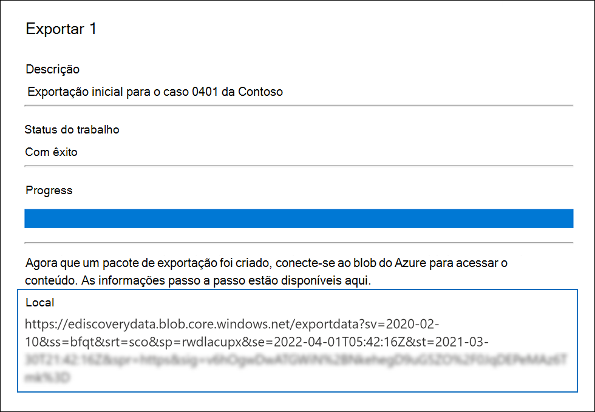
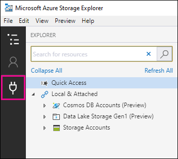
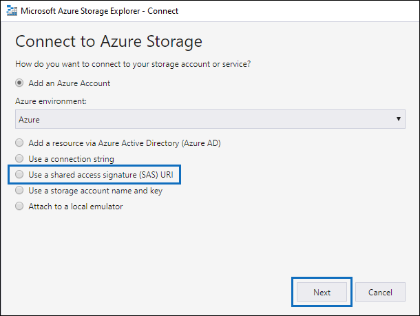
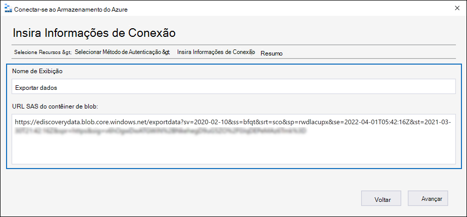
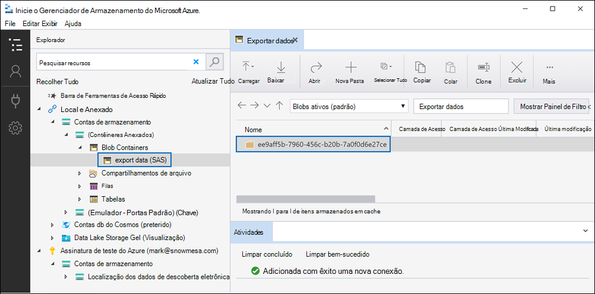
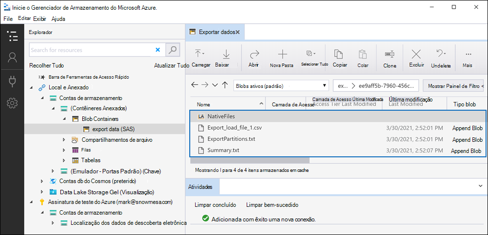

# Baixar trabalhos de exportação em uma caixa de descoberta eletrônica avançadaDownload export jobs in an Advanced eDiscovery case

Quando você exporta documentos de um conjunto de revisão em um caso de descoberta eletrônica avançada, os documentos são carregados em um local de armazenamento do Azure fornecido pela Microsoft ou em um local de armazenamento do Azure gerenciado por sua organização.When you export documents from a review set in an Advanced eDiscovery case, the documents are uploaded to a Microsoft-provided Azure Storage location or to an Azure Storage location managed by your organization. O tipo de local de armazenamento do Azure usado depende de qual opção foi selecionada quando os documentos foram exportados.The type of Azure Storage location used depends on which option was selected when the documents were exported.

Este artigo fornece instruções sobre como usar o Microsoft Azure Storage Explorer para se conectar a um local de armazenamento do Azure para navegar e baixar os documentos exportados.This article provides instructions for how to use the Microsoft Azure Storage Explorer to connect to an Azure Storage location to browse and download the exported documents. Para obter mais informações sobre o Azure Storage Explorer, consulte [QuickStart: Use Azure Storage Explorer](https://docs.microsoft.com/azure/storage/blobs/storage-quickstart-blobs-storage-explorer).For more information about Azure Storage Explorer, see [Quickstart: Use Azure Storage Explorer](https://docs.microsoft.com/azure/storage/blobs/storage-quickstart-blobs-storage-explorer).

## Etapa 1: instalar o Azure Storage ExplorerStep 1: Install the Azure Storage Explorer

A primeira etapa é baixar e instalar o Gerenciador de armazenamento do Azure.The first step is to download and install the Azure Storage Explorer. Para obter instruções, consulte [Azure Storage Explorer Tool](https://go.microsoft.com/fwlink/p/?LinkId=544842).For instructions, see [Azure Storage Explorer tool](https://go.microsoft.com/fwlink/p/?LinkId=544842). Use essa ferramenta para se conectar e baixar os documentos exportados na etapa 3.You use this tool to connect to and download the exported documents in Step 3.

## Etapa 2: obter a URL SAS do trabalho de exportaçãoStep 2: Obtain the SAS URL from the export job

A próxima etapa é obter a URL de assinatura de acesso compartilhado (SAS) gerada quando você criou o trabalho de exportação para [exportar documentos de um conjunto de revisão](export-documents-from-review-set.md).The next step is to obtain the shared access signature (SAS) URL that's generated when you created the export job to [export documents from a review set](export-documents-from-review-set.md). Você pode copiar a URL SAS para documentos que são carregados para um local de armazenamento do Azure fornecido pela Microsoft ou um local de armazenamento do Azure gerenciado por sua organização.You can copy the SAS URL for documents that are uploaded to a Microsoft-provided Azure Storage location or an Azure Storage location managed by your organization. Em ambos os casos, você usa a URL SAS para se conectar ao local de armazenamento do Azure na etapa 3.In either case, you use the SAS URL to connect to the Azure Storage location in Step 3.

1. Na página **descoberta eletrônica avançada** , vá para o caso e clique na guia **exportações** .On the **Advanced eDiscovery** page, go to the case, and then click the **Exports** tab.

2. Na guia **exportações** , clique no trabalho de exportação que você deseja baixar.On the **Exports** tab, click the export job that you want to download.

3. Na página do menu suspenso, em **locais**, copie a URL SAS que é exibida.On the flyout page, under **Locations**, copy the SAS URL that's displayed. Se necessário, você pode salvá-lo em um arquivo para que possa acessá-lo na etapa 3.If necessary, you can save it to a file so you can access it in Step 3.
 
   

## Etapa 3: conectar-se ao local de armazenamento do AzureStep 3: Connect to the Azure Storage location

A etapa final é usar o Gerenciador de armazenamento do Azure e a URL SAS para se conectar ao local de armazenamento do Azure e baixar os documentos que você exportou para um computador local.The final step is to use the Azure Storage Explorer and the SAS URL to connect to the Azure Storage location and download the documents that you exported to a local computer.

1. Abra o Azure Storage Explorer que você instalou na etapa 1.Open the Azure Storage Explorer that you installed in Step 1.

2. Clique no ícone **adicionar conta** .Click the **Add account** icon. Como alternativa, você pode clicar com o botão direito do mouse em **contas de armazenamento**.Alternatively, you can right-click **Storage Accounts**.

   

3. Na página **conectar ao Azure Storage** , clique em **usar um URI de assinatura de acesso compartilhado (SAS)** e, em seguida, clique em **Avançar**.On the **Connect to Azure Storage** page, click **Use a shared access signature (SAS) URI** and then click **Next**.

    

4. Na página **anexar com URI SAS** , clique na caixa URI e cole a URL SAS obtida na etapa 2.On the **Attach with SAS URI** page, click in the URI box, and then paste the SAS URL that you obtained in Step 2. 

    

    Observe que uma parte da URL SAS é exibida na caixa **nome para exibição** .Notice that a portion of the SAS URL is displayed in the **Display name** box. Ele será usado como o nome de exibição do contêiner que é criado nas contas de **armazenamento** depois que você se conecta ao local de armazenamento.This will be used as the display name of the container that's created under the **Storage accounts** after you connect to the storage location. Esse nome consiste na ID do caso de descoberta eletrônica avançada ser de um identificador exclusivo.This name consists of the ID of the Advanced eDiscovery case is from and a unique identifier. Você pode manter o nome de exibição padrão ou alterá-lo.You can keep the default display name or change it. Se você alterá-lo, o nome para exibição deverá ser exclusivo.If you change it, the display name must be unique.

5. Clique em **Avançar**.Click **Next**.

    A página de **Resumo de conexão** é exibida.The **Connection summary** page is displayed.

    

6. Na página **Resumo da conexão** , revise as informações de conexão e clique em **conectar**.On the **Connection summary** page, review the connection information, and then click **Connect**.

    O nó **contêineres blob** (em **contas**  >  **de armazenamento (contêineres anexados)** \> é aberto.The **Blob containers** node (under **Storage Accounts** > **(Attached Containers)** \> is opened.

    

    Ele contém um contêiner nomeado com o nome de exibição da etapa 4.It contains a container named with the display name from step 4. Este contêiner contém uma pasta para cada trabalho de exportação que você criou.This container contains a folder for each export job that you've created. Essas pastas são nomeadas com uma ID que corresponde à ID do trabalho de exportação.These folders are named with an ID that corresponds to the ID of the export job. Você pode encontrar essas IDs de exportação (e o nome da exportação) em **informações de suporte** na página de menu para cada um dos **dados de preparação do trabalho de exportação** listados na guia **trabalhos** .You can find these export IDs (and the name of the export) under **Support information** on the flyout page for each **Preparing data for export** job listed on the **Jobs** tab.

7. Clique duas vezes na pasta de trabalho de exportação para abri-la.Double-click the export job folder to open it.

   Uma lista de pastas e relatórios de exportação é exibida.A list of folders and export reports is displayed.
   
    

   A pasta de trabalho de exportação contém os itens a seguir.The export job folder contains the following items. Os itens reais na pasta de exportação são determinados pelas opções de exportação configuradas quando o trabalho de exportação foi criado.The actual items in the export folder are determined by the export options configured when the export job was created. Para obter mais informações, consulte [exportar documentos de um conjunto de revisão](export-documents-from-review-set.md).For more information, see [Export documents from a review set](export-documents-from-review-set.md).

    - Export_load_file.csv: este arquivo CSV é um relatório de exportação de detalhes que contém informações sobre cada documento exportado.Export_load_file.csv: This CSV file is a detail export report that contains information about each exported document. O arquivo consiste em uma coluna para cada propriedade de metadados de um documento.The file consists of a column for each metadata property for a document. Para obter uma lista e uma descrição dos metadados incluídos neste relatório, confira a coluna **nome do campo exportado** na tabela em [campos de metadados do documento na descoberta eletrônica avançada](document-metadata-fields.md).For a list and description of the metadata that's included in this report, see the **Exported field name** column in the table in [Document metadata fields in Advanced eDiscovery](document-metadata-fields.md).
    
    - Summary.txt: um arquivo de texto que contém um resumo da exportação incluindo as estatísticas de exportação.Summary.txt: A text file that contains a summary of the export including export statistics.
    
    - Extracted_text_files: esta pasta contém uma versão de arquivo de texto de cada documento exportado.Extracted_text_files: This folder contains a text file version of each exported document.
     
    - NativeFiles: esta pasta contém uma versão de arquivo nativo de cada documento exportado.NativeFiles: This folder contains a native file version of each exported document.
    
    - Error_files: esta pasta inclui os seguintes itens quando o trabalho de exportação contém qualquer arquivo de erro:Error_files: This folder includes the following items when the export job contains any error files: 
        
      - ExtractionError.csv: este arquivo CSV contém os metadados disponíveis para arquivos que não foram extraídos corretamente de seus itens pai.ExtractionError.csv: This CSV file contains the available metadata for files that weren't properly extracted from their parent item.
        
      - ProcessingError: esta pasta contém documentos com erros de processamento.ProcessingError: This folder contains documents with processing errors. Esse conteúdo está em um nível de item, o que significa que, se um anexo tiver um erro de processamento, o documento que contém o anexo também será incluído nessa pasta.This content is at an item level, which means if an attachment had a processing error, the document that contains the attachment will also be included in this folder.
 
8. Para exportar todo o conteúdo da exportação, selecione a pasta exportar e clique em **baixar**.To export all contents in the export, select the export folder, and then click **Download**.

9. Especifique o local onde você deseja baixar os arquivos exportados e clique em Selecionar pasta.Specify the location where you want to download the exported files, and then click Select folder.

    O explorador de armazenamento do Azure inicia o processo de exportação.The Azure Storage Explorer starts the export process. O status do download dos itens exportados é exibido no painel de **atividades** .The status of the downloading the exported items is displayed in the **Activities** pane. Uma mensagem é exibida quando o download é concluído.A message is displayed when the download is finished.

    

> [!NOTE]
> Em vez de baixar todo o trabalho de exportação, você pode selecionar itens específicos para baixar.Instead of downloading the entire export job, you can select specific items to download. E, em vez de baixar itens, você pode clicar duas vezes em um item para exibi-lo.And instead of downloading items, you can double-click an item to view it.
