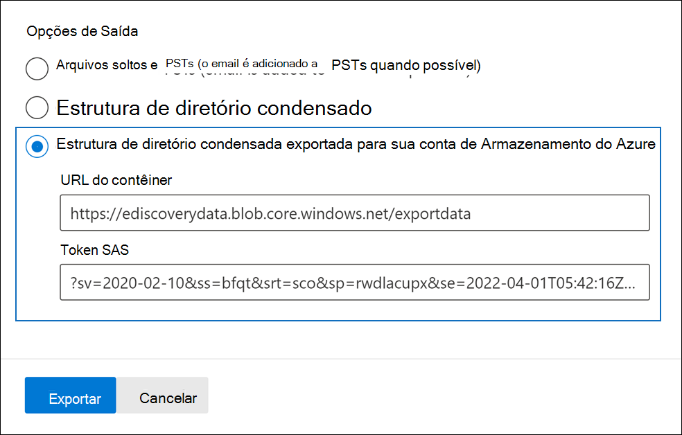

# Exportar documentos em um conjunto de revisão para uma conta Armazenamento Azure

Quando você exporta documentos de um conjunto de revisão em um caso Advanced eDiscovery, você tem a opção de exportá-los para uma conta do Azure Armazenamento gerenciada pela sua organização. Se você usou essa opção, os documentos serão carregados no local de Armazenamento do Azure. Depois que eles são exportados, você pode acessar os documentos (e baixá-los para um computador local ou outro local) usando o Gerenciador de Armazenamento do Azure. Este artigo fornece instruções sobre como exportar documentos para sua conta do Azure Armazenamento e o uso do Gerenciador de Armazenamento do Azure para se conectar a um local de Armazenamento do Azure para baixar os documentos exportados. Para obter mais informações sobre Gerenciador de Armazenamento do Azure, consulte [Use Gerenciador de Armazenamento do Azure](/azure/storage/blobs/storage-quickstart-blobs-storage-explorer).

## Antes de exportar documentos de um conjunto de revisão

- Você precisa fornecer um token de assinatura de acesso compartilhado (SAS) para sua conta do Azure Armazenamento e a URL de um contêiner específico na conta de armazenamento para exportar documentos de um conjunto de revisão. Certifique-se de que elas estão em mãos (por exemplo, copiadas para um arquivo de texto) ao executar a Etapa 2

  - **Token SAS**: Certifique-se de obter o token SAS é para sua conta de Armazenamento do Azure (e não para o contêiner). Você pode gerar um token SAS para sua conta no Azure Armazenamento. Para fazer isso, vá para a conta do Azure Armazenamento  e selecione Compartilhar assinatura de acesso sob as configurações Configurações na folha de conta de armazenamento.  Use as configurações padrão e permita todos os tipos de recursos ao gerar o token SAS.

  - **URL do contêiner:** você precisa criar um contêiner para carregar os documentos do conjunto de revisão e obter uma cópia da URL do contêiner; por exemplo, `https://ediscoverydata.blob.core.windows.net/exportdata` . Para obter a URL, vá para o contêiner no Azure Armazenamento e selecione **Propriedades** na seção Configurações **na** folha do contêiner.

- Baixe e instale o Gerenciador de Armazenamento do Azure. Para obter instruções, [consulte Gerenciador de Armazenamento do Azure ferramenta](https://go.microsoft.com/fwlink/p/?LinkId=544842). Use essa ferramenta para se conectar ao contêiner em sua conta do Azure Armazenamento e baixe os documentos exportados na Etapa 1.

## Etapa 1: Exportar os documentos de um conjunto de revisão

A primeira etapa é criar um trabalho de exportação para exportar documentos de um conjunto de revisão. Para obter instruções mais detalhadas sobre todas as opções de exportação, consulte [Exportar documentos de um conjunto de revisão](export-documents-from-review-set.md). O procedimento a seguir destaca as configurações para exportar documentos para a conta do Azure Armazenamento sua organização.

1. No centro Microsoft 365 de conformidade, abra o caso Advanced eDiscovery, selecione a guia Revisar conjuntos e selecione o conjunto de revisão que você deseja exportar. 

2. No conjunto de revisão, clique em **Ação**  >  **Exportar**.

3. Na página **Exportar opções,** digite um nome (obrigatório) e descrição (opcional) para a exportação.

4. Configure as configurações nas seções documentos, metadados, conteúdo e opções. Para obter mais informações sobre essas configurações, consulte [Exportar documentos de um conjunto de revisão](export-documents-from-review-set.md).

5. Na seção **Opções de saída,** selecione a estrutura de diretório condensada exportada para sua opção de Armazenamento **conta do Azure.**

6. Colar a URL do contêiner e o token SAS da sua conta de armazenamento nos campos correspondentes.

   

7. Clique **em Exportar** para criar o trabalho de exportação.

## Etapa 2: Obter a URL do SAS do trabalho de exportação

A próxima etapa é obter a URL do SAS gerada após criar o trabalho de exportação na Etapa 1. Você usa a URL do SAS para se conectar ao contêiner em sua conta do Azure Armazenamento que você exportou os documentos do conjunto de revisão.

1. Na página **Advanced eDiscovery,** vá para a ocorrência e clique na **guia Exportações.**

2. Na guia **Exportar**, clique no trabalho de exportação que você deseja baixar. Este é o trabalho de exportação que você criou na Etapa 1.

3. Na página sub-sub-texto, em **Locais**, copie a URL do SAS exibida. Se necessário, você pode salvá-lo em um arquivo de texto para poder acessá-lo na Etapa 3.

   

   > [!TIP]
   > A URL do SAS exibida no trabalho de exportação é uma concatenação da URL do contêiner e do token SAS da sua conta do Azure Armazenamento. Você pode copiá-lo do trabalho de exportação ou criar você mesmo combinando a URL e o token SAS.

## Etapa 3: Conexão para o contêiner de Armazenamento Azure

A etapa final é usar o Gerenciador de Armazenamento do Azure e a URL do SAS para se conectar ao contêiner em sua conta do Azure Armazenamento e baixar os documentos exportados para um computador local.

1. Inicie a Gerenciador de Armazenamento do Azure que você baixou e instalou.

2. Clique no **ícone Abrir Conexão Caixa de** Diálogo.

   

3. Na página **Conexão para o Azure Armazenamento,** clique em **Blob container**.

4. Na página **Selecionar Método de Autenticação,** selecione a opção Assinatura de Acesso **Compartilhado (SAS)** e clique em **Próximo**.

5. Na página **Inserir Informações de** Conexão, colar a URL do SAS (obtida no trabalho de exportação na Etapa 2) na caixa URL do SAS do Contêiner de **Blob.**

    

    Observe que o nome do contêiner é exibido na caixa **Nome de** exibição. Você pode editar esse nome.

6. Clique **em Próximo** para exibir a página **de** resumo e clique em **Conexão**.

    O **nó contêineres Blob** **(em Armazenamento Contas**  >  **(Contêineres Anexados)** é \> aberto.

    

    Ele contém um contêiner chamado com o nome de exibição da etapa 5. Esse contêiner contém uma pasta para cada trabalho de exportação que você baixou para o contêiner em sua conta do Azure Armazenamento. Essas pastas são nomeadas com uma ID que corresponde à ID do trabalho de exportação. Você pode encontrar essas IDs de exportação (e o nome da exportação) em Informações de suporte na página sub-sublta para cada Preparação de dados para o trabalho de exportação listados na guia **Trabalhos** no caso Advanced eDiscovery.  

7. Clique duas vezes na pasta de trabalho de exportação para abri-la.

   Uma lista de pastas e relatórios de exportação é exibida.

    

8. Para exportar todo o conteúdo do  trabalho de exportação, clique na seta Para cima para voltar à pasta de trabalho de exportação e clique em **Baixar**.

9. Especifique o local para onde você deseja baixar os arquivos exportados e clique em Selecionar pasta.

    A Gerenciador de Armazenamento do Azure inicia o processo de download. O status do download dos itens exportados é exibido no painel **Atividades.** Uma mensagem é exibida quando o download é concluído.

> [!NOTE]
> Em vez de baixar todo o trabalho de exportação no Gerenciador de Armazenamento do Azure, você pode selecionar itens específicos para baixar e exibir.

## Mais informações

- A pasta de trabalho de exportação contém os itens a seguir. Os itens reais na pasta de exportação são determinados pelas opções de exportação configuradas quando o trabalho de exportação foi criado. Para obter mais informações sobre essas opções, consulte [Exportar documentos de um conjunto de revisão](export-documents-from-review-set.md).

  - Export_load_file.csv: esse arquivo CSV é um relatório de exportação detalhado que contém informações sobre cada documento exportado. O arquivo consiste em uma coluna para cada propriedade de metadados de um documento. Para uma lista e descrição dos metadados incluídos neste relatório, consulte a coluna **Nome** do campo exportado na tabela em Campos de metadados de documento [em Advanced eDiscovery](document-metadata-fields-in-advanced-ediscovery.md).

  - Summary.txt: um arquivo de texto que contém um resumo da exportação, incluindo estatísticas de exportação.

  - Extracted_text_files: esta pasta contém uma versão de arquivo de texto de cada documento exportado.

  - NativeFiles: esta pasta contém uma versão de arquivo nativa de cada documento exportado.

  - Error_files: essa pasta inclui os seguintes itens quando o trabalho de exportação contém arquivos de erro:

    - ExtractionError.csv: esse arquivo CSV contém os metadados disponíveis para arquivos que não foram extraídos corretamente do item pai.

    - ProcessingError: esta pasta contém documentos com erros de processamento. Esse conteúdo está em um nível de item, o que significa que se um anexo tiver um erro de processamento, o documento que contém o anexo também será incluído nessa pasta.
