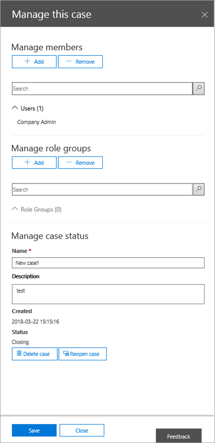

# <a name="ediscovery-cases-in-the-security--compliance-center"></a><span data-ttu-id="05cee-105">ocorrências de descoberta eletrônica no centro de conformidade & segurança</span><span class="sxs-lookup"><span data-stu-id="05cee-105">eDiscovery cases in the Security & Compliance Center</span></span>

<span data-ttu-id="05cee-106">Você pode usar casos de descoberta eletrônica no centro de conformidade no Office 365 e no Microsoft 365 para controlar quem pode criar, acessar e gerenciar casos de descoberta eletrônica em sua organização.</span><span class="sxs-lookup"><span data-stu-id="05cee-106">You can use eDiscovery cases in the compliance center in Office 365 and Microsoft 365 to control who can create, access, and manage eDiscovery cases in your organization.</span></span> <span data-ttu-id="05cee-107">Se sua organização tiver uma assinatura do Office 365 e5, você também poderá usar casos de descoberta eletrônica para analisar os resultados da pesquisa usando a descoberta eletrônica avançada do Office 365.</span><span class="sxs-lookup"><span data-stu-id="05cee-107">If your organization has an Office 365 E5 subscription, you can also use eDiscovery cases to analyze search results by using Office 365 Advanced eDiscovery.</span></span>
  
<span data-ttu-id="05cee-108">Uma ocorrência de Descoberta Eletrônica permite a você adicionar membros a uma ocorrência, controlar que tipos de ações os membros dessa ocorrência específica podem realizar, colocar em retenção locais de conteúdo relevantes para um caso jurídico e associar várias Pesquisas de Conteúdo com uma única ocorrência.</span><span class="sxs-lookup"><span data-stu-id="05cee-108">An eDiscovery case allows you to add members to a case, control what types of actions that specific case members can perform, place a hold on content locations relevant to a legal case, and associate multiple Content Searches with a single case.</span></span> <span data-ttu-id="05cee-109">Você também pode exportar os resultados de qualquer pesquisa de conteúdo associada a um caso ou preparar resultados de pesquisa para análise na descoberta eletrônica avançada.</span><span class="sxs-lookup"><span data-stu-id="05cee-109">You can also export the results of any Content Search that is associated with a case or prepare search results for analysis in Advanced eDiscovery.</span></span> <span data-ttu-id="05cee-110">As ocorrências de Descoberta Eletrônica são uma boa maneira de limitar quem tem acesso às Pesquisas de Conteúdo e aos resultados da pesquisa de um caso jurídico específico na sua organização.</span><span class="sxs-lookup"><span data-stu-id="05cee-110">eDiscovery cases are a good way to limit who has access to Content Searches and search results for a specific legal case in your organization.</span></span>
  
<span data-ttu-id="05cee-111">Use o fluxo de trabalho a seguir para configurar e usar casos de descoberta eletrônica no centro de conformidade e segurança & e descoberta eletrônica avançada.</span><span class="sxs-lookup"><span data-stu-id="05cee-111">Use the following workflow to set up and use eDiscovery cases in the Security & Compliance Center and Advanced eDiscovery.</span></span>

[<span data-ttu-id="05cee-112">Step 1: Assign eDiscovery permissions to potential case members</span><span class="sxs-lookup"><span data-stu-id="05cee-112">Step 1: Assign eDiscovery permissions to potential case members</span></span>](#step-1-assign-ediscovery-permissions-to-potential-case-members)

[<span data-ttu-id="05cee-113">Etapa 2: criar um novo caso</span><span class="sxs-lookup"><span data-stu-id="05cee-113">Step 2: Create a new case</span></span>](#step-2-create-a-new-case)

[<span data-ttu-id="05cee-114">Etapa 3: adicionar membros a uma ocorrência</span><span class="sxs-lookup"><span data-stu-id="05cee-114">Step 3: Add members to a case</span></span>](#step-3-add-members-to-a-case)

[<span data-ttu-id="05cee-115">Etapa 4: colocar os locais de conteúdo em espera</span><span class="sxs-lookup"><span data-stu-id="05cee-115">Step 4: Place content locations on hold</span></span>](#step-4-place-content-locations-on-hold)

[<span data-ttu-id="05cee-116">Etapa 5: criar e executar uma pesquisa de conteúdo associada a uma ocorrência</span><span class="sxs-lookup"><span data-stu-id="05cee-116">Step 5: Create and run a Content Search associated with a case</span></span>](#step-5-create-and-run-a-content-search-associated-with-a-case)

[<span data-ttu-id="05cee-117">Etapa 6: exportar os resultados de uma pesquisa de conteúdo associada a uma ocorrência</span><span class="sxs-lookup"><span data-stu-id="05cee-117">Step 6: Export the results of a Content Search associated with a case</span></span>](#step-6-export-the-results-of-a-content-search-associated-with-a-case)

[<span data-ttu-id="05cee-118">Etapa 7: preparar resultados de pesquisa para descoberta eletrônica avançada</span><span class="sxs-lookup"><span data-stu-id="05cee-118">Step 7: Prepare search results for Advanced eDiscovery</span></span>](#step-7-prepare-search-results-for-advanced-ediscovery)

[<span data-ttu-id="05cee-119">Etapa 8: ir para o caso na descoberta eletrônica avançada</span><span class="sxs-lookup"><span data-stu-id="05cee-119">Step 8: Go to the case in Advanced eDiscovery</span></span>](#step-8-go-to-the-case-in-advanced-ediscovery)

[<span data-ttu-id="05cee-120">Opcion Etapa 9: fechar uma ocorrência</span><span class="sxs-lookup"><span data-stu-id="05cee-120">(Optional) Step 9: Close a case</span></span>](#optional-step-9-close-a-case)

[<span data-ttu-id="05cee-121">Opcion Etapa 10: abrir novamente uma ocorrência fechada</span><span class="sxs-lookup"><span data-stu-id="05cee-121">(Optional) Step 10: Re-open a closed case</span></span>](#optional-step-10-re-open-a-closed-case)

[<span data-ttu-id="05cee-122">Mais informações</span><span class="sxs-lookup"><span data-stu-id="05cee-122">More information</span></span>](#more-information)
  
## <a name="step-1-assign-ediscovery-permissions-to-potential-case-members"></a><span data-ttu-id="05cee-123">Etapa 1: atribuir permissões de Descoberta Eletrônica para possíveis membros da ocorrência</span><span class="sxs-lookup"><span data-stu-id="05cee-123">Step 1: Assign eDiscovery permissions to potential case members</span></span>

<span data-ttu-id="05cee-124">A primeira etapa é atribuir as permissões relacionadas à descoberta eletrônica apropriadas às pessoas para que você possa adicioná-las a um caso de descoberta eletrônica na etapa 2.</span><span class="sxs-lookup"><span data-stu-id="05cee-124">The first step is to assign the appropriate eDiscovery-related permissions to people so you can add them to an eDiscovery case in Step 2.</span></span> <span data-ttu-id="05cee-125">Você precisa ser membro do grupo de função gerenciamento da organização (ou receber a função de gerenciamento de função) no centro de conformidade & segurança para atribuir permissões de descoberta eletrônica.</span><span class="sxs-lookup"><span data-stu-id="05cee-125">You have to be a member of the Organization Management role group (or be assigned the Role Management role) in the Security & Compliance Center to assign eDiscovery permissions.</span></span> <span data-ttu-id="05cee-126">A lista a seguir descreve os grupos de função relacionados à descoberta eletrônica no centro de conformidade de & de segurança.</span><span class="sxs-lookup"><span data-stu-id="05cee-126">The following list describes the eDiscovery-related role groups in the Security & Compliance Center.</span></span> 
  
- <span data-ttu-id="05cee-127">**Revisor.**</span><span class="sxs-lookup"><span data-stu-id="05cee-127">**Reviewer.**</span></span> <span data-ttu-id="05cee-128">Esse grupo de função tem as permissões mais restritivas relacionadas a Descoberta Eletrônica.</span><span class="sxs-lookup"><span data-stu-id="05cee-128">This role group has the most restrictive eDiscovery-related permissions.</span></span> <span data-ttu-id="05cee-129">O principal objetivo desse grupo de função é permitir que os membros exibam e acessem dados de ocorrência no [Office 365 descoberta eletrônica avançada](office-365-advanced-ediscovery.md) (também conhecido como *descoberta eletrônica avançada v1*).</span><span class="sxs-lookup"><span data-stu-id="05cee-129">The primary purpose of this role group is to allow members to view and access case data in [Office 365 Advanced eDiscovery](office-365-advanced-ediscovery.md) (also known as *Advanced eDiscovery v1*).</span></span> <span data-ttu-id="05cee-130">Os membros desse grupo só podem ver e abrir a lista de casos na página **descoberta eletrônica** no centro de conformidade de & de segurança do qual eles são membros.</span><span class="sxs-lookup"><span data-stu-id="05cee-130">Members of this group can only see and open the list of the cases on the **eDiscovery** page in the Security & Compliance Center that they are members of.</span></span> <span data-ttu-id="05cee-131">Depois que o usuário acessa um caso no centro de segurança e conformidade, ele pode clicar em **alternar para descoberta eletrônica avançada** para acessar e analisar os dados do caso na descoberta eletrônica avançada.</span><span class="sxs-lookup"><span data-stu-id="05cee-131">After the user accesses a case in the security and compliance center, they can click **Switch to Advanced eDiscovery** to access and analyze the case data in Advanced eDiscovery.</span></span> <span data-ttu-id="05cee-132">Eles não podem criar casos, adicionar membros a uma ocorrência, criar isenções, criar pesquisas, Visualizar resultados de pesquisa, exportar resultados de pesquisa ou preparar resultados para descoberta eletrônica avançada.</span><span class="sxs-lookup"><span data-stu-id="05cee-132">They can't create cases, add members to a case, create holds, create searches, preview search results, export search results, or prepare results for Advanced eDiscovery.</span></span> 

   > [!NOTE]
   > <span data-ttu-id="05cee-133">No momento, os usuários que são membros do grupo de funções revisor não podem acessar dados na [descoberta eletrônica avançada no Microsoft 365](overview-ediscovery-20.md) (também conhecido como *descoberta eletrônica avançada v2*).</span><span class="sxs-lookup"><span data-stu-id="05cee-133">At this time, users who are member of the Reviewer role group can't access data in [Advanced eDiscovery in Microsoft 365](overview-ediscovery-20.md) (also known as *Advanced eDiscovery v2*).</span></span> <span data-ttu-id="05cee-134">Para adicionar membros a um caso na descoberta eletrônica avançada v2 para que eles possam revisar os dados do caso, um usuário deve ser membro do grupo de função Gerenciador de descoberta eletrônica.</span><span class="sxs-lookup"><span data-stu-id="05cee-134">To add members to a case in Advanced eDiscovery v2 so that they can review case data, a user must be a member of the eDiscovery Manager role group.</span></span>
    
- <span data-ttu-id="05cee-135">**Gerenciador de descoberta eletrônica.**</span><span class="sxs-lookup"><span data-stu-id="05cee-135">**eDiscovery Manager.**</span></span> <span data-ttu-id="05cee-136">Os membros deste grupo de função podem criar e gerenciar ocorrências de Descoberta Eletrônica.</span><span class="sxs-lookup"><span data-stu-id="05cee-136">Members of this role group can create and manage eDiscovery cases.</span></span> <span data-ttu-id="05cee-137">Eles podem adicionar e remover membros, colocar os locais de conteúdo em espera, criar e editar pesquisas de conteúdo associadas a uma ocorrência, exportar os resultados de uma pesquisa de conteúdo e preparar resultados de pesquisa para análise na descoberta eletrônica avançada.</span><span class="sxs-lookup"><span data-stu-id="05cee-137">They can add and remove members, place content locations on hold, create and edit Content Searches associated with a case, export the results of a Content Search, and prepare search results for analysis in Advanced eDiscovery.</span></span> <span data-ttu-id="05cee-138">Há dois subgrupos nesse grupo de funções.</span><span class="sxs-lookup"><span data-stu-id="05cee-138">There are two subgroups in this role group.</span></span> <span data-ttu-id="05cee-139">A diferença entre esses subgrupos está no escopo.</span><span class="sxs-lookup"><span data-stu-id="05cee-139">The difference between these subgroups is based on scope.</span></span>
    
  - <span data-ttu-id="05cee-140">**Gerenciador de descoberta eletrônica.**</span><span class="sxs-lookup"><span data-stu-id="05cee-140">**eDiscovery Manager.**</span></span> <span data-ttu-id="05cee-141">Pode exibir ou gerenciar ocorrências de Descoberta Eletrônica criadas por ele ou das quais ele seja membro.</span><span class="sxs-lookup"><span data-stu-id="05cee-141">Can view and manage the eDiscovery cases they create or are a member of.</span></span> <span data-ttu-id="05cee-142">Se outro gerenciador de descoberta eletrônica criar uma ocorrência, mas não adicionar um segundo Gerenciador de descoberta eletrônica como membro desse caso, o segundo Gerenciador de descoberta eletrônica não poderá exibir ou abrir o caso na página **descoberta eletrônica** no centro de conformidade de segurança &.</span><span class="sxs-lookup"><span data-stu-id="05cee-142">If another eDiscovery Manager creates a case but doesn't add a second eDiscovery Manager as a member of that case, the second eDiscovery Manager won't be able to view or open the case on the **eDiscovery** page in the Security & Compliance Center.</span></span> <span data-ttu-id="05cee-143">Os gerentes de descoberta eletrônica também podem acessar seus casos na descoberta eletrônica avançada para executar tarefas de análise.</span><span class="sxs-lookup"><span data-stu-id="05cee-143">eDiscovery Managers can also access their cases in Advanced eDiscovery to perform analysis tasks.</span></span> 
    
  - <span data-ttu-id="05cee-144">\**Administrador de descoberta eletrônica *.**</span><span class="sxs-lookup"><span data-stu-id="05cee-144">**eDiscovery Administrator\*.**</span></span> <span data-ttu-id="05cee-145">Pode executar todas as tarefas de gerenciamento de ocorrências que um Gerente de Descoberta Eletrônica pode fazer.</span><span class="sxs-lookup"><span data-stu-id="05cee-145">Can perform all case management tasks that an eDiscovery Manager can do.</span></span> <span data-ttu-id="05cee-146">Além disso, um Administrador de Descoberta Eletrônica pode:</span><span class="sxs-lookup"><span data-stu-id="05cee-146">Additionally, an eDiscovery Administrator can:</span></span>
    
    - <span data-ttu-id="05cee-147">Exibir todas as ocorrências listadas na página **Descoberta Eletrônica**.</span><span class="sxs-lookup"><span data-stu-id="05cee-147">View all cases that are listed on the **eDiscovery** page.</span></span> 
    
    - <span data-ttu-id="05cee-148">Gerencie qualquer caso na organização depois que eles se adicionarem como um membro do caso.</span><span class="sxs-lookup"><span data-stu-id="05cee-148">Manage any case in the organization after they add themself as a member of the case.</span></span>
    
    - <span data-ttu-id="05cee-149">Acessar dados de caso na descoberta eletrônica avançada para qualquer caso na organização.</span><span class="sxs-lookup"><span data-stu-id="05cee-149">Access case data in Advanced eDiscovery for any case in the organization.</span></span>
    
    <span data-ttu-id="05cee-150">Consulte a seção [More information](#more-information) para conhecer os motivos pelos quais convém ter um Administrador de Descoberta Eletrônica em sua organização.</span><span class="sxs-lookup"><span data-stu-id="05cee-150">See the [More information](#more-information) section for reasons why you may want an eDiscovery Administrator in your organization.</span></span> 
    
> [!IMPORTANT]
> <span data-ttu-id="05cee-151">Se uma pessoa não for membro de um destes grupos de função relacionados à descoberta eletrônica ou se não for um membro de um grupo de função atribuído à função revisor, você não poderá adicioná-los como um membro de uma ocorrência de descoberta eletrônica.</span><span class="sxs-lookup"><span data-stu-id="05cee-151">If a person isn't a member of one of these eDiscovery-related role groups, or isn't a member of a role group that's assigned the Reviewer role, you can't add them as a member of an eDiscovery case.</span></span> 

<span data-ttu-id="05cee-152">Para obter mais informações sobre permissões de descoberta eletrônica, consulte [atribuir permissões de descoberta eletrônica](assign-ediscovery-permissions.md).</span><span class="sxs-lookup"><span data-stu-id="05cee-152">For more information about eDiscovery permissions, see [Assign eDiscovery permissions](assign-ediscovery-permissions.md).</span></span>
  
 <span data-ttu-id="05cee-153">**Para atribuir as permissões de Descoberta Eletrônica:**</span><span class="sxs-lookup"><span data-stu-id="05cee-153">**To assign eDiscovery permissions:**</span></span>
  
1. <span data-ttu-id="05cee-154">Acesse [https://protection.office.com](https://protection.office.com).</span><span class="sxs-lookup"><span data-stu-id="05cee-154">Go to [https://protection.office.com](https://protection.office.com).</span></span>
    
2. <span data-ttu-id="05cee-155">Entre no Office 365 usando a sua conta corporativa ou de estudante.</span><span class="sxs-lookup"><span data-stu-id="05cee-155">Sign in to Office 365 using your work or school account.</span></span>
    
3. <span data-ttu-id="05cee-156">No centro de conformidade & segurança, clique em **permissões**e siga um destes procedimentos com base nas permissões de descoberta eletrônica que você deseja atribuir.</span><span class="sxs-lookup"><span data-stu-id="05cee-156">In the Security & Compliance Center, click **Permissions**, and then do one of the following based on the eDiscovery permissions that you want to assign.</span></span>
    
    - <span data-ttu-id="05cee-157">Para atribuir permissões de revisor, selecione o grupo de função **revisor** e, em seguida, ao lado de **Membros**, clique em **Editar**.</span><span class="sxs-lookup"><span data-stu-id="05cee-157">To assign Reviewer permissions, select the **Reviewer** role group, and then next to **Members**, click **Edit**.</span></span> <span data-ttu-id="05cee-158">Clique **em escolher Membros**, \*\*\*\* clique em Editar  em Adicionar ícone **Adicionar**, selecione o usuário que você deseja adicionar ao grupo de funções revisor e clique em **Adicionar**.</span><span class="sxs-lookup"><span data-stu-id="05cee-158">Click **Choose members**, click **Edit**, click  **Add**, select the user that you want to add to the Reviewer role group, and then click **Add**.</span></span>
    
    - <span data-ttu-id="05cee-159">Para atribuir permissões de gerente de descoberta eletrônica, selecione o grupo de funções **Gerenciador de descoberta eletrônica** e, em seguida, ao lado de **Gerenciador de descoberta eletrônica**, clique em **Editar**</span><span class="sxs-lookup"><span data-stu-id="05cee-159">To assign eDiscovery Manager permissions, select the **eDiscovery Manager** role group, and then next to **eDiscovery Manager**, click **Edit**.</span></span> <span data-ttu-id="05cee-160">Clique **em escolher o Gerenciador de descoberta eletrônica**,  **Editar**, em Adicionar ícone \* \* Adicionar \* \*, selecione o usuário que você deseja adicionar como um Gerenciador de descoberta eletrônica e clique em **Adicionar**.</span><span class="sxs-lookup"><span data-stu-id="05cee-160">Click **Choose eDiscovery Manager**, click **Edit**, click  \*\* Add \*\*, select the user that you want to add as an eDiscovery Manager, and then click **Add**.</span></span>
    
    - <span data-ttu-id="05cee-161">Para atribuir permissões de administrador de descoberta eletrônica, selecione o grupo de função **Gerenciador de descoberta eletrônica** e ao lado de **administrador de descoberta eletrônica**, clique em **Editar**.</span><span class="sxs-lookup"><span data-stu-id="05cee-161">To assign eDiscovery Administrator permissions, select the **eDiscovery Manager** role group, and then next to **eDiscovery Administrator**, click **Edit**.</span></span> <span data-ttu-id="05cee-162">Clique em **escolher administrador de descoberta eletrônica**, em  em Adicionar ícone **Adicionar**, selecione o usuário que você deseja adicionar como administrador de descoberta eletrônica e clique em **Adicionar**.</span><span class="sxs-lookup"><span data-stu-id="05cee-162">Click **Choose eDiscovery Administrator**, click **Edit**, click  **Add**, select the user that you want to add as an eDiscovery Administrator, and then click **Add**.</span></span>
    
4. <span data-ttu-id="05cee-163">Depois de adicionar todos os usuários, clique em **concluído**, clique em **salvar** para salvar as alterações no grupo de função e, em seguida, clique em **Fechar**.</span><span class="sxs-lookup"><span data-stu-id="05cee-163">After you've added all the users, click **Done**, click **Save** to save the changes to the role group, and then click **Close**.</span></span>

## <a name="step-2-create-a-new-case"></a><span data-ttu-id="05cee-164">Etapa 2: criar um novo caso</span><span class="sxs-lookup"><span data-stu-id="05cee-164">Step 2: Create a new case</span></span>

<span data-ttu-id="05cee-165">A próxima etapa é criar uma ocorrência de descoberta eletrônica.</span><span class="sxs-lookup"><span data-stu-id="05cee-165">The next step is to create a eDiscovery case.</span></span> <span data-ttu-id="05cee-166">Você deve ser membro do grupo de função Gerente de Descoberta Eletrônica para criar ocorrências de Descoberta Eletrônica.</span><span class="sxs-lookup"><span data-stu-id="05cee-166">You must be a member of the eDiscovery Managers role group to create eDiscovery cases.</span></span> <span data-ttu-id="05cee-167">Conforme explicado anteriormente, depois de criar um caso no centro de conformidade com segurança &, você (e outros membros de caso) poderão acessar o mesmo caso na descoberta eletrônica avançada, se sua organização tiver uma assinatura do Office 365 e5.</span><span class="sxs-lookup"><span data-stu-id="05cee-167">As previously explained, after you create a case in the Security & Compliance Center, you (and other case members) will be able to access that same case in Advanced eDiscovery if your organization has an Office 365 E5 subscription.</span></span>
  
1. <span data-ttu-id="05cee-168">Acesse [https://protection.office.com](https://protection.office.com).</span><span class="sxs-lookup"><span data-stu-id="05cee-168">Go to [https://protection.office.com](https://protection.office.com).</span></span>
    
2. <span data-ttu-id="05cee-169">Entre no Office 365 usando a sua conta corporativa ou de estudante.</span><span class="sxs-lookup"><span data-stu-id="05cee-169">Sign in to Office 365 using your work or school account.</span></span>
    
3. <span data-ttu-id="05cee-170">No centro de conformidade & segurança, clique em **descoberta**  **criar uma ocorrência**.</span><span class="sxs-lookup"><span data-stu-id="05cee-170">In the Security & Compliance Center, click **eDiscovery** \> **eDiscovery**, and then click  **Create a case**.</span></span>
    
4. <span data-ttu-id="05cee-171">Na página **nova ocorrência** , dê um nome à caixa, digite uma descrição opcional e clique em **salvar**.</span><span class="sxs-lookup"><span data-stu-id="05cee-171">On the **New Case** page, give the case a name, type an optional description, and then click **Save**.</span></span> <span data-ttu-id="05cee-172">O nome da ocorrência deve ser exclusivo em sua organização.</span><span class="sxs-lookup"><span data-stu-id="05cee-172">The case name must be unique in your organization.</span></span>
    
    
  
    <span data-ttu-id="05cee-174">O novo caso é exibido na lista de casos na página de **descoberta eletrônica** .</span><span class="sxs-lookup"><span data-stu-id="05cee-174">The new case is displayed in the list of cases on the **eDiscovery** page.</span></span> <span data-ttu-id="05cee-175">Você pode passar o cursor do mouse sobre um nome de caso para exibir informações sobre o caso, incluindo o status da ocorrência (**ativa** ou **fechada**), a descrição do caso (que foi criada na etapa anterior) e quando o caso foi alterado por último e quem a alterou.</span><span class="sxs-lookup"><span data-stu-id="05cee-175">You can hover the cursor over a case name to display information about the case, including the status of the case (**Active** or **Closed**), the description of the case (that was created in the previous step), and when the case was changed last and who changed it.</span></span>
    
    > [!TIP]
    > <span data-ttu-id="05cee-176">Depois de criar um novo caso, você pode renomeá-lo a qualquer momento.</span><span class="sxs-lookup"><span data-stu-id="05cee-176">After you create a new case, you can rename it anytime.</span></span> <span data-ttu-id="05cee-177">Basta clicar no nome do caso na página de **descoberta eletrônica** .</span><span class="sxs-lookup"><span data-stu-id="05cee-177">Just click the name of the case on the **eDiscovery** page.</span></span> <span data-ttu-id="05cee-178">Na página **gerenciar este** submenu de caso, altere o nome exibido na caixa em **nome**e salve a alteração.</span><span class="sxs-lookup"><span data-stu-id="05cee-178">On the **Manage this case** flyout page, change the name displayed in the box under **Name**, and then save the change.</span></span> 
  
## <a name="step-3-add-members-to-a-case"></a><span data-ttu-id="05cee-179">Etapa 3: adicionar membros a uma ocorrência</span><span class="sxs-lookup"><span data-stu-id="05cee-179">Step 3: Add members to a case</span></span>

<span data-ttu-id="05cee-180">Após criar uma ocorrência, a próxima etapa é adicionar membros à ocorrência.</span><span class="sxs-lookup"><span data-stu-id="05cee-180">After you create a case, the next step is to add members to the case.</span></span> <span data-ttu-id="05cee-181">Como explicado anteriormente, somente usuários que são membros dos grupos de função revisor ou Gerenciador de descoberta eletrônica podem ser adicionados como membros da ocorrência.</span><span class="sxs-lookup"><span data-stu-id="05cee-181">As previous explained, only users who are members of the Reviewer or eDiscovery Manager role groups can be added as members of the case.</span></span> <span data-ttu-id="05cee-182">O Gerenciador de descoberta eletrônica que criou o caso é automaticamente adicionado como um membro.</span><span class="sxs-lookup"><span data-stu-id="05cee-182">The eDiscovery Manager who created the case is automatically added as a member.</span></span>
  
1. <span data-ttu-id="05cee-183">No centro de conformidade & segurança **, clique em** \> **descoberta** eletrônica eletrônica para exibir a lista de casos em sua organização.</span><span class="sxs-lookup"><span data-stu-id="05cee-183">In the Security & Compliance Center, click **eDiscovery** \> **eDiscovery** to display the list of cases in your organization.</span></span> 
    
2. <span data-ttu-id="05cee-184">Clique no nome do caso para o qual você deseja adicionar membros.</span><span class="sxs-lookup"><span data-stu-id="05cee-184">Click the name of the case that you want to add members to.</span></span>
    
    <span data-ttu-id="05cee-185">A página **gerenciar esse** submenu de caso é exibida.</span><span class="sxs-lookup"><span data-stu-id="05cee-185">The **Manage this case** flyout page is displayed.</span></span> 
    
    
  
3. <span data-ttu-id="05cee-187">Em **gerenciar Membros**, clique  ícone **Adicionar** para adicionar membros à ocorrência.</span><span class="sxs-lookup"><span data-stu-id="05cee-187">Under **Manage members**, click  **Add** to add members to the case.</span></span> 
    
    <span data-ttu-id="05cee-188">Você também pode optar por adicionar um grupo de funções ao caso.</span><span class="sxs-lookup"><span data-stu-id="05cee-188">You can also choose to add a role group to the case.</span></span> <span data-ttu-id="05cee-189">Em **gerenciar grupos de função**,  adicionar ícone **Adicionar**.</span><span class="sxs-lookup"><span data-stu-id="05cee-189">Under **Manage role groups**, click  **Add**.</span></span>
    
    > [!NOTE]
    > <span data-ttu-id="05cee-190">Grupos de função controle quem pode atribuir membros a uma ocorrência de descoberta eletrônica.</span><span class="sxs-lookup"><span data-stu-id="05cee-190">Role groups control who can assign members to an eDiscovery case.</span></span> <span data-ttu-id="05cee-191">Isso significa que você só pode atribuir os grupos de função que você é membro de um caso.</span><span class="sxs-lookup"><span data-stu-id="05cee-191">That means you can only assign the role groups that you are a member of to a case.</span></span>
    
4. <span data-ttu-id="05cee-192">Na lista de pessoas ou grupos de funções que podem ser adicionados como membros do caso, clique na caixa de seleção ao lado dos nomes das pessoas ou grupos de função que você deseja adicionar.</span><span class="sxs-lookup"><span data-stu-id="05cee-192">In the list of people or role groups that can be added as members of the case, click the check box next to the names of the people or role groups that you want to add.</span></span>
    
    > [!TIP]
    > <span data-ttu-id="05cee-193">Se você tiver uma lista grande de pessoas que podem ser adicionadas como membros, use a caixa **Pesquisar** para procurar uma pessoa específica na lista.</span><span class="sxs-lookup"><span data-stu-id="05cee-193">If you have a large list of people who can added as members, use the **Search** box to search for a specific person in the list.</span></span> 
  
5. <span data-ttu-id="05cee-194">Depois de selecionar as pessoas ou os grupos de funções a serem adicionados como membros do grupo, clique em **Adicionar**.</span><span class="sxs-lookup"><span data-stu-id="05cee-194">After you've selected the people or role groups to add as members of the group, click **Add**.</span></span>
    
    <span data-ttu-id="05cee-195">Em **gerenciar este caso**, clique em **salvar** para salvar a nova lista de membros de caso.</span><span class="sxs-lookup"><span data-stu-id="05cee-195">In **Manage this case**, click **Save** to save the new list of case members.</span></span> 
    
6. <span data-ttu-id="05cee-196">Clique em **salvar** para salvar a nova lista de membros de caso.</span><span class="sxs-lookup"><span data-stu-id="05cee-196">Click **Save** to save the new list of case members.</span></span> 
  
## <a name="step-4-place-content-locations-on-hold"></a><span data-ttu-id="05cee-197">Etapa 4: colocar os locais de conteúdo em espera</span><span class="sxs-lookup"><span data-stu-id="05cee-197">Step 4: Place content locations on hold</span></span>

<span data-ttu-id="05cee-198">Você pode usar uma ocorrência de Descoberta Eletrônica para criar retenções e preservar conteúdo que possa ser relevante para a ocorrência.</span><span class="sxs-lookup"><span data-stu-id="05cee-198">You can use an eDiscovery case to create holds to preserve content that might be relevant to the case.</span></span> <span data-ttu-id="05cee-199">Você pode colocar uma retenção nas caixas de correio e nos sites do OneDrive for Business de pessoas que são responsáveis pelo caso.</span><span class="sxs-lookup"><span data-stu-id="05cee-199">You can place a hold on the mailboxes and OneDrive for Business sites of people who are custodians in the case.</span></span> <span data-ttu-id="05cee-200">Você também pode colocar uma retenção na caixa de correio de grupo, site do SharePoint e no OneDrive for Business para um grupo do Office 365.</span><span class="sxs-lookup"><span data-stu-id="05cee-200">You can also place a hold on the group mailbox, SharePoint site, and OneDrive for Business site for an Office 365 Group.</span></span> <span data-ttu-id="05cee-201">Da mesma forma, você pode colocar uma retenção na caixa de correio e no site associados ao Microsoft Teams.</span><span class="sxs-lookup"><span data-stu-id="05cee-201">Similarly, you can place a hold on the mailbox and site that are associated with Microsoft Teams.</span></span> <span data-ttu-id="05cee-202">Quando você coloca os locais de conteúdo em espera, o conteúdo é mantido até que você remova o bloqueio do local de conteúdo ou até que você exclua a isenção.</span><span class="sxs-lookup"><span data-stu-id="05cee-202">When you place content locations on hold, content is held until you remove the hold from the content location or until you delete the hold.</span></span>

> [!NOTE]
> <span data-ttu-id="05cee-203">Depois que você coloca um local de conteúdo em espera, leva até 24 horas para que a retenção entre em vigor.</span><span class="sxs-lookup"><span data-stu-id="05cee-203">After you place a content location on hold, it takes up to 24 hours for the hold to take effect.</span></span> 
>   
<span data-ttu-id="05cee-204">Ao criar uma isenção, você tem as seguintes opções para fazer o escopo do conteúdo mantido nos locais de conteúdo especificado:</span><span class="sxs-lookup"><span data-stu-id="05cee-204">When you create a hold, you have the following options to scope the content that is held in the specified content locations:</span></span>
  
- <span data-ttu-id="05cee-205">Você cria uma retenção infinita onde todo o conteúdo é colocado em espera.</span><span class="sxs-lookup"><span data-stu-id="05cee-205">You create an infinite hold where all content is placed on hold.</span></span> <span data-ttu-id="05cee-206">Como alternativa, você pode criar uma isenção baseada em consulta, onde somente o conteúdo que corresponde a uma consulta de pesquisa é colocado em espera.</span><span class="sxs-lookup"><span data-stu-id="05cee-206">Alternatively, you can create a query-based hold where only content that matches a search query is placed on hold.</span></span>
    
- <span data-ttu-id="05cee-207">Você pode especificar um intervalo de datas para armazenar somente o conteúdo que foi enviado, recebido ou criado dentro desse intervalo de datas.</span><span class="sxs-lookup"><span data-stu-id="05cee-207">You can specify a date range to hold only the content that was sent, received, or created within that date range.</span></span> <span data-ttu-id="05cee-208">Como alternativa, você pode manter todo o conteúdo independentemente de quando ele foi enviado, recebido ou criado.</span><span class="sxs-lookup"><span data-stu-id="05cee-208">Alternatively, you can hold all content regardless of when it was sent, received, or created.</span></span>
    
> [!NOTE]
> <span data-ttu-id="05cee-209">Você pode ter no máximo 10.000 políticas de retenção em todos os casos de descoberta eletrônica da sua organização.</span><span class="sxs-lookup"><span data-stu-id="05cee-209">You can have a maximum of 10,000 hold policies across all eDiscovery cases in your organization.</span></span> 
  
<span data-ttu-id="05cee-210">Para criar uma retenção para um caso de descoberta eletrônica:</span><span class="sxs-lookup"><span data-stu-id="05cee-210">To create a hold for an eDiscovery case:</span></span>
  
1. <span data-ttu-id="05cee-211">No centro de conformidade & segurança **, clique em** \> **descoberta** eletrônica eletrônica para exibir a lista de casos em sua organização.</span><span class="sxs-lookup"><span data-stu-id="05cee-211">In the Security & Compliance Center, click **eDiscovery** \> **eDiscovery** to display the list of cases in your organization.</span></span> 
    
2. <span data-ttu-id="05cee-212">Clique em **abrir** ao lado do caso para o qual você deseja criar as isenções.</span><span class="sxs-lookup"><span data-stu-id="05cee-212">Click **Open** next to the case that you want to create the holds in.</span></span> 
    
3. <span data-ttu-id="05cee-213">Na **Home** Page do caso, clique na guia **reter** .</span><span class="sxs-lookup"><span data-stu-id="05cee-213">On the **Home** page for the case, click the **Hold** tab.</span></span> 
    
    
  
4. <span data-ttu-id="05cee-215">Na página **reter** , clique em  **criar**.</span><span class="sxs-lookup"><span data-stu-id="05cee-215">On the **Hold** page, click  **Create**.</span></span>
    
5. <span data-ttu-id="05cee-216">Na página **nomear sua suspensão** , dê um nome à isenção.</span><span class="sxs-lookup"><span data-stu-id="05cee-216">On the **Name your hold** page, give the hold a name.</span></span> <span data-ttu-id="05cee-217">O nome da retenção deve ser exclusivo na sua organização.</span><span class="sxs-lookup"><span data-stu-id="05cee-217">The name of the hold must be unique in your organization.</span></span> 
    
    
  
6. <span data-ttu-id="05cee-219">Opcion Na caixa **Descrição** , adicione uma descrição da isenção.</span><span class="sxs-lookup"><span data-stu-id="05cee-219">(Optional) In the **Description** box, add a description of the hold.</span></span> 
    
7. <span data-ttu-id="05cee-220">Clique em **Avançar**.</span><span class="sxs-lookup"><span data-stu-id="05cee-220">Click **Next**.</span></span>
    
8. <span data-ttu-id="05cee-221">Escolha os locais de conteúdo que você deseja colocar em espera.</span><span class="sxs-lookup"><span data-stu-id="05cee-221">Choose the content locations that you want to place on hold.</span></span> <span data-ttu-id="05cee-222">Você pode colocar caixas de correio, sites e pastas públicas em espera.</span><span class="sxs-lookup"><span data-stu-id="05cee-222">You can place mailboxes, sites, and public folders on hold.</span></span>
    
    
  
   <span data-ttu-id="05cee-224">a.</span><span class="sxs-lookup"><span data-stu-id="05cee-224">a.</span></span> <span data-ttu-id="05cee-225">**Email do Exchange.**</span><span class="sxs-lookup"><span data-stu-id="05cee-225">**Exchange email.**</span></span> <span data-ttu-id="05cee-226">Clique em **escolher usuários, grupos ou equipes** e, em seguida, clique em **escolher usuários, grupos ou equipes** novamente.</span><span class="sxs-lookup"><span data-stu-id="05cee-226">Click **Choose users, groups, or teams** and then click **Choose users, groups, or teams** again.</span></span> <span data-ttu-id="05cee-227">para especificar as caixas de correio a serem colocadas em espera.</span><span class="sxs-lookup"><span data-stu-id="05cee-227">to specify mailboxes to place on hold.</span></span> <span data-ttu-id="05cee-228">Use a caixa de pesquisa para localizar caixas de correio de usuários e grupos de distribuição (para colocar uma retenção nas caixas de correio dos membros do grupo) para colocar em espera.</span><span class="sxs-lookup"><span data-stu-id="05cee-228">Use the search box to find user mailboxes and distribution groups (to place a hold on the mailboxes of group members) to place on hold.</span></span> <span data-ttu-id="05cee-229">Você também pode colocar uma retenção na caixa de correio associada para um grupo do Office 365 ou uma equipe da Microsoft.</span><span class="sxs-lookup"><span data-stu-id="05cee-229">You can also place a hold on the associated mailbox for an Office 365 Group or a Microsoft Team.</span></span> <span data-ttu-id="05cee-230">Marque a caixa de seleção usuário, grupo, equipe, clique em **escolher**e em **concluído**.</span><span class="sxs-lookup"><span data-stu-id="05cee-230">Select the user, group, team check box, click **Choose**, and then click **Done**.</span></span>
    
    > [!NOTE]
    > <span data-ttu-id="05cee-231">Ao clicar em **escolher usuários, grupos ou equipes** para especificar as caixas de correio que serão colocadas em espera, o seletor de caixa de correio exibido estará vazio.</span><span class="sxs-lookup"><span data-stu-id="05cee-231">When you click **Choose users, groups, or teams** to specify mailboxes to place on hold, the mailbox picker that's displayed is empty.</span></span> <span data-ttu-id="05cee-232">Isso foi desenvolvido para melhorar o desempenho.</span><span class="sxs-lookup"><span data-stu-id="05cee-232">This is by design to enhance performance.</span></span> <span data-ttu-id="05cee-233">Para adicionar pessoas a esta lista, digite um nome (no mínimo 3 caracteres) na caixa de pesquisa.</span><span class="sxs-lookup"><span data-stu-id="05cee-233">To add people to this list, type a name (a minimum of 3 characters) in the search box.</span></span> 
  
   <span data-ttu-id="05cee-234">b.</span><span class="sxs-lookup"><span data-stu-id="05cee-234">b.</span></span> <span data-ttu-id="05cee-235">**Sites do SharePoint.**</span><span class="sxs-lookup"><span data-stu-id="05cee-235">**SharePoint Sites.**</span></span> <span data-ttu-id="05cee-236">Clique em **escolher sites** e, em seguida, clique em **escolher sites** novamente para especificar sites do SharePoint e do onedrive for Business para colocar em espera.</span><span class="sxs-lookup"><span data-stu-id="05cee-236">Click **Choose sites** and then click **Choose sites** again to specify SharePoint and OneDrive for Business sites to place on hold.</span></span> <span data-ttu-id="05cee-237">Digite a URL de cada site que você deseja colocar em retenção.</span><span class="sxs-lookup"><span data-stu-id="05cee-237">Type the URL for each site that you want to place on hold.</span></span> <span data-ttu-id="05cee-238">Você também pode adicionar a URL do site do SharePoint para um grupo do Office 365 ou uma equipe da Microsoft.</span><span class="sxs-lookup"><span data-stu-id="05cee-238">You can also add the URL for the SharePoint site for an Office 365 Group or a Microsoft Team.</span></span> <span data-ttu-id="05cee-239">Clique em **escolher**e em **concluído**.</span><span class="sxs-lookup"><span data-stu-id="05cee-239">Click **Choose**, and then click **Done**.</span></span>
    
    <span data-ttu-id="05cee-240">Consulte a seção [mais informações](#more-information) para obter dicas sobre como colocar grupos do Office 365 e o Microsoft Teams em espera.</span><span class="sxs-lookup"><span data-stu-id="05cee-240">See the [More information](#more-information) section for tips on putting Office 365 Groups and Microsoft Teams on hold.</span></span> 
    
    > [!NOTE]
    > <span data-ttu-id="05cee-241">No caso raro em que o UPN (nome principal de usuário) de uma pessoa é alterado, a URL de sua conta do OneDrive também será alterada para incorporar o novo UPN.</span><span class="sxs-lookup"><span data-stu-id="05cee-241">In the rare case that a person's user principal name (UPN) is changed, the URL for their OneDrive account will also be changed to incorporate the new UPN.</span></span> <span data-ttu-id="05cee-242">Se isso acontecer, você terá que modificar a retenção adicionando a nova URL do OneDrive do usuário e removendo a antiga.</span><span class="sxs-lookup"><span data-stu-id="05cee-242">If this happens, you'll have to modify the hold by adding the user's new OneDrive URL and removing the old one.</span></span> 
  
   <span data-ttu-id="05cee-243">c.</span><span class="sxs-lookup"><span data-stu-id="05cee-243">c.</span></span> <span data-ttu-id="05cee-244">**Pastas públicas do Exchange.**</span><span class="sxs-lookup"><span data-stu-id="05cee-244">**Exchange public folders.**</span></span> <span data-ttu-id="05cee-245">Mova o  de alternância de alternância para a posição **All** para colocar todas as pastas públicas em sua organização do Exchange Online em espera.</span><span class="sxs-lookup"><span data-stu-id="05cee-245">Move the toggle switch  to the **All** position to put all public folders in your Exchange Online organization on hold.</span></span> <span data-ttu-id="05cee-246">Você não pode escolher pastas públicas específicas para colocá-las em espera.</span><span class="sxs-lookup"><span data-stu-id="05cee-246">You can't choose specific public folders to put on hold.</span></span> <span data-ttu-id="05cee-247">Deixe a opção de alternância definida como **nenhuma** se você não quiser colocar uma retenção em pastas públicas.</span><span class="sxs-lookup"><span data-stu-id="05cee-247">Leave the toggle switch set to **None** if you don't want to put a hold on public folders.</span></span>
    
9. <span data-ttu-id="05cee-248">Quando você terminar de adicionar locais de conteúdo à isenção, clique em **Avançar**.</span><span class="sxs-lookup"><span data-stu-id="05cee-248">When you're done adding content locations to the hold, click **Next**.</span></span>
    
10. <span data-ttu-id="05cee-249">Para criar uma retenção baseada em consulta com condições, conclua o seguinte.</span><span class="sxs-lookup"><span data-stu-id="05cee-249">To create a query-based hold with conditions, complete the following.</span></span> <span data-ttu-id="05cee-250">Caso contrário, clique em **Avançar**</span><span class="sxs-lookup"><span data-stu-id="05cee-250">Otherwise, click **Next**</span></span>
    
    
  
    
       <span data-ttu-id="05cee-252">a.</span><span class="sxs-lookup"><span data-stu-id="05cee-252">a.</span></span> <span data-ttu-id="05cee-253">Na caixa em **palavras-chave**, digite uma consulta de pesquisa na caixa para que apenas o conteúdo que atende aos critérios de pesquisa seja colocado em espera.</span><span class="sxs-lookup"><span data-stu-id="05cee-253">In the box under **Keywords**, type a search query in the box so that only the content that meets the search criteria is placed on hold.</span></span> <span data-ttu-id="05cee-254">Você pode especificar palavras-chave, propriedades de mensagem ou propriedades do documento, como nomes de arquivo.</span><span class="sxs-lookup"><span data-stu-id="05cee-254">You can specify keywords, message properties, or document properties, such as file names.</span></span> <span data-ttu-id="05cee-255">Você também pode usar consultas mais complexas que usam um operador Boolean, como **e**, **ou ou** **não**.</span><span class="sxs-lookup"><span data-stu-id="05cee-255">You can also use more complex queries that use a Boolean operator, such as **AND**, **OR**, or **NOT**.</span></span> <span data-ttu-id="05cee-256">Se você deixar a caixa de palavras-chave vazia, todo o conteúdo localizado nos locais de conteúdo especificado será colocado em espera.</span><span class="sxs-lookup"><span data-stu-id="05cee-256">If you leave the keyword box empty, then all content located in the specified content locations will be placed on hold.</span></span>
    
    <span data-ttu-id="05cee-257">b.</span><span class="sxs-lookup"><span data-stu-id="05cee-257">b.</span></span> <span data-ttu-id="05cee-258">Clique  ícone **Adicionar condições** para adicionar uma ou mais condições para restringir a consulta de pesquisa para a isenção.</span><span class="sxs-lookup"><span data-stu-id="05cee-258">Click  **Add conditions** to add one or more conditions to narrow the search query for the hold.</span></span> <span data-ttu-id="05cee-259">Cada condição adiciona uma cláusula à consulta de pesquisa KQL que é criada e executada quando você cria a retenção.</span><span class="sxs-lookup"><span data-stu-id="05cee-259">Each condition adds a clause to the KQL search query that is created and run when you create the hold.</span></span> <span data-ttu-id="05cee-260">Por exemplo, você pode especificar um intervalo de datas para que os documentos de email ou de site criados dentro do intervalo de datas sejam colocados em espera.</span><span class="sxs-lookup"><span data-stu-id="05cee-260">For example, you can specify a date range so that email or site documents that were created within the date ranged are placed on hold.</span></span> <span data-ttu-id="05cee-261">Uma condição está logicamente conectada à consulta de palavra-chave (especificada na caixa de palavra-chave) pelo operador **AND**.</span><span class="sxs-lookup"><span data-stu-id="05cee-261">A condition is logically connected to the keyword query (specified in the keyword box) by the **AND** operator.</span></span> <span data-ttu-id="05cee-262">Isso significa que os itens precisam satisfazer a consulta de palavra-chave e a condição a ser colocada em espera.</span><span class="sxs-lookup"><span data-stu-id="05cee-262">That means that items have to satisfy both the keyword query and the condition to be placed on hold.</span></span>

    <span data-ttu-id="05cee-263">Para obter mais informações sobre como criar uma consulta de pesquisa e usar condições, consulte [keyword queries and Search Conditions for Content Search](keyword-queries-and-search-conditions.md).</span><span class="sxs-lookup"><span data-stu-id="05cee-263">For more information about creating a search query and using conditions, see [Keyword queries and search conditions for Content Search](keyword-queries-and-search-conditions.md).</span></span>
    
11. <span data-ttu-id="05cee-264">Depois de configurar um bloqueio baseado em consulta, clique em **Avançar**.</span><span class="sxs-lookup"><span data-stu-id="05cee-264">After configuring a query-based hold, click **Next**.</span></span>
    
12. <span data-ttu-id="05cee-265">Revise suas configurações e clique em **criar esta isenção**.</span><span class="sxs-lookup"><span data-stu-id="05cee-265">Review your settings, and then click **Create this hold**.</span></span>
    
### <a name="hold-statistics"></a><span data-ttu-id="05cee-266">Estatísticas de retenção</span><span class="sxs-lookup"><span data-stu-id="05cee-266">Hold statistics</span></span>

<span data-ttu-id="05cee-267">Após um tempo, as informações sobre a nova retenção são exibidas no painel de detalhes na página de **isenções** da isenção selecionada.</span><span class="sxs-lookup"><span data-stu-id="05cee-267">After a while, information about the new hold is displayed in the details pane on the **Holds** page for the selected hold.</span></span> <span data-ttu-id="05cee-268">Essas informações incluem o número de caixas de correio e sites em espera e estatísticas sobre o conteúdo que foi colocado em espera, como o número total e o tamanho de itens colocados em retenção e a última vez que as estatísticas de retenção foram calculadas.</span><span class="sxs-lookup"><span data-stu-id="05cee-268">This information includes the number of mailboxes and sites on hold and statistics about the content that was placed on hold, such as the total number and size of items placed on hold and the last time the hold statistics were calculated.</span></span> <span data-ttu-id="05cee-269">Essas estatísticas de isenção ajudam você a identificar quanto conteúdo relacionado à ocorrência de descoberta eletrônica está sendo mantido.</span><span class="sxs-lookup"><span data-stu-id="05cee-269">These hold statistics help you identify how much content that's related to the eDiscovery case is being held.</span></span> 
  

  
<span data-ttu-id="05cee-271">Tenha em mente as seguintes coisas em relação a estatísticas de retenção:</span><span class="sxs-lookup"><span data-stu-id="05cee-271">Keep the following things in mind about hold statistics:</span></span>
  
- <span data-ttu-id="05cee-272">O número total de itens em retenção indica o número de itens de todas as fontes de conteúdo que são colocadas em espera.</span><span class="sxs-lookup"><span data-stu-id="05cee-272">The total number of items on hold indicates the number of items from all content sources that are placed on hold.</span></span> <span data-ttu-id="05cee-273">Se você tiver criado uma retenção baseada em consulta, essa estatística indicará o número de itens que correspondem à consulta.</span><span class="sxs-lookup"><span data-stu-id="05cee-273">If you've created a query-based hold, this statistic indicates the number of items that match the query.</span></span>
    
- <span data-ttu-id="05cee-274">O número de itens em retenção também inclui itens não indexados encontrados nos locais de conteúdo.</span><span class="sxs-lookup"><span data-stu-id="05cee-274">The number of items on hold also includes unindexed items found in the content locations.</span></span> <span data-ttu-id="05cee-275">Se você criar uma retenção baseada em consulta, todos os itens não indexados nos locais de conteúdo são colocados em espera.</span><span class="sxs-lookup"><span data-stu-id="05cee-275">If you create a query-based hold, all unindexed items in the content locations are placed on hold.</span></span> <span data-ttu-id="05cee-276">Isso inclui itens não indexados que não correspondem aos critérios de pesquisa de um bloqueio baseado em consulta e itens não indexados que podem ficar fora de uma condição de intervalo de datas.</span><span class="sxs-lookup"><span data-stu-id="05cee-276">This includes unindexed items that don't match the search criteria of a query-based hold and unindexed items that might fall outside of a date range condition.</span></span> <span data-ttu-id="05cee-277">Isso é diferente do que acontece quando você executa uma pesquisa de conteúdo, na qual os itens não indexados que não correspondem à consulta de pesquisa ou são excluídos por uma condição de intervalo de datas não são incluídos nos resultados da pesquisa.</span><span class="sxs-lookup"><span data-stu-id="05cee-277">This is different than what happens when you run a Content Search, in which unindexed items that don't match the search query or are excluded by a date range condition aren't included in the search results.</span></span> <span data-ttu-id="05cee-278">Para obter mais informações sobre itens não indexados, confira [itens parcialmente indexados na pesquisa de conteúdo no Office 365](partially-indexed-items-in-content-search.md).</span><span class="sxs-lookup"><span data-stu-id="05cee-278">For more information about unindexed items, see [Partially indexed items in Content Search in Office 365](partially-indexed-items-in-content-search.md).</span></span>
    
- <span data-ttu-id="05cee-279">Você pode obter as estatísticas de retenção mais recentes clicando em **atualizar estatísticas** para executar novamente uma estimativa de pesquisa que calcula o número atual de itens em retenção.</span><span class="sxs-lookup"><span data-stu-id="05cee-279">You can get the latest hold statistics by clicking **Update statistics** to re-run a search estimate that calculates the current number of items on hold.</span></span> <span data-ttu-id="05cee-280">Se necessário, clique em **Atualizar** de atualização na barra de ferramentas para atualizar as estatísticas de retenção no painel de detalhes.</span><span class="sxs-lookup"><span data-stu-id="05cee-280">If necessary, click **Refresh** in the toolbar to update the hold statistics in the details pane.</span></span> 
    
- <span data-ttu-id="05cee-281">É normal para o número de itens em espera aumentar ao longo do tempo, pois os usuários cuja caixa de correio ou site está em espera geralmente estão enviando ou recebendo novas mensagens de email e criando novos documentos do SharePoint e do OneDrive for Business.</span><span class="sxs-lookup"><span data-stu-id="05cee-281">It's normal for the number of items on hold to increase over time because users whose mailbox or site is on hold are typically sending or receiving new email message and creating new SharePoint and OneDrive for Business documents.</span></span>
    
> [!NOTE]
> <span data-ttu-id="05cee-282">Se um site do SharePoint ou uma conta do OneDrive for movido para uma região diferente em um ambiente multigeográfico, as estatísticas desse site não serão incluídas nas estatísticas de retenção.</span><span class="sxs-lookup"><span data-stu-id="05cee-282">If a SharePoint site or OneDrive account is moved to a different region in a multi-geo environment, the statistics for that site won't be included in the hold statistics.</span></span> <span data-ttu-id="05cee-283">No entanto, o conteúdo do site permanecerá em espera.</span><span class="sxs-lookup"><span data-stu-id="05cee-283">However, the content in the site will still be on hold.</span></span> <span data-ttu-id="05cee-284">Além disso, se um site for movido para uma região diferente, a URL exibida na retenção não será atualizada.</span><span class="sxs-lookup"><span data-stu-id="05cee-284">Also, if a site is moved to a different region the URL that's displayed in the hold will not be updated.</span></span> <span data-ttu-id="05cee-285">Você terá que editar a isenção e atualizar a URL.</span><span class="sxs-lookup"><span data-stu-id="05cee-285">You'll have to edit the hold and update the URL.</span></span> 
  
## <a name="step-5-create-and-run-a-content-search-associated-with-a-case"></a><span data-ttu-id="05cee-286">Etapa 5: criar e executar uma pesquisa de conteúdo associada a uma ocorrência</span><span class="sxs-lookup"><span data-stu-id="05cee-286">Step 5: Create and run a Content Search associated with a case</span></span>

<span data-ttu-id="05cee-287">Depois de criar uma ocorrência de Descoberta Eletrônica e os responsáveis relacionados à ocorrência serem colocados em retenção, você poderá criar e executar uma ou mais Pesquisas de Conteúdo associadas à ocorrência.</span><span class="sxs-lookup"><span data-stu-id="05cee-287">After an eDiscovery case is created and any custodians related to the case are placed on hold, you can create and run one or more Content Searches that are associated with the case.</span></span> <span data-ttu-id="05cee-288">As pesquisas de conteúdo associadas a um caso não estão listadas na página de **pesquisa** no centro de conformidade & segurança.</span><span class="sxs-lookup"><span data-stu-id="05cee-288">Content Searches associated with a case aren't listed on the **Search** page in the Security & Compliance Center.</span></span> <span data-ttu-id="05cee-289">Isso significa que as pesquisas de conformidade associadas a uma ocorrência só podem ser acessadas por membros da ocorrência que também sejam membros do grupo de função Gerente de Descoberta Eletrônica.</span><span class="sxs-lookup"><span data-stu-id="05cee-289">This means that Content Searches associated with a case can only be accessed by case members who are also members of the eDiscovery Manager role group.</span></span> 
  
1. <span data-ttu-id="05cee-290">No centro de conformidade & segurança **, clique em** \> **descoberta** eletrônica eletrônica para exibir a lista de casos em sua organização.</span><span class="sxs-lookup"><span data-stu-id="05cee-290">In the Security & Compliance Center, click **eDiscovery** \> **eDiscovery** to display the list of cases in your organization.</span></span> 
    
2. <span data-ttu-id="05cee-291">Clique em **abrir** ao lado do caso para o qual você deseja criar uma pesquisa de conteúdo.</span><span class="sxs-lookup"><span data-stu-id="05cee-291">Click **Open** next to the case that you want to create a Content Search in.</span></span> 
    
3. <span data-ttu-id="05cee-292">Na **Home** Page do caso, clique na guia **Pesquisar** .</span><span class="sxs-lookup"><span data-stu-id="05cee-292">On the **Home** page for the case, click the **Search** tab.</span></span> 
    
    
  
4. <span data-ttu-id="05cee-294">Na página de **pesquisa** , clique  ícone **nova pesquisa**.</span><span class="sxs-lookup"><span data-stu-id="05cee-294">On the **Search** page, click  **New search**.</span></span> 
    
5. <span data-ttu-id="05cee-295">Na página **Nova pesquisa**, você pode adicionar palavras-chave e condições para criar a consulta de pesquisa.</span><span class="sxs-lookup"><span data-stu-id="05cee-295">On the **New search** page, you can add keywords and conditions to create the search query.</span></span> 
    
    
  
6. <span data-ttu-id="05cee-297">Você pode especificar palavras-chave, propriedades de mensagem, como datas de envio e recebimento, ou propriedades do documento, como nomes de arquivo ou a data em que um documento foi alterado pela última vez.</span><span class="sxs-lookup"><span data-stu-id="05cee-297">You can specify keywords, message properties, such as sent and received dates, or document properties, such as file names or the date that a document was last changed.</span></span> <span data-ttu-id="05cee-298">Você pode usar consultas mais complexas que usam um operador Boolean, como **e**, **ou**, **não**, **Near**ou **ONEAR**.</span><span class="sxs-lookup"><span data-stu-id="05cee-298">You can use more complex queries that use a Boolean operator, such as **AND**, **OR**, **NOT**, **NEAR**, or **ONEAR**.</span></span> <span data-ttu-id="05cee-299">Você também pode procurar informações confidenciais (por exemplo, números de seguridade social) em documentos ou pesquisar documentos que foram compartilhados externamente.</span><span class="sxs-lookup"><span data-stu-id="05cee-299">You can also search for sensitive information (such as social security numbers) in documents, or search for documents that have been shared externally.</span></span> <span data-ttu-id="05cee-300">Se você deixar a caixa de palavras-chave vazia, todo o conteúdo localizado nos locais de conteúdo especificado será incluído nos resultados da pesquisa.</span><span class="sxs-lookup"><span data-stu-id="05cee-300">If you leave the keyword box empty, all content located in the specified content locations will be included in the search results.</span></span> 
    
7. <span data-ttu-id="05cee-301">Você pode clicar na caixa de seleção **Mostrar lista de palavras-chave** e a palavra-chave tipo a em cada linha.</span><span class="sxs-lookup"><span data-stu-id="05cee-301">You can click the **Show keyword list** check box and the type a keyword in each row.</span></span> <span data-ttu-id="05cee-302">Se você fizer isso, as palavras-chave em cada linha serão conectadas pelo operador **or** na consulta de pesquisa criada.</span><span class="sxs-lookup"><span data-stu-id="05cee-302">If you do this, the keywords on each row are connected by the **OR** operator in the search query that's created.</span></span> 
    
    
  
    <span data-ttu-id="05cee-304">Por que usar a lista de palavras-chave?</span><span class="sxs-lookup"><span data-stu-id="05cee-304">Why use the keyword list?</span></span> <span data-ttu-id="05cee-305">Para obter estatísticas que mostram quantos itens correspondem a cada palavra-chave.</span><span class="sxs-lookup"><span data-stu-id="05cee-305">You can get statistics that show how many items match each keyword.</span></span> <span data-ttu-id="05cee-306">Isso ajudará a identificar rapidamente quais palavras-chave são as mais recentes.</span><span class="sxs-lookup"><span data-stu-id="05cee-306">This can help you quickly identify which keywords are the most (and least) effective.</span></span> <span data-ttu-id="05cee-307">Também poderá usar uma frase de palavra-chave (entre parênteses) em uma linha.</span><span class="sxs-lookup"><span data-stu-id="05cee-307">You can also use a keyword phrase (surrounded by parentheses) in a row.</span></span> <span data-ttu-id="05cee-308">Para obter mais informações sobre as estatísticas de pesquisa, confira [Exibir estatísticas da palavra-chave para Resultados de Pesquisa de Conteúdo](view-keyword-statistics-for-content-search.md).</span><span class="sxs-lookup"><span data-stu-id="05cee-308">For more information about search statistics, see [View keyword statistics for Content Search results](view-keyword-statistics-for-content-search.md).</span></span>
    
    <span data-ttu-id="05cee-309">Para obter mais informações sobre como usar a lista de palavras-chave, consulte [criando uma consulta de pesquisa](content-search.md#building-a-search-query).</span><span class="sxs-lookup"><span data-stu-id="05cee-309">For more information about using the keywords list, see [Building a search query](content-search.md#building-a-search-query).</span></span>
    
8. <span data-ttu-id="05cee-310">Em **condições**, adicione condições a uma consulta de pesquisa para restringir uma pesquisa e retornar um conjunto mais refinado de resultados.</span><span class="sxs-lookup"><span data-stu-id="05cee-310">Under **Conditions**, add conditions to a search query to narrow a search and return a more refined set of results.</span></span> <span data-ttu-id="05cee-311">Cada condição adiciona uma cláusula à consulta de pesquisa KQL que é criada e executada quando você inicia a pesquisa.</span><span class="sxs-lookup"><span data-stu-id="05cee-311">Each condition adds a clause to the KQL search query that is created and run when you start the search.</span></span> <span data-ttu-id="05cee-312">Uma condição é logicamente conectada à consulta de palavra-chave (especificada na caixa de palavra-chave) pelo operador **AND**.</span><span class="sxs-lookup"><span data-stu-id="05cee-312">A condition is logically connected to the keyword query (specified in the keyword box) by the **AND** operator.</span></span> <span data-ttu-id="05cee-313">Isso significa que os itens precisam atender à consulta de palavra-chave e à condição para serem incluídos nos resultados.</span><span class="sxs-lookup"><span data-stu-id="05cee-313">That means that items have to satisfy both the keyword query and the condition to be included in the results.</span></span> <span data-ttu-id="05cee-314">É assim que as condições ajudam a restringir os resultados.</span><span class="sxs-lookup"><span data-stu-id="05cee-314">This is how conditions help to narrow your results.</span></span> 
    
    <span data-ttu-id="05cee-315">Para saber mais sobre como criar uma consulta de pesquisa e usar condições, confira [Keyword queries for Content Search](keyword-queries-and-search-conditions.md).</span><span class="sxs-lookup"><span data-stu-id="05cee-315">For more information about creating a search query and using conditions, see [Keyword queries for Content Search](keyword-queries-and-search-conditions.md).</span></span>
    
9. <span data-ttu-id="05cee-316">Em **locais: locais em espera**, escolha os locais de conteúdo que você deseja pesquisar.</span><span class="sxs-lookup"><span data-stu-id="05cee-316">Under **Locations: locations on hold**, choose the content locations that you want to search.</span></span> <span data-ttu-id="05cee-317">Você pode pesquisar caixas de correio, sites e pastas públicas na mesma pesquisa.</span><span class="sxs-lookup"><span data-stu-id="05cee-317">You can search mailboxes, sites, and public folders in the same search.</span></span>
    
    
  
    - <span data-ttu-id="05cee-319">**Todos os locais.**</span><span class="sxs-lookup"><span data-stu-id="05cee-319">**All locations.**</span></span> <span data-ttu-id="05cee-320">Selecione essa opção para pesquisar em todos os locais de conteúdo da sua organização.</span><span class="sxs-lookup"><span data-stu-id="05cee-320">Select this option to search all content locations in your organization.</span></span> <span data-ttu-id="05cee-321">Ao selecionar essa opção, você pode optar por pesquisar todas as caixas de correio do Exchange (que inclui as caixas de correio de todos os grupos do Office 365 e Microsoft Teams), todos os sites do SharePoint e do OneDrive for Business (que inclui os sites de todos os grupos do Office 365 e Microsoft Teams) e todas as pastas públicas.</span><span class="sxs-lookup"><span data-stu-id="05cee-321">When you select this option, you can choose to search all Exchange mailboxes (which includes the mailboxes for all Office 365 Groups and Microsoft Teams), all SharePoint and OneDrive for Business sites (which includes the sites for all Office 365 Groups and Microsoft Teams), and all public folders.</span></span>
    
    - <span data-ttu-id="05cee-322">**Todos os locais em espera.**</span><span class="sxs-lookup"><span data-stu-id="05cee-322">**All locations on hold.**</span></span> <span data-ttu-id="05cee-323">Selecione essa opção para pesquisar todos os locais de conteúdo que foram colocados em espera no caso.</span><span class="sxs-lookup"><span data-stu-id="05cee-323">Select this option to search all the content locations that have been placed on hold in the case.</span></span> <span data-ttu-id="05cee-324">Se o caso contiver várias isenções, os locais de conteúdo de todas as isenções serão pesquisados quando você selecionar essa opção.</span><span class="sxs-lookup"><span data-stu-id="05cee-324">If the case contains multiple holds, the content locations from all holds will be searched when you select this option.</span></span> <span data-ttu-id="05cee-325">Além disso, se um local de conteúdo foi colocado em um bloqueio baseado em consulta, somente os itens que estão em retenção serão pesquisados quando você executar a pesquisa de conteúdo que você está criando nesta etapa.</span><span class="sxs-lookup"><span data-stu-id="05cee-325">Additionally, if a content location was placed on a query-based hold, only the items that are on hold will be searched when you run the content search that you're creating in this step.</span></span> <span data-ttu-id="05cee-326">Por exemplo, se um usuário foi colocado em um bloqueio de caso baseado em consulta que preserva os itens que foram enviados ou criados antes de uma data específica, somente esses itens seriam pesquisados usando os critérios de pesquisa da pesquisa de conteúdo.</span><span class="sxs-lookup"><span data-stu-id="05cee-326">For example, if a user was placed on query-based case hold that preserves items that were sent or created before a specific date, only those items would be searched by using the search criteria of the content search.</span></span> <span data-ttu-id="05cee-327">Isso é feito conectando-se à consulta de retenção de caso e à consulta de pesquisa de conteúdo por um operador **and** .</span><span class="sxs-lookup"><span data-stu-id="05cee-327">This is accomplished by connecting the case hold query and the content search query by an **AND** operator.</span></span> <span data-ttu-id="05cee-328">Consulte a seção [mais informações](#more-information) no final deste artigo para obter mais detalhes sobre como pesquisar o conteúdo do caso.</span><span class="sxs-lookup"><span data-stu-id="05cee-328">See the [More information](#more-information) section at the end of this article for more details about searching case content.</span></span> 
    
    - <span data-ttu-id="05cee-329">**Locais específicos.**</span><span class="sxs-lookup"><span data-stu-id="05cee-329">**Specific locations.**</span></span> <span data-ttu-id="05cee-330">Selecione essa opção para selecionar as caixas de correio e os sites que você deseja pesquisar.</span><span class="sxs-lookup"><span data-stu-id="05cee-330">Select this option to select the mailboxes and sites that you want to search.</span></span> <span data-ttu-id="05cee-331">Quando você seleciona essa opção e clica em **Modificar**, uma lista de locais é exibida.</span><span class="sxs-lookup"><span data-stu-id="05cee-331">When you select this option and click **Modify**, a list of locations appears.</span></span> <span data-ttu-id="05cee-332">Você pode optar por pesquisar qualquer um ou todos os usuários, grupos, equipes ou locais de sites.</span><span class="sxs-lookup"><span data-stu-id="05cee-332">You can choose to search any or all users, groups, teams, or site locations.</span></span>
    
      
  
      <span data-ttu-id="05cee-334">Você também pode optar por pesquisar todas as pastas públicas em sua organização, mas se você selecionar essa opção e pesquisar qualquer local de conteúdo em espera, qualquer consulta de um bloqueio de caso baseado em consulta não será aplicada à consulta de pesquisa.</span><span class="sxs-lookup"><span data-stu-id="05cee-334">You can also choose to search all public folders in your organization, but if you select this option and search any content location that's on hold, any query from a query-based case hold won't be applied to the search query.</span></span> <span data-ttu-id="05cee-335">Em outras palavras, todo o conteúdo em um local é pesquisado, e não apenas o conteúdo que é preservado por um bloqueio de caso baseado em consulta.</span><span class="sxs-lookup"><span data-stu-id="05cee-335">In other words, all content in a location is searched, not just the content that is preserved by a query-based case hold.</span></span>
    
      <span data-ttu-id="05cee-336">Você pode remover os locais de conteúdo do caso previamente preenchido ou adicionar novos.</span><span class="sxs-lookup"><span data-stu-id="05cee-336">You can remove the pre-populated case content locations or add new ones.</span></span> <span data-ttu-id="05cee-337">Se você escolher essa opção, também terá flexibilidade para pesquisar todos os locais de conteúdo de um serviço específico (como pesquisar todas as caixas de correio do Exchange) ou pode pesquisar locais de conteúdo específicos para um serviço.</span><span class="sxs-lookup"><span data-stu-id="05cee-337">If you choose this option, you also have flexibility to search all content locations for a specific service (such as searching all Exchange mailboxes) or you can search specific content locations for a service.</span></span> <span data-ttu-id="05cee-338">Você também pode escolher se deseja pesquisar as pastas públicas em sua organização.</span><span class="sxs-lookup"><span data-stu-id="05cee-338">You can also choose whether to search the public folders in your organization.</span></span>
    
      <span data-ttu-id="05cee-339">Lembre-se destes pontos ao adicionar locais de conteúdo para pesquisa:</span><span class="sxs-lookup"><span data-stu-id="05cee-339">Keep these things in mind when adding content locations to search:</span></span>
    
      - <span data-ttu-id="05cee-340">Ao clicar em **escolher usuários, grupos ou equipes** para especificar as caixas de correio a serem pesquisadas, o seletor de caixa de correio exibido estará vazio.</span><span class="sxs-lookup"><span data-stu-id="05cee-340">When you click **Choose users, groups, or teams** to specify mailboxes to search, the mailbox picker that's displayed is empty.</span></span> <span data-ttu-id="05cee-341">Isso foi desenvolvido para melhorar o desempenho.</span><span class="sxs-lookup"><span data-stu-id="05cee-341">This is by design to enhance performance.</span></span> <span data-ttu-id="05cee-342">Para adicionar destinatários a essa lista, clique em **escolher usuários, grupos ou equipes**, digite um nome (no mínimo 3 caracteres) na caixa de pesquisa, marque a caixa de seleção ao lado do nome e clique em **escolher**.</span><span class="sxs-lookup"><span data-stu-id="05cee-342">To add recipients to this list, click **Choose users, groups, or teams**, type a name (a minimum of 3 characters) in the search box, select the check box next to the name, and then click **Choose**.</span></span> 
    
      - <span data-ttu-id="05cee-343">Você pode adicionar caixas de correio inativas, grupos do Office 365, Microsoft Teams e grupos de distribuição à lista de caixas de correio a serem pesquisadas.</span><span class="sxs-lookup"><span data-stu-id="05cee-343">You can add inactive mailboxes, Office 365 Groups, Microsoft Teams, and distribution groups to the list of mailboxes to search.</span></span> <span data-ttu-id="05cee-344">Não há suporte para grupos dinâmicos de distribuição.</span><span class="sxs-lookup"><span data-stu-id="05cee-344">Dynamic distribution groups aren't supported.</span></span> <span data-ttu-id="05cee-345">Se você adicionar grupos do Office 365 ou o Microsoft Teams, a caixa de correio de grupo ou equipe será pesquisada.</span><span class="sxs-lookup"><span data-stu-id="05cee-345">If you add Office 365 Groups or Microsoft Teams, the group or team mailbox is searched.</span></span> <span data-ttu-id="05cee-346">As caixas de correio dos membros do grupo não são pesquisadas.</span><span class="sxs-lookup"><span data-stu-id="05cee-346">The mailboxes of the group members aren't searched.</span></span>
    
      - <span data-ttu-id="05cee-347">Para adicionar **sites, clique em escolher sites**, clique em **escolher sites** novamente e digite a URL de cada site que você deseja pesquisar.</span><span class="sxs-lookup"><span data-stu-id="05cee-347">To add sites click **Choose sites**, click **Choose sites** again, and then type the URL for each site that you want to search.</span></span> <span data-ttu-id="05cee-348">Você também pode adicionar a URL para o site do SharePoint para grupos do Office 365 e Microsoft Teams.</span><span class="sxs-lookup"><span data-stu-id="05cee-348">You can also add the URL for the SharePoint site for Office 365 Groups and Microsoft Teams.</span></span> 
    
10. <span data-ttu-id="05cee-349">Depois de selecionar os locais de conteúdo para pesquisa, clique em **concluído** e, em seguida, clique em **salvar**.</span><span class="sxs-lookup"><span data-stu-id="05cee-349">After you select the content locations to search, click **Done** and then click **Save**.</span></span>
    
11. <span data-ttu-id="05cee-350">Na página **nova pesquisa** , clique em **salvar** e digite um nome para a pesquisa.</span><span class="sxs-lookup"><span data-stu-id="05cee-350">On the **New search** page, click **Save** and then type a name for the search.</span></span> <span data-ttu-id="05cee-351">As pesquisas de conteúdo associadas a uma ocorrência devem ter nomes exclusivos na sua organização do Office 365.</span><span class="sxs-lookup"><span data-stu-id="05cee-351">Content Searches associated with a case must have names that are unique within your Office 365 organization.</span></span> 
    
12. <span data-ttu-id="05cee-352">Clique **em &amp; salvar executar** para salvar as configurações de pesquisa.</span><span class="sxs-lookup"><span data-stu-id="05cee-352">Click **Save &amp; run** to save the search settings.</span></span> 
    
13. <span data-ttu-id="05cee-353">Insira um nome exclusivo para a pesquisa e clique em **salvar** para iniciar a pesquisa.</span><span class="sxs-lookup"><span data-stu-id="05cee-353">Enter a unique name for the search, and click **Save** to start the search.</span></span> 
    
    <span data-ttu-id="05cee-354">A pesquisa começa.</span><span class="sxs-lookup"><span data-stu-id="05cee-354">The search begins.</span></span> <span data-ttu-id="05cee-355">Após um tempo, uma estimativa dos resultados da pesquisa é exibida no painel de detalhes.</span><span class="sxs-lookup"><span data-stu-id="05cee-355">After a while, an estimate of the search results is displayed in the details pane.</span></span> <span data-ttu-id="05cee-356">A previsão inclui o tamanho total e o número de itens que correspondem aos critérios de pesquisa.</span><span class="sxs-lookup"><span data-stu-id="05cee-356">The estimate includes the total size and number of items that matched the search criteria.</span></span> <span data-ttu-id="05cee-357">A estimativa de pesquisa também inclui o número de itens não indexados nos locais de conteúdo que foram pesquisados.</span><span class="sxs-lookup"><span data-stu-id="05cee-357">The search estimate also includes the number of unindexed items in the content locations that were searched.</span></span> <span data-ttu-id="05cee-358">O número de itens não indexados que não atendem aos critérios de pesquisa será incluído nas estatísticas de pesquisa exibidas no painel de detalhes.</span><span class="sxs-lookup"><span data-stu-id="05cee-358">The number of unindexed items that don't meet the search criteria will be included in the search statistics displayed in the details pane.</span></span> <span data-ttu-id="05cee-359">Se um item não indexado corresponder à consulta de pesquisa (porque outras propriedades de mensagem ou de documento atendem aos critérios de pesquisa), ela não será incluída no número estimado de itens não indexados.</span><span class="sxs-lookup"><span data-stu-id="05cee-359">If an unindexed item matches the search query (because other message or document properties meet the search criteria), it won't be included in the estimated number of unindexed items.</span></span> <span data-ttu-id="05cee-360">Se um item não indexado for excluído pelos critérios de pesquisa, ele também não será incluído na estimativa de itens não indexados.</span><span class="sxs-lookup"><span data-stu-id="05cee-360">If an unindexed item is excluded by the search criteria, it also won't be included in the estimate of unindexed items.</span></span>
    
  <span data-ttu-id="05cee-361">Após a conclusão da pesquisa, você poderá visualizar os resultados.</span><span class="sxs-lookup"><span data-stu-id="05cee-361">After the search is completed, you can preview the search results.</span></span> <span data-ttu-id="05cee-362">Se necessário, clique em **Atualizar** de atualização para atualizar as informações no painel de detalhes.</span><span class="sxs-lookup"><span data-stu-id="05cee-362">If necessary, click **Refresh** to update the information in the details pane.</span></span> 
    
## <a name="step-6-export-the-results-of-a-content-search-associated-with-a-case"></a><span data-ttu-id="05cee-363">Etapa 6: exportar os resultados de uma pesquisa de conteúdo associada a uma ocorrência</span><span class="sxs-lookup"><span data-stu-id="05cee-363">Step 6: Export the results of a Content Search associated with a case</span></span>

<span data-ttu-id="05cee-364">Após uma pesquisa ser executada com êxito, você pode exportar os resultados da pesquisa.</span><span class="sxs-lookup"><span data-stu-id="05cee-364">After a search is successfully run, you can export the search results.</span></span> <span data-ttu-id="05cee-365">Quando você exporta os resultados da pesquisa, os itens da caixa de correio são baixados em arquivos PST ou como mensagens individuais.</span><span class="sxs-lookup"><span data-stu-id="05cee-365">When you export search results, mailbox items are downloaded in PST files or as individual messages.</span></span> <span data-ttu-id="05cee-366">Quando você exporta conteúdo de sites do SharePoint e do OneDrive for Business, cópias de documentos nativos do Office e outros documentos são exportadas.</span><span class="sxs-lookup"><span data-stu-id="05cee-366">When you export content from SharePoint and OneDrive for Business sites, copies of native Office documents and other documents are exported.</span></span> <span data-ttu-id="05cee-367">Um arquivo de manifesto (em formato XML) que contém informações sobre cada resultado de pesquisa também é exportado.</span><span class="sxs-lookup"><span data-stu-id="05cee-367">A manifest file (in XML format) that contains information about every search result is also exported.</span></span>
  
<span data-ttu-id="05cee-368">Você pode exportar os resultados de uma [única pesquisa associada a um caso](#export-the-results-of-a-single-search-associated-with-a-case) ou pode exportar os resultados de [várias pesquisas associadas a um caso](#export-the-results-of-multiple-searches-associated-with-a-case).</span><span class="sxs-lookup"><span data-stu-id="05cee-368">You can export the results of a [single search associated with a case](#export-the-results-of-a-single-search-associated-with-a-case) or you can export the results of [multiple searches associated with a case](#export-the-results-of-multiple-searches-associated-with-a-case).</span></span>
  
### <a name="export-the-results-of-a-single-search-associated-with-a-case"></a><span data-ttu-id="05cee-369">Exportar os resultados de uma única pesquisa associada a uma ocorrência</span><span class="sxs-lookup"><span data-stu-id="05cee-369">Export the results of a single search associated with a case</span></span>

1. <span data-ttu-id="05cee-370">No centro de conformidade & segurança **, clique em** \> **descoberta** eletrônica eletrônica para exibir a lista de casos em sua organização.</span><span class="sxs-lookup"><span data-stu-id="05cee-370">In the Security & Compliance Center, click **eDiscovery** \> **eDiscovery** to display the list of cases in your organization.</span></span> 
    
2. <span data-ttu-id="05cee-371">Clique em **abrir** ao lado do caso para o qual você deseja exportar a pesquisa.</span><span class="sxs-lookup"><span data-stu-id="05cee-371">Click **Open** next to the case that you want to export search from.</span></span> 
    
3. <span data-ttu-id="05cee-372">Na **Home** Page do caso, clique em **Pesquisar**.</span><span class="sxs-lookup"><span data-stu-id="05cee-372">On the **Home** page for the case, click **Search**.</span></span>
    
4. <span data-ttu-id="05cee-373">Na lista de pesquisas do caso, clique na pesquisa para a qual você deseja exportar os resultados da pesquisa, clique  da pesquisa **e, em seguida, selecione** **Exportar resultados** na lista suspensa.</span><span class="sxs-lookup"><span data-stu-id="05cee-373">In the list of searches for the case, click the search that you want to export search results from, click  **More**, and then select **Export results** from the drop-down list.</span></span> 
    
    <span data-ttu-id="05cee-374">A página **Exportar resultados** é exibida.</span><span class="sxs-lookup"><span data-stu-id="05cee-374">The **Export results** page is displayed.</span></span> 
    
    
  
    <span data-ttu-id="05cee-376">O fluxo de trabalho para exportar os resultados de uma Pesquisa de Conteúdo associada a uma ocorrência é o mesmo que o usado para exportar os resultados da pesquisa para uma pesquisa na página **Pesquisa de Conteúdo**.</span><span class="sxs-lookup"><span data-stu-id="05cee-376">The workflow to export the results from a Content Search associated with a case is that same as exporting the search results for a search on the **Content search** page.</span></span> <span data-ttu-id="05cee-377">Para obter instruções detalhadas, confira [Exportar resultados de pesquisa de conteúdo](export-search-results.md).</span><span class="sxs-lookup"><span data-stu-id="05cee-377">For step-by-step instructions, see [Export Content Search results](export-search-results.md).</span></span>
    
    > [!NOTE]
    > <span data-ttu-id="05cee-378">Ao exportar resultados de pesquisa, você tem a opção de habilitar a eliminação de duplicação para que apenas uma cópia de uma mensagem de email seja exportada, embora várias instâncias da mesma mensagem possam ter sido encontradas nas caixas de correio que foram pesquisadas.</span><span class="sxs-lookup"><span data-stu-id="05cee-378">When you export search results, you have the option to enable de-duplication so that only one copy of an email message is exported even though multiple instances of the same message might have been found in the mailboxes that were searched.</span></span> <span data-ttu-id="05cee-379">Para obter mais informações sobre a eliminação de duplicação e como os itens duplicados são identificados, consulte [desduplicação nos resultados da pesquisa de descoberta eletrônica](de-duplication-in-ediscovery-search-results.md).</span><span class="sxs-lookup"><span data-stu-id="05cee-379">For more information about de-duplication and how duplicate items are identified, see [De-duplication in eDiscovery search results](de-duplication-in-ediscovery-search-results.md).</span></span> 
  
5. <span data-ttu-id="05cee-380">Clique na guia **Exportar** para exibir a lista de trabalhos de exportação que existem para esse caso.</span><span class="sxs-lookup"><span data-stu-id="05cee-380">Click the **Export** tab to display the list of export jobs that exist for that case.</span></span> 
    
    
  
    <span data-ttu-id="05cee-382">Talvez seja necessário clicar em **Atualizar** de atualização para atualizar a lista de trabalhos de exportação para que ele mostre o trabalho de exportação que você criou.</span><span class="sxs-lookup"><span data-stu-id="05cee-382">You might have to click **Refresh** to update the list of export jobs so that it shows the export job that you created.</span></span> <span data-ttu-id="05cee-383">Os trabalhos de exportação têm o mesmo nome da pesquisa de conteúdo correspondente com **_Export** acrescentados ao final do nome da pesquisa.</span><span class="sxs-lookup"><span data-stu-id="05cee-383">Export jobs have the same name as the corresponding Content Search with **_Export** appended to the end of search name.</span></span> 
    
6. <span data-ttu-id="05cee-384">Clique no trabalho de exportação que você acabou de criar para exibir informações de status no painel de detalhes.</span><span class="sxs-lookup"><span data-stu-id="05cee-384">Click the export job that you just created to display status information in the details pane.</span></span> <span data-ttu-id="05cee-385">Essas informações incluem a porcentagem de itens que foram transferidos para uma área de armazenamento do Azure na nuvem da Microsoft.</span><span class="sxs-lookup"><span data-stu-id="05cee-385">This information includes the percentage of items that have been transferred to an Azure Storage area in the Microsoft cloud.</span></span>
    
    <span data-ttu-id="05cee-386">Após a transferência de todos os itens, clique em **baixar resultados** para baixar os resultados da pesquisa para o computador local.</span><span class="sxs-lookup"><span data-stu-id="05cee-386">After all items have been transferred, click **Download results** to download the search results to your local computer.</span></span> <span data-ttu-id="05cee-387">Para obter mais informações, consulte a etapa 2 nos [resultados da pesquisa de conteúdo de exportação](export-search-results.md)</span><span class="sxs-lookup"><span data-stu-id="05cee-387">For more information, see Step 2 in [Export Content Search results](export-search-results.md)</span></span>
    
### <a name="export-the-results-of-multiple-searches-associated-with-a-case"></a><span data-ttu-id="05cee-388">Exportar os resultados de várias pesquisas associadas a uma ocorrência</span><span class="sxs-lookup"><span data-stu-id="05cee-388">Export the results of multiple searches associated with a case</span></span>

<span data-ttu-id="05cee-389">Como alternativa para exportar os resultados de uma única pesquisa de conteúdo associada a uma ocorrência, você pode exportar os resultados de várias pesquisas do mesmo caso em uma única exportação.</span><span class="sxs-lookup"><span data-stu-id="05cee-389">As an alternative to exporting the results of a single Content Search associated with a case, you can export the results of multiple searches from the same case in a single export.</span></span> <span data-ttu-id="05cee-390">Exportar os resultados de várias pesquisas é mais rápido e mais fácil do que exportar os resultados uma pesquisa de cada vez.</span><span class="sxs-lookup"><span data-stu-id="05cee-390">Exporting the results of multiple searches is faster and easier than exporting the results one search at a time.</span></span>
  
> [!NOTE]
> <span data-ttu-id="05cee-391">Você não pode exportar os resultados de várias pesquisas se uma dessas pesquisas foi configurada para pesquisar todo o conteúdo do caso.</span><span class="sxs-lookup"><span data-stu-id="05cee-391">You can't export the results of multiple searches if one of those searches was configured to search all case content.</span></span> <span data-ttu-id="05cee-392">Só exporte os resultados de várias pesquisas de pesquisas associadas a uma ocorrência de descoberta eletrônica.</span><span class="sxs-lookup"><span data-stu-id="05cee-392">only export the results of multiple searches for searches that are associated with an eDiscovery case.</span></span> <span data-ttu-id="05cee-393">Não é possível exportar os resultados de várias pesquisas listadas na página de **pesquisa de conteúdo** no centro de conformidade do & de segurança.</span><span class="sxs-lookup"><span data-stu-id="05cee-393">You can't export the results of multiple searches listed on the **Content search** page in the Security & Compliance Center.</span></span> 
  
1. <span data-ttu-id="05cee-394">No centro de conformidade & segurança **, clique em** \> **descoberta** eletrônica eletrônica para exibir a lista de casos em sua organização.</span><span class="sxs-lookup"><span data-stu-id="05cee-394">In the Security & Compliance Center, click **eDiscovery** \> **eDiscovery** to display the list of cases in your organization.</span></span> 
    
2. <span data-ttu-id="05cee-395">Clique em **abrir** ao lado do caso para o qual você deseja exportar os resultados da pesquisa.</span><span class="sxs-lookup"><span data-stu-id="05cee-395">Click **Open** next to the case that you want to export search results from.</span></span> 
    
3. <span data-ttu-id="05cee-396">Na **Home** Page do caso, clique em **Pesquisar**.</span><span class="sxs-lookup"><span data-stu-id="05cee-396">On the **Home** page for the case, click **Search**.</span></span>
    
4. <span data-ttu-id="05cee-397">Na lista de pesquisas do caso, selecione duas ou mais pesquisas das quais você deseja exportar os resultados da pesquisa.</span><span class="sxs-lookup"><span data-stu-id="05cee-397">In the list of searches for the case, select two or more searches that you want to export search results from.</span></span>
    
    > [!NOTE]
    > <span data-ttu-id="05cee-398">Para selecionar várias pesquisas, pressione CTRL enquanto clica em cada pesquisa.</span><span class="sxs-lookup"><span data-stu-id="05cee-398">To select multiple searches, press Ctrl as you click each search.</span></span> <span data-ttu-id="05cee-399">Ou você pode selecionar várias pesquisas adjacentes clicando na primeira pesquisa, mantendo pressionada a tecla Shift e clicando na última pesquisa.</span><span class="sxs-lookup"><span data-stu-id="05cee-399">Or you can select multiple adjacent searches by clicking the first search, holding down the Shift key, and then clicking the last search.</span></span> 
  
5. <span data-ttu-id="05cee-400">Depois de selecionar as pesquisas, a página **ações em massa** será exibida.</span><span class="sxs-lookup"><span data-stu-id="05cee-400">After you select the searches, the **Bulk actions** page appears.</span></span> 
    
    
  
    
6. <span data-ttu-id="05cee-402">Clique  pesquisa ícone **Exportar resultados**.</span><span class="sxs-lookup"><span data-stu-id="05cee-402">Click  **Export results**.</span></span>

7. <span data-ttu-id="05cee-403">Na página **Exportar resultados** , atribua um nome exclusivo à exportação, selecione opções de saída e escolha como o conteúdo será exportado.</span><span class="sxs-lookup"><span data-stu-id="05cee-403">On the **Export results** page, give the export a unique name, select output options, and choose how your content will be exported.</span></span> <span data-ttu-id="05cee-404">Clique em **Exportar**.</span><span class="sxs-lookup"><span data-stu-id="05cee-404">Click **Export**.</span></span>
    
    <span data-ttu-id="05cee-405">O fluxo de trabalho para exportar os resultados de várias pesquisas de conteúdo associadas a um caso é o mesmo que exportar os resultados da pesquisa para uma única pesquisa.</span><span class="sxs-lookup"><span data-stu-id="05cee-405">The workflow to export the results from multiple content searches associated with a case is the same as exporting the search results for a single search.</span></span> <span data-ttu-id="05cee-406">Para obter instruções detalhadas, confira [Exportar resultados de pesquisa de conteúdo](export-search-results.md).</span><span class="sxs-lookup"><span data-stu-id="05cee-406">For step-by-step instructions, see [Export Content Search results](export-search-results.md).</span></span>
    
    > [!NOTE]
    > <span data-ttu-id="05cee-407">Ao exportar resultados de pesquisa de várias pesquisas associadas a um caso, você também tem a opção de habilitar a eliminação de duplicação para que apenas uma cópia de uma mensagem de email seja exportada, embora várias instâncias da mesma mensagem possam ter sido encontradas no caixas de correio que foram pesquisadas em uma ou mais pesquisas.</span><span class="sxs-lookup"><span data-stu-id="05cee-407">When you export search results from multiple searches associated with a case, you also have the option to enable de-duplication so that only one copy of an email message is exported even though multiple instances of the same message might have been found in the mailboxes that were searched in one or more of the searches.</span></span> <span data-ttu-id="05cee-408">Para obter mais informações sobre a eliminação de duplicação e como os itens duplicados são identificados, consulte [desduplicação nos resultados da pesquisa de descoberta eletrônica](de-duplication-in-ediscovery-search-results.md).</span><span class="sxs-lookup"><span data-stu-id="05cee-408">For more information about de-duplication and how duplicate items are identified, see [De-duplication in eDiscovery search results](de-duplication-in-ediscovery-search-results.md).</span></span> 
  
8. <span data-ttu-id="05cee-409">Depois de iniciar a exportação, clique na guia **Exportar** para exibir a lista de trabalhos de exportação para esse caso.</span><span class="sxs-lookup"><span data-stu-id="05cee-409">After you start the export, click the **Export** tab to display the list of export jobs for that case.</span></span> 
    
    
  
    <span data-ttu-id="05cee-411">Talvez seja necessário clicar em **Atualizar**  de atualização para atualizar a lista de trabalhos de exportação para exibir o trabalho de exportação que você criou.</span><span class="sxs-lookup"><span data-stu-id="05cee-411">You might have to click **Refresh**  to update the list of export jobs to display the export job that you created.</span></span> <span data-ttu-id="05cee-412">As pesquisas que foram incluídas no trabalho de exportação são listadas na coluna **pesquisas** .</span><span class="sxs-lookup"><span data-stu-id="05cee-412">The searches that were included in the export job are listed in the **Searches** column.</span></span> 
    
8. <span data-ttu-id="05cee-413">Clique no trabalho de exportação que você acabou de criar para exibir informações de status no painel de detalhes.</span><span class="sxs-lookup"><span data-stu-id="05cee-413">Click the export job that you just created to display status information in the details pane.</span></span> <span data-ttu-id="05cee-414">Essas informações incluem a porcentagem de itens que foram transferidos para uma área de armazenamento do Azure na nuvem da Microsoft.</span><span class="sxs-lookup"><span data-stu-id="05cee-414">This information includes the percentage of items that have been transferred to an Azure Storage area in the Microsoft cloud.</span></span>
    
9. <span data-ttu-id="05cee-415">Após a transferência de todos os itens, clique em **baixar resultados** para baixar os resultados da pesquisa para o computador local.</span><span class="sxs-lookup"><span data-stu-id="05cee-415">After all items have been transferred, click **Download results** to download the search results to your local computer.</span></span> <span data-ttu-id="05cee-416">Para obter mais informações, consulte a etapa 2 em [Exportar resultados de pesquisa de conteúdo](export-search-results.md).</span><span class="sxs-lookup"><span data-stu-id="05cee-416">For more information, see Step 2 in [Export Content Search results](export-search-results.md).</span></span>
    
#### <a name="more-information-about-exporting-the-results-of-multiple-searches"></a><span data-ttu-id="05cee-417">Mais informações sobre como exportar os resultados de várias pesquisas</span><span class="sxs-lookup"><span data-stu-id="05cee-417">More information about exporting the results of multiple searches</span></span>

- <span data-ttu-id="05cee-418">Quando você exporta os resultados de várias pesquisas, as consultas de pesquisa de todas as pesquisas são combinadas usando operadores **ou** e, em seguida, a pesquisa combinada é iniciada.</span><span class="sxs-lookup"><span data-stu-id="05cee-418">When you export the results of multiple searches, the search queries from all the searches are combined by using **OR** operators, and then the combined search is started.</span></span> <span data-ttu-id="05cee-419">Os resultados estimados da pesquisa combinada são exibidos no painel de detalhes do trabalho de exportação selecionado.</span><span class="sxs-lookup"><span data-stu-id="05cee-419">The estimated results of the combined search are displayed in the details pane of the selected export job.</span></span> <span data-ttu-id="05cee-420">Os resultados da pesquisa são transferidos para a área de armazenamento do Azure na nuvem da Microsoft.</span><span class="sxs-lookup"><span data-stu-id="05cee-420">The search results are then transferred to the Azure Storage area in the Microsoft cloud.</span></span> <span data-ttu-id="05cee-421">O status da transferência também é exibido no painel de detalhes.</span><span class="sxs-lookup"><span data-stu-id="05cee-421">The status of the transfer is also displayed in the details pane.</span></span> <span data-ttu-id="05cee-422">Conforme mencionado anteriormente, após todos os resultados da pesquisa terem sido transferidos, você pode baixá-los para o computador local.</span><span class="sxs-lookup"><span data-stu-id="05cee-422">As previously stated, after all the search results have been transferred, you can download them to your local computer.</span></span> 
    
- <span data-ttu-id="05cee-423">O número máximo de palavras-chave das consultas de pesquisa para todas as pesquisas que você deseja exportar é 500.</span><span class="sxs-lookup"><span data-stu-id="05cee-423">The maximum number of keywords from the search queries for all searches that you want to export is 500.</span></span> <span data-ttu-id="05cee-424">(esse é o mesmo limite para uma única pesquisa de conteúdo).</span><span class="sxs-lookup"><span data-stu-id="05cee-424">(this is the same limit for a single Content Search).</span></span> <span data-ttu-id="05cee-425">Isso ocorre porque o trabalho de exportação combina todas as consultas de pesquisa usando o operador **or** .</span><span class="sxs-lookup"><span data-stu-id="05cee-425">That's because the export job combines all the search queries by using the **OR** operator.</span></span> <span data-ttu-id="05cee-426">Se você exceder esse limite, um erro será retornado.</span><span class="sxs-lookup"><span data-stu-id="05cee-426">If you exceed this limit, an error will be returned.</span></span> <span data-ttu-id="05cee-427">Nesse caso, você precisa exportar os resultados de menos pesquisas ou simplificar as consultas de pesquisa das pesquisas que você deseja exportar.</span><span class="sxs-lookup"><span data-stu-id="05cee-427">In this case, you have to export the results from fewer searches or simplify the search queries of the searches that you want to export.</span></span> 
    
- <span data-ttu-id="05cee-428">Os resultados de pesquisa que são exportados são organizados pela fonte de conteúdo em que o item foi encontrado.</span><span class="sxs-lookup"><span data-stu-id="05cee-428">The search results that are exported are organized by the content source the item was found in.</span></span> <span data-ttu-id="05cee-429">Isso significa que uma fonte de conteúdo nos resultados da exportação pode ter itens retornados por pesquisas diferentes.</span><span class="sxs-lookup"><span data-stu-id="05cee-429">That means a content source in the export results might have items returned by different searches.</span></span> <span data-ttu-id="05cee-430">Por exemplo, se você optar por exportar mensagens de email em um arquivo PST para cada caixa de correio, o arquivo PST poderá ter resultados de várias pesquisas.</span><span class="sxs-lookup"><span data-stu-id="05cee-430">For example, if you chose to export email messages in one PST file for each mailbox, the PST file might have results from multiple searches.</span></span>
    
- <span data-ttu-id="05cee-431">Se o mesmo item de email ou documento do mesmo local de conteúdo for retornado por mais de uma das pesquisas que você exportou, somente uma cópia do item será exportada.</span><span class="sxs-lookup"><span data-stu-id="05cee-431">If the same email item or document from the same content location is returned by more than one of the searches that you export, only one copy of the item will be exported.</span></span>
    
- <span data-ttu-id="05cee-432">Você não pode editar uma exportação para várias pesquisas após criá-la.</span><span class="sxs-lookup"><span data-stu-id="05cee-432">You can't edit an export for multiple searches after you create it.</span></span> <span data-ttu-id="05cee-433">Por exemplo, não é possível adicionar ou remover pesquisas da exportação.</span><span class="sxs-lookup"><span data-stu-id="05cee-433">For example, you can't add or remove searches from the export.</span></span> <span data-ttu-id="05cee-434">Você precisa criar um trabalho de exportação para alterar quais resultados de pesquisa são exportados.</span><span class="sxs-lookup"><span data-stu-id="05cee-434">You have to create an export job to change which search results are exported.</span></span> <span data-ttu-id="05cee-435">Após a criação de um trabalho de exportação, você só pode baixar os resultados para um computador, reiniciar a exportação ou excluir o trabalho de exportação.</span><span class="sxs-lookup"><span data-stu-id="05cee-435">After an export job is created, you only can download the results to a computer, restart the export, or delete the export job.</span></span>
    
- <span data-ttu-id="05cee-436">Se você reiniciar a exportação, as alterações nas consultas das pesquisas que compõem o trabalho de exportação não afetarão os resultados da pesquisa que serão recuperados.</span><span class="sxs-lookup"><span data-stu-id="05cee-436">If you restart the export, any changes to the queries of the searches that make up the export job won't affect the search results that will be retrieved.</span></span> <span data-ttu-id="05cee-437">Quando você reinicia uma exportação, o mesmo trabalho combinado de consulta de pesquisa que foi executado quando o trabalho de exportação foi criado será executado novamente.</span><span class="sxs-lookup"><span data-stu-id="05cee-437">When you restart an export, the same combined search query job that was run when the export job was created will be run again.</span></span>
    
- <span data-ttu-id="05cee-438">Se você reiniciar uma exportação da página **Exports** em um caso de descoberta eletrônica, os resultados da pesquisa transferidos para a área de armazenamento do Azure substituirão os resultados anteriores.</span><span class="sxs-lookup"><span data-stu-id="05cee-438">If you restart an export from the **Exports** page in an eDiscovery case, the search results that are transferred to the Azure Storage area overwrites the previous results.</span></span> <span data-ttu-id="05cee-439">Os resultados anteriores que foram transferidos não estarão disponíveis para download.</span><span class="sxs-lookup"><span data-stu-id="05cee-439">The previous results there were transferred won't be available to be downloaded.</span></span> 
    
- <span data-ttu-id="05cee-440">A preparação dos resultados de várias pesquisas de análise na descoberta eletrônica avançada não está disponível.</span><span class="sxs-lookup"><span data-stu-id="05cee-440">Preparing the results of multiple searches for analysis in Advanced eDiscovery isn't available.</span></span> <span data-ttu-id="05cee-441">Você só pode preparar os resultados de uma única pesquisa para análise na descoberta eletrônica avançada.</span><span class="sxs-lookup"><span data-stu-id="05cee-441">You can only prepare the results of a single search for analysis in Advanced eDiscovery.</span></span>

## <a name="step-7-prepare-search-results-for-advanced-ediscovery"></a><span data-ttu-id="05cee-442">Etapa 7: preparar resultados de pesquisa para descoberta eletrônica avançada</span><span class="sxs-lookup"><span data-stu-id="05cee-442">Step 7: Prepare search results for Advanced eDiscovery</span></span>

<span data-ttu-id="05cee-443">Se sua organização tiver uma assinatura do Office 365 e5, você poderá preparar os resultados das pesquisas de conteúdo associadas a um caso para análise na descoberta eletrônica avançada.</span><span class="sxs-lookup"><span data-stu-id="05cee-443">If your organization has an Office 365 E5 subscription, you can prepare the results of Content Searches associated with a case for analysis in Advanced eDiscovery.</span></span> <span data-ttu-id="05cee-444">Depois de preparar os resultados da pesquisa, vá para descoberta eletrônica avançada (veja a [etapa 8: Vá para o caso em descoberta eletrônica avançada](#step-8-go-to-the-case-in-advanced-ediscovery)) e processe os dados de resultado da pesquisa para análise adicional na descoberta eletrônica avançada.</span><span class="sxs-lookup"><span data-stu-id="05cee-444">After you prepare search results, you can go to Advanced eDiscovery (see [Step 8: Go to the case in Advanced eDiscovery](#step-8-go-to-the-case-in-advanced-ediscovery)) and process the search result data for further analysis in Advanced eDiscovery.</span></span>
  
<span data-ttu-id="05cee-445">Quando você prepara os resultados da pesquisa para descoberta eletrônica avançada, a funcionalidade de reconhecimento óptico de caracteres (OCR extrai automaticamente texto de imagens.</span><span class="sxs-lookup"><span data-stu-id="05cee-445">When you prepare search results for Advanced eDiscovery, optical character recognition (OCR) functionality automatically extracts text from images.</span></span> <span data-ttu-id="05cee-446">O OCR tem suporte para arquivos soltos, anexos de email e imagens incorporadas.</span><span class="sxs-lookup"><span data-stu-id="05cee-446">OCR is supported for loose files, email attachments, and embedded images.</span></span> <span data-ttu-id="05cee-447">Isso permite que você aplique os recursos analíticos de texto de descoberta eletrônica avançada (quase duplicatas, threads de email, temas e codificação de previsão) a qualquer texto em arquivos de imagem.</span><span class="sxs-lookup"><span data-stu-id="05cee-447">This allows you to apply the text analytic capabilities of Advanced eDiscovery (near-duplicates, email threading, themes, and predictive coding) to any text in image files.</span></span>
  
> [!NOTE]
> <span data-ttu-id="05cee-448">Para analisar os dados de um usuário usando a descoberta eletrônica avançada, o usuário (o responsáveis dos dados) deve receber uma licença do Office 365 e5.</span><span class="sxs-lookup"><span data-stu-id="05cee-448">To analyze a user's data using Advanced eDiscovery, the user (the custodian of the data) must be assigned an Office 365 E5 license.</span></span> <span data-ttu-id="05cee-449">Como alternativa, os usuários com uma licença do Office 365 E1 ou E3 podem receber uma licença autônoma de descoberta eletrônica avançada.</span><span class="sxs-lookup"><span data-stu-id="05cee-449">Alternatively, users with an Office 365 E1 or E3 license can be assigned an Advanced eDiscovery standalone license.</span></span> <span data-ttu-id="05cee-450">Administradores e gerentes de conformidade atribuídos aos casos e usar a descoberta eletrônica avançada para analisar os dados não precisam de uma licença e5.</span><span class="sxs-lookup"><span data-stu-id="05cee-450">Administrators and compliance officers who are assigned to cases and use Advanced eDiscovery to analyze data don't need an E5 license.</span></span> 
  
1. <span data-ttu-id="05cee-451">No centro de conformidade & segurança **, clique em** \> **descoberta** eletrônica eletrônica para exibir a lista de casos em sua organização.</span><span class="sxs-lookup"><span data-stu-id="05cee-451">In the Security & Compliance Center, click **eDiscovery** \> **eDiscovery** to display the list of cases in your organization.</span></span> 
    
2. <span data-ttu-id="05cee-452">Clique em **abrir** ao lado do caso em que você deseja preparar os resultados da pesquisa para análise na descoberta eletrônica avançada.</span><span class="sxs-lookup"><span data-stu-id="05cee-452">Click **Open** next to the case that you want to prepare search results for analysis in Advanced eDiscovery.</span></span> 
    
3. <span data-ttu-id="05cee-453">Na **Home** Page do caso, clique em **Pesquisar**e selecione a pesquisa.</span><span class="sxs-lookup"><span data-stu-id="05cee-453">On the **Home** page for the case, click **Search**, and then select the search.</span></span>
    
4. <span data-ttu-id="05cee-454">No painel de detalhes, clique  de resultados de pesquisa **mais**e clique em **preparar para descoberta eletrônica avançada**.</span><span class="sxs-lookup"><span data-stu-id="05cee-454">In the details pane, click  **More**, and then click **Prepare for Advanced eDiscovery**.</span></span>
    
    
  
5. <span data-ttu-id="05cee-456">Na página **preparar para descoberta eletrônica avançada** , opte por preparar uma das seguintes opções:</span><span class="sxs-lookup"><span data-stu-id="05cee-456">On the **Prepare for Advanced eDiscovery** page, choose to prepare one of the following:</span></span> 
    
    - <span data-ttu-id="05cee-457">Todos os itens, excluindo-os com formato não reconhecido, são criptografados ou não foram indexados por outros motivos.</span><span class="sxs-lookup"><span data-stu-id="05cee-457">All items, excluding those with unrecognized format, are encrypted, or weren't indexed for other reasons.</span></span>
    
    - <span data-ttu-id="05cee-458">Todos os itens, incluindo aqueles que possuem formato não reconhecido, são criptografados ou não foram indexados por outros motivos.</span><span class="sxs-lookup"><span data-stu-id="05cee-458">All items, including those that have unrecognized format, are encrypted, or weren't indexed for other reasons.</span></span>
    
    - <span data-ttu-id="05cee-459">Apenas os itens que têm um formato irreconhecível, são criptografados ou não foram indexados por outros motivos.</span><span class="sxs-lookup"><span data-stu-id="05cee-459">Only items that have an unrecognizable format, are encrypted, or weren't indexed for other reasons.</span></span>
    
6. <span data-ttu-id="05cee-460">Opcion Clique na caixa de seleção **incluir versões para arquivos do SharePoint** .</span><span class="sxs-lookup"><span data-stu-id="05cee-460">(Optional) Click the **Include versions for SharePoint files** check box.</span></span> 
    
7. <span data-ttu-id="05cee-461">Clique em **Preparar**.</span><span class="sxs-lookup"><span data-stu-id="05cee-461">Click **Prepare**.</span></span>
    
    <span data-ttu-id="05cee-462">Os resultados da pesquisa estão preparados para análise com descoberta eletrônica avançada.</span><span class="sxs-lookup"><span data-stu-id="05cee-462">The search results are prepared for analysis with Advanced eDiscovery.</span></span>
    
8. <span data-ttu-id="05cee-463">Clique em **fechar** para fechar o painel de detalhes.</span><span class="sxs-lookup"><span data-stu-id="05cee-463">Click **Close** to close the details pane.</span></span> 
    
## <a name="step-8-go-to-the-case-in-advanced-ediscovery"></a><span data-ttu-id="05cee-464">Etapa 8: ir para o caso na descoberta eletrônica avançada</span><span class="sxs-lookup"><span data-stu-id="05cee-464">Step 8: Go to the case in Advanced eDiscovery</span></span>

<span data-ttu-id="05cee-465">Após criar uma ocorrência no centro de conformidade & segurança, você poderá ir para o mesmo caso na descoberta eletrônica avançada.</span><span class="sxs-lookup"><span data-stu-id="05cee-465">After you create a case in the Security & Compliance Center, you can go to the same case in Advanced eDiscovery.</span></span>
  
<span data-ttu-id="05cee-466">Para ir a um caso na Descoberta Eletrônica Avançada:</span><span class="sxs-lookup"><span data-stu-id="05cee-466">To go to a case in Advanced eDiscovery:</span></span>
  
1. <span data-ttu-id="05cee-467">No centro de conformidade & segurança **, clique em** \> **descoberta** eletrônica eletrônica para exibir a lista de casos em sua organização.</span><span class="sxs-lookup"><span data-stu-id="05cee-467">In the Security & Compliance Center, click **eDiscovery** \> **eDiscovery** to display the list of cases in your organization.</span></span> 
    
2. <span data-ttu-id="05cee-468">Clique em **abrir** ao lado do caso para o qual você deseja ir na descoberta eletrônica avançada.</span><span class="sxs-lookup"><span data-stu-id="05cee-468">Click **Open** next to the case that you want to go to in Advanced eDiscovery.</span></span> 
    
3. <span data-ttu-id="05cee-469">Na **Home** Page do caso, clique em **alternar para descoberta eletrônica avançada**.</span><span class="sxs-lookup"><span data-stu-id="05cee-469">On the **Home** page for the case, click **Switch to Advanced eDiscovery**.</span></span>
    
    
  
    <span data-ttu-id="05cee-471">A barra de progresso **conectando-se à descoberta eletrônica avançada** é exibida.</span><span class="sxs-lookup"><span data-stu-id="05cee-471">The **Connecting to Advanced eDiscovery** progress bar is displayed.</span></span> <span data-ttu-id="05cee-472">Quando você estiver conectado à descoberta eletrônica avançada, uma lista de contêineres será exibida na página.</span><span class="sxs-lookup"><span data-stu-id="05cee-472">When you're connected to Advanced eDiscovery, a list of containers is displayed on the page.</span></span> 
    
    
  
    <span data-ttu-id="05cee-474">Esses contêineres representam os resultados de pesquisa que você preparou para análise na descoberta eletrônica avançada na etapa 7.</span><span class="sxs-lookup"><span data-stu-id="05cee-474">These containers represent the search results that you prepared for analysis in Advanced eDiscovery in Step 7.</span></span> <span data-ttu-id="05cee-475">O nome do contêiner tem o mesmo nome que a pesquisa de conteúdo no caso do centro de conformidade & segurança.</span><span class="sxs-lookup"><span data-stu-id="05cee-475">The name of the container has the same name as Content Search in the case in the Security & Compliance Center.</span></span> <span data-ttu-id="05cee-476">Os contêineres na lista são aqueles que você preparou.</span><span class="sxs-lookup"><span data-stu-id="05cee-476">The containers in the list are the ones that you prepared.</span></span> <span data-ttu-id="05cee-477">Se um usuário diferente preparou resultados de pesquisa para descoberta eletrônica avançada, os contêineres correspondentes não serão incluídos na lista.</span><span class="sxs-lookup"><span data-stu-id="05cee-477">If a different user prepared search results for Advanced eDiscovery, the corresponding containers won't be included in the list.</span></span>
    
4. <span data-ttu-id="05cee-478">Para carregar os dados de resultado de pesquisa de um contêiner para o caso na descoberta eletrônica avançada, selecione um contêiner e clique em **processo**.</span><span class="sxs-lookup"><span data-stu-id="05cee-478">To load the search result data from a container to the case in Advanced eDiscovery, select a container and click **Process**.</span></span>
    
    <span data-ttu-id="05cee-479">Para obter informações sobre como processar contêineres, consulte [executar o módulo de processo e carregar dados na descoberta eletrônica avançada do Office 365](run-the-process-module-and-load-data-in-advanced-ediscovery.md).</span><span class="sxs-lookup"><span data-stu-id="05cee-479">For information about how to process containers, see [Run the Process module and load data in Office 365 Advanced eDiscovery](run-the-process-module-and-load-data-in-advanced-ediscovery.md).</span></span>
    
> [!TIP]
> <span data-ttu-id="05cee-480">Clique em **alternar para descoberta eletrônica** para voltar para o mesmo caso no centro de conformidade de & de segurança.</span><span class="sxs-lookup"><span data-stu-id="05cee-480">Click **Switch to eDiscovery** to go back to the same case in the Security & Compliance Center.</span></span> 
  
## <a name="optional-step-9-close-a-case"></a><span data-ttu-id="05cee-481">Opcion Etapa 9: fechar uma ocorrência</span><span class="sxs-lookup"><span data-stu-id="05cee-481">(Optional) Step 9: Close a case</span></span>

<span data-ttu-id="05cee-482">Quando o caso ou a investigação legal suportados por uma ocorrência de descoberta eletrônica estiver concluído, você poderá fechar o caso.</span><span class="sxs-lookup"><span data-stu-id="05cee-482">When the legal case or investigation supported by an eDiscovery case is completed, you can close the case.</span></span> <span data-ttu-id="05cee-483">Veja o que acontece quando você fecha um caso:</span><span class="sxs-lookup"><span data-stu-id="05cee-483">Here's what happens when you close a case:</span></span>
  
- <span data-ttu-id="05cee-484">Se o caso contiver qualquer local de conteúdo em espera, essas isenções serão desativadas.</span><span class="sxs-lookup"><span data-stu-id="05cee-484">If the case contains any content locations on hold, those holds will be turned off.</span></span> <span data-ttu-id="05cee-485">Isso pode resultar na exclusão ou limpeza permanente do conteúdo, seja pelo usuário ou por um processo automatizado, como uma política de exclusão.</span><span class="sxs-lookup"><span data-stu-id="05cee-485">This might result in content being permanently deleted or purged, either by the user or by an automated process, such as a deletion policy.</span></span>
    
- <span data-ttu-id="05cee-486">O fechamento de um caso desativa apenas as suspensões que estão associadas a esse caso.</span><span class="sxs-lookup"><span data-stu-id="05cee-486">Closing a case only turns off the holds that are associated with that case.</span></span> <span data-ttu-id="05cee-487">Se outras isenções forem colocadas em um local de conteúdo (como uma retenção de litígio.</span><span class="sxs-lookup"><span data-stu-id="05cee-487">If other holds are place on a content location (such as a Litigation Hold.</span></span> <span data-ttu-id="05cee-488">uma política de preservação, ou uma retenção de um caso de descoberta eletrônica diferente, essas isenções ainda serão mantidas.</span><span class="sxs-lookup"><span data-stu-id="05cee-488">a Preservation Policy, or a hold from a different eDiscovery case) those holds will still be maintained.</span></span>
    
- <span data-ttu-id="05cee-489">O caso ainda está listado na página descoberta eletrônica no centro de conformidade de & de segurança.</span><span class="sxs-lookup"><span data-stu-id="05cee-489">The case is still listed on the eDiscovery page in the Security & Compliance Center.</span></span> <span data-ttu-id="05cee-490">Os detalhes, isenções, pesquisas e membros de um caso fechado são mantidos.</span><span class="sxs-lookup"><span data-stu-id="05cee-490">The details, holds, searches, and members of a closed case are retained.</span></span>
    
- <span data-ttu-id="05cee-491">Você pode editar uma ocorrência após ela ser fechada.</span><span class="sxs-lookup"><span data-stu-id="05cee-491">You can edit a case after it's closed.</span></span> <span data-ttu-id="05cee-492">Por exemplo, você pode adicionar ou remover membros, criar pesquisas, exportar resultados de pesquisa e preparar o resultado da pesquisa para análise na descoberta eletrônica avançada.</span><span class="sxs-lookup"><span data-stu-id="05cee-492">For example, you can add or removing members, create searches, export search results, and prepare search result for analysis in Advanced eDiscovery.</span></span> <span data-ttu-id="05cee-493">A principal diferença entre casos ativos e fechados é que a retenção é desativada quando um caso é fechado.</span><span class="sxs-lookup"><span data-stu-id="05cee-493">The primary difference between active and closed cases is that holds are turned off when a case is closed.</span></span>
    
<span data-ttu-id="05cee-494">Para fechar uma ocorrência:</span><span class="sxs-lookup"><span data-stu-id="05cee-494">To close a case:</span></span>
  
1. <span data-ttu-id="05cee-495">No centro de conformidade & segurança **, clique em** \> **descoberta** eletrônica eletrônica para exibir a lista de casos em sua organização.</span><span class="sxs-lookup"><span data-stu-id="05cee-495">In the Security & Compliance Center, click **eDiscovery** \> **eDiscovery** to display the list of cases in your organization.</span></span> 
    
2. <span data-ttu-id="05cee-496">Clique no nome do caso que você deseja fechar.</span><span class="sxs-lookup"><span data-stu-id="05cee-496">Click the name of the case that you want to close.</span></span>
    
    <span data-ttu-id="05cee-497">A página **gerenciar esse** submenu de caso é exibida.</span><span class="sxs-lookup"><span data-stu-id="05cee-497">The **Manage this case** flyout page is displayed.</span></span> 
    
3. <span data-ttu-id="05cee-498">Em **gerenciar o status**de caso  o **caso de fechamento**do botão de inspeção.</span><span class="sxs-lookup"><span data-stu-id="05cee-498">Under **Manage case status**, click  **Close case**.</span></span>
    
    <span data-ttu-id="05cee-499">Um aviso é exibido dizendo que as suspensões associadas ao caso serão desativadas.</span><span class="sxs-lookup"><span data-stu-id="05cee-499">A warning is displayed saying that the holds associated with the case will be turned off.</span></span>
    
4. <span data-ttu-id="05cee-500">Clique em **Sim** para fechar o caso.</span><span class="sxs-lookup"><span data-stu-id="05cee-500">Click **Yes** to close the case.</span></span> 
    
    <span data-ttu-id="05cee-501">O status da página **gerenciar esse** submenu de caso é alterado de **ativo** para **encerramento**.</span><span class="sxs-lookup"><span data-stu-id="05cee-501">The status on the **Manage this case** flyout page is changed from **Active** to **Closing**.</span></span>
    
5. <span data-ttu-id="05cee-502">Feche a página **gerenciar este caso** .</span><span class="sxs-lookup"><span data-stu-id="05cee-502">Close the **Manage this case** page.</span></span> 
    
6. <span data-ttu-id="05cee-503">Na página **descoberta eletrônica** , clique  ícone **Atualizar** para atualizar o status da ocorrência fechada.</span><span class="sxs-lookup"><span data-stu-id="05cee-503">On the **eDiscovery** page, click  **Refresh** to update the status of the closed case.</span></span> <span data-ttu-id="05cee-504">Pode levar até 60 minutos para que o processo de fechamento seja concluído.</span><span class="sxs-lookup"><span data-stu-id="05cee-504">It might take up to 60 minutes for the closing process to complete.</span></span> 
    
    <span data-ttu-id="05cee-505">Quando o processo estiver concluído, o status da ocorrência será alterado para **fechado** na página de **descoberta eletrônica** .</span><span class="sxs-lookup"><span data-stu-id="05cee-505">When the process is complete, the status of the case is changed to **Closed** on the **eDiscovery** page.</span></span> <span data-ttu-id="05cee-506">Clique no nome do caso novamente para exibir a página **gerenciar este caso** , que contém informações sobre quando o caso foi fechado e quem o fechou.</span><span class="sxs-lookup"><span data-stu-id="05cee-506">Click the name of the case again to display the **Manage this case** flyout page, which contains information about when the case was closed and who closed it.</span></span> 
     
## <a name="optional-step-10-re-open-a-closed-case"></a><span data-ttu-id="05cee-507">Opcion Etapa 10: abrir novamente uma ocorrência fechada</span><span class="sxs-lookup"><span data-stu-id="05cee-507">(Optional) Step 10: Re-open a closed case</span></span>

<span data-ttu-id="05cee-508">Quando você reabrir um caso, qualquer bloqueio que estava no lugar quando o caso foi fechado não será restabelecido automaticamente.</span><span class="sxs-lookup"><span data-stu-id="05cee-508">When you reopen a case, any holds that were in place when the case was closed won't be automatically reinstated.</span></span> <span data-ttu-id="05cee-509">Depois que o caso for reaberto, você precisará ir até a página de **retenção** e ativar as isenções anteriores.</span><span class="sxs-lookup"><span data-stu-id="05cee-509">After the case is reopened, you'll have to go to the **Hold** page and turn on the previous holds.</span></span> <span data-ttu-id="05cee-510">Para ativar uma retenção, selecione-a e clique em **ativá-la** no painel de detalhes.</span><span class="sxs-lookup"><span data-stu-id="05cee-510">To turn on a hold, select it and click **Turn it on** in the details pane.</span></span> 
  
1. <span data-ttu-id="05cee-511">No centro de conformidade & segurança **, clique em** \> **descoberta** eletrônica eletrônica para exibir a lista de casos em sua organização.</span><span class="sxs-lookup"><span data-stu-id="05cee-511">In the Security & Compliance Center, click **eDiscovery** \> **eDiscovery** to display the list of cases in your organization.</span></span> 
    
2. <span data-ttu-id="05cee-512">Clique no nome do caso que você deseja reabrir.</span><span class="sxs-lookup"><span data-stu-id="05cee-512">Click the name of the case that you want to reopen.</span></span>
    
    <span data-ttu-id="05cee-513">A página **gerenciar esse** submenu de caso é exibida.</span><span class="sxs-lookup"><span data-stu-id="05cee-513">The **Manage this case** flyout page is displayed.</span></span> 
    
3. <span data-ttu-id="05cee-514">Em **gerenciar o status de caso**, clique em **reabrir caso**.</span><span class="sxs-lookup"><span data-stu-id="05cee-514">Under **Manage case status**, click **Reopen case**.</span></span>
    
    <span data-ttu-id="05cee-515">Um aviso é exibido dizendo que as suspensões que estavam associadas ao caso em que foram fechadas não serão ativadas automaticamente.</span><span class="sxs-lookup"><span data-stu-id="05cee-515">A warning is displayed saying that the holds that were associated with the case when it was closed won't be turned on automatically.</span></span>
    
4. <span data-ttu-id="05cee-516">Clique em **Sim** para reabrir a ocorrência.</span><span class="sxs-lookup"><span data-stu-id="05cee-516">Click **Yes** to reopen the case.</span></span> 
    
    <span data-ttu-id="05cee-517">O status da página **gerenciar esse** submenu de caso é alterado de **fechado** para **ativo**.</span><span class="sxs-lookup"><span data-stu-id="05cee-517">The status on the **Manage this case** flyout page is changed from **Closed** to **Active**.</span></span>
    
5. <span data-ttu-id="05cee-518">Feche a página **gerenciar este caso** .</span><span class="sxs-lookup"><span data-stu-id="05cee-518">Close the **Manage this case** page.</span></span> 
    
6. <span data-ttu-id="05cee-519">Na página **descoberta eletrônica** , clique  ícone **Atualizar** para atualizar o status do caso reaberto.</span><span class="sxs-lookup"><span data-stu-id="05cee-519">On the **eDiscovery** page, click  **Refresh** to update the status of the reopened case.</span></span> <span data-ttu-id="05cee-520">Pode levar até 60 minutos para que o processo de reabertura seja concluído.</span><span class="sxs-lookup"><span data-stu-id="05cee-520">It might take up to 60 minutes for the reopening process to complete.</span></span> 
    
    <span data-ttu-id="05cee-521">Quando o processo estiver concluído, o status da ocorrência será alterado para **ativo** na página de **descoberta eletrônica** .</span><span class="sxs-lookup"><span data-stu-id="05cee-521">When the process is complete, the status of the case is changed to **Active** on the **eDiscovery** page.</span></span> 
  
## <a name="more-information"></a><span data-ttu-id="05cee-522">Mais informações</span><span class="sxs-lookup"><span data-stu-id="05cee-522">More information</span></span>

- <span data-ttu-id="05cee-523">**Há limites para casos de descoberta eletrônica ou isenções associados a uma ocorrência de descoberta eletrônica?**</span><span class="sxs-lookup"><span data-stu-id="05cee-523">**Are there any limits for eDiscovery cases or holds associated with an eDiscovery case?**</span></span> <span data-ttu-id="05cee-524">A tabela a seguir lista os limites de ocorrências de descoberta eletrônica e isenções de caso.</span><span class="sxs-lookup"><span data-stu-id="05cee-524">The following table lists the limits for eDiscovery cases and case holds.</span></span>
    
  |<span data-ttu-id="05cee-525">**Descrição do limite**</span><span class="sxs-lookup"><span data-stu-id="05cee-525">**Description of limit**</span></span>|<span data-ttu-id="05cee-526">**Limite**</span><span class="sxs-lookup"><span data-stu-id="05cee-526">**Limit**</span></span>|
  |:-----|:-----|
  |<span data-ttu-id="05cee-527">Número máximo de casos para uma organização</span><span class="sxs-lookup"><span data-stu-id="05cee-527">Maximum number of cases for an organization</span></span>  <br/> |<span data-ttu-id="05cee-528">Sem limite</span><span class="sxs-lookup"><span data-stu-id="05cee-528">No limit</span></span>  <br/> |
  |<span data-ttu-id="05cee-529">Número máximo de isenções de caso para uma organização</span><span class="sxs-lookup"><span data-stu-id="05cee-529">Maximum number of case holds for an organization</span></span>  <br/> |<span data-ttu-id="05cee-530">10.000</span><span class="sxs-lookup"><span data-stu-id="05cee-530">10,000</span></span>  <br/> |
  |<span data-ttu-id="05cee-531">Número máximo de caixas de correio em uma única retenção de caso</span><span class="sxs-lookup"><span data-stu-id="05cee-531">Maximum number of mailboxes in a single case hold</span></span>  <br/> |<span data-ttu-id="05cee-532">1.000</span><span class="sxs-lookup"><span data-stu-id="05cee-532">1,000</span></span>  <br/> |
  |<span data-ttu-id="05cee-533">Número máximo de sites do SharePoint e do OneDrive for Business em uma única retenção de caso</span><span class="sxs-lookup"><span data-stu-id="05cee-533">Maximum number of SharePoint and OneDrive for Business sites in a single case hold</span></span>  <br/> |<span data-ttu-id="05cee-534">100</span><span class="sxs-lookup"><span data-stu-id="05cee-534">100</span></span>  <br/> |
   
- <span data-ttu-id="05cee-535">**E os casos que foram criados na página de gerenciamento de casos na descoberta eletrônica avançada?**</span><span class="sxs-lookup"><span data-stu-id="05cee-535">**What about cases that were created on the case management page in Advanced eDiscovery?**</span></span> <span data-ttu-id="05cee-536">Você pode acessar uma lista de casos de descoberta eletrônica avançada mais antigas clicando no link na parte inferior da página de **descoberta eletrônica** no centro de conformidade de & de segurança.</span><span class="sxs-lookup"><span data-stu-id="05cee-536">You can access a list of older Advanced eDiscovery cases by clicking the link at the bottom on the **eDiscovery** page in the Security & Compliance Center.</span></span> <span data-ttu-id="05cee-537">No entanto, para fazer qualquer trabalho em um caso mais antigo, você precisa entrar em contato com o suporte do Office 365 e solicitar que o caso seja movido para uma nova ocorrência de descoberta eletrônica no centro de conformidade de & de segurança.</span><span class="sxs-lookup"><span data-stu-id="05cee-537">However, to do any work in an older case, you have to contact Office 365 Support and request that the case be moved to a new eDiscovery case in the Security & Compliance Center.</span></span> 
    
- <span data-ttu-id="05cee-538">\*\*Por que criar um Administrador de Descoberta Eletrônica? \*\*</span><span class="sxs-lookup"><span data-stu-id="05cee-538">**Why create an eDiscovery Administrator?**</span></span> <span data-ttu-id="05cee-539">Conforme explicado anteriormente, um Administrador de Descoberta Eletrônica é membro do grupo de funções Gerente de Descoberta Eletrônica e pode ver e acessar todas as ocorrências de Descoberta Eletrônica em sua organização.</span><span class="sxs-lookup"><span data-stu-id="05cee-539">As previously explained, an eDiscovery Administrator is member of the eDiscovery Manager role group who can view and access all eDiscovery cases in your organization.</span></span> <span data-ttu-id="05cee-540">A capacidade de acessar todas as ocorrências de Descoberta Eletrônica tem duas finalidades importantes:</span><span class="sxs-lookup"><span data-stu-id="05cee-540">This ability to access all the eDiscovery cases has two important purposes:</span></span>
    
  - <span data-ttu-id="05cee-541">se uma pessoa que é o único membro de um ocorrência de Descoberta Eletrônica sair de sua organização, ninguém (incluindo os membros do grupo de funções Gerenciamento da organização ou outro membro do grupo de funções Gerente de Descoberta Eletrônica) poderá acessar essa ocorrência de Descoberta Eletrônica, pois não é membro de uma ocorrência.</span><span class="sxs-lookup"><span data-stu-id="05cee-541">If a person who is the only member of an eDiscovery case leaves your organization, no one (including members of the Organization Management role group or another member of the eDiscovery Manager role group) can access that eDiscovery case because they aren't a member of a case.</span></span> <span data-ttu-id="05cee-542">Nessa situação, não haveria um modo de acessar os dados na ocorrência.</span><span class="sxs-lookup"><span data-stu-id="05cee-542">In this situation, there would be no way to access the data in the case.</span></span> <span data-ttu-id="05cee-543">No entanto, como um administrador de descoberta eletrônica pode acessar todos os casos de descoberta eletrônica na organização, eles podem ver o caso no centro de conformidade de & de segurança e adicioná-los ou outro gerenciador de descoberta eletrônica como membro do caso.</span><span class="sxs-lookup"><span data-stu-id="05cee-543">But because an eDiscovery Administrator can access all eDiscovery cases in the organization, they can view the case in the Security & Compliance Center and add themselves or another eDiscovery manager as a member of the case.</span></span>
    
  - <span data-ttu-id="05cee-544">Como um administrador de descoberta eletrônica pode exibir e acessar todos os casos de descoberta eletrônica, eles podem auditar e supervisionar todos os casos e pesquisas de conteúdo associadas.</span><span class="sxs-lookup"><span data-stu-id="05cee-544">Because an eDiscovery Administrator can view and access all eDiscovery cases, they can audit and oversee all cases and associated Content Searches.</span></span> <span data-ttu-id="05cee-545">Isso pode ajudar a evitar o uso indevido de Pesquisas de Conteúdo ou de ocorrências de Descoberta Eletrônica.</span><span class="sxs-lookup"><span data-stu-id="05cee-545">This can help to prevent any misuse of Content Searches or eDiscovery cases.</span></span> <span data-ttu-id="05cee-546">Além disso, como os Administradores de Descoberta Eletrônica podem acessar informações possivelmente confidenciais nos resultados de uma Pesquisa de Conteúdo, você deve limitar o número de pessoas com a função de Administrador de Descoberta Eletrônica.</span><span class="sxs-lookup"><span data-stu-id="05cee-546">And because eDiscovery Administrators can access potentially sensitive information in the results of a Content Search, you should limit the number of people who are eDiscovery Administrators.</span></span>
    
    <span data-ttu-id="05cee-547">Por fim, como explicado anteriormente, os administradores de descoberta eletrônica no centro de conformidade do & de segurança são automaticamente adicionados como administradores na descoberta eletrônica avançada.</span><span class="sxs-lookup"><span data-stu-id="05cee-547">Finally, as previous explained, eDiscovery Administrators in the Security & Compliance Center are automatically added as administrators in Advanced eDiscovery.</span></span> <span data-ttu-id="05cee-548">Isso significa que uma pessoa que é um administrador de descoberta eletrônica pode executar tarefas administrativas em descoberta eletrônica avançada, como configurar usuários, criar ocorrências e adicionar dados a ocorrências.</span><span class="sxs-lookup"><span data-stu-id="05cee-548">That means a person who is an eDiscovery Administrator can perform administrative tasks in Advanced eDiscovery, such as setting up users, creating cases, and adding data to cases.</span></span>
    
- <span data-ttu-id="05cee-549">**Quais são os requisitos de licenciamento para colocar os locais de conteúdo em espera?**</span><span class="sxs-lookup"><span data-stu-id="05cee-549">**What are the licensing requirements to place content locations on hold?**</span></span> <span data-ttu-id="05cee-550">Em geral, as organizações precisam de uma assinatura do Office 365 E3 ou superior para colocar os locais de conteúdo em espera.</span><span class="sxs-lookup"><span data-stu-id="05cee-550">In general, organizations require an Office 365 E3 subscription or higher to place content locations on hold.</span></span> <span data-ttu-id="05cee-551">Para colocar caixas de correio em espera, uma licença do Exchange Online Plan 2 é necessária para a caixa de correio que você deseja colocar em espera.</span><span class="sxs-lookup"><span data-stu-id="05cee-551">To place mailboxes on hold, an Exchange Online Plan 2 license is required for the mailbox you want to place on hold.</span></span>
    
- <span data-ttu-id="05cee-552">**O que mais você deve saber sobre a pesquisa de todo o conteúdo do caso na etapa 5?**</span><span class="sxs-lookup"><span data-stu-id="05cee-552">**What else should you know about searching all case content in Step 5?**</span></span> <span data-ttu-id="05cee-553">Conforme explicado anteriormente, você pode pesquisar os locais de conteúdo que foram colocados em espera no caso.</span><span class="sxs-lookup"><span data-stu-id="05cee-553">As previously explained, you can search the content locations that have been placed on hold in the case.</span></span> <span data-ttu-id="05cee-554">Ao fazer isso, somente o conteúdo que corresponde aos critérios de retenção é a pesquisa.</span><span class="sxs-lookup"><span data-stu-id="05cee-554">When you do this, only the content that matches the hold criteria is search.</span></span> <span data-ttu-id="05cee-555">Se não houver nenhum critério de espera, todo o conteúdo será pesquisado.</span><span class="sxs-lookup"><span data-stu-id="05cee-555">If there is no hold criteria, all content is searched.</span></span> <span data-ttu-id="05cee-556">Se o conteúdo estiver em uma retenção baseada em consulta, somente o conteúdo que corresponde aos critérios de espera (do bloqueio colocado na etapa 4) e o critério de pesquisa (da pesquisa na etapa 5) será retornado com os resultados da pesquisa.</span><span class="sxs-lookup"><span data-stu-id="05cee-556">If contents are on a query-based hold, only the content that matches both hold criteria (from the hold placed in Step 4) and the search criteria (from the search in Step 5) is returned with the search results.</span></span>
    
    <span data-ttu-id="05cee-557">Aqui estão alguns outros pontos a serem lembrados ao pesquisar todo o conteúdo do caso:</span><span class="sxs-lookup"><span data-stu-id="05cee-557">Here are some other things to keep in mind when searching all case content:</span></span>
    
  - <span data-ttu-id="05cee-558">Se um local de conteúdo fizer parte de várias isenções dentro do mesmo caso, as consultas de retenção serão combinadas por um operador **or** quando você pesquisar esse local de conteúdo usando a opção de conteúdo de todos os casos.</span><span class="sxs-lookup"><span data-stu-id="05cee-558">If a content location is part of multiple holds within the same case, the hold queries are combined by an **OR** operator when you search that content location using the all case content option.</span></span> <span data-ttu-id="05cee-559">Da mesma forma, se um local de conteúdo fizer parte de duas isenções diferentes, onde uma delas é baseada em consulta e a outra é um bloqueio infinito (onde todo o conteúdo é colocado em espera), todo o conteúdo será pesquisado por causa da isenção.</span><span class="sxs-lookup"><span data-stu-id="05cee-559">Similarly, if a content location is part of two different holds, where one is query-based and the other is an infinite hold (where all content is placed on hold), then all content is search because of the infinite hold.</span></span> 
    
  - <span data-ttu-id="05cee-560">Se uma pesquisa de conteúdo for para um caso e você a configurou para pesquisar todo o conteúdo do caso e, em seguida, alterar uma retenção (adicionando ou removendo um local de conteúdo ou alterando a consulta de retenção), a configuração de pesquisa será atualizada com essas alterações.</span><span class="sxs-lookup"><span data-stu-id="05cee-560">If a content search is for a case and you've configured it to search all case content and then you change a hold (by adding or removing a content location or changing the hold query), the search configuration is updated with those changes.</span></span> <span data-ttu-id="05cee-561">No entanto, é necessário executar novamente a pesquisa após a alteração da retenção para atualizar os resultados da pesquisa.</span><span class="sxs-lookup"><span data-stu-id="05cee-561">However, you have to re-run the search after the hold is changed to update the search results.</span></span>
    
  - <span data-ttu-id="05cee-562">Se a retenção de vários casos for colocada em um local de conteúdo em uma ocorrência de descoberta eletrônica e você selecionar a pesquisa de todo o conteúdo do caso, o número máximo de palavras-chave para essa consulta de pesquisa será de 500.</span><span class="sxs-lookup"><span data-stu-id="05cee-562">If multiple case holds are placed on a content location in an eDiscovery case and you select to search all case content, the maximum number of keywords for that search query is 500.</span></span> <span data-ttu-id="05cee-563">Isso ocorre porque a pesquisa de conteúdo combina todas as retenções baseadas em consulta usando o operador **ou** .</span><span class="sxs-lookup"><span data-stu-id="05cee-563">That's because the content search combines all the query-based holds by using the **OR** operator.</span></span> <span data-ttu-id="05cee-564">Se houver mais de 500 palavras-chave nas consultas de retenção combinada e na consulta de pesquisa de conteúdo, todo o conteúdo da caixa de correio será pesquisado, e não apenas esse conteúdo que corresponda a qualquer bloqueio de caso baseado em consulta.</span><span class="sxs-lookup"><span data-stu-id="05cee-564">If there are more than 500 keywords in the combined hold queries and the content search query, then all content in the mailbox is searched, not just that content that matches any query-based case holds.</span></span> 
    
  - <span data-ttu-id="05cee-565">Se um caso de retenção tiver um status de **ativação**, você ainda poderá pesquisar os locais de conteúdo do caso enquanto a retenção estiver sendo ativada.</span><span class="sxs-lookup"><span data-stu-id="05cee-565">If a case hold has a status of **Turning on**, you can still search the case content locations while the hold is being turned on.</span></span>
    
  - <span data-ttu-id="05cee-566">Conforme mencionado anteriormente, se uma pesquisa estiver configurada para pesquisar todo o conteúdo do caso, não será possível incluir essa pesquisa se você quiser exportar os resultados de várias pesquisas.</span><span class="sxs-lookup"><span data-stu-id="05cee-566">As previously stated, if a search is configured to search all case content, then you can't include that search if you want to export the results of multiple searches.</span></span> <span data-ttu-id="05cee-567">Se uma pesquisa estiver configurada para pesquisar todo o conteúdo do caso, você terá que exportar os resultados dessa única pesquisa.</span><span class="sxs-lookup"><span data-stu-id="05cee-567">If a search is configured to search all case content, then you have to export the results of that single search.</span></span>
    
- <span data-ttu-id="05cee-568">**Se uma caixa de correio, site do SharePoint ou uma conta do OneDrive que está em espera for movida para uma região diferente em um ambiente multigeográfico, a retenção ainda será aplicada?**</span><span class="sxs-lookup"><span data-stu-id="05cee-568">**If a mailbox, SharePoint site, or OneDrive account that is on hold is moved to a different region in a multi-geo environment, will the hold still apply?**</span></span> <span data-ttu-id="05cee-569">Em todos os casos, o conteúdo em uma caixa de correio, site ou conta do OneDrive ainda será mantido.</span><span class="sxs-lookup"><span data-stu-id="05cee-569">In all cases, the content in a mailbox, site, or OneDrive account will still be retained.</span></span> <span data-ttu-id="05cee-570">No entanto, as estatísticas de retenção não incluirão mais itens de um local de conteúdo que tenha sido movido para uma região diferente.</span><span class="sxs-lookup"><span data-stu-id="05cee-570">However, the hold statistics will no longer include items from a content location that's been moved to a different region.</span></span> <span data-ttu-id="05cee-571">Para incluir estatísticas de retenção para um local de conteúdo que tenha sido movido, você deve editar a isenção e atualizar a URL (ou o endereço SMTP de uma caixa de correio) para que o local do conteúdo seja novamente incluído nas estatísticas de retenção.</span><span class="sxs-lookup"><span data-stu-id="05cee-571">To include hold statistics for a content location that's been moved, you have to edit the hold and update the URL (or SMTP address of a mailbox) so that the content location is once again included in the hold statistics.</span></span> 
    
- <span data-ttu-id="05cee-572">**E como colocar uma retenção em grupos do Office 365 e no Microsoft Teams?**</span><span class="sxs-lookup"><span data-stu-id="05cee-572">**What about placing a hold on Office 365 Groups and Microsoft Teams?**</span></span> <span data-ttu-id="05cee-573">O Microsoft Teams é desenvolvido em grupos do Office 365.</span><span class="sxs-lookup"><span data-stu-id="05cee-573">Microsoft Teams are built on Office 365 Groups.</span></span> <span data-ttu-id="05cee-574">Portanto, colocá-los em espera em um caso de descoberta eletrônica é semelhante.</span><span class="sxs-lookup"><span data-stu-id="05cee-574">Therefore, placing them on hold in an eDiscovery case is similar.</span></span> <span data-ttu-id="05cee-575">Lembre-se do seguinte ao colocar grupos do Office 365 e do Microsoft Teams em espera.</span><span class="sxs-lookup"><span data-stu-id="05cee-575">Keep the following things in mind when placing Office 365 Groups and Microsoft Teams on hold.</span></span> 
    
  - <span data-ttu-id="05cee-576">Para colocar o conteúdo localizado nos grupos do Office 365 e no Microsoft Teams em espera, você precisa especificar a caixa de correio e o site do SharePoint que estão associados a um grupo ou a uma equipe.</span><span class="sxs-lookup"><span data-stu-id="05cee-576">To place content located in Office 365 Groups and Microsoft Teams on hold, you have to specify the mailbox and SharePoint site that associated with a group or team.</span></span>
    
  - <span data-ttu-id="05cee-577">Execute o cmdlet **Get-unificado** no Exchange Online para exibir as propriedades de um grupo do Office 365 ou equipe da Microsoft.</span><span class="sxs-lookup"><span data-stu-id="05cee-577">Run the **Get-UnifiedGroup** cmdlet in Exchange Online to view properties for an Office 365 Group or Microsoft Team.</span></span> <span data-ttu-id="05cee-578">Essa é uma boa maneira de obter a URL do site que está associado a um grupo do Office 365 ou a uma equipe da Microsoft.</span><span class="sxs-lookup"><span data-stu-id="05cee-578">This is a good way to get the URL for the site that's associated with an Office 365 Group or a Microsoft Team.</span></span> <span data-ttu-id="05cee-579">Por exemplo, o comando abaixo exibe as propriedades selecionadas para um grupo do Office365 chamado de Equipe de Liderança Sênior:</span><span class="sxs-lookup"><span data-stu-id="05cee-579">For example, the following command displays selected properties for an Office 365 Group named Senior Leadership Team:</span></span> 
    
       ```text
       Get-UnifiedGroup "Senior Leadership Team" | FL DisplayName,Alias,PrimarySmtpAddress,SharePointSiteUrl

       DisplayName            : Senior Leadership Team
       Alias                  : seniorleadershipteam
       PrimarySmtpAddress     : seniorleadershipteam@contoso.onmicrosoft.com
       SharePointSiteUrl      : https://contoso.sharepoint.com/sites/seniorleadershipteam
       ```

    > [!NOTE]
    > <span data-ttu-id="05cee-580">Para executar o cmdlet **Get-UnifiedGroup**, é preciso ter atribuído a função de Destinatários Somente Leitura no Exchange Online ou ser membro de um grupo de funções atribuído à função de Destinatários Somente Leitura.</span><span class="sxs-lookup"><span data-stu-id="05cee-580">To run the **Get-UnifiedGroup** cmdlet, you have to be assigned the View-Only Recipients role in Exchange Online or be a member of a role group that's assigned the View-Only Recipients role.</span></span> 
  
  - <span data-ttu-id="05cee-581">Quando a caixa de correio de um usuário é pesquisada, qualquer grupo do Office 365 ou Microsoft Team do qual o usuário é membro não será pesquisado.</span><span class="sxs-lookup"><span data-stu-id="05cee-581">When a user's mailbox is searched, any Office 365 Group or Microsoft Team that the user is a member of won't be searched.</span></span> <span data-ttu-id="05cee-582">Da mesma forma, quando você coloca um grupo do Office 365 ou um bloqueio de equipe da Microsoft, somente a caixa de correio de grupo e o site de grupo são colocados em espera.</span><span class="sxs-lookup"><span data-stu-id="05cee-582">Similarly, when you place an Office 365 Group or Microsoft Team hold, only the group mailbox and group site are placed on hold.</span></span> <span data-ttu-id="05cee-583">As caixas de correio e os sites do OneDrive for Business de membros do grupo não são colocados em espera, a menos que você os adicione explicitamente à isenção.</span><span class="sxs-lookup"><span data-stu-id="05cee-583">The mailboxes and OneDrive for Business sites of group members aren't placed on hold unless you explicitly add them to the hold.</span></span> <span data-ttu-id="05cee-584">Portanto, se você precisar colocar um grupo do Office 365 ou o Microsoft Team em espera por um motivo legal, considere adicionar as caixas de correio e os sites do OneDrive for Business para membros de grupo e de equipe na mesma isenção.</span><span class="sxs-lookup"><span data-stu-id="05cee-584">Therefore, if you the need to place an Office 365 Group or Microsoft Team on hold for a legal reason, consider adding the mailboxes and OneDrive for Business sites for group and team members on the same hold.</span></span>
    
  - <span data-ttu-id="05cee-585">Para obter uma lista dos membros de um grupo do Office 365 ou de uma equipe da Microsoft, você pode exibir as propriedades na página \*\*grupos domésticos \> \*\* no centro de administração do Microsoft 365.</span><span class="sxs-lookup"><span data-stu-id="05cee-585">To get a list of the members of an Office 365 Group or Microsoft Team, you can view the properties on the **Home \> Groups** page in the Microsoft 365 admin center.</span></span> <span data-ttu-id="05cee-586">Como alternativa, execute o comando a seguir no PowerShell do Exchange Online:</span><span class="sxs-lookup"><span data-stu-id="05cee-586">Alternatively, you can run the following command in Exchange Online PowerShell:</span></span> 
    
    ```powershell
    Get-UnifiedGroupLinks <group or team name> -LinkType Members | FL DisplayName,PrimarySmtpAddress 
    ```

    > [!NOTE]
    > <span data-ttu-id="05cee-587">Para executar o cmdlet **Get-UnifiedGroupLinks**, é preciso ter atribuído a função de Destinatários Somente Leitura no Exchange Online ou ser um membro de um grupo de funções atribuído à função Destinatários Somente Leitura.</span><span class="sxs-lookup"><span data-stu-id="05cee-587">To run the **Get-UnifiedGroupLinks** cmdlet, you have to be assigned the View-Only Recipients role in Exchange Online or be a member of a role group that's assigned the View-Only Recipients role.</span></span> 
  
  - <span data-ttu-id="05cee-588">As conversas que fazem parte de um canal do Microsoft Teams são armazenadas na caixa de correio que está associada à equipe da Microsoft.</span><span class="sxs-lookup"><span data-stu-id="05cee-588">Conversations that are part of a Microsoft Teams channel are stored in the mailbox that's associated with the Microsoft Team.</span></span> <span data-ttu-id="05cee-589">Da mesma forma, os arquivos que os membros da equipe compartilham em um canal são armazenados no site do SharePoint da equipe.</span><span class="sxs-lookup"><span data-stu-id="05cee-589">Similarly, files that team members share in a channel are stored on the team's SharePoint site.</span></span> <span data-ttu-id="05cee-590">Portanto, você precisa colocar a caixa de correio do Microsoft Team e o site do SharePoint em espera para reter conversas e arquivos em um canal.</span><span class="sxs-lookup"><span data-stu-id="05cee-590">Therefore, you have to place the Microsoft Team mailbox and SharePoint site on hold to retain conversations and files in a channel.</span></span>
    
    <span data-ttu-id="05cee-591">Como alternativa, as conversas que fazem parte da lista de chat no Microsoft Teams são armazenadas na caixa de correio do usuário que participa do chat.</span><span class="sxs-lookup"><span data-stu-id="05cee-591">Alternatively, conversations that are part of the Chat list in Microsoft Teams are stored in the mailbox of the user's who participate in the chat.</span></span> <span data-ttu-id="05cee-592">Os arquivos que um usuário compartilha em conversas de chat são armazenados no site do OneDrive for Business do usuário que compartilha o arquivo.</span><span class="sxs-lookup"><span data-stu-id="05cee-592">And files that a user shares in Chat conversations are stored in the OneDrive for Business site of the user who shares the file.</span></span> <span data-ttu-id="05cee-593">Portanto, você precisa colocar as caixas de correio de usuários individuais e os sites do OneDrive for Business em retenção para reter conversas e arquivos na lista de chat.</span><span class="sxs-lookup"><span data-stu-id="05cee-593">Therefore, you have to place the individual user mailboxes and OneDrive for Business sites on hold to retain conversations and files in the Chat list.</span></span> <span data-ttu-id="05cee-594">É por isso que é uma boa ideia colocar uma retenção nas caixas de correio dos membros de uma equipe da Microsoft, além de colocar a caixa de correio da equipe (e o site) em espera.</span><span class="sxs-lookup"><span data-stu-id="05cee-594">That's why it's a good idea to place a hold on the mailboxes of members of a Microsoft Team in addition to placing the team mailbox (and site) on hold.</span></span>
    
    > [!IMPORTANT]
    > <span data-ttu-id="05cee-595">Os usuários que participam de conversas que fazem parte da lista de chat no Microsoft Teams devem ter uma caixa de correio do Exchange Online (baseada na nuvem) para reter conversas de chat quando a caixa de correio é colocada em uma descoberta eletrônica.</span><span class="sxs-lookup"><span data-stu-id="05cee-595">Users who participate in conversations that are part of the Chat list in Microsoft Teams must have an Exchange Online (cloud-based) mailbox in order to retain chat conversations when the mailbox is placed on an eDiscovery hold.</span></span> <span data-ttu-id="05cee-596">Isso ocorre porque as conversas que fazem parte da lista de chat são armazenadas nas caixas de correio baseadas em nuvem dos participantes do chat.</span><span class="sxs-lookup"><span data-stu-id="05cee-596">That's because conversations that are part of the Chat list are stored in the cloud-based mailboxes of the chat participants.</span></span> <span data-ttu-id="05cee-597">Se um participante de chat não tiver uma caixa de correio do Exchange Online, você não conseguirá reter conversas de chat.</span><span class="sxs-lookup"><span data-stu-id="05cee-597">If a chat participant doesn't have an Exchange Online mailbox, you won't be able to retain chat conversations.</span></span> <span data-ttu-id="05cee-598">Por exemplo, em uma implantação híbrida do Exchange, os usuários com uma caixa de correio local podem conseguir participar de conversas que fazem parte da lista de chat no Microsoft Teams.</span><span class="sxs-lookup"><span data-stu-id="05cee-598">For example, in an Exchange hybrid deployment, users with an on-premises mailbox might be able to participate in conversations that are part of the Chat list in Microsoft Teams.</span></span> <span data-ttu-id="05cee-599">No entanto, nesse caso, o conteúdo dessas conversas não pode ser retido porque os usuários não têm caixas de correio baseadas em nuvem.</span><span class="sxs-lookup"><span data-stu-id="05cee-599">However in this case, content from these conversation can't be retained because the users don't have cloud-based mailboxes.</span></span> 
  
  - <span data-ttu-id="05cee-600">Cada equipe do Microsoft ou canal de equipe contém um wiki para anotações e colaboração.</span><span class="sxs-lookup"><span data-stu-id="05cee-600">Every Microsoft Team or team channel contains a Wiki for note-taking and collaboration.</span></span> <span data-ttu-id="05cee-601">O conteúdo Wiki é salvo automaticamente em um arquivo com um formato .mht.</span><span class="sxs-lookup"><span data-stu-id="05cee-601">The Wiki content is automatically saved to a file with a .mht format.</span></span> <span data-ttu-id="05cee-602">Esse arquivo é armazenado na biblioteca de documentos de Dados do Wiki do Teams no site do SharePoint da equipe.</span><span class="sxs-lookup"><span data-stu-id="05cee-602">This file is stored in the Teams Wiki Data document library on the team's SharePoint site.</span></span> <span data-ttu-id="05cee-603">Você pode colocar o conteúdo do wiki em espera, colocando o site do SharePoint da equipe em espera.</span><span class="sxs-lookup"><span data-stu-id="05cee-603">You can place the content in the Wiki on hold by placing the team's SharePoint site on hold.</span></span>
    
    > [!NOTE]
    > <span data-ttu-id="05cee-604">A capacidade de manter o conteúdo do wiki para uma equipe do Microsoft ou um canal de equipe (quando você coloca o site do SharePoint da equipe em espera) foi lançada em 22 de junho de 2017.</span><span class="sxs-lookup"><span data-stu-id="05cee-604">The capability to retain Wiki content for a Microsoft Team or team channel (when you place the team's SharePoint site on hold) was released on June 22, 2017.</span></span> <span data-ttu-id="05cee-605">Se um site de equipe estiver em espera, o conteúdo wiki será retido a partir dessa data.</span><span class="sxs-lookup"><span data-stu-id="05cee-605">If a team site is on hold, the Wiki content will be retained starting on that date.</span></span> <span data-ttu-id="05cee-606">No entanto, se um site de equipe estiver em espera e o conteúdo wiki tiver sido excluído antes de 22 de junho de 2017, o conteúdo wiki não foi mantido.</span><span class="sxs-lookup"><span data-stu-id="05cee-606">However, if a team site is on hold and the Wiki content was deleted before June 22, 2017, the Wiki content was not retained.</span></span> 
  
  - <span data-ttu-id="05cee-607">Quando você coloca uma retenção em uma equipe da Microsoft, a retenção não se aplica a mensagens de canal privado.</span><span class="sxs-lookup"><span data-stu-id="05cee-607">When you place a hold on a Microsoft Team, the hold doesn't apply to private channel messages.</span></span> <span data-ttu-id="05cee-608">Somente as mensagens em canais padrão são preservadas.</span><span class="sxs-lookup"><span data-stu-id="05cee-608">Only messages in standard channels are preserved.</span></span> <span data-ttu-id="05cee-609">O suporte para preservar mensagens de canal privado estará disponível em breve.</span><span class="sxs-lookup"><span data-stu-id="05cee-609">Support for preserving private channel messages is coming soon.</span></span>

- <span data-ttu-id="05cee-610">**Como encontrar a URL para os sites do OneDrive for Business?**</span><span class="sxs-lookup"><span data-stu-id="05cee-610">**How do I find the URL for OneDrive for Business sites?**</span></span> <span data-ttu-id="05cee-611">Para coletar uma lista das URLs para os sites do OneDrive for Business em sua organização para que você possa adicioná-los a uma isenção ou a uma pesquisa associada a uma ocorrência de descoberta eletrônica, consulte [criar uma lista de todos os locais do onedrive em sua organização](https://support.office.com/article/8e200cb2-c768-49cb-88ec-53493e8ad80a).</span><span class="sxs-lookup"><span data-stu-id="05cee-611">To collect a list of the URLs for the OneDrive for Business sites in your organization so you can add them to a hold or search associated with an eDiscovery case, see [Create a list of all OneDrive locations in your organization](https://support.office.com/article/8e200cb2-c768-49cb-88ec-53493e8ad80a).</span></span> <span data-ttu-id="05cee-612">Esse script neste artigo cria um arquivo de texto que contém uma lista de todos os sites do OneDrive.</span><span class="sxs-lookup"><span data-stu-id="05cee-612">This script in this article creates a text file that contains a list of all OneDrive sites.</span></span> <span data-ttu-id="05cee-613">Para executar esse script, é necessário instalar e usar o Shell de Gerenciamento Online do SharePoint.</span><span class="sxs-lookup"><span data-stu-id="05cee-613">To run this script, you have to install and use the SharePoint Online Management Shell.</span></span> <span data-ttu-id="05cee-614">Não se esqueça de acrescentar a URL do domínio MySite da organização para cada site do OneDrive que você deseja pesquisar.</span><span class="sxs-lookup"><span data-stu-id="05cee-614">Be sure to append the URL for your organization's MySite domain to each OneDrive site that you want to search.</span></span> <span data-ttu-id="05cee-615">Este é o domínio que contém todos os seus OneDrive; por exemplo, `https://contoso-my.sharepoint.com`.</span><span class="sxs-lookup"><span data-stu-id="05cee-615">This is the domain that contains all your OneDrive; for example,  `https://contoso-my.sharepoint.com`.</span></span> <span data-ttu-id="05cee-616">Veja um exemplo de URL para o site do OneDrive de um usuário: `https://contoso-my.sharepoint.com/personal/sarad_contoso_onmicrosoft.com`.</span><span class="sxs-lookup"><span data-stu-id="05cee-616">Here's an example of a URL for a user's OneDrive site:  `https://contoso-my.sharepoint.com/personal/sarad_contoso_onmicrosoft.com`.</span></span>
