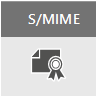

# Criptografia de emailEmail encryption

Este artigo compara as opções de criptografia no Microsoft 365, incluindo a Criptografia de Mensagens do Office (OME), S/MIME, Gerenciamento de Direitos de Informação (IRM) e apresenta o protocolo TLS (Transport Layer Security).This article compares encryption options in Microsoft 365 including Office Message Encryption (OME), S/MIME, Information Rights Management (IRM), and introduces Transport Layer Security (TLS).
  
Microsoft 365 delivers multiple encryption options to help you meet your business needs for email security. This article presents three ways to encrypt email in Office 365. If you want to learn more about all security features in Office 365, visit the [Office 365 Trust Center](https://go.microsoft.com/fwlink/p/?LinkID=282470). This article introduces the three types of encryption available for Microsoft 365 administrators to help secure email in Office 365:Microsoft 365 delivers multiple encryption options to help you meet your business needs for email security. This article presents three ways to encrypt email in Office 365. If you want to learn more about all security features in Office 365, visit the [Office 365 Trust Center](https://go.microsoft.com/fwlink/p/?LinkID=282470). This article introduces the three types of encryption available for Microsoft 365 administrators to help secure email in Office 365:
  
- Criptografia de Mensagem do Office (OME).Office Message Encryption (OME).

- S/MIME (Secure/Multipurpose Internet Mail Extensions).Secure/Multipurpose Internet Mail Extensions (S/MIME).

- Gerenciamento de Direitos de Informação (IRM).Information Rights Management (IRM).

## Criptografia de email e como o Microsoft 365 a usaEmail encryption and how Microsoft 365 uses it

Encryption is the process by which information is encoded so that only an authorized recipient can decode and consume the information. Microsoft 365 uses encryption in two ways: in the service, and as a customer control. In the service, encryption is used in Microsoft 365 by default; you don't have to configure anything. For example, Microsoft 365 uses Transport Layer Security (TLS) to encrypt the connection, or session, between two servers.Encryption is the process by which information is encoded so that only an authorized recipient can decode and consume the information. Microsoft 365 uses encryption in two ways: in the service, and as a customer control. In the service, encryption is used in Microsoft 365 by default; you don't have to configure anything. For example, Microsoft 365 uses Transport Layer Security (TLS) to encrypt the connection, or session, between two servers. 
  
Veja aqui como a criptografia de email normalmente funciona:Here's how email encryption typically works:
  
- Uma mensagem é criptografada, ou transformada de texto sem formatação em texto cifrado ilegível, no computador do remetente ou por um servidor central, enquanto a mensagem está em trânsito.A message is encrypted, or transformed from plain text into unreadable ciphertext, either on the sender's machine, or by a central server while the message is in transit.

- A mensagem permanece em texto cifrado enquanto está em trânsito para impedir a leitura caso seja interceptada.The message remains in ciphertext while it's in transit in order to protect it from being read in case the message is intercepted.

- Depois que é recebida pelo destinatário, a mensagem é transformada novamente em texto sem formatação legível por meio de uma das duas maneiras:Once the message is received by the recipient, the message is transformed back into readable plain text in one of two ways:

  - O computador do destinatário usa uma chave para descriptografar a mensagem, ouThe recipient's machine uses a key to decrypt the message, or

  - Um servidor central descriptografa a mensagem em nome do destinatário, após a validação da identidade do destinatário.A central server decrypts the message on behalf of the recipient, after validating the recipient's identity.

Confira mais informações sobre como o Microsoft 365 protege a comunicação entre servidores, por exemplo, entre organizações dentro do Microsoft 365 ou entre o Office 365 e um parceiro de negócios confiável fora do Microsoft 365, confira em [Como o Office 365 usa TLS para proteger conexões entre servidores](exchange-online-uses-tls-to-secure-email-connections.md).For more information on how Microsoft 365 secures communication between servers, such as between organizations within Microsoft 365 or between Microsoft 365 and a trusted business partner outside of Microsoft 365, see [How Exchange Online uses TLS to secure email connections in Office 365](exchange-online-uses-tls-to-secure-email-connections.md).
  
Assista a este vídeo para obter uma [introdução à criptografia no Office 365](https://www.youtube.com/watch?v=KmfxCd5ublI).Watch this video for an introduction to [Encryption in Office 365](https://www.youtube.com/watch?v=KmfxCd5ublI).
  
## Comparação das opções de criptografia de email disponíveis no Office 365Comparing email encryption options available in Office 365

|||||
|:-----|:-----|:-----|:-----|
|O que é isso?What is it?|Criptografia de Mensagens do Office 365 (OME) é um serviço integrado ao Azure Rights Management (Azure RMS) que permite o envio de emails criptografados para pessoas dentro ou fora da sua organização, independente do endereço de email de destino (Gmail, Yahoo! Email, Outlook.com, etc.).Office 365 Message Encryption (OME) is a service built on Azure Rights Management (Azure RMS) that lets you send encrypted email to people inside or outside your organization, regardless of the destination email address (Gmail, Yahoo! Mail, Outlook.com, etc.).   Como administrador, você pode configurar regras de transporte que definam as condições da criptografia. Quando um usuário envia uma mensagem que corresponde a uma regra, a criptografia é aplicada automaticamente.As an admin, you can set up transport rules that define the conditions for encryption. When a user sends a message that matches a rule, encryption is applied automatically.   To view encrypted messages, recipients can either get a one-time passcode, sign in with a Microsoft account, or sign in with a work or school account associated with Office 365. Recipients can also send encrypted replies. They don't need a Microsoft 365 subscription to view encrypted messages or send encrypted replies.To view encrypted messages, recipients can either get a one-time passcode, sign in with a Microsoft account, or sign in with a work or school account associated with Office 365. Recipients can also send encrypted replies. They don't need a Microsoft 365 subscription to view encrypted messages or send encrypted replies.|O IRM é uma solução de criptografia que também aplica restrições de uso a mensagens de email. Isso ajuda a evitar que informações confidenciais sejam impressas, encaminhadas ou copiadas por pessoas não autorizadas.IRM is an encryption solution that also applies usage restrictions to email messages. It helps prevent sensitive information from being printed, forwarded, or copied by unauthorized people.   Os recursos IRM no Microsoft 365 usam o Azure Rights Management (Azure RMS).IRM capabilities in Microsoft 365 use Azure Rights Management (Azure RMS).|S/MIME is a certificate-based encryption solution that allows you to both encrypt and digitally sign a message. The message encryption helps ensure that only the intended recipient can open and read the message. A digital signature helps the recipient validate the identity of the sender.S/MIME is a certificate-based encryption solution that allows you to both encrypt and digitally sign a message. The message encryption helps ensure that only the intended recipient can open and read the message. A digital signature helps the recipient validate the identity of the sender.   As assinaturas digitais e a criptografia de mensagem são disponibilizadas por meio do uso de certificados digitais exclusivos que contêm as chaves para verificar assinaturas digitais e criptografar ou descriptografar mensagens.Both digital signatures and message encryption are made possible through the use of unique digital certificates that contain the keys for verifying digital signatures and encrypting or decrypting messages.   To use S/MIME, you must have public keys on file for each recipient. Recipients have to maintain their own private keys, which must remain secure. If a recipient's private keys are compromised, the recipient needs to get a new private key and redistribute public keys to all potential senders.To use S/MIME, you must have public keys on file for each recipient. Recipients have to maintain their own private keys, which must remain secure. If a recipient's private keys are compromised, the recipient needs to get a new private key and redistribute public keys to all potential senders.|
|E o que isso faz?What does it do?|OME:OME:   Criptografa as mensagens enviadas a destinatários internos ou externos.Encrypts messages sent to internal or external recipients.    Permite que os usuários enviem mensagens criptografadas para qualquer endereço de email, incluindo Outlook.com, Yahoo! Mail e Gmail.Allows users to send encrypted messages to any email address, including Outlook.com, Yahoo! Mail, and Gmail.    Permite que você, como administrador, personalize o portal de exibição do email para refletir a marca da sua organização.Allows you, as an admin, to customize the email viewing portal to reflect your organization's brand.   A Microsoft gerencia e armazena as chaves de maneira segura, para que você não precise fazer isso.Microsoft securely manages and stores the keys, so you don't have to.   Nenhum software especial do lado do cliente é necessário, desde que a mensagem criptografada (enviada como um anexo HTML) possa ser aberta em um navegador.No special client side software is needed as long as the encrypted message (sent as an HTML attachment) can be opened in a browser.|IRM:IRM:   Usa a criptografia e as restrições de uso para fornecer proteção online e offline para mensagens de email e anexos.Uses encryption and usage restrictions to provide online and offline protection for email messages and attachments.   Fornece a você, como administrador, a capacidade de configurar as regras de transporte ou as regras de proteção do Outlook para aplicar o IRM automaticamente às mensagens selecionadas.Gives you, as an admin, the ability to set up transport rules or Outlook protection rules to automatically apply IRM to select messages.   Permite que os usuários apliquem modelos manualmente no Outlook ou no Outlook na Web (conhecida anteriormente com Outlook Web App).Lets users manually apply templates in Outlook or Outlook on the web (formerly known as Outlook Web App).|Autenticação de endereços de remetente de S/MIME com assinaturas digitais e confidencialidade de mensagem com criptografia.S/MIME addresses sender authentication with digital signatures, and message confidentiality with encryption.|
|E o que isso não faz?What does it not do?|OME doesn't let you apply usage restrictions to messages. For example, you can't use it to stop a recipient from forwarding or printing an encrypted message.OME doesn't let you apply usage restrictions to messages. For example, you can't use it to stop a recipient from forwarding or printing an encrypted message.|Some applications may not support IRM emails on all devices. For more information about these and other products that support IRM email, see [Client device capabilities](https://technet.microsoft.com/library/dn655136.aspx#BKMK_ClientCapabilities).Some applications may not support IRM emails on all devices. For more information about these and other products that support IRM email, see [Client device capabilities](https://technet.microsoft.com/library/dn655136.aspx#BKMK_ClientCapabilities).|O S/MIME não permite que mensagens criptografadas sejam verificadas para malware, spam ou políticas.S/MIME doesn't allow encrypted messages to be scanned for malware, spam, or policies.|
|Cenários de exemplo e recomendaçõesRecommendations and example scenarios|We recommend using OME when you want to send sensitive business information to people outside your organization, whether they're consumers or other businesses. For example:We recommend using OME when you want to send sensitive business information to people outside your organization, whether they're consumers or other businesses. For example:     O funcionário de um banco enviando extratos de cartão de crédito aos clientesA bank employee sending credit card statements to customers     Um consultório enviando prontuários médicos para um pacienteA doctor's office sending medical records to a patient     Um advogado enviando informações legais confidenciais para outro advogadoAn attorney sending confidential legal information to another attorney|É recomendável usar o IRM para aplicar restrições de uso, bem como a criptografia. Por exemplo:We recommend using IRM when you want to apply usage restrictions as well as encryption. For example:     Um gerente enviando detalhes confidenciais para sua equipe sobre um novo produto aplica a opção "Não Encaminhar".A manager sending confidential details to her team about a new product applies the "Do Not Forward" option.     Um executivo que precisa compartilhar uma proposta de lance com outra empresa, que inclui um anexo de um parceiro que está usando o Office 365, e necessita que o email e o anexo sejam protegidos.An executive needs to share a bid proposal with another company, which includes an attachment from a partner who is using Office 365, and require both the email and the attachment to be protected.|É recomendável usar o S/MIME quando sua organização ou a empresa do destinatário exigirem criptografia de ponto a ponto verdadeira.We recommend using S/MIME when either your organization or the recipient's organization requires true peer-to-peer encryption.     O S/MIME é mais usado nos seguintes cenários:S/MIME is most commonly used in the following scenarios:     Agências governamentais se comunicando com outras agências governamentaisGovernment agencies communicating with other government agencies     Uma empresa se comunicando com uma agência governamentalA business communicating with a government agency|
||

No caso de usar ambos a [Proteção de Informações do Azure](https://docs.microsoft.com/microsoft-365/compliance/protect-information) quanto a criptografia de email para proteger os dados, considere o seguinte:In case of using both [Azure Information Protection](https://docs.microsoft.com/microsoft-365/compliance/protect-information) and email encryption to protect the data, consider following:
- Você pode usar rótulos de confidencialidade com criptografia OME e Gerenciamento de Direitos de Informação.You can use sensitivity labels with OME and IRM encryption. Para obter mais detalhes, confira [Restringir o acesso ao conteúdo usando rótulos de confidencialidade para aplicar criptografia](https://docs.microsoft.com/microsoft-365/compliance/encryption-sensitivity-labels?view=o365-worldwide#what-happens-to-existing-encryption-when-a-labels-applied).For more details, see [Restrict access to content by using sensitivity labels to apply encryption](https://docs.microsoft.com/microsoft-365/compliance/encryption-sensitivity-labels?view=o365-worldwide#what-happens-to-existing-encryption-when-a-labels-applied).
- Você pode aplicar os rótulos de confidencialidade a emails assinados digitalmente usando S/MIME.You can apply sensitivity labels to emails digitally signed using S/MIME.
- Você não pode aplicar rótulos de confidencialidade a emails criptografados usando S/MIME, porque as mensagens protegidas por criptografia de ponta a ponta não são processadas por políticas.You can't apply sensitivity labels to emails encrypted using S/MIME, because messages protected by end-to-end encryption are not processed by policies.

## Opções de criptografia disponíveis para minha assinatura do Microsoft 365Encryption options available for my Microsoft 365 subscription

Para saber mais sobre as opções de criptografia de email da sua assinatura [do Microsoft 365,](https://technet.microsoft.com/library/exchange-online-service-description.aspx)Confira a descrição do serviço do Exchange Online.For information about email encryption options for your Microsoft 365 subscription see the [Exchange Online service description](https://technet.microsoft.com/library/exchange-online-service-description.aspx). Aqui você pode encontra informações sobre os seguintes recursos de criptografia:Here, you can find information about the following encryption features:

- Azure RMS, incluindo recursos de Gerenciamento de Direitos de Informação e os novos recursos de OMEAzure RMS, including both IRM capabilities and the new OME capabilities

- S/MIMES/MIME

- TLSTLS

- Criptografia de dados inativos (por meio do BitLocker)Encryption of data at rest (through BitLocker)

Você também pode usar ferramentas de criptografia de terceiros com o Microsoft 365, por exemplo, PGP.You can also use third-party encryption tools with Microsoft 365, for example, PGP (Pretty Good Privacy). O Microsoft 365 não é compatível com PGP/MIME e você só pode usar PGP/Inline para enviar e receber emails criptografados por PGP.Microsoft 365 does not support PGP/MIME and you can only use PGP/Inline to send and receive PGP-encrypted emails.

## E a criptografia de dados inativos?What about encryption for data at rest?

"Dados inativos" se refere aos dados que não estão ativamente em trânsito."Data at rest" refers to data that isn't actively in transit. No Microsoft 365, os dados inativos do email são criptografados usando a Criptografia de Unidade de Disco BitLocker.In Microsoft 365, email data at rest is encrypted using BitLocker Drive Encryption. O BitLocker criptografa os discos rígidos em datacenters do Microsoft para fornecer proteção avançada contra acesso não autorizado.BitLocker encrypts the hard drives in Microsoft datacenters to provide enhanced protection against unauthorized access. Saiba mais em [Visão geral do BitLocker](https://go.microsoft.com/fwlink/p/?LinkId=394737).To learn more, see [BitLocker Overview](https://go.microsoft.com/fwlink/p/?LinkId=394737).
  
## Para saber mais sobre as opções de criptografia de emailMore information about email encryption options

Para saber mais sobre as opções de criptografia de email neste artigo, bem sobre TLS, consulte estes artigos:For more information about the email encryption options in this article as well as TLS, see these articles:
  
**OME****OME**
  
[Criptografia de Mensagens do Office 365 (OME)Office 365 Message Encryption (OME)](ome.md)
  
**IRM****IRM**
  
[Gerenciamento de Direitos de Informação no Exchange OnlineInformation Rights Management in Exchange Online](https://technet.microsoft.com/library/jj983436%28v=exchg.150%29.aspx)
  
[ O que é o Azure Rights Management? What is Azure Rights Management?](https://technet.microsoft.com/library/jj585026)
  
**S/MIME****S/MIME**
  
[S/MIME para assinatura e criptografia de mensagensS/MIME for message signing and encryption](https://technet.microsoft.com/library/dn626158)
  
[Noções básicas sobre S/MIMEUnderstanding S/MIME](https://technet.microsoft.com/library/aa995740%28v=exchg.65%29.aspx)
  
[Noções básicas sobre criptografia de chave públicaUnderstanding Public Key Cryptography](https://technet.microsoft.com/library/aa998077%28v=exchg.65%29.aspx)
  
**TLS****TLS**
  
[Configurar o fluxo de emails usando conectoresConfigure custom mail flow by using connectors](https://technet.microsoft.com/library/jj723138%28v=exchg.150%29.aspx)
