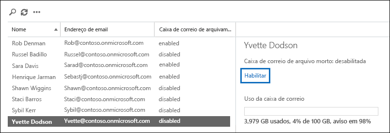

# <a name="enable-archive-mailboxes-in-the-security--compliance-center"></a><span data-ttu-id="8e015-103">Ative as caixas de correio de arquivo morto no Centro de Conformidade e Segurança</span><span class="sxs-lookup"><span data-stu-id="8e015-103">Enable archive mailboxes in the Security & Compliance Center</span></span>

<span data-ttu-id="8e015-104">O arquivamento no Office 365 (também chamado de arquivamento in-loco) fornece aos usuários espaço adicional de armazenamento na caixa de correio.</span><span class="sxs-lookup"><span data-stu-id="8e015-104">Archiving in Office 365 (also called In-Place Archiving) provides users with additional mailbox storage space.</span></span> <span data-ttu-id="8e015-105">Depois de ativar as caixas de correio de arquivo morto, os usuários podem acessar e armazenar mensagens em suas caixas de correio de arquivo morto usando o Microsoft Outlook e o Outlook na Web (anteriormente conhecido como Outlook Web App).</span><span class="sxs-lookup"><span data-stu-id="8e015-105">After you turn on archive mailboxes, users can access and store messages in their archive mailboxes by using Microsoft Outlook and Outlook on the web (formerly known as Outlook Web App).</span></span> <span data-ttu-id="8e015-106">Os usuários também podem mover ou copiar mensagens entre sua caixa de correio principal e sua caixa de correio de arquivo morto.</span><span class="sxs-lookup"><span data-stu-id="8e015-106">Users can also move or copy messages between their primary mailbox and their archive mailbox.</span></span> <span data-ttu-id="8e015-107">Eles também podem recuperar itens excluídos da pasta Itens Recuperáveis em suas caixas de correio de arquivo morto usando a ferramenta Recuperar Itens Excluídos.</span><span class="sxs-lookup"><span data-stu-id="8e015-107">They can also recover deleted items from the Recoverable Items folder in their archive mailbox by using the Recover Deleted Items tool.</span></span>

> [!NOTE]
> <span data-ttu-id="8e015-108">O recurso de arquivamento de expansão automática no Office 365 fornece armazenamento adicional em caixas de correio de arquivos.</span><span class="sxs-lookup"><span data-stu-id="8e015-108">The auto-expanding archiving feature in Office 365 provides additional storage in archive mailboxes.</span></span> <span data-ttu-id="8e015-109">Quando o arquivamento de expansão automática está ativado e a cota de armazenamento inicial na caixa de correio de arquivo morto de um usuário é atingida, o Office 365 adiciona automaticamente mais espaço de armazenamento.</span><span class="sxs-lookup"><span data-stu-id="8e015-109">When auto-expanding  archiving is turned on, and then the initial storage quota in a user's archive mailbox is reached, Office 365 automatically adds additional storage space.</span></span> <span data-ttu-id="8e015-110">Isso significa que os usuários não ficarão sem espaço de armazenamento na caixa de correio, e você não precisará gerenciar nada depois de habilitar inicialmente a caixa de correio de arquivo morto e ativar o arquivamento de expansão automática para sua organização.</span><span class="sxs-lookup"><span data-stu-id="8e015-110">This means that users won't run out of mailbox storage space and you won't have to manage anything after you initially enable the archive mailbox and turn on auto-expanding archiving for your organization.</span></span> <span data-ttu-id="8e015-111">Confira mais informações em [Visão geral do arquivamento ilimitado no Office 365](unlimited-archiving.md).</span><span class="sxs-lookup"><span data-stu-id="8e015-111">For more information, see [Overview of unlimited archiving in Office 365](unlimited-archiving.md).</span></span>

## <a name="get-the-necessary-permissions"></a><span data-ttu-id="8e015-112">Obtenha as permissões necessárias</span><span class="sxs-lookup"><span data-stu-id="8e015-112">Get the necessary permissions</span></span>

<span data-ttu-id="8e015-113">Você precisa ter atribuída a função de Destinatários de Email no Exchange Online para habilitar ou desabilitar caixas de correio de arquivo morto.</span><span class="sxs-lookup"><span data-stu-id="8e015-113">You have to be assigned the Mail Recipients role in Exchange Online to enable or disable archive mailboxes.</span></span> <span data-ttu-id="8e015-114">Por padrão, essa função é atribuída aos grupos de funções de Gerenciamento de Destinatários e Gerenciamento de Organização na página **Permissões** no centro de administração do Exchange.</span><span class="sxs-lookup"><span data-stu-id="8e015-114">By default, this role is assigned to the Recipient Management and Organization Management role groups on the **Permissions** page in the Exchange admin center.</span></span> <span data-ttu-id="8e015-115">Se você não vir a página **Arquivo** na seção Centro de Conformidade e Segurança, peça ao administrador para atribuir as permissões necessárias.</span><span class="sxs-lookup"><span data-stu-id="8e015-115">If you don't see the **Archive** page in the Security & Compliance Center, ask your administrator to assign you the necessary permissions.</span></span>

## <a name="enable-an-archive-mailbox"></a><span data-ttu-id="8e015-116">Habilitar uma caixa de correio de arquivo morto</span><span class="sxs-lookup"><span data-stu-id="8e015-116">Enable an archive mailbox</span></span>

1. <span data-ttu-id="8e015-117">Vá para <https://protection.office.com>.</span><span class="sxs-lookup"><span data-stu-id="8e015-117">Go to <https://protection.office.com>.</span></span>

2. <span data-ttu-id="8e015-118">Entre usando sua conta de trabalho ou da escola.</span><span class="sxs-lookup"><span data-stu-id="8e015-118">Sign in using your work or school account.</span></span>

3. <span data-ttu-id="8e015-119">No painel esquerdo do Centro de Conformidade e Segurança, clique em **Governança de informações** \> **Arquivo**.</span><span class="sxs-lookup"><span data-stu-id="8e015-119">In the left pane of the Security & Compliance Center, click **Information governance** \> **Archive**.</span></span>

   <span data-ttu-id="8e015-120">A página **Arquivo** é exibida.</span><span class="sxs-lookup"><span data-stu-id="8e015-120">The **Archive** page is displayed.</span></span> <span data-ttu-id="8e015-121">A coluna **Caixa de correio de arquivo morto** indica se uma caixa de correio de arquivo morto está habilitada ou desabilitada para cada usuário.</span><span class="sxs-lookup"><span data-stu-id="8e015-121">The **Archive mailbox** column indicates whether an archive mailbox is enabled or disabled for each user.</span></span>

   > [!NOTE]
   > <span data-ttu-id="8e015-122">A página **Arquivo** mostra um máximo de 500 usuários.</span><span class="sxs-lookup"><span data-stu-id="8e015-122">The **Archive** page shows a maximum of 500 users.</span></span>

4. <span data-ttu-id="8e015-123">Na lista de caixas de correio, selecione o usuário para o qual você deseja habilitar a caixa de correio de arquivo morto.</span><span class="sxs-lookup"><span data-stu-id="8e015-123">In the list of mailboxes, select the user that you want to enable the archive mailbox for.</span></span>

   

5. <span data-ttu-id="8e015-125">No painel de detalhes do usuário selecionado, clique em **Habilitar**.</span><span class="sxs-lookup"><span data-stu-id="8e015-125">In the details pane for the selected user, click **Enable**.</span></span>

   <span data-ttu-id="8e015-126">Um aviso é exibido informando que, se você habilitar a caixa de correio de arquivo morto, os itens na caixa de correio do usuário que forem mais antigos do que a política de arquivamento atribuída à caixa de correio serão movidos para a nova caixa de correio de arquivo morto.</span><span class="sxs-lookup"><span data-stu-id="8e015-126">A warning is displayed saying that if you enable the archive mailbox, items in the user's mailbox that are older than the archiving policy assigned to the mailbox will be moved to the new archive mailbox.</span></span> <span data-ttu-id="8e015-127">A política de arquivamento padrão que faz parte da política de retenção atribuída a caixas de correio do Exchange Online move itens para a caixa de correio de arquivo morto dois anos após a data em que o item foi entregue à caixa de correio ou criado pelo usuário.</span><span class="sxs-lookup"><span data-stu-id="8e015-127">The default archive policy that is part of the retention policy assigned to Exchange Online mailboxes moves items to the archive mailbox two years after the date the item was delivered to the mailbox or created by the user.</span></span> <span data-ttu-id="8e015-128">Para obter mais informações, confira a seção **Mais informações** deste artigo.</span><span class="sxs-lookup"><span data-stu-id="8e015-128">For more information, see the **More info** section in this article.</span></span>

6. <span data-ttu-id="8e015-129">Clique em **Sim** para habilitar a caixa de correio de arquivo morto.</span><span class="sxs-lookup"><span data-stu-id="8e015-129">Click **Yes** to enable the archive mailbox.</span></span>

   <span data-ttu-id="8e015-130">A criação da caixa de correio de arquivo morto pode demorar alguns instantes.</span><span class="sxs-lookup"><span data-stu-id="8e015-130">It might take a few moments to create the archive mailbox.</span></span> <span data-ttu-id="8e015-131">Quando criada, **Caixa de correio de arquivo morto: habilitada** é exibido no painel de detalhes do usuário selecionado.</span><span class="sxs-lookup"><span data-stu-id="8e015-131">When it's created, **Archive mailbox: enabled** is displayed in the details pane for the selected user.</span></span> <span data-ttu-id="8e015-132">Talvez seja necessário clicar em **Atualizar**  para atualizar as informações no painel de detalhes.</span><span class="sxs-lookup"><span data-stu-id="8e015-132">You might have to click **Refresh**  to update the information in the details pane.</span></span>

> [!TIP]
> <span data-ttu-id="8e015-133">Você também pode habilitar caixas de correio de arquivo morto selecionando vários usuários com caixas de correio de arquivo morto desabilitadas (use as teclas Shift ou Ctrl).</span><span class="sxs-lookup"><span data-stu-id="8e015-133">You can also bulk-enable archive mailboxes by selecting multiple users with disabled archive mailboxes (use the Shift or Ctrl keys).</span></span> <span data-ttu-id="8e015-134">Depois de selecionar várias caixas de correio, clique em **Habilitar** no painel de detalhes.</span><span class="sxs-lookup"><span data-stu-id="8e015-134">After selecting multiple mailboxes, click **Enable** in the details pane.</span></span>

## <a name="disable-an-archive-mailbox"></a><span data-ttu-id="8e015-135">Desabilitar uma caixa de correio de arquivo morto</span><span class="sxs-lookup"><span data-stu-id="8e015-135">Disable an archive mailbox</span></span>

<span data-ttu-id="8e015-136">Você também pode usar a página **Arquivo** no Centro de Segurança e Conformidade para desabilitar a caixa de correio de arquivo morto do usuário.</span><span class="sxs-lookup"><span data-stu-id="8e015-136">You can also use the **Archive** page in the Security & Compliance Center to disable a user's archive mailbox.</span></span> <span data-ttu-id="8e015-137">Após desabilitar uma caixa de correio de arquivo morto, você pode reconectá-la à caixa de correio principal do usuário dentro de 30 dias após desativá-la.</span><span class="sxs-lookup"><span data-stu-id="8e015-137">After you disable an archive mailbox, you can reconnect it to the user's primary mailbox within 30 days of disabling it.</span></span> <span data-ttu-id="8e015-138">Neste caso, o conteúdo original da caixa de correio de arquivo morto é restaurado.</span><span class="sxs-lookup"><span data-stu-id="8e015-138">In this case, the original contents of the archive mailbox are restored.</span></span> <span data-ttu-id="8e015-139">Após 30 dias, o conteúdo da caixa de correio de arquivo original é excluído permanentemente e não pode ser recuperado.</span><span class="sxs-lookup"><span data-stu-id="8e015-139">After 30 days, the contents of the original archive mailbox are permanently deleted and can't be recovered.</span></span> <span data-ttu-id="8e015-140">Portanto, se você reativar o arquivo morto mais de 30 dias após desabilitá-lo, será criada uma nova caixa de correio de arquivo morto.</span><span class="sxs-lookup"><span data-stu-id="8e015-140">So if you re-enable the archive more than 30 days after disabling it, a new archive mailbox is created.</span></span>

<span data-ttu-id="8e015-141">Observe que a política de arquivamento padrão atribuída às caixas de correio dos usuários move itens para a caixa de correio de arquivo morto dois anos após a data em que o item é entregue.</span><span class="sxs-lookup"><span data-stu-id="8e015-141">Note that the default archive policy assigned to users' mailboxes moves items to the archive mailbox two years after the date the item is delivered.</span></span> <span data-ttu-id="8e015-142">Se você desabilitar a caixa de correio de arquivo morto do usuário, nenhuma ação será executada nos itens da caixa de correio e eles permanecerão na caixa de correio principal do usuário.</span><span class="sxs-lookup"><span data-stu-id="8e015-142">If you disable a user's archive mailbox, no action will be taken on mailbox items and they will remain in the user's primary mailbox.</span></span>

<span data-ttu-id="8e015-143">Para desabilitar uma caixa de correio de arquivo morto:</span><span class="sxs-lookup"><span data-stu-id="8e015-143">To disable an archive mailbox:</span></span>

1. <span data-ttu-id="8e015-144">Vá para <https://protection.office.com>.</span><span class="sxs-lookup"><span data-stu-id="8e015-144">Go to <https://protection.office.com>.</span></span>

2. <span data-ttu-id="8e015-145">Entre usando sua conta de trabalho ou da escola.</span><span class="sxs-lookup"><span data-stu-id="8e015-145">Sign in using your work or school account.</span></span>

3. <span data-ttu-id="8e015-146">No painel esquerdo do Centro de Conformidade e Segurança, clique em **Governança de informações** \> **Arquivo**.</span><span class="sxs-lookup"><span data-stu-id="8e015-146">In the left pane of the Security & Compliance Center, click **Information governance** \> **Archive**.</span></span>

   <span data-ttu-id="8e015-147">A página **Arquivo** é exibida.</span><span class="sxs-lookup"><span data-stu-id="8e015-147">The **Archive** page is displayed.</span></span> <span data-ttu-id="8e015-148">A coluna **Caixa de correio de arquivo morto** indica se uma caixa de correio de arquivo morto está habilitada ou desabilitada para cada usuário.</span><span class="sxs-lookup"><span data-stu-id="8e015-148">The **Archive mailbox** column indicates whether an archive mailbox is enabled or disabled for each user.</span></span>

   > [!NOTE]
   > <span data-ttu-id="8e015-149">A página **Arquivo** mostra um máximo de 500 usuários.</span><span class="sxs-lookup"><span data-stu-id="8e015-149">The **Archive** page shows a maximum of 500 users.</span></span>

4. <span data-ttu-id="8e015-150">Na lista de caixas de correio, selecione o usuário para o qual você deseja habilitar a caixa de correio arquivo morto.</span><span class="sxs-lookup"><span data-stu-id="8e015-150">In the list of mailboxes, select the user that you want to disable the archive mailbox for.</span></span>

5. <span data-ttu-id="8e015-151">No painel de detalhes, clique em **Desabilitar**.</span><span class="sxs-lookup"><span data-stu-id="8e015-151">In the details pane, click **Disable**.</span></span>

   <span data-ttu-id="8e015-152">Uma mensagem de aviso é exibida dizendo que você terá 30 dias para reabilitar a caixa de correio de arquivo morto e que, após 30 dias, todas as informações do arquivo serão excluídas permanentemente.</span><span class="sxs-lookup"><span data-stu-id="8e015-152">A warning message is displayed saying that you'll have 30 days to re-enable the archive mailbox, and that after 30 days, all information in the archive will be permanently deleted.</span></span>

6. <span data-ttu-id="8e015-153">Clique em **Sim** para desabilitar a caixa de correio de arquivo morto.</span><span class="sxs-lookup"><span data-stu-id="8e015-153">Click **Yes** to disable the archive mailbox.</span></span>

   <span data-ttu-id="8e015-154">Pode levar alguns instantes para desabilitar a caixa de correio de arquivo morto.</span><span class="sxs-lookup"><span data-stu-id="8e015-154">It might take a few moments to disable the archive mailbox.</span></span> <span data-ttu-id="8e015-155">Quando desabilitada, é exibido**Caixa de correio de arquivo morto: desabilitada** no painel de detalhes do usuário selecionado.</span><span class="sxs-lookup"><span data-stu-id="8e015-155">When it's disabled, **Archive mailbox: disabled** is displayed in the details pane for the selected user.</span></span> <span data-ttu-id="8e015-156">Talvez seja necessário clicar em **Atualizar**  para atualizar as informações no painel de detalhes.</span><span class="sxs-lookup"><span data-stu-id="8e015-156">You might have to click **Refresh**  to update the information in the details pane.</span></span>

> [!TIP]
> <span data-ttu-id="8e015-157">Você também pode desabilitar em massa as caixas de correio de arquivo morto selecionando vários usuários com caixas de correio de arquivo morto habilitadas (use as teclas Shift ou Ctrl).</span><span class="sxs-lookup"><span data-stu-id="8e015-157">You can also bulk-disable archive mailboxes by selecting multiple users with enabled archive mailboxes (use the Shift or Ctrl keys).</span></span> <span data-ttu-id="8e015-158">Depois de selecionar várias caixas de correio, clique em **Desabilitar** no painel de detalhes.</span><span class="sxs-lookup"><span data-stu-id="8e015-158">After selecting multiple mailboxes, click **Disable** in the details pane.</span></span>

## <a name="use-exchange-online-powershell-to-enable-or-disable-archive-mailboxes"></a><span data-ttu-id="8e015-159">Use o PowerShell do Exchange Online para habilitar ou desabilitar caixas de correio de arquivo morto</span><span class="sxs-lookup"><span data-stu-id="8e015-159">Use Exchange Online PowerShell to enable or disable archive mailboxes</span></span>

<span data-ttu-id="8e015-160">Você também pode usar o PowerShell do Exchange Online para habilitar caixas de correio de arquivo morto.</span><span class="sxs-lookup"><span data-stu-id="8e015-160">You can also use Exchange Online PowerShell to enable archive mailboxes.</span></span> <span data-ttu-id="8e015-161">O principal motivo para usar o PowerShell é que você pode habilitar rapidamente a caixa de correio de arquivo morto para todos os usuários da sua organização.</span><span class="sxs-lookup"><span data-stu-id="8e015-161">The primary reason to use PowerShell is that you can quickly enable the archive mailbox for all users in your organization.</span></span>

<span data-ttu-id="8e015-162">A primeira etapa é se conectar ao PowerShell do Exchange Online.</span><span class="sxs-lookup"><span data-stu-id="8e015-162">The first step is to connect to Exchange Online PowerShell.</span></span> <span data-ttu-id="8e015-163">Para obter instruções, confira [Conectar-se ao PowerShell do Exchange Online](https://docs.microsoft.com/powershell/exchange/connect-to-exchange-online-powershell).</span><span class="sxs-lookup"><span data-stu-id="8e015-163">For instructions, see [Connect to Exchange Online PowerShell](https://docs.microsoft.com/powershell/exchange/connect-to-exchange-online-powershell).</span></span>

<span data-ttu-id="8e015-164">Depois de se conectar ao Exchange Online, você pode executar os comandos nas seções a seguir para habilitar ou desabilitar as caixas de correio de arquivo morto.</span><span class="sxs-lookup"><span data-stu-id="8e015-164">After you're connected to Exchange Online, you can run the commands in the following sections to enable or disable archive mailboxes.</span></span>

### <a name="enable-archive-mailboxes"></a><span data-ttu-id="8e015-165">Habilitar caixas de correio de arquivo morto</span><span class="sxs-lookup"><span data-stu-id="8e015-165">Enable archive mailboxes</span></span>

<span data-ttu-id="8e015-166">Execute o seguinte comando para habilitar a caixa de correio de arquivo morto para um único usuário.</span><span class="sxs-lookup"><span data-stu-id="8e015-166">Run the following command to enable the archive mailbox for a single user.</span></span>

```powershell
Enable-Mailbox -Identity <username> -Archive
```

<span data-ttu-id="8e015-167">Execute o seguinte comando para habilitar a caixa de correio de arquivo morto para todos os usuários da organização (cujas caixas de correio de arquivo morto não estejam atualmente habilitadas).</span><span class="sxs-lookup"><span data-stu-id="8e015-167">Run the following command to enable the archive mailbox for all users in your organization (whose archive mailbox is currently not enabled).</span></span>

```powershell
Get-Mailbox -Filter {ArchiveStatus -Eq "None" -AND RecipientTypeDetails -eq "UserMailbox"} | Enable-Mailbox -Archive
```

### <a name="disable-archive-mailboxes"></a><span data-ttu-id="8e015-168">Desabilitar caixas de correio de arquivo morto</span><span class="sxs-lookup"><span data-stu-id="8e015-168">Disable archive mailboxes</span></span>

<span data-ttu-id="8e015-169">Execute o seguinte comando para desabilitar a caixa de correio de arquivo morto para um único usuário.</span><span class="sxs-lookup"><span data-stu-id="8e015-169">Run the following command to disable the archive mailbox for a single user.</span></span>

```powershell
Disable-Mailbox -Identity <username> -Archive
```

<span data-ttu-id="8e015-170">Execute o seguinte comando para desabilitar a caixa de correio de arquivo morto para todos os usuários em sua organização (cujas caixas de correio de arquivo morto estejam atualmente habilitadas).</span><span class="sxs-lookup"><span data-stu-id="8e015-170">Run the following command to disable the archive mailbox for all users in your organization (whose archive mailbox is currently enabled).</span></span>

```powershell
Get-Mailbox -Filter {ArchiveStatus -Eq "Active" -AND RecipientTypeDetails -eq "UserMailbox"} | Disable-Mailbox -Archive
```

## <a name="more-information"></a><span data-ttu-id="8e015-171">Mais informações</span><span class="sxs-lookup"><span data-stu-id="8e015-171">More information</span></span>

- <span data-ttu-id="8e015-172">Quando uma caixa de correio de arquivo morto está habilitada, os usuários podem armazenar mensagens em sua caixa de correio de arquivo morto.</span><span class="sxs-lookup"><span data-stu-id="8e015-172">When an archive mailbox is enabled, users can store messages in their archive mailbox.</span></span> <span data-ttu-id="8e015-173">Os usuários podem acessar suas caixas de correio de arquivo morto usando o Microsoft Outlook e o Outlook na Web.</span><span class="sxs-lookup"><span data-stu-id="8e015-173">Users can access their archive mailboxes by using Microsoft Outlook and Outlook on the web.</span></span> <span data-ttu-id="8e015-174">Usando qualquer um desses aplicativos de cliente, os usuários podem exibir mensagens em sua caixa de correio de arquivo morto e mover ou copiar mensagens entre a caixa de correio principal e a caixa de correio de arquivo morto.</span><span class="sxs-lookup"><span data-stu-id="8e015-174">Using either of these client applications, users can view messages in their archive mailbox and move or copy messages between their primary mailbox and their archive mailbox.</span></span> <span data-ttu-id="8e015-175">Os usuários também podem recuperar itens excluídos da pasta Itens Recuperáveis em suas caixas de correio de arquivo morto usando a ferramenta Recuperar Itens Excluídos.</span><span class="sxs-lookup"><span data-stu-id="8e015-175">Users can also recover deleted items from the Recoverable Items folder in their archive mailbox by using the Recover Deleted Items tool.</span></span>

  <span data-ttu-id="8e015-176">Para obter uma lista de licenças do Outlook que tenham suporte ao arquivamento in-loco, consulte [Requisitos de licença do Outlook para recursos do Exchange](https://support.microsoft.com/office/46b6b7c5-c3ca-43e5-8424-1e2807917c99).</span><span class="sxs-lookup"><span data-stu-id="8e015-176">For a list of Outlook licenses that support In-Place Archiving, see [Outlook license requirements for Exchange features](https://support.microsoft.com/office/46b6b7c5-c3ca-43e5-8424-1e2807917c99).</span></span>

- <span data-ttu-id="8e015-177">As caixas de correio de arquivo morto ajudam você e seus usuários a atenderem aos requisitos de retenção, descoberta eletrônica e bloqueio da sua organização.</span><span class="sxs-lookup"><span data-stu-id="8e015-177">Archive mailboxes help you and your users to meet your organization's retention, eDiscovery, and hold requirements.</span></span> <span data-ttu-id="8e015-178">Por exemplo, você pode usar a política de retenção do Exchange da sua organização para mover conteúdo de caixa de correio para a caixa de correio de arquivo morto dos usuários.</span><span class="sxs-lookup"><span data-stu-id="8e015-178">For example, you can use your organization's Exchange retention policy to move mailbox content to users' archive mailbox.</span></span> <span data-ttu-id="8e015-179">Quando você usa a ferramenta de Pesquisa de Conteúdo no Centro de Conformidade e Segurança para pesquisar por conteúdo específico em uma caixa de correio de usuário, a caixa de correio de arquivo morto do usuário também será pesquisada.</span><span class="sxs-lookup"><span data-stu-id="8e015-179">When you use the Content Search tool in the Security & Compliance Center to search a user's mailbox for specific content, the user's archive mailbox will also be searched.</span></span> <span data-ttu-id="8e015-180">Além disso, quando você configura uma Retenção de Litígio ou aplica uma política de retenção a uma caixa de correio de usuário, os itens na caixa de correio de arquivo morto também são retidos.</span><span class="sxs-lookup"><span data-stu-id="8e015-180">And, when you place a Litigation Hold or apply a retention policy to a user's mailbox, items in the archive mailbox are also retained.</span></span>

- <span data-ttu-id="8e015-181">Depois que as caixas de correio de arquivo morto estiverem habilitadas, sua organização poderá aproveitar a política de retenção padrão do Exchange (também chamada de Gerenciamento de Registros de Mensagens ou política de MRM) que é atribuída automaticamente a todas as caixas de correio.</span><span class="sxs-lookup"><span data-stu-id="8e015-181">After archive mailboxes are enabled, your organization can take advantage of the default Exchange retention policy (also called Messaging Records Management or MRM policy) that is automatically assigned to every mailbox.</span></span> <span data-ttu-id="8e015-182">Quando uma caixa de correio de arquivo morto está habilitada, a política de retenção padrão do Exchange faz o seguinte:</span><span class="sxs-lookup"><span data-stu-id="8e015-182">When an archive mailbox is enabled, the default Exchange retention policy automatically does the following:</span></span>

  - <span data-ttu-id="8e015-183">Move os itens que têm dois anos ou mais da caixa de correio principal do usuário para suas caixas de correio de arquivo morto.</span><span class="sxs-lookup"><span data-stu-id="8e015-183">Moves items that are two years or older from a user's primary mailbox to their archive mailbox.</span></span>

  - <span data-ttu-id="8e015-184">Move os itens que têm 14 dias ou mais da pasta Itens Recuperáveis na caixa de correio principal do usuário para a pasta Itens Recuperáveis nas caixas de correio de arquivo morto.</span><span class="sxs-lookup"><span data-stu-id="8e015-184">Moves items that are 14 days or older from the Recoverable Items folder in the user's primary mailbox to the Recoverable Items folder in their archive mailbox.</span></span>

- <span data-ttu-id="8e015-185">Para obter mais informações sobre caixas de correio de arquivo morto e políticas de retenção do Exchange, consulte:</span><span class="sxs-lookup"><span data-stu-id="8e015-185">For more information about archive mailboxes and Exchange retention policies, see:</span></span>

  - [<span data-ttu-id="8e015-186">Marcas e políticas de retenção no Exchange Online</span><span class="sxs-lookup"><span data-stu-id="8e015-186">Retention tags and retention policies in Exchange Online</span></span>](https://docs.microsoft.com/exchange/security-and-compliance/messaging-records-management/retention-tags-and-policies)

  - [<span data-ttu-id="8e015-187">Política de Retenção Padrão no Exchange Online </span><span class="sxs-lookup"><span data-stu-id="8e015-187">Default Retention Policy in Exchange Online</span></span>](https://docs.microsoft.com/exchange/security-and-compliance/messaging-records-management/default-retention-policy)

  - [<span data-ttu-id="8e015-188">Configurar uma política de arquivamento e exclusão para caixas de correio em sua organização</span><span class="sxs-lookup"><span data-stu-id="8e015-188">Set up an archive and deletion policy for mailboxes in your organization</span></span>](set-up-an-archive-and-deletion-policy-for-mailboxes.md)
