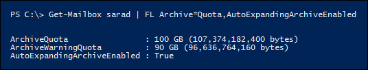

# <a name="enable-unlimited-archiving---admin-help"></a>Habilitar arquivamento ilimitado - Ajuda para Administradores

Você pode usar o recurso de arquivamento de expansão automática do Exchange Online para habilitar o espaço de armazenamento ilimitado para caixas de correio de arquivo morto. Quando o arquivamento de expansão automática é ativado, um espaço de armazenamento adicional é adicionado automaticamente à caixa de correio de arquivo morto de um usuário quando ele se aproxima do limite de armazenamento. O resultado é a capacidade ilimitada de armazenamento da caixa de correio. Você pode ativar o arquivamento de expansão automática para todos em sua organização ou apenas para usuários específicos. Para obter mais informações sobre o arquivamento de expansão automática, consulte Visão geral do arquivamento [ilimitado no Office 365.](unlimited-archiving.md)

## <a name="before-you-enable-auto-expanding-archiving"></a>Antes de habilitar o arquivamento de expansão automática

- Você precisa ser um administrador global em sua organização ou um membro do grupo de função Gerenciamento da Organização em sua organização do Exchange Online para habilitar o arquivamento de expansão automática para toda a organização ou para usuários específicos. Como alternativa, você precisa ser um membro de um grupo de funções que recebeu a função destinatários de email para habilitar o arquivamento de expansão automática para usuários específicos.

- A caixa de correio de arquivo morto de um usuário deve ser habilitada para que você possa habilitar o arquivamento de expansão automática. Um usuário deve receber uma licença do Plano 2 do Exchange Online para habilitar a caixa de correio de arquivo morto. Se um usuário receber uma licença do Exchange Online Plano 1, você terá que atribuir a ele uma licença separada do Arquivamento do Exchange Online para habilitar sua caixa de correio de arquivo morto. Consulte [Habilitar caixas de correio de arquivo morto no Centro & Conformidade e Segurança.](enable-archive-mailboxes.md)

- Você também pode usar o PowerShell para habilitar caixas de correio de arquivo morto. Confira a [seção Mais informações](#more-information) para obter um exemplo do comando do PowerShell que você pode usar para habilitar caixas de correio de arquivo morto para todos os usuários em sua organização.

- A expansão automática do arquivamento também oferece suporte às caixas de correio compartilhadas. Para habilitar o arquivo morto para uma caixa de correio compartilhada, é necessária uma licença do Plano 2 do Exchange Online ou uma licença do Exchange Online Plano 1 com uma licença do Arquivamento do Exchange Online.

- Não é possível usar o Centro de administração do Exchange ou o Centro de Conformidade e Segurança & para habilitar o arquivamento de expansão automática. Você precisa usar o PowerShell do Exchange Online. Para se conectar à sua organização do Exchange Online usando o PowerShell remoto, confira [Conectar-se ao PowerShell do Exchange Online.](https://go.microsoft.com/fwlink/p/?linkid=396554)

## <a name="enable-auto-expanding-archiving-for-your-entire-organization"></a>Habilitar o arquivamento de expansão automática para toda a organização

Você pode habilitar o arquivamento de expansão automática para toda a organização. Depois de ativá-lo, o arquivamento de expansão automática será habilitado para caixas de correio de usuário existentes e para novas caixas de correio de usuário criadas. Ao criar caixas de correio de usuário, certifique-se de habilitar a caixa de correio de arquivo morto principal do usuário para que o recurso de arquivamento de expansão automática funcione para a nova caixa de correio do usuário.
  
1. [Conectar-se ao PowerShell do Exchange Online ](https://go.microsoft.com/fwlink/p/?linkid=396554)

2. Execute o seguinte comando no PowerShell do Exchange Online para habilitar o arquivamento de expansão automática para toda a organização.

    ```powershell
    Set-OrganizationConfig -AutoExpandingArchive
    ```

## <a name="enable-auto-expanding-archiving-for-specific-users"></a>Habilitar o arquivamento de expansão automática para usuários específicos

Em vez de habilitar o arquivamento de expansão automática para cada usuário em sua organização, você pode habilita-lo somente para usuários específicos. Você pode fazer isso porque apenas alguns usuários podem precisar de uma grande capacidade de armazenamento de arquivo morto.
  
Quando você habilita o arquivamento de expansão automática para um usuário específico e a caixa de correio do usuário em espera ou atribuído a uma política de retenção, as duas configurações a seguir são feitas:
  
- A cota de armazenamento da caixa de correio de arquivo morto principal do usuário é aumentada em 10 GB (de 100 GB para 110 GB). A cota de aviso de arquivo morto também é aumentada em 10 GB (de 90 GB para 100 GB).

- A cota de armazenamento da pasta Itens Recuperáveis na caixa de correio principal do usuário é aumentada em 10 GB (também de 100 GB para 110 GB). A cota de avisos de Itens Recuperáveis também é aumentada em 10 GB (de 90 GB para 100 GB). Essas alterações só serão aplicáveis se a caixa de correio estiver em espera ou atribuída a uma política de retenção.

Esse espaço adicional é adicionado para evitar problemas de armazenamento que possam ocorrer antes do provisionamento do arquivo morto de expansão automática. Espaço de  *armazenamento adicional não é*  adicionado quando você habilita o arquivamento de expansão automática para toda a organização, conforme descrito na seção anterior.
  
1. [Conectar-se ao PowerShell do Exchange Online ](https://go.microsoft.com/fwlink/p/?linkid=396554)

2. Execute o seguinte comando no PowerShell do Exchange Online para habilitar o arquivamento de expansão automática para um usuário específico. Conforme explicado anteriormente, a caixa de correio de arquivo morto do usuário (arquivo morto principal) deve ser habilitada para que você possa ativar o arquivamento de expansão automática para esse usuário.

    ```powershell
    Enable-Mailbox <user mailbox> -AutoExpandingArchive
    ```

> [!IMPORTANT]
> Em uma implantação híbrida do Exchange, você não pode usar o comando **Enable-Mailbox -AutoExpandingArchive** para habilitar o arquivamento de expansão automática para um usuário específico cuja caixa de correio principal é local e cuja caixa de correio de arquivo morto é baseada em nuvem. Para habilitar o arquivamento de expansão automática para caixas de correio de arquivo morto baseadas em nuvem em uma implantação híbrida do Exchange, você precisa executar o comando **Set-OrganizationConfig -AutoExpandingArchive** no PowerShell do Exchange Online para habilitar o arquivamento de expansão automática para toda a organização. Se as caixas de correio principal e de arquivo morto de um usuário são baseadas em nuvem, você pode usar o comando **Enable-Mailbox -AutoExpandingArchive** para habilitar o arquivamento de expansão automática para esse usuário específico.
  
## <a name="verify-that-auto-expanding-archiving-is-enabled"></a>Verificar se o arquivamento de expansão automática está habilitado

Para verificar se o arquivamento de expansão automática está habilitado para sua organização, execute o seguinte comando no PowerShell do Exchange Online.

```powershell
Get-OrganizationConfig | FL AutoExpandingArchiveEnabled
```

Um valor indica  `True` que o arquivamento de expansão automática está habilitado para a organização. 
  
Para verificar se o arquivamento de expansão automática está habilitado para um usuário específico, execute o seguinte comando no PowerShell do Exchange Online.
  
```powershell
Get-Mailbox <user mailbox> | FL AutoExpandingArchiveEnabled
```

Um valor indica  `True` que o arquivamento de expansão automática está habilitado para o usuário. 
  
Lembre-se do seguinte depois de habilitar o arquivamento de expansão automática:
  
- Se você executar o comando **Set-OrganizationConfig -AutoExpandingArchive** para habilitar o arquivamento de expansão automática para sua organização, não será preciso executar **Enable-Mailbox -AutoExpandingArchive** em caixas de correio individuais. A execução do cmdlet **Set-OrganizationConfig** para habilitar o arquivamento de expansão automática para sua organização não altera a propriedade  *AutoExpandingArchiveEnabled*  nas caixas de correio do usuário para `True` .

- Da mesma forma, os valores das propriedades de caixa de correio  *ArchiveQuota*  e  *ArchiveWarningQuota*  não são alterados quando você habilita o arquivamento de expansão automática. Na verdade, quando você habilita o arquivamento de expansão automática para uma caixa de correio de usuário e a propriedade  *AutoExpandingArchiveEnabled*  é definida como , as propriedades  `True`  *ArchiveQuota*  e  *ArchiveWarningQuota*  são ignoradas. Veja um exemplo dessas propriedades de caixa de correio depois que o arquivamento de expansão automática é habilitado para a caixa de correio de um usuário. 

    

## <a name="more-information"></a>Mais informações

- Você também pode usar o PowerShell para habilitar caixas de correio de arquivo morto. Por exemplo, você pode executar o seguinte comando no PowerShell do Exchange Online para habilitar caixas de correio de arquivo morto para todos os usuários cuja caixa de correio de arquivo morto ainda não está habilitada.

    ```powershell
    Get-Mailbox -Filter {ArchiveStatus -Eq "None" -AND RecipientTypeDetails -eq "UserMailbox"} | Enable-Mailbox -Archive
    ```

- Depois de ativar o arquivamento de expansão automática para sua organização ou para um usuário específico, uma caixa de correio de arquivo morto é convertida em um arquivo morto de expansão automática quando a caixa de correio de arquivo morto (incluindo a pasta Itens Recuperáveis) atinge 90 GB. Pode levar até 30 dias para que o espaço de armazenamento adicional seja provisionado.

- Depois que você ativar o arquivamento de expansão automática, ele não poderá ser desligado.

- O arquivamento de expansão automática é suportado para caixas de correio de arquivo morto baseadas em nuvem em uma implantação híbrida do Exchange para usuários que possuem uma caixa de correio principal local. No entanto, depois que o arquivamento de expansão automática for habilitado para uma caixa de correio de arquivo morto baseada em nuvem, você não poderá reabilitar essa caixa de correio de arquivo morto de volta para a organização local do Exchange. O arquivamento de expansão automática não é suportado para caixas de correio locais em nenhuma versão do Exchange Server.

- For a list of Outlook clients that users can use to access items in the additional storage area in their archive mailbox, see the "Outlook requirements for accessing items in an auto-expanded archive" section in [Overview of unlimited archiving](unlimited-archiving.md#outlook-requirements-for-accessing-items-in-an-auto-expanded-archive).

- Conforme explicado anteriormente, 10 GB são adicionados à cota de armazenamento da caixa de correio de arquivo morto principal do usuário (e à pasta Itens Recuperáveis, se a caixa de correio estiver em espera) quando você executar o comando **Enable-Mailbox -AutoExpandingArchive.** Isso fornece armazenamento adicional até que o espaço de armazenamento expandido automaticamente seja provisionado (o que pode levar até 30 dias). Esse espaço de armazenamento adicional não é adicionado quando você executar **o Set-OrganizationConfig -AutoExpandingArchive** para habilitar o arquivamento de expansão automática para todas as caixas de correio em sua organização. Se você habilitar o arquivamento de expansão automática para toda a organização, mas precisar adicionar mais 10 GB de espaço de armazenamento para um usuário específico, poderá executar o comando **Enable-Mailbox -AutoExpandingArchive** nessa caixa de correio. Você receberá um erro dizendo que o arquivamento de expansão automática já foi habilitado, mas o espaço de armazenamento adicional será adicionado à caixa de correio.

- Os administradores não podem ajustar a cota de armazenamento.

> [!IMPORTANT]
> O arquivamento de expansão automática só é suportado para caixas de correio usadas para usuários individuais ou caixas de correio compartilhadas com uma taxa de crescimento que não exceda 1 GB por dia. O uso de diário, regras de transporte ou regras de encaminhamento automático para copiar mensagens para uma caixa de correio de arquivo morto para fins de arquivamento não é permitido. A caixa de correio de arquivo morto de um usuário destina-se somente a esse usuário. A Microsoft reserva o direito de negar o arquivamento ilimitado em situações onde a caixa de correio de arquivo morto do usuário é usada para armazenar dados de arquivo morto de outros usuários.
