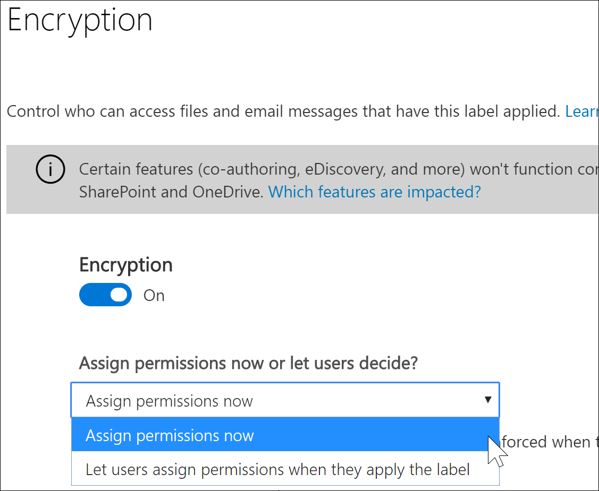
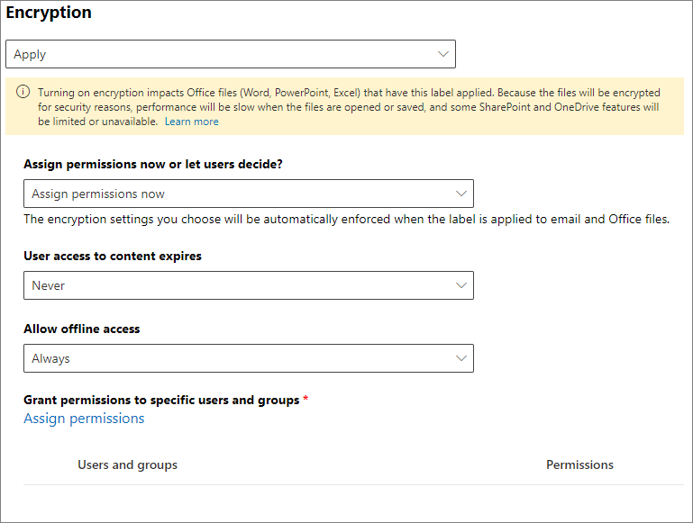
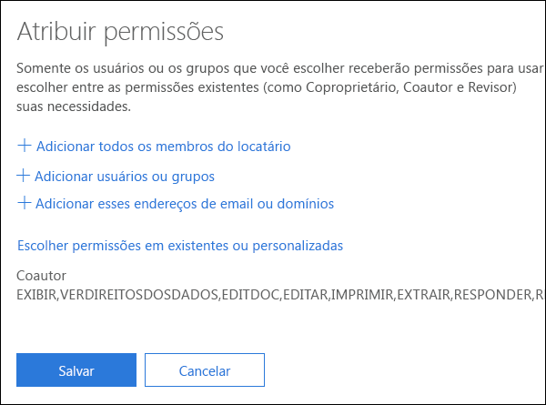
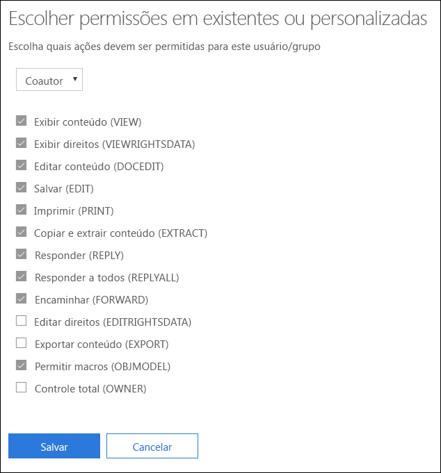
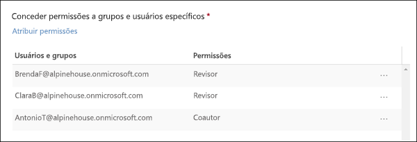
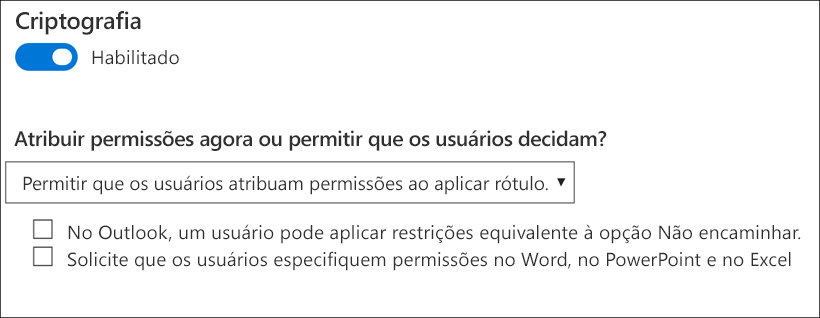

# Restringir o acesso ao conteúdo usando rótulos de confidencialidade para aplicar criptografia 

Quando você cria um rótulo de confidencialidade, pode restringir o acesso ao conteúdo ao qual o rótulo será aplicado. Por exemplo, com as configurações de criptografia para um rótulo de confidencialidade, você pode proteger conteúdos de modo que:

- Somente os usuários em sua organização possam abrir um documento ou um email confidenciais.
- Somente os usuários do departamento de marketing possam editar e imprimir o documento ou email de comunicado de promoção, enquanto todos os outros usuários em sua organização possam apenas lê-lo.
- Os usuários não podem encaminhar um email ou copiar informações destas fontes que contêm notícias sobre uma reorganização interna.
- A lista de preços atual que enviada a parceiros de negócios não pode ser aberta após uma data especificada.

Quando um documento ou email é criptografado, o acesso ao conteúdo é restrito, para que ele:

- Possa ser descriptografado apenas por usuários autorizados pelas configurações de criptografia do rótulo.
- Permaneça criptografado independentemente de onde esteja, dentro ou fora da sua organização, mesmo se o arquivo for renomeado.
- Fique criptografado tanto em repouso (por exemplo, em uma conta do OneDrive) quanto em trânsito (por exemplo, um email enviado).

Por fim, como administrador, quando você configura um rótulo de confidencialidade para aplicar criptografia, há duas opções a escolher:

- **Atribuir permissões agora**, para que assim você possa determinar exatamente quais usuários podem obter quais permissões de conteúdo com esse rótulo.
- **Permitir que os usuários atribuam permissões** quando aplicam o rótulo ao conteúdo. Dessa forma, você pode conceder a pessoas em sua organização uma certa flexibilidade que elas possam precisar para colaborar e realizar o trabalho.

As configurações de criptografia estão disponíveis quando você [cria um rótulo de confidencialidade](create-sensitivity-labels.md) no centro de conformidade do Microsoft 365, centro de segurança do Microsoft 365 ou Centro de Conformidade e Segurança do Office 365.

## Como funciona a criptografia

A criptografia usa o serviço Azure Rights Management (Azure RMS) da Proteção de Informações do Azure. Esta solução de proteção usa política de criptografia, identidade e autorização. Para saber mais, confira [O que é o Azure Rights Management?](https://docs.microsoft.com/azure/information-protection/what-is-azure-rms) na documentação da Proteção de Informações do Azure. 

Quando você usa essa solução de criptografia, o **recurso de superusuário** garante que as pessoas e os serviços autorizados possam sempre ler e inspecionar os dados criptografados para a sua organização. Se necessário, a criptografia poderá ser removida ou alterada. Para saber mais, confira [Configurar os superusuários para a Proteção de Informações do Azure, serviços de descoberta ou recuperação de dados](https://docs.microsoft.com/azure/information-protection/configure-super-users).

## Configurar um rótulo para criptografia

Quando você [cria ou edita um rótulo de confidencialidade](create-sensitivity-labels.md#create-and-configure-sensitivity-labels), na página **Criptografia** do assistente, você pode selecionar uma das seguintes opções:

- **Nenhuma**: a configuração padrão para um novo rótulo. Nenhuma nova criptografia é aplicada.
- **Aplicar**: ativa a criptografia e, em seguida, você especifica as configurações de criptografia.
- **Remover**: remove a criptografia se o documento ou email estiver criptografado.

> [!NOTE]
> A opção **Remover** só tem suporte no cliente de rotulagem unificada da Proteção de Informações do Azure. Quando você usa a rotulagem interna, um rótulo com esta opção fica visível nos aplicativos do Office e, se selecionado, o comportamento de criptografia é o mesmo que em **Nenhuma**.

Configurar as opções de criptografia:

### O que acontece com a criptografia existente quando um rótulo é aplicado

Se um rótulo de confidencialidade for aplicado ao conteúdo não criptografado, o resultado das opções de criptografia que você poderá selecionar será autoexplicativo. Por exemplo, se a criptografia estiver definida como **Nenhuma**, o conteúdo permanecerá não criptografado.

No entanto, conteúdo pode já estar criptografado. Por exemplo, outro usuário pode ter aplicado:

- Suas próprias permissões, que incluem permissões definidas pelo usuário quando solicitadas por um rótulo, permissões personalizadas pelo cliente da Proteção de Informações do Azure e a proteção de documento de **Acesso Restrito** de dentro de um aplicativo do Office.
- Um modelo de proteção do Azure Rights Management que criptografa o conteúdo de maneira independente de um rótulo. Esta categoria inclui regras de fluxo de email que aplicam criptografia usando a proteção de direitos.
- Um rótulo que aplica criptografia com permissões atribuídas pelo administrador.

A tabela a seguir identifica o que acontece com uma criptografia existente quando um rótulo de confidencialidade é aplicado ao conteúdo:

| |**Criptografia: nenhuma**|**Criptografia: aplicar**|**Criptografia: remover**|
|:-----|:-----|:-----|:-----|
|**Permissões especificadas por um usuário**|A criptografia original é preservada|A criptografia de novo rótulo é aplicada|A criptografia original é removida|
|**Modelo de proteção**|A criptografia original é preservada|A criptografia de novo rótulo é aplicada|A criptografia original é removida|
|**Rótulo com permissões definidas por administrador**|A criptografia original é removida|A criptografia de novo rótulo é aplicada|A criptografia original é removida|

Observe que, em casos em que a nova criptografia de rótulo é aplicada ou a criptografia original é removida, isso só acontece se o usuário que está aplicando o rótulo tiver um direito de uso ou função que dê suporte a essa ação:
- O [direito de uso](https://docs.microsoft.com/azure/information-protection/configure-usage-rights.md#usage-rights-and-descriptions) Exportar ou Controle Total.
- A função do [emissor de Gerenciamento de Direitos ou do proprietário de Gerenciamento de Direitos](https://docs.microsoft.com/azure/information-protection/configure-usage-rights#rights-management-issuer-and-rights-management-owner) ou [superusuário](https://docs.microsoft.com/azure/information-protection/configure-super-users).

Se o usuário não tiver uma destes direitos ou funções, não será possível aplicar o rótulo, e a criptografia original é preservada. O usuário verá a seguinte mensagem: **Você não tem permissão para fazer essa alteração no rótulo de confidencialidade. Entre em contato com o proprietário do conteúdo.**

Por exemplo, a pessoa que aplica o Não Encaminhar a uma mensagem de email pode rotular novamente a sequência para substituir a criptografia ou removê-la, pois ela é a proprietária do Gerenciamento de Direitos do email. No entanto, com exceção dos superusuários, os destinatários desse email não podem rotulá-lo novamente, pois não têm os direitos de uso necessários.

#### Anexos de email para mensagens de email criptografadas

Quando uma mensagem de email é criptografada por qualquer método, todos os documentos do Office não criptografados que são anexados ao email herdam automaticamente as mesmas configurações de criptografia.

Os documentos que já estão criptografados e depois são adicionados como anexos sempre preservam a criptografia original. 

## Como definir as configurações de criptografia do rótulo de confidencialidade

Quando você seleciona **Aplicar** na página **Criptografia** do assistente para criar ou editar um rótulo de confidencialidade, escolha se deseja:

- **Atribuir permissões agora**, para assim determinar exatamente quais usuários podem obter quais permissões do conteúdo com o rótulo aplicado. Para mais informações, consulte a próxima seção[Atribuir permissões agora](#assign-permissions-now).
- **Permitir que os usuários atribuam permissões** quando aplicam o rótulo ao conteúdo. Com essa opção, você pode conceder uma certa flexibilidade a pessoas em sua organização para que possam colaborar e realizar o trabalho. Para mais informações, confira a seção nessa página [ Permitir que usuários atribuam permissões](#let-users-assign-permissions).

Por exemplo, se você tiver um rótulo de confidencialidade denominado **Altamente Confidencial** que será aplicado ao seu conteúdo mais confidencial, talvez você queira decidir agora quem obtém qual tipo de permissão para esse conteúdo.

Como alternativa, se você tiver um rótulo de confidencialidade denominado **Contratos de Negócios**, e o fluxo de trabalho da sua organização exigir que as pessoas colaborem nesse conteúdo com outras pessoas de forma ad hoc, talvez você queira permitir que seus os usuários decidam quem receberá permissões quando atribui o rótulo. Essa flexibilidade auxilia não só a produtividade dos usuários como também reduz as solicitações dos seus administradores de atualizar ou criar novos rótulos de sensibilidade para cenários específicos.

Optar por atribuir permissões agora ou permitir que os usuários atribuam permissões: 

## Atribuir permissões agora

Use as opções abaixo para controlar quem pode acessar os emails ou documentos aos quais aquele rótulo foi aplicado. Você pode:

1. **Permitir que o acesso ao conteúdo rotulado expire**, em uma data específica ou depois de um número específico de dias após o rótulo ser aplicado. Após este período, os usuários não poderão abrir o item rotulado. Se você especificar uma data, isso será válido a partir da meia-noite da data em questão em seu fuso horário atual. (Observe que alguns clientes de email podem não impor expiração e exibir emails após a data de vencimento, devido a seus mecanismos de cache.)

2. **Permitir o acesso offline** nunca, sempre ou por um número específico de dias após o rótulo ser aplicado. Se você restringir o acesso offline para nunca ou por um número de dias, quando este limite for atingido, os usuários precisarão ser autenticados novamente e seu acesso será registrado. Para saber mais, confira a próxima seção na licença de uso de Gerenciamento de Direitos.

Configurações de controle de acesso para conteúdo criptografado:

### Licença de uso de Gerenciamento de Direitos para acesso offline

Quando um usuário abre um documento ou email protegido pela criptografia do serviço do Azure Rights Management, uma licença de uso desse serviço para o conteúdo é concedida ao usuário. A licença de uso é um certificado que contém os direitos de uso do usuário para o documento ou o email e a chave de criptografia usada para criptografar o conteúdo. A licença de uso também contém uma data de vencimento, caso tenha sido definida e por quanto tempo a licença de uso é válida.

Se nenhuma data de vencimento tiver sido definida, o período de validade da licença de uso padrão para um locatário é de 30 dias. Pela duração da licença de uso, o usuário não precisa ser autenticado ou autorizado novamente para o conteúdo. Esse processo permite que o usuário continue a abrir o documento ou email protegido sem uma conexão de Internet. Quando expirar o período de validade da licença de uso, na próxima vez em que o usuário acessar o documento ou email protegido, ele precisará ser autenticado e autorizado novamente.

Além da nova autenticação, as configurações de criptografia e a associação do grupo de usuários são reavaliados. Isso significa que os usuários podem experimentar diferentes resultados de acesso no mesmo documento ou email se houver alterações nas configurações de criptografia ou na associação de grupo em relação à última vez em que acessaram o conteúdo.

Para saber como alterar a configuração padrão de 30 dias, confira [Licença de uso de Gerenciamento de Direitos](https://docs.microsoft.com/azure/information-protection/configure-usage-rights#rights-management-use-license)..

### Atribuir permissões a usuários ou grupos específicos

Você pode conceder permissões a pessoas específicas para que somente elas possam interagir com o conteúdo rotulado:

1. Primeiro, adicione usuários ou grupos que receberão permissões para o conteúdo rotulado.

2. Em seguida, escolha quais permissões os usuários devem ter para o conteúdo rotulado.

Atribuindo permissões:

#### Adicionar usuários ou grupos

Quando você atribui permissões, pode escolher:

- Todos em sua organização (todos os membros locatários). Esta configuração exclui contas de convidados.
- Todos os usuários autenticados. Verifique se você entendeu os [requisitos e limitações](#requirements-and-limitations-for-add-any-authenticated-users) dessa configurações antes de selecioná-la.
- Qualquer usuário específico ou grupo de segurança, grupo de distribuição, grupo do Office 365 ou grupo de distribuição dinâmico habilitado para email. 
- Qualquer endereço de email ou domínio fora da sua organização, como gmail.com, hotmail.com ou outlook.com. 

Quando você escolhe todos os membros locatários e pesquisa o diretório, os usuários ou grupos devem ter um endereço de email.

Como prática recomendada, use grupos em vez de usuários. Essa estratégia mantém a configuração mais simples.

##### Requisitos e limitações para **Adicionar todos os usuários autenticados**

Essa configuração não restringe as pessoas que podem acessar o conteúdo que o rótulo criptografa, ainda criptografando o conteúdo e fornecendo opções para restringir a maneira como o conteúdo pode ser usado (permissões) e acessado (expiração e acesso offline). No entanto, o aplicativo que está abrindo o conteúdo criptografado deve ser capaz de oferecer suporte à autenticação que está sendo usada. Por esse motivo, provedores de identidade federados, como o Google, e a autenticação única de senha funcionam somente para email e apenas quando você usa o Exchange Online e os novos recursos da Criptografia de Mensagem do Office 365. As contas da Microsoft podem ser usadas com aplicativos do Office 365 e com o [visualizador da Proteção de Informações do Azure](https://portal.azurerms.com/#/download).

Alguns cenários comuns para a configuração de todos os usuários autenticados:
- Você não se importa em quem vê o conteúdo, mas deseja restringir a maneira como ele é usado. Por exemplo, você não deseja que o conteúdo seja editado, copiado ou impresso.
- Você não deseja restringir as pessoas que acessam o conteúdo, mas deseja pode confirmar quem o abre.
- Você possui um requisito de que o conteúdo deve ser criptografado em repouso e em trânsito, mas não requer controles de acesso.

#### Escolher permissões

Quando você escolhe quais permissões atribuir para os usuários ou grupos, você pode selecionar:

- Um [nível de permissões predefinidas](https://docs.microsoft.com/azure/information-protection/configure-usage-rights#rights-included-in-permissions-levels) com um grupo predefinido de direitos, como co-autor ou revisor.
- Um grupo de direitos personalizados, no qual você escolhe as permissões que desejar.

Para saber mais sobre cada permissão específica, confira [Direitos de uso e descrições](https://docs.microsoft.com/azure/information-protection/configure-usage-rights#usage-rights-and-descriptions).  

Observe que o mesmo rótulo pode atribuir permissões diferentes a usuários diferentes. Por exemplo, um rótulo único pode definir alguns usuários como Revisores e um usuário diferente como Co-Autor, como mostrado na captura de tela a seguir.

Para fazer isso, adicione usuários ou grupos, atribua-lhes permissões e salve essas configurações. Depois repita essas etapas, adicionando usuários e atribuindo-lhes permissões, salvando as configurações a cada vez. Você pode repetir essa configuração quantas vezes for necessário para definir permissões diferentes para usuários diferentes.

#### O emissor do Gerenciamento de Direitos (usuário que aplica o rótulo de confidencialidade) sempre tem o Controle Total

A criptografia de um rótulo de confidencialidade usa o serviço do Azure Rights Management da Proteção de Informações do Azure. Quando um usuário aplica um rótulo de confidencialidade para proteger um documento ou email usando criptografia, esse usuário se torna o emissor do Gerenciamento de Direitos daquele conteúdo.

O emissor do Gerenciamento de Direitos sempre recebe as permissões de Controle Total para o documento ou email, e também:

- Se as configurações de criptografia incluem uma data de vencimento, o emissor do Gerenciamento de Direitos ainda pode abrir e editar o documento ou email após essa data.
- O emissor do Gerenciamento de Direitos sempre pode acessar o documento ou email offline.
- O emissor do Gerenciamento de Direitos ainda consegue abrir um documento após sua revogação.

Para saber mais, confira [Emissor do Gerenciamento de Direitos e Proprietário do Gerenciamento de Direitos](https://docs.microsoft.com/azure/information-protection/configure-usage-rights#rights-management-issuer-and-rights-management-owner).

## Permitir que usuários atribuam permissões

Você pode usar essas opções para permitir que os usuários atribuam permissões quando os mesmos aplicarem manualmente um rótulo de sensibilidade ao conteúdo:

- No Outlook, um usuário pode aplicar restrições equivalentes à opção [Não Encaminhar](https://docs.microsoft.com/azure/information-protection/configure-usage-rights#do-not-forward-option-for-emails) para os destinatários escolhidos.

- No Word, no PowerPoint e no Excel, um usuário deve selecionar suas próprias permissões para usuários, grupos ou organizações específicos. 
    > [!NOTE]
    > Essa opção para o Word, o PowerPoint e o Excel têm suporte no cliente de rotulagem unificada da Proteção de Informações do Azure.  Para aplicativos que usam rotulagem interna, o suporte está sendo implantado atualmente na [visualização do Windows e do Mac](sensitivity-labels-office-apps.md#sensitivity-label-capabilities-in-word-excel-and-powerpoint). Se essa opção estiver selecionada, mas não tiver suporte para o aplicativo de um usuário, esse rótulo não será exibido para o usuário.

Quando houver suporte para as opções, use a tabela a seguir para identificar quais usuários verão o rótulo de confidencialidade:

|Configuração |Rótulo visível no Outlook|Rótulo visível no Word, Excel, PowerPoint|
|:-----|:-----|:-----|:-----|
|**No Outlook, um usuário pode aplicar restrições equivalentes à opção Não Encaminhar**|Sim |Não |
|**Solicite que os usuário especifiquem permissões no Word, no PowerPoint e no Excel**|Não |Sim|

Quando ambas as configurações são selecionadas, o rótulo fica visível no Outlook, no Word, no Excel e no PowerPoint.

Um rótulo de sensibilidade que permite aos usuários atribuir permissões a conteúdo só poderá ser aplicado manualmente por usuários. Tal rótulo não pode ser aplicado automaticamente ou usado como um rótulo recomendado.

Configurar as permissões atribuídas ao usuários:

### Restrições do Outlook

No Outlook, quando um usuário aplica um rótulo de sensibilidade que permite atribuir permissões a uma mensagem, as restrições são as mesmas da opção Não Encaminhar. O usuário verá o nome e a descrição do rótulo na parte superior da mensagem, o que indica que o conteúdo é protegido. Diferentemente do Word, do PowerPoint e do Excel (confira a [ próxima seção](#word-powerpoint-and-excel-permissions)), os usuários não são solicitados a selecionar permissões específicas.

Quando a opção Não Encaminhar for aplicada a um email, tal email será criptografado e os destinatários deverão ser autenticados. Subsequentemente, os destinatários não podem encaminhar, imprimir ou copiar esse email. Por exemplo, no cliente do Outlook, o botão Encaminhar não está disponível, as opções do menu Salvar Como e Imprimir não estão disponíveis, e você não pode adicionar ou alterar destinatários nas caixas Para, CC ou Cco.

Os documentos do Office não criptografados que são anexados ao email herdam automaticamente as mesmas restrições. Os direitos de uso aplicados a esses documentos são Editar Conteúdo, Editar; Salvar, Exibir, Abrir, Ler; e Permitir Macros. Se o usuário quiser direitos de uso diferentes para um anexo, ou se o anexo não for um documento do Office compatível com essa proteção herdada, o usuário precisará proteger o arquivo antes de anexá-lo ao email.

### Permissões do Word, do PowerPoint e do Excel

No Word, no PowerPoint e no Excel, quando um usuário aplica um rótulo de confidencialidade que permite atribuir permissões a um documento, ele é solicitado a especificar a escolha de usuários e permissões quando a criptografia é aplicada.

Por exemplo, com o cliente de rotulagem unificada da Proteção de Informações do Azure, os usuários podem:

- Selecionar um nível de permissão, como o Visualizador (que atribui permissão Somente para Exibição) ou Coautor (que atribui permissões de Exibição, Edição, Cópia e Impressão).
- Selecione usuários, grupos ou organizações. Isso pode incluir pessoas tanto de dentro quanto de fora de sua organização.
- Defina uma data de vencimento, após a qual os usuários selecionados não poderão acessar o conteúdo. Para saber mais, confira a seção acima [Licença de uso do Gerenciamento de Direitos para acesso online](#rights-management-use-license-for-offline-access).

Para rotulagem interna, os usuários visualizam a mesma caixa de diálogo se selecionarem o seguinte:

- Windows: guia **Arquivo** > **Informações** > **Proteger Documento** > **Restringir Acesso** > **Acesso Restrito**

- Mac: guia **Revisar** > **Proteção** > **Permissões** > **Acesso Restrito**

## Considerações para o conteúdo criptografado

Criptografar seus documentos e emails mais confidenciais ajuda a garantir que somente pessoas autorizadas possam acessar esses dados. No entanto, há algumas coisas a se considerar:

- Se sua organização ainda não [habilitou os rótulos de confidencialidade para arquivos do Office no SharePoint e no OneDrive (visualização pública)](sensitivity-labels-sharepoint-onedrive-files.md):
    
    - Pesquisa, Descoberta Eletrônica e Delve não funcionarão em arquivos criptografados. 
    - Políticas de DEL funcionam com metadados dos arquivos criptografados (incluindo informações dos rótulos de retenção), mas não com o conteúdo desses arquivos (como números de cartão de crédito em arquivos).
    - Os usuários não podem abrir arquivos criptografados usando o Office na Web. Quando os rótulos de confidencialidade dos arquivos do Office no SharePoint e no OneDrive estiverem habilitados, os usuários poderão usar o Office na Web para abrir arquivos criptografados, com algumas [limitações](sensitivity-labels-sharepoint-onedrive-files.md#limitations) que incluem a criptografia que foi aplicada com uma chave local (conhecida como “mantenha sua própria chave”, ou HYOK) e criptografia aplicada de forma independente a um rótulo de confidencialidade.

- Para que vários usuários editem um arquivos criptografado ao mesmo tempo, todos devem estar usando o Office para a Web. Se esse não for o caso e o arquivo já estiver aberto:
    
    - Nos aplicativos do Office (Windows, Mac, Android e iOS), os usuários veem uma mensagem **Arquivo em Uso** com o nome da pessoa que conferiu o arquivo. Em seguida, eles poderão visualizar uma cópia somente leitura ou salvar e editar uma cópia do arquivo e receber notificações quando o arquivo estiver disponível.
    - No Office para a Web, os usuários veem uma mensagem de erro informando que eles não podem editar o documento com outras pessoas. Eles podem selecionar **Abrir no Modo de Exibição de Leitura**.

- A funcionalidade [Salvamento Automático](https://support.office.com/article/what-is-autosave-6d6bd723-ebfd-4e40-b5f6-ae6e8088f7a5) nos aplicativos do Office (Windows, Mac, Android e iOS) está desabilitada para arquivos criptografados. Os usuários visualizam uma mensagem informando que o arquivos tem permissões restritas que devem ser removidas antes de ativar o Salvamento Automático.

- Os arquivos criptografados podem demorar mais para abrir nos aplicativos do Office (Windows, Mac, Android e iOS).

- As seguintes ações para arquivos criptografados não são compatíveis com os aplicativos do Office (Windows, Mac, Android e iOS) e os usuários veem uma mensagem de erro informando que algo deu errado. No entanto, as funcionalidades do SharePoint podem ser usadas como alternativa:
    
    - Visualize, restaure e salve cópias de versões anteriores. Como alternativa, os usuários poderão realizar essas ações usando o Office na Web quando você [habilitar e configurar o controle de versão para uma lista ou biblioteca](https://support.office.com/article/enable-and-configure-versioning-for-a-list-or-library-1555d642-23ee-446a-990a-bcab618c7a37). 
    - Alterar o nome ou local dos arquivos. Como alternativa, os usuários podem [renomear um arquivos, pasta ou link em uma biblioteca de documentos](https://support.office.com/article/rename-a-file-folder-or-link-in-a-document-library-bc493c1a-921f-4bc1-a7f6-985ce11bb185) no SharePoint.

Para obter a melhor experiência de colaborações para arquivos criptografados por um rótulo de confidencialidade, recomendamos que você use os [rótulos de confidencialidade de arquivos do Office no SharePoint e no OneDrive](sensitivity-labels-sharepoint-onedrive-files.md) e no Office para a Web. 

## Pré-requisitos importantes

Antes de usar a criptografia, talvez seja necessário realizar algumas tarefas de configurações.

### Ativar a proteção da Proteção de Informações do Azure

Para que os rótulos de confidencialidade apliquem a criptografia, o serviço de proteção (Azure Rights Management) da Proteção de Informações do Aure devem ser ativado para seu locatário. Em locatários mais recentes, essa é a configuração padrão, mas talvez seja necessário ativar o serviço manualmente. Para saber mais, confira [Ativar o serviço de proteção da Proteção de Informações do Azure](https://docs.microsoft.com/azure/information-protection/activate-service).

### Configurar o Exchange para a Proteção de Informações do Azure

O Exchange não precisa ser configurado para a Proteção de Informações do Azure antes que os usuários podem aplicar rótulos no Outlook para proteger seus emails. No entanto, até que o Exchange esteja configurado para a Proteção de Informações do Azure, você não conseguirá obter a funcionalidade completa do uso da proteção do Gerenciamento de Direitos do Azure com o Exchange.
 
Por exemplo, usuários não podem exibir emails protegidos em celulares ou com o Outlook na Web, os emails protegidos não podem ser indexados para pesquisa e você não pode configurar o DLP do Exchange Online para a proteção do Gerenciamento de Direitos. 

Para garantir que Exchange possa dar suporte a esses cenários adicionais, confira o seguinte:

- Para o Exchange Online, confira as instruções de [Exchange Online: configuração do IRM](https://docs.microsoft.com/azure/information-protection/configure-office365#exchangeonline-irm-configuration).
- Para o Exchange local, é necessário implantar o [conector RMS e configurar seus servidores Exchange](https://docs.microsoft.com/azure/information-protection/deploy-rms-connector). 
