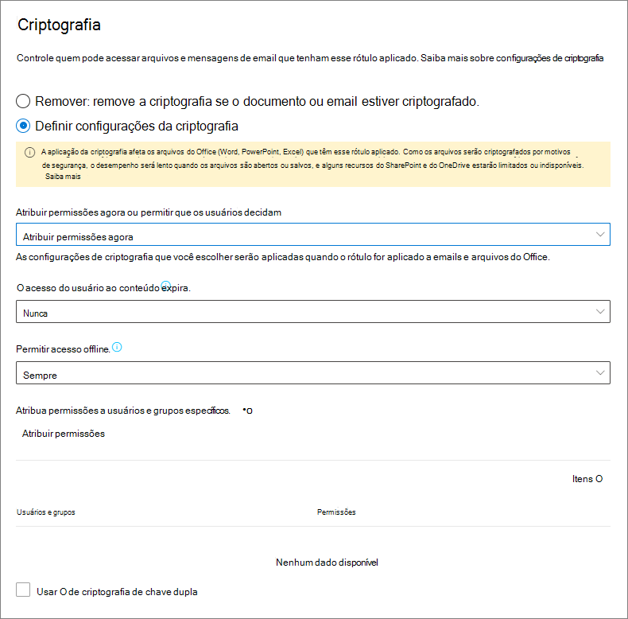
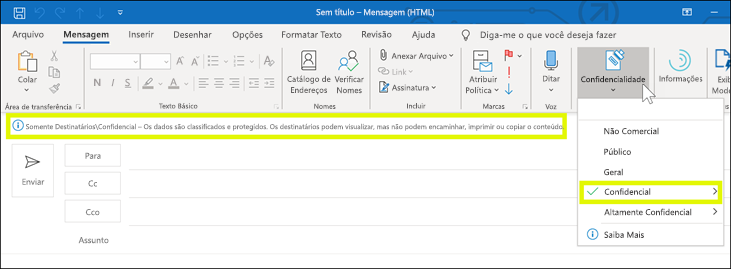

# Restringir o acesso ao conteúdo usando rótulos de confidencialidade para aplicar criptografiaRestrict access to content by using sensitivity labels to apply encryption

>*[Diretrizes de licenciamento do Microsoft 365 para segurança e conformidade](/office365/servicedescriptions/microsoft-365-service-descriptions/microsoft-365-tenantlevel-services-licensing-guidance/microsoft-365-security-compliance-licensing-guidance).**[Microsoft 365 licensing guidance for security & compliance](/office365/servicedescriptions/microsoft-365-service-descriptions/microsoft-365-tenantlevel-services-licensing-guidance/microsoft-365-security-compliance-licensing-guidance).*

Quando você cria um rótulo de confidencialidade, pode restringir o acesso ao conteúdo ao qual o rótulo será aplicado. Por exemplo, com as configurações de criptografia para um rótulo de confidencialidade, você pode proteger conteúdos de modo que:When you create a sensitivity label, you can restrict access to content that the label will be applied to. For example, with the encryption settings for a sensitivity label, you can protect content so that:

- Somente os usuários em sua organização possam abrir um documento ou um email confidenciais.Only users within your organization can open a confidential document or email.
- Somente os usuários do departamento de marketing possam editar e imprimir o documento ou email de comunicado de promoção, enquanto todos os outros usuários em sua organização possam apenas lê-lo.Only users in the marketing department can edit and print the promotion announcement document or email, while all other users in your organization can only read it.
- Os usuários não podem encaminhar um email ou copiar informações destas fontes que contêm notícias sobre uma reorganização interna.Users cannot forward an email or copy information from it that contains news about an internal reorganization.
- A lista de preços atual que enviada a parceiros de negócios não pode ser aberta após uma data especificada.The current price list that is sent to business partners cannot be opened after a specified date.

Quando um documento ou email é criptografado, o acesso ao conteúdo é restrito, para que ele:When a document or email is encrypted, access to the content is restricted, so that it:

- Pode ser descriptografado apenas por usuários autorizados pelas configurações de criptografia do rótulo.Can be decrypted only by users authorized by the label's encryption settings.
- Permanece criptografado independentemente de onde esteja, dentro ou fora da sua organização, mesmo se o arquivo for renomeado.Remains encrypted no matter where it resides, inside or outside your organization, even if the file's renamed.
- É criptografado tanto em repouso (por exemplo, em uma conta do OneDrive) quanto em trânsito (por exemplo, emails sendo enviados pela Internet).Is encrypted both at rest (for example, in a OneDrive account) and in transit (for example, email as it traverses the internet).

Por fim, como administrador, quando você configura um rótulo de confidencialidade para aplicar criptografia, há duas opções a escolher:Finally, as an admin, when you configure a sensitivity label to apply encryption, you can choose either to:

- **Atribuir permissões agora**, para que assim você possa determinar exatamente quais usuários podem obter quais permissões de conteúdo com esse rótulo.**Assign permissions now**, so that you determine exactly which users get which permissions to content with that label.
- **Permitir que os usuários atribuam permissões** quando aplicam o rótulo ao conteúdo.**Let users assign permissions** when they apply the label to content. Dessa forma, você pode conceder a pessoas em sua organização uma certa flexibilidade que elas possam precisar para colaborar e realizar o trabalho.This way, you can allow people in your organization some flexibility that they might need to collaborate and get their work done.

As configurações de criptografia estão disponíveis quando você [cria um rótulo de confidencialidade](create-sensitivity-labels.md) no Centro de conformidade do Microsoft 365.The encryption settings are available when you [create a sensitivity label](create-sensitivity-labels.md) in the Microsoft 365 compliance center. Você também pode usar o portal mais antigo, o Centro de Segurança e Conformidade.You can also use the older portal, the Security & Compliance Center.

## Entenda como funciona a criptografiaUnderstand how the encryption works

A criptografia usa o serviço Azure Rights Management (Azure RMS) da Proteção de Informações do Azure.Encryption uses the Azure Rights Management service (Azure RMS) from Azure Information Protection. Esta solução de proteção usa política de criptografia, identidade e autorização.This protection solution uses encryption, identity, and authorization policies. Para saber mais, confira [O que é o Azure Rights Management?](/azure/information-protection/what-is-azure-rms) na documentação da Proteção de Informações do Azure.To learn more, see [What is Azure Rights Management?](/azure/information-protection/what-is-azure-rms) from the Azure Information Protection documentation. 

Quando você usa essa solução de criptografia, o **recurso de superusuário** garante que as pessoas e os serviços autorizados possam sempre ler e inspecionar os dados criptografados para a sua organização.When you use this encryption solution, the **super user** feature ensures that authorized people and services can always read and inspect the data that has been encrypted for your organization. Se necessário, a criptografia poderá ser removida ou alterada.If necessary, the encryption can then be removed or changed. Para saber mais, confira [Configurar os superusuários para a Proteção de Informações do Azure, serviços de descoberta ou recuperação de dados](/azure/information-protection/configure-super-users).For more information, see [Configuring super users for Azure Information Protection and discovery services or data recovery](/azure/information-protection/configure-super-users).

## Como configurar um rótulo para criptografiaHow to configure a label for encryption

1. Siga as instruções gerais para [criar ou editar um rótulo de confidencialidade](create-sensitivity-labels.md#create-and-configure-sensitivity-labels) e certifique-se de que **Arquivos e emails** esteja selecionado para o escopo do rótulo:Follow the general instructions to [create or edit a sensitivity label](create-sensitivity-labels.md#create-and-configure-sensitivity-labels) and make sure **Files & emails** is selected for the label's scope: 
    
    

2. Em seguida, na página **Escolher configurações de proteção para arquivos e emails**, certifique-se de selecionar **Criptografar arquivos e emails**Then, on the **Choose protection settings for files and emails** page, make sure you select **Encrypt files and emails**
    
    

4.  Na página **Criptografia** do assistente, selecione uma das seguintes opções:On the **Encryption** page of the wizard, select one of the following options:
    
    - **Remova a criptografia se o arquivo estiver criptografado**: esta opção é compatível apenas com o cliente de rotulagem unificada da Proteção de Informações do Microsoft Azure.**Remove encryption if the file is encrypted**: This option is supported by the Azure Information Protection unified labeling client only. Quando você seleciona esta opção e usa rotulagem embutida, a etiqueta pode não ser exibida em aplicativos ou exibida e não fazer nenhuma alteração de criptografia.When you select this option and use built-in labeling, the label might not display in apps, or display and not make any encryption changes.
        
        Para obter mais informações sobre este cenário, confira a seção [O que acontece com a criptografia existente quando um rótulo é aplicado](#what-happens-to-existing-encryption-when-a-labels-applied).For more information about this scenario, see the [What happens to existing encryption when a label's applied](#what-happens-to-existing-encryption-when-a-labels-applied) section. É importante entender que essa configuração pode resultar em um rótulo de confidencialidade que os usuários podem não ser capazes de aplicar quando não têm permissões suficientes.It's important to understand that this setting can result in a sensitivity label that users might not be able to apply when they don't have sufficient permissions.
    
    - **Definir configurações de criptografia**: Ativa a criptografia e torna as configurações de criptografia visíveis:**Configure encryption settings**: Turns on encryption and makes the encryption settings visible:
        
        
        
        As instruções para essas configurações estão na seção [Definir configurações de criptografia a seguir](#configure-encryption-settings).Instructions for these settings are in the following [Configure encryption settings](#configure-encryption-settings) section.

### O que acontece com a criptografia existente quando um rótulo é aplicadoWhat happens to existing encryption when a label's applied

Se um rótulo de confidencialidade for aplicado ao conteúdo não criptografado, o resultado das opções de criptografia que você poderá selecionar será autoexplicativo.If a sensitivity label is applied to unencrypted content, the outcome of the encryption options you can select is self-explanatory. Por exemplo, se você não selecionou **Criptografar arquivos e emails**, o conteúdo permanecerá descriptografado.For example, if you didn't select **Encrypt files and emails**, the content remains unencrypted.

No entanto, conteúdo pode já estar criptografado.However, the content might be already encrypted. Por exemplo, outro usuário pode ter aplicado:For example, another user might have applied:

- Suas próprias permissões, que incluem permissões definidas pelo usuário quando solicitadas por um rótulo, permissões personalizadas pelo cliente da Proteção de Informações do Azure e a proteção de documento de **Acesso Restrito** de dentro de um aplicativo do Office.Their own permissions, which include user-defined permissions when prompted by a label, custom permissions by the Azure Information Protection client, and the **Restricted Access** document protection from within an Office app.
- Um modelo de proteção do Azure Rights Management que criptografa o conteúdo de maneira independente de um rótulo.An Azure Rights Management protection template that encrypts the content independently from a label. Esta categoria inclui regras de fluxo de email que aplicam criptografia usando a proteção de direitos.This category includes mail flow rules that apply encryption by using rights protection.
- Um rótulo que aplica criptografia com permissões atribuídas pelo administrador.A label that applies encryption with permissions assigned by the administrator.

A tabela a seguir identifica o que acontece com uma criptografia existente quando um rótulo de confidencialidade é aplicado ao conteúdo:The following table identifies what happens to existing encryption when a sensitivity label is applied to that content:

| | Criptografia: não selecionadaEncryption: Not selected | Criptografia: ConfiguradaEncryption: Configured | Criptografia: remover \*Encryption: Remove \* |
|:-----|:-----|:-----|:-----|
|**Permissões especificadas por um usuário****Permissions specified by a user**|A criptografia original é preservadaOriginal encryption is preserved|A criptografia de novo rótulo é aplicadaNew label encryption is applied|A criptografia original é removidaOriginal encryption is removed|
|**Modelo de proteção****Protection template**|A criptografia original é preservadaOriginal encryption is preserved|A criptografia de novo rótulo é aplicadaNew label encryption is applied|A criptografia original é removidaOriginal encryption is removed|
|**Rótulo com permissões definidas por administrador****Label with administator-defined permissions**|A criptografia original é removidaOriginal encryption is removed|A criptografia de novo rótulo é aplicadaNew label encryption is applied|A criptografia original é removidaOriginal encryption is removed|

**Rodapé:****Footnote:**

\* Suportado apenas pelo cliente de rotulagem unificada da Proteção de Informações do Azure\* Supported by the Azure Information Protection unified labeling client only

Nos casos em que a nova criptografia de rótulo é aplicada ou a criptografia original é removida, isso acontece apenas se o usuário que aplica o rótulo tiver um direito de uso ou função que ofereça suporte a esta ação:In the cases where the new label encryption is applied or the original encryption is removed, this happens only if the user applying the label has a usage right or role that supports this action:

- O [direito de uso](/azure/information-protection/configure-usage-rights#usage-rights-and-descriptions) Exportar ou Controle Total.The [usage right](/azure/information-protection/configure-usage-rights#usage-rights-and-descriptions) Export or Full Control.
- A função do [emissor de Gerenciamento de Direitos ou do proprietário de Gerenciamento de Direitos](/azure/information-protection/configure-usage-rights#rights-management-issuer-and-rights-management-owner) ou [superusuário](/azure/information-protection/configure-super-users).The role of [Rights Management issuer or Rights Management owner](/azure/information-protection/configure-usage-rights#rights-management-issuer-and-rights-management-owner), or [super user](/azure/information-protection/configure-super-users).

Se o usuário não tiver uma destes direitos ou funções, não será possível aplicar o rótulo, e a criptografia original é preservada.If the user doesn't have one of these rights or roles, the label can't be applied and so the original encryption is preserved. O usuário verá a seguinte mensagem: **Você não tem permissão para fazer essa alteração no rótulo de confidencialidade. Entre em contato com o proprietário do conteúdo.**The user sees the following message: **You don't have permission to make this change to the sensitivity label. Please contact the content owner.**

Por exemplo, a pessoa que aplica o Não Encaminhar a uma mensagem de email pode rotular novamente a sequência para substituir a criptografia ou removê-la, pois ela é a proprietária do Gerenciamento de Direitos do email.For example, the person who applies Do Not Forward to an email message can relabel the thread to replace the encryption or remove it, because they are the Rights Management owner for the email. No entanto, com exceção dos superusuários, os destinatários desse email não podem rotulá-lo novamente, pois não têm os direitos de uso necessários.But with the exception of super users, recipients of this email can't relabel it because they don't have the required usage rights.

#### Anexos de email para mensagens de email criptografadasEmail attachments for encrypted email messages

Quando uma mensagem de email é criptografada por qualquer método, todos os documentos do Office não criptografados que são anexados ao email herdam automaticamente as mesmas configurações de criptografia.When an email message is encrypted by any method, any unencrypted Office documents that are attached to the email automatically inherit the same encryption settings.

Os documentos que já estão criptografados e depois são adicionados como anexos sempre preservam a criptografia original.Documents that are already encrypted and then added as attachments always preserve their original encryption.

## Definir configurações da criptografiaConfigure encryption settings

Ao selecionar **Definir configurações de criptografia** na página **Criptografia** do assistente para criar ou editar um rótulo de confidencialidade, escolha uma das seguintes opções:When you select **Configure encryption settings** on the **Encryption** page of the wizard to create or edit a sensitivity label, choose one of the following options:

- **Atribuir permissões agora**, para assim determinar exatamente quais usuários podem obter quais permissões do conteúdo com o rótulo aplicado.**Assign permissions now**, so that you can determine exactly which users get which permissions to content that has the label applied. Para mais informações, consulte a próxima seção[Atribuir permissões agora](#assign-permissions-now).For more information, see the next section [Assign permissions now](#assign-permissions-now).
- **Permitir que os usuários atribuam permissões** quando aplicam o rótulo ao conteúdo.**Let users assign permissions** when your users apply the label to content. Com essa opção, você pode conceder uma certa flexibilidade a pessoas em sua organização para que possam colaborar e realizar o trabalho.With this option, you can allow people in your organization some flexibility that they might need to collaborate and get their work done. Para mais informações, confira a seção nessa página [ Permitir que usuários atribuam permissões](#let-users-assign-permissions).For more information, see the [Let users assign permissions](#let-users-assign-permissions) section on this page.

Por exemplo, se você tiver um rótulo de confidencialidade denominado **Altamente Confidencial** que será aplicado ao seu conteúdo mais confidencial, talvez você queira decidir agora quem obtém qual tipo de permissão para esse conteúdo.For example, if you have a sensitivity label named **Highly Confidential** that will be applied to your most sensitive content, you might want to decide now who gets what type of permissions to that content.

Como alternativa, se você tiver um rótulo de confidencialidade denominado **Contratos de Negócios**, e o fluxo de trabalho da sua organização exigir que as pessoas colaborem nesse conteúdo com outras pessoas de forma ad hoc, talvez você queira permitir que seus os usuários decidam quem receberá permissões quando atribui o rótulo.Alternatively, if you have a sensitivity label named **Business Contracts**, and your organization's workflow requires that your people collaborate on this content with different people on an ad hoc basis, you might want to allow your users to decide who gets permissions when they assign the label. Essa flexibilidade auxilia não só a produtividade dos usuários como também reduz as solicitações dos seus administradores de atualizar ou criar novos rótulos de sensibilidade para cenários específicos.This flexibility both helps your users' productivity and reduces the requests for your admins to update or create new sensitivity labels to address specific scenarios.

Optar por atribuir permissões agora ou permitir que os usuários atribuam permissões:Choosing whether to assign permissions now or let users assign permissions:

## Atribuir permissões agoraAssign permissions now

Use as opções abaixo para controlar quem pode acessar os emails ou documentos aos quais aquele rótulo foi aplicado. Você pode:Use the following options to control who can access email or documents to which this label is applied. You can:

- **Permitir que o acesso ao conteúdo rotulado expire** em uma data específica ou depois de um número específico de dias após o rótulo ser aplicado. Após este período, os usuários não poderão abrir o item rotulado. Se você especificar uma data, isso será válido a partir da meia-noite da data em questão no seu fuso horário atual. (Observe que alguns clientes de email talvez não apliquem a expiração e mostrem emails após a data de validade devido aos seus mecanismos de armazenamento em cache.)**Allow access to labeled content to expire**, either on a specific date or after a specific number of days after the label is applied. After this time, users won't be able to open the labeled item. If you specify a date, it is effective midnight on that date in your current time zone. (Note that some email clients might not enforce expiration and show emails past their expiration date, due to their caching mechanisms.)

- **Permitir o acesso offline** nunca, sempre ou por um número específico de dias após o rótulo ser aplicado. Se você restringir o acesso offline para nunca ou por um número de dias, quando este limite for atingido, os usuários precisarão ser autenticados novamente e seu acesso será registrado. Para saber mais, confira a próxima seção na licença de uso de Gerenciamento de Direitos.**Allow offline access** never, always, or for a specific number of days after the label is applied. If you restrict offline access to never or a number of days, when that threshold is reached, users must be reauthenticated and their access is logged. For more information, see the next section on the Rights Management use license.

Configurações de controle de acesso para conteúdo criptografado:Settings for access control for encrypted content:

### Licença de uso de Gerenciamento de Direitos para acesso offlineRights Management use license for offline access

Quando um usuário abre um documento ou e-mail que foi protegido por criptografia do serviço Azure Rights Management, uma licença de uso do Azure Rights Management para esse conteúdo é concedida ao usuário. Esta licença de uso é um certificado que contém os direitos de uso do usuário para o documento ou e-mail, e a chave de criptografia que foi utilizada para criptografar o conteúdo. A licença de uso também conterá uma data de expiração se esta tiver sido definida, e por quanto tempo a licença de uso é válida.When a user opens a document or email that's been protected by encryption from the Azure Rights Management service, an Azure Rights Management use license for that content is granted to the user. This use license is a certificate that contains the user's usage rights for the document or email, and the encryption key that was used to encrypt the content. The use license also contains an expiration date if this has been set, and how long the use license is valid.

Se nenhuma data de vencimento tiver sido definida, o período de validade da licença de uso padrão para um locatário é de 30 dias. Pela duração da licença de uso, o usuário não precisa ser autenticado ou autorizado novamente para o conteúdo. Esse processo permite que o usuário continue a abrir o documento ou email protegido sem uma conexão de Internet. Quando expirar o período de validade da licença de uso, na próxima vez em que o usuário acessar o documento ou email protegido, ele precisará ser autenticado e autorizado novamente.If no expiration date has been set, the default use license validity period for a tenant is 30 days. For the duration of the use license, the user is not reauthenticated or reauthorized for the content. This process lets the user continue to open the protected document or email without an internet connection. When the use license validity period expires, the next time the user accesses the protected document or email, the user must be reauthenticated and reauthorized.

Além da reautenticação, são reavaliadas as configurações de criptografia e a filiação a grupos de usuários. Isso significa que os usuários podem experimentar diferentes resultados de acesso para o mesmo documento ou e-mail se houver mudanças nas configurações de criptografia ou filiação em grupo desde a última vez que acessaram o conteúdo.In addition to reauthentication, the encryption settings and user group membership is reevaluated. This means that users could experience different access results for the same document or email if there are changes in the encryption settings or group membership from when they last accessed the content.

Para saber como alterar a configuração padrão de 30 dias, confira [Licença de uso de Gerenciamento de Direitos](/azure/information-protection/configure-usage-rights#rights-management-use-license)..To learn how to change the default 30-day setting, see [Rights Management use license](/azure/information-protection/configure-usage-rights#rights-management-use-license).

### Atribuir permissões a usuários ou grupos específicosAssign permissions to specific users or groups

Você pode conceder permissões a pessoas específicas para que somente elas possam interagir com o conteúdo rotulado:You can grant permissions to specific people so that only they can interact with the labeled content:

1. Primeiro, adicione usuários ou grupos que receberão permissões para o conteúdo rotulado.First, add users or groups that will be assigned permissions to the labeled content.

2. Em seguida, escolha quais permissões os usuários devem ter para o conteúdo rotulado.Then, choose which permissions those users should have for the labeled content.

Atribuindo permissões:Assigning permissions:

#### Adicionar usuários ou gruposAdd users or groups

Quando você atribui permissões, pode escolher:When you assign permissions, you can choose:

- Todos em sua organização (todos os membros locatários). Esta configuração exclui contas de convidados.Everyone in your organization (all tenant members). This setting excludes guest accounts.

- Todos os usuários autenticados.Any authenticated users. Verifique se você entendeu os [requisitos e limitações](#requirements-and-limitations-for-add-any-authenticated-users) dessa configurações antes de selecioná-la.Make sure you understand the [requirements and limitations](#requirements-and-limitations-for-add-any-authenticated-users) of this setting before selecting it.

- Qualquer usuário específico ou grupo de segurança habilitado para e-mail, grupo de distribuição ou grupo do Microsoft 365 ([anteriormente grupo do Office 365](https://techcommunity.microsoft.com/t5/microsoft-365-blog/office-365-groups-will-become-microsoft-365-groups/ba-p/1303601)) no Azure AD.Any specific user or email-enabled security group, distribution group, or Microsoft 365 group ([formerly Office 365 group](https://techcommunity.microsoft.com/t5/microsoft-365-blog/office-365-groups-will-become-microsoft-365-groups/ba-p/1303601)) in Azure AD. O grupo do Microsoft 365 pode ter uma [associação estática ou dinâmica](/azure/active-directory/users-groups-roles/groups-create-rule).The Microsoft 365 group can have static or [dynamic membership](/azure/active-directory/users-groups-roles/groups-create-rule). Observe que você não pode usar um [grupo de distribuição dinâmico do Exchange](/Exchange/recipients/dynamic-distribution-groups/dynamic-distribution-groups) porque esse tipo de grupo não está sincronizado com o Microsoft Azure Active Directory e não pode usar um grupo de segurança que não esteja habilitado para email.Note that you can't use a [dynamic distribution group from Exchange](/Exchange/recipients/dynamic-distribution-groups/dynamic-distribution-groups) because this group type isn't synchronized to Azure AD, and you can't use a security group that isn't email-enabled.

- Qualquer endereço de email ou domínio.Any email address or domain. Use esta opção para especificar todos os usuários em outra organização que usa o Azure AD, inserindo qualquer nome de domínio dessa organização.Use this option to specify all users in another organization who uses Azure AD, by entering any domain name from that organization. Você também pode usar essa opção para provedores sociais, inserindo o nome de domínio, como **gmail.com**, **hotmail.com** ou **outlook.com**.You can also use this option for social providers, by entering their domain name such as **gmail.com**, **hotmail.com**, or **outlook.com**.

    > [!NOTE]
    > Se você especificar um domínio de uma organização que usa o Azure AD, não será possível restringir o acesso a esse domínio específico.If you specify a domain from an organization that uses Azure AD, you can't restrict access to that specific domain. Em vez disso, todos os domínios verificados no Azure AD são incluídos automaticamente para o locatário que possui o nome de domínio especificado por você.Instead, all verified domains in Azure AD are automatically included for the tenant that owns the domain name you specify.

Quando você escolhe todos os usuários e grupos em sua organização ou procura o diretório, os usuários ou grupos devem ter um endereço de email.When you choose all users and groups in your organization or browse the directory, the users or groups must have an email address.

Como prática recomendada, use grupos em vez de usuários. Essa estratégia mantém a configuração mais simples.As a best practice, use groups rather than users. This strategy keeps your configuration simpler.

##### Requisitos e limitações para "Adicionar usuários autenticados".Requirements and limitations for "Add any authenticated users"

Essa configuração não restringe as pessoas que podem acessar o conteúdo que o rótulo criptografa, ainda criptografando o conteúdo e fornecendo opções para restringir a maneira como o conteúdo pode ser usado (permissões) e acessado (expiração e acesso offline).This setting doesn't restrict who can access the content that the label encrypts, while still encrypting the content and providing you with options to restrict how the content can be used (permissions), and accessed (expiry and offline access). No entanto, o aplicativo que está abrindo o conteúdo criptografado deve ser capaz de oferecer suporte à autenticação que está sendo usada.However, the application opening the encrypted content must be able to support the authentication being used. Por esse motivo, os provedores sociais federados, como o Google, e a autenticação de senha única funcionam apenas para email e somente quando você usa o Exchange Online.For this reason, federated social providers such as Google, and onetime passcode authentication work for email only, and only when you use Exchange Online. As contas da Microsoft podem ser usadas com aplicativos do Office 365 e com o [visualizador da Proteção de Informações do Azure](https://portal.azurerms.com/#/download).Microsoft accounts can be used with Office 365 apps and the [Azure Information Protection viewer](https://portal.azurerms.com/#/download).

> [!NOTE]
> Considere usar essa configuração com a [integração do SharePoint e do OneDrive com o Azure AD B2B](/sharepoint/sharepoint-azureb2b-integration-preview) quando os rótulos de confidencialidade estão [habilitados para arquivos do Office no SharePoint e OneDrive](sensitivity-labels-sharepoint-onedrive-files.md).Consider using this setting with [SharePoint and OneDrive integration with Azure AD B2B](/sharepoint/sharepoint-azureb2b-integration-preview) when sensitivity labels are [enabled for Office files in SharePoint and OneDrive](sensitivity-labels-sharepoint-onedrive-files.md).

Alguns cenários típicos para qualquer configuração de usuários autenticados:Some typical scenarios for any authenticated users setting:

- Você não se importa em quem vê o conteúdo, mas deseja restringir a maneira como ele é usado.You don't mind who views the content, but you want to restrict how it is used. Por exemplo, você não deseja que o conteúdo seja editado, copiado ou impresso.For example, you don't want the content to be edited, copied, or printed.
- Você não deseja restringir as pessoas que acessam o conteúdo, mas deseja pode confirmar quem o abre.You don't need to restrict who accesses the content, but you want to be able to confirm who opens it.
- Você possui um requisito de que o conteúdo deve ser criptografado em repouso e em trânsito, mas não requer controles de acesso.You have a requirement that the content must be encrypted at rest and in transit, but it doesn't require access controls.

#### Escolher permissõesChoose permissions

Quando você escolhe quais permissões atribuir para os usuários ou grupos, você pode selecionar:When you choose which permissions to allow for those users or groups, you can select either:

- Um [nível de permissões predefinidas](/azure/information-protection/configure-usage-rights#rights-included-in-permissions-levels) com um grupo predefinido de direitos, como co-autor ou revisor.A [predefined permissions level](/azure/information-protection/configure-usage-rights#rights-included-in-permissions-levels) with a preset group of rights, such as Co-Author or Reviewer.
- Permissões personalizadas, em que você escolhe um ou mais direitos de uso.Custom permissions, where you choose one or more usage rights.

Para obter mais informações sobre como selecionar as permissões apropriadas, confira [Descrições e os direitos de uso](/azure/information-protection/configure-usage-rights#usage-rights-and-descriptions).For more information to help you select the appropriate permissions, see [Usage rights and descriptions](/azure/information-protection/configure-usage-rights#usage-rights-and-descriptions).  

Observe que o mesmo rótulo pode atribuir permissões diferentes a usuários diferentes. Por exemplo, um rótulo único pode definir alguns usuários como Revisores e um usuário diferente como Co-Autor, como mostrado na captura de tela a seguir.Note that the same label can grant different permissions to different users. For example, a single label can assign some users as Reviewer and a different user as Co-author, as shown in the following screenshot.

Para fazer isso, adicione usuários ou grupos, atribua-lhes permissões e salve essas configurações. Depois repita essas etapas, adicionando usuários e atribuindo-lhes permissões, salvando as configurações a cada vez. Você pode repetir essa configuração quantas vezes for necessário para definir permissões diferentes para usuários diferentes.To do this, add users or groups, assign them permissions, and save those settings. Then repeat these steps, adding users and assigning them permissions, saving the settings each time. You can repeat this configuration as often as necessary, to define different permissions for different users.

#### O emissor do Gerenciamento de Direitos (usuário que aplica o rótulo de confidencialidade) sempre tem o Controle TotalRights Management issuer (user applying the sensitivity label) always has Full Control

A criptografia para um rótulo de sensibilidade utiliza o serviço de Microsoft Azure AD Rights Management da Proteção de Informações do Microsoft Azure. Quando um usuário aplica uma etiqueta de sensibilidade para proteger um documento ou e-mail utilizando a criptografia, esse usuário se torna o emissor do Gerenciamento de Direitos para esse conteúdo.Encryption for a sensitivity label uses the Azure Rights Management service from Azure Information Protection. When a user applies a sensitivity label to protect a document or email by using encryption, that user becomes the Rights Management issuer for that content.

O emissor do Gerenciamento de Direitos sempre recebe as permissões de Controle Total para o documento ou email, e também:The Rights Management issuer is always granted Full Control permissions for the document or email, and in addition:

- Se as configurações de criptografia incluem uma data de vencimento, o emissor do Gerenciamento de Direitos ainda pode abrir e editar o documento ou email após essa data.If the encryption settings include an expiration date, the Rights Management issuer can still open and edit the document or email after that date.
- O emissor do Gerenciamento de Direitos sempre pode acessar o documento ou email offline.The Rights Management issuer can always access the document or email offline.
- O emissor do Gerenciamento de Direitos ainda consegue abrir um documento após sua revogação.The Rights Management issuer can still open a document after it is revoked.

Para saber mais, confira [Emissor do Gerenciamento de Direitos e Proprietário do Gerenciamento de Direitos](/azure/information-protection/configure-usage-rights#rights-management-issuer-and-rights-management-owner).For more information, see [Rights Management issuer and Rights Management owner](/azure/information-protection/configure-usage-rights#rights-management-issuer-and-rights-management-owner).

### Criptografia de Chave DuplaDouble Key Encryption

> [!NOTE]
> No momento, esse recurso tem suporte apenas pelo cliente de rotulagem unificada da Proteção de Informações do Azure.This feature is currently supported only by the Azure Information Protection unified labeling client.

Selecione essa opção apenas depois de ter configurado o serviço de Criptografia de chave dupla, sendo que você precisará usar essa criptografia de chave dupla nos arquivos que terão esse rótulo aplicado.Select this option only after you have configured the Double Key Encryption service and you need to use this double key encryption for files that will have this label applied.

Para obter mais informações, pré-requisitos e instruções de configuração, confira [(DKE) Criptografia de Chave Dupla](double-key-encryption.md)For more information, prerequisites, and configuration instructions, see [Double Key Encryption (DKE)](double-key-encryption.md).

## Permitir que usuários atribuam permissõesLet users assign permissions

> [!IMPORTANT]
> Nem todos os clientes de etiquetagem suportam todas as opções que permitem aos usuários atribuir suas próprias permissões. Use esta seção para saber mais.Not all labeling clients support all the options that let users assign their own permissions. Use this section to learn more.

Você pode usar as seguintes opções para permitir que os usuários atribuam permissões quando aplicam manualmente um rótulo de sensibilidade ao conteúdo:You can use the following options to let users assign permissions when they manually apply a sensitivity label to content:

- No Outlook, o usuário pode selecionar restrições equivalentes à opção [Não Encaminhar](/azure/information-protection/configure-usage-rights#do-not-forward-option-for-emails) ou [Criptografar Somente](/azure/information-protection/configure-usage-rights#encrypt-only-option-for-emails) para os destinatários escolhidos.In Outlook, a user can select restrictions equivalent to the [Do Not Forward](/azure/information-protection/configure-usage-rights#do-not-forward-option-for-emails) option or [Encrypt-only](/azure/information-protection/configure-usage-rights#encrypt-only-option-for-emails) for their chosen recipients.
    
    A opção Não Encaminhar é compatível com todos os clientes de email que têm suporte para os rótulos de confidencialidade.The Do Not Forward option is supported by all email clients that support sensitivity labels. No entanto, a aplicação da opção **Criptografar Somente** com um rótulo de confidencialidade é um lançamento recente que tem suporte apenas por rotulagem integrada, e não pelo cliente de rotulagem unificada da Proteção de Informações do Azure.However, applying the **Encrypt-Only** option with a sensitivity label is a recent release that's supported only by built-in labeling and not the Azure Information Protection unified labeling client. O rotulo não ficará visível para os clientes de email que não têm suporte para esse recurso.For email clients that don't support this capability, the label won't be visible.
    
    Para verificar as versões mínimas dos aplicativos Outlook que usam etiquetagem integrada para suportar a aplicação da opção Encrypt-Only com uma etiqueta de sensibilidade, use a [tabela de capacidades para Outlook](sensitivity-labels-office-apps.md#sensitivity-label-capabilities-in-outlook) e a linha **Permitir que usuários atribuam permissões: - Encrypt-Only**.To check the minimum versions of Outlook apps that use built-in labeling to support applying the Encrypt-Only option with a sensitivity label, use the [capabilities table for Outlook](sensitivity-labels-office-apps.md#sensitivity-label-capabilities-in-outlook) and the row **Let users assign permissions: - Encrypt-Only**.

- No Word, no PowerPoint e no Excel, um usuário deve selecionar suas próprias permissões para usuários, grupos ou organizações específicos.In Word, PowerPoint, and Excel, a user is prompted to select their own permissions for specific users, groups, or organizations.

    Esta opção dá suporte ao cliente de rotulagem unificada da Proteção de Informações do Azure e a alguns aplicativos que usam a rotulagem integrada.This option is supported by the Azure Information Protection unified labeling client and by some apps that use built-in labeling. Para os aplicativos que não dão suporte a esse recurso, ou a rotulagem não ficará visível para os usuários, ou ela ficará visível para consistência, mas não poderá ser aplicada com uma mensagem de explicação aos usuários.For apps that don't support this capability, the label either won't be visible for users, or the label is visible for consistency but it can't be applied with an explanation message to users.
    
    Para verificar quais aplicativos que usam a rotulagem integrada têm suporte para essa opção, use a [tabela de recursos para o Word, o Excel e o PowerPoint](sensitivity-labels-office-apps.md#sensitivity-label-capabilities-in-word-excel-and-powerpoint) e a linha **Permitir que usuários atribuam permissões: – Solicitar aos usuários**.To check which apps that use built-in labeling support this option, use the [capabilities table for Word, Excel, and PowerPoint](sensitivity-labels-office-apps.md#sensitivity-label-capabilities-in-word-excel-and-powerpoint) and the row **Let users assign permissions: - Prompt users**.

Quando houver suporte para as opções, use a tabela a seguir para identificar quais usuários verão o rótulo de confidencialidade:When the options are supported, use the following table to identify when users see the sensitivity label:

|ConfiguraçãoSetting |Rótulo visível no OutlookLabel visible in Outlook|Rótulo visível no Word, Excel, PowerPointLabel visible in Word, Excel, PowerPoint|
|:-----|:-----|:-----|:-----|
|**No Outlook, impor restrições com a opção de Não Encaminhar ou a de Criptografar Somente****In Outlook, enforce restrictions with the Do Not Forward or Encrypt-Only option**|SimYes |NãoNo |
|**Solicite que os usuário especifiquem permissões no Word, no PowerPoint e no Excel****In Word, PowerPoint, and Excel, prompt users to specify permissions**|NãoNo |SimYes|

Quando ambas as configurações são selecionadas, o rótulo fica visível no Outlook, no Word, no Excel e no PowerPoint.When both settings are selected, the label is therefore visible in both Outlook and in Word, Excel, and PowerPoint.

Um rótulo de confidencialidade que permite aos usuários atribuir permissões deve ser aplicado manualmente ao conteúdo pelos usuários; não pode ser aplicado automaticamente ou usado como um rótulo recomendado.A sensitivity label that lets users assign permissions must be applied to content manually by users; it can't be auto-applied or used as a recommended label.

Configurar as permissões atribuídas ao usuários:Configuring the user-assigned permissions:

### Restrições do OutlookOutlook restrictions

No Outlook, quando um usuário aplica um rótulo de confidencialidade que permite atribuir permissões a uma mensagem, você pode escolher a opção de **Não Encaminhar** ou a de **Criptografar Somente**.In Outlook, when a user applies a sensitivity label that lets them assign permissions to a message, you can choose the **Do Not Forward option** or **Encrypt-Only**. O usuário verá o nome e a descrição do rótulo na parte superior da mensagem, o que indica que o conteúdo é protegido.The user will see the label name and description at the top of the message, which indicates the content's being protected. Diferentemente do Word, do PowerPoint e do Excel (confira a [ próxima seção](#word-powerpoint-and-excel-permissions)), os usuários não são solicitados a selecionar permissões específicas.Unlike Word, PowerPoint, and Excel (see the [next section](#word-powerpoint-and-excel-permissions)), users aren't prompted to select specific permissions.

Quando uma dessas opções é aplicada a um email, o email é criptografado e os destinatários devem ser autenticados. Então, os destinatários têm automaticamente direitos de uso restritos:When either of these options are applied to an email, the email is encrypted and recipients must be authenticated. Then, the recipients automatically have restricted usage rights:

- **Não Encaminhar**: os destinatários não podem encaminhar o email, imprimi-lo ou copiá-lo.**Do Not Forward**: Recipients cannot forward the email, print it, or copy from it. Por exemplo, no cliente do Outlook, o botão Encaminhar não está disponível, as opções do menu Salvar Como e Imprimir não estão disponíveis, e você não pode adicionar ou alterar destinatários nas caixas Para, CC ou Cco.For example, in the Outlook client, the Forward button is not available, the Save As and Print menu options are not available, and you cannot add or change recipients in the To, Cc, or Bcc boxes.
    
    Para saber mais sobre como essa opção funciona, confira [opção Não Encaminhar para emails](/azure/information-protection/configure-usage-rights#do-not-forward-option-for-emails).For more information about how this option works, see [Do Not Forward option for emails](/azure/information-protection/configure-usage-rights#do-not-forward-option-for-emails).

- **Criptografar Somente**: os destinatários têm todos os direitos de uso, exceto Salvar como, Exportar e Controle Total.**Encrypt-Only**: Recipients have all usage rights except Save As, Export and Full Control. Essa combinação de direitos de uso significa que os destinatários não têm restrições, exceto que não podem remover a proteção.This combination of usage rights means that the recipients have no restrictions except that they cannot remove the protection. Por exemplo, um destinatário pode copiar do email, imprimi-lo e encaminhá-lo.For example, a recipient can copy from the email, print it, and forward it.
    
    Para saber mais sobre como essa opção funciona, confira [opção Criptografar Somente para emails](/azure/information-protection/configure-usage-rights#encrypt-only-option-for-emails).For more information about how this option works, see [Encrypt-only option for emails](/azure/information-protection/configure-usage-rights#encrypt-only-option-for-emails).

Os documentos do Office não criptografados anexados ao email herdam automaticamente as mesmas restrições.Unencrypted Office documents that are attached to the email automatically inherit the same restrictions. Para a opção Não Encaminhar, os direitos de uso aplicados a esses documentos são Editar Conteúdo, Editar; Salvar, Exibir, Abrir, Ler; e Permitir Macros.For Do Not Forward, the usage rights applied to these documents are Edit Content, Edit; Save; View, Open, Read; and Allow Macros. Se o usuário quiser direitos de uso diferentes para um anexo, ou se o anexo não for um documento do Office compatível com essa proteção herdada, o usuário precisará criptografar o arquivo antes de anexá-lo ao email.If the user wants different usage rights for an attachment, or the attachment is not an Office document that supports this inherited protection, the user needs to encrypt the file before attaching it to the email.

### Permissões do Word, do PowerPoint e do ExcelWord, PowerPoint, and Excel permissions

No Word, no PowerPoint e no Excel, quando um usuário aplica um rótulo de confidencialidade que permite atribuir permissões a um documento, ele é solicitado a especificar a escolha de usuários e permissões quando a criptografia é aplicada.In Word, PowerPoint, and Excel, when a user applies a sensitivity label that lets them assign permissions to a document, they are prompted to specify their choice of users and permissions when the encryption is applied.

Por exemplo, com o cliente de rotulagem unificada da Proteção de Informações do Azure, os usuários podem:For example, with the Azure Information Protection unified labeling client, users can:

- Selecionar um nível de permissão, como o Visualizador (que atribui permissão Somente para Exibição) ou Coautor (que atribui permissões de Exibição, Edição, Cópia e Impressão).Select a permission level, such as Viewer (which assigns View Only permission) or Co-Author (which assigns View, Edit, Copy, and Print permissions).
- Selecione usuários, grupos ou organizações.Select users, groups, or organizations. Isso pode incluir pessoas tanto de dentro quanto de fora de sua organização.This can include people both inside or outside your organizations.
- Defina uma data de vencimento, após a qual os usuários selecionados não poderão acessar o conteúdo.Set an expiration date, after which the selected users cannot access the content. Para saber mais, confira a seção acima [Licença de uso do Gerenciamento de Direitos para acesso online](#rights-management-use-license-for-offline-access).For more information, see the above section [Rights Management use license for offline access](#rights-management-use-license-for-offline-access).

Para rotulagem interna, os usuários visualizam a mesma caixa de diálogo se selecionarem o seguinte:For built-in labeling, users see the same dialog box if they select the following:

- Windows: guia **Arquivo** > **Informações** > **Proteger Documento** > **Restringir Acesso** > **Acesso Restrito**Windows: **File** tab > **Info** > **Protect Document** > **Restrict Access** > **Restricted Access**

- MacOS: guia **Análise** > **Proteção** > **Permissões** > **Acesso Restrito**macOS: **Review** tab > **Protection** > **Permissions** > **Restricted Access**

## Exemplos de configurações para as configurações de criptografiaExample configurations for the encryption settings

Para cada exemplo a seguir, faça a configuração na página **Criptografia** do assistente quando **Definir configurações de criptografia** estiver selecionado:For each example that follows, do the configuration from the **Encryption** page of the wizard when **Configure encryption settings** is selected:

### Exemplo 1: Rótulo que aplica Não Encaminhar para enviar um email criptografado para uma conta do GmailExample 1: Label that applies Do Not Forward to send an encrypted email to a Gmail account

Esse rótulo é exibido apenas no Outlook e no Outlook na Web, e você deve usar o Exchange Online.This label displays only in Outlook and Outlook on the web, and you must use Exchange Online. Instrua os usuários a selecionar esse rótulo quando precisarem enviar um email criptografado para pessoas que usam uma conta do Gmail (ou qualquer outra conta de email fora da sua organização).Instruct users to select this label when they need to send an encrypted email to people using a Gmail account (or any other email account outside your organization).

Os usuários digitam o endereço de email do Gmail na caixa **Para**.Your users type the Gmail email address in the **To** box.  Em seguida, eles selecionam o rótulo e a opção Não Encaminhar é adicionada automaticamente ao email.Then, they select the label and the Do Not Forward option is automatically added to the email. O resultado é que os destinatários não podem encaminhar o email, imprimi-lo, copiá-lo ou salvá-lo fora da caixa de correio usando a opção **Salvar Como**.The result is that recipients cannot forward the email, or print it, copy from it, or save the email outside their mailbox by using the **Save As** option.

1. Na página **Criptografia**: Para **Atribuir permissões agora ou permitir que os usuários decidam?** selecione **Permitir que os usuários atribuam permissões ao aplicar o rótulo**.On the **Encryption** page: For **Assign permissions now or let users decide?** select **Let users assign permissions when they apply the label**.

2. Marque a caixa de seleção: **No Outlook, impor restrições equivalentes à opção Não Encaminhar**.Select the checkbox: **In Outlook, enforce restrictions equivalent to the Do Not Forward option**.

3. Se selecionad0, desmarque a caixa de seleção: **No Word, PowerPoint e Excel, solicite aos usuários que especifiquem permissões**.If selected, clear the checkbox: **In Word, PowerPoint, and Excel, prompt users to specify permissions**.

4. Selecione **Próximo** e conclua o assistente.Select **Next** and complete the wizard.

### Exemplo 2: Rótulo que restringe a permissão somente leitura para todos os usuários em outra organizaçãoExample 2: Label that restricts read-only permission to all users in another organization

Esse rótulo é adequado para compartilhar documentos muito confidenciais como somente leitura e os documentos que sempre exigem uma conexão com a Internet para visualizá-los.This label is suitable for sharing very sensitive documents as read-only, and the documents always require an internet connection to view them.

Esse rótulo não é adequado para emails.This label is not suitable for emails.

1. Na página **Criptografia**: Para **Atribuir permissões agora ou permitir que os usuários decidam?** selecione **Atribuir permissões agora**.On the **Encryption** page: For **Assign permissions now or let users decide?** select **Assign permissions now**.

2. Para **Permitir acesso offline**, selecione **Nunca**.For **Allow offline access**, select **Never**.

3. Selecione **Atribuir permissões**.Select **Assign permissions**.

4. No painel **Atribuir permissões**, selecione **Adicionar esses endereços de email ou domínios específicos**.On the **Assign permissions** pane, select **Add specific email addresses or domains**.

5. Na caixa de texto, insira o nome de um domínio da outra organização, por exemplo, **fabrikam.com**.In the text box, enter the name of a domain from the other organization, for example, **fabrikam.com**. Em seguida, selecione **OK**.Then select **Add**.

6. Clique em **Selecionar permissões**.Select **Choose permissions**.

7. No painel **Escolher permissões**, marque a caixa suspensa, selecione **Visualizador** e, em seguida, selecione **Salvar**.On the **Choose permissions** pane, select the dropdown box, select **Viewer**, and then select **Save**.

8. De volta ao painel **Atribuir permissões**, selecione **Salvar**.Back on the **Assign Permissions** pane, select **Save**.

9. Na página **Criptografia**, selecione **Próximo** e conclua o assistente.On the **Encryption** page, select **Next** and complete the wizard.

### Exemplo 3: Adicionar usuários externos a um rótulo existente que criptografa conteúdoExample 3: Add external users to an existing label that encrypts content

Os novos usuários que você adicionar poderão abrir documentos e emails que já foram protegidos com esse rótulo.The new users that you add will be able open documents and emails that have already been protected with this label. As permissões que você concede a esses usuários podem ser diferentes das permissões que os usuários existentes possuem.The permissions that you grant these users can be different from the permissions that the existing users have.

1. Na página **Criptografia**: Para **Atribuir permissões agora ou permitir que os usuários decidam?** verifique se a opção **Atribuir permissões agora** está selecionada.On the **Encryption** page: For **Assign permissions now or let users decide?** make sure **Assign permissions now** is selected.

2. Selecione **Atribuir permissões**.Select **Assign permissions**.

3. No painel **Atribuir permissões**, selecione **Adicionar esses endereços de email ou domínios específicos**.On the **Assign permissions** pane, select **Add specific email addresses or domains**.

4. Na caixa de texto, insira o endereço de email do primeiro usuário (ou grupo) a ser adicionado e, em seguida, selecione **Adicionar**.In the text box, enter the email address of the first user (or group) to add, and then select **Add**.

5. Clique em **Selecionar permissões**.Select **Choose permissions**.

6. No painel **Escolher permissões**, selecione as permissões para esse usuário (ou grupo) e, em seguida, selecione **Salvar**.On the **Choose permissions** pane, select the permissions for this user (or group), and then select **Save**.

7. Volte para o painel **Atribuir permissões**, repita as etapas de 3 a 6 para cada usuário (ou grupo) que você deseja adicionar a esse rótulo.Back on the **Assign Permissions** pane, repeat steps 3 through 6 for each user (or group) that you want to add to this label. Em seguida, clique em **Salvar**.Then click **Save**.

8. Na página **Criptografia**, selecione **Próximo** e conclua o assistente.On the **Encryption** page, select **Next** and complete the wizard.

### Exemplo 4: Rótulo que criptografa o conteúdo, mas não restringe quem pode acessá-loExample 4: Label that encrypts content but doesn't restrict who can access it

Essa configuração tem a vantagem de que você não precisa especificar usuários, grupos ou domínios para criptografar um email ou documento.This configuration has the advantage that you don't need to specify users, groups, or domains to encrypt an email or document. O conteúdo ainda será criptografado e você ainda poderá especificar os direitos de uso, uma data de vencimento e o acesso offline.The content will still be encrypted and you can still specify usage rights, an expiry date, and offline access.

Use essa configuração somente quando não precisar restringir quem pode abrir o documento protegido ou o email.Use this configuration only when you do not need to restrict who can open the protected document or email. [Mais informações sobre essa configuraçãoMore information about this setting](#requirements-and-limitations-for-add-any-authenticated-users)

1. Na página **Criptografia**: Para **Atribuir permissões agora ou permitir que os usuários decidam?** verifique se a opção **Atribuir permissões agora** está selecionada.On the **Encryption** page: For **Assign permissions now or let users decide?** make sure **Assign permissions now** is selected.

2. Defina as configurações para **O acesso do usuário ao conteúdo expira** e **Permitir acesso offline**, conforme necessário.Configure settings for **User access to content expires** and **Allow offline access** as required.

3. Selecione **Atribuir permissões**.Select **Assign permissions**.

4. No painel **Atribuir permissões**, selecione **Adicionar todos os usuários autenticados**.On the **Assign permissions** pane, select **Add any authenticated users**.

    Para **Usuários e grupos**, você vê **Usuários autenticados** adicionado automaticamente.For **Users and groups**, you see **Authenticated users** automatically added. Você não pode alterar esse valor, só excluí-lo, o que cancela a seleção **Adicionar todos os usuários autenticados**.You can't change this value, only delete it, which cancels the **Add any authenticated users** selection.

5. Clique em **Selecionar permissões**.Select **Choose permissions**.

6. No painel **Escolher permissões**, marque a caixa suspensa, selecione as permissões que você quer, e selecione **Salvar**.On the **Choose permissions** pane, select the dropdown box, select the permissions you want, and then select **Save**.

7. De volta ao painel **Atribuir permissões**, selecione **Salvar**.Back on the **Assign Permissions** pane, select **Save**.

8. Na página **Criptografia**, selecione **Próximo** e conclua o assistente.On the **Encryption** page, select **Next** and complete the wizard.

## Considerações para o conteúdo criptografadoConsiderations for encrypted content

Criptografar seus documentos e emails mais confidenciais ajuda a garantir que somente pessoas autorizadas possam acessar esses dados.Encrypting your most sensitive documents and emails helps to ensure that only authorized people can access this data. No entanto, há algumas coisas a se considerar:However, there are some considerations to take into account:

- Se sua organização ainda não [habilitou rótulos de confidencialidade para arquivos do Office no SharePoint e no OneDrive](sensitivity-labels-sharepoint-onedrive-files.md):If your organization hasn't [enabled sensitivity labels for Office files in SharePoint and OneDrive](sensitivity-labels-sharepoint-onedrive-files.md):

  - Pesquisa, Descoberta Eletrônica e Delve não funcionarão em arquivos criptografados.Search, eDiscovery, and Delve will not work for encrypted files.
  - Políticas de DEL funcionam com metadados dos arquivos criptografados (incluindo informações dos rótulos de retenção), mas não com o conteúdo desses arquivos (como números de cartão de crédito em arquivos).DLP policies work for the metadata of these encrypted files (including retention label information) but not the content of these files (such as credit card numbers within files).
  - Os usuários não podem abrir arquivos criptografados usando o Office na Web.Users can't open encrypted files using Office on the web. Quando os rótulos de sensibilidade dos arquivos do Office no SharePoint e do OneDrive estiverem ativados, os usuários podem usar o Office na Web para abrir arquivos criptografados, com algumas [limitações](sensitivity-labels-sharepoint-onedrive-files.md#limitations) que incluem criptografia aplicada com uma chave local (conhecida como "mantenha sua própria chave" ou HYOK), [criptografia de chave dupla](#double-key-encryption), e criptografia aplicada independentemente de um rótulo de sensibilidade.When sensitivity labels for Office files in SharePoint and OneDrive are enabled, users can use Office on the web to open encrypted files, with some [limitations](sensitivity-labels-sharepoint-onedrive-files.md#limitations) that include encryption that has been applied with an on-premises key (known as "hold your own key", or HYOK), [double key encryption](#double-key-encryption), and encryption that has been applied independently from a sensitivity label.

- Se você compartilhar documentos criptografados com pessoas de fora da organização, talvez seja necessário criar contas de convidado e modificar as políticas de Acesso Condicional.If you share encrypted documents with people outside your organization, you might need to create guest accounts and modify Conditional Access policies. Para obter mais informações, confira [Compartilhar documentos criptografados com usuários externos](sensitivity-labels-office-apps.md#support-for-external-users-and-labeled-content).For more information, see [Sharing encrypted documents with external users](sensitivity-labels-office-apps.md#support-for-external-users-and-labeled-content).

- Para que vários usuários editem um arquivos criptografado ao mesmo tempo, todos devem estar usando o Office para a Web.For multiple users to edit an encrypted file at the same time, they must all be using Office for the web. Se esse não for o caso e o arquivo já estiver aberto:If this isn't the case, and the file is already open:

  - Nos aplicativos do Office (Windows, Mac, Android e iOS), os usuários veem uma mensagem **Arquivo em Uso** com o nome da pessoa que conferiu o arquivo.In Office apps (Windows, Mac, Android, and iOS), users see a **File In Use** message with the name of the person who has checked out the file. Em seguida, eles poderão visualizar uma cópia somente leitura ou salvar e editar uma cópia do arquivo e receber notificações quando o arquivo estiver disponível.They can then view a read-only copy or save and edit a copy of the file, and receive notification when the file is available.
  - No Office para a Web, os usuários veem uma mensagem de erro informando que eles não podem editar o documento com outras pessoas.In Office for the web, users see an error message that they can't edit the document with other people. Eles podem selecionar **Abrir no Modo de Exibição de Leitura**.They can then select **Open in Reading View**.

- A funcionalidade [Salvamento Automático](https://support.office.com/article/what-is-autosave-6d6bd723-ebfd-4e40-b5f6-ae6e8088f7a5) nos aplicativos do Office (Windows, Mac, Android e iOS) está desabilitada para arquivos criptografados.The [AutoSave](https://support.office.com/article/what-is-autosave-6d6bd723-ebfd-4e40-b5f6-ae6e8088f7a5) functionality in Office apps (Windows, Mac, Android, and iOS) is disabled for encrypted files. Os usuários visualizam uma mensagem informando que o arquivos tem permissões restritas que devem ser removidas antes de ativar o Salvamento Automático.Users see a message that the file has restricted permissions that must be removed before AutoSave can be turned on.

- Os arquivos criptografados podem demorar mais para abrir nos aplicativos do Office (Windows, Mac, Android e iOS).Encrypted files might take longer to open in Office apps (Windows, Mac, Android, and iOS).

- Se um rótulo que aplica criptografia for adicionado usando um aplicativo do Office quando o documento for [retirado no Microsoft Office SharePoint Online](https://support.microsoft.com/office/check-out-check-in-or-discard-changes-to-files-in-a-library-7e2c12a9-a874-4393-9511-1378a700f6de) e o usuário descartar o check-out, o documento permanecerá rotulado e criptografado.If a label that applies encryption is added by using an Office app when the document is [checked out in SharePoint](https://support.microsoft.com/office/check-out-check-in-or-discard-changes-to-files-in-a-library-7e2c12a9-a874-4393-9511-1378a700f6de), and the user then discards the checkout, the document remains labeled and encrypted.

- As seguintes ações para arquivos criptografados não são compatíveis com os aplicativos do Office (Windows, Mac, Android e iOS) e os usuários veem uma mensagem de erro informando que algo deu errado. Entretanto, a funcionalidade Microsoft Office SharePoint Online pode ser usada como uma alternativa:The following actions for encrypted files aren't supported from Office apps (Windows, Mac, Android, and iOS), and users see an error message that something went wrong. However, SharePoint functionality can be used as an alternative:

  - Visualize, restaure e salve cópias de versões anteriores.View, restore, and save copies of previous versions. Como alternativa, os usuários poderão realizar essas ações usando o Office na Web quando você [habilitar e configurar o controle de versão para uma lista ou biblioteca](https://support.office.com/article/enable-and-configure-versioning-for-a-list-or-library-1555d642-23ee-446a-990a-bcab618c7a37).As an alternative, users can do these actions using Office on the web when you [enable and configure versioning for a list or library](https://support.office.com/article/enable-and-configure-versioning-for-a-list-or-library-1555d642-23ee-446a-990a-bcab618c7a37).
  - Alterar o nome ou local dos arquivos.Change the name or location of files. Como alternativa, os usuários podem [renomear um arquivos, pasta ou link em uma biblioteca de documentos](https://support.microsoft.com/office/rename-a-file-folder-or-link-in-a-document-library-bc493c1a-921f-4bc1-a7f6-985ce11bb185) no SharePoint.As an alternative, users can [rename a file, folder, or link in a document library](https://support.microsoft.com/office/rename-a-file-folder-or-link-in-a-document-library-bc493c1a-921f-4bc1-a7f6-985ce11bb185) in SharePoint.

Para obter a melhor experiência de colaborações para arquivos criptografados por um rótulo de confidencialidade, recomendamos que você use os [rótulos de confidencialidade de arquivos do Office no SharePoint e no OneDrive](sensitivity-labels-sharepoint-onedrive-files.md) e no Office para a Web.For the best collaboration experience for files that are encrypted by a sensitivity label, we recommend you use [sensitivity labels for Office files in SharePoint and OneDrive](sensitivity-labels-sharepoint-onedrive-files.md) and Office for the web.

## Pré-requisitos importantesImportant prerequisites

Antes de usar a criptografia, talvez seja necessário realizar algumas tarefas de configurações.Before you can use encryption, you might need to do some configuration tasks.

- Ativar a proteção da Proteção de Informações do AzureActivate protection from Azure Information Protection
    
    Para que os rótulos de confidencialidade apliquem a criptografia, o serviço de proteção (Azure Rights Management) da Proteção de Informações do Aure devem ser ativado para seu locatário.For sensitivity labels to apply encryption, the protection service (Azure Rights Management) from Azure Information Protection must be activated for your tenant. Em locatários mais recentes, essa é a configuração padrão, mas talvez seja necessário ativar o serviço manualmente.In newer tenants, this is the default setting, but you might need to manually activate the service. Para saber mais, confira [Ativar o serviço de proteção da Proteção de Informações do Azure](/azure/information-protection/activate-service).For more information, see [Activating the protection service from Azure Information Protection](/azure/information-protection/activate-service).

- Verificar os requisitos de redeCheck for network requirements
    
    Pode ser necessário fazer algumas alterações em seus dispositivos de rede, como firewalls.You might need to make some changes on your network devices such as firewalls. Para obter detalhes, confira [Firewalls e infraestrutura de rede](/azure/information-protection/requirements#firewalls-and-network-infrastructure) na documentação da Proteção de Informações do Azure.For details, see [Firewalls and network infrastructure](/azure/information-protection/requirements#firewalls-and-network-infrastructure) from the Azure Information Protection documentation.

- Configurar o Exchange para a Proteção de Informações do AzureConfigure Exchange for Azure Information Protection
    
    O intercâmbio não precisa ser configurado para a Proteção de Informações Azure antes que os usuários possam aplicar etiquetas no Outlook para criptografar seus emails. Entretanto, até que o Exchange seja configurado para a Proteção de Informações do Microsoft Azure, você não terá a funcionalidade completa de usar a proteção Microsoft Azure AD Rights Management com Exchange.Exchange does not have to be configured for Azure Information Protection before users can apply labels in Outlook to encrypt their emails. However, until Exchange is configured for Azure Information Protection, you do not get the full functionality of using Azure Rights Management protection with Exchange.
    
    Por exemplo, os usuários não podem exibir emails criptografados em telefones celulares ou com o Outlook na Web, emails criptografados não podem ser indexados para pesquisa e você não pode configurar o DLP do Exchange Online para proteção do Gerenciamento de Direitos.For example, users cannot view encrypted emails on mobile phones or with Outlook on the web, encrypted emails cannot be indexed for search, and you cannot configure Exchange Online DLP for Rights Management protection. 
    
    Para garantir que Exchange possa dar suporte a esses cenários adicionais, confira o seguinte:To ensure that Exchange can support these additional scenarios, see the following:
    
    - Para o Exchange Online, confira as instruções de [Exchange Online: configuração do IRM](/azure/information-protection/configure-office365#exchangeonline-irm-configuration).For Exchange Online, see the instructions for [Exchange Online: IRM Configuration](/azure/information-protection/configure-office365#exchangeonline-irm-configuration).
    - Para o Exchange local, é necessário implantar o [conector RMS e configurar seus servidores Exchange](/azure/information-protection/deploy-rms-connector).For Exchange on-premises, you must deploy the [RMS connector and configure your Exchange servers](/azure/information-protection/deploy-rms-connector). 

## Próximas etapasNext steps

Precisa compartilhar os seus documentos rotulados e criptografados com pessoas fora de sua organização?Need to share your labeled and encrypted documents with people outside your organization?  Consulte [Compartilhamento de documentos criptografados com usuários externos](sensitivity-labels-office-apps.md#sharing-encrypted-documents-with-external-users).See [Sharing encrypted documents with external users](sensitivity-labels-office-apps.md#sharing-encrypted-documents-with-external-users).