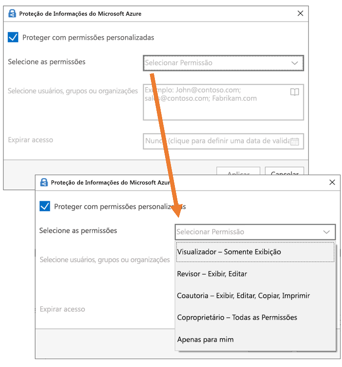

# Restringir o acesso ao conteúdo usando rótulos de confidencialidade para aplicar criptografia

>*[Diretrizes de licenciamento do Microsoft 365 para segurança e conformidade](/office365/servicedescriptions/microsoft-365-service-descriptions/microsoft-365-tenantlevel-services-licensing-guidance/microsoft-365-security-compliance-licensing-guidance).*

Quando você cria um rótulo de confidencialidade, pode restringir o acesso ao conteúdo ao qual o rótulo será aplicado. Por exemplo, com as configurações de criptografia para um rótulo de confidencialidade, você pode proteger conteúdos de modo que:

- Somente os usuários em sua organização possam abrir um documento ou um email confidenciais.
- Somente os usuários do departamento de marketing possam editar e imprimir o documento ou email de comunicado de promoção, enquanto todos os outros usuários em sua organização possam apenas lê-lo.
- Os usuários não podem encaminhar um email ou copiar informações destas fontes que contêm notícias sobre uma reorganização interna.
- A lista de preços atual que enviada a parceiros de negócios não pode ser aberta após uma data especificada.

Quando um documento ou email é criptografado, o acesso ao conteúdo é restrito, para que ele:

- Pode ser descriptografado apenas por usuários autorizados pelas configurações de criptografia do rótulo.
- Permanece criptografado independentemente de onde esteja, dentro ou fora da sua organização, mesmo se o arquivo for renomeado.
- É criptografado tanto em repouso (por exemplo, em uma conta do OneDrive) quanto em trânsito (por exemplo, emails sendo enviados pela Internet).

Por fim, como administrador, quando você configura um rótulo de confidencialidade para aplicar criptografia, há duas opções a escolher:

- **Atribuir permissões agora**, para que assim você possa determinar exatamente quais usuários podem obter quais permissões de conteúdo com esse rótulo.
- **Permitir que os usuários atribuam permissões** quando aplicam o rótulo ao conteúdo. Dessa forma, você pode conceder a pessoas em sua organização uma certa flexibilidade que elas possam precisar para colaborar e realizar o trabalho.

As configurações de criptografia estão disponíveis quando você [cria um rótulo de confidencialidade](create-sensitivity-labels.md) no Centro de conformidade do Microsoft 365. Você também pode usar o portal mais antigo, o Centro de Segurança e Conformidade.

## Entenda como funciona a criptografia

A criptografia usa o serviço Azure Rights Management (Azure RMS) da Proteção de Informações do Azure. Esta solução de proteção usa política de criptografia, identidade e autorização. Para saber mais, confira [O que é o Azure Rights Management?](/azure/information-protection/what-is-azure-rms) na documentação da Proteção de Informações do Azure. 

Quando você usa essa solução de criptografia, o **recurso de superusuário** garante que as pessoas e os serviços autorizados possam sempre ler e inspecionar os dados criptografados para a sua organização. Se necessário, a criptografia poderá ser removida ou alterada. Para saber mais, confira [Configurar os superusuários para a Proteção de Informações do Azure, serviços de descoberta ou recuperação de dados](/azure/information-protection/configure-super-users).

## Como configurar um rótulo para criptografia

1. Siga as instruções gerais para [criar ou editar um rótulo de confidencialidade](create-sensitivity-labels.md#create-and-configure-sensitivity-labels) e certifique-se de que **Arquivos e emails** esteja selecionado para o escopo do rótulo: 
    
    

2. Em seguida, na página **Escolher configurações de proteção para arquivos e emails**, certifique-se de selecionar **Criptografar arquivos e emails**
    
    

4.  Na página **Criptografia** do assistente, selecione uma das seguintes opções:
    
    - **Remova a criptografia se o arquivo estiver criptografado**: esta opção é compatível apenas com o cliente de rotulagem unificada da Proteção de Informações do Microsoft Azure. Quando você seleciona esta opção e usa rotulagem embutida, a etiqueta pode não ser exibida em aplicativos ou exibida e não fazer nenhuma alteração de criptografia.
        
        Para obter mais informações sobre este cenário, confira a seção [O que acontece com a criptografia existente quando um rótulo é aplicado](#what-happens-to-existing-encryption-when-a-labels-applied). É importante entender que essa configuração pode resultar em um rótulo de confidencialidade que os usuários podem não ser capazes de aplicar quando não têm permissões suficientes.
    
    - **Definir configurações de criptografia**: Ativa a criptografia e torna as configurações de criptografia visíveis:
        
        
        
        As instruções para essas configurações estão na seção [Definir configurações de criptografia a seguir](#configure-encryption-settings).

### O que acontece com a criptografia existente quando um rótulo é aplicado

Se um rótulo de confidencialidade for aplicado ao conteúdo não criptografado, o resultado das opções de criptografia que você poderá selecionar será autoexplicativo. Por exemplo, se você não selecionou **Criptografar arquivos e emails**, o conteúdo permanecerá descriptografado.

No entanto, conteúdo pode já estar criptografado. Por exemplo, outro usuário pode ter aplicado:

- Suas próprias permissões, que incluem permissões definidas pelo usuário quando solicitadas por um rótulo, permissões personalizadas pelo cliente da Proteção de Informações do Azure e a proteção de documento de **Acesso Restrito** de dentro de um aplicativo do Office.
- Um modelo de proteção do Azure Rights Management que criptografa o conteúdo de maneira independente de um rótulo. Esta categoria inclui regras de fluxo de email que aplicam criptografia usando a proteção de direitos.
- Um rótulo que aplica criptografia com permissões atribuídas pelo administrador.

A tabela a seguir identifica o que acontece com uma criptografia existente quando um rótulo de confidencialidade é aplicado ao conteúdo:

| | Criptografia: não selecionada | Criptografia: Configurada | Criptografia: remover \* |
|:-----|:-----|:-----|:-----|
|**Permissões especificadas por um usuário**|A criptografia original é preservada|A criptografia de novo rótulo é aplicada|A criptografia original é removida|
|**Modelo de proteção**|A criptografia original é preservada|A criptografia de novo rótulo é aplicada|A criptografia original é removida|
|**Rótulo com permissões definidas por administrador**|A criptografia original é removida|A criptografia de novo rótulo é aplicada|A criptografia original é removida|

**Rodapé:**

\* Suportado apenas pelo cliente de rotulagem unificada da Proteção de Informações do Azure

Nos casos em que a nova criptografia de rótulo é aplicada ou a criptografia original é removida, isso acontece apenas se o usuário que aplica o rótulo tiver um direito de uso ou função que ofereça suporte a esta ação:

- O [direito de uso](/azure/information-protection/configure-usage-rights#usage-rights-and-descriptions) Exportar ou Controle Total.
- A função do [emissor de Gerenciamento de Direitos ou do proprietário de Gerenciamento de Direitos](/azure/information-protection/configure-usage-rights#rights-management-issuer-and-rights-management-owner) ou [superusuário](/azure/information-protection/configure-super-users).

Se o usuário não tiver uma destes direitos ou funções, não será possível aplicar o rótulo, e a criptografia original é preservada. O usuário verá a seguinte mensagem: **Você não tem permissão para fazer essa alteração no rótulo de confidencialidade. Entre em contato com o proprietário do conteúdo.**

Por exemplo, a pessoa que aplica o Não Encaminhar a uma mensagem de email pode rotular novamente a sequência para substituir a criptografia ou removê-la, pois ela é a proprietária do Gerenciamento de Direitos do email. No entanto, com exceção dos superusuários, os destinatários desse email não podem rotulá-lo novamente, pois não têm os direitos de uso necessários.

#### Anexos de email para mensagens de email criptografadas

Quando uma mensagem de email é criptografada por qualquer método, todos os documentos do Office não criptografados que são anexados ao email herdam automaticamente as mesmas configurações de criptografia.

Os documentos que já estão criptografados e depois são adicionados como anexos sempre preservam a criptografia original.

## Definir configurações da criptografia

Ao selecionar **Definir configurações de criptografia** na página **Criptografia** do assistente para criar ou editar um rótulo de confidencialidade, escolha uma das seguintes opções:

- **Atribuir permissões agora**, para assim determinar exatamente quais usuários podem obter quais permissões do conteúdo com o rótulo aplicado. Para mais informações, consulte a próxima seção[Atribuir permissões agora](#assign-permissions-now).
- **Permitir que os usuários atribuam permissões** quando aplicam o rótulo ao conteúdo. Com essa opção, você pode conceder uma certa flexibilidade a pessoas em sua organização para que possam colaborar e realizar o trabalho. Para mais informações, confira a seção nessa página [ Permitir que usuários atribuam permissões](#let-users-assign-permissions).

Por exemplo, se você tiver um rótulo de confidencialidade denominado **Altamente Confidencial** que será aplicado ao seu conteúdo mais confidencial, talvez você queira decidir agora quem obtém qual tipo de permissão para esse conteúdo.

Como alternativa, se você tiver um rótulo de confidencialidade denominado **Contratos de Negócios**, e o fluxo de trabalho da sua organização exigir que as pessoas colaborem nesse conteúdo com outras pessoas de forma ad hoc, talvez você queira permitir que seus os usuários decidam quem receberá permissões quando atribui o rótulo. Essa flexibilidade auxilia não só a produtividade dos usuários como também reduz as solicitações dos seus administradores de atualizar ou criar novos rótulos de sensibilidade para cenários específicos.

Optar por atribuir permissões agora ou permitir que os usuários atribuam permissões:

## Atribuir permissões agora

Use as opções abaixo para controlar quem pode acessar os emails ou documentos aos quais aquele rótulo foi aplicado. Você pode:

- **Permitir que o acesso ao conteúdo rotulado expire** em uma data específica ou depois de um número específico de dias após o rótulo ser aplicado. Após este período, os usuários não poderão abrir o item rotulado. Se você especificar uma data, isso será válido a partir da meia-noite da data em questão no seu fuso horário atual. (Observe que alguns clientes de email talvez não apliquem a expiração e mostrem emails após a data de validade devido aos seus mecanismos de armazenamento em cache.)

- **Permitir o acesso offline** nunca, sempre ou por um número específico de dias após o rótulo ser aplicado. Se você restringir o acesso offline para nunca ou por um número de dias, quando este limite for atingido, os usuários precisarão ser autenticados novamente e seu acesso será registrado. Para saber mais, confira a próxima seção na licença de uso de Gerenciamento de Direitos.

Configurações de controle de acesso para conteúdo criptografado:

### Licença de uso de Gerenciamento de Direitos para acesso offline

Quando um usuário abre um documento ou e-mail que foi protegido por criptografia do serviço Azure Rights Management, uma licença de uso do Azure Rights Management para esse conteúdo é concedida ao usuário. Esta licença de uso é um certificado que contém os direitos de uso do usuário para o documento ou e-mail, e a chave de criptografia que foi utilizada para criptografar o conteúdo. A licença de uso também conterá uma data de expiração se esta tiver sido definida, e por quanto tempo a licença de uso é válida.

Se nenhuma data de vencimento tiver sido definida, o período de validade da licença de uso padrão para um locatário é de 30 dias. Pela duração da licença de uso, o usuário não precisa ser autenticado ou autorizado novamente para o conteúdo. Esse processo permite que o usuário continue a abrir o documento ou email protegido sem uma conexão de Internet. Quando expirar o período de validade da licença de uso, na próxima vez em que o usuário acessar o documento ou email protegido, ele precisará ser autenticado e autorizado novamente.

Além da reautenticação, são reavaliadas as configurações de criptografia e a filiação a grupos de usuários. Isso significa que os usuários podem experimentar diferentes resultados de acesso para o mesmo documento ou e-mail se houver mudanças nas configurações de criptografia ou filiação em grupo desde a última vez que acessaram o conteúdo.

Para saber como alterar a configuração padrão de 30 dias, confira [Licença de uso de Gerenciamento de Direitos](/azure/information-protection/configure-usage-rights#rights-management-use-license)..

### Atribuir permissões a usuários ou grupos específicos

Você pode conceder permissões a pessoas específicas para que somente elas possam interagir com o conteúdo rotulado:

1. Primeiro, adicione usuários ou grupos que receberão permissões para o conteúdo rotulado.

2. Em seguida, escolha quais permissões os usuários devem ter para o conteúdo rotulado.

Atribuindo permissões:

#### Adicionar usuários ou grupos

Quando você atribui permissões, pode escolher:

- Todos em sua organização (todos os membros locatários). Esta configuração exclui contas de convidados.

- Todos os usuários autenticados. Verifique se você entendeu os [requisitos e limitações](#requirements-and-limitations-for-add-any-authenticated-users) dessa configurações antes de selecioná-la.

- Qualquer usuário específico ou grupo de segurança habilitado para e-mail, grupo de distribuição ou grupo do Microsoft 365 ([anteriormente grupo do Office 365](https://techcommunity.microsoft.com/t5/microsoft-365-blog/office-365-groups-will-become-microsoft-365-groups/ba-p/1303601)) no Azure AD. O grupo do Microsoft 365 pode ter uma [associação estática ou dinâmica](/azure/active-directory/users-groups-roles/groups-create-rule). Observe que você não pode usar um [grupo de distribuição dinâmico do Exchange](/Exchange/recipients/dynamic-distribution-groups/dynamic-distribution-groups) porque esse tipo de grupo não está sincronizado com o Microsoft Azure Active Directory e não pode usar um grupo de segurança que não esteja habilitado para email.

- Qualquer endereço de email ou domínio. Use esta opção para especificar todos os usuários em outra organização que usa o Azure AD, inserindo qualquer nome de domínio dessa organização. Você também pode usar essa opção para provedores sociais, inserindo o nome de domínio, como **gmail.com**, **hotmail.com** ou **outlook.com**.

    > [!NOTE]
    > Se você especificar um domínio de uma organização que usa o Azure AD, não será possível restringir o acesso a esse domínio específico. Em vez disso, todos os domínios verificados no Azure AD são incluídos automaticamente para o locatário que possui o nome de domínio especificado por você.

Quando você escolhe todos os usuários e grupos em sua organização ou procura o diretório, os usuários ou grupos devem ter um endereço de email.

Como prática recomendada, use grupos em vez de usuários. Essa estratégia mantém a configuração mais simples.

##### Requisitos e limitações para "Adicionar usuários autenticados".

Essa configuração não restringe as pessoas que podem acessar o conteúdo que o rótulo criptografa, ainda criptografando o conteúdo e fornecendo opções para restringir a maneira como o conteúdo pode ser usado (permissões) e acessado (expiração e acesso offline). No entanto, o aplicativo que está abrindo o conteúdo criptografado deve ser capaz de oferecer suporte à autenticação que está sendo usada. Por esse motivo, os provedores sociais federados, como o Google, e a autenticação de senha única funcionam apenas para email e somente quando você usa o Exchange Online. As contas da Microsoft podem ser usadas com aplicativos do Office 365 e com o [visualizador da Proteção de Informações do Azure](https://portal.azurerms.com/#/download).

> [!NOTE]
> Considere usar essa configuração com a [integração do SharePoint e do OneDrive com o Azure AD B2B](/sharepoint/sharepoint-azureb2b-integration-preview) quando os rótulos de confidencialidade estão [habilitados para arquivos do Office no SharePoint e OneDrive](sensitivity-labels-sharepoint-onedrive-files.md).

Alguns cenários típicos para qualquer configuração de usuários autenticados:

- Você não se importa em quem vê o conteúdo, mas deseja restringir a maneira como ele é usado. Por exemplo, você não deseja que o conteúdo seja editado, copiado ou impresso.
- Você não deseja restringir as pessoas que acessam o conteúdo, mas deseja pode confirmar quem o abre.
- Você possui um requisito de que o conteúdo deve ser criptografado em repouso e em trânsito, mas não requer controles de acesso.

#### Escolher permissões

Quando você escolhe quais permissões atribuir para os usuários ou grupos, você pode selecionar:

- Um [nível de permissões predefinidas](/azure/information-protection/configure-usage-rights#rights-included-in-permissions-levels) com um grupo predefinido de direitos, como co-autor ou revisor.
- Permissões personalizadas, em que você escolhe um ou mais direitos de uso.

Para obter mais informações sobre como selecionar as permissões apropriadas, confira [Descrições e os direitos de uso](/azure/information-protection/configure-usage-rights#usage-rights-and-descriptions).  

Observe que o mesmo rótulo pode atribuir permissões diferentes a usuários diferentes. Por exemplo, um rótulo único pode definir alguns usuários como Revisores e um usuário diferente como Co-Autor, como mostrado na captura de tela a seguir.

Para fazer isso, adicione usuários ou grupos, atribua-lhes permissões e salve essas configurações. Depois repita essas etapas, adicionando usuários e atribuindo-lhes permissões, salvando as configurações a cada vez. Você pode repetir essa configuração quantas vezes for necessário para definir permissões diferentes para usuários diferentes.

#### O emissor do Gerenciamento de Direitos (usuário que aplica o rótulo de confidencialidade) sempre tem o Controle Total

A criptografia para um rótulo de sensibilidade utiliza o serviço de Microsoft Azure AD Rights Management da Proteção de Informações do Microsoft Azure. Quando um usuário aplica uma etiqueta de sensibilidade para proteger um documento ou e-mail utilizando a criptografia, esse usuário se torna o emissor do Gerenciamento de Direitos para esse conteúdo.

O emissor do Gerenciamento de Direitos sempre recebe as permissões de Controle Total para o documento ou email, e também:

- Se as configurações de criptografia incluem uma data de vencimento, o emissor do Gerenciamento de Direitos ainda pode abrir e editar o documento ou email após essa data.
- O emissor do Gerenciamento de Direitos sempre pode acessar o documento ou email offline.
- O emissor do Gerenciamento de Direitos ainda consegue abrir um documento após sua revogação.

Para saber mais, confira [Emissor do Gerenciamento de Direitos e Proprietário do Gerenciamento de Direitos](/azure/information-protection/configure-usage-rights#rights-management-issuer-and-rights-management-owner).

### Criptografia de Chave Dupla

> [!NOTE]
> No momento, esse recurso tem suporte apenas pelo cliente de rotulagem unificada da Proteção de Informações do Azure.

Selecione essa opção apenas depois de ter configurado o serviço de Criptografia de chave dupla, sendo que você precisará usar essa criptografia de chave dupla nos arquivos que terão esse rótulo aplicado.

Para obter mais informações, pré-requisitos e instruções de configuração, confira [(DKE) Criptografia de Chave Dupla](double-key-encryption.md)

## Permitir que usuários atribuam permissões

> [!IMPORTANT]
> Nem todos os clientes de etiquetagem suportam todas as opções que permitem aos usuários atribuir suas próprias permissões. Use esta seção para saber mais.

Você pode usar as seguintes opções para permitir que os usuários atribuam permissões quando aplicam manualmente um rótulo de sensibilidade ao conteúdo:

- No Outlook, o usuário pode selecionar restrições equivalentes à opção [Não Encaminhar](/azure/information-protection/configure-usage-rights#do-not-forward-option-for-emails) ou [Criptografar Somente](/azure/information-protection/configure-usage-rights#encrypt-only-option-for-emails) para os destinatários escolhidos.
    
    A opção Não Encaminhar é compatível com todos os clientes de email que têm suporte para os rótulos de confidencialidade. No entanto, a aplicação da opção **Criptografar Somente** com um rótulo de confidencialidade é um lançamento recente que tem suporte apenas por rotulagem integrada, e não pelo cliente de rotulagem unificada da Proteção de Informações do Azure. O rotulo não ficará visível para os clientes de email que não têm suporte para esse recurso.
    
    Para verificar as versões mínimas dos aplicativos Outlook que usam etiquetagem integrada para suportar a aplicação da opção Encrypt-Only com uma etiqueta de sensibilidade, use a [tabela de capacidades para Outlook](sensitivity-labels-office-apps.md#sensitivity-label-capabilities-in-outlook) e a linha **Permitir que usuários atribuam permissões: - Encrypt-Only**.

- No Word, no PowerPoint e no Excel, um usuário deve selecionar suas próprias permissões para usuários, grupos ou organizações específicos.

    Esta opção dá suporte ao cliente de rotulagem unificada da Proteção de Informações do Azure e a alguns aplicativos que usam a rotulagem integrada. Para os aplicativos que não dão suporte a esse recurso, ou a rotulagem não ficará visível para os usuários, ou ela ficará visível para consistência, mas não poderá ser aplicada com uma mensagem de explicação aos usuários.
    
    Para verificar quais aplicativos que usam a rotulagem integrada têm suporte para essa opção, use a [tabela de recursos para o Word, o Excel e o PowerPoint](sensitivity-labels-office-apps.md#sensitivity-label-capabilities-in-word-excel-and-powerpoint) e a linha **Permitir que usuários atribuam permissões: – Solicitar aos usuários**.

Quando houver suporte para as opções, use a tabela a seguir para identificar quais usuários verão o rótulo de confidencialidade:

|Configuração |Rótulo visível no Outlook|Rótulo visível no Word, Excel, PowerPoint|
|:-----|:-----|:-----|:-----|
|**No Outlook, impor restrições com a opção de Não Encaminhar ou a de Criptografar Somente**|Sim |Não |
|**Solicite que os usuário especifiquem permissões no Word, no PowerPoint e no Excel**|Não |Sim|

Quando ambas as configurações são selecionadas, o rótulo fica visível no Outlook, no Word, no Excel e no PowerPoint.

Um rótulo de confidencialidade que permite aos usuários atribuir permissões deve ser aplicado manualmente ao conteúdo pelos usuários; não pode ser aplicado automaticamente ou usado como um rótulo recomendado.

Configurar as permissões atribuídas ao usuários:

### Restrições do Outlook

No Outlook, quando um usuário aplica um rótulo de confidencialidade que permite atribuir permissões a uma mensagem, você pode escolher a opção de **Não Encaminhar** ou a de **Criptografar Somente**. O usuário verá o nome e a descrição do rótulo na parte superior da mensagem, o que indica que o conteúdo é protegido. Diferentemente do Word, do PowerPoint e do Excel (confira a [ próxima seção](#word-powerpoint-and-excel-permissions)), os usuários não são solicitados a selecionar permissões específicas.

Quando uma dessas opções é aplicada a um email, o email é criptografado e os destinatários devem ser autenticados. Então, os destinatários têm automaticamente direitos de uso restritos:

- **Não Encaminhar**: os destinatários não podem encaminhar o email, imprimi-lo ou copiá-lo. Por exemplo, no cliente do Outlook, o botão Encaminhar não está disponível, as opções do menu Salvar Como e Imprimir não estão disponíveis, e você não pode adicionar ou alterar destinatários nas caixas Para, CC ou Cco.
    
    Para saber mais sobre como essa opção funciona, confira [opção Não Encaminhar para emails](/azure/information-protection/configure-usage-rights#do-not-forward-option-for-emails).

- **Criptografar Somente**: os destinatários têm todos os direitos de uso, exceto Salvar como, Exportar e Controle Total. Essa combinação de direitos de uso significa que os destinatários não têm restrições, exceto que não podem remover a proteção. Por exemplo, um destinatário pode copiar do email, imprimi-lo e encaminhá-lo.
    
    Para saber mais sobre como essa opção funciona, confira [opção Criptografar Somente para emails](/azure/information-protection/configure-usage-rights#encrypt-only-option-for-emails).

Os documentos do Office não criptografados anexados ao email herdam automaticamente as mesmas restrições. Para a opção Não Encaminhar, os direitos de uso aplicados a esses documentos são Editar Conteúdo, Editar; Salvar, Exibir, Abrir, Ler; e Permitir Macros. Se o usuário quiser direitos de uso diferentes para um anexo, ou se o anexo não for um documento do Office compatível com essa proteção herdada, o usuário precisará criptografar o arquivo antes de anexá-lo ao email.

### Permissões do Word, do PowerPoint e do Excel

No Word, no PowerPoint e no Excel, quando um usuário aplica um rótulo de confidencialidade que permite atribuir permissões a um documento, ele é solicitado a especificar a escolha de usuários e permissões quando a criptografia é aplicada.

Por exemplo, com o cliente de rotulagem unificada da Proteção de Informações do Azure, os usuários podem:

- Selecionar um nível de permissão, como o Visualizador (que atribui permissão Somente para Exibição) ou Coautor (que atribui permissões de Exibição, Edição, Cópia e Impressão).
- Selecione usuários, grupos ou organizações. Isso pode incluir pessoas tanto de dentro quanto de fora de sua organização.
- Defina uma data de vencimento, após a qual os usuários selecionados não poderão acessar o conteúdo. Para saber mais, confira a seção acima [Licença de uso do Gerenciamento de Direitos para acesso online](#rights-management-use-license-for-offline-access).

Para rotulagem interna, os usuários visualizam a mesma caixa de diálogo se selecionarem o seguinte:

- Windows: guia **Arquivo** > **Informações** > **Proteger Documento** > **Restringir Acesso** > **Acesso Restrito**

- MacOS: guia **Análise** > **Proteção** > **Permissões** > **Acesso Restrito**

## Exemplos de configurações para as configurações de criptografia

Para cada exemplo a seguir, faça a configuração na página **Criptografia** do assistente quando **Definir configurações de criptografia** estiver selecionado:

### Exemplo 1: Rótulo que aplica Não Encaminhar para enviar um email criptografado para uma conta do Gmail

Esse rótulo é exibido apenas no Outlook e no Outlook na Web, e você deve usar o Exchange Online. Instrua os usuários a selecionar esse rótulo quando precisarem enviar um email criptografado para pessoas que usam uma conta do Gmail (ou qualquer outra conta de email fora da sua organização).

Os usuários digitam o endereço de email do Gmail na caixa **Para**.  Em seguida, eles selecionam o rótulo e a opção Não Encaminhar é adicionada automaticamente ao email. O resultado é que os destinatários não podem encaminhar o email, imprimi-lo, copiá-lo ou salvá-lo fora da caixa de correio usando a opção **Salvar Como**.

1. Na página **Criptografia**: Para **Atribuir permissões agora ou permitir que os usuários decidam?** selecione **Permitir que os usuários atribuam permissões ao aplicar o rótulo**.

2. Marque a caixa de seleção: **No Outlook, impor restrições equivalentes à opção Não Encaminhar**.

3. Se selecionad0, desmarque a caixa de seleção: **No Word, PowerPoint e Excel, solicite aos usuários que especifiquem permissões**.

4. Selecione **Próximo** e conclua o assistente.

### Exemplo 2: Rótulo que restringe a permissão somente leitura para todos os usuários em outra organização

Esse rótulo é adequado para compartilhar documentos muito confidenciais como somente leitura e os documentos que sempre exigem uma conexão com a Internet para visualizá-los.

Esse rótulo não é adequado para emails.

1. Na página **Criptografia**: Para **Atribuir permissões agora ou permitir que os usuários decidam?** selecione **Atribuir permissões agora**.

2. Para **Permitir acesso offline**, selecione **Nunca**.

3. Selecione **Atribuir permissões**.

4. No painel **Atribuir permissões**, selecione **Adicionar esses endereços de email ou domínios específicos**.

5. Na caixa de texto, insira o nome de um domínio da outra organização, por exemplo, **fabrikam.com**. Em seguida, selecione **OK**.

6. Clique em **Selecionar permissões**.

7. No painel **Escolher permissões**, marque a caixa suspensa, selecione **Visualizador** e, em seguida, selecione **Salvar**.

8. De volta ao painel **Atribuir permissões**, selecione **Salvar**.

9. Na página **Criptografia**, selecione **Próximo** e conclua o assistente.

### Exemplo 3: Adicionar usuários externos a um rótulo existente que criptografa conteúdo

Os novos usuários que você adicionar poderão abrir documentos e emails que já foram protegidos com esse rótulo. As permissões que você concede a esses usuários podem ser diferentes das permissões que os usuários existentes possuem.

1. Na página **Criptografia**: Para **Atribuir permissões agora ou permitir que os usuários decidam?** verifique se a opção **Atribuir permissões agora** está selecionada.

2. Selecione **Atribuir permissões**.

3. No painel **Atribuir permissões**, selecione **Adicionar esses endereços de email ou domínios específicos**.

4. Na caixa de texto, insira o endereço de email do primeiro usuário (ou grupo) a ser adicionado e, em seguida, selecione **Adicionar**.

5. Clique em **Selecionar permissões**.

6. No painel **Escolher permissões**, selecione as permissões para esse usuário (ou grupo) e, em seguida, selecione **Salvar**.

7. Volte para o painel **Atribuir permissões**, repita as etapas de 3 a 6 para cada usuário (ou grupo) que você deseja adicionar a esse rótulo. Em seguida, clique em **Salvar**.

8. Na página **Criptografia**, selecione **Próximo** e conclua o assistente.

### Exemplo 4: Rótulo que criptografa o conteúdo, mas não restringe quem pode acessá-lo

Essa configuração tem a vantagem de que você não precisa especificar usuários, grupos ou domínios para criptografar um email ou documento. O conteúdo ainda será criptografado e você ainda poderá especificar os direitos de uso, uma data de vencimento e o acesso offline.

Use essa configuração somente quando não precisar restringir quem pode abrir o documento protegido ou o email. [Mais informações sobre essa configuração](#requirements-and-limitations-for-add-any-authenticated-users)

1. Na página **Criptografia**: Para **Atribuir permissões agora ou permitir que os usuários decidam?** verifique se a opção **Atribuir permissões agora** está selecionada.

2. Defina as configurações para **O acesso do usuário ao conteúdo expira** e **Permitir acesso offline**, conforme necessário.

3. Selecione **Atribuir permissões**.

4. No painel **Atribuir permissões**, selecione **Adicionar todos os usuários autenticados**.

    Para **Usuários e grupos**, você vê **Usuários autenticados** adicionado automaticamente. Você não pode alterar esse valor, só excluí-lo, o que cancela a seleção **Adicionar todos os usuários autenticados**.

5. Clique em **Selecionar permissões**.

6. No painel **Escolher permissões**, marque a caixa suspensa, selecione as permissões que você quer, e selecione **Salvar**.

7. De volta ao painel **Atribuir permissões**, selecione **Salvar**.

8. Na página **Criptografia**, selecione **Próximo** e conclua o assistente.

## Considerações para o conteúdo criptografado

Criptografar seus documentos e emails mais confidenciais ajuda a garantir que somente pessoas autorizadas possam acessar esses dados. No entanto, há algumas coisas a se considerar:

- Se sua organização ainda não [habilitou rótulos de confidencialidade para arquivos do Office no SharePoint e no OneDrive](sensitivity-labels-sharepoint-onedrive-files.md):

  - Pesquisa, Descoberta Eletrônica e Delve não funcionarão em arquivos criptografados.
  - Políticas de DEL funcionam com metadados dos arquivos criptografados (incluindo informações dos rótulos de retenção), mas não com o conteúdo desses arquivos (como números de cartão de crédito em arquivos).
  - Os usuários não podem abrir arquivos criptografados usando o Office na Web. Quando os rótulos de sensibilidade dos arquivos do Office no SharePoint e do OneDrive estiverem ativados, os usuários podem usar o Office na Web para abrir arquivos criptografados, com algumas [limitações](sensitivity-labels-sharepoint-onedrive-files.md#limitations) que incluem criptografia aplicada com uma chave local (conhecida como "mantenha sua própria chave" ou HYOK), [criptografia de chave dupla](#double-key-encryption), e criptografia aplicada independentemente de um rótulo de sensibilidade.

- Se você compartilhar documentos criptografados com pessoas de fora da organização, talvez seja necessário criar contas de convidado e modificar as políticas de Acesso Condicional. Para obter mais informações, confira [Compartilhar documentos criptografados com usuários externos](sensitivity-labels-office-apps.md#support-for-external-users-and-labeled-content).

- Para que vários usuários editem um arquivos criptografado ao mesmo tempo, todos devem estar usando o Office para a Web. Se esse não for o caso e o arquivo já estiver aberto:

  - Nos aplicativos do Office (Windows, Mac, Android e iOS), os usuários veem uma mensagem **Arquivo em Uso** com o nome da pessoa que conferiu o arquivo. Em seguida, eles poderão visualizar uma cópia somente leitura ou salvar e editar uma cópia do arquivo e receber notificações quando o arquivo estiver disponível.
  - No Office para a Web, os usuários veem uma mensagem de erro informando que eles não podem editar o documento com outras pessoas. Eles podem selecionar **Abrir no Modo de Exibição de Leitura**.

- A funcionalidade [Salvamento Automático](https://support.office.com/article/what-is-autosave-6d6bd723-ebfd-4e40-b5f6-ae6e8088f7a5) nos aplicativos do Office (Windows, Mac, Android e iOS) está desabilitada para arquivos criptografados. Os usuários visualizam uma mensagem informando que o arquivos tem permissões restritas que devem ser removidas antes de ativar o Salvamento Automático.

- Os arquivos criptografados podem demorar mais para abrir nos aplicativos do Office (Windows, Mac, Android e iOS).

- Se um rótulo que aplica criptografia for adicionado usando um aplicativo do Office quando o documento for [retirado no Microsoft Office SharePoint Online](https://support.microsoft.com/office/check-out-check-in-or-discard-changes-to-files-in-a-library-7e2c12a9-a874-4393-9511-1378a700f6de) e o usuário descartar o check-out, o documento permanecerá rotulado e criptografado.

- As seguintes ações para arquivos criptografados não são compatíveis com os aplicativos do Office (Windows, Mac, Android e iOS) e os usuários veem uma mensagem de erro informando que algo deu errado. Entretanto, a funcionalidade Microsoft Office SharePoint Online pode ser usada como uma alternativa:

  - Visualize, restaure e salve cópias de versões anteriores. Como alternativa, os usuários poderão realizar essas ações usando o Office na Web quando você [habilitar e configurar o controle de versão para uma lista ou biblioteca](https://support.office.com/article/enable-and-configure-versioning-for-a-list-or-library-1555d642-23ee-446a-990a-bcab618c7a37).
  - Alterar o nome ou local dos arquivos. Como alternativa, os usuários podem [renomear um arquivos, pasta ou link em uma biblioteca de documentos](https://support.microsoft.com/office/rename-a-file-folder-or-link-in-a-document-library-bc493c1a-921f-4bc1-a7f6-985ce11bb185) no SharePoint.

Para obter a melhor experiência de colaborações para arquivos criptografados por um rótulo de confidencialidade, recomendamos que você use os [rótulos de confidencialidade de arquivos do Office no SharePoint e no OneDrive](sensitivity-labels-sharepoint-onedrive-files.md) e no Office para a Web.

## Pré-requisitos importantes

Antes de usar a criptografia, talvez seja necessário realizar algumas tarefas de configurações.

- Ativar a proteção da Proteção de Informações do Azure
    
    Para que os rótulos de confidencialidade apliquem a criptografia, o serviço de proteção (Azure Rights Management) da Proteção de Informações do Aure devem ser ativado para seu locatário. Em locatários mais recentes, essa é a configuração padrão, mas talvez seja necessário ativar o serviço manualmente. Para saber mais, confira [Ativar o serviço de proteção da Proteção de Informações do Azure](/azure/information-protection/activate-service).

- Verificar os requisitos de rede
    
    Pode ser necessário fazer algumas alterações em seus dispositivos de rede, como firewalls. Para obter detalhes, confira [Firewalls e infraestrutura de rede](/azure/information-protection/requirements#firewalls-and-network-infrastructure) na documentação da Proteção de Informações do Azure.

- Configurar o Exchange para a Proteção de Informações do Azure
    
    O intercâmbio não precisa ser configurado para a Proteção de Informações Azure antes que os usuários possam aplicar etiquetas no Outlook para criptografar seus emails. Entretanto, até que o Exchange seja configurado para a Proteção de Informações do Microsoft Azure, você não terá a funcionalidade completa de usar a proteção Microsoft Azure AD Rights Management com Exchange.
    
    Por exemplo, os usuários não podem exibir emails criptografados em telefones celulares ou com o Outlook na Web, emails criptografados não podem ser indexados para pesquisa e você não pode configurar o DLP do Exchange Online para proteção do Gerenciamento de Direitos. 
    
    Para garantir que Exchange possa dar suporte a esses cenários adicionais, confira o seguinte:
    
    - Para o Exchange Online, confira as instruções de [Exchange Online: configuração do IRM](/azure/information-protection/configure-office365#exchangeonline-irm-configuration).
    - Para o Exchange local, é necessário implantar o [conector RMS e configurar seus servidores Exchange](/azure/information-protection/deploy-rms-connector). 

## Próximas etapas

Precisa compartilhar os seus documentos rotulados e criptografados com pessoas fora de sua organização?  Consulte [Compartilhamento de documentos criptografados com usuários externos](sensitivity-labels-office-apps.md#sharing-encrypted-documents-with-external-users).