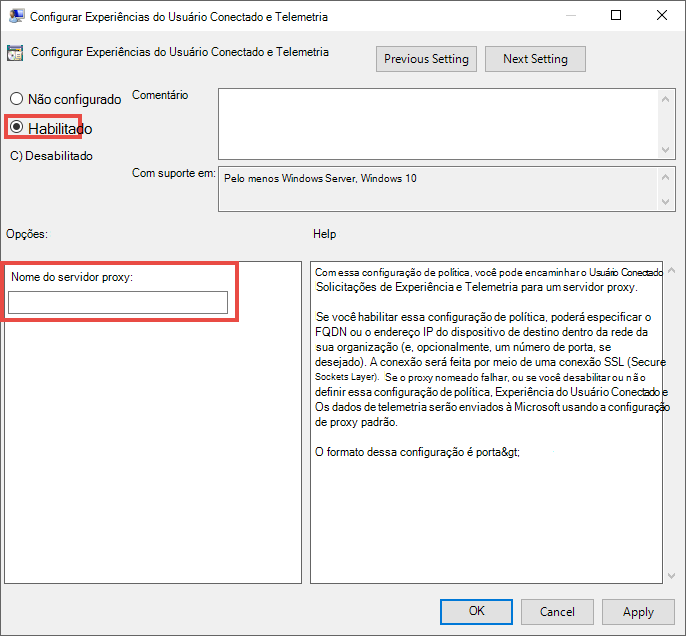

# Configurar as configurações de proxy e conexão com a Internet do dispositivo para ponto de extremidade DLPConfigure device proxy and internet connection settings for Endpoint DLP

O ponto de extremidade DLP da Microsoft usa o Microsoft Windows HTTP (WinHTTP) para relatar dados e se comunicar com o serviço em nuvem do ponto de extremidade da Microsoft.Microsoft Endpoint DLP uses Microsoft Windows HTTP (WinHTTP) to report data and communicate with the Microsoft endpoint cloud service. O ponto de extremidade DLP integrado é executado no contexto do sistema usando a conta LocalSystem.The embedded Endpoint DLP runs in system context using the LocalSystem account.

> [!TIP]
> Para organizações que usam proxies de envio como gateway para a Internet, você pode usar a proteção de rede para investigar por trás de um proxy.For organizations that use forward proxies as a gateway to the Internet, you can use network protection to investigate behind a proxy. Para saber mais, veja [Investigar eventos de conexão que ocorrem por meio de proxies de encaminhamento](/windows/security/threat-protection/microsoft-defender-atp/investigate-behind-proxy).For more information, see [Investigate connection events that occur behind forward proxies](/windows/security/threat-protection/microsoft-defender-atp/investigate-behind-proxy).

A definição da configuração do WinHTTP é independente das configurações de proxy de navegação da Internet do Windows (WinINet) e só pode descobrir um servidor proxy usando os seguintes métodos de descoberta automática:The WinHTTP configuration setting is independent of the Windows Internet (WinINet) Internet browsing proxy settings and can only discover a proxy server by using the following auto discovery methods:

- Proxy transparenteTransparent proxy
- Protocolo de Descoberta Automática de Proxy da Web (WPAD)Web Proxy Auto-discovery Protocol (WPAD)

> [!NOTE]
> Se estiver usando proxy transparente ou WPAD na topologia de rede, você não precisa de configurações especiais.If you’re using Transparent proxy or WPAD in your network topology, you don’t need special configuration settings. Para saber mais sobre o sobre o Defender para exclusões de URL do ponto de extremidade no proxy, veja [Habilitar acesso para URLs do serviço em nuvem do ponto de extremidade DLP no servidor proxy](#enable-access-to-endpoint-dlp-cloud-service-urls-in-the-proxy-server).For more information on Defender for Endpoint URL exclusions in the proxy, see [Enable access to Endpoint DLP cloud service URLs in the proxy server](#enable-access-to-endpoint-dlp-cloud-service-urls-in-the-proxy-server).

- Configuração manual de proxy estático:Manual static proxy configuration:
    - Configuração baseada no registroRegistry based configuration
    - WinHTTP configurado usando o comando netsh - Adequado apenas para desktops em uma topologia estável (por exemplo: um desktop em uma rede corporativa atrás do mesmo proxy)WinHTTP configured using netsh command – Suitable only for desktops in a stable topology (for example: a desktop in a corporate network behind the same proxy)

## Configure o servidor proxy manualmente usando um proxy estático baseado no registroConfigure the proxy server manually using a registry-based static proxy

Para dispositivos de ponto de extremidade sem permissão para se conectar à Internet, você precisa configurar um proxy estático baseado no registro.For endpoint devices that aren't permitted to connect to the Internet, you need to configure a registry-based static proxy. Você precisa configurar isso para permitir que apenas o ponto de extremidade DLP da Microsoft relate dados de diagnóstico e se comunique com o serviço em nuvem do ponto de extremidade da Microsoft.You need to configure this to allow only Microsoft Endpoint DLP to report diagnostic data and communicate with Microsoft endpoint cloud service.

O proxy estático é configurável por meio da Política de Grupo (GP).The static proxy is configurable through Group Policy (GP). A política do grupo pode ser encontrada em:The group policy can be found under:

1. Abra **Modelos Administrativos > Componentes do Windows > Coleta de Dados e Compilações de Visualização > Configurar o uso de proxy autenticado para a experiência do usuário conectado e serviço de telemetria**Open **Administrative Templates > Windows Components > Data Collection and Preview Builds > Configure Authenticated Proxy usage for the Connected User Experience and Telemetry Service**

2. Selecione para **Habilitado** e selecione **Desabilitar uso de proxy autenticado**:Set it to **Enabled** and select **Disable Authenticated Proxy usage**: 

 
3. Abra **Modelos Administrativos > Componentes do Windows > Coleta de Dados e Compilações de Visualização > Configurar experiências de usuário conectado e telemetria**:Open **Administrative Templates > Windows Components > Data Collection and Preview Builds > Configure connected user experiences and telemetry**:

 Configurar o proxyConfigure the proxy

A política define dois valores de registro `TelemetryProxyServer` como REG_SZ e `DisableEnterpriseAuthProxy` como REG_DWORD na chave de registro `HKLM\Software\Policies\Microsoft\Windows\DataCollection`.The policy sets two registry values `TelemetryProxyServer` as REG_SZ and `DisableEnterpriseAuthProxy` as REG_DWORD under the registry key `HKLM\Software\Policies\Microsoft\Windows\DataCollection`.

O valor de registro TelemetryProxyServer está neste formato \<server name or ip\>:\<port\>.The registry value TelemetryProxyServer is in this format \<server name or ip\>:\<port\>. Por exemplo: **10.0.0.6:8080**For example: **10.0.0.6:8080**

O valor de registro `DisableEnterpriseAuthProxy` deve ser definido como 1.The registry value `DisableEnterpriseAuthProxy` should be set to 1.

## Configure o servidor proxy manualmente usando o comando "netsh"Configure the proxy server manually using "netsh" command

Use netsh para configurar um proxy estático de todo o sistema.Use netsh to configure a system-wide static proxy.

> [!NOTE]
> Isso afetará todos os aplicativos, incluindo serviços do Windows que usam WinHTTP com proxy padrão.This will affect all applications including Windows services which use WinHTTP with default proxy. - Laptops que estão mudando de topologia (por exemplo: do escritório para casa) terão mau funcionamento com o netsh.- Laptops that are changing topology (for example: from office to home) will malfunction with netsh. Use a configuração de proxy estático com base no registro.Use the registry-based static proxy configuration.

1. Abra uma linha de comando com privilégios elevados:Open an elevated command-line:
    1. Vá para **Iniciar** e digite **cmd**Go to **Start** and type **cmd**
    1. Clique com o botão direito do mouse em **Prompt de Comando** e selecione **Executar como administrador**.Right-click **Command prompt** and select **Run as administrator**.
2.  Insira o seguinte comando e pressione **Enter**:Enter the following command and press **Enter**:

    `netsh winhttp set proxy <proxy>:<port>`

    Por exemplo: **netsh winhttp set proxy 10.0.0.6:8080**For example: **netsh winhttp set proxy 10.0.0.6:8080**

3. Para redefinir o proxy winhttp, insira o seguinte comando e pressione **Enter**:To reset the winhttp proxy, enter the following command and press **Enter**:

     `netsh winhttp reset proxy`

Para saber mais, veja [Sintaxe, Contextos e Formatação do Comando Netsh](/windows-server/networking/technologies/netsh/netsh-contexts).See [Netsh Command Syntax, Contexts, and Formatting](/windows-server/networking/technologies/netsh/netsh-contexts) to learn more.

## Habilitar acesso para URLs do serviço em nuvem do ponto de extremidade DLP no servidor proxyEnable access to Endpoint DLP cloud service URLs in the proxy server

Se um proxy ou firewall está bloqueando por padrão todo o tráfego e permitindo apenas a passagem de domínios específicos, adicione os domínios listados na planilha para download à lista de domínios permitidos.If a proxy or firewall is blocking all traffic by default and allowing only specific domains through, add the domains listed in the downloadable sheet to the allowed domains list.

Esta [planilha para download](https://github.com/MicrosoftDocs/windows-itpro-docs/raw/public/windows/security/threat-protection/microsoft-defender-atp/downloads/mdatp-urls.xlsx) lista os serviços e os seus URLs associados que a sua rede deve ser capaz de se conectar.This [downloadable spreadsheet](https://github.com/MicrosoftDocs/windows-itpro-docs/raw/public/windows/security/threat-protection/microsoft-defender-atp/downloads/mdatp-urls.xlsx) lists the services and their associated URLs that your network must be able to connect to. Você deve garantir que não hajam regras de firewall ou de filtragem de rede que neguem o acesso a esses URLs, ou pode ser necessário criar uma regra de permissão especificamente para eles.You should ensure that there are no firewall or network filtering rules that would deny access to these URLs, or you may need to create an allow rule specifically for them.

Se um proxy ou firewall tiver verificação HTTPS habilitada (inspeção SSL), exclua os domínios listados na tabela acima da verificação HTTPS.If a proxy or firewall has HTTPS scanning (SSL inspection) enabled, exclude the domains listed in the above table from HTTPS scanning.
Se um proxy ou firewall estiver bloqueando o tráfego anônimo, como o ponto de extremidade DLP está se conectando a partir do contexto do sistema, certifique-se de que o tráfego anônimo seja permitido nos URLs listados anteriormente.If a proxy or firewall is blocking anonymous traffic, as Endpoint DLP is connecting from system context, make sure anonymous traffic is permitted in the previously listed URLs.

## Verifique a conectividade do cliente com os URLs do serviço de nuvem da MicrosoftVerify client connectivity to Microsoft cloud service URLs

Verifique se a configuração do proxy foi concluída com êxito, se o WinHTTP pode descobrir e se comunicar por meio do servidor proxy em seu ambiente e se o servidor proxy permite o tráfego para os URLs do serviço Defender para Ponto de Extremidade.Verify the proxy configuration completed successfully, that WinHTTP can discover and communicate through the proxy server in your environment, and that the proxy server allows traffic to the Defender for Endpoint service URLs.

1. Baixe a [ferramenta MDATP Client Analyzer](https://aka.ms/mdatpanalyzer) para o PC onde o ponto de extremidade DLP está sendo executado.Download the [MDATP Client Analyzer tool](https://aka.ms/mdatpanalyzer) to the PC where Endpoint DLP is running on.
2. Extraia o conteúdo de MDATPClientAnalyzer.zip no dispositivo.Extract the contents of MDATPClientAnalyzer.zip on the device.
3. Abra uma linha de comando com privilégios elevados:Open an elevated command-line:
    1. Vá para **Iniciar** e digite **cmd**.Go to **Start** and type **cmd**.
    1. Clique com o botão direito do mouse em **Prompt de Comando** e selecione **Executar como administrador**.Right-click **Command prompt** and select **Run as administrator**.
4.  Insira o seguinte comando e pressione **Enter**:Enter the following command and press **Enter**:
    
`HardDrivePath\MDATPClientAnalyzer.cmd`

Substitua *HardDrivePath* pelo caminho para onde a ferramenta MDATPClientAnalyzer foi baixada, por exemploReplace *HardDrivePath* with the path where the MDATPClientAnalyzer tool was downloaded to, for example
    
**C:\Work\tools\MDATPClientAnalyzer\MDATPClientAnalyzer.cmd****C:\Work\tools\MDATPClientAnalyzer\MDATPClientAnalyzer.cmd**

5.  Extraia o **MDATPClientAnalyzerResult.zip** _ criado pela ferramenta na pasta usada no _HardDrivePath \*.Extract the **MDATPClientAnalyzerResult.zip** _ file created by tool in the folder used in the _HardDrivePath\*.

6.  Abra **MDATPClientAnalyzerResult.txt** e verifique se você executou as etapas de configuração do proxy para permitir a descoberta do servidor e o acesso às URLs de serviço.Open **MDATPClientAnalyzerResult.txt** and verify that you have performed the proxy configuration steps to enable server discovery and access to the service URLs.  A ferramenta verifica a conectividade dos URLs do serviço Defender para Ponto de Extremidade com os quais o Defender para ponto de extremidade do cliente está configurado para interagir.The tool checks the connectivity of Defender for Endpoint service URLs that Defender for Endpoint client is configured to interact with. Em seguida, ele imprime os resultados no arquivo **MDATPClientAnalyzerResult.txt** para cada URL que pode ser potencialmente usado para se comunicar com os serviços do Defender para Ponto de Extremidade.It then prints the results into the **MDATPClientAnalyzerResult.txt** file for each URL that can potentially be used to communicate with the Defender for Endpoint services. Por exemplo:For example:

    **Testing URL : https://xxx.microsoft.com/xxx   1 - Default proxy: Succeeded (200)   2 - Proxy auto discovery (WPAD): Succeeded (200)  3 - Proxy disabled: Succeeded (200)  4 - Named proxy: Doesn't exist  5 - Command line proxy: Doesn't exist****Testing URL : https://xxx.microsoft.com/xxx   1 - Default proxy: Succeeded (200)   2 - Proxy auto discovery (WPAD): Succeeded (200)  3 - Proxy disabled: Succeeded (200)  4 - Named proxy: Doesn't exist  5 - Command line proxy: Doesn't exist** 

Se pelo menos uma das opções de conectividade retornar um status (200), então o Defender para ponto de extremidade do cliente pode se comunicar corretamente com o URL testado usando este método de conectividade.If at least one of the connectivity options returns a (200) status, then the Defender for Endpoint client can communicate with the tested URL properly using this connectivity method. 

No entanto, se os resultados da verificação de conectividade indicarem uma falha, um erro HTTP será exibido (consulte Códigos de status HTTP).However, if the connectivity check results indicate a failure, an HTTP error is displayed (see HTTP Status Codes). Você pode então usar os URLs na tabela mostrada em[Habilitar acesso para URLs do serviço em nuvem do ponto de extremidade DLP no servidor proxy](#enable-access-to-endpoint-dlp-cloud-service-urls-in-the-proxy-server).You can then use the URLs in the table shown in [Enable access to Endpoint DLP cloud service URLs in the proxy server](#enable-access-to-endpoint-dlp-cloud-service-urls-in-the-proxy-server). Os URLs que você usará dependerão da região selecionada durante o procedimento de integração.The URLs you’ll use will depend on the region selected during the onboarding procedure.
[!NOTE] A ferramenta Connectivity Analyzer não é compatível com a regra ASR [Bloqueie as criações de processos originadas de comandos PSExec e WMI](/windows/security/threat-protection/windows-defender-exploit-guard/attack-surface-reduction#attack-surface-reduction-rules). The Connectivity Analyzer tool is not compatible with ASR rule [Block process creations originating from PSExec and WMI commands](/windows/security/threat-protection/windows-defender-exploit-guard/attack-surface-reduction#attack-surface-reduction-rules). Você precisará desativar temporariamente esta regra para executar a ferramenta de conectividade.You will need to temporarily disable this rule to run the connectivity tool.

[!NOTE] Quando o TelemetryProxyServer é definido, no Registro ou via Política de Grupo, o Defender para Ponto de Extremidade voltará a ser direto se não puder acessar o proxy definido.When the TelemetryProxyServer is set, in Registry or via Group Policy, Defender for Endpoint will fall back to direct if it can’t access the defined proxy.
Tópicos relacionados •   Dispositivos Windows 10 integrados •   Solucionar problemas de integração do  de extremidade DLP da MicrosoftRelated topics •   Onboard Windows 10 devices •   Troubleshoot Microsoft Endpoint DLP onboarding issues

## Confira tambémSee also

- [Saiba mais sobre a Prevenção contra perda de dados do ponto de extremidadeLearn about Endpoint data loss prevention ](endpoint-dlp-learn-about.md)
- [Usando a prevenção contra perda de dados do ponto de extremidadeUsing Endpoint data loss prevention ](endpoint-dlp-using.md)
- [Visão geral da prevenção contra perda de dadosOverview of data loss prevention](data-loss-prevention-policies.md)
- [Criar, testar e ajustar uma política DLPCreate, test, and tune a DLP policy](create-test-tune-dlp-policy.md)
- [Começar a usar o Explorador de atividadesGet started with Activity explorer](data-classification-activity-explorer.md)
- [Microsoft Defender para Ponto de ExtremidadeMicrosoft Defender for Endpoint](/windows/security/threat-protection/)
- [Ferramentas e métodos de integração para computadores Windows 10Onboarding tools and methods for Windows 10 machines](/windows/security/threat-protection/microsoft-defender-atp/configure-endpoints)
- [Assinatura do Microsoft 365Microsoft 365 subscription](https://www.microsoft.com/microsoft-365/compare-microsoft-365-enterprise-plans?rtc=1)
- [Dispositivos associados ao Microsoft Azure ADAzure AD joined devices](/azure/active-directory/devices/concept-azure-ad-join)
- [Baixar o novo Microsoft Edge baseado em ChromiumDownload the new Microsoft Edge based on Chromium](https://support.microsoft.com/help/4501095/download-the-new-microsoft-edge-based-on-chromium)