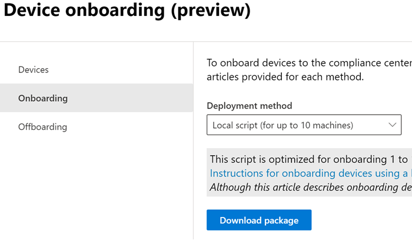
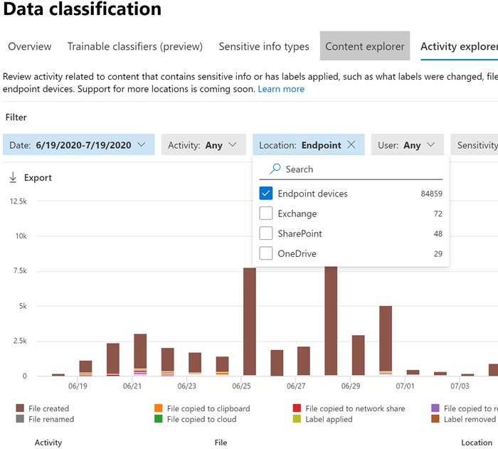

# Introdução à prevenção contra perda de dados do ponto de extremidade (visualização)Get started with Endpoint data loss prevention (preview)

A prevenção contra perda de dados de ponto de extremidade do Microsoft (Endpoint DLP) faz parte do pacote de recursos de prevenção contra perda de dados (DLP) da Microsoft 365, que você pode usar para descobrir e proteger itens confidenciais em todos os serviços do Microsoft 365.Microsoft Endpoint data loss prevention (Endpoint DLP) is part of the Microsoft 365 data loss prevention (DLP) suite of features you can use to discover and protect sensitive items across Microsoft 365 services. Para obter mais informações sobre todas as ofertas de DLP da Microsoft, confira [Visão geral de prevenção contra perda de dados](data-loss-prevention-policies.md).For more information about all of Microsoft’s DLP offerings, see [Overview of data loss prevention](data-loss-prevention-policies.md). Para saber mais sobre o Endpoint DLP, confira [Saber mais sobre a prevenção contra perda de dados do ponto de extremidade (visualização)](endpoint-dlp-learn-about.md)To learn more about Endpoint DLP, see [Learn about Endpoint data loss prevention (preview)](endpoint-dlp-learn-about.md)

O Microsoft Endpoint DLP permite monitorar dispositivos Windows 10 e detectar quando itens confidenciais são usados e compartilhados.Microsoft Endpoint DLP allows you to monitor Windows 10 devices and detect when sensitive items are used and shared. Isso dá a você a visibilidade e o controle necessários para garantir que eles sejam usados e protegidos corretamente, e para ajudar a evitar o comportamento arriscado que possa comprometer.This gives you the visibility and control you need to ensure that they are used and protected properly, and to help prevent risky behavior that might compromise them.

## Antes de começarBefore you begin

### Licenciamento SKU/assinaturasSKU/subscriptions licensing

Antes de começar a usar o Endpoint DLP, confirme seu [Assinatura do Microsoft 365](https://www.microsoft.com/microsoft-365/compare-microsoft-365-enterprise-plans?rtc=1) e os complementos.Before you get started with Endpoint DLP, you should confirm your [Microsoft 365 subscription](https://www.microsoft.com/microsoft-365/compare-microsoft-365-enterprise-plans?rtc=1) and any add-ons. Para acessar e usar a funcionalidade do Endpoint DLP, você deve ter uma dessas assinaturas ou complementos.To access and use Endpoint DLP functionality, you must have one of these subscriptions or add-ons.

- Microsoft 365 E5Microsoft 365 E5
- Microsoft 365 A5 (EDU)Microsoft 365 A5 (EDU)
- Conformidade do Microsoft 365 E5Microsoft 365 E5 compliance
- Conformidade do Microsoft 365 A5Microsoft 365 A5 compliance
- Governança e Proteção de Informações do Microsoft 365 E5Microsoft 365 E5 information protection and governance
- Governança e Proteção de Informações do Microsoft 365 A5Microsoft 365 A5 information protection and governance

### PermissõesPermissions

Para habilitar o gerenciamento de dispositivos, a conta que você usa deve ser um membro de qualquer uma das seguintes funções:To enable device management, the account you use must be a member of any one of these roles:

- Administrador globalGlobal admin
- Administrador de segurançaSecurity admin
- Administrador de conformidadeCompliance admin

Se você quiser usar uma conta personalizada para exibir as configurações de gerenciamento de dispositivo, deverá estar em uma das seguintes funções:If you want to use a custom account to view the device management settings, it must be in one of these roles:

- Administrador globalGlobal admin
- Administrador de conformidadeCompliance admin
- Administrador de dados de conformidadeCompliance data admin
- Leitor globalGlobal reader

Se você quiser usar uma conta personalizada para acessar a página de integração/remoção, deverá estar em uma das seguintes funções:If you want to use a custom account to access the onboarding/offboarding page, it must be in one of these roles:

- Administrador globalGlobal admin
- Administrador de conformidadeCompliance admin

Se você quiser usar uma conta personalizada para ativar/desativar o monitoramento de dispositivo, deverá estar em uma das seguintes funções:If you want to use a custom account to turn on/off device monitoring, it must be in one of these roles:

- Administrador globalGlobal admin
- Administrador de conformidadeCompliance admin

Os dados do Endpoint DLP podem ser exibidos no [Explorador de atividades](data-classification-activity-explorer.md).Data from Endpoint DLP can be viewed in [Activity explorer](data-classification-activity-explorer.md). Há quatro funções que concedem permissão para o explorador de atividades, a conta que você usa para acessar os dados deve ser um membro de qualquer uma delas.There are four roles that grant permission to activity explorer, the account you use for accessing the data must be a member of any one of them.

- Administrador globalGlobal admin
- Administrador de conformidadeCompliance admin
- Administrador de segurançaSecurity admin
- Administrador de dados de conformidadeCompliance data admin

### Preparar seus pontos de extremidadePrepare your endpoints

Certifique-se de que os dispositivos Windows 10 que você pretende implantar o Endpoint DLP atendam a esses requisitos.Make sure that the Windows 10 devices that you plan on deploying Endpoint DLP to meet these requirements.

1. Deve estar executando o Windows 10 x64 build 1809 ou superior.Must be running Windows 10 x64 build 1809 or later.

2. A Versão do Cliente Antimalware é 4.18.2009.7 ou mais recente.Antimalware Client Version is 4.18.2009.7 or newer. Verifique sua versão atual abrindo o aplicativo Segurança do Windows, selecione o ícone Configurações e, em seguida, selecione Sobre.Check your current version by opening Windows Security app, select the Settings icon, and then select About. O número da versão está listado na Versão do Cliente Antimalware.The version number is listed under Antimalware Client Version. Atualize para a Versão do Cliente Antimalware instalando o Windows Update KB4052623.Update to the latest Antimalware Client Version by installing Windows Update KB4052623. Observação: Nenhum dos componentes de Segurança do Windows precisa estar ativo, você pode executar o Ponto de Extremidade DLP independentemente do status de Segurança do Windows.Note: None of Windows Security components need to be active, you can run Endpoint DLP independent of Windows Security status.

3. As seguintes atualizações do Windows foram instaladas.The following Windows Updates are installed. Observação: Essas atualizações não são um pré-requisito para integrar um dispositivo a Ponto de extremidade DLP, mas contêm correções para problemas importantes, portanto, devem ser instaladas antes de usar o produto.Note: These updates are not a pre-requisite to onboard a device to Endpoint DLP, but contain fixes for important issues thus must be installed before using the product.

    - Para Windows 10 1809 - KB4559003, KB4577069, KB4580390For Windows 10 1809 - KB4559003, KB4577069, KB4580390
    - Para Windows 10 1903 ou 1909 - KB4559004, KB4577062, KB4580386For Windows 10 1903 or 1909 - KB4559004, KB4577062, KB4580386
    - Para Windows 10 2004 - KB4568831, KB4577063For Windows 10 2004 - KB4568831, KB4577063
    - Para dispositivos que executam o Office 2016 (e nenhuma outra versão do Office) - KB4577063For devices running Office 2016 (and not any other Office version) - KB4577063 

4. Todos os dispositivos devem ser associados ao [Azure Active Directory (Microsoft Azure AD)](https://docs.microsoft.com/azure/active-directory/devices/concept-azure-ad-join) ou ingressado no Azure AD Híbrido.All devices must be [Azure Active Directory (Azure AD) joined](https://docs.microsoft.com/azure/active-directory/devices/concept-azure-ad-join), or Hybrid Azure AD joined.

5. Instalar o navegador Microsoft Chromium Edge no dispositivo do ponto de extremidade para impor ações de política para a atividade carregar na nuvem.Install Microsoft Chromium Edge browser on the endpoint device to enforce policy actions for the upload to cloud activity. Confira, [Baixar o novo Microsoft Edge baseado em Chromium](https://support.microsoft.com/help/4501095/download-the-new-microsoft-edge-based-on-chromium).See, [Download the new Microsoft Edge based on Chromium](https://support.microsoft.com/help/4501095/download-the-new-microsoft-edge-based-on-chromium).

## Dispositivos de integração no gerenciamento de dispositivosOnboarding devices into device management

Você deve habilitar o monitoramento de dispositivos e encaminhar os pontos de extremidade antes de poder monitorar e proteger itens confidenciais em um dispositivo.You must enable device monitoring and onboard your endpoints before you can monitor and protect sensitive items on a device. Estas ações estão concluídas no portal de conformidade do Microsoft 365.Both of these actions are done in the Microsoft 365 Compliance portal.

Se você quiser que os dispositivos integrados ainda não estejam integrados, baixe o script apropriado e distribua-o a esses dispositivos.When you want to onboard devices that haven't been onboarded yet, you'll download the appropriate script and deploy it to those devices. Siga o [Procedimento de integração de dispositivos](endpoint-dlp-getting-started.md#onboarding-devices).Follow the [Onboarding devices procedure](endpoint-dlp-getting-started.md#onboarding-devices).

Se você já tiver dispositivos integrados na [Microsoft Defender para Ponto de Extremidade](https://docs.microsoft.com/windows/security/threat-protection/), eles já serão exibidos na lista dispositivos gerenciados.If you already have devices onboarded into [Microsoft Defender for Endpoint](https://docs.microsoft.com/windows/security/threat-protection/), they will already appear in the managed devices list. Siga [Com dispositivos integrados no procedimento Microsoft Defender para Ponto de Extremidade](endpoint-dlp-getting-started.md#with-devices-onboarded-into-microsoft-defender-for- endpoint).Follow the [With devices onboarded into Microsoft Defender for Endpoint procedure](endpoint-dlp-getting-started.md#with-devices-onboarded-into-microsoft-defender-for- endpoint).

### Dispositivos de integraçãoOnboarding devices

Neste cenário de implantação, você integrará dispositivos que ainda não foram integrados e você só deseja monitorar e proteger itens confidenciais contra compartilhamento não intencional em dispositivos Windows 10.In this deployment scenario, you'll onboard devices that have not been onboarded yet, and you just want to monitor and protect sensitive items from unintentional sharing on Windows 10 devices.

1. Abra o [Centro de conformidade do Microsoft](https://compliance.microsoft.com).Open the [Microsoft compliance center](https://compliance.microsoft.com).

2. Abra a página de configurações do Centro de conformidade e escolha **Integrar dispositivos**.Open the Compliance Center settings page and choose **Onboard devices**. 

   > [!div class="mx-imgBorder"]
   > 

   > [!NOTE]
   > Enquanto a integração de dispositivos geralmente leva cerca de 60 segundos para que seja habilitada, aguarde até 30 minutos antes de se envolver com o suporte da Microsoft.While it usually takes about 60 seconds for device onboarding to be enabled, please allow up to 30 minutes before engaging with Microsoft support.

3. Escolha **Gerenciamento de dispositivos** para abrir a lista **Dispositivos**.Choose **Device management** to open the **Devices** list. A lista estará vazia até você integrar os dispositivos.The list will be empty until you onboard devices.

4. Escolha **Integração** para iniciar o processo de integração.Choose **Onboarding** to begin the onboarding process.

5. Escolha a maneira como deseja implantar para esses dispositivos adicionais a partir da lista de **Método de implantação** e **Baixe o pacote**.Choose the way you want to deploy to these additional devices from the **Deployment method** list and then **download package**.

   > [!div class="mx-imgBorder"]
   > 
   
6. Siga os procedimentos apropriados em [Ferramentas e métodos de integração dos computadores do Windows 10](https://docs.microsoft.com/windows/security/threat-protection/microsoft-defender-atp/configure-endpoints).Follow the appropriate procedures in [Onboarding tools and methods for Windows 10 machines](https://docs.microsoft.com/windows/security/threat-protection/microsoft-defender-atp/configure-endpoints). Esse link levará você a uma página inicial onde você pode acessar os procedimentos do Microsoft Defender para Ponto de Extremidade que correspondem ao pacote de implantação selecionado na etapa 5:This link take you to a landing page where you can access Microsoft Defender for Endpoint procedures that match the deployment package you selected in step 5:

    - Integrar computadores com Windows 10 usando uma política de grupoOnboard Windows 10 machines using Group Policy
    - Integrar computadores com Windows usando o Microsoft Endpoint Configuration ManagerOnboard Windows machines using Microsoft Endpoint Configuration Manager
    - Integrar computadores com Windows 10 usando ferramentas de gerenciamento de dispositivo móvelOnboard Windows 10 machines using Mobile Device Management tools
    - Integrar computadores com Windows 10 usando um script localOnboard Windows 10 machines using a local script
    - Integrar computadores não persistentes da VDI (infraestrutura de desktop virtual).Onboard non-persistent virtual desktop infrastructure (VDI) machines.

Uma vez que o ponto de extremidade está integrado, ele deve estar visível na lista dispositivos e começar a relatar logs de atividades de auditoria para o Explorador de atividades.Once done and endpoint is onboarded, it should be visible in the devices list and also start reporting audit activity logs to Activity explorer.

> [!NOTE]
> Esta experiência está na imposição da licença.This experience is under license enforcement. Sem a licença necessária, os dados não estarão visíveis nem acessíveis.Without the required license, data will not be visible or accessible.

### Com dispositivos integrados no Microsoft Defender para Ponto de Extremidade.With devices onboarded into Microsoft Defender for Endpoint

Neste cenário, o Microsoft Defender para Ponto de Extremidade já está implantado e há relatórios de pontos de extremidade.In this scenario, Microsoft Defender for Endpoint is already deployed and there are endpoints reporting in. Todos esses pontos de extremidade serão exibidos na lista dispositivos gerenciados.All these endpoints will appear in the managed devices list. Você pode continuar a integrar novos dispositivos no ponto de extremidade DLP para expandir a cobertura usando o[Procedimento de integração de dispositivos](endpoint-dlp-getting-started.md#onboarding-devices).You can continue to onboard new devices into Endpoint DLP to expand coverage by using the [Onboarding devices procedure](endpoint-dlp-getting-started.md#onboarding-devices).

1. Abra o [Centro de conformidade do Microsoft](https://compliance.microsoft.com).Open the [Microsoft compliance center](https://compliance.microsoft.com).

2. Abra a página de configurações do Centro de conformidade e escolha **Habilitar o monitoramento de dispositivos**.Open the Compliance Center settings page and choose **Enable device monitoring**.

3. Escolha **Gerenciamento de dispositivos** para abrir a lista **Dispositivos**.Choose **Device management** to open the **Devices** list. Você deverá ver a lista de dispositivos que já estão relatando para o Microsoft Defender para Ponto de Extremidade.You should see the list of devices that are already reporting in to Microsoft Defender for Endpoint.

   > [!div class="mx-imgBorder"]
   > 
   
4. Escolha **Integração** , caso precise integrar dispositivos adicionais.Choose **Onboarding** if you need to onboard additional devices.

5. Escolha a maneira como deseja implantar para esses dispositivos adicionais a partir da lista de **Método de implantação** e **Baixe o pacote**.Choose the way you want to deploy to these additional devices from the **Deployment method** list and then **Download package**.

6. Siga os procedimentos apropriados em [Ferramentas e métodos de integração dos computadores do Windows 10](https://docs.microsoft.com/windows/security/threat-protection/microsoft-defender-atp/configure-endpoints).Follow the appropriate procedures in [Onboarding tools and methods for Windows 10 machines](https://docs.microsoft.com/windows/security/threat-protection/microsoft-defender-atp/configure-endpoints). Esse link levará você a uma página inicial onde você pode acessar os procedimentos do Microsoft Defender para Ponto de Extremidade que correspondem ao pacote de implantação selecionado na etapa 5:This link take you to a landing page where you can access Microsoft Defender for Endpoint procedures that match the deployment package you selected in step 5:

    - Integrar computadores com Windows 10 usando uma política de grupoOnboard Windows 10 machines using Group Policy
    - Integrar computadores com Windows usando o Microsoft Endpoint Configuration ManagerOnboard Windows machines using Microsoft Endpoint Configuration Manager
    - Integrar computadores com Windows 10 usando ferramentas de gerenciamento de dispositivo móvelOnboard Windows 10 machines using Mobile Device Management tools
    - Integrar computadores com Windows 10 usando um script localOnboard Windows 10 machines using a local script
    - Integrar computadores não persistentes da VDI (infraestrutura de desktop virtual).Onboard non-persistent virtual desktop infrastructure (VDI) machines.

Uma vez que o ponto de extremidade está integrado, ele deve estar visível na tabela **Dispositivos** e começar a relatar logs de atividades de auditoria para o **Explorador de atividades**.Once done and endpoint is onboarded, it should be visible under the **Devices** table and also start reporting audit logs to the **Activity Explorer**.

> [!NOTE]
>Esta experiência está na imposição da licença.This experience is under license enforcement. Sem a licença necessária, os dados não estarão visíveis nem acessíveis.Without the required license, data will not be visible or accessible.

### Exibir dados de Endpoint DLP no explorador de atividadesViewing Endpoint DLP data in activity explorer

1. Abra a [Página de classificação de dados](https://compliance.microsoft.com/dataclassification?viewid=overview) do seu domínio no Centro de conformidade do Microsoft 365 e escolha o Explorador de atividades.Open the [Data classification page](https://compliance.microsoft.com/dataclassification?viewid=overview) for your domain in the Microsoft 365 Compliance center and choose Activity explorer.

2. Confira os procedimentos no [Comece a usar o Explorador de atividades](data-classification-activity-explorer.md) para acessar e filtrar todos os dados dos dispositivos de ponto de extremidade.Refer to the procedures in [Get started with Activity explorer](data-classification-activity-explorer.md) to access and filter all the data for your Endpoint devices.

   > [!div class="mx-imgBorder"]
   > 

## Próximos passosNext steps
Agora que você tem dispositivos integrados e pode exibir os dados de atividade no Explorador de atividades, você está pronto para prosseguir para a próxima etapa na qual você cria políticas DLP que protegem seus itens confidenciais.Now that you have onboarded devices and can view the activity data in Activity explorer, you are ready to move on to your next step where you create DLP policies that protect your sensitive items.

- [Usando a prevenção contra perda de dados do EndPoint (visualização)Using Endpoint data loss prevention (preview)](endpoint-dlp-using.md)

## Confira tambémSee also

- [Saiba mais sobre a prevenção contra perda de dados do EndPoint (visualização)Learn about Endpoint data loss prevention (preview)](endpoint-dlp-learn-about.md)
- [Usando a prevenção contra perda de dados do EndPoint (visualização)Using Endpoint data loss prevention (preview)](endpoint-dlp-using.md)
- [Visão geral da prevenção contra perda de dadosOverview of data loss prevention](data-loss-prevention-policies.md)
- [Criar, testar e ajustar uma política DLPCreate, test, and tune a DLP policy](create-test-tune-dlp-policy.md)
- [Começar a usar o Explorador de atividadesGet started with Activity explorer](data-classification-activity-explorer.md)
- [Microsoft Defender para Ponto de ExtremidadeMicrosoft Defender for Endpoint](https://docs.microsoft.com/windows/security/threat-protection/)
- [Ferramentas e métodos de integração para computadores Windows 10Onboarding tools and methods for Windows 10 machines](https://docs.microsoft.com/windows/security/threat-protection/microsoft-defender-atp/configure-endpoints)
- [Assinatura do Microsoft 365Microsoft 365 subscription](https://www.microsoft.com/microsoft-365/compare-microsoft-365-enterprise-plans?rtc=1)
- [Dispositivos associados ao Microsoft Azure ADAzure AD joined devices](https://docs.microsoft.com/azure/active-directory/devices/concept-azure-ad-join)
- [Baixar o novo Microsoft Edge baseado em ChromiumDownload the new Microsoft Edge based on Chromium](https://support.microsoft.com/help/4501095/download-the-new-microsoft-edge-based-on-chromium)
