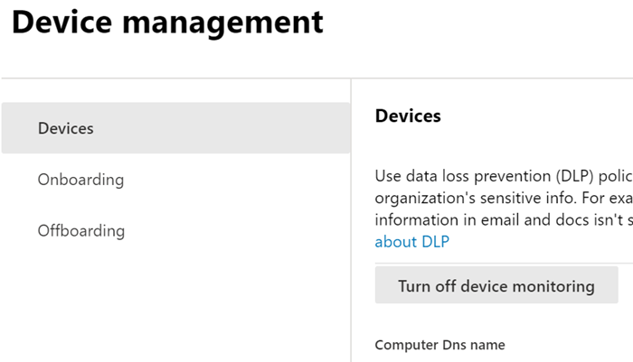

# Introdução à prevenção contra perda de dados do ponto de extremidade (visualização)

A prevenção contra perda de dados de ponto de extremidade do Microsoft (Endpoint DLP) faz parte do pacote de recursos de prevenção contra perda de dados (DLP) da Microsoft 365, que você pode usar para descobrir e proteger itens confidenciais em todos os serviços do Microsoft 365. Para obter mais informações sobre todas as ofertas de DLP da Microsoft, confira [Visão geral de prevenção contra perda de dados](data-loss-prevention-policies.md). Para saber mais sobre o Endpoint DLP, confira [Saber mais sobre a prevenção contra perda de dados do ponto de extremidade (visualização)](endpoint-dlp-learn-about.md)

O Microsoft Endpoint DLP permite monitorar dispositivos Windows 10 e detectar quando itens confidenciais são usados e compartilhados. Isso dá a você a visibilidade e o controle necessários para garantir que eles sejam usados e protegidos corretamente, e para ajudar a evitar o comportamento arriscado que possa comprometer.

## Antes de começar

### Licenciamento SKU/assinaturas

Antes de começar a usar o Endpoint DLP, confirme seu [Assinatura do Microsoft 365](https://www.microsoft.com/microsoft-365/compare-microsoft-365-enterprise-plans?rtc=1) e os complementos. Para acessar e usar a funcionalidade do Endpoint DLP, você deve ter uma dessas assinaturas ou complementos.

- Microsoft 365 E5
- Microsoft 365 A5 (EDU)
- Conformidade do Microsoft 365 E5
- Conformidade do Microsoft 365 A5
- Governança e Proteção de Informações do Microsoft 365 E5
- Governança e Proteção de Informações do Microsoft 365 A5

### Permissões

Para habilitar o gerenciamento de dispositivos, a conta que você usa deve ser um membro de qualquer uma das seguintes funções:

- Administrador global
- Administrador de segurança
- Administrador de conformidade

Se você quiser usar uma conta personalizada para exibir as configurações de gerenciamento de dispositivo, deverá estar em uma das seguintes funções:

- Administrador global
- Administrador de conformidade
- Administrador de dados de conformidade
- Leitor global

Se você quiser usar uma conta personalizada para acessar a página de integração/remoção, deverá estar em uma das seguintes funções:

- Administrador global
- Administrador de conformidade

Se você quiser usar uma conta personalizada para ativar/desativar o monitoramento de dispositivo, deverá estar em uma das seguintes funções:

- Administrador global
- Administrador de conformidade

Os dados do Endpoint DLP podem ser exibidos no [Explorador de atividades](data-classification-activity-explorer.md). Há quatro funções que concedem permissão para o explorador de atividades, a conta que você usa para acessar os dados deve ser um membro de qualquer uma delas.

- Administrador global
- Administrador de conformidade
- Administrador de segurança
- Administrador de dados de conformidade

### Preparar seus pontos de extremidade

Certifique-se de que os dispositivos Windows 10 que você pretende implantar o Endpoint DLP atendam a esses requisitos.

1. Deve estar executando o Windows 10 Build 1809 ou superior.
2. Todos os dispositivos devem estar [ingressados no Azure Active Directory (AAD)](https://docs.microsoft.com/azure/active-directory/devices/concept-azure-ad-join) ou no Azure AD híbrido.
3. Instalar o navegador Microsoft Chromium Edge no dispositivo do ponto de extremidade para impor ações de política para a atividade carregar na nuvem. Confira, [Baixar o novo Microsoft Edge baseado em Chromium](https://support.microsoft.com/help/4501095/download-the-new-microsoft-edge-based-on-chromium).

## Dispositivos de integração no gerenciamento de dispositivos

 Você deve habilitar o monitoramento de dispositivos e encaminhar os pontos de extremidade antes de poder monitorar e proteger itens confidenciais em um dispositivo. Estas ações estão concluídas no portal de conformidade do Microsoft 365.

Se você quiser que os dispositivos integrados ainda não estejam integrados, baixe o script apropriado e distribua-o a esses dispositivos. Siga o [Procedimento de integração de dispositivos](endpoint-dlp-getting-started.md#onboarding-devices).

Se você já tiver dispositivos integrados na [Microsoft Defender para Ponto de Extremidade](https://docs.microsoft.com/windows/security/threat-protection/), eles já serão exibidos na lista dispositivos gerenciados. Siga [Com dispositivos integrados no procedimento Microsoft Defender para Ponto de Extremidade](endpoint-dlp-getting-started.md#with-devices-onboarded-into-microsoft-defender-for- endpoint).

### Dispositivos de integração

Neste cenário de implantação, você integrará dispositivos que ainda não foram integrados e você só deseja monitorar e proteger itens confidenciais contra compartilhamento não intencional em dispositivos Windows 10.

1. Abra o [Centro de conformidade do Microsoft](https://compliance.microsoft.com).
2. Abra a página de configurações do Centro de conformidade e escolha **Integrar dispositivos**. 

   

   > [!NOTE]
   > Enquanto a integração de dispositivos geralmente leva cerca de 60 segundos para que seja habilitada, aguarde até 30 minutos antes de se envolver com o suporte da Microsoft.

3. Escolha **Gerenciamento de dispositivos** para abrir a lista **Dispositivos**. A lista estará vazia até você integrar os dispositivos.
4. Escolha **Integração** para iniciar o processo de integração.
5. Escolha a maneira como deseja implantar para esses dispositivos adicionais a partir da lista de **Método de implantação** e **Baixe o pacote**.

   
6. Siga os procedimentos apropriados em [Ferramentas e métodos de integração dos computadores do Windows 10](https://docs.microsoft.com/windows/security/threat-protection/microsoft-defender-atp/configure-endpoints). Esse link levará você a uma página inicial onde você pode acessar os procedimentos do Microsoft Defender para Ponto de Extremidade que correspondem ao pacote de implantação selecionado na etapa 5:
    - Integrar computadores com Windows 10 usando uma política de grupo
    - Integrar computadores com Windows usando o Microsoft Endpoint Configuration Manager
    - Integrar computadores com Windows 10 usando ferramentas de gerenciamento de dispositivo móvel
    - Integrar computadores com Windows 10 usando um script local
    - Integrar computadores não persistentes da VDI (infraestrutura de desktop virtual).

Uma vez que o ponto de extremidade está integrado, ele deve estar visível na lista dispositivos e começar a relatar logs de atividades de auditoria para o Explorador de atividades.

> [!NOTE]
> Esta experiência está na imposição da licença. Sem a licença necessária, os dados não estarão visíveis nem acessíveis.

### Com dispositivos integrados no Microsoft Defender para Ponto de Extremidade.

Neste cenário, o Microsoft Defender para Ponto de Extremidade já está implantado e há relatórios de pontos de extremidade. Todos esses pontos de extremidade serão exibidos na lista dispositivos gerenciados. Você pode continuar a integrar novos dispositivos no ponto de extremidade DLP para expandir a cobertura usando o[Procedimento de integração de dispositivos](endpoint-dlp-getting-started.md#onboarding-devices).

1. Abra o [Centro de conformidade do Microsoft](https://compliance.microsoft.com).
2. Abra a página de configurações do Centro de conformidade e escolha **Habilitar o monitoramento de dispositivos**.
3. Escolha **Gerenciamento de dispositivos** para abrir a lista **Dispositivos**. Você deverá ver a lista de dispositivos que já estão relatando para o Microsoft Defender para Ponto de Extremidade. 
4. Escolha **Integração**, caso precise integrar dispositivos adicionais.
5. Escolha a maneira como deseja implantar para esses dispositivos adicionais a partir da lista de **Método de implantação** e **Baixe o pacote**.
6. Siga os procedimentos apropriados em [Ferramentas e métodos de integração dos computadores do Windows 10](https://docs.microsoft.com/windows/security/threat-protection/microsoft-defender-atp/configure-endpoints). Esse link levará você a uma página inicial onde você pode acessar os procedimentos do Microsoft Defender para Ponto de Extremidade que correspondem ao pacote de implantação selecionado na etapa 5:
    - Integrar computadores com Windows 10 usando uma política de grupo
    - Integrar computadores com Windows usando o Microsoft Endpoint Configuration Manager
    - Integrar computadores com Windows 10 usando ferramentas de gerenciamento de dispositivo móvel
    - Integrar computadores com Windows 10 usando um script local
    - Integrar computadores não persistentes da VDI (infraestrutura de desktop virtual).

Uma vez que o ponto de extremidade está integrado, ele deve estar visível na tabela **Dispositivos** e começar a relatar logs de atividades de auditoria para o **Explorador de atividades**.

> [!NOTE]
>Esta experiência está na imposição da licença. Sem a licença necessária, os dados não estarão visíveis nem acessíveis.

### Exibir dados de Endpoint DLP no explorador de atividades

1. Abra a [Página de classificação de dados](https://compliance.microsoft.com/dataclassification?viewid=overview) do seu domínio no Centro de conformidade do Microsoft 365 e escolha o Explorador de atividades.
2. Confira os procedimentos no [Comece a usar o Explorador de atividades](data-classification-activity-explorer.md) para acessar e filtrar todos os dados dos dispositivos de ponto de extremidade.

## Próximas etapas
Agora que você tem dispositivos integrados e pode exibir os dados de atividade no Explorador de atividades, você está pronto para prosseguir para a próxima etapa na qual você cria políticas DLP que protegem seus itens confidenciais.

- [Usando a prevenção contra perda de dados do EndPoint (visualização)](endpoint-dlp-using.md)

## Confira também

- [Saiba mais sobre a prevenção contra perda de dados do EndPoint (visualização)](endpoint-dlp-learn-about.md)
- [Usando a prevenção contra perda de dados do EndPoint (visualização)](endpoint-dlp-using.md)
- [Visão geral da prevenção contra perda de dados](data-loss-prevention-policies.md)
- [Criar, testar e ajustar uma política DLP](create-test-tune-dlp-policy.md)
- [Começar a usar o Explorador de atividades](data-classification-activity-explorer.md)
- [Proteção Avançada contra Ameaças do Microsoft Defender (Microsoft Defender ATP)](https://docs.microsoft.com/windows/security/threat-protection/)
- [Ferramentas e métodos de integração para computadores Windows 10](https://docs.microsoft.com/windows/security/threat-protection/microsoft-defender-atp/configure-endpoints)
- [Assinatura do Microsoft 365](https://www.microsoft.com/microsoft-365/compare-microsoft-365-enterprise-plans?rtc=1)
- [Associados a Azure Active Directory (AAD)](https://docs.microsoft.com/azure/active-directory/devices/concept-azure-ad-join)
- [Baixar o novo Microsoft Edge baseado em Chromium](https://support.microsoft.com/help/4501095/download-the-new-microsoft-edge-based-on-chromium)
