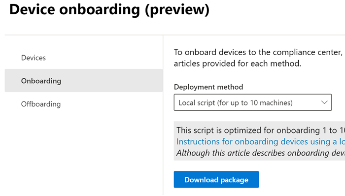
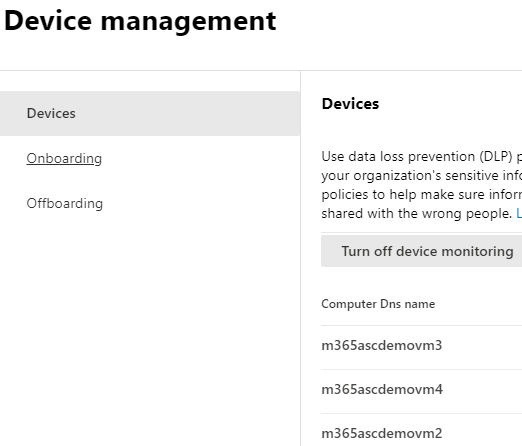
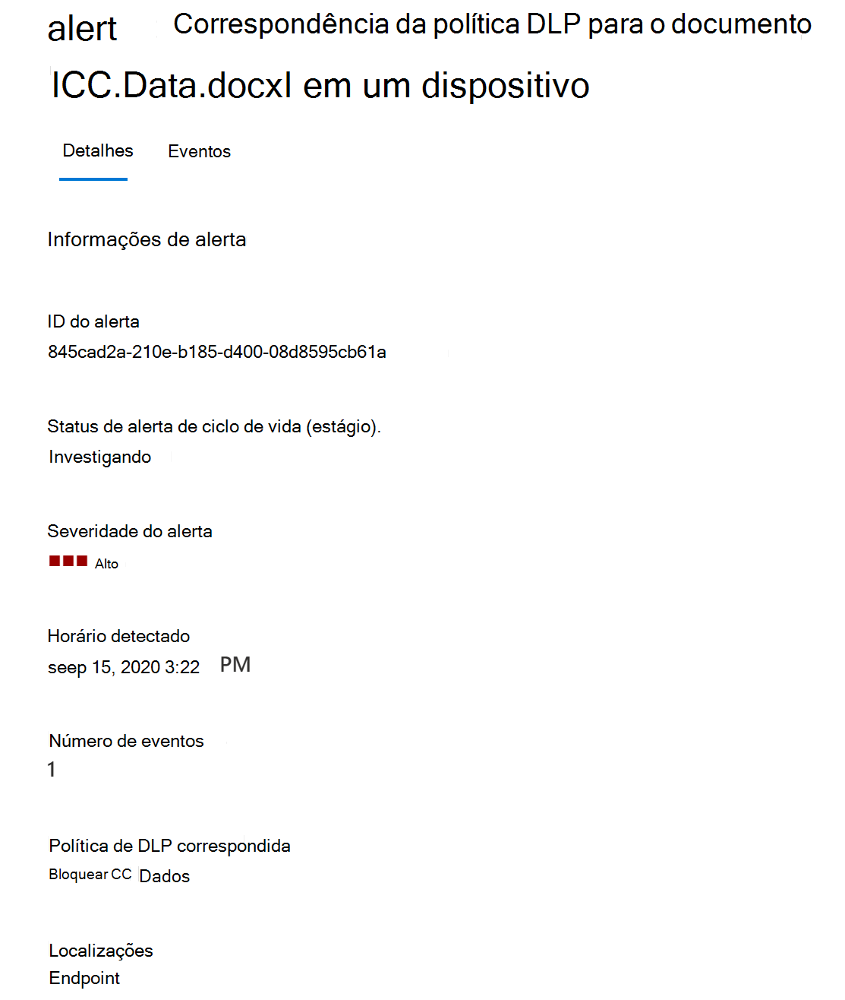

# Saiba mais sobre a prevenção contra perda de dados do ponto de extremidade do Microsoft 365Learn about Microsoft 365 Endpoint data loss prevention

Você pode usar a prevenção contra perda de dados (DLP) da Microsoft 365 para monitorar as ações que estão sendo executadas em itens que você concluiu a ser sensível e para ajudar a evitar o compartilhamento não intencional desses itens.You can use Microsoft 365 data loss prevention (DLP) to monitor the actions that are being taken on items you've determined to be sensitive and to help prevent the unintentional sharing of those items. Para mais informações sobre a DLP, confira [Visão geral das políticas de prevenção contra perda de dados](data-loss-prevention-policies.md).For more information on DLP, see [Overview of data loss prevention](data-loss-prevention-policies.md).

**A prevenção contra perda de dados de pontos de extremidade** (Endpoint DLP) estende os recursos de proteção e monitoramento de atividades da DLP para itens confidenciais que estão em dispositivos Windows 10.**Endpoint data loss prevention** (Endpoint DLP) extends the activity monitoring and protection capabilities of DLP to sensitive items that are on Windows 10 devices. Depois que os dispositivos estiverem integrados às soluções de conformidade do Microsoft 365, as informações sobre o que os usuários estão fazendo com itens confidenciais serão visíveis no [explorador de atividades](data-classification-activity-explorer.md) e você poderá aplicar ações de proteção a esses itens por meio das [políticas DLP](create-test-tune-dlp-policy.md).Once devices are onboarded into the Microsoft 365 compliance solutions, the information about what users are doing with sensitive items is made visible in [activity explorer](data-classification-activity-explorer.md) and you can enforce protective actions on those items via [DLP policies](create-test-tune-dlp-policy.md).

## Atividades do ponto de extremidade que você pode monitorar e executarEndpoint activities you can monitor and take action on

O Microsoft Endpoint DLP permite a auditoria e o gerenciamento dos seguintes tipos de atividades que os usuários têm em itens confidenciais em dispositivos com Windows 10.Microsoft Endpoint DLP enables you to audit and manage the following types of activities users take on sensitive items on devices running Windows 10. 

|atividadeactivity |descriçãodescription  | auditável/restringivelauditable/restictable|
|---------|---------|---------|
|carregar para o serviço de nuvem ou acessar por navegadores não permitidosupload to cloud service, or access by unallowed browsers    | Detecta quando um usuário tenta carregar um item em um domínio de serviço restrito ou acessar um item por meio de um navegador.Detects when a user attempts to upload an item to a restricted service domain or access an item through a browser.  Se eles estiverem usando um navegador listado na DLP como um navegador não permitido, a atividade de carregamento será bloqueada e o usuário será redirecionado para usar o Edge Chromium.If they are using a browser that is listed in DLP as an being an unallowed browser, the upload activity will be blocked and the user is redirected to use Edge Chromium. O Edge Chromium permitirá ou bloqueará o carregamento ou o acesso com base na configuração da política DLPEdge Chromium will then either allow or block the upload or access based on the DLP policy configuration         |auditável e restringívelauditable and restrictable|
|copiar para outro aplicativocopy to other app    |Detecta quando um usuário tenta copiar informações de um item protegido e, em seguida, colá-las em outro aplicativo, processo ou item.Detects when a user attempts to copy information from a protected item and then paste it into another app, process or item. A cópia e a colagem de informações dentro do mesmo aplicativo, processo ou item não é detectada por essa atividade.Copying and pasting information within the same app, process, or item is not detected by this activity.         | auditável e restringívelauditable and restrictable|
|copiar para mídia removível USBcopy to USB removable media |Detecta quando um usuário tenta copiar um item ou informação para uma mídia removível ou dispositivo USB.Detects when a user attempts to copy an item or information to removable media or USB device.         | auditável e restringívelauditable and restrictable|
|Copiar para um compartilhamento de redecopy to a network share    |Detecta quando um usuário tenta copiar um item para um compartilhamento de rede ou unidade de rede mapeadaDetects when a user attempts to copy an item to a network share or mapped network drive         |auditável e restringívelauditable and restrictable|
|imprimir um documentoprint a document    |Detecta quando um usuário tenta imprimir um item protegido em uma impressora local ou de rede.Detects when a user attempts to print a protected item to a local or network printer.| auditável e restringívelauditable and restrictable         |
|criar um Itemcreate an item|Detecta quando um usuário cria um itemDetects when a user creates an item| auditávelauditable|
|renomear um itemrename an item|Detecta quando um usuário renomeia um itemDetects when a user renames an item| auditávelauditable|

 ## Arquivos monitoradosMonitored files

Endpoint DLP oferece suporte ao monitoramento destes tipos de arquivo:Endpoint DLP supports monitoring of these file types:

- Arquivos do WordWord files
- Arquivos do PowerPointPowerPoint files
- Arquivos do ExcelExcel files
- Arquivos PDFPDF files
- Arquivos .csv.csv files
- Arquivos .tsv.tsv files
- Arquivos .txt.txt files
- Arquivos .rtf.rtf files
- Arquivos .c.c files
- Arquivos .class.class files
- Arquivos .cpp.cpp files
- Arquivos .cs.cs files
- Arquivos .h.h files
- Arquivos .java.java files
 
Por padrão, o DLP do endpoint audita as atividades para esses tipos de arquivo, mesmo se não houver uma correspondência de política.By default, endpoint DLP audits the activities for these file types, even if there isn't a policy match. Se quiser apenas monitorar dados de correspondências de política, você pode desligar **Sempre auditar atividade de arquivo para dispositivos** nas configurações globais de DLP do endpoint.If you only want monitoring data from policy matches, you can turn off the **Always audit file activity for devices** in the endpoint DLP global settings. Não importa o que aconteça, as atividades em qualquer arquivo Word, PowerPoint, Excel, PDF e .csv são sempre auditadas.No matter what, activities on any Word, PowerPoint, Excel, PDF, and .csv file are always audited.

O DLP do ponto de extremidade monitora a atividade com base no tipo MIME, portanto, as atividades serão capturadas mesmo se a extensão do arquivo for alterada.Endpoint DLP monitors activity-based on MIME type, so activities will be captured even if the file extension is changed. 

## O que é diferente no Endpoint DLPWhat's different in Endpoint DLP

Há alguns conceitos adicionais que você precisa saber antes de mergulhar no Endpoint DLP.There are a few extra concepts that you need to be aware of before you dig into Endpoint DLP.

### Habilitar o gerenciamento de dispositivosEnabling Device management

O gerenciamento de dispositivos é a funcionalidade que habilita o conjunto de telemetria de dispositivos e a reúne para as soluções do Centro de conformidade do Microsoft 365, como Endpoint DLP e [gerenciamento de risco interno](insider-risk-management.md).Device management is the functionality that enables the collection of telemetry from devices and brings it into Microsoft 365 compliance solutions like Endpoint DLP and [Insider Risk management](insider-risk-management.md). Será necessário integrar todos os dispositivos que você deseja usar como locais nas políticas DLP.You'll need to onboard all devices you want to use as locations in DLP policies.

> [!div class="mx-imgBorder"]
> 

A integração e a remoção são manipuladas por meio de scripts que você baixa no centro de gerenciamento de dispositivos.Onboarding and offboarding are handled via scripts you download from the Device management center. O centro tem scripts personalizados para cada um desses métodos de implantação:The center has custom scripts for each of these deployment methods:

- script local (até 10 máquinas)local script (up to 10 machines)
- Política de grupoGroup policy
- System Center Configuration Manager (versão 1610 ou posterior)System Center Configuration Manager (version 1610 or later)
- Gerenciamento de dispositivos móveis/Microsoft IntuneMobile Device Management/Microsoft Intune
- Scripts de integração VDI para máquinas não persistentesVDI onboarding scripts for non-persistent machines

> [!div class="mx-imgBorder"]
> 

 Use os procedimentos no [Introdução ao Microsoft 365 Endpoint DLP](endpoint-dlp-getting-started.md) a dispositivos integrados.Use the procedures in [Getting started with Microsoft 365 Endpoint DLP](endpoint-dlp-getting-started.md) to onboard devices.

Se você tiver dispositivos integrados por meio do [Microsoft Defender para Ponto de Extremidade](https://docs.microsoft.com/windows/security/threat-protection/), esses dispositivos aparecerão automaticamente na lista de dispositivos.If you have onboarded devices through [Microsoft Defender for Endpoint](https://docs.microsoft.com/windows/security/threat-protection/), those devices will automatically show up in the list of devices.

> [!div class="mx-imgBorder"]
> 

### Exibir dados de DLP do EndpointViewing Endpoint DLP data

Visualize os alertas relacionados às políticas DLP aplicadas em dispositivos de ponto de extremidade no [Painel de Gerenciamento de Alertas DLP](dlp-configure-view-alerts-policies.md).You can view alerts related to DLP policies enforced on endpoint devices by going to the [DLP Alerts Management Dashboard](dlp-configure-view-alerts-policies.md).

Você também pode visualizar detalhes do evento associado com metadados ricos no mesmo painelYou can also view details of the associated event with rich metadata in the same dashboard

Após a integração de um dispositivo, as informações sobre as atividades auditadas fluem no explorador de atividades mesmo antes de você configurar e implantar as políticas DLP que têm dispositivos como um local.Once a device is onboarded, information about audited activities flows into Activity explorer even before you configure and deploy any DLP policies that have devices as a location.

> [!div class="mx-imgBorder"]
> 

O Endpoint DLP coleta informações abrangentes sobre atividades auditadas.Endpoint DLP collects extensive information on audited activity.

Por exemplo, se um arquivo for copiado para uma mídia USB removível, você verá esses atributos nos detalhes da atividade:For example, if a file is copied to removable USB media, you'd see these attributes in the activity details:

- tipo de atividadeactivity type
- IP do Clienteclient IP
- caminho do arquivo de destinotarget file path
- carimbo de data/hora ocorridohappened timestamp
- nome do arquivofile name
- usuáriouser
- extensão do arquivofile extension
- tamanho do arquivofile size
- tipo de informação confidencial (se aplicável)sensitive information type (if applicable)
- valor SHA1sha1 value
- valor SHA256sha256 value
- nome do arquivo anteriorprevious file name
- localizaçãolocation
- primárioparent
- FilePathfilepath
- Tipo de local de origemsource location type
- plataformaplatform
- nome do dispositivodevice name
- Tipo de local de destinodestination location type
- aplicativo que executou a cópiaapplication that performed the copy
- ID de dispositivo do Microsoft Defender para Ponto de Extremidade (se aplicável)Microsoft Defender for Endpoint device ID (if applicable)
- fabricante do dispositivo de mídia removívelremovable media device manufacturer
- modelo do dispositivo de mídia removívelremovable media device model
- número de série do dispositivo de mídia removívelremovable media device serial number

> [!div class="mx-imgBorder"]
> 

## Próximas etapasNext steps

Agora que você aprendeu sobre o Endpoint DLP, as próximas etapas são:Now that you've learned about Endpoint DLP, your next steps are:

1) [Introdução à prevenção contra perda de dados do ponto de extremidade da MicrosoftGetting started with Microsoft Endpoint data loss prevention ](endpoint-dlp-getting-started.md)
2) [Usar a prevenção contra perda de dados do Ponto de extremidade da MicrosoftUsing Microsoft Endpoint data loss prevention](endpoint-dlp-using.md)

## Confira tambémSee also

- [Introdução à prevenção contra perda de dados do Ponto de extremidade da MicrosoftGetting started with Microsoft Endpoint data loss prevention](endpoint-dlp-getting-started.md)
- [Usar a prevenção contra perda de dados do Ponto de extremidade da MicrosoftUsing Microsoft Endpoint data loss prevention](endpoint-dlp-using.md)
- [Visão geral da prevenção contra perda de dadosOverview of data loss prevention](data-loss-prevention-policies.md)
- [Criar, testar e ajustar uma política DLPCreate, test, and tune a DLP policy](create-test-tune-dlp-policy.md)
- [Começar a usar o Explorador de atividadesGet started with Activity explorer](data-classification-activity-explorer.md)
- [Microsoft Defender para Ponto de ExtremidadeMicrosoft Defender for Endpoint](https://docs.microsoft.com/windows/security/threat-protection/)
- [Gerenciamento de risco internoInsider Risk management](insider-risk-management.md)
