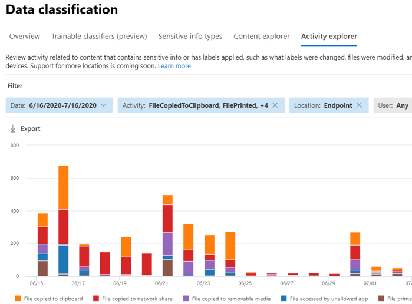

# Saiba mais sobre a prevenção contra perda de dados do Microsoft 365 Endpoint

Use a prevenção contra perda de dados (DLP) do Microsoft 365 para monitorar as ações que estão sendo executadas em itens que você determinou como confidenciais e para ajudar a evitar o compartilhamento não intencional desses itens. Para obter mais informações sobre DLP, confira [Visão geral da prevenção contra perda de dados](data-loss-prevention-policies.md).

A **Prevenção contra perda de dados** (DLP do ponto de extremidade) estende os recursos de monitoramento e proteção de atividades do DLP a itens confidenciais que estão nos dispositivos Windows 10. Uma vez que os dispositivos são integrados nas soluções do Centro de conformidade do Microsoft 365, as informações sobre o que os usuários estão fazendo com itens confidenciais ficam visíveis no [explorador de atividades](data-classification-activity-explorer.md) e você pode aplicar ações de proteção nesses itens através de [políticas DLP](create-test-tune-dlp-policy.md).

## Atividades do ponto de extremidade que você pode monitorar e executar

O Microsoft Endpoint DLP permite a auditoria e o gerenciamento dos seguintes tipos de atividades que os usuários realizam em itens confidenciais em dispositivos que executam o Windows 10. Isso inclui:

|atividade no item |auditável/restringivel  |
|---------|---------|
|criado    | auditável      |
|renomeado    |  auditável       |
|copiado ou criado em mídia removível     |     auditável e restringível|
|copiado para compartilhamento de rede, por exemplo \\my-server\fileshare   |     auditável e restringível    |
|impresso |    auditável e restringível       |
|copiado para a nuvem por meio do Chromium Edge    |   auditável e restringível        |
|acessado por aplicativos e navegadores que não tem permissão de acesso    |  auditável e restringível       |

## O que é diferente no Endpoint DLP

Há alguns conceitos adicionais que você precisa saber antes de mergulhar no Endpoint DLP.

### Habilitar o gerenciamento de dispositivos

O gerenciamento de dispositivos é a funcionalidade que permite a coleção de telemetria de dispositivos e as traz para as soluções do Centro de conformidade do Microsoft 365, como DLP do ponto de extremidade e [Gerenciamento de risco interno](insider-risk-management.md). Será necessário integrar todos os dispositivos que deseja usar como locais nas políticas DLP.

> [!div class="mx-imgBorder"]
> 

A integração e a remoção são tratadas através de scripts baixados do Centro de gerenciamento de dispositivos. O centro tem scripts personalizados para cada um desses métodos de implantação:

- script local (até 10 computadores)
- Política de grupo
- System Center Configuration Manager (versão 1610 ou posterior)
- Gerenciamento de dispositivos móveis/Microsoft Intune
- Scripts de integração VDI para máquinas não persistentes

> [!div class="mx-imgBorder"]
> 

 Use os procedimentos no [Introdução ao Microsoft 365 Endpoint DPL](endpoint-dlp-getting-started.md) para dispositivos integrados.

Se você tiver dispositivos integrados por meio do [Microsoft Defender para Ponto de Extremidade](https://docs.microsoft.com/windows/security/threat-protection/), esses dispositivos aparecerão automaticamente na lista de dispositivos.

> [!div class="mx-imgBorder"]
> 

### Exibir dados de DLP do Ponto de Extremidade

 O DLP do ponto de extremidade monitora a atividade com base no tipo MIME, de modo que as atividades serão capturadas mesmo que a extensão do arquivo seja alterada. Na visualização pública, são vistos todos:

- Arquivos do Word
- Arquivos do PowerPoint
- Arquivos do Excel
- Arquivos PDF
- Arquivos .csv
- Arquivos .tsv
- Arquivos .txt
- Arquivos .rtf
- Arquivos .c
- Arquivos .class
- Arquivos .cpp
- Arquivos .cs
- Arquivos .h
- Arquivos .java

> [!NOTE]
> O Endpoint DLP avalia arquivos de todos os tipos acima em relação à política DLP e aplica ações de proteção em conformidade. Todos os arquivos que correspondem a uma política DLP são auditados para todas as ações suportadas, mesmo que não estejam bloqueados. Além disso, a atividade de arquivos realizada em qualquer arquivo Word, PowerPoint, Excel, PDF e .csv é auditada por padrão, independente da existência de uma política DLP ou se ela corresponde a esses arquivos.

Você pode visualizar os alertas relacionados às políticas DLP aplicadas em dispositivos de ponto de extremidade indo até o Painel de Gerenciamento de Alertas [DLP](dlp-configure-view-alerts-policies.md).

Você também pode visualizar detalhes do evento associado com metadados ricos no mesmo painel

Depois que um dispositivo é integrado, as informações sobre as atividades auditadas fluem para o Gerenciador de atividade antes mesmo de configurar e implantar qualquer política DLP que tenha dispositivos como local.

> [!div class="mx-imgBorder"]
> 

O DLP do ponto de extremidade coleta informações abrangentes sobre a atividade auditada.

Por exemplo, se um arquivo for copiado para uma mídia USB removível, você verá esses atributos nos detalhes da atividade:

- tipo de atividade
- IP do Cliente
- caminho do arquivo de destino
- carimbo de data/hora ocorrido
- nome do arquivo
- usuário
- extensão do arquivo
- tamanho do arquivo
- tipo de informação confidencial (se aplicável)
- valor SHA1
- valor SHA256
- nome do arquivo anterior
- localização
- primário
- FilePath
- Tipo de local de origem
- plataforma
- nome do dispositivo
- Tipo de local de destino
- aplicativo que executou a cópia
- ID de dispositivo do Microsoft Defender para Ponto de Extremidade (se aplicável)
- fabricante do dispositivo de mídia removível
- modelo do dispositivo de mídia removível
- número de série do dispositivo de mídia removível

> [!div class="mx-imgBorder"]
> 

## Próximas etapas

Agora que você aprendeu sobre o Endpoint DLP, as próximas etapas são:

1) [Introdução à prevenção contra perda de dados do Microsoft EndPoint (visualização)](endpoint-dlp-getting-started.md)
2) [Usar a prevenção contra perda de dados do Microsoft EndPoint (visualização)](endpoint-dlp-using.md)

## Confira também

- [Introdução à prevenção contra perda de dados do Microsoft EndPoint (visualização)](endpoint-dlp-getting-started.md)
- [Usar a prevenção contra perda de dados do Microsoft EndPoint (visualização)](endpoint-dlp-using.md)
- [Visão geral da prevenção contra perda de dados](data-loss-prevention-policies.md)
- [Criar, testar e ajustar uma política DLP](create-test-tune-dlp-policy.md)
- [Começar a usar o Explorador de atividades](data-classification-activity-explorer.md)
- [Microsoft Defender para Ponto de Extremidade](https://docs.microsoft.com/windows/security/threat-protection/)
- [Gerenciamento de risco interno](insider-risk-management.md)
