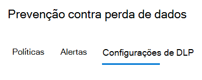
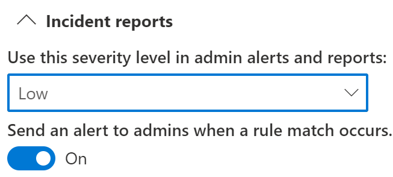

# Usando a prevenção contra perda de dados do Endpoint

Este artigo o conduz por três cenários em que você cria e modifica uma política DLP que usa dispositivos como um local.

## Configurações de DLP

Antes de começar, você deve configurar suas configurações de DLP, aplicadas a todas as políticas DLP para dispositivos. Você deve configurá-los se pretende criar políticas que impõem:

- restrições de saída de nuvem
- restrições de aplicativos não permitidos

Ou

- Se você deseja excluir os caminhos de arquivo barulhentos do monitoramento

  > [!div class="mx-imgBorder"]
  > 

### Exclusões de caminho de arquivo

Talvez você queira excluir determinados caminhos de monitoramento DLP, alertas DLP e imposição de política de DLP em seus dispositivos porque eles são muito barulhentos ou não contêm arquivos nos quais você está interessado. Os arquivos nesses locais não serão auditados e os arquivos criados ou modificados nesses locais não estarão sujeitos à imposição da política de DLP. Você pode configurar exclusões de caminho nas configurações DLP.

Você pode usar essa lógica para construir seus caminhos de exclusão:

- Caminho de arquivo válido que termina com "\", o que significa somente os arquivos da pasta.  Por exemplo: C:\Temp\

- Caminho de arquivo válido que termina com “\*”, o que significa somente os arquivos em subpastas, além dos arquivos diretamente na pasta.  Por exemplo: C:\Temp\*

- Caminho de arquivo válido que termina com "\" ou “\*”, o que significa somente os arquivos da pasta e todas as subpastas.  Por exemplo: C:\Temp

- Um caminho com o curinga entre "\" de cada lado.  Por exemplo: C:\Users\*\Desktop\

- Um caminho com curinga entre "\" de cada lado e com '(número)' para atribuir um número exato de subpastas.  Por exemplo: C:\Users\*(1) \Downloads\

- Um caminho com variáveis de ambiente do sistema.  Por exemplo: %SystemDrive%\Test\*

- Uma mistura de todas as acima.  Por exemplo: %SystemDrive%\Users\*\Documents\*(2)\Sub\

### Aplicativos não permitidos

Quando a configuração de **Acesso a uma política por meio de aplicativos e navegadores não permitidos** estiver ativada e os usuários tentarem usar esses aplicativos para acessar um arquivo protegido, a atividade será permitida, bloqueada ou bloqueada, mas os usuários poderão substituir a restrição. Todas as atividades são auditadas e estão disponíveis para revisão no explorador de atividades.

> [!IMPORTANT]
> Não inclua o caminho para o executável, apenas o nome do executável (por exemplo, browser.exe).

### Restrições de navegador e domínio
Restringir arquivos confidenciais que correspondam a suas políticas contra domínios de serviço de nuvem irrestritos.

#### Domínios de serviço

É possível controlar se os arquivos confidenciais protegidos por suas políticas podem ser carregados para domínios de serviço específicos no Microsoft Edge.

Se o modo de lista estiver definido como **Bloquear**, o usuário não poderá carregar itens confidenciais para esses domínios. Quando uma ação de carregamento é bloqueada porque um item corresponde a uma política DLP, a DLP gera um aviso ou bloqueia o carregamento do item confidenciais.

Se o modo de lista estiver definido como **Permitir**, os usuários poderão fazer upload de itens confidenciais **_apenas_** para esses domínios, e o acesso de upload a todos os outros domínios não é permitido.

#### Navegadores não permitidos

Adicione navegadores, identificados por seus nomes executáveis, que serão impedidos de acessar arquivos que correspondam às condições de uma política de DLP, em que a restrição de upload para serviços de nuvem está definida para bloquear ou para substituição de bloqueio. Quando estes navegadores estiverem bloqueados de acessar um arquivo, os usuários finais verão uma notificação do sistema solicitando que eles abram o arquivo por meio do Edge Chromium.

### Justificativa de negócios em dicas de política

Você pode controlar como os usuários interagem com a opção de justificativa de negócios nas notificações de dica de política DLP. Esta opção aparece quando os usuários realizam uma atividade protegida pela configuração **Bloquear com substituição** em uma política DLP. Você pode escolher uma das seguintes opções:

- Por padrão, os usuários podem selecionar uma justificativa interna ou inserir seu próprio texto.
- Os usuários podem selecionar apenas uma justificativa embutida.
- Os usuários só podem inserir sua própria justificativa.

## Como ligar as configurações da DLP

Com o Endpoint DPL e o navegador Edge Chromium, você pode restringir o compartilhamento não voluntariado de itens confidenciais a serviços e aplicativos na nuvem não permitidos. Edge Chromium entende quando um item é restrito por uma política de Endpoint DLP e impõe restrições de acesso.

Quando você usa o Endpoint DLP como um local em uma política DLP corretamente configurada e o navegador Edge Chromium, os navegadores não permitidos que você definiu nestas configurações serão impedidos de acessar os itens confidenciais que correspondem a seus controles de política de DLP. Em vez disso, os usuários serão redirecionados para usar o Edge Chromium e o Edge Chromium, com o entendimento das restrições impõe a DLP, poderá bloquear ou restringir atividades quando as condições na política DLP forem atendidas.

Para usar essa restrição, você precisará configurar três partes importantes:

1. Especifique os locais (serviços, domínios e endereços IP) que deseja impedir que os itens confidenciais sejam compartilhados.

2. Adicione os navegadores que não têm permissão para acessar determinados itens confidenciais quando ocorre uma correspondência de política DLP.

3. Configure as políticas DLP para definir os tipos de itens confidenciais para os quais o carregamento deve ser restrito a esses lugares, ativando **Carregar nos serviços de nuvem** e **Acesso a partir do navegador não permitido**.

Você pode continuar a adicionar novos serviços, aplicativos e políticas para estender e aprimorar suas restrições para atender às suas necessidades de negócios e proteger dados confidenciais. 

Essa configuração ajudará a garantir a segurança dos seus dados, além de evitar restrições desnecessárias, que impedem ou impedem que os usuários acessem e compartilhem itens não confidenciais.

## Cenários de política do Endpoint DLP

Para ajudar você a se familiarizar com os recursos d Endpoint DLP e como eles são emergem nas políticas de DLP, juntamos alguns cenários que você pode seguir.

> [!IMPORTANT]
> Esses cenários do Endpoint DLP não são os procedimentos oficiais para criar e ajustar as políticas DLP. Confira os tópicos a seguir quando você precisar trabalhar com políticas de DLP em situações gerais:
>- [Visão geral da prevenção contra perda de dados](data-loss-prevention-policies.md)
>- [Introdução à política DLP padrão](get-started-with-the-default-dlp-policy.md)
>- [Criar uma política DLP a partir de um modelo](create-a-dlp-policy-from-a-template.md)
>- [Criar, testar e ajustar uma política DLP](create-test-tune-dlp-policy.md)

### Cenário 1: Criar uma política a partir de um modelo, somente auditoria

Esses cenários exigem que você já tenha dispositivos integrados e relatados no Explorador de atividades. Se ainda não tiver integrado os dispositivos, confira [Introdução à prevenção contra perda de dados do Ponto de extremidade](endpoint-dlp-getting-started.md).

1. Abra a página [Prevenção contra perda de dados](https://compliance.microsoft.com/datalossprevention?viewid=policies).

2. Escolha **Criar política**.

3. Para esse cenário, escolha **Privacidade**, em seguida, **Dados de Informações de Identificação Pessoal (PII) dos EUA** e escolha **Próximo**.

4. Alterne o campo **Status** para desativado em todos os locais, exceto os **Dispositivos**.  Escolha **Próximo**.

5. Aceite a seleção padrão **Revisar e personalizar as configurações do modelo** e escolha **Próximo**.

6. Aceite os valores padrão de **Ações de proteção** e escolha **Próximo**.

7. Selecione **Auditoria ou restringir atividades em dispositivos de Windows** e deixe as ações definidas como **Somente auditar**. Escolha **Próximo**.

8. Aceite o valor padrão **Eu quero testá-lo primeiro** e escolha **Mostrar dicas de política enquanto estiver no modo de teste**. Escolha **Próximo**.

9. Examine as configurações e escolha **Enviar**.

10. A nova política DLP será exibida na lista de políticas.

11. Verificar o Explorador de atividade para obter pontos de extremidade monitorados. Defina o filtro local para dispositivos e adicione a política, em seguida, filtre por nome da política para ver o impacto dessa política. Confira [Começar a usar o explorador de atividades](data-classification-activity-explorer.md) se necessário.

12. Tentativa de compartilhar um teste contendo conteúdo que disparará a Condição de Dados de Informações de Identificação Pessoal (PII) dos EUA com alguém fora da sua organização. Isso deve desencadear a política.

13. Verifique o Explorador de atividades para obter o evento.

### Cenário 2: Modificar a política existente, definir um alerta

1. Abra a página [Prevenção de perda de dados](https://compliance.microsoft.com/datalossprevention?viewid=policies).

2. Escolha as políticas de **Dados de Informações de Identificação Pessoal (PII) dos EUA** criadas cenário 1.

3. Escolha **Editar política**.

4. Vá para a página **Regras avançadas de DLP** e edite o **Baixo volume de conteúdo detectado nas Informações de Identificação Pessoal dos EUA**.

5. Role para baixo até a seção **Relatório de incidentes** e configure **Envie um alerta para administradores quando uma correspondência de regra ocorrer** para **No**. Os alertas de email serão enviados automaticamente para o administrador e qualquer pessoa que você adicionar à lista de destinatários. 

   > [!div class="mx-imgBorder"]
   > 
   
6. Para fins deste cenário, escolha **Enviar alerta sempre que uma atividade corresponder à regra**.

7. Escolha **Salvar**.

8. Mantenha todas as suas configurações anteriores escolhendo **Próximo** e **Enviar** as alterações de política.

9. Tentativa de compartilhar um teste contendo conteúdo que disparará a Condição de Dados de Informações de Identificação Pessoal (PII) dos EUA com alguém fora da sua organização. Isso deve desencadear a política.

10. Verifique o Explorador de atividades para obter o evento.

### Cenário 3: Modificar a política existente, bloquear a ação com permitir substituição

1. Abra a página [Prevenção de perda de dados](https://compliance.microsoft.com/datalossprevention?viewid=policies).

2. Escolha as políticas de **Dados de Informações de Identificação Pessoal (PII) dos EUA** criadas cenário 1.

3. Escolha **Editar política**.

4. Vá para a página **Regras avançadas de DLP** e edite o **Baixo volume de conteúdo detectado nas Informações de Identificação Pessoal dos EUA**.

5. Role a tela para baixo até a seção **Auditoria ou restringir atividades nos dispositivos do Windows** e para cada atividade defina a ação correspondente para **Bloquear com substituir**.

   > [!div class="mx-imgBorder"]
   > 
   
6. Escolha **Salvar**.

7. Repita as etapas 4-7 para o **Alto volume de conteúdo detectado nas Informações de Identificação Pessoal dos EUA**.

8. Mantenha todas as suas configurações anteriores escolhendo **Próximo** e **Enviar** as alterações de política.

9. Tentativa de compartilhar um teste contendo conteúdo que disparará a Condição de Dados de Informações de Identificação Pessoal (PII) dos EUA com alguém fora da sua organização. Isso deve desencadear a política.

   Você verá um pop-up assim no dispositivo do cliente:

   > [!div class="mx-imgBorder"]
   > 

10. Verifique o Explorador de atividades para obter o evento.

## Confira também

- [Saiba mais sobre a Prevenção contra perda de dados do ponto de extremidade](endpoint-dlp-learn-about.md)
- [Introdução à Prevenção contra perda de dados do ponto de extremidade](endpoint-dlp-getting-started.md)
- [Visão geral da prevenção contra perda de dados](data-loss-prevention-policies.md)
- [Criar, testar e ajustar uma política DLP](create-test-tune-dlp-policy.md)
- [Começar a usar o Explorador de atividades](data-classification-activity-explorer.md)
- [Microsoft Defender para Ponto de Extremidade](https://docs.microsoft.com/windows/security/threat-protection/)
- [Ferramentas e métodos de integração para computadores Windows 10](https://docs.microsoft.com/windows/security/threat-protection/microsoft-defender-atp/configure-endpoints)
- [Assinatura do Microsoft 365](https://www.microsoft.com/microsoft-365/compare-microsoft-365-enterprise-plans?rtc=1)
- [Associados a Azure Active Directory (AAD)](https://docs.microsoft.com/azure/active-directory/devices/concept-azure-ad-join)
- [Baixar o novo Microsoft Edge baseado em Chromium](https://support.microsoft.com/help/4501095/download-the-new-microsoft-edge-based-on-chromium)
- [Introdução à política DLP padrão](get-started-with-the-default-dlp-policy.md)
- [Criar uma política DLP a partir de um modelo](create-a-dlp-policy-from-a-template.md)
