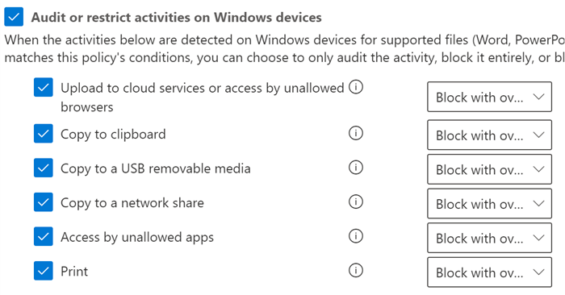

# Usando a prevenção contra perda de dados do EndpointUsing Endpoint data loss prevention

Este artigo o conduz por três cenários em que você cria e modifica uma política DLP que usa dispositivos como um local.This article walks you through three scenarios where you create and modify a DLP policy that uses devices as a location.

## Configurações de DLPDLP settings

Antes de começar, você deve configurar suas configurações de DLP, aplicadas a todas as políticas DLP para dispositivos.Before you get started you should set up your DLP settings which are applied to all DLP policies for devices. Você deve configurá-los se pretende criar políticas que impõem:You must configure these if you intend to create policies that enforce:

- restrições de saída de nuvemcloud egress restrictions
- restrições de aplicativos não permitidosunallowed apps restrictions

OuOr

- Se você deseja excluir os caminhos de arquivo barulhentos do monitoramentoIf you want to exclude noisy file paths from monitoring

  > [!div class="mx-imgBorder"]
  > 

### Exclusões de caminho de arquivoFile path exclusions

Talvez você queira excluir determinados caminhos de monitoramento DLP, alertas DLP e imposição de política de DLP em seus dispositivos porque eles são muito barulhentos ou não contêm arquivos nos quais você está interessado.You may want to exclude certain paths from DLP monitoring, DLP alerting, and DLP policy enforcement on your devices because they are too noisy or don’t contain files you are interested in. Os arquivos nesses locais não serão auditados e os arquivos criados ou modificados nesses locais não estarão sujeitos à imposição da política de DLP.Files in those locations will not be audited and any files that are created or modified in those locations will not be subject to DLP policy enforcement. Você pode configurar exclusões de caminho nas configurações DLP.You can configure path exclusions in DLP settings.

Você pode usar essa lógica para construir seus caminhos de exclusão:You can use this logic to construct your exclusion paths:

- Caminho de arquivo válido que termina com "\", o que significa somente os arquivos da pasta.Valid file path that ends with ‘\’, which means only files directly under folder.  Por exemplo: C:\TempFor example: C:\Temp\

- Caminho de arquivo válido que termina com “\*”, o que significa somente os arquivos em subpastas, além dos arquivos diretamente na pasta.Valid file path that ends with ‘\*’, which means only files under sub-folders, besides the files directly under the folder.  Por exemplo: C:\Temp\*For example: C:\Temp\*

- Caminho de arquivo válido que termina com "\" ou “\*”, o que significa somente os arquivos da pasta e todas as subpastas.Valid file path that ends without ‘\’ or ‘\*’, which means all files directly under folder and all sub-folders.  Por exemplo: C:\TempFor example: C:\Temp

- Um caminho com o curinga entre "\" de cada lado.A path with wildcard between ‘\’ from each side.  Por exemplo: C:\Users\*\DesktopFor example: C:\Users\*\Desktop\

- Um caminho com curinga entre "\" de cada lado e com '(número)' para atribuir um número exato de subpastas.A path with wildcard between ‘\’ from each side and with ‘(number)’ to give exact number of subfolders.  Por exemplo: C:\Users\*(1) \DownloadsFor example: C:\Users\*(1)\Downloads\

- Um caminho com variáveis de ambiente do sistema.A path with SYSTEM environment variables.  Por exemplo: %SystemDrive%\Test\*For example: %SystemDrive%\Test\*

- Uma mistura de todas as acima.A mix of all the above.  Por exemplo: %SystemDrive%\Users\*\Documents\*(2)\SubFor example: %SystemDrive%\Users\*\Documents\*(2)\Sub\

### Aplicativos não permitidosUnallowed apps

Quando a configuração de **Acesso a uma política por meio de aplicativos e navegadores não permitidos** estiver ativada e os usuários tentarem usar esses aplicativos para acessar um arquivo protegido, a atividade será permitida, bloqueada ou bloqueada, mas os usuários poderão substituir a restrição.When a policy's **Access by unallowed apps and browsers** setting is turned on and users attempt to use these apps to access a protected file, the activity will be allowed, blocked, or blocked but users can override the restriction. Todas as atividades são auditadas e estão disponíveis para revisão no explorador de atividades.All activity is audited and available to review in activity explorer.

> [!IMPORTANT]
> Não inclua o caminho para o executável, apenas o nome do executável (por exemplo, browser.exe).Do not include the path to the executable, but only the executable name (such as browser.exe).

### Restrições de navegador e domínioBrowser and domain restrictions
Restringir arquivos confidenciais que correspondam a suas políticas contra domínios de serviço de nuvem irrestritos.Restrict sensitive files that match your policies from being shared with unrestricted cloud service domains.

#### Domínios de serviçoService domains

É possível controlar se os arquivos confidenciais protegidos por suas políticas podem ser carregados para domínios de serviço específicos no Microsoft Edge.You can control whether sensitive files protected by your policies can be uploaded to specific service domains from Microsoft Edge.

Se o modo de lista estiver definido como **Bloquear**, o usuário não poderá carregar itens confidenciais para esses domínios.If the list mode is set to **Block**, then user will not be able to upload sensitive items to those domains. Quando uma ação de carregamento é bloqueada porque um item corresponde a uma política DLP, a DLP gera um aviso ou bloqueia o carregamento do item confidenciais.When an upload action is blocked because an item matches a DLP policy, DLP will either generate a warning or block the upload of the sensitive item.

Se o modo de lista estiver definido como **Permitir**, os usuários poderão fazer upload de itens confidenciais **_apenas_** para esses domínios, e o acesso de upload a todos os outros domínios não é permitido.If the list mode is set to **Allow**, then users will be able to upload sensitive items **_only_** to those domains, and upload access to all other domains is not allowed.

> [!IMPORTANT]
> Quando o modo de restrição de serviço é definido como "Permitir", você deve ter pelo menos um domínio de serviço configurado antes que as restrições sejam aplicadas.When the service restriction mode is set to "Allow", you must have at least one service domain configured before restrictions are enforced.

#### Navegadores não permitidosUnallowed browsers

Adicione navegadores, identificados por seus nomes executáveis, que serão impedidos de acessar arquivos que correspondam às condições de uma política de DLP, em que a restrição de upload para serviços de nuvem está definida para bloquear ou para substituição de bloqueio.You add browsers, identified by their executable names, that will be blocked from accessing files that match the conditions of an enforced a DLP policy where the upload to cloud services restriction is set to block or block override. Quando estes navegadores estiverem bloqueados de acessar um arquivo, os usuários finais verão uma notificação do sistema solicitando que eles abram o arquivo por meio do Edge Chromium.When these browsers are blocked from accessing a file, the end users will see a toast notification asking them to open the file through Edge Chromium.

### Justificativa de negócios em dicas de políticaBusiness justification in policy tips

Você pode controlar como os usuários interagem com a opção de justificativa de negócios nas notificações de dica de política DLP.You can control how users interact with the business justification option in DLP policy tip notifications. Esta opção aparece quando os usuários realizam uma atividade protegida pela configuração **Bloquear com substituição** em uma política DLP.This option appears when users perform an activity that's protected by the **Block with override** setting in a DLP policy. Você pode escolher uma das seguintes opções:You can choose from one the following options:

- Por padrão, os usuários podem selecionar uma justificativa interna ou inserir seu próprio texto.By default, users can select either a built-in justification, or enter their own text.
- Os usuários podem selecionar apenas uma justificativa embutida.Users can only select a built-in justification.
- Os usuários só podem inserir sua própria justificativa.Users can only enter their own justification.

## Como ligar as configurações da DLPTying DLP settings together

Com o Endpoint DPL e o navegador Edge Chromium, você pode restringir o compartilhamento não voluntariado de itens confidenciais a serviços e aplicativos na nuvem não permitidos.With Endpoint DLP and Edge Chromium Web browser, you can restrict unintentional sharing of sensitive items to unallowed cloud apps and services. Edge Chromium entende quando um item é restrito por uma política de Endpoint DLP e impõe restrições de acesso.Edge Chromium understands when an item is restricted by an Endpoint DLP policy and enforces access restrictions.

Quando você usa o Endpoint DLP como um local em uma política DLP corretamente configurada e o navegador Edge Chromium, os navegadores não permitidos que você definiu nestas configurações serão impedidos de acessar os itens confidenciais que correspondem a seus controles de política de DLP.When you use Endpoint DLP as a location in a properly configured DLP policy and the Edge Chromium browser, the unallowed browsers that you've defined in these settings will be prevented from accessing the sensitive items that match your DLP policy controls. Em vez disso, os usuários serão redirecionados para usar o Edge Chromium e o Edge Chromium, com o entendimento das restrições impõe a DLP, poderá bloquear ou restringir atividades quando as condições na política DLP forem atendidas.Instead, users will be redirected to use Edge Chromium and Edge Chromium, with its understanding of DLP imposed restrictions, can block or restrict activities when the conditions in the DLP policy are met.

Para usar essa restrição, você precisará configurar três partes importantes:To use this restriction you’ll need to configure three important pieces:

1. Especifique os locais (serviços, domínios e endereços IP) que deseja impedir que os itens confidenciais sejam compartilhados.Specify the places – services, domains, IP addresses – that you want to prevent sensitive items from being shared to.

2. Adicione os navegadores que não têm permissão para acessar determinados itens confidenciais quando ocorre uma correspondência de política DLP.Add the browsers that aren’t allowed to access certain sensitive items when a DLP policy match occurs.

3. Configure as políticas DLP para definir os tipos de itens confidenciais para os quais o carregamento deve ser restrito a esses lugares, ativando **Carregar nos serviços de nuvem** e **Acesso a partir do navegador não permitido**.Configure DLP policies to define the kinds of sensitive items for which upload should be restricted to these places by turning on **Upload to cloud services** and **Access from unallowed browser**.

Você pode continuar a adicionar novos serviços, aplicativos e políticas para estender e aprimorar suas restrições para atender às suas necessidades de negócios e proteger dados confidenciais.You can continue to add new services, apps, and policies to extend and augment your restrictions to meet your business needs and protect sensitive data. 

Essa configuração ajudará a garantir a segurança dos seus dados, além de evitar restrições desnecessárias, que impedem ou impedem que os usuários acessem e compartilhem itens não confidenciais.This configuration will help ensure your data remains safe while also avoiding unnecessary restrictions that prevent or restrict users from accessing and sharing non-sensitive items.

## Cenários de política do Endpoint DLPEndpoint DLP policy scenarios

Para ajudar você a se familiarizar com os recursos d Endpoint DLP e como eles são emergem nas políticas de DLP, juntamos alguns cenários que você pode seguir.To help familiarize you with Endpoint DLP features and how they surface in DLP policies, we've put together some scenarios for you to follow.

> [!IMPORTANT]
> Esses cenários do Endpoint DLP não são os procedimentos oficiais para criar e ajustar as políticas DLP.These Endpoint DLP scenarios are not the official procedures for creating and tuning DLP policies. Confira os tópicos a seguir quando você precisar trabalhar com políticas de DLP em situações gerais:Refer to the below topics when you need to work with DLP policies in general situations:
>- [Visão geral da prevenção contra perda de dadosOverview of data loss prevention](data-loss-prevention-policies.md)
>- [Introdução à política DLP padrãoGet started with the default DLP policy](get-started-with-the-default-dlp-policy.md)
>- [Criar uma política DLP a partir de um modeloCreate a DLP policy from a template](create-a-dlp-policy-from-a-template.md)
>- [Criar, testar e ajustar uma política DLPCreate, test, and tune a DLP policy](create-test-tune-dlp-policy.md)

### Cenário 1: Criar uma política a partir de um modelo, somente auditoriaScenario 1: Create a policy from a template, audit only

Esses cenários exigem que você já tenha dispositivos integrados e relatados no Explorador de atividades.These scenarios require that you already have devices onboarded and reporting into Activity explorer. Se ainda não tiver integrado os dispositivos, confira [Introdução à prevenção contra perda de dados do Ponto de extremidade](endpoint-dlp-getting-started.md).If you haven't onboarded devices yet, see [Get started with Endpoint data loss prevention](endpoint-dlp-getting-started.md).

1. Abra a página [Prevenção contra perda de dados](https://compliance.microsoft.com/datalossprevention?viewid=policies).Open the [Data loss prevention page](https://compliance.microsoft.com/datalossprevention?viewid=policies).

2. Escolha **Criar política**.Choose **Create policy**.

3. Para esse cenário, escolha **Privacidade**, em seguida, **Dados de Informações de Identificação Pessoal (PII) dos EUA** e escolha **Próximo**.For this scenario, choose **Privacy**, then **U.S. Personally Identifiable Information (PII) Data** and choose **Next**.

4. Alterne o campo **Status** para desativado em todos os locais, exceto os **Dispositivos**. Toggle the **Status** field to off for all locations except **Devices**. Escolha **Próximo**.Choose **Next**.

5. Aceite a seleção padrão **Revisar e personalizar as configurações do modelo** e escolha **Próximo**.Accept the default **Review and customize settings from the template** selection and choose **Next**.

6. Aceite os valores padrão de **Ações de proteção** e escolha **Próximo**.Accept the default **Protection actions** values and choose **Next**.

7. Selecione **Auditoria ou restringir atividades em dispositivos de Windows** e deixe as ações definidas como **Somente auditar**.Select **Audit or restrict activities on Windows devices** and leave the actions set to **Audit only**. Escolha **Próximo**.Choose **Next**.

8. Aceite o valor padrão **Eu quero testá-lo primeiro** e escolha **Mostrar dicas de política enquanto estiver no modo de teste**.Accept the default **I'd like to test it out first** value and choose **Show policy tips while in test mode**. Escolha **Próximo**.Choose **Next**.

9. Examine as configurações e escolha **Enviar**.Review your settings and choose **Submit**.

10. A nova política DLP será exibida na lista de políticas.The new DLP policy will appear in the policy list.

11. Verificar o Explorador de atividade para obter pontos de extremidade monitorados.Check Activity explorer for data from the monitored endpoints. Defina o filtro local para dispositivos e adicione a política, em seguida, filtre por nome da política para ver o impacto dessa política.Set the location filter for devices and add the policy, then filter by policy name to see the impact of this policy. Confira [Começar a usar o explorador de atividades](data-classification-activity-explorer.md) se necessário.See, [Get started with activity explorer](data-classification-activity-explorer.md) if needed.

12. Tentativa de compartilhar um teste contendo conteúdo que disparará a Condição de Dados de Informações de Identificação Pessoal (PII) dos EUA com alguém fora da sua organização.Attempt to share a test that contains content that will trigger the U.S. Personally Identifiable Information (PII) Data condition with someone outside your organization. Isso deve desencadear a política.This should trigger the policy.

13. Verifique o Explorador de atividades para obter o evento.Check Activity explorer for the event.

### Cenário 2: Modificar a política existente, definir um alertaScenario 2: Modify the existing policy, set an alert

1. Abra a página [Prevenção de perda de dados](https://compliance.microsoft.com/datalossprevention?viewid=policies).Open the [Data loss prevention page](https://compliance.microsoft.com/datalossprevention?viewid=policies).

2. Escolha as políticas de **Dados de Informações de Identificação Pessoal (PII) dos EUA** criadas cenário 1.Choose the **U.S. Personally Identifiable Information (PII) Data** policy that you created in scenario 1.

3. Escolha **Editar política**.Choose **edit policy**.

4. Vá para a página **Regras avançadas de DLP** e edite o **Baixo volume de conteúdo detectado nas Informações de Identificação Pessoal dos EUA**.Go to the **Advanced DLP rules** page and edit the **Low volume of content detected U.S. Personally Identifiable Inf**.

5. Role para baixo até a seção **Relatório de incidentes** e configure **Envie um alerta para administradores quando uma correspondência de regra ocorrer** para **No**.Scroll down to the **Incident reports** section and set **Send an alert to admins when a rule match occurs** to **On**. Os alertas de email serão enviados automaticamente para o administrador e qualquer pessoa que você adicionar à lista de destinatários.Email alerts will be automatically sent to the administrator and anyone else you add to the list of recipients. 

   > [!div class="mx-imgBorder"]
   > 
   
6. Para fins deste cenário, escolha **Enviar alerta sempre que uma atividade corresponder à regra**.For the purposes of this scenario, choose **Send alert every time an activity matches the rule**.

7. Escolha **Salvar**.Choose **Save**.

8. Mantenha todas as suas configurações anteriores escolhendo **Próximo** e **Enviar** as alterações de política.Retain all your previous settings by choosing **Next** and then **Submit** the policy changes.

9. Tentativa de compartilhar um teste contendo conteúdo que disparará a Condição de Dados de Informações de Identificação Pessoal (PII) dos EUA com alguém fora da sua organização.Attempt to share a test that contains content that will trigger the U.S. Personally Identifiable Information (PII) Data condition with someone outside your organization. Isso deve desencadear a política.This should trigger the policy.

10. Verifique o Explorador de atividades para obter o evento.Check Activity explorer for the event.

### Cenário 3: Modificar a política existente, bloquear a ação com permitir substituiçãoScenario 3: Modify the existing policy, block the action with allow override

1. Abra a página [Prevenção de perda de dados](https://compliance.microsoft.com/datalossprevention?viewid=policies).Open the [Data loss prevention page](https://compliance.microsoft.com/datalossprevention?viewid=policies).

2. Escolha as políticas de **Dados de Informações de Identificação Pessoal (PII) dos EUA** criadas cenário 1.Choose the **U.S. Personally Identifiable Information (PII) Data** policy that you created in scenario 1.

3. Escolha **Editar política**.Choose **edit policy**.

4. Vá para a página **Regras avançadas de DLP** e edite o **Baixo volume de conteúdo detectado nas Informações de Identificação Pessoal dos EUA**.Go to the **Advanced DLP rules** page and edit the **Low volume of content detected U.S. Personally Identifiable Inf**.

5. Role a tela para baixo até a seção **Auditoria ou restringir atividades nos dispositivos do Windows** e para cada atividade defina a ação correspondente para **Bloquear com substituir**.Scroll down to the **Audit or restrict activities on Windows device** section and for each activity set the corresponding action to  **Block with override**.

   > [!div class="mx-imgBorder"]
   > 
   
6. Escolha **Salvar**.Choose **Save**.

7. Repita as etapas 4-7 para o **Alto volume de conteúdo detectado nas Informações de Identificação Pessoal dos EUA**.Repeat steps 4-7 for the **High volume of content detected U.S. Personally Identifiable Inf**.

8. Mantenha todas as suas configurações anteriores escolhendo **Próximo** e **Enviar** as alterações de política.Retain all your previous settings by choosing **Next** and then **Submit** the policy changes.

9. Tentativa de compartilhar um teste contendo conteúdo que disparará a Condição de Dados de Informações de Identificação Pessoal (PII) dos EUA com alguém fora da sua organização.Attempt to share a test that contains content that will trigger the U.S. Personally Identifiable Information (PII) Data condition with someone outside your organization. Isso deve desencadear a política.This should trigger the policy.

   Você verá um pop-up assim no dispositivo do cliente:You'll see a popup like this on the client device:

   > [!div class="mx-imgBorder"]
   > 

10. Verifique o Explorador de atividades para obter o evento.Check Activity explorer for the event.

## Confira tambémSee also

- [Saiba mais sobre a Prevenção contra perda de dados do ponto de extremidadeLearn about Endpoint data loss prevention](endpoint-dlp-learn-about.md)
- [Introdução à Prevenção contra perda de dados do ponto de extremidadeGet started with Endpoint data loss prevention](endpoint-dlp-getting-started.md)
- [Visão geral da prevenção contra perda de dadosOverview of data loss prevention](data-loss-prevention-policies.md)
- [Criar, testar e ajustar uma política DLPCreate, test, and tune a DLP policy](create-test-tune-dlp-policy.md)
- [Começar a usar o Explorador de atividadesGet started with Activity explorer](data-classification-activity-explorer.md)
- [Microsoft Defender para Ponto de ExtremidadeMicrosoft Defender for Endpoint](https://docs.microsoft.com/windows/security/threat-protection/)
- [Ferramentas e métodos de integração para computadores Windows 10Onboarding tools and methods for Windows 10 machines](https://docs.microsoft.com/windows/security/threat-protection/microsoft-defender-atp/configure-endpoints)
- [Assinatura do Microsoft 365Microsoft 365 subscription](https://www.microsoft.com/microsoft-365/compare-microsoft-365-enterprise-plans?rtc=1)
- [Associados a Azure Active Directory (AAD)Azure Active Directory (AAD) joined](https://docs.microsoft.com/azure/active-directory/devices/concept-azure-ad-join)
- [Baixar o novo Microsoft Edge baseado em ChromiumDownload the new Microsoft Edge based on Chromium](https://support.microsoft.com/help/4501095/download-the-new-microsoft-edge-based-on-chromium)
- [Introdução à política DLP padrãoGet started with the default DLP policy](get-started-with-the-default-dlp-policy.md)
- [Criar uma política DLP a partir de um modeloCreate a DLP policy from a template](create-a-dlp-policy-from-a-template.md)
