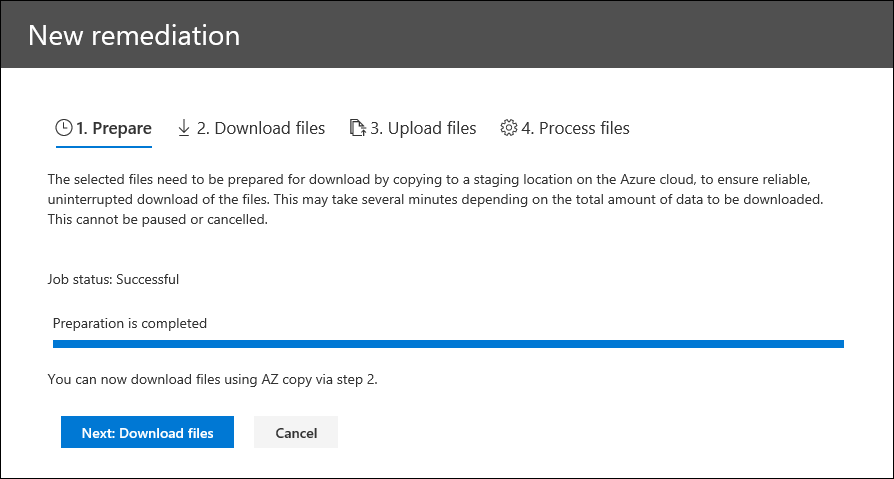

# Correção de erros durante o processamento de dados

A correção de erros permite que os administradores de Descoberta eDiscovery retificarem problemas de dados que impedem que a Descoberta Avançada processe corretamente o conteúdo. Por exemplo, os arquivos protegidos por senha não podem ser processados, pois os arquivos estão bloqueados ou criptografados. Usando a correção de erros, os administradores de Descobertas Digitais podem baixar arquivos com esses erros, remover a proteção por senha e carregar os arquivos remediados.

Use o fluxo de trabalho a seguir para corrigir arquivos com erros em casos de Descoberta Eletrônico Avançada.

## Criar uma sessão de correção de erros para corrigir arquivos com erros de processamento

>[!NOTE]
>Se o assistente de correção de erros estiver fechado a qualquer momento durante o procedimento a seguir,  você poderá  retornar à sessão de correção de erros na guia Processamento selecionando Correções no menu suspenso Exibir. 

1. Na  guia Processamento, no caso descobertas **avançadas,** selecione  Erros no menu suspenso Exibir e selecione um  conjunto de revisão ou todo o caso no menu suspenso escopo. Esta seção exibe todos os erros do caso ou do erro de um conjunto de revisão específico.

   

2. Selecione os erros que você deseja corrigir clicando no botão de opção ao lado do tipo de erro ou do tipo de arquivo.  No exemplo a seguir, estamos remediando um arquivo protegido por senha.

3. Clique **em Nova correção de erro.**

    O fluxo de trabalho de correção de erros começa com um estágio de preparação em que os arquivos com erros são copiados para um local de Armazenamento do Azure fornecido pela Microsoft para que você possa baixá-los no computador local para corrigir.

    

4. Após a conclusão da preparação, clique em **Avançar: Baixar arquivos** para prosseguir com o download.

    

5. Para baixar arquivos, especifique o **caminho de destino para download.** Este é um caminho para a pasta pai no computador local onde o arquivo será baixado.  O caminho padrão, %USERPROFILE%\Downloads\errors, aponta para a pasta de downloads do usuário conectado. Você pode alterar esse caminho, se desejado. Se você alterá-lo, recomendamos usar um caminho de arquivo local para melhorar o desempenho. Não use um caminho de rede remoto. Por exemplo, você poderia usar o **caminho C:\Correção.** 

   O caminho para a pasta pai é adicionado automaticamente ao comando AzCopy (como o valor do **parâmetro /Dest).**

6. Copie o comando predefinido clicando em **Copiar para a área de transferência.** Abra um Prompt de Comando do Windows, cole o comando AzCopy e pressione **Enter**.  

        

    > [!NOTE]
    > Você deve usar o AzCopy v8.1 para usar com êxito o comando fornecido na página **Baixar arquivos.** Você também deve usar o AzCopy v8.1 para carregar os arquivos na etapa 10. Para instalar esta versão do AzCopy, consulte [Transferir dados com o AzCopy v8.1 no Windows.](https://docs.microsoft.com/previous-versions/azure/storage/storage-use-azcopy) Se o comando AzCopy fornecido falhar, consulte [Solucionar problemas do AzCopy na Descoberta Eletrônica Avançada.](troubleshooting-azcopy.md)

    Os arquivos selecionados são baixados para o local especificado na etapa 5. Na pasta pai (por exemplo, **C:\Correção),** a seguinte estrutura de subpasta é criada automaticamente:

    `<Parent folder>\Subfolder 1\Subfolder 2\<file>`

    - *A subpasta 1* é nomeada com a ID do caso ou do conjunto de revisão, dependendo do escopo selecionado na etapa 1.

    - *A Subpasta 2* é nomeada com a ID do arquivo baixado

    - O arquivo baixado está localizado na *Subpasta 2* e também é nomeado com a ID do arquivo.

    Aqui está um exemplo do caminho da pasta e do nome do arquivo de erro criado quando os itens são baixados para a pasta **pai C:\Remediation:**

    `C:\Remediation\232f8b7e-089c-4781-88c6-210da0615d32\d1459499146268a096ea20202cd029857d64087706e6d6ca2a224970ae3b8938\d1459499146268a096ea20202cd029857d64087706e6d6ca2a224970ae3b8938.docx`

    Se vários arquivos são baixados, cada um deles é baixado para uma subpasta nomeada com a ID do arquivo.

    > [!IMPORTANT]
    > Quando você carrega arquivos nas etapas 9 e 10, os arquivos remediados devem ter o mesmo nome de arquivo e estar localizados na mesma estrutura de subpastas. Os nomes de subpasta e arquivo são usados para associar o arquivo remediado ao arquivo de erro original. Se a estrutura de pastas ou os nomes de arquivo são alterados, você receberá o seguinte erro: `Cannot apply Error Remediation to the current Workingset` . Para evitar problemas, recomendamos manter os arquivos remediados na mesma pasta pai e estrutura de subpastas.

7. Depois de baixar os arquivos, você pode remedia-los com uma ferramenta apropriada. Para arquivos protegidos por senha, há várias ferramentas de quebra de senha que você pode usar. Se você conhece as senhas dos arquivos, pode abri-los e remover a proteção por senha.

8. Retorne à Descoberta Avançada e ao assistente de correção de erros e clique em **Avançar: Carregar arquivos.**  Isso move para a próxima página onde agora você pode carregar os arquivos.

    

9. Especifique a pasta pai onde os arquivos corrigidos estão localizados na caixa **caminho para o local do texto dos** arquivos. Novamente, a pasta pai deve ter a mesma estrutura de subpasta que foi criada quando você baixou os arquivos.

    O caminho para a pasta pai é adicionado automaticamente ao comando AzCopy (como o valor do **parâmetro /Source).**

10. Copie o comando predefinido clicando em **Copiar para a área de transferência.** Abra um Prompt de Comando do Windows, cole o comando AzCopy e pressione **Enter**. carregar os arquivos.

    

11. Depois de executar o comando AzCopy, clique em **Próximo: Processar arquivos.**

    Quando o processamento estiver concluído, você poderá ir para o conjunto de revisão e exibir os arquivos remediados. 

## Corrigir erros em arquivos de contêiner

Em situações em que o conteúdo de um arquivo de contêiner (como um arquivo .zip) não pode ser extraído pela Descoberta Avançada, os contêineres podem ser baixados e o conteúdo expandido para a mesma pasta na qual o contêiner original reside. Os arquivos expandidos serão atribuídos ao contêiner pai como se tivesse sido originalmente expandido pela Descoberta Avançada. O processo funciona conforme descrito acima, exceto para carregar um único arquivo como o arquivo de substituição.  Ao carregar arquivos remediados, não inclua o arquivo de contêiner original.

## Corrigir erros carregando o texto extraído

Às vezes, não é possível remediar um arquivo para o formato nativo que a Descoberta Avançada pode interpretar. Mas você pode substituir o arquivo original por um arquivo de texto que contenha o texto original do arquivo nativo (em um processo chamado sobreposição *de texto).* Para fazer isso, siga as etapas descritas neste artigo, mas em vez de remediar o arquivo original no formato nativo, crie um arquivo de texto que contenha o texto extraído do arquivo original e carregue o arquivo de texto usando o nome de arquivo original anexado com um sufixo .txt. Por exemplo, você baixa um arquivo durante a correção de erro com o nome de arquivo 335850cc-6602-4af0-acfa-1d14d9128ca2.abc. Você abre o arquivo no aplicativo nativo, copia o texto e, em seguida, o colar em um novo arquivo chamado 335850cc-6602-4af0-acfa-1d14d9128ca2.abc.txt. Ao fazer isso, remova o arquivo original no formato nativo do local do arquivo corrigido no computador local antes de carregar o arquivo de texto corrigido para a Descoberta Avançada.

## O que acontece quando os arquivos são remediados

Quando os arquivos remediados são carregados, os metadados originais são preservados, exceto para os seguintes campos: 

- ExtractedTextSize
- HasText
- IsErrorRemediate
- LoadId
- ProcessingErrorMessage
- ProcessingStatus
- Texto
- WordCount
- WorkingsetId

Para uma definição de todos os campos de metadados na Descoberta Avançada, consulte [Campos de metadados do documento.](document-metadata-fields-in-advanced-ediscovery.md)
