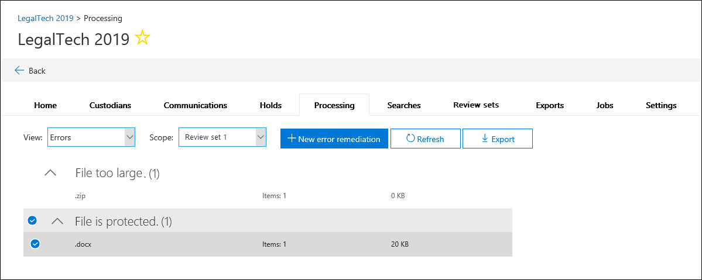

# Correção de erros durante o processamento de dadosError remediation when processing data

A correção de erros permite que os administradores de descoberta eletrônica corrijam problemas de dados que impedem a descoberta eletrônica avançada do processamento adequado do conteúdo.Error remediation allows eDiscovery administrators the ability to rectify data issues that prevent Advanced eDiscovery from properly processing the content. Por exemplo, os arquivos protegidos por senha não podem ser processados, já que os arquivos são bloqueados ou criptografados.For example, files that are password protected can't be processed since the files are locked or encrypted. Usando a correção de erros, os administradores de descoberta eletrônica podem baixar arquivos com esses erros, remover a proteção por senha e carregar os arquivos corrigidos.Using error remediation, eDiscovery administrators can download files with such errors, remove the password protection, and then upload the remediated files.

Use o fluxo de trabalho a seguir para corrigir arquivos com erros em casos de descoberta eletrônica avançada.Use the following workflow to remediate files with errors in Advanced eDiscovery cases.

## Criar uma sessão de correção de erro para corrigir arquivos com erros de processamentoCreate an error remediation session to remediate files with processing errors

>[!NOTE]
>Se o assistente de correção de erros for fechado a qualquer momento durante o procedimento a seguir, você poderá retornar à sessão de correção de erro na guia **processamento** selecionando as **correções** no menu suspenso **Exibir** .If the the error remediation wizard is closed at any time during the following procedure, you can return to the error remediation session from the **Processing** tab by selecting **Remediations** in the **View** drop-down menu.

1. Na guia **processamento** da caixa de descoberta eletrônica avançada, selecione **erros** no menu suspenso **Exibir** e, em seguida, selecione um conjunto de revisão ou o caso inteiro no menu suspenso **escopo** .On the **Processing** tab in the Advanced eDiscovery case, select **Errors** in the **View** drop-down menu and then select a review set or the entire case in the **Scope** drop-down menu. Esta seção exibe todos os erros do caso ou erro de um conjunto de revisão específico.This section displays all errors from the case or error from a specific review set.

   

2. Selecione os erros que você deseja corrigir clicando no botão de opção ao lado do tipo de erro ou tipo de arquivo.Select the errors you want to remediate by clicking the radio button next to either the error type or file type.  No exemplo a seguir, estamos corrigindo um arquivo protegido por senha.In the following example, we're remediating a password protected file.

3. Clique em **nova correção de erro**.Click **New error remediation**.

    O fluxo de trabalho de correção de erro é iniciado com um estágio de preparação em que os arquivos com erros são copiados para um local de armazenamento do Azure fornecido pela Microsoft para que você possa baixá-los para o computador local para correção.The error remediation workflow starts with a preparation stage where the files with errors are copied to a Microsoft-provided Azure Storage location so that you can download them to your local computer to remediate.

    

4. Após a conclusão da preparação, clique em **Avançar: baixar arquivos** para continuar com o download.After the preparation is complete, click **Next: Download files** to proceed with download.

    

5. Para baixar arquivos, especifique o **caminho de destino para download**.To download files, specify the **Destination path for download**. Este é o caminho para a pasta pai no computador local em que o arquivo será baixado.This is a path to the parent folder on your local computer where the file will be downloaded.  O caminho padrão,%USERPROFILE%\Downloads\errors, aponta para a pasta downloads do usuário conectado.The default path, %USERPROFILE%\Downloads\errors, points to the logged-in user's downloads folder. Você pode alterar esse caminho, se desejado.You can change this path if desired. Se você alterar, recomendamos que você use um caminho de arquivo local para o melhor desempenho.If you do change it, we recommend that you use a local file path for the best performance. Não use um caminho de rede remoto.Don't use a remote network path. Por exemplo, você poderia usar o caminho **C:\Remediation**.For example, you could use the path **C:\Remediation**. 

   O caminho para a pasta pai é automaticamente adicionado ao comando AzCopy (como o valor do parâmetro **/dest** ).The path to the parent folder is automatically added to AzCopy command (as the value of the **/Dest** parameter).

6. Copie o comando predefinido clicando em **copiar para área de transferência**.Copy the predefined command by clicking **Copy to clipboard**. Abra um prompt de comando do Windows, Cole o comando AzCopy e pressione **Enter**.Open a Windows Command Prompt, paste the AzCopy command, and then press **Enter**.  

        

    > [!NOTE]
    > Você deve usar o AzCopy v 8.1 para usar com êxito o comando fornecido na página **baixar arquivos** .You must use AzCopy v8.1 to successfully use the command that's provided on the **Download files** page. Você também deve usar o AzCopy v 8.1 para carregar os arquivos na etapa 10.You also must use AzCopy v8.1 to upload the files in step 10. Para instalar esta versão do AzCopy, confira [transferir dados com o AzCopy v 8.1 no Windows](https://docs.microsoft.com/previous-versions/azure/storage/storage-use-azcopy).To install this version of AzCopy, see [Transfer data with the AzCopy v8.1 on Windows](https://docs.microsoft.com/previous-versions/azure/storage/storage-use-azcopy). Se o comando AzCopy fornecido falhar, confira [solucionar problemas de AzCopy na descoberta eletrônica avançada](troubleshooting-azcopy.md).If the supplied AzCopy command fails, please see [Troubleshoot AzCopy in Advanced eDiscovery](troubleshooting-azcopy.md).

    Os arquivos que você selecionou são baixados para o local que você especificou na etapa 5.The files that you selected are downloaded to the location that you specified in step 5. Na pasta pai (por exemplo, **C:\Remediation**), a seguinte estrutura de subpastas é criada automaticamente:In the parent folder (for example, **C:\Remediation**), the following subfolder structure is automatically created:

    `<Parent folder>\Subfolder 1\Subfolder 2\<file>`

    - A *subpasta 1* é nomeada com a ID do caso ou do conjunto de revisão, dependendo do escopo selecionado na etapa 1.*Subfolder 1* is named with the ID for the case or the review set, depending on the scope that you selected in step 1.

    - A *subpasta 2* é nomeada com a ID de arquivo do arquivo baixado*Subfolder 2* is named with the file ID of the downloaded file

    - O arquivo baixado está localizado na *subpasta 2* e também é chamado de ID de arquivo.The downloaded file is located in *Subfolder 2* and is also named with the file ID.

    Veja um exemplo do caminho da pasta e o nome do arquivo de erro que é criado quando os itens são baixados para a pasta pai **C:\Remediation** :Here's an example of the folder path and error file name that's created when items are downloaded to the **C:\Remediation** parent folder:

    `C:\Remediation\232f8b7e-089c-4781-88c6-210da0615d32\d1459499146268a096ea20202cd029857d64087706e6d6ca2a224970ae3b8938\d1459499146268a096ea20202cd029857d64087706e6d6ca2a224970ae3b8938.docx`

    Se vários arquivos forem baixados, cada um é baixado para uma subpasta nomeada com a ID de arquivo.If multiple files are downloaded, each one is downloaded to a subfolder that's named with the file ID.

    > [!IMPORTANT]
    > Ao carregar arquivos na etapa 9 e na etapa 10, os arquivos corrigidos devem ter o mesmo nome de arquivo e estar localizados na mesma estrutura de subpastas.When you upload files in step 9 and step 10, the remediated files must have that same filename and be located in the same subfolder structure. Os nomes de subpasta e de arquivo são usados para associar o arquivo corrigido ao arquivo de erro original.The subfolder and file names are used to associated the remediated file with the original error file. Se a estrutura de pastas ou os nomes de arquivo forem alterados, você receberá o `Cannot apply Error Remediation to the current Workingset`seguinte erro:.If the folder structure or file names are changed, you'll receive the following error: `Cannot apply Error Remediation to the current Workingset`. Para evitar problemas, recomendamos que você mantenha os arquivos corrigidos na mesma estrutura de pastas e subpastas pai.To prevent any issues, we recommend that keep the remediated files in the same parent folder and subfolder structure.

7. Depois de baixar os arquivos, você pode corrigi-los com uma ferramenta apropriada.After downloading the files, you can remediate them with an appropriate tool. Para arquivos protegidos por senha, há várias ferramentas de quebra de senha que você pode usar.For password-protected files, there are several password cracking tools you can use. Se você souber as senhas dos arquivos, poderá abri-las e remover a proteção por senha.If you know the passwords for the files, you can open them and remove the password protection.

8. Retorne à descoberta eletrônica avançada e o assistente de correção de erros e clique em **Avançar: carregar arquivos**.Return to Advanced eDiscovery and the error remediation wizard and then click **Next: Upload files**.  Isso é movido para a próxima página onde você pode carregar os arquivos.This moves to the next page where you can now upload the files.

    

9. Especifique a pasta pai onde os arquivos corrigidos estão localizados na caixa de texto **caminho para o local de arquivos** .Specify the parent folder where the remediated files are located in the **Path to location of files** text box. Novamente, a pasta pai deve ter a mesma estrutura de subpasta que foi criada quando você baixou os arquivos.Again, the parent folder must have the same subfolder structure that was created when you downloaded the files.

    O caminho para a pasta pai é automaticamente adicionado ao comando AzCopy (como o valor do parâmetro **/Source** ).The path to the parent folder is automatically added to AzCopy command (as the value of the **/Source** parameter).

10. Copie o comando predefinido clicando em **copiar para área de transferência**.Copy the predefined command by clicking **Copy to clipboard**. Abra um prompt de comando do Windows, Cole o comando AzCopy e pressione **Enter**.Open a Windows Command Prompt, paste the AzCopy command, and then press **Enter**. carregar os arquivos.upload the files.

    

11. Depois de executar o comando AzCopy, clique em **Avançar: processar arquivos**.After you run the AzCopy command, click **Next: Process files**.

    Quando o processamento estiver concluído, você poderá ir para a revisão definir e exibir os arquivos corrigidos.When processing is complete, you can go to review set and view the remediated files. 

## Correção de erros em arquivos de contêinerRemediating errors in container files

Em situações em que o conteúdo de um arquivo de contêiner (como um arquivo. zip) não pode ser extraído por uma descoberta eletrônica avançada, os contêineres podem ser baixados e o conteúdo expandido na mesma pasta em que reside o contêiner original.In situations when the contents of a container file (such as a .zip file) can't be extracted by Advanced eDiscovery, the containers can be downloaded and the contents expanded into the same folder in which the original container resides. Os arquivos expandidos serão atribuídos ao contêiner pai como se ele estivesse originalmente expandido por descoberta eletrônica avançada.The expanded files will be attributed to the parent container as if it was originally expanded by Advanced eDiscovery. O processo funciona conforme descrito acima, exceto para carregar um único arquivo como o arquivo de substituição.The process works as described as above except for uploading a single file as the replacement file.  Quando você carregar arquivos corrigidos, não inclua o arquivo de contêiner original.When you upload remediated files, don't include the original container file.

## Corrigir erros carregando o texto extraídoRemediating errors by uploading the extracted text

Às vezes, não é possível corrigir um arquivo em um formato nativo que possa interpretar a descoberta eletrônica avançada.Sometimes it's not possible to remediate a file to native format that Advanced eDiscovery can interpret. Mas você pode substituir o arquivo original por um arquivo de texto que contém o texto original do arquivo nativo (em um processo chamado *sobreposição de texto*).But you can replace the original file with a text file that contains the original text of the native file (in a process called *text overlay*). Para fazer isso, siga as etapas descritas neste artigo, mas em vez de corrigir o arquivo original no formato nativo, crie um arquivo de texto que contenha o texto extraído do arquivo original e, em seguida, carregue o arquivo de texto usando o nome de arquivo original anexado a um sufixo. txt.To do this, follow the steps described in this article but instead of remediating the original file in the native format, you would create a text file that contains the extracted text from the original file, and then upload the text file using the original filename appended with a .txt suffix. Por exemplo, você baixa um arquivo durante a correção de erros com o nome de arquivo 335850cc-6602-4af0-acfa-1d14d9128ca2. ABC.For example, you download a file during error remediation with the filename 335850cc-6602-4af0-acfa-1d14d9128ca2.abc. Abra o arquivo no aplicativo nativo, copie o texto e cole-o em um novo arquivo chamado 335850cc-6602-4af0-acfa-1d14d9128ca2. ABC. txt.You open the file in the native application, copy the text, and then paste it into a new file named 335850cc-6602-4af0-acfa-1d14d9128ca2.abc.txt. Ao fazer isso, certifique-se de remover o arquivo original no formato nativo do local do arquivo corrigido no computador local antes de carregar o arquivo de texto corrigido para descoberta eletrônica avançada.When you do this, be sure to remove the original file in the native format from the remediated file location on your local computer before uploading the remediated text file to Advanced eDiscovery.

## O que acontece quando os arquivos são corrigidosWhat happens when files are remediated

Quando os arquivos corrigidos são carregados, os metadados originais são preservados, exceto os seguintes campos:When remediated files are uploaded, the original metadata is preserved except for the following fields: 

- ExtractedTextSizeExtractedTextSize
- HasTextHasText
- IsErrorRemediateIsErrorRemediate
- LoadidLoadId
- ProcessingErrorMessageProcessingErrorMessage
- ProcessingStatusProcessingStatus
- TextoText
- WordCountWordCount
- WorkingsetIdWorkingsetId

Para obter uma definição de todos os campos de metadados na descoberta eletrônica avançada, confira [campos de metadados do documento](document-metadata-fields.md).For a definition of all metadata fields in Advanced eDiscovery, see [Document metadata fields](document-metadata-fields.md).
