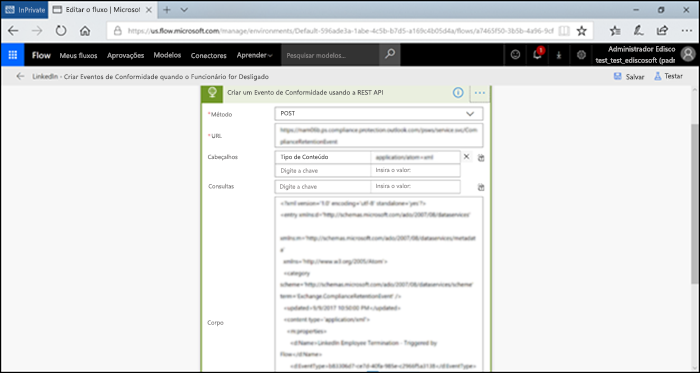

# <a name="start-retention-when-an-event-occurs"></a>Iniciar a retenção quando um evento ocorrer

>*[Diretrizes de licenciamento do Microsoft 365 para segurança e conformidade](https://aka.ms/ComplianceSD).*

Quando você retém o conteúdo, o período de retenção normalmente é baseado na idade desse conteúdo. Por exemplo, você pode reter documentos por sete anos após terem sido criados e excluí-los após esse prazo. Porém, se você configurar os [rótulos de retenção](retention.md#retention-labels), poderá também basear um período de retenção no momento em que um tipo específico de evento ocorre. O evento desencadeia o início do período de retenção e as ações de retenção do rótulo passam a ser aplicadas a todo o conteúdo que tiver esse rótulo de retenção.
  
Exemplos de uso da retenção baseada por eventos:
  
- **Funcionários que estão saindo da organização** Suponha que os registros de funcionários devam ser retidos por 10 anos após a data em que o funcionário saiu da organização. Decorrido o prazo de 10 anos, todos os documentos relacionados à contratação, desempenho e demissão desse funcionário precisam ser descartados. O evento que desencadeia o período de retenção de 10 anos é a saída do funcionário da organização. 
    
- **Vencimento de um contrato** Suponha que todos os registros relativos a contratos devam ser retidos por 10 anos após a data de vencimento do contrato. O evento que desencadeia o período de retenção de cinco anos é o vencimento do contrato. 
    
- **Vida útil do produto** Talvez sua organização tenha exigências de retenção relacionadas à última data de produção de produtos para determinados conteúdos, como especificações técnicas. Nesse caso, a última data de produção é o evento que dispara o período de retenção. 
    
A retenção baseada em eventos geralmente é usada como parte de um processo de gerenciamento de registros. Isso significa que:
  
- Os rótulos com base em eventos geralmente classificam o conteúdo como um registro, como parte de uma solução de gerenciamento de registros. Para obter mais informações, confira o artigo [Saiba mais sobre registros](records-management.md).

- Um documento declarado como um registro, mas cujo gatilho de evento ainda não aconteceu, é retido indefinidamente (registros não podem ser excluídos permanentemente), até que um evento dispare o período de retenção desse documento.
    
- Os rótulos de retenção baseados em eventos costumam desencadear uma análise de descarte no final do período de retenção, de modo que um gerente de registros possa analisar e descartar o conteúdo manualmente. Para obter mais informações, confira o artigo [Disposição e descarte de conteúdo](disposition.md).
    

Os recursos dos rótulos de retenção baseados em um evento são os mesmos que os de quaisquer outros rótulos de retenção do Microsoft 365. Para obter mais informações, consulte [saiba mais sobre políticas e rótulos de retenção](retention.md).

## <a name="understanding-the-relationship-between-event-types-labels-events-and-asset-ids"></a>Compreender a relação entre tipos de eventos, rótulos, eventos e IDs de ativos

Para usar a retenção controlada por eventos com êxito, é importante compreender a relação entre tipos de evento, rótulos de retenção, eventos e IDs de ativo, conforme ilustrado nos diagramas e explicações a seguir: 
  

  

  
1. Você cria rótulos de retenção para diferentes tipos de conteúdo e depois os associa a um tipo de evento. Por exemplo, os rótulos de retenção para diferentes tipos de arquivos e registros de produtos são associados a um tipo de evento denominado Vida útil do produto, pois esses registros devem ser retidos por 10 anos a partir do momento em que o produto atinge o final de sua vida útil.
    
2. Os usuários (normalmente gerenciadores de registros) aplicam esses rótulos de retenção ao conteúdo e (para documentos do SharePoint e OneDrive) inserem uma ID de ativo para cada item. Nesse exemplo, a ID do ativo é um nome ou código de produto usado pela organização. Assim, os registros de cada produto recebem um rótulo de retenção e cada registro tem uma propriedade que contém uma ID de ativo. O diagrama representa **todo o conteúdo** de todos os registros de produtos em uma organização e cada item tem a ID do ativo do produto cujo registro ele pertence. 
    
3. A Vida Útil do Produto é o tipo de evento; um produto específico chegando ao fim de sua vida útil é um evento. Quando ocorre um evento desse tipo — nesse caso, quando um produto chega ao final de sua vida útil —, você cria um evento que especifica o seguinte:
    
   - Uma ID de ativo (para documentos do SharePoint e do OneDrive)
    
   - Palavras-chave (para itens do Exchange). Neste exemplo, a organização usa um código de produto em mensagens que contêm registros de produto, assim, a palavra-chave para itens do Exchange é igual à ID de ativos de documentos do SharePoint e do OneDrive.
    
   - A data de ocorrência do evento. Essa data é utilizada como o início do período de retenção. Essa data pode ser a atual, do passado ou futura.

4. Depois de criar um evento, a data dele é sincronizada com todo o conteúdo que tem um rótulo desse tipo de evento e que contém a ID ou palavra-chave especificada do ativo. Como ocorre com qualquer rótulo de retenção, essa sincronização poderá demorar até sete dias. No diagrama anterior, todos os itens marcados com um círculo vermelho têm o período de retenção desencadeado por esse evento. Em outras palavras, quando esse produto chega ao fim da vida útil, esse evento ativa o período de retenção dos registros desse produto.

É importante entender que, se você não especificar uma ID de ativo ou palavras-chave para um evento, **todo o conteúdo** com um rótulo de retenção desse tipo de evento terá um período de retenção ativado pelo evento. Isso significa que, no diagrama anterior, todo o conteúdo começaria a ser retido. Isso pode não ser o que você pretende.

Por fim, lembre-se de que cada rótulo de retenção tem suas próprias configurações de retenção. Neste exemplo, todos eles especificam dez anos, mas é possível que um evento ative rótulos de retenção onde cada rótulo tem um período de retenção diferente.
  
## <a name="how-to-set-up-event-driven-retention"></a>Como configurar a retenção controlada por eventos

Aqui está o fluxo de trabalho de alto nível para a retenção controlada por eventos:
  

  
> [!TIP]
> Confira [Usar rótulos de retenção para gerenciar o ciclo de vida de documentos armazenados no SharePoint](auto-apply-retention-labels-scenario.md) para um cenário detalhado sobre como usar as propriedades gerenciadas no SharePoint para aplicar automaticamente os rótulos de retenção e implementar a retenção voltada para o evento.

### <a name="step-1-create-a-label-whose-retention-period-is-based-on-an-event"></a>Etapa 1: criar um rótulo cujo período de retenção seja baseado em um evento

Para criar e configurar seu rótulo de retenção, use as instruções de [Criar e configurar os rótulos de retenção](create-retention-labels.md#create-and-configure-retention-labels). Mas especificamente para a retenção baseada em eventos, na página **Definir as configurações de retenção** do assistente Criar etiqueta de retenção, depois de **Iniciar o período de retenção com base em**, selecione um dos tipos de eventos padrão na lista suspensa ou crie o seu próprio selecionando **Criar novo tipo de evento**:


Um tipo de evento é uma descrição geral de um evento que você quer associar a um rótulo.

Os tipos de evento padrão têm o **(tipo de evento)** depois do nome na lista suspensa, para facilitar a identificação, além disso, você também pode ver e criar o tipo de evento na aba **Gerenciamento de registros** > **Eventos** > **Gerenciar tipos de eventos**.

A retenção impulsionada por eventos requer configurações de retenção que:
  
- Retêm o conteúdo.
    
- Excluem o conteúdo automaticamente, ou acionam uma revisão de disposição ao final do período de retenção.
  
A retenção baseada em eventos geralmente é usada para o conteúdo declarado como um registro, portanto, esse é um bom momento para verificar se você também precisa selecionar a opção que marca o conteúdo como um [registro](records-management.md#records).

Se você estiver usando um tipo de evento existente, em vez de criar um novo tipo de evento, vá para a etapa 3.

> [!NOTE]
> Após escolher um tipo de evento e salvar o rótulo de retenção, o tipo de evento não poderá mais ser alterado.

### <a name="step-2-create-a-new-event-type-for-your-label"></a>Etapa 2: Criar um novo tipo de evento para um rótulo de retenção

Para as configurações de retenção, se você tiver selecionado **Criar novo tipo de evento**, insira um nome e uma descrição para o seu tipo de evento. Em seguida, selecione **Próximo**, **Enviar**, e **Concluído**.

De volta à página **Definir configurações de retenção**, para **Iniciar o período de retenção com base em**, use a lista suspensa para selecionar o tipo de evento que você criou.

  
### <a name="step-3-publish-or-auto-apply-the-event-based-retention-labels"></a>Etapa 3: publicar ou aplicar automaticamente os rótulos de retenção com base em eventos

Assim como qualquer rótulo, você precisa publicar ou aplicar automaticamente um rótulo com base em eventos, para que ele seja aplicado manual ou automaticamente ao conteúdo:
- [Criar rótulos de retenção e aplicá-los em aplicativos](create-apply-retention-labels.md)
- [Aplicar um rótulo de retenção automaticamente ao conteúdo](apply-retention-labels-automatically.md)

### <a name="step-4-enter-an-asset-id"></a>Etapa 4: Inserir uma ID de ativo

Depois que um rótulo baseado em eventos é aplicado ao conteúdo, você pode inserir uma ID de ativos para cada item. Por exemplo, sua organização pode usar:
  
- Códigos de produto que você pode usar para reter o conteúdo apenas de um produto específico.
    
- Códigos de projeto que você pode usar para reter o conteúdo apenas de um projeto específico.
    
- IDs de funcionário que você pode usar para reter o conteúdo apenas de uma pessoa específica.
    
A ID de Ativo é, simplesmente, mais uma propriedade do documento que está disponível no SharePoint e no OneDrive. Sua organização já pode usar outras propriedades e IDs do documento para classificar o conteúdo. Nesse caso, você também pode usar essas propriedades e valores ao criar um evento — consulte a Etapa 6 a seguir. O ponto importante é que você deve usar alguma combinação de *propriedade:valor* nas propriedades do documento para associar esse item a um tipo de evento.
  

  
### <a name="step-5-create-an-event"></a>Etapa 5: Criar um evento

Quando uma instância específica desse tipo de evento ocorre — como, por exemplo, o fim da vida útil de um produto — vá para a página **Eventos de gerenciamento** > **de registros** no Centro de conformidade do Microsoft 365 e selecion **+ Criar** para criar um evento. Para acionar o evento, crie-o aqui.


Até 1 milhão eventos têm suporte por locatário.

### <a name="step-6-choose-the-same-event-type-used-by-the-label-in-step-2"></a>Etapa 6: Escolher o mesmo tipo de evento usado pelo rótulo na etapa 2

Ao criar o evento, escolha o mesmo tipo de evento usado pelo rótulo de retenção na Etapa 2. Por exemplo, se você selecionou **Vida útil do produto** como seu tipo de evento para as configurações de rótulo, selecione **Vida útil do produto** quando criar o evento. Somente o conteúdo com os rótulos de retenção aplicados a esse tipo de evento terá o período de retenção ativado.


Como alternativa, se você precisar criar um evento para vários rótulos de retenção com diferentes tipos de evento, marque a opção **Escolher Rótulos Existentes**. Em seguida, selecione os rótulos que estão configurados para os tipos de eventos que você deseja associar a esse evento.

### <a name="step-7-enter-keywords-or-an-asset-id"></a>Etapa 7: Inserir palavras-chave ou IDs de ativo

Agora você restringe o escopo do conteúdo especificando IDs de ativos para o conteúdo do SharePoint e OneDrive ou palavras-chave para o conteúdo do Exchange. Para IDs de ativos, a retenção será aplicada apenas no conteúdo com o par especificado *propriedade:valor*. Se uma ID de ativos não for inserida, todo o conteúdo com rótulos desse tipo de evento obtém a mesma data de retenção aplicada a ele.

Por exemplo: se estiver usando a propriedade ID de ativo, digite `ComplianceAssetID:<value>` na caixa para IDs de ativos mostrada abaixo.
  
Sua organização pode ter aplicado outras propriedades e IDs aos documentos relacionados a esse tipo de evento. Por exemplo, se for preciso detectar os registros de um produto específico, a ID pode ser uma combinação entre sua propriedade personalizada ProductID e o valor "XYZ". Nesse caso, você digitaria `ProductID:XYZ` na caixa para as IDs de Ativos mostradas na imagem a seguir.
  
Para itens do Exchange, use palavras-chave. Você pode usar a consulta usando operadores de pesquisa como E, OU e NÃO. Para saber mais, veja [Consultas de palavra-chave e condições de pesquisa para Pesquisa de Conteúdo](keyword-queries-and-search-conditions.md).
  
Por fim, escolha a data em que o evento ocorreu; essa data é usada como o início do período de retenção. Depois de criar um evento, essa data do evento é sincronizada para todo o conteúdo com um rótulo desse tipo de evento, ID do ativo e palavras-chave. Como ocorre com qualquer rótulo de retenção, essa sincronização poderá demorar até sete dias.
  


Após a criação de um evento, as configurações de retenção entrarão em vigor para o conteúdo que já estiver rotulado e indexado. Se o rótulo de retenção for adicionado a um novo conteúdo após o evento ter sido criado, você precisará criar um novo evento com os mesmos dados.

A exclusão de um evento não cancela as configurações de retenção que já estão em vigor para o conteúdo já rotulado anteriormente. Para este fim, crie um novo evento com os mesmos dados, mas deixe a data em branco. 

## <a name="use-content-search-to-find-all-content-with-a-specific-label-or-asset-id"></a>Usar a Pesquisa de Conteúdo para localizar todo o conteúdo com um rótulo ou ID de ativo específicos

Após a atribuição dos rótulos de retenção ao conteúdo, você pode usar a pesquisa de conteúdo para localizar todo o conteúdo classificado com um rótulo de retenção específico ou que contenha uma ID de ativo específica:
  
- Para localizar todo o conteúdo com um rótulo de retenção específico, escolha a condição **Rótulo de retenção** e, em seguida, digite o nome completo do rótulo ou parte dele e use um caractere curinga. 
    
- Para localizar todo o conteúdo com uma ID de ativo específica, digite a propriedade **ComplianceAssetID** e um valor, usando o formato `ComplianceAssetID:<value>`. 
    
Para saber mais, veja [Consultas de palavra-chave e condições de pesquisa para Pesquisa de Conteúdo](keyword-queries-and-search-conditions.md).

## <a name="automate-events-by-using-powershell"></a>Automatizar eventos usando o PowerShell

É possível usar um script do PowerShell para automatizar a retenção baseada em eventos a partir de aplicativos da sua empresa. Os cmdlets do PowerShell disponíveis para retenção baseada em eventos:
  
- [Get-ComplianceRetentionEventType](https://go.microsoft.com/fwlink/?linkid=873002)
    
- [New-ComplianceRetentionEventType](https://go.microsoft.com/fwlink/?linkid=873004)
    
- [Remove-ComplianceRetentionEventType](https://go.microsoft.com/fwlink/?linkid=873005)
    
- [Set-ComplianceRetentionEventType](https://go.microsoft.com/fwlink/?linkid=873006)
    
- [Get-ComplianceRetentionEvent](https://go.microsoft.com/fwlink/?linkid=873001)
    
- [New-ComplianceRetentionEvent](https://go.microsoft.com/fwlink/?linkid=873003)
    

## <a name="automate-events-by-using-a-rest-api"></a>Automatizar eventos usando uma API REST

É possível usar uma API REST para criar automaticamente os eventos que acionam o início do período de retenção.

Uma API REST é um ponto de extremidade de manutenção que respalda conjuntos de operações (métodos) HTTP que, por seu lado, fornecem acesso para criar/recuperar/atualizar/excluir os recursos de manutenção. Para saber mais, confira o artigo [Componentes de uma solicitação/resposta API REST](https://docs.microsoft.com/rest/api/gettingstarted/#components-of-a-rest-api-requestresponse). Quando você usa uma API REST do Microsoft 365, é possível criar eventos usando os métodos POST e GET.

Existem duas opções para se usar uma API REST:

- O **Microsoft Power Automate ou um aplicativo semelhante** para acionar automaticamente a ocorrência de um evento.  O Microsoft Power Automate é um orquestrador utilizado para a conexão com outros sistemas, então não é necessário escrever uma solução personalizada. Para obter mais informações, consulte o [site do Power Automate](https://flow.microsoft.com/pt-BR/).

- O **PowerShell ou um cliente HTTP para chamar uma API REST** e criar eventos usando o PowerShell (versão 6 ou superior), que faz parte de uma solução personalizada.

Antes de usar a API REST como um administrador global, confirme o URL que deverá ser usado para chamar o evento de retenção. Para este fim, execute uma chamada de evento de retenção GET usando o URL da API REST: 

```console
https://ps.compliance.protection.outlook.com/psws/service.svc/ComplianceRetentionEvent
```

Verifique o código de resposta. Se for 302, obtenha o URL redirecionado a partir da propriedade Localização no cabeçalho da resposta e use esse URL ao invés de `https://ps.compliance.protection.outlook.com/psws/service.svc/ComplianceRetentionEvent` nas instruções que se seguem.

Os eventos que são criados automaticamente podem ser confirmados ao serem visualizados no Centro de Conformidade do Microsoft 365 > **Gerenciamento de registros** >  **Eventos**.

### <a name="use-microsoft-power-automate-to-create-the-event"></a>Usar o Microsoft Power Automate para criar um evento

Criar um fluxo que cria um evento usando uma API REST do Microsoft 365:




#### <a name="create-an-event"></a>Criar um evento

Exemplo de código para chamar a API REST:

- **Método**: POSTAR
- **URL**: `https://ps.compliance.protection.outlook.com/psws/service.svc/ComplianceRetentionEvent`
- **Cabeçalhos**: Chave = content-type, valor = application/atom+xml
- **Corpo**:
    
    ```xml
    <?xml version='1.0' encoding='utf-8' standalone='yes'?>
    
    <entry xmlns:d='http://schemas.microsoft.com/ado/2007/08/dataservices'
    
    xmlns:m='http://schemas.microsoft.com/ado/2007/08/dataservices/metadata'
    
    xmlns='http://www.w3.org/2005/Atom'>
    
    <category scheme='http://schemas.microsoft.com/ado/2007/08/dataservices/scheme' term='Exchange.ComplianceRetentionEvent' />
    
    <updated>9/9/2017 10:50:00 PM</updated>
    
    <content type='application/xml'>
    
    <m:properties>
    
    <d:Name>Employee Termination </d:Name>
    
    <d:EventType>99e0ae64-a4b8-40bb-82ed-645895610f56</d:EventType>
    
    <d:SharePointAssetIdQuery>1234</d:SharePointAssetIdQuery>
    
    <d:EventDateTime>2018-12-01T00:00:00Z </d:EventDateTime>
    
    </m:properties>
    
    </content>
    
    </entry>
    ```
    
- **Autenticação**: Básica
- **Nome de usuário**: "Complianceuser"
- **Senha**: "Senhadeconformidade"


##### <a name="available-parameters"></a>Parâmetros disponíveis


|Parâmetros|Descrição|Observações|
|--- |--- |--- |
|<d:Name></d:Name>|Fornece um nome exclusivo para o evento,|Não pode conter espaços à direita nem os seguintes caracteres: % * \ & < \> \| # ? , : ;|
|<d:EventType></d:EventType>|Insere o nome do tipo de evento (ou GUID).|Exemplo: “Demissão de um funcionário”. O tipo de evento precisa estar associado a um rótulo de retenção.|
|<d:SharePointAssetIdQuery></d:SharePointAssetIdQuery>|Insere "ComplianceAssetId:" + a ID do funcionário|Example: "ComplianceAssetId:12345"|
|<d:EventDateTime></d:EventDateTime>|Data e hora do evento|Formato: yyyy-MM-ddTHH:mm:ssZ. Exemplo: 2018-12-01T00:00:00Z
|

###### <a name="response-codes"></a>Códigos de resposta

| Código da resposta | Descrição       |
| ----------------- | --------------------- |
| 302               | Redirecionamento              |
| 201               | Criado em               |
| 403               | Falha na autorização  |
| 401               | Falha na autenticação |

##### <a name="get-events-based-on-a-time-range"></a>Obter eventos com base em um intervalo de tempo

- **Método**: GET

- **URL**: `https://ps.compliance.protection.outlook.com/psws/service.svc/ComplianceRetentionEvent?BeginDateTime=2019-01-11&EndDateTime=2019-01-16`

- **Cabeçalhos**: Chave = content-type, valor = application/atom+xml

- **Autenticação**: Básica

- **Nome de usuário**: "Complianceuser"

- **Senha**: "Senhadeconformidade"


###### <a name="response-codes"></a>Códigos de resposta

| Código da resposta | Descrição                   |
| ----------------- | --------------------------------- |
| 200               | OK. Uma lista de eventos em atom+xml |
| 404               | Não encontrado                         |
| 302               | Redirecionamento                          |
| 401               | Falha na autorização              |
| 403               | Falha na autenticação             |

##### <a name="get-an-event-by-id"></a>Obter um evento por ID

- **Método**: GET

- **URL**: `https://ps.compliance.protection.outlook.com/psws/service.svc/ComplianceRetentionEvent('174e9a86-74ff-4450-8666-7c11f7730f66')`

- **Cabeçalhos**: Chave = content-type, valor = application/atom+xml

- **Autenticação**: Básica

- **Nome de usuário**: "Complianceuser"

- **Senha**: "Senhadeconformidade"

###### <a name="response-codes"></a>Códigos de resposta

| Código da resposta | Descrição                                      |
| ----------------- | ---------------------------------------------------- |
| 200               | OK. O corpo da resposta contém o evento em atom+xml. |
| 404               | Não encontrado                                            |
| 302               | Redirecionamento                                             |
| 401               | Falha na autorização                                 |
| 403               | Falha na autenticação                                |

##### <a name="get-an-event-by-name"></a>Obter um evento por nome

- **Método**: GET

- **URL**: `https://ps.compliance.protection.outlook.com/psws/service.svc/ComplianceRetentionEvent`

- **Cabeçalhos**: Chave = content-type, valor = application/atom+xml

- **Autenticação**: Básica

- **Nome de usuário**: "Complianceuser"

- **Senha**: "Senhadeconformidade"


###### <a name="response-codes"></a>Códigos de resposta

| Código da resposta | Descrição                                      |
| ----------------- | ---------------------------------------------------- |
| 200               | OK. O corpo da resposta contém o evento em atom+xml. |
| 404               | Não encontrado                                            |
| 302               | Redirecionamento                                             |
| 401               | Falha na autorização                                 |
| 403               | Falha na autenticação                                |

### <a name="use-powershell-or-any-http-client-to-create-the-event"></a>Usar o PowerShell ou qualquer cliente HTTP para criar o evento

O PowerShell precisa estar na versão 6 ou superior.

Em uma sessão do PowerShell, execute o seguinte comando:

```powershell
param([string]$baseUri)

$userName = "UserName"

$password = "Password"

$securePassword = ConvertTo-SecureString $password -AsPlainText -Force

$credentials = New-Object System.Management.Automation.PSCredential($userName, $securePassword)

$EventName="EventByRESTPost-$(([Guid]::NewGuid()).ToString('N'))"

Write-Host "Start to create an event with name: $EventName"

$body = "<?xml version='1.0' encoding='utf-8' standalone='yes'?>

<entry xmlns:d='http://schemas.microsoft.com/ado/2007/08/dataservices'

xmlns:m='http://schemas.microsoft.com/ado/2007/08/dataservices/metadata'

xmlns='http://www.w3.org/2005/Atom'>

<category scheme='http://schemas.microsoft.com/ado/2007/08/dataservices/scheme' term='Exchange.ComplianceRetentionEvent' />

<updated>7/14/2017 2:03:36 PM</updated>

<content type='application/xml'>

<m:properties>

<d:Name>$EventName</d:Name>

<d:EventType>e823b782-9a07-4e30-8091-034fc01f9347</d:EventType>

<d:SharePointAssetIdQuery>'ComplianceAssetId:123'</d:SharePointAssetIdQuery>

</m:properties>

</content>

</entry>"

$event = $null

try

{

$event = Invoke-RestMethod -Body $body -Method 'POST' -Uri "$baseUri/ComplianceRetentionEvent" -ContentType "application/atom+xml" -Authentication Basic -Credential $credentials -MaximumRedirection 0

}

catch

{

$response = $_.Exception.Response

if($response.StatusCode -eq "Redirect")

{

$url = $response.Headers.Location

Write-Host "redirected to $url"

$event = Invoke-RestMethod -Body $body -Method 'POST' -Uri $url -ContentType "application/atom+xml" -Authentication Basic -Credential $credentials -MaximumRedirection 0

}

}

$event | fl *

```

