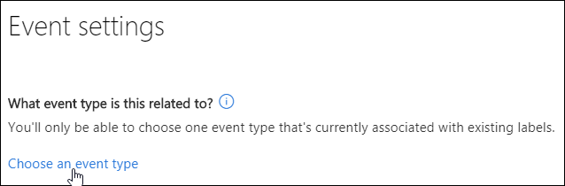

# Visão geral da retenção controlada por eventos

>*[Diretrizes de licenciamento do Microsoft 365 para segurança e conformidade](https://aka.ms/ComplianceSD).*

Quando você retém o conteúdo, o período de retenção normalmente é baseado na idade desse conteúdo. Por exemplo, você pode reter documentos por sete anos após a criação e, depois disso, excluí-los. Porém, com os rótulos de retenção do Microsoft 365, também é possível basear um período de retenção no momento em que um tipo específico de evento ocorre. O evento ativa o início do período de retenção, e todo o conteúdo com um rótulo de retenção aplicado para esse tipo de evento recebe as ações de retenção do rótulo.
  
Por exemplo, você pode usar rótulos com a retenção controlada por eventos para:
  
- **Funcionários que estão saindo da organização** Vamos supor que os registros devam ser retidos por dez anos após um funcionário sair da organização. Decorridos os dez anos, é necessário descartar todos os documentos relacionados à contratação, desempenho e rescisão desse funcionário. O evento que aciona o período de retenção de dez anos é a saída do funcionário da organização. 
    
- **Expiração do contrato** Suponhamos que todos os registros relacionados aos contratos precisem ser retidos por cinco anos a partir da expiração do contrato. O evento que dispara o período de retenção de cinco anos é a expiração do contrato. 
    
- **Vida útil do produto** Talvez sua organização tenha exigências de retenção relacionadas à última data de produção de produtos para determinados conteúdos, como especificações técnicas. Nesse caso, a última data de produção é o evento que dispara o período de retenção. 
    
Normalmente, a retenção controlada por eventos é usada como parte de um processo de gerenciamento de registros. Isso significa que:
  
- Geralmente, os rótulos baseados em eventos também classificam o conteúdo como registro. Para saber mais, consulte [Usar a Pesquisa de Conteúdo para localizar todo o conteúdo com um rótulo de retenção específico aplicado](labels.md#using-content-search-to-find-all-content-with-a-specific-retention-label-applied-to-it).
    
- Um documento declarado como um registro, mas cujo gatilho de evento ainda não aconteceu, é retido indefinidamente (registros não podem ser excluídos permanentemente), até que um evento dispare o período de retenção desse documento.
    
- Rótulos com base em eventos frequentemente disparam uma revisão de disposição ao final do período de retenção, para que um gerente de registros possa revisar e descartar manualmente o conteúdo. Para saber mais, consulte [Disposição de conteúdo](disposition.md).
    
Um rótulo de retenção baseado em um evento tem os mesmos recursos que qualquer rótulo do Microsoft 365. Para saber mais, confira [Visão geral dos rótulos](labels.md).

## Compreender a relação entre tipos de eventos, rótulos, eventos e IDs de ativos

Para usar a retenção controlada por eventos com êxito, é importante compreender a relação entre tipos de evento, rótulos, eventos e IDs de ativo, conforme ilustrado nos diagramas e explicações a seguir: 
  

  

  
1. Você cria rótulos de retenção para diferentes tipos de conteúdo e depois os associa a um tipo de evento. Por exemplo, os rótulos de retenção para diferentes tipos de arquivos e registros de produtos são associados a um tipo de evento denominado Vida útil do produto, pois esses registros devem ser retidos por 10 anos a partir do momento em que o produto atinge o final de sua vida útil.
    
2. Os usuários (normalmente gerenciadores de registros) aplicam esses rótulos de retenção ao conteúdo e (para documentos do SharePoint e OneDrive) inserem uma ID de ativo para cada item. Nesse exemplo, a ID do ativo é um nome ou código de produto usado pela organização. Assim, os registros de cada produto recebem um rótulo de retenção e cada registro tem uma propriedade que contém uma ID de ativo. O diagrama representa **todo o conteúdo** de todos os registros de produtos em uma organização e cada item tem a ID do ativo do produto cujo registro ele pertence. 
    
3. Tempo de vida do produto é o tipo de evento; um produto específico que chega ao fim da vida útil é um evento. Quando ocorre um evento desse tipo, neste caso, quando um produto atinge o final da vida útil, você cria um evento que especifica:
    
  - Uma ID de ativo (para documentos do SharePoint e do OneDrive)
    
  - Palavras-chave (para itens do Exchange). Neste exemplo, a organização usa um código de produto em mensagens que contêm registros de produto, assim, a palavra-chave para itens do Exchange é igual à ID de ativos de documentos do SharePoint e do OneDrive.
    
  - A data de ocorrência do evento. Essa data é utilizada como o início do período de retenção. Essa data pode ser a atual, do passado ou futura.
    
4. Depois de criar um evento, a data dele é sincronizada com todo o conteúdo que tem um rótulo desse tipo de evento e que contém a ID ou palavra-chave especificada do ativo. Como qualquer rótulo de retenção, essa sincronização pode levar até sete dias. No diagrama anterior, todos os itens circulados em vermelho têm o período de retenção ativado por esse evento. Em outras palavras, quando esse produto chega ao fim da vida útil, esse evento ativa o período de retenção dos registros desse produto.
    
É importante entender que, se você não especificar uma ID de ativo ou palavras-chave para um evento, **todo o conteúdo** com um rótulo de retenção desse tipo de evento terá um período de retenção ativado pelo evento. Isso significa que, no diagrama acima, todo o conteúdo começaria a ser retido. Isso pode não ser o que você pretende. 
  
Por fim, lembre-se de que cada rótulo de retenção tem suas próprias configurações de retenção. Neste exemplo, todos eles especificam dez anos, mas é possível que um evento ative rótulos de retenção onde cada rótulo tem um período de retenção diferente.
  
## Como configurar a retenção controlada por eventos

Aqui está o fluxo de trabalho de alto nível para a retenção controlada por eventos:
  

  
> [!TIP]
> Consulte [Gerenciar o ciclo de vida dos documentos do SharePoint com rótulos de retenção](auto-apply-retention-labels-scenario.md) para obter um cenário detalhado sobre como usar as propriedades gerenciadas no SharePont para aplicar automaticamente os rótulos de retenção e implementar a retenção voltada para o evento.

### Etapa 1: Criar um rótulo cujo período de retenção seja baseado em um evento

Na central de conformidade do Microsoft 365, na central de segurança do Microsoft 365 ou na Central de Conformidade &amp; Segurança, na navegação à esquerda, escolha a guia **Classificações** > **Rótulos de retenção** > **Rótulos** > **Criar um rótulo**.
  
Ao criar o rótulo, ative a retenção e escolha a opção exibida abaixo para reter ou excluir o conteúdo com base em um evento. Isso significa que as configurações de retenção não entrarão em vigor até a Etapa 5, quando você criar um evento na página **Eventos**. 
  
A retenção controlada por eventos geralmente é usada para conteúdos classificados como um registro. Por esse motivo, quando você cria rótulos com base em um evento, normalmente escolhe a opção de **Usar o rótulo para classificar o conteúdo como um "Registro"**.
  
Saiba também que a retenção controlada por eventos exige configurações de retenção que:
  
- Retêm o conteúdo.
    
- Excluem o conteúdo automaticamente, ou acionam uma revisão de disposição ao final do período de retenção.
    

  
### Etapa 2: Escolher um tipo de evento para esse rótulo

Nas configurações de rótulo, após escolher a opção para basear o rótulo em **um evento**, você verá a opção **Escolher um tipo de evento**. Um tipo de evento é simplesmente uma descrição geral de um evento ao qual você deseja associar um rótulo.
  
Por exemplo, se você criar um tipo de evento chamado Vida útil do produto, criará os rótulos baseados em eventos com nomes que descrevem a quais tipos de conteúdo você deseja aplicar os rótulos, como "Arquivos de desenvolvimento de produto" ou "Registros de decisões comerciais sobre o produto".
  
Observe que após escolher um tipo de evento e criar o rótulo de retenção, o tipo de evento não pode ser alterado.
  

  
### Etapa 3: publicar ou aplicar automaticamente os rótulos de retenção com base em eventos

Assim como qualquer rótulo, você precisa [publicar ou aplicar automaticamente](create-retention-labels.md)um rótulo com base em eventos, para que ele seja aplicado manual ou automaticamente ao conteúdo.

> [!NOTE]
> Se você selecionar um rótulo de retenção voltada para a aba**Plano de arquivo** > ** de Gerenciamento de Registros**ou de **Rótulos de dados de Governança ** > **** o botão**aplicar rótulo automaticamente** não estará disponível.
> 
> Em vez disso, use a **Aplicar um rótulo automaticamente**, acima da lista de rótulos ou políticas, de um dos seguintes locais:
> - Aba de políticas de**Gerenciamento de registros** > **de Rótulo **
> - Aba de Rótulos de**Governança de dados ** > **** ou aba de **políticas**

### Etapa 4: Inserir uma ID de ativo

Após a aplicação de um rótulo controlado por evento ao conteúdo, você pode inserir uma ID de ativo para cada item. Por exemplo, sua organização pode usar:
  
- Códigos de produto que você pode usar para reter o conteúdo apenas de um produto específico.
    
- Códigos de projeto que você pode usar para reter o conteúdo apenas de um projeto específico.
    
- IDs de funcionário que você pode usar para reter o conteúdo apenas de uma pessoa específica.
    
Compreenda que a ID de ativos é simplesmente outra propriedade do documento no SharePoint e no OneDrive for Business. Sua organização já pode usar outras propriedades do documento e IDs para classificar o conteúdo. Se assim for, você também pode usar essas propriedades e valores quando criar um evento. Confira a etapa 6 a seguir. O ponto importante é que sua organização deve usar alguma combinação de propriedade:valor nas propriedades do documento para associar esse item a um tipo de evento.
  

  
### Etapa 5: Criar um evento

Quando uma instância específica desse tipo de evento ocorrer, por exemplo, um produto chega ao fim de sua vida útil, acesse a página **Eventos de gerenciamento** > **de registros** no Centro &amp; de conformidade de segurança e crie um evento. Você precisa acionar manualmente um evento ao criá-lo.
  
### Etapa 6: Escolher o mesmo tipo de evento usado pelo rótulo na Etapa 2

Ao criar o evento, escolha o mesmo tipo de evento usado pelo rótulo de retenção na etapa 2. Por exemplo, Vida útil do produto. Somente o conteúdo com os rótulos de retenção aplicados a esse tipo de evento terá o período de retenção ativado.
  

  
### Etapa 7: Inserir palavras-chave ou IDs de ativo

Agora, restrinja o escopo do conteúdo especificando as IDs de ativo para o conteúdo do SharePoint e do OneDrive ou palavras-chave para conteúdo do Exchange. Para IDs de ativo, a retenção será imposta somente no conteúdo com o par de propriedade:valor especificado. Se uma ID de ativo não for inserida, **todo o conteúdo** com rótulos desse tipo de evento receberá a mesma data de retenção. 
  
Compreenda que a ID de Ativos é simplesmente outra propriedade do documento no SharePoint e no OneDrive for Business. Se você estiver usando a propriedade de ID de ativos, digite ComplianceAssetID: \<value\>na caixa para IDs de ativos mostrada abaixo.
  
Talvez sua organização tenha aplicado outras propriedades e IDs aos documentos relacionados a esse tipo de evento. Por exemplo, se você precisar detectar os registros de um produto específico, a ID poderá ser uma combinação de sua propriedade personalizada, ProductID, e o valor "XYZ". Nesse caso, você digitaria ProductID:XYZ na caixa de IDs de ativo mostrada abaixo.
  
Para itens do Exchange, você pode incluir palavras-chave. Refine a consulta usando os operadores de pesquisa E, OU e NÃO. Para saber mais sobre operadores, veja [Consultas de palavra-chave e condições de pesquisa para Pesquisa de Conteúdo](keyword-queries-and-search-conditions.md).
  
Por fim, escolha a data em que o evento ocorreu; essa data é usada como o início do período de retenção. Depois de criar um evento, essa data do evento é sincronizada para todo o conteúdo com um rótulo desse tipo de evento, ID do ativo e palavras-chave. Como qualquer rótulo de retenção, essa sincronização pode levar até sete dias.
  

  
## Usar a Pesquisa de Conteúdo para localizar todo o conteúdo com um rótulo ou ID de ativo específicos

Após a atribuição dos rótulos de retenção ao conteúdo, você pode usar a pesquisa de conteúdo para localizar todo o conteúdo classificado com um rótulo de retenção específico ou que contenha uma ID de ativo específica.
  
Ao criar uma pesquisa de conteúdo:
  
- Para localizar todo o conteúdo com um rótulo de retenção específico, escolha a condição **Marca de conformidade** e, em seguida, insira o nome completo do rótulo ou parte dele e use um caractere curinga. 
    
- Para localizar todo o conteúdo com uma ID de ativo específica, insira a propriedade **ComplianceAssetID** e um valor, por exemplo, ComplianceAssetID:\<value\> 
    
Para saber mais, veja [Consultas de palavra-chave e condições de pesquisa para Pesquisa de Conteúdo](keyword-queries-and-search-conditions.md).
  
## Permissões

Para acessar a página **Eventos**, os revisores devem ser membros de um grupo com a função **Gerenciamento de disposição** e a função **Logs de auditoria somente para exibição**. Recomendamos criar um novo grupo de funções denominado Revisores de disposição, adicionar essas duas funções a esse grupo e incluir membros ao grupo de funções. 
  
Para saber mais, confira [Fornecer aos usuários acesso ao Centro de Conformidade &amp; Segurança](../security/office-365-security/grant-access-to-the-security-and-compliance-center.md).
  
## Automatizar eventos usando o PowerShell

No Centro de administração, você só pode criar eventos manualmente; não é possível acionar automaticamente um evento. No entanto, você pode usar uma API de REST para acionar eventos automaticamente; para saber mais, confira [Automatizar a retenção baseada em eventos](automate-event-driven-retention.md).

Também é possível usar um script do PowerShell para automatizar a retenção com base em eventos de aplicativos de negócios. Os cmdlets do PowerShell disponíveis para retenção controlada por eventos:
  
- [Get-ComplianceRetentionEventType](https://go.microsoft.com/fwlink/?linkid=873002)
    
- [New-ComplianceRetentionEventType](https://go.microsoft.com/fwlink/?linkid=873004)
    
- [Remove-ComplianceRetentionEventType](https://go.microsoft.com/fwlink/?linkid=873005)
    
- [Set-ComplianceRetentionEventType](https://go.microsoft.com/fwlink/?linkid=873006)
    
- [Get-ComplianceRetentionEvent](https://go.microsoft.com/fwlink/?linkid=873001)
    
- [New-ComplianceRetentionEvent](https://go.microsoft.com/fwlink/?linkid=873003)
    

