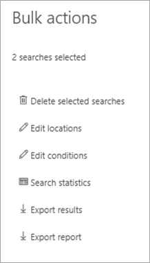

# Exportar conteúdo de um caso de descoberta eletrônica principal

Após uma pesquisa ser executada com êxito, você pode exportar os resultados da pesquisa. Quando você exporta os resultados da pesquisa, os itens da caixa de correio são baixados em arquivos PST ou como mensagens individuais. Quando você exporta conteúdo de sites do SharePoint e do OneDrive for Business, cópias de documentos nativos do Office e outros documentos são exportadas. Um arquivo de Results.csv que contém informações sobre cada item que é exportado e um arquivo de manifesto (no formato XML) que contém informações sobre cada resultado de pesquisa também é exportado.
  
Você pode exportar os resultados de uma [única pesquisa associada a um caso](#export-the-results-of-a-single-search) ou pode exportar os resultados de [várias pesquisas associadas a um caso](#export-the-results-of-multiple-searches).
  
## Exportar os resultados de uma única pesquisa

1. Acesse [https://compliance.microsoft.com](https://compliance.microsoft.com) e entre usando as credenciais da conta de usuário que receberam as permissões de descoberta eletrônica apropriadas.

2. No painel de navegação esquerdo do centro de conformidade da Microsoft 365, clique em **Mostrar tudo** e, em seguida, clique em **descoberta eletrônica > Core**.

3. Na página de **descoberta eletrônica principal** , selecione o caso para o qual você deseja exportar os resultados de pesquisa e clique em **abrir caso**.

4. Na **Home** Page do caso, clique na guia **pesquisas** .

5. Na lista de pesquisas do caso, clique na pesquisa da qual você deseja exportar os resultados da pesquisa e, em seguida, clique em **Exportar resultados** no submenu.

    A página **Exportar resultados** é exibida. 

    
  
    O fluxo de trabalho para exportar os resultados de uma pesquisa associada a um caso de descoberta eletrônica principal é o mesmo que exportar os resultados da pesquisa para uma pesquisa na página de **pesquisa de conteúdo** . Para obter instruções detalhadas, confira [Exportar resultados de pesquisa de conteúdo](export-search-results.md).

    > [!NOTE]
    > Ao exportar resultados de pesquisa, você tem a opção de habilitar a eliminação de duplicação para que apenas uma cópia de uma mensagem de email seja exportada, embora várias instâncias da mesma mensagem possam ter sido encontradas nas caixas de correio que foram pesquisadas. Para obter mais informações sobre a eliminação de duplicação e como os itens duplicados são identificados, consulte [desduplicação nos resultados da pesquisa de descoberta eletrônica](de-duplication-in-ediscovery-search-results.md).

    Depois de iniciar a exportação, os resultados da pesquisa serão preparados para download, o que significa que são carregados para um local de armazenamento do Azure fornecido pela Microsoft na nuvem da Microsoft.
  
6. Clique na guia **Exportar** para exibir a lista de trabalhos de exportação para o caso.
  
    Talvez seja necessário clicar em **Atualizar** para atualizar a lista de trabalhos de exportação para que ele mostre o trabalho de exportação que você criou. Os trabalhos de exportação têm o mesmo nome da pesquisa correspondente com o **_Export** acrescentado ao nome da pesquisa.

7. Clique no trabalho de exportação criado para exibir as informações de status na página do menu de atalho. Essas informações incluem a porcentagem de itens que foram transferidos para o local de armazenamento do Azure.

8. Após a transferência de todos os itens, clique em **baixar resultados** para baixar os resultados da pesquisa para o computador local. Para obter mais informações sobre como baixar resultados de pesquisa, consulte a etapa 2 em [Exportar resultados de pesquisa de conteúdo](export-search-results.md#step-2-download-the-search-results)

## Exportar os resultados de várias pesquisas

Como alternativa para exportar os resultados de uma única pesquisa associada a um caso, você pode exportar os resultados de várias pesquisas do mesmo caso em um único trabalho de exportação. Exportar os resultados de várias pesquisas é mais rápido e mais fácil do que exportar os resultados uma pesquisa de cada vez.
  
> [!NOTE]
> Você não pode exportar os resultados de várias pesquisas se uma dessas pesquisas foi configurada para pesquisar locais em espera.

1. Acesse [https://compliance.microsoft.com](https://compliance.microsoft.com) e entre usando as credenciais da conta de usuário que receberam as permissões de descoberta eletrônica apropriadas.

2. No painel de navegação esquerdo do centro de conformidade da Microsoft 365, clique em **Mostrar tudo** e, em seguida, clique em **descoberta eletrônica > Core**.

3. Na página de **descoberta eletrônica principal** , selecione o caso para o qual você deseja exportar os resultados de pesquisa e clique em **abrir caso**.

4. Na **Home** Page do caso, clique na guia **pesquisas** .
    
5. Na lista de pesquisas do caso, marque a caixa de seleção ao lado de duas ou mais pesquisas das quais você deseja exportar os resultados da pesquisa. 

   A página de submenu **ações em massa** é exibida. 

    
  
6. Clique em **Exportar resultados**.

   A página **Exportar resultados** é exibida. 

    
  
    Neste ponto, o fluxo de trabalho para exportar os resultados de várias pesquisas associadas a um caso de descoberta eletrônica principal é o mesmo que exportar os resultados da pesquisa para uma única pesquisa. Consulte a etapa 5 da seção anterior.

### Mais informações sobre como exportar os resultados de várias pesquisas

- Quando você exporta os resultados de várias pesquisas, as consultas de pesquisa de todas as pesquisas são combinadas usando operadores **ou** e, em seguida, a pesquisa combinada é iniciada. Os resultados estimados da pesquisa combinada são exibidos na página de submenu do trabalho de exportação selecionado. Os resultados da pesquisa são copiados para o local de armazenamento do Azure na nuvem da Microsoft. O status do trabalho de cópia também é exibido na página de submenu. Conforme mencionado anteriormente, após todos os resultados da pesquisa terem sido copiados, você pode baixá-los para um computador local.

- O número máximo de palavras-chave de consultas para todas as pesquisas que você deseja exportar é 500. Esse é o mesmo limite para uma única pesquisa. Isso ocorre porque o trabalho de exportação combina todas as consultas de pesquisa usando o operador **or** . Se você exceder esse limite, um erro será retornado. Nesse caso, você precisa exportar os resultados de menos pesquisas ou simplificar as consultas de pesquisa das pesquisas originais que você deseja exportar.

- Os resultados de pesquisa que são exportados são organizados pelo local de conteúdo no qual o item foi encontrado. Isso significa que um local de conteúdo nos resultados da exportação pode ter itens retornados por pesquisas diferentes. Por exemplo, se você optar por exportar mensagens de email em um arquivo PST para cada caixa de correio, o arquivo PST poderá ter resultados de várias pesquisas.

- Se o mesmo item de email ou documento do mesmo local de conteúdo for retornado por mais de uma das pesquisas que você exportou, somente uma cópia do item será exportada.

- Você não pode editar uma exportação para várias pesquisas após criá-la. Por exemplo, não é possível adicionar ou remover pesquisas do trabalho de exportação. Você precisa criar um trabalho de exportação para alterar quais resultados de pesquisa são exportados. Após a criação de um trabalho de exportação, você só pode baixar os resultados para um computador, reiniciar a exportação ou excluir o trabalho de exportação.

- Se você reiniciar a exportação, todas as alterações nas consultas das pesquisas que compõem o trabalho de exportação não afetarão os resultados da pesquisa recuperados. Quando você reinicia uma exportação, o mesmo trabalho combinado de consulta de pesquisa que foi executado quando o trabalho de exportação foi criado será executado novamente.

- Além disso, se você reiniciar uma exportação, os resultados de pesquisa que são copiados para o local de armazenamento do Azure substituirão os resultados anteriores. Os resultados anteriores que foram copiados não estarão disponíveis para download.
