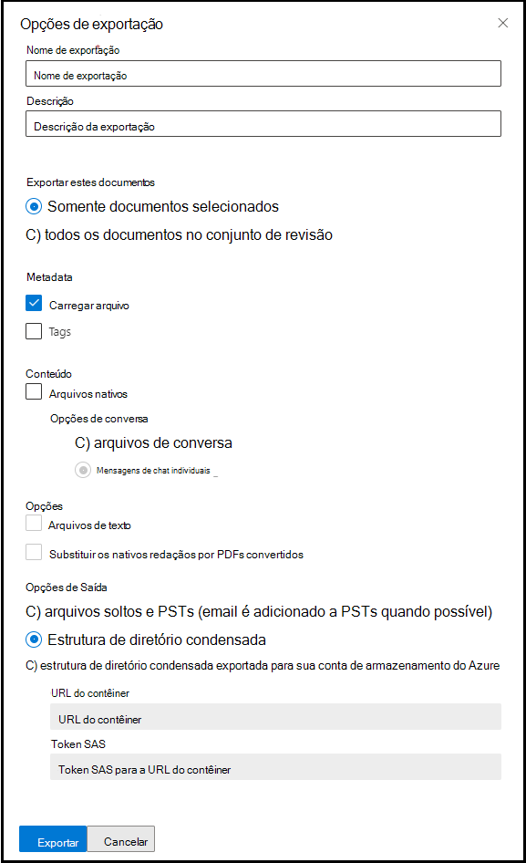

# Exportar documentos de um conjunto de revisão em Descoberta Avançada

Exportar permite que os usuários personalizem o conteúdo incluído no pacote de download. A ferramenta Exportar fornece uma página de configuração com as seguintes configurações:

## Opções de exportação

- Nome da exportação: nome do trabalho de exportação.

- Descrição: campo texto livre para você adicionar uma descrição.

- Exporte esses documentos:

  - Somente documentos selecionados - Exporta apenas os documentos que estão selecionados no momento.
  
  - Todos os documentos no conjunto de revisão - Exporta todos os documentos no conjunto de revisão

- Metadata
  
  - Arquivo de carga - Este arquivo contém metadados para cada arquivo. Para obter mais informações sobre quais campos estão incluídos, consulte [Campos de metadados de documento em Descoberta Avançada de eDiscovery](document-metadata-fields-in-Advanced-eDiscovery.md). Normalmente, esse arquivo pode ser ingerido por ferramentas de Descoberta eDiscovery de terceiros.
  
  - Marcas - Quando selecionado, as informações de marcação serão incluídas no arquivo de carga.

- Conteúdo
  
  - Arquivos nativos - Selecione essa caixa de seleção para incluir os arquivos nativos.
  
  - Opções de conversa
    
    - Arquivos de conversa - Exportar mensagens de chat reconstruídas. Esse formato apresenta conversas em um formulário que se parece com o que os usuários veem no aplicativo nativo.
    
    - Mensagens de chat individuais - Exporte os arquivos de conversa originais à medida que são armazenados no Microsoft 365.

- Opções

  - Arquivos de texto - Inclua versões de texto extraídas de arquivos nativos.
  
  - Substitua os nativos redacted por PDFs convertidos - Se os arquivos PDF redacted são gerados durante a revisão, esses arquivos estão disponíveis para exportação. Você pode optar por exportar apenas os arquivos nativos que foram editados (não selecionando essa opção) ou pode selecionar essa opção para exportar os arquivos PDF que contêm as redação reais.

- Opções de saída (O conteúdo exportado está disponível para download diretamente por meio de um navegador da Web ou pode ser enviado para uma conta de Armazenamento do Azure. As duas primeiras opções habilitam o download direto.)
  
  - Arquivos soltos e PSTs (o email é adicionado a PSTs quando possível) - Os arquivos são exportados em um formato que se parece com a estrutura de diretório original vista pelos usuários em seus aplicativos nativos.  Para obter mais informações, consulte a seção Arquivos Soltos e estrutura de [exportação PST.](#loose-files-and-pst-export-structure)
  
  - Estrutura de diretório condensado - Os arquivos são exportados e incluídos no download.
  
  - Estrutura de diretório condensada exportada para sua conta de Armazenamento do Azure - Os arquivos são exportados para a conta de Armazenamento do Azure da sua organização.

## Arquivos soltos e estrutura de exportação PST

Se você selecionar essa opção de exportação, o conteúdo exportado será organizado na seguinte estrutura:

- Pasta raiz – Esta pasta no nome ExportName.zip
  
  - Export_load_file.csv - Arquivo de metadados.
  
  - Summary.csv - Um arquivo de resumo que também contém estatísticas de exportação.
  
  - Exchange - Essa pasta contém todo o conteúdo do Exchange no formato de arquivo nativo. Os arquivos nativos serão substituídos por PDFs redacionados se você tiver selecionado a opção Substituir nativos **redacted por PDFs convertidos.**
  
  - SharePoint = Esta pasta contém todo o conteúdo nativo do SharePoint em um formato de arquivo nativo. Os arquivos nativos serão substituídos por PDFs redacionados se você tiver selecionado a opção Substituir nativos **redacted por PDFs convertidos.**

## Estrutura de diretório condensado

- Pasta raiz - Essa pasta é nomeada ExportName.zip
  
  - Export_load_file.csv - Arquivo de metadados.
  
  - Summary.txt - Um arquivo de resumo que também contém estatísticas de exportação.
  
  - Input_or_native_files - Esta pasta contém todos os arquivos nativos que foram exportados. Se você exportar arquivos PDF editados, eles não serão colocados em arquivos PST. Em vez disso, eles são adicionados a uma pasta separada.
  
  - Error_files - Esta pasta contém os seguintes arquivos de erro, se eles são incluídos na exportação:
    
    - ExtractionError. Um arquivo CSV que contém todos os metadados disponíveis de arquivos que não foram extraídos corretamente de arquivos pai.
    
    - ProcessingError – Este arquivo contém uma lista de documentos com erros de processamento. Esse conteúdo é de nível de item, ou seja, se um anexo resultou em um erro de processamento, a mensagem de email que contém o anexo será incluída nessa pasta.
  
  - Extracted_text_files - Essa pasta contém todos os arquivos de texto extraídos que foram gerados no processamento.

> [!NOTE]
> Os trabalhos de exportação são mantidos durante a vida útil do caso. No entanto, você deve baixar o conteúdo de um trabalho de exportação dentro de 30 dias após a conclusão do trabalho de exportação.
